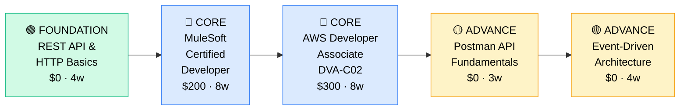

# How to Become an API / Integration Developer

**`CP52`** · **Software Engineering** · _Time to hire: 12–18 months_ · _Entry cost: $1,000–$1,500 USD_

> **Path summary:** This path takes you from developer to a hired API/Integration Developer specializing in connecting systems, building APIs, and managing integrations between enterprise applications. You'll master API design, integration platforms (MuleSoft, Postman, Zapier), and enterprise patterns, in 12–18 months.

---

## Role Overview

### What does an API / Integration Developer actually do?

An API/Integration Developer builds the connections between systems. Your day involves designing APIs that other systems will consume, building integrations that connect legacy databases to modern SaaS platforms, debugging data flows, and ensuring data consistency across disparate systems. You're the person who makes it so that when a customer is created in Salesforce, they automatically appear in the accounting system. You build APIs that partners and internal teams consume. Tools: REST/GraphQL APIs, integration platforms (MuleSoft, Apache Camel), Postman, Python/Node.js, API gateways, event streaming (Kafka), Git.

API/Integration Developers work on teams of 3–8, often in enterprise IT or platform engineering roles. The role is remote-friendly (70%+). You may be on-call for failed integrations—when data stops flowing between systems, you're paged. You collaborate with backend developers (who build systems you're integrating), business analysts (who define integration requirements), and QA/operations (who test integrations). This is a technical role requiring systems thinking and strong communication.

### Demand in 2026

- **Global job postings:** 14,000+ active API/Integration Developer roles on LinkedIn as of May 2026 [(source)](https://www.linkedin.com/jobs/search/?keywords=API%20Integration%20Developer)
- **Growth rate:** 16% YoY / Strong demand as enterprises digitally transform [(source)](https://www.bls.gov/ooh/computer-and-information-technology/)
- **South Africa:** Growing demand. Banks (Nedbank, ABSA), retailers (Shoprite, Takealot), telcos (MTN, Vodacom) all need integration engineers as they modernize legacy systems.
- **Remote availability:** 72% of roles are remote/hybrid.

---

## Who Is This Path For?

### Ideal starting backgrounds

| Background | Readiness | What you already have |
|---|---|---|
| Backend Developer | ✅ Strong start | API development fundamentals; add integration specialization |
| Enterprise Developer | ✅ Strong start | Familiarity with enterprise systems; add modern integration patterns |
| Systems Administrator | 🟡 Good with gaps | Systems knowledge; needs API and programming skills |
| Junior Software Engineer | ✅ Strong start | Programming fundamentals; add API and integration focus |
| Database Administrator | 🟡 Possible | Database knowledge; needs API and integration paradigm |
| IT Support / Help Desk | 🟡 Possible | Systems thinking; need programming and API depth |

### You're ready to start this path if you can:
- Write Python/JavaScript/Java code with functions and error handling
- Understand REST API principles (HTTP methods, status codes, JSON)
- Work with JSON and XML data formats
- Query databases with SQL
- Use Git and command line comfortably
- Understand HTTP and networking basics

> **Not ready yet?** Start with [Backend Developer path (CP49 Stage 1)](CP49_SoftEng_Backend_Developer.md) or [REST API fundamentals](https://restfulapi.net/) first.

---

## Certification Sequence

### Visual path

---

### Stage 1 — Foundation (Months 0–2)

**Goal:** Master REST API principles and HTTP fundamentals.

| Cert | Code | Cost (USD) | Study Time | Why it matters |
|---|---|---:|---:|---|
| REST API Fundamentals | — | $0 | 3–4 weeks | Foundation for all API work; understand HTTP, JSON, REST principles |
| API Design Best Practices | — | $0 | 2–3 weeks | Learn how to design APIs that are usable and maintainable |

**Stage 1 total:** $0 USD · R0 ZAR · 2–3 months

**Study approach:** Use [RESTful API Design](https://restfulapi.net/) (free, comprehensive), [HTTP MDN Guide](https://developer.mozilla.org/en-US/docs/Web/HTTP) (free), and [OpenAPI Specification](https://swagger.io/specification/) (free). Read [API Design Best Practices](https://swagger.io/resources/articles/best-practices-in-api-design/). Build hands-on: create a simple REST API using Python (Flask) or Node.js (Express) that demonstrates REST principles.

**Lab requirement:** Build 2 simple REST APIs: 1) CRUD API for a resource (users, products), 2) API that integrates with a third-party service (weather API, payment processor). Use Postman to test. Document with Swagger/OpenAPI. Post to GitHub. 15+ hours hands-on.

---

### Stage 2 — Core Specialisation (Months 2–12)

**Goal:** Get MuleSoft and AWS certifications. Prove enterprise integration skills.

| Cert | Code | Cost (USD) | Study Time | Why it matters |
|---|---|---:|---:|---|
| MuleSoft Certified Developer Level 1 | — | $200 | 8–10 weeks | MuleSoft is the leading integration platform; highly demanded in enterprises |
| AWS Certified Developer Associate | `DVA-C02` | $300 | 8–10 weeks | Cloud deployment and AWS API Gateway; essential for modern integrations |

**Stage 2 total:** $500 USD · R9,000 ZAR · 8–10 months

**Study approach:** For MuleSoft, use [MuleSoft Trailhead](https://trailhead.salesforce.com/en/users/00550000007sZKA/trailmixes/mulesoft-platform-basics) (free, official training) or [Udemy MuleSoft course](https://www.udemy.com/course/complete-mulesoft-tutorial-mulesoft-for-beginners/) ($15). The cert covers: designing integrations, Mule runtime, connectors, error handling. For AWS DVA-C02, use [Stephane Maarek's course](https://www.udemy.com/course/aws-certified-developer-associate-dva-c02/) ($20) and focus on API Gateway, Lambda, SQS (message queues), and integration services.

**Project milestone:** Build an end-to-end integration solution. Example: create a MuleSoft/AWS integration that connects a legacy database to a modern SaaS platform (Salesforce, NetSuite, etc.). Include: API design, data transformation, error handling, monitoring, deployment. Document architecture and design decisions. Post to GitHub. This demonstrates production-ready integration thinking.

---

### Stage 3 — Advanced Specialisation (Months 10–18)

**Goal:** Deepen in API security, event-driven architecture, and specialized integration patterns.

| Cert | Code | Cost (USD) | Study Time | Why it matters |
|---|---|---:|---:|---|
| Postman API Fundamentals Student Expert | — | $0 | 2–3 weeks | API testing and documentation tool; nearly universal in industry |
| Event-Driven Architecture & Streaming | — | $0 | 4–5 weeks | Modern integrations use events/streams; Kafka, RabbitMQ, AWS SNS/SQS |
| API Security (OAuth, API Keys) | — | $0 | 3–4 weeks | Critical for production APIs; authentication, rate limiting, security |

**Stage 3 total:** $0 USD · R0 ZAR · 8–10 months

**Study approach:** Postman cert is free—use [Postman Academy](https://academy.postman.com/). Event-driven architecture: read [Event-Driven Architecture](https://www.nginx.com/blog/event-driven-architecture/) and learn Kafka via [Kafka Official Docs](https://kafka.apache.org/documentation/) (free). API security: read [OAuth 2.0 Simplified](https://aaronparecki.com/oauth-2-simplified/) (free) and [API Security Best Practices](https://swagger.io/resources/articles/best-practices-in-api-security/).

> **Optional at hire time:** Many API/Integration developers land jobs after Stage 2 (MuleSoft + AWS DVA-C02 + portfolio) and deepen in Stage 3 on the job.

---

## Timeline & Cost Summary

| Stage | Certs | Duration | Cost (USD) | Cost (ZAR) |
|---|---|---|---:|---:|
| Stage 1 — Foundation | REST API, API Design | Months 0–2 | $0 | R0 |
| Stage 2 — Core | MuleSoft Certified Dev, DVA-C02 | Months 2–12 | $500 | R9,000 |
| Stage 3 — Advanced | Postman, Event-Driven, API Security | Months 10–18 | $0 | R0 |
| **Total to hireable** | | **12–16 months** | **$500** | **R9,000** |

**Study hours required:** ~400–450 hours. Assumes 12 hours/week = 16 months.

---

## Salary Progression

> All figures: median base salary, not including bonuses/equity. ZAR = USD × 18. Sources: Robert Half 2026, Levels.fyi, LinkedIn Salary.

| Experience Level | USD/year | ZAR/month | GBP/year | EUR/year | AUD/year |
|---|---:|---:|---:|---:|---:|
| Entry / Junior (0–2 yrs) | $70,000–$105,000 | R45,000–R67,000 | £54,000–€81,000 | €65,000–€98,000 | A$103,000–A$154,000 |
| Mid-level (2–5 yrs) | $105,000–$150,000 | R67,000–R96,000 | €81,000–€116,000 | €98,000–€141,000 | A$154,000–A$220,000 |
| Senior (5–8 yrs) | $150,000–$210,000 | R96,000–R134,000 | £116,000–€163,000 | €141,000–€198,000 | A$220,000–A$309,000 |
| Lead / Architect (8+ yrs) | $210,000–$280,000+ | R134,000–R179,000+ | £163,000–€217,000+ | €198,000–€264,000+ | A$309,000–A$412,000+ |

**South Africa note:** API/Integration Developers at Johannesburg banks (Nedbank, ABSA) earn R50,000–R80,000/month for entry, R80,000–R130,000/month for mid-level. Enterprise consulting roles (Deloitte, EY) may pay slightly higher. Remote roles for international companies: R70,000–R120,000/month for entry, R120,000–R180,000/month for mid-level. Integration is more enterprise-focused than pure software engineering; good job stability and growth.

**Salary accelerators:** MuleSoft expertise, AWS/Azure/GCP multi-cloud knowledge, event-driven architecture skills, API security expertise, and proven ability to manage complex integrations all command 15–25% premiums.

---

## First Job Strategy

### Month 0–4: Build Your API Foundation

1. **Master REST API principles** — [RESTful API Design](https://restfulapi.net/) (free) + [HTTP MDN Guide](https://developer.mozilla.org/en-us/docs/Web/HTTP) (free). 4–5 weeks.
2. **Learn to build APIs** — Use Python Flask or Node.js Express. Build 2 simple APIs. 4–5 weeks.
3. **Master Postman** — The API testing/documentation tool. [Postman Learning Center](https://learning.postman.com/). Use it to test every API you build.
4. **Understand API standards** — OpenAPI/Swagger, JSON Schema, API versioning strategies.
5. **Join communities** — r/webdev, r/APIs, API design forums, Postman community.

### Month 4–10: Build Your Integration Portfolio

- **Project 1: CRUD API with Postman Collection** — Build a REST API (products, orders). Document with Postman. Create a comprehensive Postman collection showing all endpoints, tests, and examples. Estimated time: 10 hours.
- **Project 2: Third-Party API Integration** — Build an application that integrates with 2–3 third-party APIs (Stripe for payments, Slack for notifications, AWS S3 for files). Include: authentication (API keys, OAuth), error handling, rate limiting. Estimated time: 12 hours.
- **Project 3: MuleSoft or Apache Camel Integration** — Build a simple integration flow connecting two systems (database to API, file to database, etc.). Document data transformations, error handling. Estimated time: 10 hours.

### Month 10–16: Pursue Certifications

- **MuleSoft Certified Developer:** Study 8–10 weeks. Use [MuleSoft Trailhead](https://trailhead.salesforce.com/).
- **AWS DVA-C02:** Study 8–10 weeks. Use [Stephane Maarek's course](https://www.udemy.com/course/aws-certified-developer-associate-dva-c02/).
- **Postman Expert:** Free certification from [Postman Academy](https://academy.postman.com/).
- **CV positioning:** List as "API / Integration Developer" once you have MuleSoft cert + AWS cert + portfolio. Highlight REST APIs, integrations, Postman, MuleSoft.

### Month 16–18: Apply & Iterate

- **Target companies:** Banks (Nedbank, ABSA, Standard Bank), retailers (Shoprite, Takealot), telcos (MTN, Vodacom), insurance companies, consulting firms (Deloitte, EY, Accenture). Integration is heavily enterprise-focused.
- **Interview prep:** Be ready to discuss 1) An integration you designed (requirements, architecture, data flows), 2) Error handling and monitoring in integrations, 3) API design principles, 4) Security (auth, rate limiting), 5) Scaling integrations.
- **Salary negotiation:** Integration roles in enterprises tend to have standard pay bands. Entry-level offers R50k–R80k/month locally; remote international R70k–R120k/month. Negotiate based on certs and portfolio.

---

## A Day in the Life

### API Integration Developer at Nedbank (Johannesburg) — Junior Level

**08:00** — Standup with the integration team. You're building an API that will be consumed by third-party fintech partners.

**09:00** — Design review. Sketch the API contract: endpoints, request/response formats (JSON), authentication (OAuth 2.0), error responses. Get feedback from the team.

**10:00** — Use Postman to design the API specification. Create a comprehensive collection with all endpoints, example requests/responses, and documentation.

**11:00** — Implement the API in Python (Flask). Add OAuth authentication middleware. Implement rate limiting to prevent abuse.

**12:30** — Lunch.

**13:30** — Add data transformation logic. API accepts requests in one format; need to transform to internal banking system format before sending to backend.

**14:30** — Error handling. What if the backend is down? What if the request is malformed? Add comprehensive error responses.

**15:30** — Write unit tests. Postman Newman for API testing. Run tests in CI/CD pipeline.

**16:00** — Code review with a senior developer. Feedback: improve error messages, add more comprehensive logging, document the API better. You revise.

**16:45** — Deploy to staging. Partner team tests the API. Feedback: they request a new field in the response. You add it and redeploy.

**17:15** — End of day. API ready for production deployment tomorrow.

### API Integration Developer at a London/Cape Town Tech Company (Remote) — Mid Level

**09:00** — Async standup. You're redesigning the data pipeline to use event-driven architecture instead of batch jobs. Will use Kafka for event streaming.

**09:30** — Architecture design. Draw the new flow: system A publishes events to Kafka topic → consumers (your service) subscribe and transform events → write to database. Benefits: real-time, scalable, decoupled.

**10:30** — Set up Kafka cluster locally (or use cloud Kafka). Create topics. Implement Kafka producer in system A, consumer in your service.

**11:30** — Implement event schema using Avro or Protocol Buffers. Events are typed and validated.

**12:00** — Lunch.

**13:00** — Integration testing. Generate test events, consume them, verify transformation logic, verify database writes. All working.

**14:30** — Performance testing. 1000 events/sec. Monitor latency, throughput, error rates. Optimize consumer logic.

**15:30** — Error handling and dead-letter queue. What happens if an event fails to process? Implement retry logic and DLQ.

**16:30** — Documentation. Write architecture documentation. Create Postman collection for testing. Add runbooks for operations.

**17:00** — Pair programming with junior developer. They're implementing a new API endpoint that will publish events. Code review and feedback.

**17:30** — All tests pass. Deploy to staging. Monitor for issues. Good. Plan: production deployment tomorrow.

---

## Related Paths & Progressions

| From here you can move to… | Why |
|---|---|
| [Backend Developer (CP49)](CP49_SoftEng_Backend_Developer.md) | Generalize; focus on building systems rather than integrations |
| [Full-Stack Developer (CP51)](CP51_SoftEng_Full_Stack_Developer.md) | Broaden skills; add frontend and full-stack thinking |
| [DevOps / Platform Engineer] | Focus on infrastructure and deployment |
| [Solutions Architect / Integration Architect] | After 5+ years, design enterprise integration strategies |

---

## South Africa Context

### Market specifics

API/Integration Developer is a growing role in South African enterprises undergoing digital transformation. Banks (Nedbank, ABSA, Standard Bank, FNB) all modernizing legacy systems and need integration engineers. Retailers (Shoprite, Pick n Pay, Takealot), telcos (MTN, Vodacom, Telkom), and government agencies (SARS, Eskom) also hiring.

MuleSoft is the dominant integration platform in enterprise SA. Demand is steady and salaries are good. Integration is less trendy than data science or AI but more stable with broader enterprise applicability.

Remote work is available but less common than for pure software engineers. Many integration roles are onsite or hybrid in major cities (Johannesburg, Cape Town, Durban). However, remote opportunities exist with international companies.

### SA-specific resources

| Resource | URL | Note |
|---|---|---|
| Johannesburg Integration Developers Meetup | [meetup.com/johannesburg-integration](https://www.meetup.com/johannesburg-integration/) | Monthly meetups, networking |
| MuleSoft Trailhead (Free) | [trailhead.salesforce.com](https://trailhead.salesforce.com/en/users/00550000007sZKA/trailmixes/mulesoft-platform-basics) | Official MuleSoft training |
| Postman Academy | [academy.postman.com](https://academy.postman.com/) | Free Postman certification |
| Nedbank Careers (Integration) | [nedbank.co.za/careers](https://www.nedbank.co.za/careers) | Regular integration postings |
| Deloitte Consulting (SA) | [deloitte.com/za](https://www.deloitte.com/za/) | Integration consulting roles |
| LinkedIn API/Integration Jobs (SA) | [linkedin.com/jobs](https://www.linkedin.com/jobs/search/?location=South%20Africa&keywords=API%20Integration%20Developer) | Job board, 40+ postings |

---

## Frequently Asked Questions

**Q: Do I need a degree to become an API/Integration Developer?**

No. Many integration developers come from bootcamps or self-taught backgrounds. MuleSoft certification and hands-on experience matter more than a degree.

**Q: Is MuleSoft the only integration platform I need to know?**

MuleSoft is most popular in enterprise. But learn the fundamentals: API design, data transformation, integration patterns. These transfer to Apache Camel, AWS integration, Azure Logic Apps, etc.

**Q: How is API/Integration Developer different from Backend Developer?**

Backend = building applications, systems, business logic. API/Integration = connecting existing systems, designing APIs others consume, data transformation. Different focus but overlapping skills.

**Q: How long from zero?**

12–18 months if starting from programming background. If you're completely new to tech: 18–24 months.

**Q: Should I focus on MuleSoft or cloud integrations (AWS, Azure)?**

Start with MuleSoft (more enterprise demand in SA) and REST API fundamentals. Then add cloud (AWS/Azure) for modern/startup roles. Both are valuable.

---

## Sources & Further Reading

| # | Source | URL | Used for |
|---|---|---|---|
| 1 | LinkedIn Jobs (API Integration) | [linkedin.com/jobs](https://www.linkedin.com/jobs/search/?keywords=API%20Integration%20Developer) | Job market data |
| 2 | RESTful API Design | [restfulapi.net](https://restfulapi.net/) | API fundamentals (free) |
| 3 | MuleSoft Trailhead | [trailhead.salesforce.com](https://trailhead.salesforce.com/en/users/00550000007sZKA/trailmixes/mulesoft-platform-basics) | Official MuleSoft training (free) |
| 4 | Postman Learning Center | [learning.postman.com](https://learning.postman.com/) | API testing tool |
| 5 | AWS DVA-C02 Exam | [aws.amazon.com/certification](https://aws.amazon.com/certification/certified-developer-associate/) | Developer cert for cloud |
| 6 | OpenAPI Specification | [swagger.io/specification](https://swagger.io/specification/) | API design standard |
| 7 | Robert Half 2026 Salary Guide | [roberthalf.com](https://www.roberthalf.com/salary-guide) | Salary benchmarks |
| 8 | Levels.fyi Integration Engineer | [levels.fyi](https://www.levels.fyi/jobs/integration-engineer) | Salary transparency |

---

*Template version: 2026-05-02 | Maintained by IT Career Roadmap | ZAR baseline: R18/$1 USD*
*File naming: Career_Paths/CP52_SoftEng_API_Integration_Developer.md*
