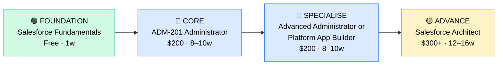

# How to Become a Salesforce Administrator

**`CP53`** · **Enterprise Apps** · _Time to hire: 6–12 months_ · _Entry cost: $200–$350 USD_

> **Path summary:** This path takes you from zero or a support/admin background to a hired Salesforce Administrator in 6–12 months, making it one of the fastest and most accessible entry points into enterprise software. Salesforce Trailhead is free, and employers actively hire people straight off certifications with no prior Salesforce experience.

---

## Role Overview

### What does a Salesforce Administrator actually do?

A Salesforce Administrator owns the day-to-day management of a company's Salesforce instance — the cloud platform that handles sales pipelines, customer service, marketing automation, and commerce. You configure custom fields, manage user accounts, create reports and dashboards that executives rely on, maintain data quality, and troubleshoot when something breaks. You're not coding (that's the Developer role), but you're deeply familiar with configuration, workflow automation, and how business processes map onto Salesforce's capabilities. On any given day, you're customizing a sales dashboard for the VP of Sales, helping a user reset their password, running data cleanup scripts, deploying changes through a sandbox, and joining business requirements meetings where you translate "we need to track this" into Salesforce configurations.

Salesforce Administrators work in Sales, Service Cloud, Commerce, or Platform contexts depending on the organisation. You're the translator between business teams ("we need our sales team to log activities automatically") and the system. You're hands-on with the configuration UI, but also have to understand Salesforce's data model, permission sets, and workflow automation concepts at a deep level. It's a blend of technical skill, business acumen, and problem-solving — which is why it's so in-demand.

### Where do they work?

Salesforce Administrators work everywhere Salesforce is deployed — which is to say, most mid-to-large enterprises, and many startups. You'll find them in sales operations teams, customer success teams, or shared IT/business operations centers. Team sizes vary wildly: at a 500-person company you might be one of three Salesforce specialists on a 10-person team; at a 5,000-person enterprise you might be one of 20+ Salesforce professionals. Remote work is extremely common — Salesforce is a cloud-based platform, so there's no reason to sit in an office. Most Salesforce Administrator roles are hybrid or fully remote, and the role is not on-call heavy; occasional evenings or weekends for deployments, but nothing like infrastructure ops.

### Demand in 2026

- **Global job postings:** 12,000+ active roles on LinkedIn as of May 2026 [LinkedIn Jobs](https://www.linkedin.com/jobs/)
- **Growth rate:** 8–10% YoY; Salesforce ecosystem jobs are growing faster than traditional IT due to the shift to cloud-first business processes
- **South Africa:** Strong demand. Nedbank, Standard Bank, ABSA, Capitec, and FNB all use Salesforce; so do major insurers like Discovery and Old Mutual. Dimension Data, BCX, and EOH resell Salesforce and hire Administrators constantly. Q1 2026 job listings show 40–50 open Salesforce Admin roles in SA.
- **Remote availability:** Very high — 75%+ of Salesforce Administrator roles globally are remote or hybrid. SA-based Admins regularly contract to UK/US companies.

---

## Who Is This Path For?

### Ideal starting backgrounds

| Background | Readiness | What you already have |
|---|---|---|
| IT Support / Help Desk | ✅ Excellent start | User support mindset, troubleshooting discipline, change management experience |
| Business Analyst | ✅ Excellent start | Requirements gathering, process mapping, user communication skills |
| Office Administrator / Operations | ✅ Good start | Data management, user management basics, cross-team communication |
| Recent graduate (any discipline) | 🟡 Possible with gaps | Smart learner; needs hands-on Trailhead labs to build intuition |
| Sales Operations background | ✅ Ideal background | You understand the workflows; Salesforce is just the tool |
| Developer transitioning to operations | ✅ Good start | You can understand the deeper architecture; may need to slow down for business side |
| Complete career changer | 🟡 Possible | Will take 3–4 months of foundational learning, but Trailhead is designed for this |

### You're ready to start this path if you can:
- Navigate Windows/Mac and web applications comfortably (Gmail, Google Sheets, basic spreadsheets)
- Understand basic data concepts (rows, columns, relationships between datasets)
- Explain what a CRM does in general terms (tools that track customer interactions)
- Learn new software quickly without hand-holding

> **Not ready yet?** Spend 2–4 weeks on general business software literacy: Google Sheets, basic Excel, and how enterprises use cloud software. Then return to this path.

---

## Certification Sequence

### Visual path

---

## Stage 1 — Foundation (Months 0–2)

**Goal:** Get comfortable with Salesforce's basic concepts and UI before attempting any certification. This stage is almost entirely free and builds your intuition.

| Cert / Learning | What it is | Cost (USD) | Study Time | Why it matters |
|---|---|---:|---:|---|
| Salesforce Trailhead — Admin Basics | Free interactive learning platform by Salesforce | $0 | 20–30 hours | Teaches the fundamentals of Salesforce configuration, user management, and the UI; designed by Salesforce and essential context before the real exam |
| Salesforce Fundamentals | Entry-level certification (exam optional but recommended) | $0–$40 (exam) | 2–3 weeks | Proves you understand what Salesforce is, its cloud architecture, and why companies use it |

**Stage 1 total:** $0–$40 USD · R0–R720 ZAR · 4–8 weeks

**Study approach:** Log into Trailhead (free account at trailhead.salesforce.com) and complete the "Admin Basics" trail. This is interactive learning with embedded labs — you actually build things in a Salesforce sandbox, not just watch videos. Spend 5–7 hours per week on Trailhead. Join the Salesforce Trailhead community (Discord or Reddit r/salesforce) and ask questions. **Do not skip the labs.** This is the difference between understanding Salesforce and passing exams on rote memorization.

**Lab requirement:** Create a free Salesforce Developer Edition account (at developer.salesforce.com) and complete all the hands-on labs in Trailhead's Admin Basics trail. You must have touched: creating custom objects, building relationships, managing users, understanding the permission model, and creating a basic report. This isn't optional — Salesforce exams assume you've done this.

---

## Stage 2 — Core Specialisation: Salesforce Certified Administrator (Months 2–6)

**Goal:** Pass the ADM-201 exam and become a Salesforce Certified Administrator. This is the anchor credential that hiring managers look for.

| Cert | Code | Cost (USD) | Study Time | Why it matters |
|---|---|---:|---:|---|
| Salesforce Certified Administrator | `ADM-201` | $200 | 8–10 weeks | This is the credential every Salesforce Admin has. Employers expect it on day one in most roles. Covers user management, customization, data management, security, automation, and reporting. |

**Stage 2 total:** $200 USD · R3,600 ZAR · 8–12 weeks

**Study approach:** Combine three resources: (1) Salesforce Trailhead's "Salesforce Certified Administrator" trail (free), (2) Andrew Fawcett or similar Udemy course ($12–15) for a structured overview, (3) practice exams. The exam is 60 multiple-choice questions, 90 minutes, 65% pass rate. You need to score 65/100 to pass; most people score in the 70–80% range if well-prepared. **Critical:** do 100+ practice questions. Use Salesforce's official practice exam ($40, included with exam voucher bundles), then Udemy practice exams. Schedule the exam when you're consistently scoring 75%+ on practice tests. Plan 10–12 hours/week for 8–10 weeks.

**Project milestone:** Deploy a custom object with relationships, validation rules, and a workflow automation. Example: Build a "Case Priority Escalation" system where high-priority cases trigger an automated task assignment to a manager. Document it with screenshots and a short README. Post to GitHub or your portfolio blog — you'll show this in interviews.

---

## Stage 3 — Advanced Specialisation (Months 6–12)

**Goal:** Differentiate yourself by adding a second, complementary certification. Choose **either** Advanced Administrator (deeper admin skills) **or** Platform App Builder (intro to customization for admins without code).

| Cert | Code | Cost (USD) | Study Time | Why it matters |
|---|---|---:|---:|---|
| Salesforce Certified Advanced Administrator | `ADM-211` | $200 | 8–10 weeks | Deeper topics: advanced sharing rules, delegated administration, custom apps, governor limits, performance tuning, advanced reporting. Employers hire Advanced-certified Admins for larger orgs. |
| Salesforce Certified Platform App Builder | `PAB-101` | $200 | 8–10 weeks | Low-code app building: Flows, Lightning Components, Process Builder. Growing in demand as Salesforce pushes "no-code" automation. Good if you want to stay hands-on with configuration. |

**Choose one based on your role interests:**
- Choose **Advanced Administrator** if you want to manage complex Salesforce setups, multi-org governance, or lead a team of Admins.
- Choose **Platform App Builder** if you enjoy automation and building small solutions without code.

**Stage 3 total:** $200 USD · R3,600 ZAR · 8–12 weeks

> **Optional at hire time:** Most people land their first Salesforce Admin job after completing Stage 2 (ADM-201 only) and complete Stage 3 certifications while employed. This is common and expected. You're fully hireable as a Junior Salesforce Admin with just ADM-201.

---

## Timeline & Cost Summary

| Stage | Certs | Duration | Cost (USD) | Cost (ZAR) |
|---|---|---|---:|---:|
| Stage 1 — Foundation | Trailhead + Fundamentals | Weeks 0–8 | $0–$40 | R0–R720 |
| Stage 2 — Core | ADM-201 | Weeks 8–20 | $200 | R3,600 |
| Stage 3 — Advanced | ADM-211 or PAB-101 | Weeks 20–32 | $200 | R3,600 |
| **Total to hireable** | **ADM-201** | **6–12 months** | **$200–$350** | **R3,600–R6,300** |

**Study hours required:** 250–300 hours total (Stage 1–2). If you study 10 hours/week, that's 6 months to hire. If 20 hours/week, that's 3 months.

---

## Salary Progression

> All figures: median base salary, not including bonuses/equity. ZAR = USD × 18 baseline (verified May 2026). Sources: Robert Half 2026 Tech Salary Guide, Glassdoor, PayScale, LinkedIn Salary.

| Experience Level | USD/year | ZAR/year | ZAR/month | Notes |
|---|---:|---:|---:|---|
| Entry / Junior (0–2 yrs) | $60,000 | R1,080,000 | R90,000 | Fresh from certification; often in MSPs, mid-market companies, or first-time Salesforce deployments |
| Mid-level (2–5 yrs) | $75,000 | R1,350,000 | R112,500 | Responsible for larger orgs, multiple teams, strategy; Advanced Admin certs help here |
| Senior (5–8 yrs) | $90,000 | R1,620,000 | R135,000 | Leading multi-org environments, hiring/mentoring junior Admins, strategic roadmaps |
| Lead / Principal (8+ yrs) | $110,000+ | R1,980,000+ | R165,000+ | Often moves into management or architect track; may hold Advanced Admin + Architect certs |

**South Africa note:** Entry-level Salesforce Administrators in Johannesburg-based banks (Nedbank, Standard Bank, ABSA) earn R60,000–R80,000/month (equivalent to $55,000–$75,000/year). Mid-level (2–5 years) earn R80,000–R120,000/month. Remote work for international Salesforce consulting firms (Deloitte, Accenture, etc.) operating SA offices push these figures higher — R100,000–R150,000/month for mid-level roles. The advantage of Salesforce is that it's eminently remote-friendly, so many SA Admins work for UK or US companies directly and earn in USD/GBP, which inflates local earning potential significantly.

**Salary accelerators:** Advanced Administrator certification (+$3,000–$5,000/year), proven Salesforce Flows/Automation expertise (+$3,000–$5,000/year), specific domain experience like Financial Services or Healthcare (+$5,000–$10,000/year), and Platform App Builder cert (+$2,000–$4,000/year). The fastest way to raise salary is to move orgs every 2–3 years; internal raises are typically 3–5%, but job hopping in the Salesforce ecosystem can yield 10–15% jumps.

---

## First Job Strategy

### Month 0–3: Build the Foundation

1. **Set up your Salesforce sandbox** — Create a free Developer Edition account at developer.salesforce.com. Cost: $0.
2. **Start Trailhead** — Complete the "Admin Basics" trail (20–30 hours). This is your foundation. Don't rush.
3. **Join the community** — Join r/salesforce (Reddit), the Salesforce Trailhead Discord, or the official Salesforce Community. Post questions, help others, lurk in discussions about admin work.
4. **Start documenting** — Create a GitHub account and a simple blog (Medium is free). Post one Trailhead insight per week, e.g., "Today I learned how sharing rules work in Salesforce — here's the difference between org-wide defaults and role hierarchies."

### Month 3–6: Build Your Portfolio

- **Project 1: Contact/Account/Opportunity Management Setup** — Create a sandbox org from scratch with custom fields, record types, validation rules, and a simple workflow. Document why each field exists and what business problem it solves. Estimated time: 20–30 hours.
- **Project 2: Salesforce Dashboard for a Fictional Sales Team** — Build 5–7 dashboards that show pipeline, forecast, activity metrics, and productivity KPIs. Screenshot them and write a 1-page "business case" for why each dashboard matters. Estimated time: 15–20 hours.
- **Project 3: Data Quality and Maintenance Plan** — Write a document describing how you'd audit, clean, and maintain data in a Salesforce org. Include examples of duplicate detection, field validation, and scheduled maintenance. Estimated time: 10–15 hours.

All three projects go into a GitHub repo with a README. This is your portfolio piece.

### Month 6–12: Apply and Iterate

- **CV positioning:** List yourself as "Salesforce Administrator (Certified)" as soon as you pass ADM-201. Don't use "Junior" — it anchors salary expectations low, and this role doesn't use that title. List your certification number and date prominently.
- **Target companies:** Start with Salesforce consulting partners (Accenture, Deloitte, PwC, Capgemini, etc.) — they hire entry-level Admins constantly. MSPs and managed service providers also onboard entry-level staff. Then target mid-market companies (500–2,000 headcount) with active Salesforce deployments. Avoid mega-enterprises like Google/Meta for first roles — they want experience.
- **Interview prep:** Be ready to discuss: (1) Your Trailhead projects and why you designed them that way, (2) A real workflow automation problem you'd solve, (3) User management and permission models, (4) A time you had to troubleshoot a Salesforce issue (use your portfolio projects as examples), (5) Why you chose ADM-201 over other certifications.
- **Salary negotiation:** Entry-level Salesforce Admins in SA are offered R50,000–R70,000/month. Negotiate based on your location, the company's size, and your extra certifications. If they offer R50,000 and you're in Johannesburg, push for R60,000 (still below midpoint). Use the Robert Half 2026 Tech Salary Guide to back this up.

---

## A Day in the Life

### Salesforce Administrator at a mid-sized financial services company — Junior Level

**08:00** — Check your inbox and Slack. Two help desk tickets: a sales rep can't see a custom field on Opportunities, and a manager's dashboard is showing incorrect numbers. Triage both.

**08:30** — The missing custom field is a sharing issue — the sales rep is not in the right permission set. You add them. For the dashboard, you hop into the org and rebuild the dashboard filter; someone had changed the parent object filtering logic yesterday and broke the aggregate. You fix it and update the dashboard.

**10:00** — Standup with your team. You're working on a new field rollout for the Sales Cloud; you report that you've built the custom objects in the sandbox, created validation rules, and are ready to test with the business team.

**10:30** — Business requirements meeting: the Sales Operations Manager wants to track "deal velocity" — how fast opportunities move through stages. You brainstorm how to measure this in Salesforce (formula fields, workflow timestamps, or Flows). You commit to proposing a Salesforce solution by end-of-week.

**12:00** — Lunch.

**13:00** — Build the deal velocity solution in sandbox: create a "Stage Entry Date" field and populate it with a Salesforce Flow that fires when stage changes. Test it.

**15:00** — Code review with a senior Admin (if your team is large enough) or document the solution. Write a 1-page technical spec explaining the implementation and why you chose this approach over alternatives.

**16:30** — Friday afternoon: you schedule the ADM-211 exam for week 9. You're consistently scoring 78%+ on practice exams, so you're ready. Close your laptop feeling productive.

---

### Salesforce Administrator at a Salesforce consulting partner (Accenture/Deloitte) — Mid Level

**09:00** — Stand-up with your delivery team. You're deployed to three client orgs right now: a bank, a telco, and an e-commerce company. Each has a different problem.

**09:30** — Client 1 (Bank): Deploy a process automation change to Production. You've tested it in UAT for two weeks. You run through the deployment checklist: sandbox validation, UAT sign-off, change control ticket, production sandbox refresh, then production deployment. The change goes live cleanly. You monitor logs for 30 minutes to confirm no issues.

**11:00** — Client 2 (Telco): Problem-solve a complex permission issue. A regional manager in Nigeria can't see records from their team. You dive into role hierarchies, org-wide defaults, sharing rules, and permission set groups. Root cause: the org-wide default was changed yesterday by accident. You fix it and implement a change control policy so this doesn't happen again.

**12:30** — Lunch.

**13:30** — Client 3 (E-commerce): Design a new custom object for managing product bundles and promotions. You gather requirements, sketch out the data model, propose relationship types and automation. You produce a design document and schedule a design review with the architect and the client.

**15:30** — Internal: mentor a junior Admin on your team. They're stuck on a Flow that's not executing. You pair-program with them, walk them through the Flow inspector, and help them debug. This is a natural part of the job at consulting firms.

**17:00** — End of day. Tomorrow you'll deploy more changes, on-call if any urgent prod issues arise.

---

## Related Paths & Progressions

| From here you can move to… | Why |
|---|---|
| [Salesforce Platform Developer](CP{NN}_{slug}.md) | You understand the admin side; coding the platform is a natural next step |
| [Salesforce Architect](CP{NN}_{slug}.md) | With 5+ years of admin experience, transition to solution architecture |
| [Low-Code / No-Code Developer](CP58_EnterpriseApps_LowCode_Developer.md) | Salesforce Flows and Platform App Builder are low-code automation; complement your admin skills |
| [SAP Functional Consultant](CP54_EnterpriseApps_SAP_Functional_Consultant.md) | Enterprise apps background opens doors to other ERP/CRM platforms |

---

## South Africa Context

### Market specifics

Salesforce Administrators are in very high demand in South Africa, particularly in the financial services sector. Nedbank, Standard Bank, ABSA, Capitec, and FNB all run large Salesforce deployments and hire Admins regularly. The insurance sector (Discovery, Old Mutual, Santam) also has strong demand. Additionally, Salesforce resellers and consulting partners operating in SA — Dimension Data, BCX (Business Connexion), EOH (Altec), and Accenture/Deloitte SA offices — constantly staff projects with Salesforce professionals. A Salesforce Admin with ADM-201 in South Africa is essentially hireable within 2–4 weeks in Johannesburg or Cape Town.

Remote work is extremely common in this role. Many South African Salesforce Admins work for international consulting firms or directly for UK/US companies, earning in foreign currency. This creates a salary premium: an SA-based Admin working for a UK consulting firm might earn £35,000–£45,000 annually (R840,000–R1,080,000), which is 30–40% higher than the typical SA-based salary. The Salesforce ecosystem is genuinely remote-friendly, so location is not a limiting factor.

BEE/EE (Black Economic Empowerment / Employment Equity) considerations: Some large SA employers (particularly government parastatals and state-owned enterprises like SARS and Eskom) have preferential hiring for previously disadvantaged individuals. A Salesforce certification helps level the playing field because it's a vendor-neutral credential that demonstrates competence. However, in the private sector, the market is competitive on merit, and certifications are weighted heavily in hiring decisions.

### SA-specific resources

| Resource | URL | Note |
|---|---|---|
| Salesforce Community – South Africa | [https://www.salesforce.com/community/](https://www.salesforce.com/community/) | Official Salesforce community; search for SA-specific user groups |
| Dimension Data (Salesforce Partner) | [https://www.dimensiondata.com/](https://www.dimensiondata.com/) | Major Salesforce reseller in SA; frequent job postings |
| BCX (Business Connexion) | [https://www.bcx.co.za/](https://www.bcx.co.za/) | Telco-backed IT services firm; active Salesforce practice |
| EOH Altec | [https://www.eoh.co.za/](https://www.eoh.co.za/) | Large SA IT services firm with Salesforce consulting arm |
| LinkedIn Jobs ZA | [https://www.linkedin.com/jobs/search/?keywords=Salesforce+Administrator&location=South+Africa](https://www.linkedin.com/jobs/) | Filter by "South Africa" for ZA-based roles |

---

## Frequently Asked Questions

**Q: Do I need a degree to become a Salesforce Administrator?**

A: No. Salesforce has explicitly stated that certifications and demonstrated skills matter more than degrees. Many successful Salesforce Admins come from non-IT backgrounds (business operations, sales, HR). The Salesforce Trailhead platform is designed to be accessible to complete beginners. A degree helps, but it's not required.

**Q: How long does it realistically take from zero?**

A: 6–12 months from complete beginner to your first hired role, assuming you study 10–15 hours/week. If you can study 20+ hours/week, you can compress this to 4–6 months. The ADM-201 exam is the gate; most people pass it within 3 months of starting Trailhead. The remaining time is spent building portfolio projects and job hunting.

**Q: Which cert should I do first?**

A: Always start with ADM-201 (Salesforce Certified Administrator). It's the foundation credential. Do Advanced Administrator or Platform App Builder after, not before.

**Q: Can I do this path while working full-time?**

A: Yes, absolutely. At 10 hours/week (roughly 1.5 hours per weekday), you can complete Stage 1–2 in 6–8 months while employed full-time. Many people do this. The advantage: you keep your salary and health insurance. The challenge: burnout if you push beyond 15 hours/week for sustained periods.

**Q: Is Platform App Builder worth it if I'm an Administrator?**

A: Yes, increasingly. Platform App Builder teaches Flows, which are automating away many repetitive admin tasks. If you want to stay ahead in the market, PAB is valuable. It's especially useful if you think you might eventually move toward the low-code/no-code development side.

**Q: What's the difference between a Salesforce Administrator and a Salesforce Developer?**

A: Admins configure Salesforce through the UI, using clicks not code. Developers write Apex code, build Lightning Components, and extend Salesforce's capabilities. Admins can move toward Developer roles if they learn to code; Developers often move toward Admin roles for breadth. The Certified Administrator credential is 100% UI-driven. If you want to code, you'll need a different certification path.

---

## Sources & Further Reading

| # | Source | URL | Used for |
|---|---|---|---|
| 1 | LinkedIn Jobs — Salesforce Administrator | [https://www.linkedin.com/jobs/search/?keywords=Salesforce+Administrator](https://www.linkedin.com/jobs/) | Job volume estimate (12,000+ postings) |
| 2 | Glassdoor Salary Guide | [https://www.glassdoor.com/Salaries/salesforce-administrator-salary-SRCH_KO0,24.htm](https://www.glassdoor.com/Salaries/salesforce-administrator-salary-SRCH_KO0,24.htm) | US salary ranges |
| 3 | Salesforce Certification — Administrator | [https://www.salesforce.com/certification/administrator/](https://www.salesforce.com/certification/administrator/) | Official cert requirements and cost ($200) |
| 4 | Salesforce Trailhead | [https://trailhead.salesforce.com/](https://trailhead.salesforce.com/) | Free learning platform; foundational resource |
| 5 | Robert Half 2026 Tech Salary Guide | [https://www.roberthalf.com/salary-guide](https://www.roberthalf.com/salary-guide) | Salary progression by experience level |
| 6 | LinkedIn Jobs — South Africa | [https://www.linkedin.com/jobs/search/?keywords=Salesforce&locationId=ZA](https://www.linkedin.com/jobs/) | SA job market snapshot |
| 7 | PayScale Salary Data | [https://www.payscale.com/research/ZA/Job=Salesforce_Administrator](https://www.payscale.com/) | ZAR salary cross-reference |
| 8 | Dimension Data Salesforce Partner | [https://www.dimensiondata.com/](https://www.dimensiondata.com/) | SA consulting partner; job source |

---

*Template version: 2026-05-02 | Maintained by IT Career Roadmap | ZAR baseline: R18/$1 USD*
*File naming: `Career_Paths/CP53_EnterpriseApps_Salesforce_Administrator.md`*
