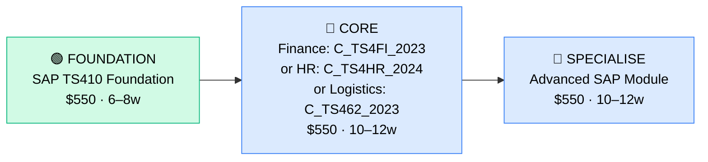

# How to Become a SAP Functional Consultant

**`CP54`** · **Enterprise Apps** · _Time to hire: 12–18 months_ · _Entry cost: $800–$1,500 USD_

> **Path summary:** This path takes you from a business/finance/HR/logistics background into a hired SAP Functional Consultant role in 12–18 months. SAP is the world's most deployed enterprise resource planning (ERP) system; S/4HANA is its modern cloud incarnation. Unlike Salesforce, SAP requires deeper domain knowledge (finance workflows, procurement processes, or HR administration), but the salary and job security are excellent. This path is especially strong for South Africans working at major banks and parastatals.

---

## Role Overview

### What does a SAP Functional Consultant actually do?

A SAP Functional Consultant translates business requirements into configurations of SAP's ERP modules. If you choose Finance, you're configuring accounts payable, accounts receivable, asset management, and general ledger workflows. If HR, you're setting up organizational structures, payroll, benefits, and talent management. If Logistics, you're managing procurement, inventory, and supply chain workflows. You're deep in SAP's UI, but not writing code (that's the Technical Consultant/ABAP developer). You conduct requirements-gathering sessions with finance teams, design how their processes should work in SAP, document solutions, configure the system through SAP's transaction codes and customization tools, test in sandbox environments, and oversee go-live in production.

The role is more complex than a Salesforce Administrator because SAP is older, more rigid, and enterprise-centric. You're responsible for maintaining data integrity across GL accounts, reconciling entries, ensuring compliance with financial regulations, and managing complex process flows. On any given day, you're in requirements meetings, designing workflow documentation, configuring SAP modules in development systems, testing with business teams, and troubleshooting "why is this number wrong?" issues in production.

### Where do they work?

SAP Consultants work predominantly in mid-to-large enterprises (1,000+ headcount) and consulting firms. Very few startups use SAP; it's a system for established, process-heavy organisations. You'll find them in: manufacturing companies, financial services (banks), government/parastatals, multinational corporations, and SAP consulting partner firms (Deloitte, EY, Accenture, CapGemini, Cognizant, etc.). Team sizes vary: at a 100-person firm you might be one of five SAP professionals; at a 50,000-person multinational you might be one of hundreds. Remote work is increasingly common (60–70% of roles), but on-site time is often required, especially during implementations. On-call and weekend work during go-lives is common.

### Demand in 2026

- **Global job postings:** 9,000+ active SAP Functional Consultant roles on LinkedIn as of May 2026 [LinkedIn Jobs](https://www.linkedin.com/jobs/)
- **Growth rate:** 5–7% YoY; slower than cloud-native platforms but steady due to legacy enterprise reliance. S/4HANA cloud migrations are driving new demand.
- **South Africa:** Strong demand in financial services (Nedbank, Standard Bank, ABSA, FNB, Capitec), government (SARS, Treasury), and manufacturing. Consulting partners operating in SA (Deloitte, PwC, EY, Accenture) have active SAP practices. Q1 2026 job listings show 20–30 open SAP Functional Consultant roles in SA.
- **Remote availability:** Moderate to high (60–70% of roles); some on-site time expected during implementations.

---

## Who Is This Path For?

### Ideal starting backgrounds

| Background | Readiness | What you already have |
|---|---|---|
| Finance/Accounting professional | ✅ Excellent start | You understand GL, AR/AP, asset accounting, reconciliation — all critical in SAP Finance |
| HR practitioner | ✅ Excellent start | Organizational structures, payroll concepts, benefits, leave administration — you speak the language |
| Supply Chain / Procurement professional | ✅ Excellent start | You know purchase orders, goods receipt, three-way matching, procurement workflows |
| Business Analyst | ✅ Good start | Requirements gathering and process mapping skills transfer well |
| Accounting graduate | 🟡 Good with domain gaps | You have theory; need hands-on experience in real finance workflows first |
| IT Support with finance/HR domain knowledge | 🟡 Possible | IT skills help; domain knowledge is the limiting factor |
| Career changer from non-business background | 🟠 Difficult | You'll need 3–6 months of domain knowledge (e.g., "how does AR/AP work?") before starting SAP |

### You're ready to start this path if you can:
- Explain how accounts payable or payroll works in your current job (not just the system, but the business process)
- Navigate enterprise software (Excel, ERPs, accounting systems) without hand-holding
- Understand basic accounting concepts (GL, cost centres, cost objects, journals)
- Learn complex, legacy systems without becoming frustrated

> **Not ready yet?** If you don't have 2+ years in finance, HR, or logistics, spend 6–12 months building domain knowledge before starting SAP training. You can't fake this — SAP requires deep business process understanding.

---

## Certification Sequence

### Visual path

---

## Stage 1 — Foundation (Months 0–2)

**Goal:** Understand SAP's architecture, data model, and how it differs from smaller enterprise systems. Learn SAP basics before module-specific training.

| Cert / Learning | What it is | Cost (USD) | Study Time | Why it matters |
|---|---|---:|---:|---|
| SAP Certified Associate — SAP S/4HANA Foundation (TS410) | Entry certification covering SAP architecture, master data, core processes across all modules | $550 | 40–50 hours | Proves you understand SAP's data model, transaction codes, and how Finance, HR, and Logistics modules interact. Essential baseline. |
| SAP eLearning platform tutorials (free components) | Free SAP training videos on basics | $0 | 20–30 hours | SAP provides free introductory content on their learning hub |

**Stage 1 total:** $550 USD · R9,900 ZAR · 6–8 weeks

**Study approach:** Combine SAP's official eLearning (available on the SAP Learning Hub with subscription, ~$50/month or included via training partners), official SAP documentation, and hands-on sandbox access via SAP Free Tier or a partner's demo system. The TS410 exam covers: SAP system architecture, financial accounting basics, sales & distribution, materials management, production planning, and HR concepts at an overview level. Study 10–12 hours/week for 6–8 weeks. Critical: do not memorize; understand the data flow. How does a purchase order become a vendor invoice? How does a sale become revenue recognition? If you can't answer these conceptually, you're not ready for the exam.

**Lab requirement:** Access an SAP sandbox (free trial from SAP or via a partner firm). Complete at least 10 hands-on exercises: creating a purchase order, receiving goods, invoicing, posting a journal entry, viewing GL reports. You must be comfortable navigating SAP's transaction code system (e.g., FB50 for journal entry, ME51 for purchase requisition).

---

## Stage 2 — Core Specialisation (Months 2–6)

**Goal:** Get certified in your chosen functional area (Finance, HR, or Logistics). This is the anchor credential for hiring.

**Choose your specialisation based on your background and market demand:**

### Option A: Finance (SAP Certified Application Associate — SAP S/4HANA Finance, C_TS4FI_2023)

| Cert | Code | Cost (USD) | Study Time | Why it matters |
|---|---|---:|---:|---|
| SAP S/4HANA Finance | `C_TS4FI_2023` | $550 | 10–12 weeks | Covers GL, AR, AP, asset accounting, tax reporting, and integration with other modules. Most demanded in SA banking sector. |

**Finance path total:** $550 USD · R9,900 ZAR · 10–12 weeks

### Option B: HR (SAP Certified Application Associate — SAP S/4HANA Human Capital Management, C_TS4HR_2024)

| Cert | Code | Cost (USD) | Study Time | Why it matters |
|---|---|---:|---:|---|
| SAP S/4HANA HR | `C_TS4HR_2024` | $550 | 10–12 weeks | Covers organizational management, payroll, benefits, talent management, and recruitment. Growing demand as companies digitize HR. |

**HR path total:** $550 USD · R9,900 ZAR · 10–12 weeks

### Option C: Logistics (SAP Certified Application Associate — SAP S/4HANA Logistics, C_TS462_2023)

| Cert | Code | Cost (USD) | Study Time | Why it matters |
|---|---|---:|---:|---|
| SAP S/4HANA Logistics | `C_TS462_2023` | $550 | 10–12 weeks | Covers materials management, procurement, inventory, and supply chain. Strong demand in manufacturing and distribution. |

**Logistics path total:** $550 USD · R9,900 ZAR · 10–12 weeks

**Study approach:** Use SAP's official training courses (available via Learning Hub or partner platforms like OpenSAP). Cost: $50–150/month for access. Combine with hands-on sandbox time (20–30 hours minimum). The exam is 80 multiple-choice questions, 180 minutes, 65% pass rate. Most people score in the 65–75% range if prepared. Do 50+ practice questions. Schedule when you're consistently scoring 70%+.

**Project milestone:** Design and document a real or realistic SAP configuration. Example (Finance): "How would you configure SAP to handle multi-currency AR for an international bank? Document master data setup (G/L accounts, cost centres, exchange rate types), transaction flows, and reconciliation processes." This becomes your portfolio piece.

---

## Stage 3 — Advanced Specialisation (Months 6–12)

**Goal:** Add depth or a second module to differentiate yourself. Choose based on your target role.

| Cert | Code | Cost (USD) | Study Time | Why it matters |
|---|---|---:|---:|---|
| Advanced SAP Module (e.g., SAP S/4HANA Advanced Finance or Logistics) | `C_TS4CO_2023` (Controlling) or `C_TS4FC_2023` (Financial Close) | $550 | 10–12 weeks | Deeper specialisation; Controlling pairs well with Finance, Procurement pairs well with Logistics. Makes you more promotable. |

**Stage 3 total:** $550 USD · R9,900 ZAR · 10–12 weeks

> **Optional at hire time:** Many people land their first SAP Functional Consultant role after completing Stage 2 (core module cert) and complete Stage 3 certifications while employed. This is common and expected. You're fully hireable as a Junior SAP Functional Consultant with TS410 + one module cert.

---

## Timeline & Cost Summary

| Stage | Certs | Duration | Cost (USD) | Cost (ZAR) |
|---|---|---|---:|---:|
| Stage 1 — Foundation | TS410 | Weeks 0–8 | $550 | R9,900 |
| Stage 2 — Core | C_TS4FI_2023 (or HR/Logistics) | Weeks 8–20 | $550 | R9,900 |
| Stage 3 — Advanced | Advanced module cert | Weeks 20–32 | $550 | R9,900 |
| **Total to hireable** | **TS410 + Module cert** | **12–18 months** | **$1,100–$1,650** | **R19,800–R29,700** |

**Study hours required:** 400–500 hours total (Stage 1–2). If you study 15 hours/week, that's 7–8 months to hire. If 20–25 hours/week, you can compress to 5–6 months.

---

## Salary Progression

> All figures: median base salary, not including bonuses/equity. ZAR = USD × 18 baseline (verified May 2026). Sources: Robert Half 2026 Tech Salary Guide, Glassdoor, PayScale, LinkedIn Salary.

| Experience Level | USD/year | ZAR/year | ZAR/month | Notes |
|---|---:|---:|---:|---|
| Entry / Junior (0–2 yrs) | $75,000 | R1,350,000 | R112,500 | Fresh from certification; often in Big 4 consulting firms or corporate IT departments |
| Mid-level (2–5 yrs) | $95,000 | R1,710,000 | R142,500 | Leading implementations, mentoring juniors, owning multiple process areas |
| Senior (5–8 yrs) | $120,000 | R2,160,000 | R180,000 | Lead consultant role, complex implementations, possible management track |
| Lead / Principal (8+ yrs) | $150,000+ | R2,700,000+ | R225,000+ | Senior consultant, practice lead, or transition to SAP Architect |

**South Africa note:** Entry-level SAP Functional Consultants at Johannesburg-based banks (Nedbank, Standard Bank, ABSA) and consulting firms (Deloitte, PwC, EY) earn R80,000–R120,000/month (equivalent to $70,000–$110,000/year). Mid-level (2–5 years) earn R120,000–R160,000/month. Remote work for international consulting firms (e.g., offshore SAP delivery centres) can push these to R150,000–R200,000/month for mid-level roles. The advantage of SAP certifications in SA is that they're globally portable — SA Consultants work on projects for European banks, US manufacturers, etc., often earning in EUR/USD.

**Salary accelerators:** Second module certification (+$5,000–$8,000/year), Controlling/Logistics depth (+$5,000–$10,000/year), proven S/4HANA migration experience (+$10,000–$15,000/year), and technical skills (ABAP coding) (+$15,000–$25,000/year). The fastest way to raise salary is to move consulting firms every 2–3 years or transition to manager/architect roles after 5+ years.

---

## First Job Strategy

### Month 0–3: Build Foundation & Domain Knowledge

1. **Assess your domain knowledge** — If you're not in Finance/HR/Logistics, spend 4–8 weeks building baseline understanding. Read books like "Accounting for Managers" or "Supply Chain Management: Strategy, Planning, and Operation."
2. **Start TS410** — Begin SAP Foundation certification. Use SAP Learning Hub ($50–100/month) or partner training.
3. **Get sandbox access** — Negotiate with your employer to access an SAP sandbox, or use SAP Free Tier. You need hands-on time.
4. **Join SAP community** — Join SAP Community Network (forums), r/sap (Reddit), or SAP Discord. Network with consultants; ask about their experience.

### Month 3–6: Deep Specialisation

- **Choose your module** — Finance? HR? Logistics? Commit based on your background and market demand in your region.
- **Intensive certification prep** — 15–20 hours/week on your chosen module. This is the crux of the path.
- **Build a project** — Document how you'd configure SAP for a realistic scenario in your domain. Example: "SAP Finance implementation roadmap for a 5,000-person bank." Include master data design, transaction flows, and testing strategy. Post to GitHub or your blog.

### Month 6–12: Apply and Iterate

- **CV positioning:** List yourself as "SAP Functional Consultant – Finance" (or your module) once you hold TS410 + module cert. List certification numbers and dates.
- **Target companies:** Consulting partners (Deloitte, PwC, EY, Accenture, CapGemini, Cognizant) hire entry-level SAP Consultants aggressively. Banks and manufacturing companies also hire. Start with consulting firms — they provide structure and project variety.
- **Interview prep:** Be ready to discuss: (1) Your domain knowledge (how AR/AP works, or payroll, or procurement), (2) A real SAP configuration problem you'd solve, (3) How you'd approach a system implementation, (4) A time you had to troubleshoot a complex process.
- **Salary negotiation:** Entry-level SAP Consultants in SA are offered R80,000–R110,000/month. Push for R100,000–R120,000 if you're in Johannesburg or have relocation flexibility. Use the Robert Half Tech Salary Guide.

---

## A Day in the Life

### SAP Functional Consultant (Finance) at a Big 4 consulting firm — Junior Level

**08:00** — Standup with your client delivery team (deployed on-site at a Johannesburg bank's head office). You're in month 3 of a 6-month S/4HANA Finance implementation.

**08:30** — Requirements workshop with the bank's GL team. You're documenting how they want to configure chart of accounts, cost centres, and profit centres in SAP. You ask detailed questions: How are intercompany transactions handled? Do you need subledgers? You take notes in a requirements document template.

**10:30** — Configure cost centres in the sandbox. Use transaction KS01 to create a hierarchy. Test it. Document your steps with screenshots.

**12:00** — Lunch with another junior consultant on the same project. You discuss how SAP's data model differs from the bank's current legacy system. Knowledge transfer happens organically on these projects.

**13:00** — Testing with business users. The GL team reviews your configuration and says "this is close, but we need cost centre allocation at posting time." You modify validation rules and re-test.

**15:00** — Documentation. Write a technical specification for GL configuration: what you built, why, testing results. This is your portfolio evidence.

**17:00** — End of day. Commute home (or remote if hybrid). Evening: study for C_TS4FI_2023 exam (1–2 hours).

---

### SAP Functional Consultant (HR) at a multinational corporation — Mid Level

**09:00** — Strategy meeting with HR leadership. They're rolling out a new benefits plan and need SAP to calculate deductions, tax implications, and produce compliance reports. You design the solution: custom calculation tables, integration points, reporting structure.

**10:30** — Pair with a junior consultant on your team. They're stuck configuring payroll wage types. You walk through the logic and show them how wage types drive GL posting.

**12:00** — Lunch.

**13:00** — Build a custom report in SAP Analytics Cloud. HR needs a dashboard showing headcount by region, cost centre, and level. You design the query and visualization.

**15:00** — Troubleshoot production issue. A payroll run produced incorrect deductions. You dive into PA03 (salary structure), PCR (payroll calculation run), and GL posting logs. Root cause: a tax configuration was wrong. You fix it and ensure it doesn't recur.

**16:30** — Document the issue and fix for your knowledge base. End of day.

---

## Related Paths & Progressions

| From here you can move to… | Why |
|---|---|
| [SAP Architect / Solution Design](CP{NN}_{slug}.md) | With 5–8 years of consulting experience, move to architecture and strategic design |
| [ServiceNow Developer/Administrator](CP55_EnterpriseApps_ServiceNow_Developer.md) | Enterprise apps background; ServiceNow is a faster-moving, modern ERP alternative |
| [IT Management / GRC Manager](CP61_ITMgmt_GRC_Manager.md) | Finance consultants often transition to Governance, Risk & Compliance management roles |
| [Workday Consultant](CP57_EnterpriseApps_Workday_Consultant.md) | HR SAP consultants can transition to Workday (modern HR platform) with domain knowledge intact |

---

## South Africa Context

### Market specifics

SAP Functional Consultants are in very high demand in South Africa, particularly in the financial services sector and government. Nedbank, Standard Bank, ABSA, FNB, and Capitec all run large SAP deployments. Government parastatals including SARS (tax authority), Eskom (utilities), and Transnet (transport) are major SAP users. South Africa's biggest consulting firms — Deloitte, PwC, EY, Accenture, and Cognizant — all have active SAP practices with large delivery teams operating in SA. Many of these firms are undergoing cloud migrations (SAP to S/4HANA, legacy on-premise to cloud), which creates steady demand for functional consultants.

The advantage of SAP certifications in SA is their global portability. Many SA consultants work on projects for European and US companies via nearshore delivery models, earning in foreign currency and pushing effective salaries higher. A Johannesburg-based SAP Finance Consultant working for a US bank's project might earn $75,000–$90,000 USD annually (R1,350,000–R1,620,000), often with flexibility to work remotely.

BEE/EE considerations: Large SA employers (particularly government and state-owned enterprises) have preferential hiring policies. SAP certifications are merit-based and highly valued, which helps level the field. Many Big 4 consulting firms in SA have active diversity hiring and will prioritize candidates from previously disadvantaged backgrounds who hold SAP certifications.

### SA-specific resources

| Resource | URL | Note |
|---|---|---|
| SAP Community Network (South Africa) | [https://www.sap.com/community/](https://www.sap.com/community/) | Official SAP forums; search for SA user groups |
| Deloitte SAP Practice – South Africa | [https://www.deloitte.com/za/en.html](https://www.deloitte.com/za/en.html) | Major consulting firm; active hiring and training |
| PwC SAP Practice – South Africa | [https://www.pwc.co.za/](https://www.pwc.co.za/) | Consulting firm with SAP delivery practice |
| Cognizant SAP Service Line | [https://www.cognizant.com/](https://www.cognizant.com/) | Global consulting firm with SA presence; SAP Functional Consultant roles often posted |
| LinkedIn Jobs ZA | [https://www.linkedin.com/jobs/search/?keywords=SAP+Functional+Consultant&location=South+Africa](https://www.linkedin.com/jobs/) | Filter by "South Africa" for ZA-based SAP roles |

---

## Frequently Asked Questions

**Q: Do I need to work in Finance/HR/Logistics first, or can I learn on the job?**

A: You should have at least 1–2 years of domain knowledge before starting SAP training. SAP is too complex to learn the business process and the tool simultaneously. If you're a career changer, spend 6–12 months in a Finance, HR, or Logistics role first (or do self-study on accounting/payroll/supply chain). Then start SAP certification.

**Q: How long does it realistically take from zero?**

A: 12–18 months from decision to first hired role, assuming you already have domain knowledge. If you're a career changer, add 6–12 months of domain learning. Most people pass TS410 + one module cert (12 months of study) and land a job within 2–4 months of certification.

**Q: Which module should I choose — Finance, HR, or Logistics?**

A: Choose based on your background and job market in your region. Finance is most demanding in SA (banks, government). HR is growing (digital transformation in HR). Logistics/Procurement is strong in manufacturing. If you're undecided, Finance is the safest bet in SA.

**Q: Can I do this path while working full-time?**

A: Yes, but it's demanding. At 15–20 hours/week, you'll need 12–18 months. Many people do this via employer sponsorship (consulting firms often sponsor employee certification). Working full-time and studying 20+ hours/week can lead to burnout; be realistic about your capacity.

**Q: Is SAP worth it compared to Salesforce or ServiceNow?**

A: Yes, if you want higher salaries and deeper enterprise experience. SAP Consultants earn more (~$75,000–$110,000 entry vs. Salesforce's $60,000–$90,000). The tradeoff: SAP is more complex, requires more domain knowledge, and has a steeper learning curve. Salesforce is faster to hire but lower salary ceiling for most roles.

---

## Sources & Further Reading

| # | Source | URL | Used for |
|---|---|---|---|
| 1 | LinkedIn Jobs — SAP Functional Consultant | [https://www.linkedin.com/jobs/search/?keywords=SAP+Functional+Consultant](https://www.linkedin.com/jobs/) | Job volume and market demand |
| 2 | Glassdoor SAP Consultant Salary | [https://www.glassdoor.com/Salaries/sap-consultant-salary-SRCH_KO0,13.htm](https://www.glassdoor.com/Salaries/sap-consultant-salary-SRCH_KO0,13.htm) | US salary ranges |
| 3 | SAP Certification — Functional Consultant Paths | [https://training.sap.com/certification/](https://training.sap.com/certification/) | Official SAP certification requirements and exam codes |
| 4 | SAP Learning Hub | [https://learning.sap.com/](https://learning.sap.com/) | Official SAP training platform |
| 5 | Robert Half 2026 Tech Salary Guide | [https://www.roberthalf.com/salary-guide](https://www.roberthalf.com/salary-guide) | Salary progression by experience level |
| 6 | LinkedIn Jobs — South Africa | [https://www.linkedin.com/jobs/search/?keywords=SAP&locationId=ZA](https://www.linkedin.com/jobs/) | SA job market for SAP roles |
| 7 | PayScale SAP Salary Data | [https://www.payscale.com/research/ZA/Job=SAP_Consultant](https://www.payscale.com/) | ZAR salary cross-reference for SA market |
| 8 | Deloitte South Africa — SAP Services | [https://www.deloitte.com/za/en.html](https://www.deloitte.com/za/en.html) | SA consulting partner for employment opportunities |

---

*Template version: 2026-05-02 | Maintained by IT Career Roadmap | ZAR baseline: R18/$1 USD*
*File naming: `Career_Paths/CP54_EnterpriseApps_SAP_Functional_Consultant.md`*
