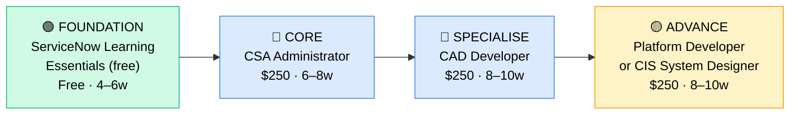

# How to Become a ServiceNow Developer / Administrator

**`CP55`** · **Enterprise Apps** · _Time to hire: 9–15 months_ · _Entry cost: $400–$750 USD_

> **Path summary:** This path takes you from zero or an IT support background to a hired ServiceNow Developer or Administrator in 9–15 months. ServiceNow is a cloud-based IT service management (ITSM) and workflow automation platform used by most large enterprises. Unlike SAP, ServiceNow is modern, relatively easy to learn, and actively hiring entry-level developers. This is one of the fastest paths to a $75,000+ job in enterprise software.

---

## Role Overview

### What does a ServiceNow Developer / Administrator actually do?

ServiceNow Developers and Administrators build and maintain the ServiceNow platform for IT service management, HR service delivery, customer service, and custom business workflows. You're configuring and coding within ServiceNow's low-code / no-code platform (using JavaScript and ServiceNow's APIs, but not Java/Python). On a given day, you might: configure a new request catalog item for password resets, write a workflow that routes incidents to the right team, build a dashboard showing SLA performance, debug a JavaScript business rule that's causing record creation failures, or integrate ServiceNow with other enterprise systems via REST APIs.

ServiceNow sits between "configuration admin" (like Salesforce) and "full developer" (like an engineer coding in Java). You'll write some JavaScript, but most of your work is configuration, workflow design, and data modeling. It's less rigorous than software engineering but more technical than pure admin work. The platform is cloud-only (ServiceNow owns the infrastructure), so you're never managing servers or infrastructure — purely application-level work.

### Where do they work?

ServiceNow Developers and Administrators work in mid-to-large enterprises (500+ headcount) and consulting firms. Any organisation with complex IT processes (incident management, change management, asset management, HR service delivery) likely uses ServiceNow. You'll find them in: banks, insurance companies, manufacturers, tech companies, telecommunications, government agencies, and consulting partner firms (Accenture, Deloitte, IBM, EY, etc.). Team sizes vary: at a 100-person firm you might be one of two ServiceNow professionals; at a Fortune 500 you might be one of 50+. Remote work is very common (70%+ of roles are remote or hybrid). On-call is minimal unless you're supporting production incidents, which is occasional.

### Demand in 2026

- **Global job postings:** 8,000+ active ServiceNow Developer/Administrator roles on LinkedIn as of May 2026 [LinkedIn Jobs](https://www.linkedin.com/jobs/)
- **Growth rate:** 12–15% YoY; one of the fastest-growing enterprise app roles due to digital transformation and ITSM adoption
- **South Africa:** Growing demand. Nedbank, Standard Bank, and major telcos (Vodacom, MTN) use ServiceNow. Consulting partners (Deloitte, Accenture, IBM SA, Cognizant) have active ServiceNow practices. Q1 2026 job listings show 15–25 open ServiceNow Developer/Administrator roles in SA.
- **Remote availability:** Very high — 75%+ of roles are remote or hybrid globally. SA-based developers regularly work for UK/US companies.

---

## Who Is This Path For?

### Ideal starting backgrounds

| Background | Readiness | What you already have |
|---|---|---|
| IT Support / Help Desk | ✅ Excellent start | You understand ITSM processes (incidents, changes, assets); ServiceNow is the tool that manages these |
| IT Service Manager | ✅ Excellent start | You understand SLAs, workflows, escalations — core ServiceNow concepts |
| Business Analyst | ✅ Good start | Requirements gathering and process mapping skills transfer well |
| JavaScript/Web developer | ✅ Good start | You can code; learning ServiceNow's platform is faster than learning the ITSM domain |
| Network/Systems Admin transitioning to development | 🟡 Possible | You have IT knowledge; need to learn web technologies and ServiceNow's architecture |
| Recent graduate (any discipline) | 🟡 Possible with gaps | Smart learner; needs 3–4 months of foundational learning; free ServiceNow learning platform helps |
| Complete career changer | 🟡 Possible | Will take 4–6 months to build basic IT literacy first; ServiceNow learning is then fast |

### You're ready to start this path if you can:
- Explain what an incident ticket is and how it's resolved (from your IT experience or coursework)
- Write simple JavaScript or understand programming logic (for loops, if/else, variables)
- Navigate cloud web applications comfortably
- Learn new platforms through self-paced tutorials without hand-holding

> **Not ready yet?** If you have no IT background, spend 3–4 months on CompTIA A+ foundations and general IT literacy first. If you can't code at all, spend 2–3 weeks learning JavaScript basics on Codecademy or freeCodeCamp.

---

## Certification Sequence

### Visual path

---

## Stage 1 — Foundation (Months 0–2)

**Goal:** Get comfortable with ServiceNow's interface, ITSM processes, and basic platform concepts before attempting certification.

| Cert / Learning | What it is | Cost (USD) | Study Time | Why it matters |
|---|---|---:|---:|---|
| ServiceNow Learning Essentials (free) | Official ServiceNow introductory content; interactive labs | $0 | 40–50 hours | Free, self-paced introduction to ServiceNow UI, table structures, and ITSM workflows. Designed for complete beginners. |
| ServiceNow Community account setup | Joining ServiceNow's free community and developer sandbox | $0 | 10–15 hours | Hands-on practice in a real ServiceNow instance. Essential for lab work. |

**Stage 1 total:** $0 USD · R0 ZAR · 4–6 weeks

**Study approach:** Create a free ServiceNow Developer Edition instance at developer.servicenow.com. Spend time exploring the UI, navigating the table structure, understanding relationships between Incident, Change, Problem, and CMDB tables. Complete ServiceNow's official "Learning Essentials" trail (free, hosted on ServiceNow's learning platform). Do not memorize; focus on understanding ITSM workflows. Spend 8–10 hours/week for 4–6 weeks.

**Lab requirement:** Create 5 Incident tickets in your developer instance. Create a Change Request. Update a CI (Configuration Item) in the CMDB. Understand how these relate to each other. You must be comfortable navigating ServiceNow's forms, lists, and search functionality before moving to certification.

---

## Stage 2 — Core Specialisation: ServiceNow Certified System Administrator (Months 2–5)

**Goal:** Pass the CSA (Certified System Administrator) exam. This is the foundation credential for ServiceNow professionals.

| Cert | Code | Cost (USD) | Study Time | Why it matters |
|---|---|---:|---:|---|
| ServiceNow Certified System Administrator | `CSA` | $250 | 30–40 hours | Covers ITSM processes, user management, table customization, scripting basics, and general platform administration. Hiring managers expect this as a baseline. |

**Stage 2 total:** $250 USD · R4,500 ZAR · 6–8 weeks

**Study approach:** Use ServiceNow's official training courses (available via the Learning Portal; included with CSA exam voucher or separate subscription ~$50/month). Supplement with Udemy courses (Andrew Fawcett and others have ServiceNow courses at $12–15). The exam is 60 multiple-choice questions, 90 minutes, 65% pass rate. Most people score in the 70–78% range if prepared. Do 80+ practice questions. Schedule when consistently scoring 72%+. Plan 8–10 hours/week for 6–8 weeks.

**Project milestone:** Build a custom incident management workflow in ServiceNow. Example: "When a high-priority incident is created, automatically assign to the on-call engineer, notify their manager, and escalate if not resolved in 4 hours." Document the workflow, business rules, and notifications. Post to GitHub or your blog with screenshots.

---

## Stage 3 — Advanced Specialisation: ServiceNow Certified Application Developer (Months 5–10)

**Goal:** Get certified as an Application Developer. This moves you beyond admin into development work (JavaScript, APIs, advanced customization).

| Cert | Code | Cost (USD) | Study Time | Why it matters |
|---|---|---:|---:|---|
| ServiceNow Certified Application Developer | `CAD` | $250 | 40–50 hours | Covers JavaScript for ServiceNow (client scripts, server scripts, business rules, script includes), REST APIs, advanced table customization, and plugin development. This is where you become a developer rather than just an admin. |

**Stage 3 total:** $250 USD · R4,500 ZAR · 8–10 weeks

**Study approach:** Combine official ServiceNow Developer training, Udemy courses focusing on JavaScript in ServiceNow, and hands-on coding in your developer instance. The CAD exam is 80 multiple-choice questions, 120 minutes, 65% pass rate. You must write code and debug scripts; understanding is critical. Do 100+ practice questions. This exam is harder than CSA; plan 10–12 hours/week for 8–10 weeks.

**Project milestone:** Build a ServiceNow plugin or extension that integrates with an external API. Example: "Create a workflow that fetches weather data from OpenWeather API and includes it in incident descriptions for field service teams." This becomes a strong portfolio piece.

---

## Stage 4 — Expert Track (18+ months, optional)

**Goal:** Senior-level certifications for architectural or specialized work.

| Cert | Code | Cost (USD) | Study Time | Why it matters |
|---|---|---:|---:|---|
| ServiceNow Certified Implementation Specialist (CIS) — System Designer | `CIS` | $250 | 50–60 hours | Advanced design patterns, scaling ServiceNow, governance, and enterprise architecture. Take after 2+ years of hands-on experience. |

> These certifications require real-world experience to pass — don't rush them. Work in ServiceNow for 2–3 years, then tackle CIS.

---

## Timeline & Cost Summary

| Stage | Certs | Duration | Cost (USD) | Cost (ZAR) |
|---|---|---|---:|---:|
| Stage 1 — Foundation | Learning Essentials | Weeks 0–6 | $0 | R0 |
| Stage 2 — Core | CSA | Weeks 6–14 | $250 | R4,500 |
| Stage 3 — Specialisation | CAD | Weeks 14–24 | $250 | R4,500 |
| **Total to hireable** | **CSA + CAD** | **9–15 months** | **$500–$750** | **R9,000–R13,500** |

**Study hours required:** 250–300 hours total (Stage 1–3). If you study 12 hours/week, that's 6–7 months to hire. If 20 hours/week, that's 4–5 months.

---

## Salary Progression

> All figures: median base salary, not including bonuses/equity. ZAR = USD × 18 baseline (verified May 2026). Sources: Robert Half 2026 Tech Salary Guide, Glassdoor, PayScale, LinkedIn Salary.

| Experience Level | USD/year | ZAR/year | ZAR/month | Notes |
|---|---:|---:|---:|---|
| Entry / Junior (0–2 yrs) | $75,000 | R1,350,000 | R112,500 | Fresh from CSA/CAD; often in consulting firms or mid-market companies |
| Mid-level (2–5 yrs) | $95,000 | R1,710,000 | R142,500 | Leading custom development, mentoring juniors, owning features or modules |
| Senior (5–8 yrs) | $120,000 | R2,160,000 | R180,000 | Lead developer role, complex implementations, possible management track |
| Lead / Architect (8+ yrs) | $150,000+ | R2,700,000+ | R225,000+ | Architect or practice lead; may move into management or consulting leadership |

**South Africa note:** Entry-level ServiceNow Developers at Johannesburg-based banks and consulting firms earn R80,000–R120,000/month (equivalent to $70,000–$110,000/year). Mid-level (2–5 years) earn R120,000–R160,000/month. Remote work for international consulting firms (Accenture, Deloitte, IBM) operating SA delivery centres can push these to R150,000–R200,000/month for mid-level roles. The advantage: ServiceNow is eminently remote-friendly, so SA-based developers frequently work for UK/US companies.

**Salary accelerators:** CAD certification (+$3,000–$5,000/year), proven API integration and custom development skills (+$5,000–$10,000/year), specific domain expertise (HR Service Delivery, Customer Service, GRC) (+$5,000–$10,000/year), and CIS certification (+$10,000–$15,000/year). The fastest way to raise salary is to move consulting firms every 2–3 years or transition to architect roles after 5+ years.

---

## First Job Strategy

### Month 0–2: Build Foundation & Community

1. **Set up your ServiceNow sandbox** — Create a free Developer Edition at developer.servicenow.com. Cost: $0.
2. **Complete Learning Essentials** — Finish ServiceNow's free introductory trail (40–50 hours). Do the hands-on labs.
3. **Join the community** — Join r/servicenow (Reddit), ServiceNow Community forums, or Discord channels. Network with developers; ask questions.
4. **Start documenting** — Create a GitHub profile and post one learning update per week about ServiceNow concepts, screenshots, and mini-projects.

### Month 2–5: Certification + Portfolio

- **Intensive CSA prep** — Study 8–10 hours/week on the CSA. Use official training, Udemy, and practice exams. Plan to pass within 6–8 weeks.
- **Project 1: Incident Management Workflow** — Build a custom workflow that automates incident assignment, escalation, and notification. Document it with screenshots and logic diagrams.
- **Project 2: Custom Report/Dashboard** — Create a dashboard showing incident metrics, SLA performance, and team workload. Explain your choices.

### Month 5–10: Developer Specialisation + Job Hunt

- **Intensive CAD prep** — Study 10–12 hours/week on the CAD. Write actual JavaScript code in ServiceNow; don't just memorize syntax. Plan to pass within 8–10 weeks.
- **Project 3: API Integration** — Build a ServiceNow workflow that integrates with an external API (e.g., Slack, weather, ticketing system). This is your standout portfolio piece.
- **CV positioning:** List yourself as "ServiceNow Developer" once you hold CSA + CAD. List certification dates and numbers.
- **Target companies:** Consulting firms (Accenture, Deloitte, IBM, EY, Cognizant) hire entry-level ServiceNow developers constantly. MSPs also hire. Banks and insurance companies hire for internal roles. Start with consulting firms.
- **Interview prep:** Be ready to discuss: (1) Your custom workflows and why you designed them that way, (2) A JavaScript problem you solved, (3) Table relationships and data modeling, (4) An API integration challenge, (5) Your CSA + CAD projects.
- **Salary negotiation:** Entry-level ServiceNow Developers in SA are offered R70,000–R100,000/month. Push for R90,000–R110,000. Use Robert Half Tech Salary Guide.

---

## A Day in the Life

### ServiceNow Developer at a mid-market company — Junior Level

**08:00** — Check your queue of ServiceNow tickets. A user reports that a custom Incident workflow is not auto-assigning to the on-call team. You investigate the business rule; it's not firing correctly.

**09:00** — Debug the business rule in the developer console. You discover the condition is checking the wrong field. You fix it, test in sandbox, and deploy to production.

**10:30** — Standup with your small team. You're working on a new HR Service Delivery module to handle leave requests. You update the team on progress.

**11:00** — Requirements gathering with the HR team. They want leave requests to automatically check budget, send notifications to managers, and integrate with the payroll system. You sketch a data model and workflow.

**12:30** — Lunch.

**13:30** — Code in your sandbox. Build a REST API call that will fetch budget data from the payroll system. Write a script include that handles the API logic.

**15:00** — Test the integration. Create a test leave request and verify it checks budget correctly.

**16:00** — Document your changes in a wiki page. Update your GitHub portfolio with the API integration code and screenshots.

**17:00** — End of day. Evening: study JavaScript and advanced ServiceNow topics for CAD prep (1–2 hours).

---

### ServiceNow Developer at a consulting firm — Mid Level

**09:00** — Standup with your delivery team. You're deployed at a bank, building a custom change management workflow. You report that you've completed the UAT and are ready for production deployment.

**10:00** — Pre-deployment review with the architect. You walk through your changes, testing results, and rollback plan. Green light to deploy.

**11:00** — Deploy to production. You follow change control procedures: CAB approval, production sandbox refresh, code migration, monitoring for 2 hours. Zero incidents. You close the change ticket.

**12:30** — Lunch.

**13:30** — Pair-program with a junior developer on your team. They're stuck on a client script that's not validating form fields. You walk through the logic and help them debug. You also mentor them on best practices.

**15:00** — Design review with the client. They want to integrate ServiceNow with Slack for incident notifications. You propose a solution: REST API triggers, Slack webhooks, message templates. You sketch out the architecture.

**16:00** — Start building the Slack integration. Write a script include that handles the API calls.

**17:00** — End of day. Tomorrow: test the integration and show a demo to the client.

---

## Related Paths & Progressions

| From here you can move to… | Why |
|---|---|
| [ServiceNow Architect](CP{NN}_{slug}.md) | With 5+ years of development experience, move to solution architecture and governance |
| [Low-Code / No-Code Developer](CP58_EnterpriseApps_LowCode_Developer.md) | ServiceNow is low-code; Power Platform and Salesforce Flows are similar; transition is smooth |
| [IT Management / IT Service Manager](CP60_ITMgmt_ITIL_Service_Manager.md) | ITSM experience in ServiceNow opens doors to IT service management leadership |
| [Salesforce Developer](CP{NN}_{slug}.md) | JavaScript and cloud platform skills transfer to Salesforce development |

---

## South Africa Context

### Market specifics

ServiceNow Developers are in growing demand in South Africa, particularly in the financial services and telecommunications sectors. Nedbank, Standard Bank, and major telcos (Vodacom, MTN) use ServiceNow for IT and HR workflows. Government agencies and large manufacturers also deploy ServiceNow. The consulting partners operating in SA — Accenture, Deloitte, IBM, EY, and Cognizant — all have ServiceNow practices with active hiring. Many of these firms have offshore delivery centres in SA, offering both on-site and remote roles.

Remote work is extremely common for ServiceNow Developers. The platform is cloud-based, and many SA developers work for UK/US consulting firms remotely, earning in foreign currency. This creates a salary premium: an SA-based ServiceNow Developer might earn $75,000 USD (R1,350,000) working for a US consulting firm, often with flexibility to work remotely from Cape Town or Johannesburg.

BEE/EE considerations: Large SA employers have preferential hiring for previously disadvantaged individuals. ServiceNow certifications are merit-based and highly valued, which helps level the field. Many consulting firms in SA have active diversity hiring and will prioritize candidates from previously disadvantaged backgrounds who hold CSA/CAD certifications.

### SA-specific resources

| Resource | URL | Note |
|---|---|---|
| ServiceNow Community – South Africa | [https://www.servicenow.com/community/](https://www.servicenow.com/community/) | Official ServiceNow forums; search for SA user groups |
| Accenture ServiceNow Practice – SA | [https://www.accenture.com/za-en](https://www.accenture.com/za-en) | Major consulting firm; active ServiceNow hiring in SA |
| Deloitte ServiceNow Services – SA | [https://www.deloitte.com/za/en.html](https://www.deloitte.com/za/en.html) | Consulting firm with ServiceNow delivery practice in SA |
| IBM ServiceNow – South Africa | [https://www.ibm.com/za-en](https://www.ibm.com/za-en) | Global consulting firm with ServiceNow practice |
| LinkedIn Jobs ZA | [https://www.linkedin.com/jobs/search/?keywords=ServiceNow+Developer&location=South+Africa](https://www.linkedin.com/jobs/) | Filter by "South Africa" for ZA-based ServiceNow roles |

---

## Frequently Asked Questions

**Q: Do I need a computer science degree to become a ServiceNow Developer?**

A: No. ServiceNow's CAD certification is entirely code-oriented but designed for people without formal CS training. You need to be able to learn JavaScript and understand APIs, but not formal CS theory. Many successful ServiceNow Developers come from IT operations, help desk, or business analysis backgrounds.

**Q: How long does it realistically take from zero?**

A: 9–15 months from complete beginner to your first hired role, assuming you study 10–15 hours/week. If you have IT experience, you can compress this to 6–9 months. If you have no IT background at all, add 3–4 months of foundational IT learning (CompTIA A+ or equivalent).

**Q: Which cert should I do first — CSA or CAD?**

A: Always CSA first. It covers the ITSM domain and basic platform concepts. CAD assumes you already know how ServiceNow works. Do CSA → CAD in that order.

**Q: Can I do this path while working full-time?**

A: Yes, absolutely. At 12 hours/week, you can complete CSA + CAD in 12–14 months while working full-time. Many people do this. The advantage: you keep your salary. The challenge: burnout if you push beyond 15 hours/week for sustained periods.

**Q: Should I learn JavaScript first before starting ServiceNow?**

A: Not necessary. ServiceNow teaches you the JavaScript you need in the context of their platform. If you've never coded before, spend 2–3 weeks learning JavaScript basics on Codecademy or freeCodeCamp, then start ServiceNow. If you already know JavaScript, CSA + CAD will be faster.

**Q: Is CAD worth it compared to just getting CSA?**

A: Absolutely. CSA-only positions are administrator roles (configuration, basic customization); CAD opens doors to developer roles with higher pay and more interesting work. Plan for both CSA + CAD.

---

## Sources & Further Reading

| # | Source | URL | Used for |
|---|---|---|---|
| 1 | LinkedIn Jobs — ServiceNow Developer | [https://www.linkedin.com/jobs/search/?keywords=ServiceNow+Developer](https://www.linkedin.com/jobs/) | Job volume estimate (8,000+ postings) |
| 2 | Glassdoor ServiceNow Developer Salary | [https://www.glassdoor.com/Salaries/servicenow-developer-salary-SRCH_KO0,19.htm](https://www.glassdoor.com/Salaries/servicenow-developer-salary-SRCH_KO0,19.htm) | US salary ranges |
| 3 | ServiceNow Certifications | [https://www.servicenow.com/community/certifications/ct-p/certification-training](https://www.servicenow.com/community/certifications/ct-p/certification-training) | Official cert requirements and exam cost ($250 per exam) |
| 4 | ServiceNow Learning Portal | [https://learn.servicenow.com/](https://learn.servicenow.com/) | Free training and paid courses |
| 5 | Robert Half 2026 Tech Salary Guide | [https://www.roberthalf.com/salary-guide](https://www.roberthalf.com/salary-guide) | Salary progression by experience level |
| 6 | LinkedIn Jobs — South Africa | [https://www.linkedin.com/jobs/search/?keywords=ServiceNow&locationId=ZA](https://www.linkedin.com/jobs/) | SA job market for ServiceNow roles |
| 7 | PayScale ServiceNow Salary Data | [https://www.payscale.com/research/ZA/Job=ServiceNow_Developer](https://www.payscale.com/) | ZAR salary cross-reference for SA market |
| 8 | Accenture South Africa | [https://www.accenture.com/za-en](https://www.accenture.com/za-en) | SA consulting partner for ServiceNow employment |

---

*Template version: 2026-05-02 | Maintained by IT Career Roadmap | ZAR baseline: R18/$1 USD*
*File naming: `Career_Paths/CP55_EnterpriseApps_ServiceNow_Developer.md`*
