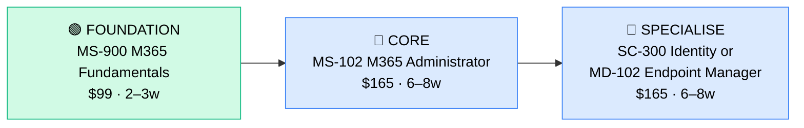

# How to Become a Microsoft 365 Administrator

**`CP56`** · **Enterprise Apps** · _Time to hire: 8–14 months_ · _Entry cost: $300–$500 USD_

> **Path summary:** This path takes you from zero or an IT support background to a hired Microsoft 365 Administrator in 8–14 months. Microsoft 365 is one of the most widely deployed enterprise suites globally (Office, Teams, SharePoint, Exchange, OneDrive); nearly every mid-to-large enterprise needs M365 admins. This is one of the most accessible paths to a $55,000–$85,000 role, especially for people already supporting Windows/Office environments.

---

## Role Overview

### What does a Microsoft 365 Administrator actually do?

A Microsoft 365 Administrator manages the cloud services that power modern workplace productivity: Exchange Online (email), Teams (collaboration), SharePoint (document management), OneDrive (cloud storage), and Microsoft Entra ID (cloud identity management). You configure mailboxes, manage user licenses, troubleshoot email flow issues, configure Teams governance policies, manage SharePoint site provisioning, enforce security policies, and ensure compliance with data retention regulations. You're also the bridge between Microsoft's cloud services and your on-premises Active Directory (AD) if the org is in hybrid mode.

On a given day, you might: reset a user's password and sync it to cloud, troubleshoot why a user can't access Teams, configure a data loss prevention (DLP) policy so sensitive data can't be emailed externally, grant a user access to a shared SharePoint site, manage mailbox quotas, monitor Exchange Online health, or audit who accessed a sensitive file. It's less about building new systems and more about managing, securing, and troubleshooting existing ones. The role requires understanding of cloud identity (Microsoft Entra), security, compliance, and helpdesk-level troubleshooting.

### Where do they work?

Microsoft 365 Administrators work in nearly every mid-to-large enterprise (500+ headcount), particularly those that have migrated from on-premises Exchange/Office to Microsoft 365. You'll find them in: financial services (banks, insurance), government, healthcare, manufacturing, technology companies, educational institutions, and IT consulting firms. Team sizes vary: at a 100-person firm you might be one of two M365 admins; at a Fortune 500 you might be one of 50+. Remote work is extremely common (75%+ of roles are remote or hybrid). On-call is minimal unless you're supporting 24/7 operations, but email/Teams outages can cause urgent escalations.

### Demand in 2026

- **Global job postings:** 10,000+ active Microsoft 365 Administrator roles on LinkedIn as of May 2026 [LinkedIn Jobs](https://www.linkedin.com/jobs/)
- **Growth rate:** 7–9% YoY; steady and strong due to Microsoft 365's ubiquity in enterprise
- **South Africa:** Strong demand. Every major SA bank (Nedbank, Standard Bank, ABSA, FNB, Capitec), government agency, and large corporate uses Microsoft 365. Q1 2026 job listings show 25–40 open M365 Administrator roles in SA.
- **Remote availability:** Very high — 80%+ of roles are remote or hybrid globally. SA-based admins frequently work for UK/US companies.

---

## Who Is This Path For?

### Ideal starting backgrounds

| Background | Readiness | What you already have |
|---|---|---|
| Windows IT Support / Help Desk | ✅ Excellent start | You know Windows, AD, Office, troubleshooting; M365 is just the cloud version |
| Exchange Server Admin (on-prem) | ✅ Excellent start | Exchange Online is the cloud successor; concepts carry over directly |
| Active Directory / Identity Admin | ✅ Excellent start | Microsoft Entra (formerly Azure AD) is cloud identity; core to M365 |
| IT Service Manager | ✅ Good start | You understand ITSM and cloud migration; M365 admin skills are learnable |
| SharePoint Admin (on-prem) | ✅ Good start | SharePoint Online is the cloud version; governance concepts similar |
| Recent IT graduate | 🟡 Good with gaps | Theory solid; needs hands-on lab time in Microsoft 365 sandbox |
| Complete career changer | 🟡 Possible | Needs 3–4 months of Windows/AD fundamentals first |

### You're ready to start this path if you can:
- Navigate Windows Server and Active Directory concepts (user accounts, groups, permissions)
- Understand cloud identity basics (what's a tenant, user account, subscription?)
- Use Office 365 / Microsoft 365 as an end-user (Exchange, Teams, SharePoint)
- Troubleshoot basic network and application issues without hand-holding

> **Not ready yet?** If you don't have Windows IT experience, start with CompTIA A+ and Network+ first. If you have AD experience, jump straight to M365.

---

## Certification Sequence

### Visual path

---

## Stage 1 — Foundation (Months 0–1)

**Goal:** Prove you understand Microsoft 365's architecture and basic concepts before diving into administration.

| Cert | Code | Cost (USD) | Study Time | Why it matters |
|---|---|---:|---:|---|
| Microsoft Certified: Microsoft 365 Fundamentals | `MS-900` | $99 | 15–20 hours | Entry-level overview of Microsoft 365 services, cloud concepts, cloud deployment models, and why orgs use M365. Easier than admin certs; good baseline. |

**Stage 1 total:** $99 USD · R1,782 ZAR · 2–3 weeks

**Study approach:** Use Microsoft Learn (free, official training). The MS-900 exam is 40 multiple-choice questions, 60 minutes, 70% pass rate. Very achievable for people with IT experience. Study 5–7 hours/week for 2–3 weeks. Focus on: cloud concepts, M365 services (Teams, SharePoint, Exchange, OneDrive), licensing, and security fundamentals.

**Lab requirement:** Create a free Microsoft 365 Developer Tenant (at developer.microsoft.com/microsoft-365/dev-program). Explore Teams, SharePoint, and Exchange Online. Create a test user, assign a license, send an email. Basic hands-on familiarity.

---

## Stage 2 — Core Specialisation: Microsoft 365 Administrator Expert (Months 1–5)

**Goal:** Pass the MS-102 exam and become a Microsoft 365 Administrator Expert. This is the main credential hiring managers look for.

| Cert | Code | Cost (USD) | Study Time | Why it matters |
|---|---|---:|---:|---|
| Microsoft Certified: Microsoft 365 Administrator Expert | `MS-102` | $165 | 40–50 hours | Covers Microsoft 365 tenant management, user identity and roles, Teams, SharePoint, Exchange, compliance, and security. The anchor credential for M365 admins. |

**Stage 2 total:** $165 USD · R2,970 ZAR · 6–8 weeks

**Study approach:** Use Microsoft Learn (free) plus Pluralsight or Udemy courses ($15–30). The MS-102 exam is 40 multiple-choice questions, 120 minutes, 70% pass rate. Most people score in the 72–82% range if prepared. Do 80+ practice questions. Schedule when consistently scoring 74%+. Plan 8–10 hours/week for 6–8 weeks.

**Project milestone:** Deploy and configure a Microsoft 365 environment from scratch (using your dev tenant). Create user accounts, assign licenses, configure Teams governance, set up a SharePoint site with document retention policies, and document everything. Screenshot-rich documentation of your setup.

---

## Stage 3 — Advanced Specialisation (Months 5–9)

**Goal:** Specialize in either Identity & Access Management (SC-300) or Endpoint Management (MD-102). Choose based on your interests.

**Option A: Microsoft Entra (Identity) Administrator (SC-300)**

| Cert | Code | Cost (USD) | Study Time | Why it matters |
|---|---|---:|---:|---|
| Microsoft Certified: Identity and Access Administrator | `SC-300` | $165 | 40–50 hours | Deep dive into Microsoft Entra ID (cloud identity), conditional access, authentication methods, governance, and integration with on-prem AD. High-demand specialization. |

**Option B: Windows Endpoint Manager Administrator (MD-102)**

| Cert | Code | Cost (USD) | Study Time | Why it matters |
|---|---|---:|---:|---|
| Microsoft Certified: Endpoint Administrator | `MD-102` | $165 | 40–50 hours | Deep dive into Intune (device management), Windows configuration, mobile device management (MDM), and policy enforcement. Valuable for organizations with strong endpoint control requirements. |

**Choose based on your interests:**
- Choose **SC-300 (Identity)** if you enjoy security, authentication, compliance, and managing who has access to what
- Choose **MD-102 (Endpoint)** if you're interested in device management, Windows configuration, and corporate endpoint security

**Stage 3 total:** $165 USD · R2,970 ZAR · 6–8 weeks

> **Optional at hire time:** Many people land their first M365 Administrator job after Stage 2 (MS-102 only) and complete Stage 3 certifications while employed. This is common. You're fully hireable as a Microsoft 365 Administrator with just MS-102.

---

## Timeline & Cost Summary

| Stage | Certs | Duration | Cost (USD) | Cost (ZAR) |
|---|---|---|---:|---:|
| Stage 1 — Foundation | MS-900 | Weeks 0–3 | $99 | R1,782 |
| Stage 2 — Core | MS-102 | Weeks 3–11 | $165 | R2,970 |
| Stage 3 — Advanced | SC-300 or MD-102 | Weeks 11–19 | $165 | R2,970 |
| **Total to hireable** | **MS-900 + MS-102** | **8–14 months** | **$264–$429** | **R4,752–R7,722** |

**Study hours required:** 150–200 hours total (Stage 1–2). If you study 10 hours/week, that's 4–5 months to hire. If 20 hours/week, that's 2–3 months.

---

## Salary Progression

> All figures: median base salary, not including bonuses/equity. ZAR = USD × 18 baseline (verified May 2026). Sources: Robert Half 2026 Tech Salary Guide, Glassdoor, PayScale, LinkedIn Salary.

| Experience Level | USD/year | ZAR/year | ZAR/month | Notes |
|---|---:|---:|---:|---|
| Entry / Junior (0–2 yrs) | $55,000 | R990,000 | R82,500 | Fresh from M365 certs; often in IT support teams or help desk roles evolving to admin |
| Mid-level (2–5 yrs) | $70,000 | R1,260,000 | R105,000 | Owning Teams, SharePoint, Exchange; mentoring junior staff; managing compliance |
| Senior (5–8 yrs) | $85,000 | R1,530,000 | R127,500 | Lead admin role, architecture decisions, possible management track |
| Lead / Architect (8+ yrs) | $110,000+ | R1,980,000+ | R165,000+ | Cloud architect or IT management; move into CIO/CISO tracks |

**South Africa note:** Entry-level Microsoft 365 Administrators in SA earn R50,000–R75,000/month (equivalent to $45,000–$68,000/year). Mid-level (2–5 years) earn R75,000–R110,000/month. The salary in SA is lower than Salesforce/ServiceNow due to the role being closer to traditional IT support, but remote work for international companies (UK/US) can push this to R90,000–R130,000/month for mid-level roles. Many SA admins work for international companies and earn in GBP/USD.

**Salary accelerators:** SC-300 (Identity) certification (+$5,000–$8,000/year), MD-102 (Endpoint) certification (+$3,000–$6,000/year), advanced Teams/SharePoint customization skills (+$3,000–$5,000/year), and CISSP or security background (+$5,000–$10,000/year). The fastest way to raise salary is to move roles every 2–3 years or transition to Cloud Architect tracks after 5+ years.

---

## First Job Strategy

### Month 0–2: Build Foundation

1. **Set up your Microsoft 365 Dev Tenant** — Create at developer.microsoft.com/microsoft-365/dev-program. Cost: $0.
2. **Pass MS-900** — Complete this in 2–3 weeks. It's easy if you have IT experience. Use Microsoft Learn (free).
3. **Explore M365 services** — Spend 10+ hours exploring Teams, SharePoint, Exchange Online, and OneDrive in your dev tenant. Create test users, configure settings, understand the UI.
4. **Join the community** — Join r/microsoft365, Microsoft Tech Community forums, or Discord channels. Network with M365 admins; ask questions.

### Month 2–5: Certification + Portfolio

- **Intensive MS-102 prep** — Study 8–10 hours/week. Use Microsoft Learn (free), Pluralsight, or Udemy courses. Plan to pass within 6–8 weeks.
- **Project 1: M365 Environment Setup** — Configure your dev tenant from scratch: users, licensing, Teams policies, SharePoint governance, retention policies. Document everything with screenshots.
- **Project 2: Security Configuration** — Set up conditional access policies, multi-factor authentication (MFA), and data loss prevention (DLP). Document your security design rationale.

### Month 5–9: Advanced Specialisation + Job Hunt

- **Choose SC-300 or MD-102** — Study 8–10 hours/week. Plan to pass within 6–8 weeks.
- **Project 3: Advanced Config** — If SC-300: design an identity architecture with conditional access, custom roles, and hybrid AD integration. If MD-102: configure Intune policies, device compliance, and app management.
- **CV positioning:** List yourself as "Microsoft 365 Administrator" once you hold MS-102. List certification codes and dates.
- **Target companies:** Banks, government agencies, large manufacturers, and consulting firms all hire M365 admins. MSPs also hire. Start with mid-market companies or consulting firms.
- **Interview prep:** Be ready to discuss: (1) Your M365 configuration projects, (2) How you'd troubleshoot an email flow issue, (3) Teams governance and security policies, (4) Exchange Online and SharePoint management, (5) Hybrid identity scenarios.
- **Salary negotiation:** Entry-level M365 Administrators in SA are offered R50,000–R70,000/month. Push for R65,000–R80,000. Use Robert Half Tech Salary Guide as reference.

---

## A Day in the Life

### Microsoft 365 Administrator at a mid-sized bank — Junior Level

**08:00** — Check email for any overnight alerts. Exchange Online health dashboard shows no issues. Teams status is green.

**08:30** — Help desk ticket: a user can't access a shared SharePoint site. You check their permissions; they're not a member of the site's security group. You add them. Resolved.

**09:00** — Standup with your IT team. You're managing M365 for 1,500 users across 3 offices. You report on user onboarding progress (20 new starters this month).

**10:00** — Configuration work: set up Teams for a new department. Create a team, configure channels, set retention policies (emails deleted after 7 years per compliance), and set up a SharePoint site for document storage.

**12:00** — Lunch.

**13:00** — Test a data loss prevention (DLP) policy you created. The policy should block users from emailing credit card numbers externally. You run a test; it works correctly.

**14:30** — User onboarding: reset a password for a new starter, assign Microsoft 365 licenses, create a mailbox, grant access to shared resources. Document the process.

**16:00** — Monitor mailbox quotas. Several users are at 90% quota. You send them reminders to clean up old emails.

**17:00** — End of day. Evening: study for MS-102 exam (1–2 hours).

---

### Microsoft 365 Administrator at a consulting firm — Mid Level

**09:00** — Standup with your delivery team. You're supporting 3 client orgs on M365 migrations from on-prem Exchange to Exchange Online.

**09:30** — Client 1: Exchange Online migration for 500 users. You monitor the mailbox migration wave; 90% complete. Zero major issues so far. You'll monitor logs for 2 hours post-migration to ensure mail flow is working.

**11:00** — Client 2: troubleshoot Teams performance issues. A department of 200 users reports slow Teams access during peak hours. You dive into Azure diagnostics, analyze network traffic, and identify that their network bandwidth is saturated. You recommend a QoS policy and network upgrade.

**12:30** — Lunch with another mid-level admin on your team. You discuss Intune endpoint management and device compliance policies.

**13:30** — Client 3: design a security architecture. The client wants to implement conditional access policies (block access from non-corporate networks, require MFA, device compliance checks). You design the policy structure and present it to their security team.

**15:00** — Pair with a junior admin on your team. They're configuring SharePoint retention policies and got stuck. You walk through the logic together.

**16:30** — Document your work from the day. Update client notes in your ticketing system.

**17:00** — End of day. Tomorrow: deploy the conditional access policies to Client 3 in production.

---

## Related Paths & Progressions

| From here you can move to… | Why |
|---|---|
| [Microsoft Security Engineer (SC-400)](CP{NN}_{slug}.md) | M365 background + security specialization → cloud security engineer role |
| [Microsoft Cloud Architect (AZ-305)](CP{NN}_{slug}.md) | With 5+ years of M365 + Azure experience, move to cloud architecture |
| [IT Management / IT Service Manager](CP60_ITMgmt_ITIL_Service_Manager.md) | M365 admin experience opens doors to IT service management roles |
| [Azure Administrator](CP{NN}_{slug}.md) | M365 is built on Azure; Azure Admin cert is a natural next step |

---

## South Africa Context

### Market specifics

Microsoft 365 Administrators are in steady demand in South Africa, particularly in the financial services sector and government. Every major SA bank (Nedbank, Standard Bank, ABSA, FNB, Capitec), insurance company, and government agency uses Microsoft 365. Local consulting and IT service firms (Dimension Data, BCX, EOH, Accenture SA, Deloitte SA) all employ M365 admins. The advantage of this role in SA is that it's accessible to people from IT support backgrounds; you don't need a specialized certification pathway to break in.

Remote work is extremely common. Many SA M365 admins work for international companies (UK, US, Australia), earning in foreign currency. This creates a salary premium: an SA-based M365 admin working for a UK consulting firm might earn £35,000–£45,000 annually (R840,000–R1,080,000), which is 30–40% higher than the typical SA local salary.

BEE/EE considerations: Large SA employers, particularly government and state-owned enterprises, have preferential hiring for previously disadvantaged individuals. Microsoft certifications are merit-based and highly valued. Many consulting firms in SA have active diversity hiring and will prioritize candidates from previously disadvantaged backgrounds who hold M365 certifications.

### SA-specific resources

| Resource | URL | Note |
|---|---|---|
| Microsoft Community – South Africa | [https://www.microsoft.com/en-za/](https://www.microsoft.com/en-za/) | Official Microsoft SA page; job listings and events |
| Dimension Data M365 Services | [https://www.dimensiondata.com/](https://www.dimensiondata.com/) | Major IT services firm in SA; M365 hiring |
| Accenture South Africa | [https://www.accenture.com/za-en](https://www.accenture.com/za-en) | Consulting firm with M365 delivery practice |
| LinkedIn Jobs ZA | [https://www.linkedin.com/jobs/search/?keywords=Microsoft+365+Administrator&location=South+Africa](https://www.linkedin.com/jobs/) | ZA-based M365 admin roles |

---

## Frequently Asked Questions

**Q: Do I need a degree to become a Microsoft 365 Administrator?**

A: No. Most M365 admins come from IT support/help desk backgrounds. Certs matter far more than degrees in this role.

**Q: How long does it realistically take from zero?**

A: 8–14 months from complete beginner to your first hired role, assuming you study 10–12 hours/week. If you have Windows IT experience, you can compress to 4–6 months. If you have no IT background, add 4–6 months of foundational learning (CompTIA A+).

**Q: Which cert should I do first?**

A: Start with MS-900 (Microsoft 365 Fundamentals) if you have no M365 experience. If you already use Teams, SharePoint, and Exchange as an end-user, you can skip straight to MS-102. Most people do MS-900 → MS-102.

**Q: Can I do this path while working full-time?**

A: Yes, easily. At 10 hours/week, you can complete MS-102 in 6–8 months while working full-time. This is one of the fastest entry points to enterprise IT.

**Q: Is this role remote-friendly?**

A: Extremely. 80%+ of M365 admin roles are remote or hybrid globally. SA-based admins frequently work for UK/US companies.

---

## Sources & Further Reading

| # | Source | URL | Used for |
|---|---|---|---|
| 1 | LinkedIn Jobs — Microsoft 365 Administrator | [https://www.linkedin.com/jobs/search/?keywords=Microsoft+365+Administrator](https://www.linkedin.com/jobs/) | Job volume estimate (10,000+ postings) |
| 2 | Glassdoor M365 Administrator Salary | [https://www.glassdoor.com/Salaries/microsoft-365-administrator-salary-SRCH_KO0,25.htm](https://www.glassdoor.com/Salaries/) | US salary ranges |
| 3 | Microsoft Certifications — M365 Administrator | [https://learn.microsoft.com/certifications/m365-administrator/](https://learn.microsoft.com/certifications/m365-administrator/) | Official cert requirements and exam costs |
| 4 | Microsoft Learn (Free Training) | [https://learn.microsoft.com/](https://learn.microsoft.com/) | Official free training for all Microsoft certs |
| 5 | Robert Half 2026 Tech Salary Guide | [https://www.roberthalf.com/salary-guide](https://www.roberthalf.com/salary-guide) | Salary progression by experience level |
| 6 | LinkedIn Jobs — South Africa | [https://www.linkedin.com/jobs/search/?keywords=Microsoft+365&locationId=ZA](https://www.linkedin.com/jobs/) | SA job market for M365 roles |
| 7 | PayScale M365 Salary Data | [https://www.payscale.com/research/ZA/Job=Microsoft_365_Administrator](https://www.payscale.com/) | ZAR salary cross-reference |
| 8 | Dimension Data South Africa | [https://www.dimensiondata.com/](https://www.dimensiondata.com/) | Major IT services firm in SA; job source |

---

*Template version: 2026-05-02 | Maintained by IT Career Roadmap | ZAR baseline: R18/$1 USD*
*File naming: `Career_Paths/CP56_EnterpriseApps_M365_Administrator.md`*
