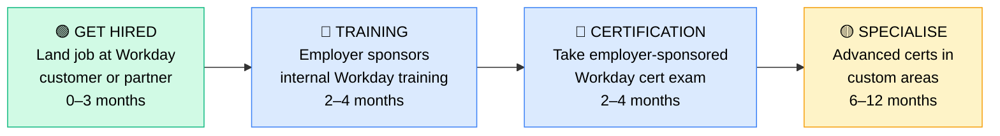

# How to Become a Workday Consultant

**`CP57`** · **Enterprise Apps** · _Time to hire: 12–18 months_ · _Entry cost: $200–$600 USD (highly dependent on employer sponsorship)_

> **Path summary:** This path takes you from an HR or finance professional background to a hired Workday Consultant in 12–18 months. Workday is a modern, cloud-based ERP/HCM platform used by 10,000+ enterprises globally, including most Fortune 500 companies. Unlike traditional certification paths, Workday certifications are employer-gated — you must be sponsored by a Workday partner firm or direct employer to access training and exams. This path is less about self-study and more about finding the right employer to sponsor you.

---

## Role Overview

### What does a Workday Consultant actually do?

A Workday Consultant configures and implements Workday's cloud HR and/or Finance modules. If you specialize in HCM (Human Capital Management), you build employee onboarding workflows, configure compensation and benefits, manage organizational hierarchies, and design talent management processes. If you specialize in Finance, you handle GL, AP/AR, budgeting, and revenue recognition. You're deep in Workday's configuration UI, sometimes writing custom reports and formulas, occasionally integrating with external systems via APIs. Unlike some enterprise app roles, Workday is deliberately no-code/low-code — you're configuring through clicks and Workday Studio (visual configuration tool), not writing Java or Python.

On a given day, you're in requirements meetings with HR/Finance teams, designing how their processes should work in Workday, configuring the system in a sandbox, testing with business users, and troubleshooting "why is this calculation wrong?" issues. You're also part of implementations — Workday projects are typically 6–12 months long, so you're deeply involved in project delivery.

### Where do they work?

Workday Consultants work in Fortune 500 companies (particularly tech, finance, healthcare, and manufacturing) and Workday consulting partner firms (Deloitte, Accenture, EY, IBM, CapGemini, etc.). Very few small companies use Workday — it's an enterprise platform. You'll rarely work for a Workday consulting partner unless you're sponsored by them first; the usual path is: (1) Get a job at a company that uses Workday, (2) Work in their Workday team for 1–2 years, (3) Your employer sponsors certification, (4) You transition to consulting or more senior roles. Team sizes vary: at a 5,000-person company you might be one of 10 Workday consultants; at a consulting firm you might be one of 100+. Remote work is very common (60–70% of roles are hybrid or remote). On-call during go-lives is expected.

### Demand in 2026

- **Global job postings:** 6,000+ active Workday Consultant roles on LinkedIn as of May 2026 [LinkedIn Jobs](https://www.linkedin.com/jobs/)
- **Growth rate:** 10–12% YoY; strong due to continued digital HR transformation and Workday adoption
- **South Africa:** Moderate to growing demand. Large SA companies using Workday include banks (Standard Bank, ABSA), insurance companies (Discovery), and multinationals. Consulting partners (Deloitte, Accenture, EY, Cognizant) have Workday practices but primarily service international clients, not SA locally. Q1 2026 job listings show 8–15 Workday roles in SA, mostly at consulting firms or large multinational offices.
- **Remote availability:** High (70%+ of roles are remote or hybrid); many projects are delivered remotely.

---

## Who Is This Path For?

### Ideal starting backgrounds

| Background | Readiness | What you already have |
|---|---|---|
| HR Manager / Specialist | ✅ Excellent start | You understand benefits, payroll, org structures, talent management workflows |
| Finance / Accounting professional | ✅ Excellent start | You understand GL, AP/AR, budgeting, revenue recognition (Finance Workday path) |
| HR Business Analyst | ✅ Good start | Requirements gathering and process knowledge; Workday is the tool |
| Finance Business Analyst | ✅ Good start | Financial process knowledge; Workday Finance configuration skills build on this |
| Payroll Manager / Specialist | ✅ Good start | Compensation and benefits workflows are core Workday HCM skills |
| IT/Enterprise Apps consultant with HR/Finance domain | 🟡 Possible | You have consulting skills; need HR/Finance domain knowledge |
| Recent HR graduate | 🟡 Good with gaps | Theory solid; need 1–2 years of hands-on HR experience first |

### You're ready to start this path if you can:
- Explain what compensation, benefits, and payroll processes look like in your current (or recent) job
- Understand basic financial concepts (GL accounts, cost centres, budgets)
- Navigate enterprise software (SAP, legacy HCM systems, etc.) without hand-holding
- Learn complex, cloud-based systems quickly

> **Not ready yet?** If you don't have 2+ years in HR or Finance, spend 6–12 months building domain knowledge before pursuing a Workday role. You cannot fake domain expertise here.

---

## Certification Sequence

### Visual path — Important Note on Workday Certifications

Workday certifications are **not publicly available** like Salesforce or SAP exams. You cannot self-study and take a Workday certification exam on your own. Instead, certifications are **employer-gated**: you must be employed by a Workday customer or partner firm to access training and sit exams. This changes the path significantly.

---

## Stage 1 — Get Hired (Months 0–3)

**Goal:** Land a job at a company that uses Workday or at a Workday consulting partner. This is the gate to everything else.

**Where to find Workday roles:**

- **LinkedIn Jobs** — Filter by "Workday" and company size (1,000+). Look for roles like "Workday HR Analyst," "Workday Finance Business Analyst," or "Workday Implementation Consultant."
- **Workday Careers** — https://www.workday.com/careers — Workday itself hires consultants, but these are usually higher-level roles.
- **Consulting Partner Careers** — Deloitte, Accenture, EY, IBM, CapGemini all hire entry-level Workday consultants.
- **Large corporations** — Any Fortune 500 company (banks, insurance, healthcare, tech) using Workday will have HR/Finance analyst roles that lead to Workday work.

**Positioning for Workday roles:**
- Emphasize your HR or Finance domain knowledge, not IT skills (unless you already have both).
- Research which companies use Workday (check Workday's customer list on their website).
- Target companies in mid-to-large size (1,000+ headcount) that are actively hiring.
- In your resume, highlight: compensation/benefits knowledge (HCM track) or accounting/GL experience (Finance track).

**Stage 1 total:** $0 — No certification cost yet. You're job hunting.

---

## Stage 2 — Employer-Sponsored Training (Months 3–5, after you're hired)

**Goal:** Once hired, your employer will enroll you in Workday training. They usually sponsor this entirely.

| Training Type | What it covers | Who provides | Cost to you | Study time |
|---|---|---|---|---|
| Workday HCM Core (if HR track) | Org management, compensation, benefits, talent, payroll, recruiting | Workday University (employer pays) | $0 | 60–80 hours |
| Workday Finance Core (if Finance track) | GL, AP/AR, budgeting, revenue recognition, reporting | Workday University (employer pays) | $0 | 60–80 hours |
| Custom domain training | Company-specific processes, integrations, custom reports | Employer's internal team | $0 | 40–60 hours |

**Stage 2 total:** $0 USD (employer-funded) · R0 ZAR · 2–4 months

**Study approach:** Your employer will enroll you in Workday University courses (online, self-paced). You'll also pair with experienced Workday consultants on your team. Real-world project work is your lab — you'll build configurations in sandbox, test with business users, and learn from doing.

**Project milestone:** Configure a real or realistic Workday module for your company. Example: "Design and build the compensation structure for a new department, including job leveling, salary ranges, and benefits eligibility." Document it thoroughly.

---

## Stage 3 — Workday Certification Exam (Months 5–8, after training)

**Goal:** Pass your employer-sponsored Workday certification exam.

| Cert | Type | Cost to you | Study time | Why it matters |
|---|---|---|---|---|
| Workday Certified HCM Core Specialist (if HR track) | Employer-gated exam | $0–$200 (employer usually covers) | 20–30 hours focused review | Validates your HCM configuration knowledge; required credential for senior roles |
| Workday Certified Finance Specialist (if Finance track) | Employer-gated exam | $0–$200 (employer usually covers) | 20–30 hours focused review | Validates your Finance configuration knowledge |

**Stage 3 total:** $0–$200 USD (employer usually covers) · R0–R3,600 ZAR · 2–4 months

**Study approach:** After you've completed Workday University training and worked on real projects for 2–3 months, you'll be ready to take the certification exam. Review your training materials, practice exam questions (provided by Workday), and validate your knowledge against the exam blueprint. The exam is typically 60–80 multiple-choice questions, 2 hours, 70%+ pass rate. Most people pass on the first attempt if they've done real Workday work.

**Project milestone:** Deliver a complete Workday implementation or major configuration change to production. Document the design, testing, and go-live process.

---

## Stage 4 — Advanced Specialisation (Months 8–18, optional)

**Goal:** After your base certification, pursue advanced certifications in specialized areas (Recruiting, Compensation, Financial Planning, Custom Reporting, etc.).

| Advanced Certs | Examples | Study time | Why it matters |
|---|---|---|---|---|
| Workday Advanced specializations | Recruiting, Compensation, Reporting/Analytics, Custom Workday Studio | 30–40 hours each | Differentiate yourself; higher salaries for specialists |

> These advanced certs are typically available 1–2 years into your Workday career, after you've demonstrated expertise.

---

## Timeline & Cost Summary

| Stage | Activity | Duration | Cost (USD) | Cost (ZAR) |
|---|---|---|---|---|
| Stage 1 | Job search at Workday customer/partner | Months 0–3 | $0 | R0 |
| Stage 2 | Employer-sponsored training (University) | Months 3–5 | $0 (employer pays) | R0 |
| Stage 3 | Certification exam + review | Months 5–8 | $0–$200 | R0–R3,600 |
| Stage 4 | Advanced specialization (optional) | Months 8–18+ | $0–$400 (often employer-paid) | R0–R7,200 |
| **Total to certified Consultant** | | **12–18 months** | **$0–$600** | **R0–R10,800** |

**Study hours required:** 200–300 hours total (Stages 2–3). Most of this is project-based work, not traditional studying.

**Important:** Unlike other paths, Workday doesn't have a traditional self-study, self-cert route. You must be hired first. This path has higher barrier to entry but also means you're earning a salary while you train.

---

## Salary Progression

> All figures: median base salary, not including bonuses/equity. ZAR = USD × 18 baseline (verified May 2026). Sources: Robert Half 2026 Tech Salary Guide, Glassdoor, PayScale, LinkedIn Salary.

| Experience Level | USD/year | ZAR/year | ZAR/month | Notes |
|---|---:|---:|---:|---|
| Entry / Junior (0–2 yrs) | $80,000 | R1,440,000 | R120,000 | Fresh from Workday training; often working on first implementation projects |
| Mid-level (2–5 yrs) | $100,000 | R1,800,000 | R150,000 | Leading implementations, owning modules, mentoring juniors |
| Senior (5–8 yrs) | $125,000 | R2,250,000 | R187,500 | Lead consultant, complex implementations, possible management track |
| Lead / Principal (8+ yrs) | $160,000+ | R2,880,000+ | R240,000+ | Principal consultant or director role; may move into Workday architecture or management |

**South Africa note:** Workday roles in SA are less common than SAP or Salesforce. Entry-level Workday consultants (post-certification) at large SA companies or consulting firms earn R80,000–R120,000/month (equivalent to $70,000–$110,000/year). Mid-level earn R120,000–R160,000/month. However, many SA Workday consultants work for international consulting firms (Deloitte, Accenture, EY) serving global clients, often earning in USD/GBP, which inflates local earning potential significantly.

**Salary accelerators:** Advanced specialization certs (+$5,000–$10,000/year), proven large-scale implementation experience (+$10,000–$20,000/year), management track (+$15,000–$30,000/year), and custom development skills (+$8,000–$15,000/year). The fastest way to raise salary is to move consulting firms every 2–3 years.

---

## First Job Strategy

### Month 0–3: Target and Land Workday Role

1. **Research Workday customers** — Which companies in your region use Workday? Search LinkedIn, check Workday's customer list, look at job postings.
2. **Target job titles:** "Workday HR Analyst," "Workday Finance Analyst," "Workday Implementation Consultant," "HR Systems Analyst (Workday experience preferred)."
3. **Polish your domain resume** — Emphasize your HR or Finance expertise, not IT. Examples: "5 years managing compensation programs," "Led financial close process for $2B division," "Managed payroll for 5,000 employees."
4. **Network** — If you know anyone in a Workday consulting firm or customer company, reach out. Workday roles often come through network referrals.
5. **Interview strategy** — When you interview, ask: "Does your company use Workday? Is this role involved in Workday work?" Make it clear you're interested in Workday specifically.

### Month 3–5: Onboard and Training

Once hired:
- You'll be assigned a mentor or placed on a Workday project team.
- Your employer will enroll you in Workday University (online training platform).
- You'll work on real Workday configurations while training.
- Learn the company's Workday instance and their specific processes.

### Month 5–8: Certification

- Your employer will schedule your certification exam when you're ready (typically 2–3 months after starting).
- You'll review training materials and practice exams for 20–30 hours.
- Take the certification exam.

### Month 8–12: Establish Yourself

- Lead one complete implementation or major configuration change to production.
- Build your reputation as a competent Workday consultant.
- Look for advanced specialization opportunities.

---

## A Day in the Life

### Workday HCM Consultant at a Fortune 500 tech company — Junior Level

**08:00** — Standup with your Workday team (8 people total: 2 implementation leads, 4 mid-level, 2 juniors like you). You're 4 months into your job, recently certified.

**08:30** — Configure compensation structure in sandbox. The company is updating salary grades and pay ranges. You build the job leveling hierarchy and validate that pay ranges are correctly enforced.

**10:00** — Test with an HR Business Partner. They review your configuration and say "this is close, but we need to exclude contract workers from these ranges." You modify and re-test.

**12:00** — Lunch with a mid-level consultant. They're explaining how compensation relates to benefits eligibility. Knowledge transfer.

**13:00** — Build a custom report in Workday Studio. The compensation manager wants a report showing headcount, average salary, and salary range compliance by department. You design the report and test it.

**15:00** — Document your configuration work. Write a design spec explaining the compensation structure, assumptions, and testing results.

**16:30** — End of day. Evening: read Workday documentation on advanced compensation features. You're thinking about pursuing the Compensation specialization cert next year.

---

### Workday Finance Consultant at a consulting partner (Deloitte) — Mid Level

**09:00** — Standup with your delivery team. You're deployed at a bank, in month 6 of a 9-month Workday Finance implementation.

**09:30** — Lead a design workshop with the bank's Finance team. You're designing the GL structure, cost centre hierarchy, and profit centre mapping for their new regional organization. You present your design and get feedback.

**11:00** — Update the implementation plan and technical design document based on feedback.

**12:30** — Lunch.

**13:30** — Configure AP (Accounts Payable) module in sandbox. The bank has 5,000 vendors worldwide. You set up vendor master data, payment methods, and approval workflows. Test basic invoice-to-payment flow.

**15:00** — Pair with a junior consultant on your team. They're configuring AR (Accounts Receivable) and stuck on billing document design. You walk through the logic and help them debug.

**16:00** — Attend project steering committee meeting. You present progress to executive stakeholders. On track for go-live in 3 months.

**17:00** — End of day. Tomorrow: deploy AP configuration to UAT and schedule user testing.

---

## Related Paths & Progressions

| From here you can move to… | Why |
|---|---|
| [Workday Architect](CP{NN}_{slug}.md) | With 5–8 years of consulting experience, move to solution architecture |
| [SAP Functional Consultant](CP54_EnterpriseApps_SAP_Functional_Consultant.md) | Enterprise apps background; SAP Finance/HR path uses similar domain knowledge |
| [IT Management / GRC Manager](CP61_ITMgmt_GRC_Manager.md) | Finance consultants can transition to Governance, Risk & Compliance management |
| [Management / Director Track](CP{NN}_{slug}.md) | Many Workday consultants transition to consulting management or client-side IT director roles |

---

## South Africa Context

### Market specifics

Workday consulting is less common in South Africa than SAP or Salesforce, but growing. Large SA companies and multinationals operating SA offices (particularly in financial services, insurance, and technology) use Workday for HR and Finance. Standard Bank, ABSA, Discovery, and other Fortune 500s operating in SA use Workday. The main opportunity for SA Workday professionals is through consulting partners — Deloitte, Accenture, EY, Cognizant all have Workday practices serving global clients.

The advantage: Workday roles often come with good salaries and are highly portable. Many SA Workday consultants work for international consulting firms on global delivery models, earning in USD/GBP, which inflates local earning potential significantly.

BEE/EE considerations: Large consulting firms and corporations have preferential hiring for previously disadvantaged individuals. Once certified, Workday consultants are in high demand and can often negotiate better terms.

### SA-specific resources

| Resource | URL | Note |
|---|---|---|
| Workday – South Africa | [https://www.workday.com/](https://www.workday.com/) | Official Workday site; customer list and careers |
| Deloitte Workday Services – SA | [https://www.deloitte.com/za/en.html](https://www.deloitte.com/za/en.html) | Major consulting partner; active Workday hiring |
| Accenture Workday – SA | [https://www.accenture.com/za-en](https://www.accenture.com/za-en) | Consulting partner with Workday practice |
| LinkedIn Jobs ZA | [https://www.linkedin.com/jobs/search/?keywords=Workday&locationId=ZA](https://www.linkedin.com/jobs/) | ZA-based Workday roles |

---

## Frequently Asked Questions

**Q: Do I need prior Workday experience to get hired?**

A: No. You need HR or Finance domain knowledge (2+ years in relevant field). You don't need Workday experience — your employer will train you.

**Q: Can I self-study for Workday certification without employer sponsorship?**

A: No. Workday certifications are employer-gated. You must be employed by a Workday customer or partner firm to access training and exams. This is different from Salesforce, SAP, or ServiceNow.

**Q: How do I find Workday roles if I don't have Workday experience?**

A: Target roles like "Workday HR Analyst," "Workday Finance Business Analyst," "HR Systems Analyst (Workday experience preferred)," or "Workday Implementation Consultant" at: (1) Large corporations that use Workday (check Workday's customer list), (2) Consulting partners (Deloitte, Accenture, EY, IBM), (3) Workday itself (they hire implementation consultants).

**Q: How long does it take to get certified once hired?**

A: 2–4 months of training + 2–4 months of project work before you're ready for the certification exam. Total: 4–8 months post-hire to certification.

**Q: Is Workday worth it compared to SAP or Salesforce?**

A: Different paths. Workday salaries are slightly higher ($80,000+ vs. $60,000–$75,000 for entry roles), but the barrier to entry is higher (you must be hired first, no self-study path). SAP and Salesforce can be self-studied before landing a job.

**Q: What specialization should I pursue?**

A: Choose based on your interest and the company's needs. HCM consultants focus on HR processes; Finance consultants focus on GL/AP/AR/budgeting. Both have strong demand. Recruiting and Compensation are valuable HCM specializations.

---

## Sources & Further Reading

| # | Source | URL | Used for |
|---|---|---|---|
| 1 | LinkedIn Jobs — Workday Consultant | [https://www.linkedin.com/jobs/search/?keywords=Workday+Consultant](https://www.linkedin.com/jobs/) | Job postings and market research |
| 2 | Glassdoor Workday Consultant Salary | [https://www.glassdoor.com/Salaries/workday-consultant-salary-SRCH_KO0,18.htm](https://www.glassdoor.com/Salaries/) | US salary ranges |
| 3 | Workday Careers & Training | [https://www.workday.com/careers/career-development](https://www.workday.com/careers/career-development) | Official Workday training info |
| 4 | Workday Customer List | [https://www.workday.com/](https://www.workday.com/) | Research which companies use Workday |
| 5 | Robert Half 2026 Tech Salary Guide | [https://www.roberthalf.com/salary-guide](https://www.roberthalf.com/salary-guide) | Salary progression by experience level |
| 6 | LinkedIn Jobs — South Africa | [https://www.linkedin.com/jobs/search/?keywords=Workday&locationId=ZA](https://www.linkedin.com/jobs/) | SA job market |
| 7 | Deloitte Workday Services | [https://www.deloitte.com/](https://www.deloitte.com/) | Major consulting partner with Workday practice |
| 8 | Accenture Workday Services | [https://www.accenture.com/](https://www.accenture.com/) | Consulting partner with Workday delivery |

---

*Template version: 2026-05-02 | Maintained by IT Career Roadmap | ZAR baseline: R18/$1 USD*
*File naming: `Career_Paths/CP57_EnterpriseApps_Workday_Consultant.md`*
