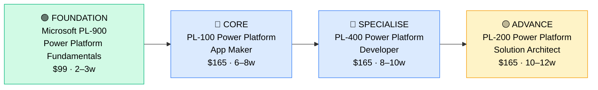

# How to Become a Low-Code / No-Code Developer

**`CP58`** · **Enterprise Apps** · _Time to hire: 6–12 months_ · _Entry cost: $200–$400 USD_

> **Path summary:** This path takes you from zero or a business analyst background to a hired Low-Code/No-Code Developer in 6–12 months. Low-code/no-code is the fastest-growing segment in enterprise software — it allows business teams to build applications without traditional programming. Platforms like Microsoft Power Platform, Salesforce Flows, and Mendix are hiring aggressively. This is one of the fastest paths to enterprise app development, with lower barrier to entry than traditional coding.

---

## Role Overview

### What does a Low-Code / No-Code Developer actually do?

A Low-Code/No-Code Developer builds business applications using visual, drag-and-drop platforms instead of traditional programming languages. Using tools like Microsoft Power Apps, Power Automate, Salesforce Flows, and Mendix, you create data models, design user interfaces, automate workflows, and integrate systems — all without writing code (or with minimal code). A typical project: "The Finance team wants to automate their expense report approval process." You'd design a Power App form where employees submit expenses, create a Power Automate flow that routes approvals to managers, and integrate with SAP to pull cost centre codes. All visual, no coding.

The role sits between "business analyst" and "software developer." You need to understand business processes deeply, but you don't need formal CS training or coding skills. You're using visual tools, pre-built components, and configuration. The platform handles the infrastructure; you focus on business logic and user experience.

### Where do they work?

Low-Code/No-Code Developers work in any mid-to-large organization that's digitizing business processes: financial services (banks, insurance), healthcare, manufacturing, retail, government, and tech companies. You'll also find them in consulting firms (Accenture, Deloitte, etc.) and specialized low-code consultancies. Team sizes vary: at a 100-person firm you might be one of two; at a Fortune 500 you might be one of dozens. Remote work is very common (70%+ of roles are remote or hybrid). On-call is minimal unless you're supporting production systems.

### Demand in 2026

- **Global job postings:** 12,000+ active Low-Code/No-Code Developer roles on LinkedIn as of May 2026 [LinkedIn Jobs](https://www.linkedin.com/jobs/)
- **Growth rate:** 25–30% YoY; one of the fastest-growing IT career segments. Gartner predicts this will dominate enterprise development by 2028.
- **South Africa:** Growing demand. Banks, insurance companies, and large multinationals in SA are adopting low-code platforms. Microsoft Power Platform is particularly strong in SA due to Microsoft's presence. Q1 2026 job listings show 15–25 open Low-Code Developer roles in SA.
- **Remote availability:** Very high — 80%+ of roles are remote or hybrid globally.

---

## Who Is This Path For?

### Ideal starting backgrounds

| Background | Readiness | What you already have |
|---|---|---|
| Business Analyst | ✅ Excellent start | You understand business processes and requirements; the platform is just the tool |
| Excel Power User / Finance Analyst | ✅ Excellent start | You think in workflows and data; Power Platform will feel familiar |
| Traditional Developer (Java, Python, etc.) | ✅ Good start | You understand logic and architecture; the platform just abstracts the syntax |
| Salesforce / Dynamics admin | ✅ Good start | You're familiar with configuration and automation in these platforms |
| IT Support / Help Desk | 🟡 Good start | Troubleshooting skills help; need business process understanding |
| Non-technical person with business domain | 🟡 Possible | If you understand the business deeply, the platform is learnable |
| Career changer from any background | 🟡 Possible | If you're comfortable with software, low-code platforms are accessible |

### You're ready to start this path if you can:
- Explain a business workflow (e.g., "here's how we process an expense report") without hand-holding
- Navigate software UI intuitively (don't need to code, but need tech comfort)
- Think logically about process flows (if/then logic, loops, validation)
- Learn new platforms quickly by doing (not from lectures)

> **Not ready yet?** If you have no business process experience, spend 3–4 months in a business analyst role or study business process fundamentals first.

---

## Certification Sequence

### Visual path

---

## Stage 1 — Foundation (Months 0–1)

**Goal:** Understand Power Platform architecture and core concepts before diving into development.

| Cert | Code | Cost (USD) | Study Time | Why it matters |
|---|---|---:|---:|---|
| Microsoft Certified: Power Platform Fundamentals | `PL-900` | $99 | 15–20 hours | Overview of Power Platform services, cloud concepts, and low-code principles. Easy entry; good baseline. |

**Stage 1 total:** $99 USD · R1,782 ZAR · 2–3 weeks

**Study approach:** Use Microsoft Learn (free, official training). The PL-900 exam is 40 multiple-choice questions, 60 minutes, 70% pass rate. Very achievable. Study 5–7 hours/week for 2–3 weeks. Focus on: what Power Platform is, its components (Power Apps, Power Automate, Power BI), cloud concepts, and low-code principles.

**Lab requirement:** Create a free Power Apps environment and build a simple app: a todo list or contact manager. Explore Power Automate and create a basic workflow (e.g., "when a todo is created, send an email"). Get hands-on familiarity.

---

## Stage 2 — Core Specialisation: Power Platform App Maker (Months 1–4)

**Goal:** Pass the PL-100 exam and become certified as a Power Platform App Maker. This is the anchor credential for low-code developers.

| Cert | Code | Cost (USD) | Study Time | Why it matters |
|---|---|---:|---:|---|
| Microsoft Certified: Power Platform App Maker | `PL-100` | $165 | 40–50 hours | Covers Power Apps (Canvas and Model-Driven), Power Automate, Dataverse, formulas, and UI/UX design. The main credential for app makers. |

**Stage 2 total:** $165 USD · R2,970 ZAR · 6–8 weeks

**Study approach:** Use Microsoft Learn (free) plus Udemy or Pluralsight courses ($15–30). The PL-100 exam is 40 multiple-choice questions, 120 minutes, 70% pass rate. Most people score in the 72–80% range. Do 80+ practice questions. Schedule when consistently scoring 74%+. Plan 8–10 hours/week for 6–8 weeks.

**Project milestone:** Build a multi-screen Power App that solves a real business problem. Example: "Expense Report Submission App" with form validation, Dataverse integration, workflow automation, and reporting. Deploy to a test environment and document it thoroughly. This is your portfolio piece.

---

## Stage 3 — Advanced Specialisation: Power Platform Developer (Months 4–8)

**Goal:** Pass the PL-400 exam and become certified as a Power Platform Developer. This moves you beyond app creation into advanced customization and integration.

| Cert | Code | Cost (USD) | Study Time | Why it matters |
|---|---|---:|---:|---|
| Microsoft Certified: Power Platform Developer | `PL-400` | $165 | 50–60 hours | Covers Power Apps (advanced), Power Automate (advanced), Dataverse (SDK and APIs), plugin development, and advanced integration. This is where you add code (JavaScript, C#) alongside low-code. |

**Stage 3 total:** $165 USD · R2,970 ZAR · 8–10 weeks

**Study approach:** Combine Microsoft Learn (free), Pluralsight/Udemy courses, and hands-on coding practice. The PL-400 exam is 40 multiple-choice + scenario-based questions, 180 minutes, 70% pass rate. Harder than PL-100; requires understanding of APIs, plugins, and some code. Do 100+ practice questions. Plan 10–12 hours/week for 8–10 weeks.

**Project milestone:** Build a Power Platform solution that integrates multiple systems via APIs. Example: "Create a Power App that pulls data from SAP via REST API, enriches it with data from Dataverse, and exports results to SharePoint." Include custom JavaScript logic and error handling. Strong portfolio piece.

---

## Stage 4 — Expert Track (18+ months, optional)

**Goal:** Advanced certifications for architectural or specialized roles.

| Cert | Code | Cost (USD) | Study Time | Why it matters |
|---|---|---:|---:|---|
| Microsoft Certified: Power Platform Solution Architect | `PL-200` | $165 | 60–80 hours | Advanced architecture, scalability, governance, and enterprise design patterns. Take after 2+ years of development experience. |

> These certifications require real-world experience to pass — don't rush them.

---

## Timeline & Cost Summary

| Stage | Certs | Duration | Cost (USD) | Cost (ZAR) |
|---|---|---|---:|---:|
| Stage 1 — Foundation | PL-900 | Weeks 0–3 | $99 | R1,782 |
| Stage 2 — Core | PL-100 | Weeks 3–11 | $165 | R2,970 |
| Stage 3 — Advanced | PL-400 | Weeks 11–19 | $165 | R2,970 |
| **Total to hireable** | **PL-100** | **6–12 months** | **$264–$429** | **R4,752–R7,722** |

**Study hours required:** 150–200 hours total (Stage 1–2). If you study 10 hours/week, that's 4–5 months to hire. If 20 hours/week, that's 2–3 months.

---

## Salary Progression

> All figures: median base salary, not including bonuses/equity. ZAR = USD × 18 baseline (verified May 2026). Sources: Robert Half 2026 Tech Salary Guide, Glassdoor, PayScale, LinkedIn Salary.

| Experience Level | USD/year | ZAR/year | ZAR/month | Notes |
|---|---:|---:|---:|---|
| Entry / Junior (0–2 yrs) | $55,000 | R990,000 | R82,500 | Fresh from PL-100; often in small teams or consulting firms |
| Mid-level (2–5 yrs) | $72,000 | R1,296,000 | R108,000 | Leading app development, mentoring juniors, owning features |
| Senior (5–8 yrs) | $90,000 | R1,620,000 | R135,000 | Lead developer role, complex solutions, possible management track |
| Lead / Architect (8+ yrs) | $120,000+ | R2,160,000+ | R180,000+ | Architect or practice lead; may move into consulting leadership |

**South Africa note:** Entry-level Low-Code Developers in SA earn R50,000–R75,000/month (equivalent to $45,000–$68,000/year). Mid-level (2–5 years) earn R75,000–R110,000/month. Remote work for international consulting firms (Microsoft, Accenture, Deloitte) serving global clients can push these to R100,000–R150,000/month for mid-level roles. Low-code is eminently remote-friendly, so many SA developers work for UK/US companies.

**Salary accelerators:** PL-400 certification (+$4,000–$7,000/year), advanced API integration skills (+$5,000–$10,000/year), Salesforce Platform App Builder cert as complementary skill (+$2,000–$5,000/year), and enterprise solution experience (+$8,000–$15,000/year). The fastest way to raise salary is to move consulting firms every 2–3 years.

---

## First Job Strategy

### Month 0–2: Build Foundation & Portfolio

1. **Set up Power Platform environment** — Create a free Power Apps trial at powerapps.microsoft.com. Cost: $0.
2. **Pass PL-900** — Complete this in 2–3 weeks. Use Microsoft Learn (free).
3. **Build your first app** — Create a simple Power App (todo list, contact manager, survey tool). Post screenshots on your portfolio/blog.
4. **Join the community** — Join r/PowerApps (Reddit), Microsoft Power Platform community forums, or Discord. Network with developers.

### Month 2–5: Certification + Portfolio

- **Intensive PL-100 prep** — Study 8–10 hours/week. Use Microsoft Learn (free), Pluralsight, or Udemy. Plan to pass within 6–8 weeks.
- **Project 1: Multi-Screen App** — Build a Power App that solves a real business problem (expense reports, inventory management, HR onboarding). Multi-screen, form validation, Dataverse integration. Document thoroughly with screenshots.
- **Project 2: Workflow Automation** — Build a Power Automate workflow that orchestrates multiple systems (e.g., approval workflow, data sync, notification system). Document the logic.

### Month 5–9: Developer Specialisation + Job Hunt

- **Intensive PL-400 prep** — Study 10–12 hours/week. Write actual code (JavaScript, potentially C# if doing plugins). Plan to pass within 8–10 weeks.
- **Project 3: API Integration** — Build a Power Platform solution that integrates with an external API (SAP, Salesforce, external SaaS tool). This is your standout portfolio piece.
- **CV positioning:** List yourself as "Low-Code Developer" or "Power Platform Developer" once you hold PL-100. List certification codes and dates.
- **Target companies:** Any organization digitizing business processes. Tech companies, financial services, manufacturing, government, consulting firms. Start with consulting firms.
- **Interview prep:** Be ready to discuss: (1) Your Power Apps projects, (2) How you'd design a solution to a business problem, (3) Workflow automation concepts, (4) API integration challenges, (5) Your PL-100 + PL-400 projects.
- **Salary negotiation:** Entry-level Low-Code Developers in SA are offered R50,000–R70,000/month. Push for R60,000–R75,000. Use Robert Half Tech Salary Guide.

---

## A Day in the Life

### Low-Code Developer at a mid-sized bank — Junior Level

**08:00** — Check your Power Apps environment. A user reported that an expense report form is not saving data correctly. Investigate in the test environment.

**09:00** — Debug the form logic. You discover that a validation rule is too strict and rejecting valid data. You fix the rule and re-test.

**10:30** — Standup with your team. You're working on a Finance team's solution to automate expense approvals.

**11:00** — Design a new Power Automate workflow: when an expense report is submitted, route it to the appropriate manager based on cost centre. You sketch the logic and get feedback from the business analyst.

**12:30** — Lunch.

**13:30** — Build the workflow in Power Automate. Configure the approval step, notifications, and GL posting.

**15:00** — Test the workflow with a sample expense report. Verify that it routes correctly and sends notifications.

**16:00** — Document your changes in a wiki. Update screenshots and technical notes for the team.

**17:00** — End of day. Evening: study Power Automate advanced topics for PL-400 prep (1–2 hours).

---

### Low-Code Developer at a consulting firm — Mid Level

**09:00** — Standup with your delivery team. You're deployed at an insurance company, building a claims processing solution using Power Platform.

**09:30** — Lead a design workshop with the Claims team. You're designing the data model and user workflows for claims submission, assessment, and payment.

**11:00** — Update the solution design document based on feedback.

**12:30** — Lunch.

**13:30** — Code in your development environment. Build the claims submission app in Power Apps. Multi-screen form, validation, Dataverse integration.

**15:00** — Pair with a junior developer on your team. They're stuck on a Power Automate workflow that's not triggering correctly. You walk through the logic and help debug.

**16:00** — Start building an API integration. The claims system needs to integrate with an external assessment tool. Write a custom API call in Power Automate.

**17:00** — End of day. Tomorrow: test the integration and show a demo to the client.

---

## Related Paths & Progressions

| From here you can move to… | Why |
|---|---|
| [Salesforce Platform Developer](CP{NN}_{slug}.md) | Salesforce Flows are low-code; transition to Salesforce with your low-code skills |
| [ServiceNow Developer](CP55_EnterpriseApps_ServiceNow_Developer.md) | ServiceNow is low-code/JavaScript-based; skill transfer is direct |
| [Cloud Architect / Microsoft Azure Architect](CP{NN}_{slug}.md) | With 5+ years of Power Platform + Azure experience, move to cloud architecture |
| [Traditional Software Developer](CP{NN}_{slug}.md) | Low-code experience is a stepping stone to traditional coding; easier transition than learning to code cold |

---

## South Africa Context

### Market specifics

Low-Code/No-Code Development is a rapidly growing segment in SA, particularly driven by Microsoft's presence and Power Platform adoption. Banks (Nedbank, Standard Bank, ABSA), insurance companies (Discovery, Old Mutual), and large manufacturers are all adopting Power Platform for business process automation. Consulting firms (Accenture, Deloitte, Microsoft Partners) have growing low-code practices and actively hire developers.

The advantage: Low-code is eminently remote-friendly, and many SA developers work for international consulting firms or directly for UK/US companies, earning in foreign currency. This creates a significant salary premium compared to traditional IT roles.

BEE/EE considerations: Many SA employers have preferential hiring for previously disadvantaged individuals. Low-code certifications are merit-based and highly valued. Consulting firms in SA often prioritize candidates from previously disadvantaged backgrounds who hold relevant certifications.

### SA-specific resources

| Resource | URL | Note |
|---|---|---|
| Microsoft Power Platform – South Africa | [https://powerplatform.microsoft.com/](https://powerplatform.microsoft.com/) | Official resource; community links and documentation |
| Accenture Low-Code Services – SA | [https://www.accenture.com/za-en](https://www.accenture.com/za-en) | Consulting firm with growing low-code practice |
| Deloitte Power Platform Services – SA | [https://www.deloitte.com/za/en.html](https://www.deloitte.com/za/en.html) | Consulting firm with Power Platform delivery |
| LinkedIn Jobs ZA | [https://www.linkedin.com/jobs/search/?keywords=Low-Code+Developer&location=South+Africa](https://www.linkedin.com/jobs/) | ZA-based low-code roles |

---

## Frequently Asked Questions

**Q: Do I need to be a programmer to become a Low-Code Developer?**

A: No. That's the whole point of low-code. You need to think logically about workflows and business processes, but you don't need formal programming training. However, learning to code (JavaScript, Python) will accelerate your career after PL-100.

**Q: How long does it realistically take from zero?**

A: 6–12 months from complete beginner to your first hired role, assuming you study 10–15 hours/week and have business process background. If you have a business analyst background, you can compress to 4–6 months.

**Q: Should I learn a programming language first?**

A: Not necessary for entry. PL-100 is pure visual/configuration. However, for PL-400 and beyond, basic JavaScript helps. Recommend: (1) Pass PL-100 first, (2) Then learn JavaScript (3–4 weeks on Codecademy/freeCodeCamp), (3) Then tackle PL-400.

**Q: Can I do this path while working full-time?**

A: Yes, absolutely. At 10 hours/week, you can complete PL-100 in 6–8 months while working full-time. This is one of the fastest entry points to enterprise development.

**Q: Is Low-Code worth it compared to traditional coding?**

A: Different paths. Low-code is faster to hire (6–12 months vs. 1–2 years for coding), lower barrier to entry, and often better work-life balance. Traditional coding offers higher salary ceiling ($150,000+ vs. $85,000–$120,000 for low-code mid-level). Choose based on your interests: business process automation (low-code) or building complex systems (traditional coding).

---

## Sources & Further Reading

| # | Source | URL | Used for |
|---|---|---|---|
| 1 | LinkedIn Jobs — Low-Code Developer | [https://www.linkedin.com/jobs/search/?keywords=Low-Code+Developer](https://www.linkedin.com/jobs/) | Job volume estimate (12,000+ postings) |
| 2 | Glassdoor Low-Code Developer Salary | [https://www.glassdoor.com/Salaries/low-code-developer-salary-SRCH_KO0,18.htm](https://www.glassdoor.com/Salaries/) | US salary ranges |
| 3 | Microsoft Power Platform Certifications | [https://learn.microsoft.com/certifications/power-platform-app-maker/](https://learn.microsoft.com/certifications/power-platform-app-maker/) | Official cert requirements and costs |
| 4 | Microsoft Learn (Free Training) | [https://learn.microsoft.com/](https://learn.microsoft.com/) | Official free training for all Microsoft certs |
| 5 | Robert Half 2026 Tech Salary Guide | [https://www.roberthalf.com/salary-guide](https://www.roberthalf.com/salary-guide) | Salary progression by experience level |
| 6 | LinkedIn Jobs — South Africa | [https://www.linkedin.com/jobs/search/?keywords=Low-Code&locationId=ZA](https://www.linkedin.com/jobs/) | SA job market for low-code roles |
| 7 | PayScale Low-Code Developer Salary | [https://www.payscale.com/research/ZA/Job=Low_Code_Developer](https://www.payscale.com/) | ZAR salary cross-reference |
| 8 | Accenture Low-Code Services | [https://www.accenture.com/](https://www.accenture.com/) | Consulting partner with low-code practice |

---

*Template version: 2026-05-02 | Maintained by IT Career Roadmap | ZAR baseline: R18/$1 USD*
*File naming: `Career_Paths/CP58_EnterpriseApps_LowCode_Developer.md`*
