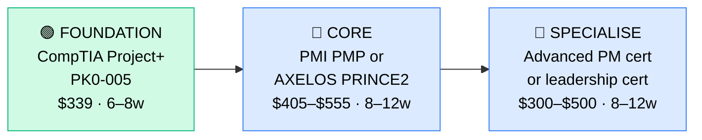

# How to Become an IT Project Manager

**`CP59`** · **IT Management** · _Time to hire: 12–18 months_ · _Entry cost: $400–$700 USD_

> **Path summary:** This path takes you from an IT operations or business analyst background to a hired IT Project Manager in 12–18 months. IT Project Managers oversee infrastructure deployments, cloud migrations, software rollouts, and digital transformation projects. This is a leadership track requiring both technical credibility (so teams respect you) and formal project management training. The salary is strong, and the work is high-impact.

---

## Role Overview

### What does an IT Project Manager actually do?

An IT Project Manager owns the delivery of IT projects: cloud migrations, infrastructure upgrades, software implementations, data centre relocations, or digital transformation initiatives. You're not doing the technical work yourself; you're orchestrating the team. On a given day, you're running standups, managing risks and timelines, escalating blockers, communicating status to stakeholders, managing budgets, and ensuring the project stays on track. You need to understand the technical domain (so you can hold teams accountable), but your day job is planning, communication, and leadership.

A typical project: "Migrate 500 users from on-premise Exchange to Microsoft 365 in 12 weeks." You'd: (1) Break it into phases, (2) Identify risks (data corruption, user training gaps), (3) Plan testing, (4) Manage the team executing the work, (5) Communicate weekly status to executives, (6) Resolve blockers when they arise.

### Where do they work?

IT Project Managers work in mid-to-large enterprises (500+ headcount) and consulting firms that deliver IT projects. You'll find them in banks, insurance companies, manufacturers, tech companies, government agencies, healthcare, and IT consulting partners (Accenture, Deloitte, IBM, EY, etc.). Team sizes vary: you might manage 3 people on a small project or 30+ on a major transformation. Remote work is increasingly common (50–60% of roles are hybrid or remote). Travel is often required — you might be on-site at client locations during active delivery phases.

### Demand in 2026

- **Global job postings:** 8,000+ active IT Project Manager roles on LinkedIn as of May 2026 [LinkedIn Jobs](https://www.linkedin.com/jobs/)
- **Growth rate:** 6–8% YoY; steady demand driven by digital transformation and infrastructure modernization
- **South Africa:** Strong demand. Banks, government, and large enterprises all hire IT Project Managers for major initiatives. Consulting partners (Deloitte, Accenture, PwC, EY) have strong staffing needs. Q1 2026 job listings show 20–30 open IT Project Manager roles in SA.
- **Remote availability:** Moderate (50–60% of roles are hybrid or remote); some on-site time expected during active delivery.

---

## Who Is This Path For?

### Ideal starting backgrounds

| Background | Readiness | What you already have |
|---|---|---|
| IT Systems Admin (3+ yrs) | ✅ Excellent start | Technical credibility; project management training is the missing piece |
| IT Infrastructure Engineer | ✅ Excellent start | Deep technical knowledge of what you'll be managing |
| Business Analyst (IT-focused) | ✅ Good start | Requirements gathering and stakeholder management skills; learn the technical side |
| IT Support Manager / Supervisor | ✅ Good start | You've managed people; learn project-specific methodologies |
| IT Service Manager (ITSM background) | ✅ Good start | Process discipline; project management is a natural next step |
| Consultant with IT delivery experience | 🟡 Good start | Delivery experience; formal PM training needed |
| MBA graduate transitioning to IT | 🟡 Possible | Management theory solid; need IT domain knowledge and credibility |
| Career changer from other PM track | 🟡 Possible | Project management skills transfer; need to learn IT specifics |

### You're ready to start this path if you can:
- Explain a complex IT infrastructure or system change (cloud migration, data centre upgrade, etc.)
- Have managed or worked closely with teams of 5+ people
- Understand IT service delivery (what SLAs are, how implementations work)
- Commit to 2–3 years in a technical IT role before moving to PM (rare exceptions exist)

> **Not ready yet?** If you don't have 2–3 years of IT operations experience, spend that time building technical credibility first. Teams won't respect a PM with no IT background.

---

## Certification Sequence

### Visual path

---

## Stage 1 — Foundation: CompTIA Project+ (Months 0–2)

**Goal:** Prove baseline project management knowledge and IT-specific PM skills.

| Cert | Code | Cost (USD) | Study Time | Why it matters |
|---|---|---:|---:|---|
| CompTIA Project+ | `PK0-005` | $339 | 40–50 hours | Entry-level project management for IT. Covers processes (planning, execution, monitoring), IT-specific scenarios, risk management, and stakeholder communication. Easier than PMP; good baseline. |

**Stage 1 total:** $339 USD · R6,102 ZAR · 6–8 weeks

**Study approach:** Use CompTIA's approved training courses (via Pluralsight, Udemy, etc.; $15–30), Professor Messer's free YouTube videos, and practice exams. The exam is 90 multiple-choice questions, 90 minutes, 70% pass rate. Most people score in the 72–80% range. Do 100+ practice questions. Schedule when consistently scoring 74%+. Plan 8–10 hours/week for 6–8 weeks.

**Lab requirement:** You don't "lab" for PM certs, but apply concepts: (1) Document a recent IT project you worked on using PM frameworks, (2) Identify the risks, timeline, and stakeholders, (3) Write a 5-page project plan as a portfolio piece.

---

## Stage 2 — Core Specialisation: PMI PMP or AXELOS PRINCE2 (Months 2–6)

**Goal:** Get a mainstream PM credential that hiring managers recognize globally.

**Option A: PMI Project Management Professional (PMP)**

| Cert | Code | Cost (USD) | Study Time | Why it matters |
|---|---|---:|---:|---|
| PMI PMP | `PMP` | $405 (members)/$555 (non-members) | 50–60 hours | Most recognized PM credential globally. Covers project management best practices, PMBOK framework, risk, scope, time, cost, quality, resources, communication, procurement, stakeholder management. Required for senior PM roles. |

**Option B: AXELOS PRINCE2 Foundation/Practitioner**

| Cert | Code | Cost (USD) | Study Time | Why it matters |
|---|---|---:|---:|---|
| PRINCE2 Foundation | `PRINCE2-F` | $200–$300 | 30–40 hours | UK/EU-centric PM methodology. Process-driven, very structured. Strong in government and European orgs. If you're in SA targeting UK/EU work, PRINCE2 is valuable. |
| PRINCE2 Practitioner | `PRINCE2-P` | $300–$400 | 20–30 hours (after Foundation) | Advanced PRINCE2; required for senior roles using PRINCE2. |

**Choose based on your target market:**
- **Choose PMP** if you want maximum global recognition, plan to work in US/Asia/multi-regional organisations, or aim for senior PM roles
- **Choose PRINCE2** if you're targeting UK/EU/government sectors or want a structured, process-driven methodology

**Stage 2 total:** $405–$555 USD (PMP) or $500–$700 (PRINCE2 F+P) · R7,290–R9,990 (PMP) or R9,000–R12,600 (PRINCE2) · 8–12 weeks

**Study approach (PMP):** Use PMBOK guide (official), PMI's approved training providers, or courses like A.Harman's "PMP Exam Prep Simplified" on Udemy. The exam is 180 questions, 230 minutes, 61% pass rate (getting harder as of 2024). Most people score 60–75%. Do 200+ practice questions. Plan 12–15 hours/week for 8–12 weeks.

**Important: PMP requires 3–5 years of PM experience** (or 4–6 years with only HS diploma). If you don't have the hours, you can't sit the exam. Plan accordingly or start with CompTIA Project+ or PRINCE2 Foundation first.

**Project milestone:** Lead or co-lead a real IT project (even a small one: infrastructure upgrade, software rollout, office relocation). Document it fully: scope, timeline, risks, budget, stakeholder communication, issues/resolutions. This becomes your portfolio evidence.

---

## Stage 3 — Advanced Specialisation (Months 6–12, optional)

**Goal:** Specialize in agile PM, risk management, or specific IT domain PM (cloud, infrastructure, security).

| Cert | Examples | Cost (USD) | Study time | Why it matters |
|---|---|---:|---:|---|
| Agile certifications | PMI-ACP, SAFe PM, Scrum Master (CSM) | $300–$500 | 30–40 hours | Many IT projects use agile. Adds flexibility to your PM skillset. |
| Risk Management | PMI-RMP | $300–$400 | 30–40 hours | Deep dive into risk; valuable for infrastructure/transformation projects |
| Cloud PM | CompTIA Cloud+ PM or vendor-specific | $250–$400 | 30–40 hours | Specialized PM for cloud migrations and deployments |

> **Optional at hire time:** Many people land their first IT PM job after Stage 2 (Project+ + PMP/PRINCE2) and complete Stage 3 certifications while employed.

---

## Timeline & Cost Summary

| Stage | Certs | Duration | Cost (USD) | Cost (ZAR) |
|---|---|---|---:|---:|
| Stage 1 — Foundation | Project+ | Weeks 0–8 | $339 | R6,102 |
| Stage 2 — Core | PMP or PRINCE2 | Weeks 8–20 | $405–$700 | R7,290–R12,600 |
| Stage 3 — Advanced | Agile/Risk/Cloud PM | Weeks 20–32 | $300–$500 | R5,400–R9,000 |
| **Total to hireable** | **Project+ + PMP** | **12–18 months** | **$744–$1,239** | **R13,392–R22,302** |

**Study hours required:** 300–400 hours total (Stage 1–2). If you study 15 hours/week, that's 5–6 months to hire. If 25 hours/week, that's 3–4 months.

---

## Salary Progression

> All figures: median base salary, not including bonuses/equity. ZAR = USD × 18 baseline (verified May 2026). Sources: Robert Half 2026 Tech Salary Guide, Glassdoor, PayScale, LinkedIn Salary.

| Experience Level | USD/year | ZAR/year | ZAR/month | Notes |
|---|---:|---:|---:|---|
| Entry / Junior PM (0–2 yrs) | $70,000 | R1,260,000 | R105,000 | Fresh from PM certs; managing small to medium projects |
| Mid-level PM (2–5 yrs) | $90,000 | R1,620,000 | R135,000 | Leading complex projects, multiple teams, strategic initiatives |
| Senior PM (5–8 yrs) | $115,000 | R2,070,000 | R172,500 | Portfolio management, large transformations, senior stakeholders |
| Principal / Manager (8+ yrs) | $150,000+ | R2,700,000+ | R225,000+ | Manager of PMs or delivery director; may move into PMO leadership |

**South Africa note:** Entry-level IT Project Managers in SA earn R60,000–R90,000/month (equivalent to $55,000–$82,000/year). Mid-level (2–5 years) earn R90,000–R130,000/month. Senior (5+ years) earn R130,000–R180,000/month. Consulting partners (Deloitte, Accenture, PwC, EY) often pay at the higher end. Government projects (SARS, Eskom, Transnet) also pay well for PMs with security clearance.

**Salary accelerators:** PMP certification (+$8,000–$15,000/year), PRINCE2 Practitioner (+$5,000–$10,000/year), agile/SAFe background (+$5,000–$10,000/year), and experience managing large transformations ($200M+) (+$20,000–$40,000/year). The fastest way to raise salary is to take progressively larger and more complex projects every 2–3 years.

---

## First Job Strategy

### Month 0–3: Build Foundation & Credibility

1. **Get IT operations experience** — If you don't have 2–3 years in IT roles, start here. Work as a Systems Admin, Infrastructure Engineer, or IT Business Analyst.
2. **Start Project+ cert** — Study for and pass CompTIA Project+ (6–8 weeks). Use free/cheap study materials; focus on understanding concepts, not memorizing.
3. **Join PM community** — Join PMI (pmi.org), attend local PMI chapter meetings, join r/projectmanagement (Reddit) or PM Discord. Network with PMs.
4. **Document PM work** — If you've been involved in any IT projects, write a retrospective: what went well, what went wrong, how you'd do it differently. Post to your portfolio/blog.

### Month 3–6: Certification + Portfolio

- **Pass Project+** — You should have this by month 2–3.
- **Decide: PMP or PRINCE2** — If targeting global roles, choose PMP. If UK/EU/government, PRINCE2. PMP is harder but more recognized.
- **Build experience for PMP hours** — If you choose PMP, you need 3–5 years of documented PM experience. If you don't have it yet, start a "PM internship" or co-lead small projects under a senior PM.
- **Project 1: Project Charter & Plan** — Write a detailed plan for a real or hypothetical IT project (infrastructure upgrade, software rollout, data centre migration). Include scope, timeline, budget, risks, communication plan.

### Month 6–12: Advanced PM + Job Hunt

- **Get PMP or PRINCE2 cert** — Study 15–20 hours/week. If PMP, ensure you have documented PM hours. Plan 12 weeks to pass.
- **Lead a real project** — Even a small project (office relocation, software refresh, vendor migration). Document it completely.
- **CV positioning:** List yourself as "IT Project Manager" once you hold Project+ + PMP/PRINCE2. List PMI ID and cert dates.
- **Target companies:** Consulting firms (Accenture, Deloitte, PwC, EY, IBM) hire PM PMs aggressively. Banks, insurance, and large enterprises also hire. Government agencies hire for major projects.
- **Interview prep:** Be ready to discuss: (1) A project you've managed/co-managed, (2) How you'd handle a scope change mid-project, (3) Risk management approach, (4) Stakeholder communication strategy, (5) Your PM philosophy.
- **Salary negotiation:** Entry-level IT PMs in SA are offered R60,000–R85,000/month. Push for R75,000–R95,000. Use Robert Half Tech Salary Guide.

---

## A Day in the Life

### IT Project Manager at a mid-sized bank — Junior Level

**08:30** — Sprint standup (if your org uses agile) or project status standup. Your team is migrating 2,000 users to cloud. You check: Are we on track? Any blockers?

**09:00** — 2-hour planning/design meeting with the infrastructure team. You're reviewing the migration plan, phasing strategy, rollback procedures. You catch a potential issue with network capacity during peak migration hours. You escalate it to the Infra Lead.

**11:00** — Update the project status dashboard. You're tracking: headcount migrated, issues/resolutions, risks, timeline variance. You're 10% behind schedule due to yesterday's network issue. You adjust the plan and update stakeholders.

**12:00** — Lunch.

**13:00** — Individual check-ins with team members. You have 8 people on your team. You touch base with each: how are they doing, any support needed, any interpersonal issues?

**15:00** — Stakeholder update meeting with the CFO and CIO. You present: progress, risks, upcoming milestones, budget status. The CFO asks about the network capacity issue. You explain the mitigation plan.

**16:00** — Risk review. You update your risk register: probability and impact for each identified risk. A new risk emerged: one team member is leaving. You mitigate by reassigning their work.

**17:00** — End of day. Evening: work on next week's detailed plan (1 hour).

---

### IT Project Manager at a consulting firm — Mid Level

**09:00** — Standup with your delivery team. You're managing a cloud migration project for a Fortune 500 manufacturing company. You're in month 4 of 8.

**09:30** — Escalation meeting. A critical issue: one of your contractors needs to extend their engagement, but the client has budget constraints. You work with the client and your delivery manager to find a solution.

**11:00** — Design review with architects. You're planning the Phase 3 cutover. You challenge the plan: "What happens if this system doesn't migrate on time? How do we handle rollback?" The architects refine the plan.

**12:30** — Lunch with another PM on a different project. You swap war stories and lessons learned.

**13:30** — Update the programme management office (PMO). You submit weekly status: RAG (Red/Amber/Green) status, KPIs, risk updates, financial tracking.

**15:00** — Coaching session with a junior PM on your team. They're managing a smaller sub-project; you review their plan and provide feedback.

**16:00** — Strategic planning. The client is considering a Phase 4 (beyond the current scope). You outline the effort, cost, and timeline for Phase 4 as a proposal to the client.

**17:00** — End of day. You'll present the Phase 4 proposal to the client next week.

---

## Related Paths & Progressions

| From here you can move to… | Why |
|---|---|
| [PMO Director / Programme Manager](CP{NN}_{slug}.md) | Scale up: manage a portfolio of projects instead of individual projects |
| [IT Director / VP IT](CP{NN}_{slug}.md) | With 5–8 years of PM success, transition to IT leadership |
| [CIO Track](CP64_ITMgmt_CIO_Track.md) | IT leadership role; PMO/PM background is a strong foundation |
| [Consulting Leadership / Partner](CP{NN}_{slug}.md) | If at a consulting firm, move into consulting management or partnership |

---

## South Africa Context

### Market specifics

IT Project Managers are in strong demand in South Africa, particularly for digital transformation and infrastructure modernization initiatives. Banks (Nedbank, Standard Bank, ABSA, FNB, Capitec) are running major cloud migrations and digital projects. Government agencies and parastatals (SARS, Eskom, Transnet) have large IT programmes. Consulting firms (Deloitte, PwC, EY, Accenture, Cognizant) have strong staffing needs for PM roles.

The advantage: IT PM roles in SA often pay well, and there's significant remote work for international consulting firms. Many SA-based PMs work for UK/US consulting firms, earning in foreign currency and adding 30–40% to local salary equivalents.

BEE/EE considerations: Government and state-owned enterprises have preferential hiring for previously disadvantaged individuals. PMP and PRINCE2 certifications are merit-based and highly valued. Many consulting firms prioritize diversity in PM hiring.

### SA-specific resources

| Resource | URL | Note |
|---|---|---|
| PMI South Africa Chapter | [https://www.pmi.org/](https://www.pmi.org/) | Official PMI chapter; networking and events |
| IPMA South Africa | [https://www.ipma.world/](https://www.ipma.world/) | Alternative PM certification body; some SA orgs prefer IPMA |
| Deloitte Consulting – SA | [https://www.deloitte.com/za/en.html](https://www.deloitte.com/za/en.html) | Major consulting firm; PM hiring |
| PwC Consulting – SA | [https://www.pwc.co.za/](https://www.pwc.co.za/) | Big 4 consulting; active PM staffing |
| LinkedIn Jobs ZA | [https://www.linkedin.com/jobs/search/?keywords=IT+Project+Manager&location=South+Africa](https://www.linkedin.com/jobs/) | ZA-based PM roles |

---

## Frequently Asked Questions

**Q: Do I need PMP or Project+ first?**

A: Start with CompTIA Project+ (easier, no experience requirement). Then PMP (harder, but more prestigious). Many people do Project+ → PMP in sequence.

**Q: Do I really need 2–3 years of IT operations experience first?**

A: Strongly recommended, yes. Teams won't respect a PM with no technical background. You need credibility. If you transition directly from outside IT, you'll struggle to manage technical teams.

**Q: How long does it really take to become an IT PM?**

A: 12–18 months if you have 2–3 years of IT operations background. Add 2–3 more years if you're starting from scratch in IT.

**Q: Is PMP worth it or should I do PRINCE2?**

A: Both are valuable. PMP is more globally recognized. PRINCE2 is more process-structured and valued in government/UK/EU. Choose based on your target market.

**Q: Can I do this while working full-time?**

A: Yes. At 15 hours/week, you can pass Project+ in 8 weeks and PMP in 12 weeks while working. Many people do this.

---

## Sources & Further Reading

| # | Source | URL | Used for |
|---|---|---|---|
| 1 | LinkedIn Jobs — IT Project Manager | [https://www.linkedin.com/jobs/search/?keywords=IT+Project+Manager](https://www.linkedin.com/jobs/) | Job volume and market demand |
| 2 | Glassdoor IT PM Salary | [https://www.glassdoor.com/Salaries/it-project-manager-salary-SRCH_KO0,17.htm](https://www.glassdoor.com/Salaries/) | US salary ranges |
| 3 | PMI PMP Certification | [https://www.pmi.org/certifications/types/project-management-professional-pmp](https://www.pmi.org/certifications/) | Official PMP requirements |
| 4 | CompTIA Project+ | [https://www.comptia.org/certifications/project](https://www.comptia.org/certifications/project) | Official Project+ info |
| 5 | Robert Half 2026 Tech Salary Guide | [https://www.roberthalf.com/salary-guide](https://www.roberthalf.com/salary-guide) | Salary progression |
| 6 | LinkedIn Jobs — South Africa | [https://www.linkedin.com/jobs/search/?keywords=Project+Manager&locationId=ZA](https://www.linkedin.com/jobs/) | SA job market |
| 7 | PayScale IT PM Salary | [https://www.payscale.com/research/ZA/Job=Project_Manager,_IT](https://www.payscale.com/) | ZAR salary data |
| 8 | Deloitte South Africa | [https://www.deloitte.com/za/en.html](https://www.deloitte.com/za/en.html) | Major consulting partner |

---

*Template version: 2026-05-02 | Maintained by IT Career Roadmap | ZAR baseline: R18/$1 USD*
*File naming: `Career_Paths/CP59_ITMgmt_IT_Project_Manager.md`*
