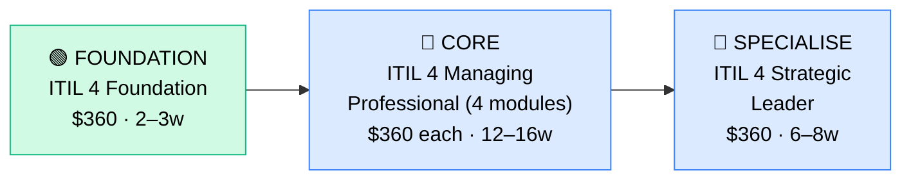

# How to Become an ITIL Service Manager

**`CP60`** · **IT Management** · _Time to hire: 12–18 months_ · _Entry cost: $500–$1,000 USD_

> **Path summary:** This path takes you from zero or an IT support background to a hired ITIL Service Manager in 12–18 months. ITIL (Information Technology Infrastructure Library) is the global standard for IT service management. ITIL Service Managers oversee the delivery of IT services to business teams, managing incidents, changes, problems, and continuous improvement. This is a leadership track suitable for people with strong process discipline and customer focus.

---

## Role Overview

### What does an ITIL Service Manager actually do?

An ITIL Service Manager owns the operational delivery of IT services to business teams. You're managing: incident management (rapid resolution of outages), change management (safe deployment of changes), problem management (root-cause analysis of recurring issues), service continuity (disaster recovery planning), and continuous service improvement. You're not hands-on fixing systems; you're orchestrating the processes and people that do. You work with Service Desks, infrastructure teams, security teams, and business stakeholders.

On a given day, you might: chair a change advisory board (CAB) meeting to approve next week's database patches, review incident metrics and identify trends, lead a problem management investigation (why do we keep getting email outages?), manage a major incident (data centre power failure), communicate status to business leaders, and implement a new SLA for cloud services.

### Where do they work?

ITIL Service Managers work in mid-to-large enterprises (500+ headcount) and IT service delivery firms (managed service providers, consulting firms). Any organisation with a formal IT Service Desk or operations centre likely needs ITIL managers. You'll find them in: banks, insurance, healthcare, government, telecommunications, manufacturing, and managed service provider (MSP) firms. Team sizes vary: you might manage 10 people on a help desk team or oversee service delivery across 100+ support staff. Remote work is increasingly common (40–60% of roles are hybrid). On-call during incidents is expected.

### Demand in 2026

- **Global job postings:** 7,000+ active ITIL Service Manager roles on LinkedIn as of May 2026 [LinkedIn Jobs](https://www.linkedin.com/jobs/)
- **Growth rate:** 5–7% YoY; steady demand as enterprises focus on service management maturity
- **South Africa:** Strong demand. Banks, insurance, telcos, and government all need ITIL managers. MSPs serving SA (Dimension Data, BCX, EOH) hire actively. Q1 2026 job listings show 20–35 open ITIL/Service Manager roles in SA.
- **Remote availability:** Moderate (40–60% hybrid or remote); some on-site time for escalations and strategic work.

---

## Who Is This Path For?

### Ideal starting backgrounds

| Background | Readiness | What you already have |
|---|---|---|
| IT Help Desk / Service Desk | ✅ Excellent start | You see incidents daily; ITIL processes formalize what you're doing |
| IT Support Manager (team lead) | ✅ Excellent start | You already manage people and service delivery |
| IT Operations / NOC technician | ✅ Excellent start | You understand operations discipline and incident response |
| ITSM / Service Centre analyst | ✅ Good start | You know the processes; management training is the next step |
| IT Incident Manager / Problem Manager | ✅ Good start | You're deep in specific ITIL domains; expand to full service management |
| IT Project Manager transitioning to operations | 🟡 Possible | PM skills help; need ITIL/service management domain knowledge |
| Career changer with customer service background | 🟡 Possible | Customer focus is valuable; need IT operations experience first |

### You're ready to start this path if you can:
- Explain what incident and change management processes are (from experience)
- Have worked in IT support or operations for 2+ years
- Understand SLAs and service level targets
- Have managed or worked in small teams (3+)

> **Not ready yet?** If you don't have IT support/operations background, spend 2 years in a Help Desk or IT Operations role first.

---

## Certification Sequence

### Visual path

---

## Stage 1 — Foundation: ITIL 4 Foundation (Months 0–1)

**Goal:** Prove you understand ITIL's structure, core concepts, and service management principles.

| Cert | Code | Cost (USD) | Study Time | Why it matters |
|---|---|---:|---:|---|
| ITIL 4 Foundation | `ITIL-F` | $360 | 20–30 hours | Overview of ITIL 4 (the modern version), service management principles, service value chain, and key processes. Entry-level; accessible to anyone. |

**Stage 1 total:** $360 USD · R6,480 ZAR · 2–3 weeks

**Study approach:** Use official AXELOS training (via Learning Portal or Udemy; $15–30), van Haren Publishing's ITIL 4 book, or PeopleCert's official materials. The exam is 40 multiple-choice questions, 60 minutes, 65% pass rate. Very achievable with IT support background. Study 8–10 hours/week for 2–3 weeks. Focus on: service value chain, guiding principles, and processes.

**Lab requirement:** Document your current IT organisation's incident and change processes (however informal). Compare to ITIL best practices. Write a 3-page analysis of what your org does well and where ITIL processes could improve.

---

## Stage 2 — Core Specialisation: ITIL 4 Managing Professional (Months 1–6)

**Goal:** Get certified as an ITIL 4 Managing Professional by completing 4 modules across 8–10 weeks.

The four required modules:
1. **CDS (Create, Deliver & Support)** — Service design, transition, and operation
2. **DSV (Drive Stakeholder Value)** — Value creation and business alignment
3. **HVIT (High-Velocity IT)** — Agile, DevOps, and rapid delivery
4. **DPI (Direct, Plan & Improve)** — Governance, strategy, and improvement

| Cert | Code | Cost (USD) | Study Time | Why it matters |
|---|---|---:|---:|---|
| ITIL 4 MP — 4 modules combined | `ITIL-MP` | $1,440 ($360 × 4) | 40–50 hours per module | Deep expertise in service management across all domains. This is the credential hiring managers expect for Service Manager roles. |

**Stage 2 total:** $1,440 USD · R25,920 ZAR · 12–16 weeks

**Study approach:** Take one module every 3–4 weeks. Each module exam is 45 multiple-choice questions, 90 minutes, 68% pass rate. Most people score 68–75%. Do 100+ practice questions per module. You can take modules in any order, but CDS is recommended first. Plan 10 hours/week per module × 4 modules = 40 weeks, but overlapping study reduces this to 12–16 weeks.

**Project milestone:** Lead or design a service improvement initiative at your workplace. Example: "Implement an ITIL-based incident categorisation system" or "Design a change management process for our infrastructure team." Document the process design, training plan, and expected improvements.

---

## Stage 3 — Advanced Specialisation: ITIL 4 Strategic Leader (Months 6–12, optional)

**Goal:** Become an ITIL 4 Strategic Leader — the highest ITIL certification level.

| Cert | Code | Cost (USD) | Study Time | Why it matters |
|---|---|---:|---:|---|
| ITIL 4 Strategic Leader (SL) | `ITIL-SL` | $360 | 30–40 hours | Capstone certification; requires you to synthesize all ITIL 4 knowledge and apply to strategic scenarios. Available only after you've passed Foundation + 3+ MP modules. |

**Stage 3 total:** $360 USD · R6,480 ZAR · 6–8 weeks

> **Optional at hire time:** Many people land their first ITIL Service Manager job after completing Stage 2 (Foundation + MP modules). Strategic Leader is typically done after 2–3 years of experience in an ITIL environment.

---

## Timeline & Cost Summary

| Stage | Certs | Duration | Cost (USD) | Cost (ZAR) |
|---|---|---|---:|---:|
| Stage 1 — Foundation | ITIL 4 Foundation | Weeks 0–3 | $360 | R6,480 |
| Stage 2 — Core | ITIL 4 Managing Professional (4 modules) | Weeks 3–19 | $1,440 | R25,920 |
| Stage 3 — Advanced | ITIL 4 Strategic Leader | Weeks 19–27 | $360 | R6,480 |
| **Total to hireable** | **Foundation + 2–3 MP modules** | **12–18 months** | **$1,080–$1,440** | **R19,440–R25,920** |

**Study hours required:** 200–250 hours total (Stage 1–2). If you study 12 hours/week, that's 4–5 months. Many people compress this by overlapping module study.

---

## Salary Progression

> All figures: median base salary, not including bonuses/equity. ZAR = USD × 18 baseline (verified May 2026). Sources: Robert Half 2026 Tech Salary Guide, Glassdoor, PayScale, LinkedIn Salary.

| Experience Level | USD/year | ZAR/year | ZAR/month | Notes |
|---|---:|---:|---:|---|
| Entry / Junior Service Manager (0–2 yrs) | $70,000 | R1,260,000 | R105,000 | Fresh from ITIL certs; managing small service delivery teams |
| Mid-level Service Manager (2–5 yrs) | $90,000 | R1,620,000 | R135,000 | Owning multiple service areas, leading teams, strategic initiatives |
| Senior Service Manager (5–8 yrs) | $110,000 | R1,980,000 | R165,000 | Service delivery director, multi-team leadership, executive visibility |
| Director / VP (8+ yrs) | $150,000+ | R2,700,000+ | R225,000+ | IT operations director or VP role; may move into CIO track |

**South Africa note:** Entry-level ITIL Service Managers in SA earn R60,000–R85,000/month (equivalent to $55,000–$77,000/year). Mid-level (2–5 years) earn R85,000–R125,000/month. Senior (5+ years) earn R125,000–R180,000/month. Government and parastatals (SARS, Eskom, Transnet) often pay at the higher end due to scale and complexity. MSPs typically pay lower but offer fast-track management opportunities.

**Salary accelerators:** ITIL 4 Strategic Leader cert (+$5,000–$10,000/year), experience managing large service desks (200+ staff) (+$10,000–$20,000/year), cloud service management expertise (+$5,000–$10,000/year), and transition to director/VP roles (+$30,000–$60,000/year). The fastest way to raise salary is to take progressively larger service delivery portfolios.

---

## First Job Strategy

### Month 0–3: Build Foundation

1. **Start in IT Support/Help Desk** — If you don't have 2+ years, get a Help Desk job first (6–12 months minimum)
2. **Pass ITIL 4 Foundation** — 2–3 weeks of study (20–30 hours)
3. **Join ITIL community** — Join AXELOS community, r/ITIL (Reddit), or local ITIL groups
4. **Document your workplace** — Analyze your current IT support processes against ITIL best practices; identify gaps; propose improvements

### Month 3–6: Certification

- **Start ITIL 4 Managing Professional** — Begin Module 1 (CDS recommended)
- **Take one module every 3–4 weeks** — CDS → DSV → HVIT → DPI
- **Lead a service improvement project** — Even a small one (improve incident response, implement change control, etc.)

### Month 6–12: Advanced + Job Hunt

- **Complete 2–3 ITIL MP modules** — You don't need all 4 to be hireable; 2–3 is sufficient for entry
- **CV positioning:** List yourself as "ITIL Service Manager" once you hold Foundation + 2 MP modules. List certification numbers.
- **Target companies:** Service delivery teams at banks, insurance, telcos, government. MSPs (Dimension Data, BCX, EOH). Consulting firms.
- **Interview prep:** Be ready to discuss: (1) Your service desk or operations experience, (2) An incident you managed, (3) A change you implemented, (4) Your understanding of ITIL processes, (5) A service improvement you'd implement.
- **Salary negotiation:** Entry-level ITIL Service Managers in SA are offered R60,000–R80,000/month. Push for R75,000–R90,000. Use Robert Half Tech Salary Guide.

---

## A Day in the Life

### ITIL Service Manager at a bank — Junior Level

**08:00** — Check incident dashboard. 12 open incidents across 3 severity levels. One Sev 1 (email down for Finance team). You call a bridge to coordinate response.

**08:30** — Incident bridge call. Email system is down due to database failures. The DBA team is investigating. You coordinate: keep Finance updated, monitor resolution time, escalate if it hits SLA breach (30 minutes for Sev 1).

**09:30** — Email restored. Total downtime: 22 minutes (within SLA). You close the incident and assign to Problem Management to investigate root cause.

**10:00** — Change advisory board (CAB) meeting. You review 5 pending changes for next week: server patching, app updates, database migrations. You assess risk and approve 4; defer 1 for more testing.

**11:00** — One-on-ones with your service desk team (5 people). You check in on their incidents, workload, and wellbeing.

**12:00** — Lunch.

**13:00** — Problem management review. Your Problem Manager briefs you on the email outage root cause (database config bug). You assign an action to the DBA team to fix it permanently.

**14:30** — Service continuity planning. You're reviewing the disaster recovery plan for critical systems. It hasn't been tested in 9 months; you schedule a test for next month.

**16:00** — Weekly metrics dashboard. Prepare incident trends, SLA performance, and team workload for your manager. Everything is green; no escalations needed.

**17:00** — End of day.

---

### ITIL Service Manager at an MSP — Mid Level

**09:00** — Standup with your delivery team. You manage 3 service delivery managers across 20+ client accounts.

**09:30** — Client escalation: a major client's on-call engineer is overwhelmed with incidents. You investigate; they're getting 50+ incidents/week (unusual). Root cause: a bad change in their environment. You coordinate with your change team to roll it back.

**11:00** — Service strategy meeting with your management team. You're planning Q2 service improvements and pricing changes for client contracts.

**12:00** — Lunch.

**13:00** — SLA review. One of your clients is consistently missing availability SLAs. You dive into the data: the issue is during after-hours (your contract includes 24/7 support). You propose increasing after-hours staffing and present to the client.

**14:30** — Continuous improvement workshop. You're facilitating a discussion on how to improve incident first-contact resolution. Your team brainstorms: better knowledge base, more training, automation opportunities.

**16:00** — Hiring interview for a new Service Desk analyst. You're building the team.

**17:00** — End of day. Tomorrow: deliver the SLA improvement proposal to the client.

---

## Related Paths & Progressions

| From here you can move to… | Why |
|---|---|
| [IT Director / VP IT](CP{NN}_{slug}.md) | Service management background is a strong foundation for IT operations leadership |
| [CIO Track](CP64_ITMgmt_CIO_Track.md) | ITIL/service management expertise is a key pillar for CIO roles |
| [IT Auditor / GRC Manager](CP61_ITMgmt_GRC_Manager.md) | Service management + audit/compliance focus → GRC track |
| [Consulting Leadership](CP{NN}_{slug}.md) | If at an MSP/consulting firm, move into consulting management |

---

## South Africa Context

### Market specifics

ITIL Service Managers are in strong demand in SA, particularly in the financial services sector and government. Banks (Nedbank, Standard Bank, ABSA, FNB, Capitec) all run large ITSM operations. Government agencies and parastatals (SARS, Department of Health, Eskom, Transnet) have significant service desks and ITIL governance. MSPs and managed service providers (Dimension Data, BCX, EOH) hire ITIL managers aggressively.

The advantage: ITIL roles are typically stable and less pressured than development roles. Service management is essential and always in demand. Government and parastatals offer good job security and benefits.

BEE/EE considerations: Government and state-owned enterprises have preferential hiring for previously disadvantaged individuals. ITIL certifications are merit-based and help level the field. Many organisations actively recruit from previously disadvantaged backgrounds for ITSM roles.

### SA-specific resources

| Resource | URL | Note |
|---|---|---|
| AXELOS ITIL Certification | [https://www.axelos.com/certifications/itil-certification](https://www.axelos.com/certifications/itil-certification) | Official ITIL certification body |
| ITIL4 Community – SA | [https://www.axelos.com/](https://www.axelos.com/) | Network and forums |
| Dimension Data ITSM Services | [https://www.dimensiondata.com/](https://www.dimensiondata.com/) | MSP with ITSM practice in SA |
| LinkedIn Jobs ZA | [https://www.linkedin.com/jobs/search/?keywords=Service%20Manager&locationId=ZA](https://www.linkedin.com/jobs/) | ZA service manager roles |

---

## Frequently Asked Questions

**Q: Do I need IT operations experience before becoming an ITIL Service Manager?**

A: Strongly recommended, yes. At least 2 years in IT Support or IT Operations. ITIL is the language of service management, but you need real experience to understand why the processes matter.

**Q: Should I do ITIL 4 or stick with ITIL 3 / PRINCE2?**

A: Do ITIL 4. It's the current standard (ITIL 3 sunsets in 2024). PRINCE2 is for project management, not service management; they're complementary but different.

**Q: Do I need all 4 ITIL MP modules to get hired?**

A: No. 2–3 modules is sufficient for entry-level Service Manager roles. Many people complete all 4 over their first 2 years in the role.

**Q: How long does it realistically take?**

A: 12–18 months from zero (or from Help Desk background). 4–8 weeks if you already have IT ops experience and just need certs.

**Q: Can I do this while working full-time?**

A: Yes. At 12 hours/week, you can pass Foundation + 2 MP modules in 4–5 months while working. Many people do this.

---

## Sources & Further Reading

| # | Source | URL | Used for |
|---|---|---|---|
| 1 | LinkedIn Jobs — ITIL Service Manager | [https://www.linkedin.com/jobs/search/?keywords=ITIL+Service+Manager](https://www.linkedin.com/jobs/) | Job volume and market demand |
| 2 | Glassdoor ITIL Manager Salary | [https://www.glassdoor.com/Salaries/itil-service-manager-salary-SRCH_KO0,21.htm](https://www.glassdoor.com/Salaries/) | US salary ranges |
| 3 | AXELOS ITIL 4 Certification | [https://www.axelos.com/certifications/itil-certification](https://www.axelos.com/certifications/itil-certification) | Official ITIL requirements |
| 4 | ITIL 4 Foundation Handbook | [https://www.axelos.com/](https://www.axelos.com/) | Study material |
| 5 | Robert Half 2026 Tech Salary Guide | [https://www.roberthalf.com/salary-guide](https://www.roberthalf.com/salary-guide) | Salary progression |
| 6 | LinkedIn Jobs — South Africa | [https://www.linkedin.com/jobs/search/?keywords=Service%20Manager&locationId=ZA](https://www.linkedin.com/jobs/) | SA job market |
| 7 | PayScale ITIL Manager Salary | [https://www.payscale.com/research/ZA/Job=IT_Service_Manager](https://www.payscale.com/) | ZAR salary data |
| 8 | Dimension Data — SA | [https://www.dimensiondata.com/](https://www.dimensiondata.com/) | Major MSP/employer |

---

*Template version: 2026-05-02 | Maintained by IT Career Roadmap | ZAR baseline: R18/$1 USD*
*File naming: `Career_Paths/CP60_ITMgmt_ITIL_Service_Manager.md`*
