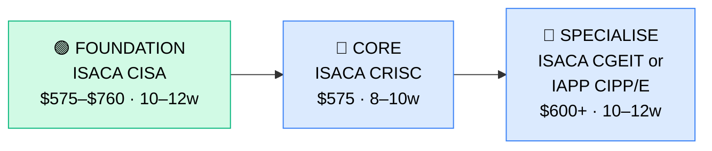

# How to Become a GRC Manager

**`CP61`** · **IT Management** · _Time to hire: 18–24 months_ · _Entry cost: $600–$1,200 USD_

> **Path summary:** This path takes you from an audit, compliance, or IT security background to a hired GRC Manager in 18–24 months. GRC (Governance, Risk & Compliance) is critical in regulated industries (banking, healthcare, insurance, government). GRC Managers oversee risk assessments, compliance programmes, audit readiness, and IT governance. This is a high-stakes role with strong pay and job security.

---

## Role Overview

### What does a GRC Manager actually do?

A GRC Manager oversees three interconnected domains: Governance (how IT decisions are made), Risk (identifying and mitigating threats), and Compliance (meeting regulatory requirements like GDPR, SOX, HIPAA, PCI-DSS, POPIA). You're responsible for: conducting risk assessments, building and monitoring compliance frameworks, coordinating internal/external audits, managing security policies, overseeing incident response, and reporting to the board/regulators. You're not doing audits yourself; you're orchestrating the governance system.

On a given day, you might: review a risk assessment for a cloud migration, ensure upcoming POPIA compliance requirements are met, coordinate with Internal Audit on a regulatory exam, update the risk register, draft a security policy, or brief the Audit Committee on your control environment.

### Where do they work?

GRC Managers work in regulated industries and mid-to-large enterprises (500+ headcount): banks, insurance companies, healthcare, government agencies, telecommunications, and multinational corporations. You'll also find them in consulting firms advising on GRC. GRC roles are less common in startups or unregulated companies. Team sizes vary: you might manage 3 people on a small compliance team or oversee 20+ across a large GRC function. Remote work is increasingly common (40–60% hybrid). Travel may be required for board meetings, external audits, or regulatory visits.

### Demand in 2026

- **Global job postings:** 5,000+ active GRC Manager roles on LinkedIn as of May 2026 [LinkedIn Jobs](https://www.linkedin.com/jobs/)
- **Growth rate:** 8–10% YoY; strong due to increasing regulation (GDPR, POPIA, HIPAA, etc.) and cyber risk
- **South Africa:** Growing demand. SA financial institutions (Nedbank, Standard Bank, ABSA, FNB) all have GRC functions. Insurance (Discovery, Old Mutual), government agencies (SARS, Justice Department), and multinational offices in SA hire GRC professionals. Q1 2026 job listings show 15–25 open GRC/Compliance roles in SA.
- **Remote availability:** Moderate (40–60% hybrid); some on-site required for regulatory visits and board interactions.

---

## Who Is This Path For?

### Ideal starting backgrounds

| Background | Readiness | What you already have |
|---|---|---|
| Internal Auditor / External Auditor | ✅ Excellent start | You understand audit methodology, evidence gathering, control testing |
| Compliance Analyst / Officer | ✅ Excellent start | You understand regulatory frameworks and compliance processes |
| IT Risk Manager | ✅ Excellent start | Risk assessment and mitigation skills; move to full GRC |
| IT Security Manager | ✅ Good start | Security is one pillar of GRC; add risk and compliance knowledge |
| IT Control Officer | ✅ Good start | You understand control environments; need broader compliance knowledge |
| Finance/Legal professional transitioning to IT GRC | 🟡 Possible | You understand regulation; need IT/technical GRC knowledge |
| MBA graduate with audit/compliance focus | 🟡 Possible | Management theory solid; need IT GRC domain expertise |
| Career changer from banking/insurance compliance | 🟡 Possible | Compliance knowledge carries over; need to learn IT-specific frameworks |

### You're ready to start this path if you can:
- Explain what an audit procedure is and how evidence is gathered
- Understand regulatory frameworks (GDPR, HIPAA, POPIA, SOX, PCI-DSS) at a basic level
- Have 2–3 years in audit, compliance, risk, or security roles
- Understand IT systems at a functional level (not necessarily hands-on technical)

> **Not ready yet?** If you don't have audit/compliance background, spend 2–3 years in Compliance or Internal Audit roles first.

---

## Certification Sequence

### Visual path

---

## Stage 1 — Foundation: ISACA CISA (Months 0–3)

**Goal:** Become a Certified Information Systems Auditor. This is the anchor credential for GRC.

| Cert | Code | Cost (USD) | Study Time | Why it matters |
|---|---|---:|---:|---|
| ISACA Certified Information Systems Auditor | `CISA` | $575 (members) / $760 (non-members) | 60–80 hours | Gold-standard IT audit certification. Covers auditing IT systems, controls, security, and compliance. CISA is the foundational credential for GRC roles. |

**Stage 1 total:** $575–$760 USD · R10,350–R13,680 ZAR · 10–12 weeks

**Study approach:** Use ISACA's official resources (CISA Review Manual), courses from Pluralsight/Udemy, and practice exams. The CISA exam is 150 multiple-choice questions (all domains tested), 4 hours. 65% pass rate. Most people score 65–78%. Do 200+ practice questions. You must have 5 years of IT audit/security experience to sit; if you don't, substitute related experience. Plan 15–20 hours/week for 10–12 weeks.

**Lab requirement:** Conduct a mock IT audit. Write a 10-page audit programme covering control testing (access controls, change management, incident response). Include sample testing procedures and evidence requirements.

---

## Stage 2 — Core Specialisation: ISACA CRISC (Months 3–6)

**Goal:** Become a Certified in Risk and Information Systems Control. This adds risk management to your GRC toolkit.

| Cert | Code | Cost (USD) | Study Time | Why it matters |
|---|---|---:|---:|---|
| ISACA Certified in Risk and Information Systems Control | `CRISC` | $575 | 50–60 hours | Covers IT risk identification, analysis, and mitigation. CRISC pairs with CISA to create a strong GRC foundation. Many enterprises require both. |

**Stage 2 total:** $575 USD · R10,350 ZAR · 8–10 weeks

**Study approach:** Use ISACA's CRISC materials, Udemy courses, and practice exams. The exam is 150 multiple-choice questions, 3.5 hours, 63% pass rate. Most people score 63–75%. Do 200+ practice questions. You need 3 years of IT risk experience to sit. Plan 12–15 hours/week for 8–10 weeks.

**Project milestone:** Conduct a risk assessment for a fictional (or real) IT system or project. Identify threats, vulnerabilities, impact, probability, and mitigation strategies. Write a 5-page risk assessment report and present it.

---

## Stage 3 — Advanced Specialisation (Months 6–12, optional)

**Goal:** Specialize in IT governance or privacy compliance.

**Option A: ISACA CGEIT (IT Governance)**

| Cert | Code | Cost (USD) | Study Time | Why it matters |
|---|---|---:|---:|---|
| ISACA Certified in the Governance of Enterprise IT | `CGEIT` | $575 | 50–60 hours | Advanced focus on IT governance frameworks, aligning IT to business, managing IT value. Pairs well with CISA+CRISC for full GRC. |

**Option B: IAPP CIPP/E (Privacy Law — GDPR/POPIA focused)**

| Cert | Code | Cost (USD) | Study Time | Why it matters |
|---|---|---:|---:|---|
| IAPP Certified Information Privacy Professional / Europe | `CIPP/E` | $600–$800 | 50–60 hours | Deep dive into EU/SA privacy law (GDPR, POPIA). Increasingly valuable as privacy regulations tighten globally. |

> **Optional at hire time:** Many people land their first GRC Manager role after CISA + CRISC. CGEIT is typically done in year 2–3 in the role.

---

## Timeline & Cost Summary

| Stage | Certs | Duration | Cost (USD) | Cost (ZAR) |
|---|---|---|---:|---:|
| Stage 1 — Foundation | CISA | Weeks 0–12 | $575–$760 | R10,350–R13,680 |
| Stage 2 — Core | CRISC | Weeks 12–22 | $575 | R10,350 |
| Stage 3 — Advanced | CGEIT or CIPP/E | Weeks 22–34 | $575–$800 | R10,350–R14,400 |
| **Total to hireable** | **CISA + CRISC** | **18–24 months** | **$1,150–$1,535** | **R20,700–R27,630** |

**Study hours required:** 300–350 hours total (Stage 1–2). If you study 15–20 hours/week, that's 5–6 months of intense study.

---

## Salary Progression

> All figures: median base salary, not including bonuses/equity. ZAR = USD × 18 baseline (verified May 2026). Sources: Robert Half 2026 Tech Salary Guide, Glassdoor, PayScale, LinkedIn Salary.

| Experience Level | USD/year | ZAR/year | ZAR/month | Notes |
|---|---:|---:|---:|---|
| Entry / Junior GRC Manager (0–2 yrs) | $85,000 | R1,530,000 | R127,500 | Fresh from CISA+CRISC; leading small GRC functions |
| Mid-level GRC Manager (2–5 yrs) | $110,000 | R1,980,000 | R165,000 | Owning risk/compliance programmes, leading audits, strategic initiatives |
| Senior GRC Manager (5–8 yrs) | $140,000 | R2,520,000 | R210,000 | GRC director or VP role, executive visibility, board engagement |
| Chief Risk Officer / Chief Compliance Officer (8+ yrs) | $180,000+ | R3,240,000+ | R270,000+ | C-level role; may report to board or CEO |

**South Africa note:** Entry-level GRC Managers in SA earn R80,000–R110,000/month (equivalent to $73,000–$100,000/year). Mid-level (2–5 years) earn R110,000–R160,000/month. Senior (5+ years) earn R160,000–R220,000/month. Government agencies and financial services (banks, insurance) typically pay at the higher end due to regulatory complexity and scale.

**Salary accelerators:** CRISC certification (+$8,000–$12,000/year), CGEIT certification (+$10,000–$15,000/year), CIPP/E (privacy focus) (+$8,000–$12,000/year), and experience managing large regulatory programs (+$20,000–$40,000/year). Transition to Chief Risk/Compliance Officer roles adds $50,000+/year.

---

## First Job Strategy

### Month 0–6: Build Foundation

1. **Land an audit or compliance role** — If you don't have 2–3 years in audit/compliance, do this first (12–18 months)
2. **Join ISACA** — Membership is ~$200/year; provides resources and networking
3. **Start CISA prep** — Enroll in Pluralsight or Udemy courses; plan 3–4 months of study while working full-time
4. **Document your audit work** — Collect examples of audits, compliance assessments, risk analyses you've conducted

### Month 6–12: CISA Certification

- **Intensive CISA study** — 15–20 hours/week for 10–12 weeks
- **Mock audits** — Conduct 2–3 mock IT audits; document thoroughly
- **Pass CISA exam** — Target month 6–8
- **Network** — Attend ISACA meetings, join online communities

### Month 12–18: CRISC + Job Hunt

- **Start CRISC study** — 12–15 hours/week for 8–10 weeks
- **Risk assessment project** — Conduct a full IT risk assessment for your workplace or a case study
- **CV positioning:** List yourself as "GRC Manager / Compliance Manager" with CISA + CRISC. List certification numbers and ISACA ID.
- **Target companies:** Banks, insurance, government agencies, healthcare, multinational corporations. Consulting firms (Deloitte, PwC, EY) also hire GRC consultants.
- **Interview prep:** Be ready to discuss: (1) A complex audit you conducted, (2) How you'd approach a risk assessment for a cloud migration, (3) A compliance challenge you solved, (4) Your understanding of GDPR/POPIA/SOX/PCI-DSS, (5) Your CISA + CRISC projects.
- **Salary negotiation:** Entry-level GRC Managers in SA are offered R80,000–R100,000/month. Push for R100,000–R120,000. Use Robert Half Tech Salary Guide.

---

## A Day in the Life

### GRC Manager at a bank — Junior Level

**08:00** — Risk committee meeting prep. You're presenting a risk assessment for a new fintech partnership (blockchain-based payment system). You review your draft assessment: threat profile, mitigation strategies, residual risk.

**09:00** — Risk committee meeting. You present the assessment to executives. There's a spirited discussion about regulatory approval; you help clarify the risks and control requirements.

**10:30** — Audit preparation. The bank's Internal Auditors are conducting a mid-year audit. You prepare control documentation for three key areas: access controls, change management, data security.

**12:00** — Lunch.

**13:00** — Compliance review. POPIA compliance deadline is 3 months away. You review your compliance programme: data inventory, consent management, breach notification procedures. You identify 3 gaps; you assign actions.

**15:00** — GDPR update. You've just received new EU guidance on AI systems. You assess whether the bank's AI initiatives (credit decisioning) fall under the new rules. You draft guidance for the Chief Data Officer.

**16:30** — Document control updates. You update the GRC policy library with new standards and best practices.

**17:00** — End of day.

---

### GRC Manager at a consulting firm — Mid Level

**09:00** — Standup with your GRC consulting team. You're serving 4 client engagements, ranging from small compliance assessments to large risk programs.

**09:30** — Client 1: Lead a risk workshop. The client is planning a major infrastructure migration. You facilitate a 2-hour session identifying IT risks, building a risk heatmap, and defining mitigation strategies.

**11:30** — Client 2: Review a compliance programme design. The client (a healthcare provider) needs to meet HIPAA requirements. You review their control environment, identify gaps, and propose a remediation roadmap.

**13:00** — Lunch.

**14:00** — Client 3: Conduct interviews for a compliance assessment. You're interviewing IT staff about their security practices, incident response, and control awareness.

**15:30** — Internal: Mentor a junior GRC consultant. They're conducting their first risk assessment; you review their work, provide feedback, and coach on best practices.

**16:30** — Client 4: Draft a risk report for executive review. You synthesize assessment findings into a strategic risk summary for the board.

**17:00** — End of day. Tomorrow: present the risk report to the client's audit committee.

---

## Related Paths & Progressions

| From here you can move to… | Why |
|---|---|
| [Chief Risk Officer / Chief Compliance Officer](CP{NN}_{slug}.md) | GRC background is the foundation for C-level risk/compliance roles |
| [CIO Track](CP64_ITMgmt_CIO_Track.md) | GRC expertise is critical for CIOs managing enterprise risk |
| [IT Auditor / Internal Auditor](CP62_ITMgmt_IT_Auditor.md) | GRC and audit are closely related; move between the two |
| [Consulting Leadership / Partner](CP{NN}_{slug}.md) | If at a consulting firm, move into GRC practice leadership |

---

## South Africa Context

### Market specifics

GRC is a fast-growing field in SA, driven by increasing regulation (POPIA, GDPR for SA operations, financial services regulations, BEE compliance reporting). SA financial institutions (Nedbank, Standard Bank, ABSA, FNB, Capitec) all have significant GRC functions. Insurance (Discovery, Old Mutual, Santam), government (SARS, Justice), and multinationals operating in SA hire GRC professionals actively.

The advantage: GRC roles offer good job security and pay, especially in regulated industries. Remote work for international GRC consulting firms is increasingly available, offering salary premiums in foreign currency.

BEE/EE considerations: Large SA employers have preferential hiring for previously disadvantaged individuals in GRC roles. ISACA and IAPP certifications are merit-based and help level the field. Many large organisations actively recruit from previously disadvantaged backgrounds for GRC functions.

### SA-specific resources

| Resource | URL | Note |
|---|---|---|
| ISACA South Africa | [https://www.isaca.org/](https://www.isaca.org/) | Professional body; local chapter |
| IAPP South Africa | [https://iapp.org/](https://iapp.org/) | Privacy professional association |
| Deloitte GRC Services – SA | [https://www.deloitte.com/za/en.html](https://www.deloitte.com/za/en.html) | Major consulting firm |
| PwC Risk & Compliance – SA | [https://www.pwc.co.za/](https://www.pwc.co.za/) | Big 4 consulting |
| LinkedIn Jobs ZA | [https://www.linkedin.com/jobs/search/?keywords=Compliance&locationId=ZA](https://www.linkedin.com/jobs/) | ZA GRC/compliance roles |

---

## Frequently Asked Questions

**Q: Do I need audit experience before becoming a GRC Manager?**

A: Strongly recommended, yes. 2–3 years in Internal/External Audit or Compliance roles. GRC is built on audit fundamentals.

**Q: Which ISACA cert should I get first — CISA or CRISC?**

A: CISA first. It's the foundational IT audit cert. CRISC adds risk management afterward. Many employers prefer CISA + CRISC together.

**Q: Do I need all three certs (CISA, CRISC, CGEIT) or just two?**

A: Two is sufficient for entry-level GRC roles. Many people do CISA + CRISC, then CGEIT after 2+ years in the role.

**Q: How long does it realistically take from zero?**

A: 18–24 months if you have audit/compliance background. Add 2–3 years if you're starting from IT/non-GRC roles.

**Q: Can I do this while working full-time?**

A: Yes, but it's demanding. CISA is 60–80 hours; CRISC is 50–60 hours. At 15–20 hours/week, that's 4–5 months of intense study per cert. Many people spread it over 18–24 months while working.

---

## Sources & Further Reading

| # | Source | URL | Used for |
|---|---|---|---|
| 1 | LinkedIn Jobs — GRC Manager | [https://www.linkedin.com/jobs/search/?keywords=GRC+Manager](https://www.linkedin.com/jobs/) | Job volume and market demand |
| 2 | Glassdoor GRC Manager Salary | [https://www.glassdoor.com/Salaries/grc-manager-salary-SRCH_KO0,11.htm](https://www.glassdoor.com/Salaries/) | US salary ranges |
| 3 | ISACA CISA Certification | [https://www.isaca.org/credentialing/cisa](https://www.isaca.org/credentialing/cisa) | Official CISA requirements |
| 4 | ISACA CRISC Certification | [https://www.isaca.org/credentialing/crisc](https://www.isaca.org/credentialing/crisc) | Official CRISC requirements |
| 5 | Robert Half 2026 Tech Salary Guide | [https://www.roberthalf.com/salary-guide](https://www.roberthalf.com/salary-guide) | Salary progression |
| 6 | LinkedIn Jobs — South Africa | [https://www.linkedin.com/jobs/search/?keywords=Compliance&locationId=ZA](https://www.linkedin.com/jobs/) | SA job market |
| 7 | PayScale GRC Manager Salary | [https://www.payscale.com/research/ZA/Job=GRC_Manager](https://www.payscale.com/) | ZAR salary data |
| 8 | Deloitte South Africa — Risk Services | [https://www.deloitte.com/za/en.html](https://www.deloitte.com/za/en.html) | Major consulting employer |

---

*Template version: 2026-05-02 | Maintained by IT Career Roadmap | ZAR baseline: R18/$1 USD*
*File naming: `Career_Paths/CP61_ITMgmt_GRC_Manager.md`*
