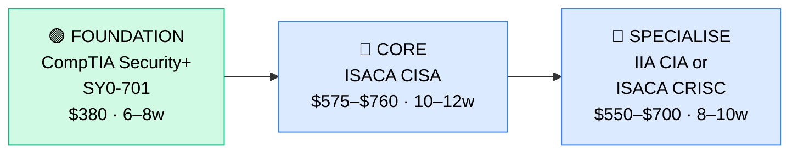

# How to Become an IT Auditor

**`CP62`** · **IT Management** · _Time to hire: 12–18 months_ · _Entry cost: $600–$1,000 USD_

> **Path summary:** This path takes you from an IT or audit background to a hired IT Auditor in 12–18 months. IT Auditors evaluate the design and effectiveness of IT controls, assess risks, and provide assurance to executives and regulators. This is a stable, well-paid career with strong job security in regulated industries. You'll audit systems, assess security controls, and help organisations meet regulatory requirements.

---

## Role Overview

### What does an IT Auditor actually do?

An IT Auditor evaluates whether an organisation's IT systems, processes, and controls are designed and operating effectively. You conduct audits (testing controls), assess risks, verify compliance with policies/regulations, and report findings to management and audit committees. You're not auditing financial statements; you're auditing IT infrastructure, applications, security controls, change management, and IT governance.

On a given day, you might: design an audit programme for network security controls, conduct interviews with IT staff, test access controls (verify that only authorised users can access sensitive systems), review change logs, assess incident response procedures, draft audit findings, or present results to the Audit Committee.

### Where do they work?

IT Auditors work in mid-to-large enterprises (500+ headcount), government agencies, internal audit departments, and external audit/consulting firms. Particularly common in regulated industries: banking, insurance, healthcare, government, telecommunications. Big 4 audit firms (Deloitte, PwC, EY, KPMG) have large IT audit practices. Internal audit departments at major corporations also hire. Remote work is increasingly common (40–60% hybrid or remote); some travel for client site visits (external auditors).

### Demand in 2026

- **Global job postings:** 5,000+ active IT Auditor roles on LinkedIn as of May 2026 [LinkedIn Jobs](https://www.linkedin.com/jobs/)
- **Growth rate:** 6–8% YoY; steady demand driven by increasing regulation and cyber risk
- **South Africa:** Strong demand. Banks, insurance, government agencies, and parastatals all have internal audit functions. Big 4 consulting firms (Deloitte, PwC, EY, KPMG) have large IT audit practices. Q1 2026 job listings show 20–30 open IT Auditor roles in SA.
- **Remote availability:** Moderate to high (40–60% hybrid or remote globally).

---

## Who Is This Path For?

### Ideal starting backgrounds

| Background | Readiness | What you already have |
|---|---|---|
| Internal Auditor (non-IT background) | ✅ Excellent start | Audit methodology solid; learn IT-specific auditing |
| External Auditor (Big 4 or mid-tier firm) | ✅ Excellent start | You already audit; transitioning to IT is a specialisation |
| IT Systems Admin (3+ yrs) | ✅ Good start | Deep technical knowledge; add audit/control framework |
| IT Security Engineer / Manager | ✅ Good start | Security controls are a core part of IT auditing |
| IT Compliance Officer | ✅ Good start | You understand controls; auditing is the next step |
| Finance / Accounting Auditor transitioning to IT | 🟡 Possible | Audit methodology transfers; need IT technical depth |
| Business Analyst in IT | 🟡 Possible | Process knowledge helps; need audit training |
| MBA graduate with audit focus | 🟡 Possible | Theory solid; need practical IT audit experience |

### You're ready to start this path if you can:
- Explain what an internal audit is and what auditors do
- Have 2+ years in audit, IT operations, IT security, or compliance roles
- Understand IT systems at a functional level
- Be comfortable with detailed, methodical work (testing and documenting controls)

> **Not ready yet?** If you don't have audit or IT ops background, spend 2 years building that first.

---

## Certification Sequence

### Visual path

---

## Stage 1 — Foundation: CompTIA Security+ (Months 0–2)

**Goal:** Prove baseline security and IT control knowledge before tackling audit-specific certifications.

| Cert | Code | Cost (USD) | Study Time | Why it matters |
|---|---|---:|---:|---|
| CompTIA Security+ | `SY0-701` | $380 | 40–50 hours | Foundational security and control knowledge: authentication, encryption, access control, incident response, governance. Good baseline before CISA. |

**Stage 1 total:** $380 USD · R6,840 ZAR · 6–8 weeks

**Study approach:** Use Professor Messer (free YouTube), Pluralsight, or Udemy courses. The exam is 90 multiple-choice questions, 90 minutes, 70% pass rate. Most people score 70–78%. Do 100+ practice questions. Plan 8–10 hours/week for 6–8 weeks.

**Lab requirement:** Document security controls in your current IT environment (or a case study): access controls, encryption, incident response. Write a 5-page control assessment.

---

## Stage 2 — Core Specialisation: ISACA CISA (Months 2–6)

**Goal:** Get certified as a Certified Information Systems Auditor. This is the cornerstone credential for IT auditors.

| Cert | Code | Cost (USD) | Study Time | Why it matters |
|---|---|---:|---:|---|
| ISACA Certified Information Systems Auditor | `CISA` | $575–$760 | 60–80 hours | Gold-standard IT audit certification. Covers auditing IT systems, assessing controls, security, and compliance. Required for most IT auditor roles. |

**Stage 2 total:** $575–$760 USD · R10,350–R13,680 ZAR · 10–12 weeks

**Study approach:** Use ISACA's CISA Review Manual, Pluralsight/Udemy courses, and 200+ practice exams. The exam is 150 multiple-choice questions, 4 hours, 65% pass rate. Most people score 65–78%. You need 5 years of IT audit/security experience to sit (or substitute related experience). Plan 15–20 hours/week for 10–12 weeks.

**Project milestone:** Design a complete IT audit programme for a critical system (e.g., "Network Access Controls Audit"). Document: audit objectives, scope, risk assessment, control testing procedures, evidence requirements, and expected findings.

---

## Stage 3 — Advanced Specialisation (Months 6–12, optional)

**Goal:** Add depth with either Internal Auditor (IIA CIA) or Risk Management (ISACA CRISC) credentials.

**Option A: IIA Certified Internal Auditor (CIA)**

| Cert | Code | Cost (USD) | Study Time | Why it matters |
|---|---|---:|---:|---|
| IIA Certified Internal Auditor | `CIA` | $550–$700 | 50–60 hours (per part) | Complements CISA; broader internal audit methodology and risk-based auditing approach. Good for those moving toward internal audit or management roles. |

**Option B: ISACA CRISC (Risk)**

| Cert | Code | Cost (USD) | Study Time | Why it matters |
|---|---|---:|---:|---|
| ISACA Certified in Risk and Information Systems Control | `CRISC` | $575 | 50–60 hours | Adds risk management perspective; auditors increasingly need to assess risk, not just compliance. Valuable complement to CISA. |

> **Optional at hire time:** Many people land their first IT auditor job after CISA alone. Security+ + CISA is sufficient for entry.

---

## Timeline & Cost Summary

| Stage | Certs | Duration | Cost (USD) | Cost (ZAR) |
|---|---|---|---:|---:|
| Stage 1 — Foundation | Security+ | Weeks 0–8 | $380 | R6,840 |
| Stage 2 — Core | CISA | Weeks 8–20 | $575–$760 | R10,350–R13,680 |
| Stage 3 — Advanced | CIA or CRISC | Weeks 20–30 | $550–$700 | R9,900–R12,600 |
| **Total to hireable** | **Security+ + CISA** | **12–18 months** | **$955–$1,140** | **R17,190–R20,520** |

**Study hours required:** 250–300 hours total (Stage 1–2). If you study 15–20 hours/week, that's 4–5 months.

---

## Salary Progression

> All figures: median base salary, not including bonuses/equity. ZAR = USD × 18 baseline (verified May 2026). Sources: Robert Half 2026 Tech Salary Guide, Glassdoor, PayScale, LinkedIn Salary.

| Experience Level | USD/year | ZAR/year | ZAR/month | Notes |
|---|---:|---:|---:|---|
| Entry / Junior IT Auditor (0–2 yrs) | $65,000 | R1,170,000 | R97,500 | Fresh from CISA; conducting audits under supervision |
| Mid-level IT Auditor (2–5 yrs) | $85,000 | R1,530,000 | R127,500 | Leading audit engagements, managing audit teams, strategic audits |
| Senior IT Auditor (5–8 yrs) | $110,000 | R1,980,000 | R165,000 | Audit manager or practice lead, complex audits, stakeholder management |
| Director / VP Audit (8+ yrs) | $150,000+ | R2,700,000+ | R225,000+ | Chief Audit Executive or VP Audit role |

**South Africa note:** Entry-level IT Auditors in SA earn R60,000–R85,000/month (equivalent to $55,000–$77,000/year). Mid-level (2–5 years) earn R85,000–R125,000/month. Senior (5+ years) earn R125,000–R180,000/month. Big 4 audit firms typically pay at the higher end. Internal audit at major corporations varies depending on industry.

**Salary accelerators:** CISA certification (+$8,000–$12,000/year), CIA certification (+$5,000–$8,000/year), CRISC certification (+$5,000–$8,000/year), and experience managing large audit programmes (+$15,000–$30,000/year). Transition to audit management/CAE roles adds $30,000–$60,000/year.

---

## First Job Strategy

### Month 0–4: Build Foundation

1. **Get IT or audit experience** — If you don't have 2+ years in audit/IT, do this first
2. **Pass Security+ cert** — 6–8 weeks; solidifies security fundamentals
3. **Join ISACA** — Membership ~$200/year; professional community
4. **Document audit procedures** — Collect examples of audits, control testing, findings you've conducted

### Month 4–10: CISA Certification

- **Intensive CISA study** — 15–20 hours/week for 10–12 weeks
- **Mock audit projects** — Design 2–3 complete IT audit programmes (scope, testing, reporting)
- **Pass CISA exam** — Ensure you have 5 years of required experience (or substitute experience)

### Month 10–18: Job Hunt + Optional Advanced Cert

- **CV positioning:** List yourself as "IT Auditor (CISA)" once certified. List ISACA ID and cert date.
- **Target companies:** Internal audit departments at large corporations, Big 4 audit firms (Deloitte, PwC, EY, KPMG), mid-tier audit firms. Banks, insurance, government agencies.
- **Interview prep:** Be ready to discuss: (1) A complex audit you conducted, (2) Control testing procedures, (3) How you'd audit a specific system (e.g., access controls, change management), (4) Your audit findings and recommendations, (5) Risk-based auditing approach.
- **Salary negotiation:** Entry-level IT Auditors in SA are offered R60,000–R80,000/month. Push for R75,000–R90,000. Use Robert Half Tech Salary Guide.

---

## A Day in the Life

### IT Auditor at a bank — Junior Level

**08:00** — Audit kickoff meeting. You're starting an audit of the bank's network access controls. You review the audit plan with the IT infrastructure team.

**09:00** — Conduct interviews with IT staff. You gather evidence: how do they provision access, who approves, what's the deprovisioning process?

**10:30** — Test access controls. You sample 30 active user accounts and verify: (1) They have documented approvals, (2) Their access level matches their job requirements, (3) Inactive accounts are disabled. You find 2 exceptions; document them.

**12:00** — Lunch.

**13:00** — Document testing results. You write up your findings in an audit workpaper: what you tested, what you found, whether there's a control issue.

**14:30** — Meet with the IT Security Manager. You present preliminary findings and ask for explanations of exceptions. They're valid (system migration); you agree to close the findings with compensating controls.

**15:30** — Start writing audit recommendations. You draft: "Implement quarterly access reviews to ensure access levels remain appropriate."

**16:30** — Wrap up the audit. You'll finish the formal report next week.

---

### IT Auditor at a Big 4 firm — Mid Level

**09:00** — Standup with your audit team. You're serving 3 client engagements: a bank, an insurance company, and a government agency.

**09:30** — Client 1 (Bank): Lead the audit fieldwork. You're testing IT security controls. You assign testing tasks to your 2 junior auditors, review their work, and make audit judgements.

**11:00** — Client 2 (Insurance): Attend a management meeting. Present preliminary audit findings: (1) Data backup procedures lack redundancy, (2) Incident response plan is outdated, (3) Access reviews are not documented. You recommend remediation.

**12:30** — Lunch.

**13:30** — Client 3 (Government): Draft the audit report. Compile findings, risk ratings, and recommendations. You assess overall IT control environment and provide executive summary.

**15:00** — Internal: Mentor a junior auditor on your bank engagement. Review their access control testing; provide feedback and coaching.

**16:00** — Quality review. Your senior manager reviews one of your audit reports before release to client.

**17:00** — End of day. Tomorrow: present bank audit findings to the Audit Committee.

---

## Related Paths & Progressions

| From here you can move to… | Why |
|---|---|
| [GRC Manager](CP61_ITMgmt_GRC_Manager.md) | IT audit background is excellent foundation for GRC management |
| [Internal Audit Director / Chief Audit Executive](CP{NN}_{slug}.md) | Progress through audit management and leadership |
| [IT Security Manager / CISO](CP{NN}_{slug}.md) | Audit experience + security focus → move into security leadership |
| [Consulting Leadership](CP{NN}_{slug}.md) | If at a Big 4 or consulting firm, move into audit practice leadership |

---

## South Africa Context

### Market specifics

IT Audit is a strong field in SA, particularly in regulated industries. SA banks (Nedbank, Standard Bank, ABSA, FNB, Capitec), insurance companies (Discovery, Old Mutual, Santam), and government agencies all have internal audit departments that include IT audit specialists. Big 4 audit firms (Deloitte, PwC, EY, KPMG) and mid-tier firms (BDO, Grant Thornton) have active IT audit practices serving SA clients.

The advantage: IT audit offers job security and steady salaries, especially in large institutions and consulting firms. Remote work for Big 4 and consulting firms is increasingly available.

BEE/EE considerations: Large SA employers and audit firms have preferential hiring for previously disadvantaged individuals. CISA and CIA certifications are merit-based and help level the field. Many firms actively recruit from previously disadvantaged backgrounds for audit roles.

### SA-specific resources

| Resource | URL | Note |
|---|---|---|
| ISACA South Africa | [https://www.isaca.org/](https://www.isaca.org/) | Professional body; local chapter networking |
| IIA South Africa | [https://www.iia.org.uk/](https://www.iia.org.uk/) | Internal audit professional body |
| Deloitte Audit – SA | [https://www.deloitte.com/za/en.html](https://www.deloitte.com/za/en.html) | Major audit firm; IT audit practice |
| PwC Audit – SA | [https://www.pwc.co.za/](https://www.pwc.co.za/) | Big 4 audit firm |
| LinkedIn Jobs ZA | [https://www.linkedin.com/jobs/search/?keywords=Auditor&locationId=ZA](https://www.linkedin.com/jobs/) | ZA auditor roles |

---

## Frequently Asked Questions

**Q: Do I need IT or audit experience first?**

A: Both are valuable. If you have one, you can learn the other. 2+ years in either IT operations, IT security, or internal audit is strongly recommended.

**Q: Should I get Security+ before CISA?**

A: Helpful but not required. Security+ builds foundational knowledge; CISA expects deeper audit/control expertise. Many people do Security+ → CISA in sequence.

**Q: Do I need CISA or can I get hired with just Security+?**

A: CISA is the gold-standard IT audit credential; most IT auditor roles require it. Security+ alone is not sufficient for IT auditor positions.

**Q: Can I do this while working full-time?**

A: Yes. At 15–20 hours/week, you can pass Security+ in 8 weeks and CISA in 12 weeks while working. Many people do this.

**Q: Is it better to work in Big 4 audit or internal audit at a corporation?**

A: Different pros/cons. Big 4 offers broader experience, client variety, and career mobility. Corporate internal audit offers stability and potential to transition to GRC/IT management. Choose based on your preferences.

---

## Sources & Further Reading

| # | Source | URL | Used for |
|---|---|---|---|
| 1 | LinkedIn Jobs — IT Auditor | [https://www.linkedin.com/jobs/search/?keywords=IT+Auditor](https://www.linkedin.com/jobs/) | Job volume and market demand |
| 2 | Glassdoor IT Auditor Salary | [https://www.glassdoor.com/Salaries/it-auditor-salary-SRCH_KO0,9.htm](https://www.glassdoor.com/Salaries/) | US salary ranges |
| 3 | ISACA CISA Certification | [https://www.isaca.org/credentialing/cisa](https://www.isaca.org/credentialing/cisa) | Official CISA requirements |
| 4 | CompTIA Security+ | [https://www.comptia.org/certifications/security](https://www.comptia.org/certifications/security) | Official Security+ info |
| 5 | Robert Half 2026 Tech Salary Guide | [https://www.roberthalf.com/salary-guide](https://www.roberthalf.com/salary-guide) | Salary progression |
| 6 | LinkedIn Jobs — South Africa | [https://www.linkedin.com/jobs/search/?keywords=Auditor&locationId=ZA](https://www.linkedin.com/jobs/) | SA job market |
| 7 | PayScale IT Auditor Salary | [https://www.payscale.com/research/ZA/Job=IT_Auditor](https://www.payscale.com/) | ZAR salary data |
| 8 | Deloitte South Africa — Audit | [https://www.deloitte.com/za/en.html](https://www.deloitte.com/za/en.html) | Major audit employer |

---

*Template version: 2026-05-02 | Maintained by IT Career Roadmap | ZAR baseline: R18/$1 USD*
*File naming: `Career_Paths/CP62_ITMgmt_IT_Auditor.md`*
