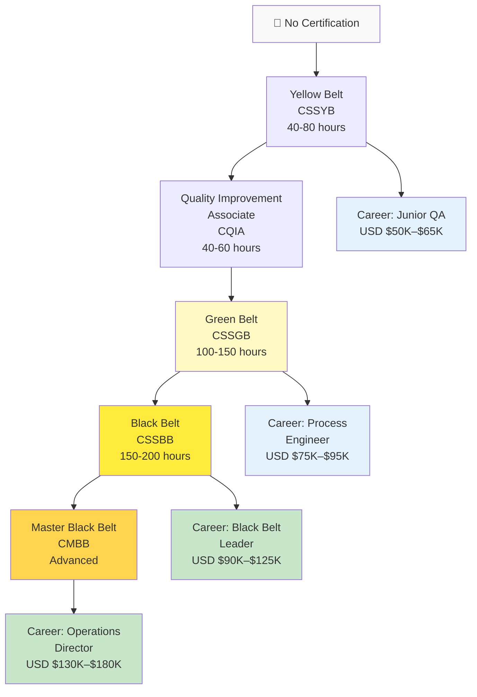
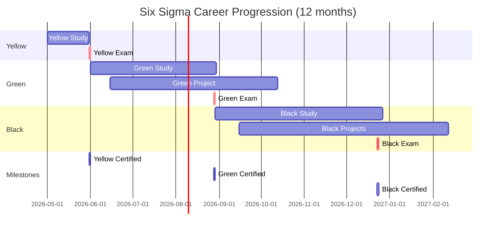
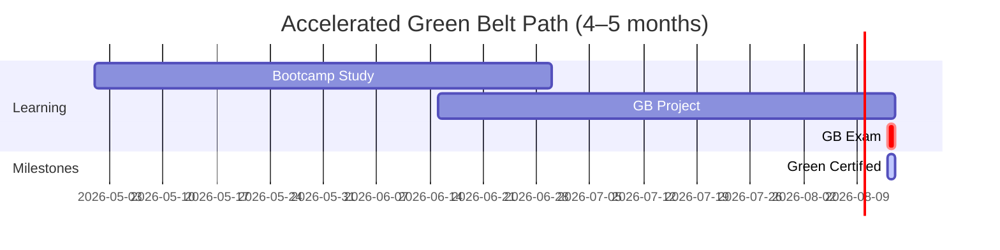
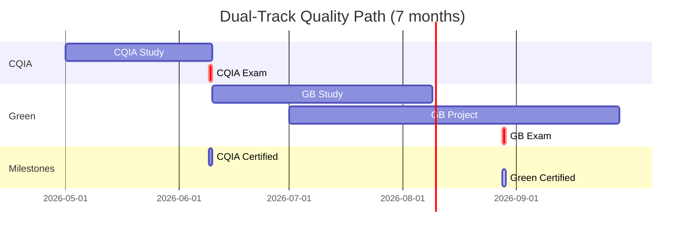

# ASQ Six Sigma & Quality Certification Roadmap

## Overview

The American Society for Quality (ASQ) Certified Six Sigma program is the world's leading methodology for process improvement and operational excellence. Six Sigma reduces defects, variability, and waste in manufacturing, IT operations, healthcare, finance, and service industries. In 2026, ASQ certifications are essential for quality engineers, operations managers, and continuous improvement leaders across Fortune 500 companies and scaling startups.

Six Sigma is especially valuable in South Africa and India where organisations compete on operational efficiency and cost management. Indian firms leverage Six Sigma in IT services, manufacturing, and business process outsourcing, with professionals earning INR 500K–1M+ annually. South African enterprises in finance, mining, telecommunications, and manufacturing increasingly require Green Belt and Black Belt credentials for process improvement roles. The four-level progression (Yellow → Green → Black → Master Black Belt) builds expertise systematically, with each level opening doors to higher-paying roles in quality, operations, and continuous improvement leadership.

## Progression Diagram



## Per-Level Detail

### Level 1: CSSYB (Certified Six Sigma Yellow Belt)

| Attribute | Details |
|-----------|---------|
| **Formal Name** | Certified Six Sigma Yellow Belt |
| **Exam Duration** | 90 minutes |
| **Question Format** | 60–80 multiple-choice questions |
| **Passing Score** | 70% |
| **Exam Fee – Member** | $238 USD |
| **Exam Fee – Non-Member** | $338 USD |
| **Exam Fee (USD equiv. ZAR)** | R4,284–6,084 |
| **Prerequisite** | None (entry-level) |
| **Study Time** | 40–80 hours |
| **Recertification** | Lifetime (no recert required) |
| **Validity** | Lifetime |

**What You'll Learn:**
- Six Sigma fundamentals (DMAIC methodology)
- Basic process improvement concepts
- Data collection and basic statistics
- Root cause analysis (5 Why, fishbone diagrams)
- Problem-solving frameworks
- Introduction to Lean principles
- Process mapping and documentation

**Study Materials:**
- ASQ Yellow Belt Study Guide
- Online courses (KnowledgeHut, TCS iON, Coursera)
- Practice exams and mock tests
- Video tutorials (YouTube, Udemy)
- Self-study duration: 6–10 weeks

**Career Outcomes:**
- Junior quality engineer or quality analyst roles
- Support roles in continuous improvement initiatives
- Eligibility to progress to Green Belt
- Typical salary: USD $50K–$65K globally; INR 400K–600K in India; ZAR 900K–1.2M in South Africa

---

### Level 2: CQIA (Certified Quality Improvement Associate)

| Attribute | Details |
|-----------|---------|
| **Formal Name** | Certified Quality Improvement Associate |
| **Exam Duration** | 90 minutes |
| **Question Format** | 60 multiple-choice questions |
| **Passing Score** | 70% |
| **Exam Fee – Member** | $238 USD |
| **Exam Fee – Non-Member** | $338 USD |
| **Exam Fee (USD equiv. ZAR)** | R4,284–6,084 |
| **Prerequisite** | None (can be taken independently or after CSSYB) |
| **Study Time** | 40–60 hours |
| **Recertification** | Lifetime (no recert required) |
| **Validity** | Lifetime |

**What You'll Learn:**
- Quality improvement fundamentals
- Quality standards (ISO 9001, ISO 14001)
- Customer focus and satisfaction
- Process improvement methodologies
- Data-driven decision making
- Tools: brainstorming, flowcharts, Pareto analysis
- Basic statistical analysis
- Communication in quality improvement

**Study Materials:**
- ASQ Quality Improvement Associate Study Guide
- ASQ Quality Standards reference materials
- Online training platforms (ASQ, TCS iON, Coursera)
- Practice exams
- Self-study duration: 6–8 weeks

**Career Outcomes:**
- Quality assurance coordinator
- Process analyst
- Compliance specialist
- Eligibility to advance to Green Belt
- Typical salary: USD $55K–$70K globally; INR 450K–650K in India; ZAR 1M–1.3M in South Africa

**Note:** CQIA is often taken in parallel with CSSYB or as an alternative entry path for those with less hands-on experience.

---

### Level 3: CSSGB (Certified Six Sigma Green Belt)

| Attribute | Details |
|-----------|---------|
| **Formal Name** | Certified Six Sigma Green Belt |
| **Exam Duration** | 4 hours |
| **Question Format** | 100 multiple-choice questions |
| **Passing Score** | 70% |
| **Exam Fee – Member** | $338 USD |
| **Exam Fee – Non-Member** | $438 USD |
| **Exam Fee (USD equiv. ZAR)** | R6,084–7,884 |
| **Prerequisite** | Recommended: Yellow Belt or CQIA (not strictly required) |
| **Work Experience Req** | 3 years of work experience preferred; not mandatory for exam |
| **Project Requirement** | Must complete 1 process improvement project (documented) |
| **Study Time** | 100–150 hours |
| **Recertification** | Lifetime (no recert required) |
| **Validity** | Lifetime |

**What You'll Learn:**
- Advanced DMAIC (Define, Measure, Analyze, Improve, Control)
- Statistical analysis: hypothesis testing, regression, ANOVA
- Design of Experiments (DOE)
- Process capability analysis (Cpk, Pp)
- Lean Six Sigma integration
- Project management for improvement initiatives
- Advanced root cause analysis
- Business case development and ROI calculation

**Study Materials:**
- ASQ CSSGB Body of Knowledge (BoK)
- Green Belt Study Guides (multiple publishers)
- Online bootcamps (KnowledgeHut, TCS iON, Simplilearn, Coursera)
- Project-based learning (real or simulated projects)
- Statistical software (Minitab, JMP)
- Practice exams and mock assessments
- Self-study duration: 12–16 weeks

**Career Outcomes:**
- Process improvement engineer
- Quality engineer (manufacturing or IT)
- Operations analyst
- Business analyst (operations-focused)
- Eligibility to progress to Black Belt
- Typical salary: USD $75K–$95K globally; INR 500K–850K in India; ZAR 1.35M–1.7M in South Africa

---

### Level 4: CSSBB (Certified Six Sigma Black Belt)

| Attribute | Details |
|-----------|---------|
| **Formal Name** | Certified Six Sigma Black Belt |
| **Exam Duration** | 4.5 hours |
| **Question Format** | 150 multiple-choice questions |
| **Passing Score** | 70% |
| **Exam Fee – Member** | $438 USD |
| **Exam Fee – Non-Member** | $538 USD |
| **Exam Fee (USD equiv. ZAR)** | R7,884–9,684 |
| **Prerequisite** | Recommended: CSSGB (not strictly required but strongly advised) |
| **Work Experience Req** | 3+ years full-time work experience |
| **Project Requirement** | Must complete 2 significant process improvement projects |
| **Recertification** | Every 3 years (via recertification units or re-exam) |
| **Study Time** | 150–200 hours |
| **Validity** | 3 years (must recertify) |

**What You'll Learn:**
- Advanced DMAIC and DMADV (Design for Six Sigma)
- Advanced statistical methods: multivariate analysis, predictive modeling
- Lean integration and value stream mapping
- Financial analysis and business metrics
- Leadership and change management
- Mentoring and coaching Green Belts
- Advanced process capability analysis
- Advanced DOE and optimization
- Strategic improvement alignment

**Study Materials:**
- ASQ CSSBB Body of Knowledge (BoK) – comprehensive
- Black Belt Study Guides and exam preparation
- University-level Six Sigma programs (part-time available)
- Online bootcamps and certifications (4–6 week intensive)
- Hands-on project coaching
- Statistical software (Minitab, JMP, Statistica)
- Peer study groups and online forums
- Self-study duration: 16–24 weeks

**Career Outcomes:**
- Six Sigma Black Belt / process improvement leader
- Senior operations analyst or operations manager
- Program manager (continuous improvement)
- Lean Six Sigma consultant
- Quality manager or director track
- Typical salary: USD $90K–$125K globally; INR 700K–1M in India; ZAR 1.62M–2.25M in South Africa

**Note:** Black Belt recertification is required every 3 years. This can be done via:
- Earning 12+ recertification units (continuing education)
- Retaking the exam
- Continuing professional activities in Six Sigma

---

## Recommended Progression Paths

### Path A: Standard Six Sigma Ladder (Yellow → Green → Black)

**Ideal for:** Manufacturing operations, IT quality teams, process-focused organisations

**Timeline:**
- **Months 1–2:** Yellow Belt study + exam
- **Months 3–6:** Green Belt study + 1 project + exam
- **Months 7–12:** Black Belt study + 2 projects + exam
- **Total duration:** 12 months



**Total Cost:**
- Exams: ($238 + $338 + $438) member pricing = USD $1,014
- Non-member: ($338 + $438 + $538) = USD $1,314
- Training: USD $300–800 per level = USD $900–2,400 total
- **Total investment:** USD $1,914–3,714 (ZAR 34,452–66,852)

**Salary Progression:**
- Year 1 (Yellow): USD $50K–$65K → ZAR 900K–1.2M
- Year 2 (Green): USD $75K–$95K → ZAR 1.35M–1.7M
- Year 3+ (Black): USD $90K–$125K → ZAR 1.62M–2.25M

---

### Path B: Accelerated (Green Belt Focus)

**Ideal for:** Consultants, existing quality professionals, managers pivoting to continuous improvement

**Timeline:**
- **Weeks 1–2:** Yellow Belt study (optional, can skip with experience)
- **Weeks 3–12:** Green Belt intensive bootcamp
- **Weeks 13–16:** Green Belt project completion
- **Total duration:** 4–5 months to Green Belt



**Total Cost:** USD $338–438 exam + USD $600–1,200 bootcamp = USD $938–1,638 (ZAR 16,884–29,484)

**Best for:** Professionals with 5+ years operations/quality experience who can skip Yellow Belt

---

### Path C: Dual-Track Quality (CQIA + Green Belt)

**Ideal for:** Career changers, those without Six Sigma background, compliance-focused roles

**Timeline:**
- **Months 1–2:** CQIA study + exam
- **Months 3–6:** Green Belt study + project
- **Month 7:** Green Belt exam
- **Total duration:** 7 months



**Total Cost:** USD $576–776 (both exams) + training USD $600–1,200 = USD $1,176–1,976 (ZAR 21,168–35,568)

---

## Prerequisites & Sequencing Matrix

| Role | Experience | Entry Path | Timeline | Target Belt |
|------|-----------|------------|----------|------------|
| **New to QA** | 0–2 years | CQIA → Yellow → Green | 12 months | Green |
| **Quality Inspector** | 3–5 years QA | Yellow → Green | 6–8 months | Green |
| **Operations Analyst** | 5+ years ops | Green (direct) or Yellow → Green | 4–5 months | Green |
| **Manufacturing Engineer** | 5+ years mfg | Yellow → Green → Black | 12–15 months | Black |
| **IT Operations Manager** | 7+ years IT ops | Green → Black | 8–10 months | Black |
| **Lean Consultant** | 5+ years consulting | Green → Black | 9–12 months | Black |
| **Director / VP** | 10+ years exec | Black (strategic) | 12 months | Black |

---

## Specialization Branches

After achieving Green or Black Belt, professionals often specialize:

### Lean Six Sigma (Integrated)
- **Focus:** Eliminate waste (Lean) + reduce variation (Six Sigma)
- **Certifications:** Lean Six Sigma Green Belt (ASQ), Lean Black Belt
- **Industries:** Manufacturing, logistics, healthcare, IT operations
- **Salary impact:** +10% over pure Six Sigma

### Design for Six Sigma (DFSS)
- **Focus:** Build quality into design, not just fix processes
- **Advanced method:** DMADV (Define, Measure, Analyze, Design, Verify)
- **Certifications:** ASQ DFSS Green Belt, Black Belt
- **Industries:** Product development, software engineering, financial services
- **Salary impact:** USD $100K–$140K for Black Belts

### Healthcare Quality & Patient Safety
- **Focus:** Six Sigma applied to healthcare processes
- **Certifications:** ASQ Certified Lean Health Care Professional
- **Industries:** Hospitals, pharmaceutical, medical devices
- **Salary impact:** USD $85K–$120K

### Supply Chain & Logistics
- **Focus:** Process improvement in supply chain, procurement, warehousing
- **Certifications:** ASQ Six Sigma + APICS CSCP/CPIM
- **Industries:** Manufacturing, logistics, retail, e-commerce
- **Salary impact:** USD $90K–$130K

---

## Cross-Vendor Bridges

ASQ Six Sigma integrates well with:

| Target Cert | Synergy | Bridge Path | Time |
|-------------|---------|-------------|------|
| **ITIL 4 Foundation** | Service improvement + operations | CSSGB + ITIL = operational excellence | 2–3 months |
| **PMP (Project Mgmt)** | Project structure + process improvement | CSSBB + PMP = delivery excellence | 3–4 months |
| **APICS CSCP** | Supply chain operations + quality | CSSGB + CSCP = supply chain excellence | 4–5 months |
| **ISO 9001 Auditor** | Quality management standards | CSSGB + ISO 9001 Internal Auditor | 2–3 months |
| **TOGAF (Architecture)** | Enterprise change + process design | CSSBB + TOGAF = transformation | 4–6 months |
| **SIX SIGMA Master** | Advanced expertise (CMBB) | CSSBB → Master Black Belt | 12–18 months |

---

## Cost Breakdown

### Exam-Only Path (Member Pricing)

| Certification | Exam Fee (USD) | Exam Fee (ZAR) | Notes |
|---------------|----------------|----------------|-------|
| CSSYB | $238 | R4,284 | Yellow Belt |
| CQIA | $238 | R4,284 | Quality Improvement Associate |
| CSSGB | $338 | R6,084 | Green Belt |
| CSSBB | $438 | R7,884 | Black Belt |
| **Yellow + Green + Black (Total)** | **$1,014** | **R18,252** | Full ladder, member pricing |

### Non-Member Pricing

| Certification | Exam Fee (USD) | Exam Fee (ZAR) |
|---------------|----------------|----------------|
| CSSYB | $338 | R6,084 |
| CQIA | $338 | R6,084 |
| CSSGB | $438 | R7,884 |
| CSSBB | $538 | R9,684 |
| **Yellow + Green + Black (Total)** | **$1,314** | **R23,652** | Full ladder, non-member |

### Full Learning Path (Realistic)

| Item | USD | ZAR | Details |
|------|-----|-----|---------|
| **Yellow Belt Bundle** | | | |
| Exam (member) | $238 | R4,284 | |
| Online course | $100–300 | R1,800–5,400 | Udemy, TCS iON |
| Study guide + materials | $30–80 | R540–1,440 | Books, practice tests |
| Subtotal YB | $368–618 | R6,624–11,124 | |
| | | | |
| **Green Belt Bundle** | | | |
| Exam (member) | $338 | R6,084 | |
| Bootcamp/course | $400–800 | R7,200–14,400 | 4-week intensive |
| Project coaching | $200–500 | R3,600–9,000 | Optional mentoring |
| Study materials | $50–100 | R900–1,800 | Advanced topics |
| Subtotal GB | $988–1,738 | R17,784–31,284 | |
| | | | |
| **Black Belt Bundle** | | | |
| Exam (member) | $438 | R7,884 | |
| Bootcamp/university course | $1,000–2,000 | R18,000–36,000 | 8–12 week program |
| Project coaching (2 projects) | $500–1,000 | R9,000–18,000 | Mentoring & guidance |
| Advanced statistics tools | $100–300 | R1,800–5,400 | Minitab, JMP, R |
| Study materials | $100–200 | R1,800–3,600 | Advanced references |
| Subtotal BB | $2,138–3,938 | R38,484–70,884 | |
| | | | |
| **TOTAL (Full Ladder)** | **$3,494–6,294** | **R62,892–113,292** | 12–24 months |

**Member Discounts:** ASQ membership costs $250/year but saves $100 per exam. Membership pays for itself after 2 exams.

---

## Job Market Snapshot (2026)

### Global Demand
- **Six Sigma jobs:** Growing at 6–8% annually
- **Primary industries:** Manufacturing, IT operations, healthcare, finance, logistics
- **Geographic hotspots:** India (IT services, 30%), North America (35%), Europe (20%), Asia-Pacific (15%)

### India Market (Largest Global Hub)
- **Demand:** Very high in IT services, BPO, manufacturing
- **Typical salary:** Green Belt INR 500K–850K; Black Belt INR 700K–1M+
- **Companies:** TCS, Infosys, Cognizant, HCL, Wipro actively hire Six Sigma professionals
- **Growth:** IT services firms expanding Lean Six Sigma practices

### South Africa Market
- **Industries:** Finance (banks, insurance), mining, telecommunications, manufacturing
- **Adoption trend:** Increasing in Tier-1 companies
- **Salary range:** Green Belt ZAR 1.35M–1.7M; Black Belt ZAR 1.62M–2.25M
- **Companies:** Standard Bank, FirstRand, Sibanye-Stillwater, Eskom, Vodacom seeking improvement leaders
- **Government:** Public sector digital transformation projects utilizing Six Sigma

### Typical Job Requirements
- Green Belt: 3+ years operations or quality experience
- Black Belt: 5+ years operations/quality, demonstrated improvement projects
- Management track: Experience leading teams and implementing enterprise-wide improvements
- Technical skills: Basic statistics, process mapping, project management

---

## Salary Trajectory

### Global Salary Ranges (USD)

```
Year 1 (Yellow Belt):
├─ Quality Analyst: $50K–$65K
└─ Junior QA Engineer: $55K–$70K

Year 2-3 (Green Belt):
├─ Process Engineer: $75K–$95K
├─ Operations Analyst: $70K–$90K
└─ Quality Engineer: $75K–$100K

Year 4-5 (Black Belt):
├─ Senior Process Improvement: $90K–$125K
├─ Operations Manager: $95K–$130K
└─ Lean Six Sigma Manager: $100K–$140K

Year 6+ (Master/Leadership):
├─ Director, Continuous Improvement: $130K–$180K
├─ VP Operations: $150K–$210K
└─ Chief Operating Officer (with path): $200K–$350K+
```

### South Africa Salary Ranges (ZAR)

```
Year 1 (Yellow Belt):
├─ Quality Analyst: R900K–R1.17M
└─ Junior QA Engineer: R990K–R1.26M

Year 2-3 (Green Belt):
├─ Process Engineer: R1.35M–R1.71M
├─ Operations Analyst: R1.26M–R1.62M
└─ Quality Engineer: R1.35M–R1.8M

Year 4-5 (Black Belt):
├─ Senior Process Improvement: R1.62M–R2.25M
├─ Operations Manager: R1.71M–R2.34M
└─ Lean Six Sigma Manager: R1.8M–R2.52M

Year 6+ (Master/Leadership):
├─ Director, Continuous Improvement: R2.34M–R3.24M
├─ VP Operations: R2.7M–R3.78M
└─ COO Track: R3.6M–R6.3M+
```

**Career Acceleration:** Black Belt certification typically accelerates promotion by 2–3 years compared to non-certified peers.

---

## Common Questions

### Q1: What's the difference between Yellow, Green, and Black Belt?
**A:**
- **Yellow Belt:** Foundational, part-time improvement support (~40 hrs study)
- **Green Belt:** Intermediate, lead improvement projects full-time (~120 hrs)
- **Black Belt:** Advanced, drive organizational change, mentor Green Belts (~200 hrs)

Think of it as chess ratings: Yellow = beginner, Green = intermediate, Black = advanced leader.

### Q2: Do I need Yellow Belt before Green Belt?
**A:** No, it's not required. However, it's recommended if you're new to Six Sigma. Experienced quality/operations professionals often skip Yellow and go directly to Green. CQIA is a good alternative for quality backgrounds.

### Q3: Can I study for Green Belt without doing a project?
**A:** The exam has no formal project requirement, but ASQ strongly recommends completing 1 real or simulated improvement project for the Green Belt credential to be meaningful. Most employers expect documentation of actual process improvement work.

### Q4: How often do I need to recertify?
**A:** Yellow, Green, and CQIA are lifetime certifications (no recert). Black Belt requires recertification every 3 years via recertification units or retaking the exam.

### Q5: What's a realistic timeline: Yellow → Black?
**A:** 12–18 months of part-time study. Accelerated: 6–9 months with bootcamps and dedicated projects.

### Q6: Is Six Sigma used in IT operations?
**A:** Yes! Six Sigma is widely adopted in IT operations for:
- Reducing incident resolution time (mean time to resolution, MTTR)
- Improving system availability and uptime
- Reducing ticket backlog variability
- Optimizing cloud infrastructure costs
- DevOps and continuous delivery optimization

### Q7: What industries value Six Sigma most?
**A:** Highest demand in:
1. **Manufacturing** – process consistency, defect reduction
2. **IT Services** – delivery quality, cost reduction
3. **Healthcare** – patient safety, operational efficiency
4. **Finance** – risk management, process accuracy
5. **Logistics** – supply chain optimization
6. **Telecommunications** – network quality, customer experience

### Q8: Can I combine Six Sigma with Agile / DevOps?
**A:** Yes. Six Sigma (process improvement) + Agile (delivery method) + DevOps (automation) = highly sought-after skillset. Many tech companies value this combination for process improvement within agile teams.

### Q9: Is ASQ the only certification body?
**A:** ASQ is the most recognized globally, especially in North America, India, and South Africa. Other bodies exist (IASSC, Pearson) but ASQ credentials carry the most weight in the job market.

### Q10: What's the salary benefit of Six Sigma in South Africa?
**A:** Six Sigma professionals earn 20–30% more than non-certified peers in equivalent roles. A Green Belt in South Africa earns ZAR 1.35M–1.71M vs. ZAR 1.1M–1.3M for non-certified quality engineers.

---

## Official Sources

- **ASQ Certification Portal:** https://www.asq.org/cert/
- **Six Sigma Certifications:** https://www.asq.org/cert/catalog/six-sigma
- **ASQ Exam Fees:** https://www.asq.org/cert/apply-certification
- **Exam Preparation:** https://www.asq.org/cert/prepare/six-sigma
- **ASQ Membership:** https://www.asq.org/membership

---

*Last verified: 2026-05-02*

**Exchange Rate Used:** USD 1 = ZAR 18
**Sources:** ASQ.org, KnowledgeHut, Invensis Learning, PayScale India/South Africa, Knowledge Hut, Advance Innovation Group
