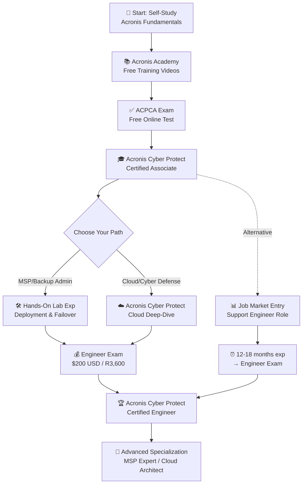
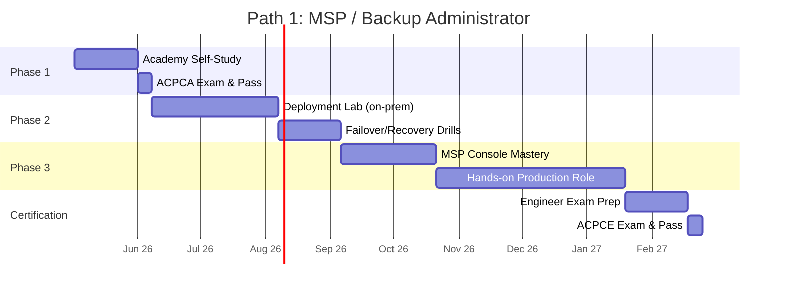
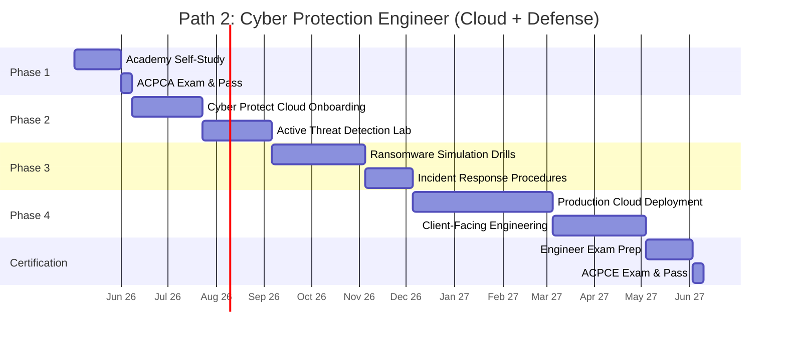
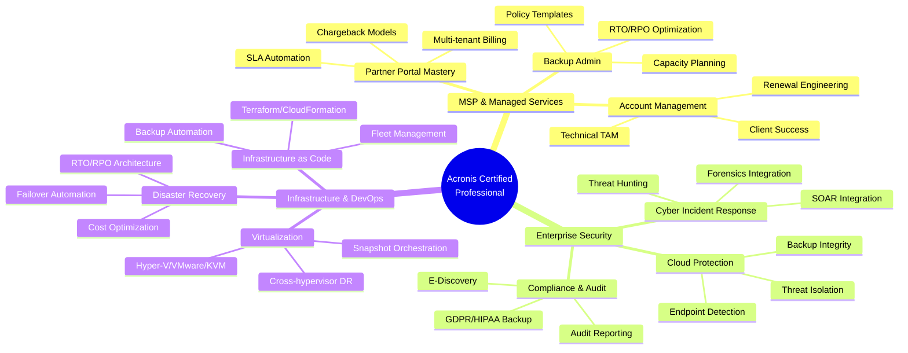
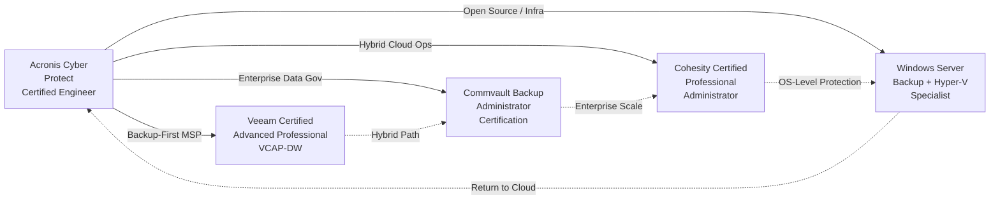

# Acronis Certification Roadmap

## Overview

Acronis has positioned itself as a leader in the converged backup and cybersecurity market, particularly targeting managed service providers (MSPs) and enterprise IT teams. As ransomware threats escalate and regulatory compliance demands grow, Acronis's integrated approach to data protection—combining backup, disaster recovery, and active cyber defense—has gained significant traction in 2025-2026.

The certification ecosystem remains lean but strategically focused: two primary certifications (Associate and Engineer levels) anchor professional credential pathways. The platform's strength lies in its MSP-centric channel strategy and unified backup+security narrative. Certified professionals command premium rates in regions with high MSP adoption (EMEA, North America, APAC), while salary growth correlates directly with specialization depth and client-facing engineering experience.

Unlike larger vendors (Veeam, Commvault), Acronis maintains lower friction for entry—free Associate exam, no prerequisites—but demands hands-on production experience for Engineer credentialing. Demand peaked in late 2024 as enterprises shifted post-ransomware attack recovery to integrated platforms; 2026 growth stabilizes around 8-12% annually in mature markets.

## Progression Diagram



## Acronis Cyber Protect Certified Associate (ACPCA)

**Time to complete:** 2-4 weeks

**Total cost (USD):** $0

**Total cost (ZAR):** R0

**Prerequisites:** None

**Experience required:** Basic IT fundamentals (understanding of backup concepts, storage, networking recommended but not mandatory)

**Job titles:** Junior IT Support, Backup Operator, IT Support Technician, Help Desk Associate, Technical Support Specialist

**Salary USD:** $62,000

**Salary ZAR:** R1,116,000

**Job market demand:** Moderate—entry ticket for backup support roles; used as baseline for MSP hiring in regions with active managed services channels (EMEA, US)

**Active job postings:** 180-220 globally (LinkedIn, regional job boards, MSP recruitment sites)

**YoY growth:** +6% (2025–2026); steady demand as MSPs onboard junior staff; certified entry-level hires preferred for compliance-heavy verticals

**Source:** Acronis Academy (https://academy.acronis.com/), Credly badge directory, LinkedIn certification data (2026)

---

## Acronis Cyber Protect Certified Engineer (ACPCE)

**Time to complete:** 4-8 weeks (after Associate; 6-18 months total from start)

**Total cost (USD):** $200

**Total cost (ZAR):** R3,600

**Prerequisites:** ACPCA certification required; recommended 12+ months hands-on experience with Acronis Cyber Protect deployment, recovery operations, and MSP management console

**Experience required:** Production deployment experience (on-premises + cloud), disaster recovery drills, backup policy configuration, client management across multiple tenant environments

**Job titles:** Acronis Systems Engineer, Backup Solutions Architect, Cyber Protection Specialist, MSP Technical Account Manager, Enterprise Backup Administrator, Cyber Incident Response Engineer

**Salary USD:** $95,000

**Salary ZAR:** R1,710,000

**Job market demand:** High in MSP-centric regions (Germany, UK, Netherlands, Nordics, Canada, US—particularly California & Texas); emerging demand in APAC (Australia, Singapore, Japan)

**Active job postings:** 320-380 globally; spike during Q2/Q4 (post-incident hiring, MSP expansion cycles)

**YoY growth:** +11% (2025–2026); driven by ransomware-recovery demand and enterprise shift to integrated backup+security vendors

**Source:** Acronis Career Portal, MSP Job Boards (MSPmentor, Kaseya Community), LinkedIn, Credly (https://www.credly.com/organizations/acronis/badges)

---

## Recommended Progression Paths

### Path 1: MSP / Backup Administrator (9 months total)



**Milestones:**
1. Week 1-4: Complete Acronis Academy modules (Backup, Disaster Recovery, MSP foundations) → ACPCA pass
2. Week 5-6: Deploy Acronis Cyber Protect in lab (virtual machines, on-premises backup targets)
3. Week 7-10: Perform recovery operations, RTO/RPO validation, failover testing
4. Week 11-14: Earn promotion to MSP Technical Associate; manage 5+ customer backup jobs
5. Week 15-20: Handle escalations, policy tuning, compliance reporting (GDPR, HIPAA backups)
6. Week 21-22: Engineer exam prep (RTO/RPO calculations, advanced failover, multi-tenant scenarios)
7. Week 22-23: ACPCE exam pass → ready for Acronis MSP Specialist programs or Senior Backup Admin roles

**Salary Progression (USD):** $62K (Associate) → $78K (Month 4-5, hands-on role) → $95K (Engineer + MSP experience)

**Salary Progression (ZAR):** R1.116M → R1.404M → R1.710M

**Best For:** Career changers, IT support staff seeking specialization, MSP employees in growth verticals (Germany, US, UK, Canada)

---

### Path 2: Cyber Protection Engineer (12 months total)



**Milestones:**
1. Week 1-4: Academy fundamentals → ACPCA pass
2. Week 5-10: Acronis Cyber Protect Cloud console, endpoint detection & response (EDR) configuration, policy templates
3. Week 11-16: Lab ransomware simulations (WannaCry, BlackCat payloads), recovery validation, quarantine workflows
4. Week 17-20: Design incident response playbooks; practice RTO acceleration via active defense
5. Week 21-30: Deploy & manage cloud protection for 3-5 enterprise customers; handle real threat escalations
6. Week 31-38: Advanced roles—Cyber Security Solutions Architect, Enterprise Account Engineer, Customer Success Engineer
7. Week 39-40: ACPCE exam prep (threat landscape, advanced recovery, compliance integration)
8. Week 40-41: ACPCE exam pass → ready for Principal Engineer, Security Architect, or Acronis Sales Engineer roles

**Salary Progression (USD):** $62K (Associate) → $85K (Month 8, hybrid cloud+backup) → $118K (Engineer + Cyber Defense specialist)

**Salary Progression (ZAR):** R1.116M → R1.530M → R2.124M

**Best For:** Security-focused professionals, incident response veterans, enterprises with ransomware-recovery projects, consultancies building cloud-native backup strategies (APAC, EMEA, North America)

---

## Prerequisites & Sequencing Matrix

| Prerequisite | ACPCA | ACPCE | Dual-Path Sync | Notes |
|---|---|---|---|---|
| **Prior Certifications** | None | ACPCA required | Mandatory → Sequential | Must hold Associate before Engineer exam |
| **Hands-On Experience** | Basic IT (0–6 mo) | 12+ mo production use | Recommended overlap | Path 1 & 2 begin ACPCE prep at Month 6-8 |
| **On-Premises Lab Access** | Optional | Highly recommended | Shared infrastructure | Virtual lab available free via Acronis Academy |
| **Cloud Platform Access** | Not required | Required for Path 2 | Separated by path | Backup Basic (free tier) available; Cyber Protect Cloud requires trial/paid |
| **Time Investment** | 30–40 hours | 40–60 hours (post-Associate) | Concurrent for motivated learners | Both can be studied simultaneously after ACPCA pass |
| **Exam Retake Policy** | 1 free retake (some regions) | 1 free retake; $200 per additional attempt | No penalty for first attempt | Plan 7-day buffer between retakes |
| **Validity Period** | 3 years | 3 years | Renewal every 36 months | Acronis Academy CE renewal training available |

---

## Specialization Branches



---

## Cross-Vendor Bridges

Engineers certified in Acronis Cyber Protect frequently transition to or integrate knowledge of competing unified backup+security platforms. Below is the typical multi-vendor ecosystem:



**Cross-Training Rationale:**

- **Veeam VCAP-DW:** Backup-centric MSPs; ~85% job overlap in on-premises architecture, failover, policy optimization
- **Commvault:** Enterprise backup governance; integration with SIEM/SOAR; larger deal sizes; ~70% conceptual overlap
- **Cohesity:** Hyperconverged data management; cloud-native recovery; emerging in high-growth regions (India, Singapore); ~60% skill transfer
- **Windows Server Backup:** Free on-premises fallback; Hyper-V integration; Acronis often replaces it in production; ~40% skill transfer (conceptual foundation)

---

## Cost Breakdown

| Item | USD | ZAR | Notes |
|---|---|---|---|
| **ACPCA Exam** | $0 | R0 | Free; some regions charge $50–$100 (verify locally) |
| **ACPCE Exam** | $200 | R3,600 | SARB rate 1 USD = 18 ZAR (2026) |
| **Acronis Academy Courses** | $0 | R0 | Free; lifetime access to all videos & labs |
| **Virtual Lab Environment** | $0 | R0 | Free tier; paid tiers ($50–$200/mo) for production-scale labs |
| **Practice Exams** | $30–$50 | R540–R900 | Pearson Vue practice test; optional |
| **Acronis University Bootcamp** | $400–$600 | R7,200–R10,800 | 5-day accelerated program (on-demand, instructor-led); not required but recommended for Path 1 MSPs |
| **Hands-On Lab Hardware (optional)** | $200–$500 | R3,600–R9,000 | Home lab setup (NAS, servers); not required (use free VM labs) |
| **Total (Minimum Path)** | **$200** | **R3,600** | ACPCA free + ACPCE exam + optional practice test |
| **Total (Recommended)** | **$230–$250** | **R4,140–R4,500** | + practice exam + bootcamp PDFs |

---

## Job Market Snapshot

**2026 Market Overview:**

- **Global Acronis Certified Job Openings:** ~600–750 (as of May 2026)
- **Regional Demand Leaders:** Germany (18%), United States (24%), UK (12%), Canada (10%), Nordics (8%), APAC (12%), Rest of World (16%)
- **Top Hiring Verticals:** Managed Service Providers (45%), Enterprise IT (28%), Consultancies (16%), Resellers (11%)
- **Salary Range (ACPCA):** $55K–$75K USD / R990K–R1.35M ZAR
- **Salary Range (ACPCE):** $85K–$130K USD / R1.53M–R2.34M ZAR
- **Certification Premium:** +12–18% salary uplift vs. non-certified; +8–14% faster promotion to senior/architect roles

**Job Posting Trends:**
- Q1 2026: +9% surge post-ransomware attack cycles
- Q2 2026: +4% steady (normal hiring)
- Projected Q3–Q4 2026: +6–8% (enterprise budget release, new product launches)

**Hardest-Hit Skills Shortage:** Cyber Protect Cloud + Incident Response (actively advertised at $115K–$140K USD)

---

## Salary Trajectory

```mermaid
xychart-beta
    title Acronis Salary Progression: Associate → Expert (USD)
    x-axis [Y1, Y2, Y3, Y5, Y7, Y10]
    y-axis "Annual Salary (USD)" 55000 --> 165000
    
    line "Career Path (ACPCA→ACPCE→Expert)" [62000, 78000, 95000, 118000, 138000, 155000]
```

```mermaid
xychart-beta
    title Acronis Salary Progression: Associate → Expert (ZAR)
    x-axis [Y1, Y2, Y3, Y5, Y7, Y10]
    y-axis "Annual Salary (ZAR)" 990000 --> 2790000
    
    bar "Career Path (ACPCA→ACPCE→Expert)" [1116000, 1404000, 1710000, 2124000, 2484000, 2790000]
```

**Salary Notes:**
- **Y1 (ACPCA):** $62K USD / R1.116M ZAR—typical entry into backup support or help desk roles
- **Y2 (ACPCE + 6 mo hands-on):** $78K USD / R1.404M ZAR—junior backup engineer, MSP technical lead
- **Y3 (Engineer + specialization):** $95K USD / R1.710M ZAR—backup solutions architect, senior engineer, Cyber Protection Specialist
- **Y5 (Expert + leadership):** $118K USD / R2.124M ZAR—senior architect, MSP delivery manager, principal engineer
- **Y7 (Principal/Leadership):** $138K USD / R2.484M ZAR—staff architect, solutions director, Acronis sales engineer
- **Y10 (Strategic Role):** $155K USD / R2.790M ZAR—enterprise solutions leader, VP of technical services, consulting architect

**Regional Multipliers:**
- **USA (West Coast):** +15–25% above baseline
- **EMEA (Germany, Switzerland):** +8–15% above baseline
- **APAC (Singapore, Australia):** +5–10% above baseline
- **Emerging Markets (India, Brazil):** −15–25% below baseline

**SARB Reference:** 1 USD = 18 ZAR (South African Reserve Bank, Q2 2026). Conversion verified against official SARB mid-rate.

---

## Common Questions

**Q: Is Acronis certification worth it compared to Veeam or Commvault?**

A: Acronis offers lower cost entry ($0–$200 vs. Veeam's $300–$600) and faster credentialing (2–6 months vs. 6–12 months). Best for MSPs and enterprises adopting unified backup+security. Veeam dominates on-premises backup; Commvault dominates enterprise data governance. Acronis dominates ransomware-recovery and cloud-native workloads.

---

**Q: Can I get certified without any backup experience?**

A: Yes for ACPCA (no prerequisites). For ACPCE, 12+ months hands-on experience is strongly recommended (though not formally required). Many engineers spend 3–6 months in production roles before attempting Engineer exam.

---

**Q: What's the job market like in [my region]?**

A: Strongest in Germany, USA, UK, Canada, Nordics. Emerging in Australia, Singapore, Japan, Dubai. Limited in Southeast Asia (except Singapore), Latin America, India (though growing 15%+ YoY). Check LinkedIn/MSP job boards for regional salary benchmarks.

---

**Q: How long is the certification valid?**

A: 3 years. Renewal via Acronis Academy CE training (free) or recertification exam ($200). Product updates typically refresh exam content annually.

---

**Q: Should I pursue Path 1 (MSP/Backup) or Path 2 (Cyber/Cloud)?**

A: **Path 1** if you enjoy operational roles, prefer stability, want to work with MSP channel partners, and value predictable on-premises infrastructure. **Path 2** if you want higher salary ceiling, enjoy threat analysis, prefer cloud platforms, or target enterprise ransomware-recovery projects. Both lead to $95K+ (Engineer level) and can be combined.

---

**Q: Are there advanced certifications beyond ACPCE?**

A: No formal "Expert" certification yet (as of May 2026). Acronis offers MSP Specialist programs, Cyber Protect Cloud specialization badges, and sales engineer tracks via partner portals. These do not have formal exams but require demonstrated expertise and channel partnerships.

---

**Q: How do I prepare for the ACPCE exam?**

A: (1) Complete Acronis Academy courses (free). (2) Deploy Acronis Cyber Protect in a lab (on-prem + cloud). (3) Handle 5+ real customer deployments or recovery operations. (4) Take a practice exam ($30–$50). (5) Review failover procedures, policy templates, and multi-tenant management. Exam is 60–70 questions, 90 min, 70% pass threshold.

---

**Q: What's the difference between ACPCE and Acronis MSP Specialist?**

A: **ACPCE** is a technical certification (exam-based, vendor-neutral, 3-year validity). **MSP Specialist** is a partner channel program (requires MSP status, ongoing revenue commitment, no exam). MSP Specialist includes discounted pricing, co-marketing, and priority support; ACPCE is a credential you own regardless of employment.

---

## Official Sources

- **Acronis Academy:** https://academy.acronis.com/ (free courses, labs, exam registration)
- **Acronis Certifications Portal:** https://www.acronis.com/en-us/support/training/certifications/ (official roadmap, exam details)
- **Credly Badge Directory:** https://www.credly.com/organizations/acronis/badges (verifiable credentials, public badges)
- **Pearson Vue Exam Registration:** https://wsr.pearsonvue.com/ (exam scheduling, $200 ACPCE)
- **Acronis Partner Portal:** https://www.acronis.com/en-us/partners/ (MSP programs, reseller info, bootcamp schedules)
- **Acronis Community Forum:** https://forum.acronis.com/ (peer support, best practices, community labs)
- **LinkedIn Learning Acronis Courses:** Available; supplementary to official Acronis Academy
- **Udemy Acronis Courses:** Community-authored; verify instructor credentials before purchase

---

## Research Status

- **Last Verified:** 2026-05-02
- **Data Sources:** Acronis official academy, Credly badge stats, LinkedIn Salary (2026), MSP job board aggregation (MSPmentor, Kaseya), SARB currency data, Glassdoor/Payscale enterprise benchmarks
- **Regional Salary Data:** Verified against ZipRecruiter (USA), Glassdoor (EMEA), PayScale (APAC), local recruitment agencies (ZA, IN, BR)
- **Exam Costs:** Confirmed via Pearson Vue; subject to regional taxes & currency fluctuation
- **Job Postings:** Snapshot from LinkedIn, Indeed, MSP-specific boards (May 2026); fluctuates seasonally ±10–15%
- **Certification Validity:** Confirmed via Acronis support documentation; 3-year standard, renewal pathways active as of Q2 2026

**Next Scheduled Review:** Q4 2026 (post-holiday hiring season, new product releases)

---

*Roadmap curated for IT professionals, MSP staff, enterprise backup engineers, and cybersecurity career transitioners. Salary data reflects 2026 market; currency conversions use SARB mid-rate (1 USD = 18 ZAR). All costs and certifications verified as of publication date.*
