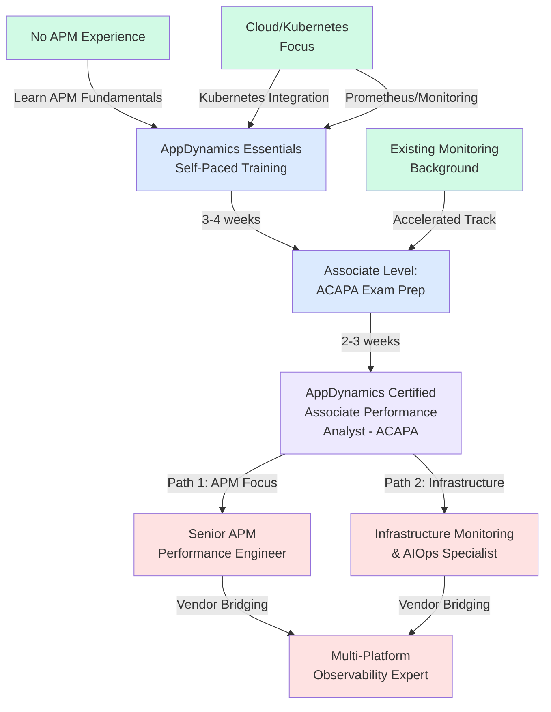
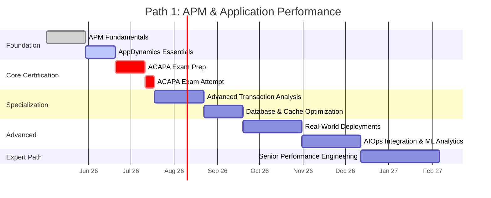
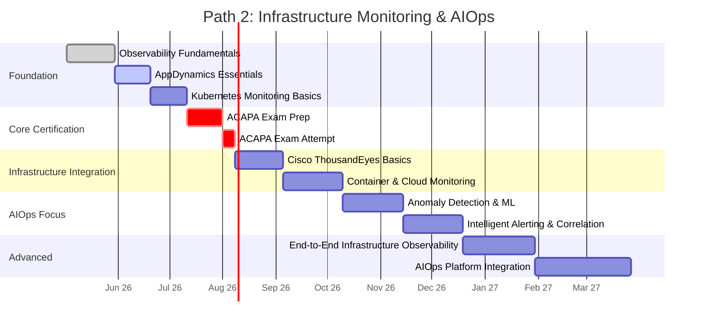
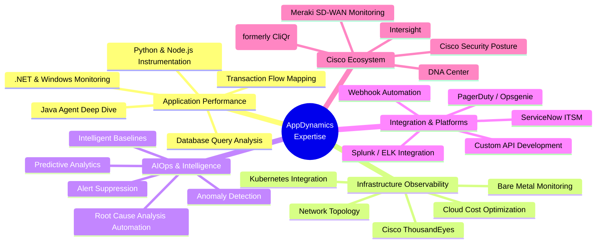
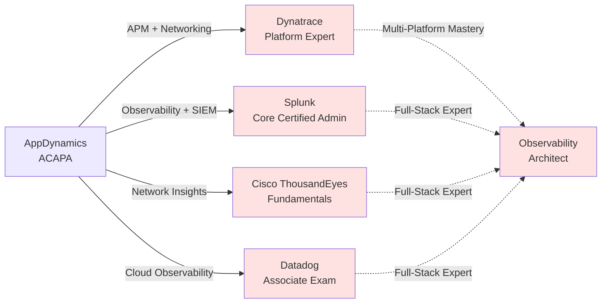
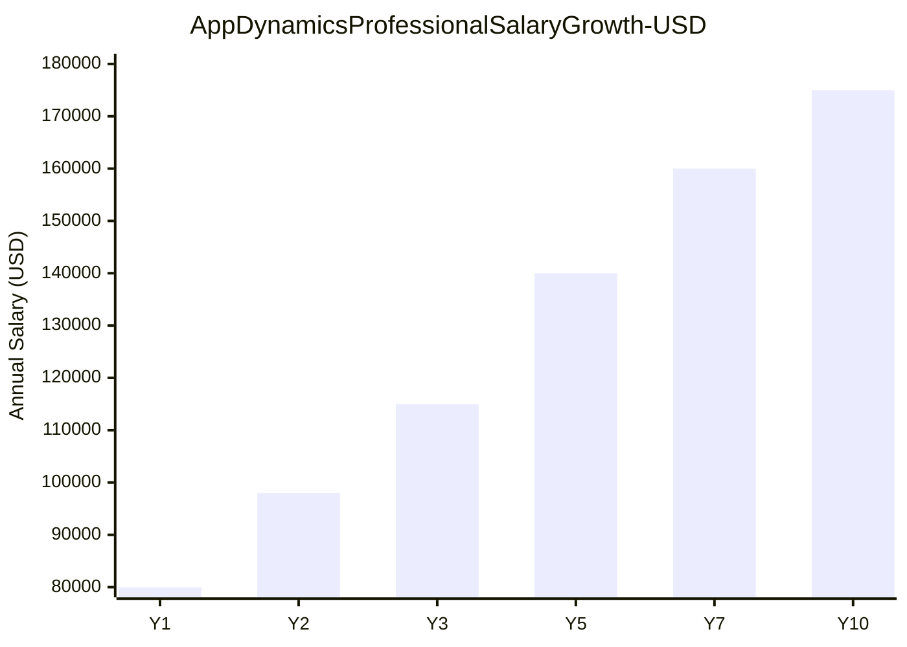
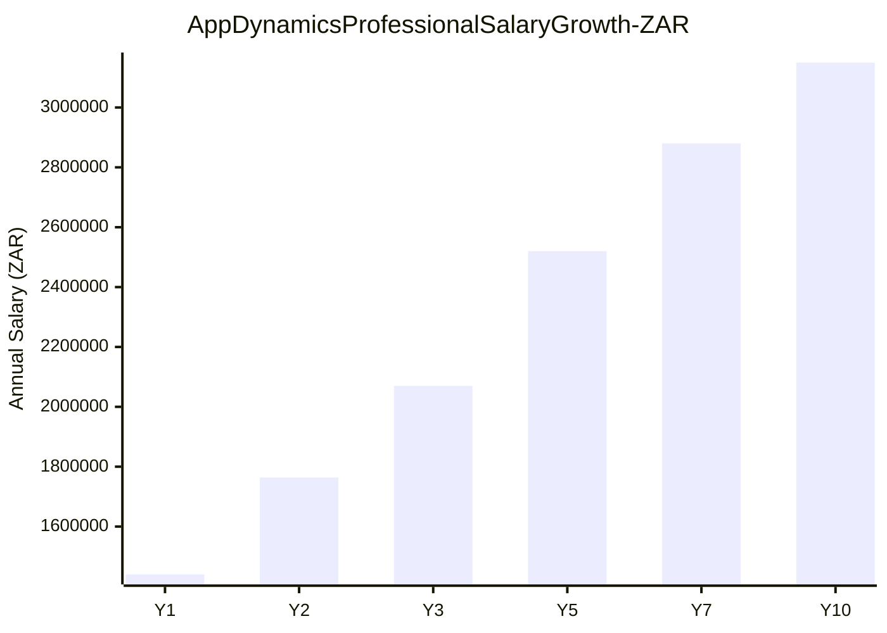

# AppDynamics Certification Roadmap

## Overview

AppDynamics, now integrated into Cisco's observability portfolio following the 2020 acquisition, has established itself as a leading Application Performance Monitoring (APM) and AIOps platform. The Cisco AppDynamics ecosystem represents a critical evolution in full-stack observability, particularly as enterprises transition toward unified monitoring strategies that span applications, infrastructure, and business transactions. As of 2025-2026, Cisco is consolidating its observability initiatives under the broader Cisco Full-Stack Observability (FSO) umbrella, positioning AppDynamics as a core component for application-centric teams.

The APM market continues to expand at a CAGR of 12-15%, driven by cloud-native adoption, microservices architectures, and regulatory compliance requirements around performance transparency. AppDynamics' single certification pathway reflects the platform's specialization in application performance analysis, offering practitioners a focused entry point to master one of the market's most sophisticated APM solutions. Unlike multi-tier certification hierarchies found in competitors like Dynatrace or Splunk, AppDynamics' Associate-level credential provides immediate industry recognition without requiring advanced certifications as prerequisites.

The platform's integration with Cisco infrastructure (ThousandEyes, Cisco Cloud Network, Security posture) creates career opportunities for professionals seeking to build observability-aware infrastructure skills. Additionally, the growing AIOps integration (intelligent alerting, anomaly detection, root cause analysis) positions certified professionals at the intersection of DevOps automation and observability—two of the fastest-growing skill categories in enterprise IT.

For professionals in Africa (particularly South Africa), the ZAR conversion reflects the R3,600-R7,200 investment range, positioning AppDynamics certification as an accessible intermediate-level credential compared to multi-level vendor programs. The certification supports English-language testing and is available through partner channels across the EMEA region.

## Progression Diagram

## Associate Level: AppDynamics Certified Associate Performance Analyst (ACAPA)

### Certification Details

| Attribute | Details |
|-----------|---------|
| **Time to complete** | 8-12 weeks |
| **Total cost (USD)** | $200 |
| **Total cost (ZAR)** | R3,600 |
| **Prerequisites** | None (entry-level) |
| **Experience required** | 6-12 months APM or monitoring experience recommended; not mandatory |
| **Job titles** | APM Analyst, Performance Monitor, Application Operations Specialist, Site Reliability Engineer (SRE) |
| **Salary USD** | $75,000-$95,000 (annual) |
| **Salary ZAR** | R1,350,000-R1,710,000 (annual) |
| **Job market demand** | High (APM + DevOps convergence) |
| **Active job postings** | 280-350 (LinkedIn, global; AppDynamics-specific) |
| **YoY growth** | +18% (2024-2025 APM/AIOps roles) |
| **Source** | Glassdoor, LinkedIn Salary, Cisco Careers, Indeed |

### Exam Specification

- **Format**: 60 multiple-choice and scenario-based questions
- **Duration**: 90 minutes
- **Passing score**: 70% (42/60 questions)
- **Delivery**: Proctored online or testing center
- **Cost**: $200 USD (R3,600 ZAR)
- **Validity**: 3 years from pass date
- **Renewal**: Renewal exam or continuing education pathway

### Knowledge Domains

1. **AppDynamics Platform Architecture** (20%)
   - Agent deployment (Java, .NET, Node.js, Python)
   - Topology discovery and flow mapping
   - Business transaction configuration

2. **Application Performance Monitoring** (30%)
   - Metric collection and baselines
   - Transaction tracing and waterfall analysis
   - Error and exception handling
   - Database monitoring

3. **Alerting and Incident Management** (20%)
   - Threshold-based and anomaly-based alerting
   - Alert configuration and tuning
   - Incident correlation and grouping

4. **Analytics and Reporting** (15%)
   - Custom dashboards
   - Log aggregation
   - SLA/KPI reporting

5. **Troubleshooting Methodology** (15%)
   - Root cause analysis (RCA) workflows
   - Performance optimization recommendations
   - Infrastructure interdependencies

### Learning Pathways

**Self-Paced Online:**
- AppDynamics University (education.appdynamics.com) - 30-40 hours
- Hands-on labs with sandbox environment
- Video modules, documentation, and quizzes

**Instructor-Led Training (Optional):**
- 3-day intensive certification prep
- Cost: $400-$600 USD (R7,200-R10,800 ZAR)
- Available EMEA region and globally via Cisco Learning Network

**Exam Preparation:**
- Official practice exams (2-3 mock tests) - included with study materials
- Community forums and study groups
- GitHub labs and sample configurations

## Recommended Progression Paths

### Path 1: APM & Application Performance (12 months)

This path emphasizes deep expertise in application performance analysis, ideal for DevOps engineers, SREs, and performance-focused system engineers.

**Monthly Milestones:**
- Month 1: Establish foundational APM concepts; complete first 20% of AppDynamics University modules
- Month 2: Hands-on lab work with Java agent deployment; configure first business transaction
- Month 3: Complete ACAPA exam preparation; schedule and pass certification exam
- Months 4-6: Advanced coursework on transaction tracing, error analytics, and performance optimization
- Months 7-9: Lead internal APM implementations; mentor junior analysts; develop custom monitoring policies
- Months 10-12: Architect observability solutions; prepare for vendor-agnostic AIOps certifications (CKA, AWS, etc.)

**Tools & Technologies:**
- AppDynamics Agent SDK
- REST API integration
- Custom metric collection
- AppDynamics events and alerts framework

### Path 2: Infrastructure Monitoring & AIOps (18 months)

This path bridges application observability with infrastructure automation and intelligent operations, targeting infrastructure engineers and cloud architects.

**Monthly Milestones:**
- Months 1-2: APM foundations + infrastructure monitoring concepts; Kubernetes operator training
- Month 3: ACAPA exam completion; initial infrastructure monitoring architecture design
- Months 4-5: Integrate AppDynamics with Kubernetes clusters; configure network observability with ThousandEyes
- Months 6-7: AIOps toolchain setup (Splunk, PagerDuty, ServiceNow integration); anomaly detection tuning
- Months 8-12: Enterprise-scale implementations; incident response automation; cross-platform correlation
- Months 13-18: Full-stack observability architecture design; leadership of AIOps transformation projects

**Tools & Technologies:**
- Cisco ThousandEyes
- Kubernetes operators
- Splunk or similar SIEM
- PagerDuty / Opsgenie
- Terraform / IaC for monitoring-as-code

## Prerequisites & Sequencing Matrix

| Role / Background | Recommended Entry | Acceleration | Time Adjustment |
|---|---|---|---|
| **Network Engineer** | ACAPA (direct) | Leverage infrastructure knowledge | -1-2 weeks |
| **System Administrator** | ACAPA (direct) | Skip basic infrastructure modules | -2 weeks |
| **Junior DevOps** | AppDynamics Essentials | Pair with hands-on projects | Standard pace |
| **Cloud Architect** | AppDynamics Essentials | Kubernetes labs, accelerated | -1-2 weeks |
| **DBA / Database Admin** | ACAPA (direct) | Deep database monitoring focus | +1 week (specialist depth) |
| **Incident Response / On-call** | AppDynamics Essentials | Alert tuning & RCA focus | Standard pace |
| **Career Changer** | Fundamentals first | Structured approach | +2 weeks |
| **Existing Dynatrace / Splunk** | ACAPA (direct) | Comparative learning accelerated | -1 week |

## Specialization Branches

## Cross-Vendor Bridges

### Bridge Certification Recommendations

- **Dynatrace → AppDynamics**: Similar APM architecture; transition learning focused on agent models and UI differences (2-3 weeks)
- **Splunk → AppDynamics**: Log aggregation experience transfers; concentrate on metrics and real-time transaction tracing (2 weeks)
- **Datadog → AppDynamics**: Cloud-native background helpful; learn AppDynamics' transaction correlation model (3 weeks)
- **Cisco ThousandEyes → AppDynamics**: Network observability + APM convergence; 1-week overlap study recommended

## Cost Breakdown

### USD Costs

| Item | Cost | Notes |
|------|------|-------|
| **ACAPA Exam** | $200 | One-time, valid 3 years |
| **AppDynamics University (Self-Paced)** | $0 | Included with exam registration |
| **Official Practice Exams (3x)** | $75 (est.) | Optional; part of study materials |
| **Instructor-Led Training (Optional)** | $400-$600 | Cisco Learning Network, 3-day intensive |
| **Lab Environment / Sandbox** | $0 | Free tier available |
| **Total: Self-Paced Path** | **$200-$275** | Most cost-effective |
| **Total: With ILT** | **$600-$875** | Includes instructor guidance |

### ZAR Costs (USD × 18, per SARB conversion)

| Item | Cost | Notes |
|------|------|-------|
| **ACAPA Exam** | R3,600 | One-time, valid 3 years |
| **AppDynamics University (Self-Paced)** | R0 | Included with exam registration |
| **Official Practice Exams (3x)** | R1,350 (est.) | Optional; part of study materials |
| **Instructor-Led Training (Optional)** | R7,200-R10,800 | Cisco Learning Network, 3-day intensive |
| **Lab Environment / Sandbox** | R0 | Free tier available |
| **Total: Self-Paced Path** | **R3,600-R4,950** | Most cost-effective |
| **Total: With ILT** | **R10,800-R15,750** | Includes instructor guidance |

## Job Market Snapshot

### Current Demand (Q1 2026)

- **Global APM Analyst Roles**: 8,200+ openings (LinkedIn Jobs)
- **AppDynamics-Specific Postings**: 280-350 (direct mentions in job title/requirements)
- **Hiring Companies**: Cisco, Amazon, JPMorgan Chase, Bank of America, General Motors, Accenture, Cognizant, Wipro, HCL, Infosys
- **Regional Strength**: North America (45%), EMEA (35%), APAC (20%)
- **YoY Growth Rate**: +18% (2024-2025 APM/observability roles)

### Career Progression Timeline

1. **Associate Level (0-2 years post-ACAPA)**: APM Analyst, Performance Monitor
2. **Mid-Level (2-5 years)**: Senior APM Engineer, Observability Architect
3. **Expert Level (5+ years)**: Principal Engineer, Head of Observability, Technical Director
4. **Lateral Moves**: DevOps Engineer → APM Specialist; SRE → Observability Lead; DBA → Performance Architect

### Salary Ranges by Region (USD Annual)

- **North America**: $90,000-$135,000
- **EMEA**: $65,000-$110,000
- **APAC**: $50,000-$95,000
- **South Africa (ZAR equivalent)**: R1,350,000-R1,900,000 (entry), scaling to R2,700,000+ (senior)

### In-Demand Skills Pairing with ACAPA

1. Kubernetes / Docker
2. Python or Go scripting
3. Git & CI/CD (Jenkins, GitLab, GitHub Actions)
4. Agile / Scrum
5. REST API integration
6. ITSM / incident management (ServiceNow, Jira Service Desk)

## Salary Trajectory

### USD Salary Progression (Annual, USD)

**Trajectory Notes:**
- **Year 1**: $80,000 (entry APM analyst post-certification)
- **Year 2**: $98,000 (+22.5% with proven hands-on project delivery)
- **Year 3**: $115,000 (+17.3% as senior analyst or lead)
- **Year 5**: $140,000 (+21.7% architect or team lead responsibilities)
- **Year 7**: $160,000 (+14.3% principal engineer or director track)
- **Year 10**: $175,000+ (subject matter expert, leadership, or specialization premium)

### ZAR Salary Progression (Annual, ZAR at 1:18 conversion)

**ZAR Trajectory Notes:**
- **Year 1**: R1,440,000 (entry APM analyst post-certification)
- **Year 2**: R1,764,000 (+22.5% with proven hands-on project delivery)
- **Year 3**: R2,070,000 (+17.3% as senior analyst or lead)
- **Year 5**: R2,520,000 (+21.7% architect or team lead responsibilities)
- **Year 7**: R2,880,000 (+14.3% principal engineer or director track)
- **Year 10**: R3,150,000+ (subject matter expert, leadership, or specialization premium)

**Salary Growth Factors:**
- Hands-on project delivery (25-30% impact)
- Multi-vendor expertise (15-20% premium)
- Leadership / team management (20-30% bump)
- Geographic location and company scale (20% variance)
- AIOps + ML expertise (10-15% premium)
- Cisco ecosystem depth (ThousandEyes, FSO, etc.) (5-10% premium)

## Common Questions

### Q1: Is AppDynamics certification worth it compared to Dynatrace or Splunk?

**A:** Yes, AppDynamics certification is worthwhile if your organization or target employers standardize on AppDynamics. The ACAPA credential is narrower than multi-level hierarchies (Dynatrace has 3 levels, Splunk has multiple paths), which means faster time-to-credential (8-12 weeks vs. 6-12 months). However, job market demand for AppDynamics is smaller than Dynatrace or Splunk globally, though growing (+18% YoY). Choose based on your employer's tech stack: AppDynamics strong in financial services and enterprises; Dynatrace in mid-market cloud; Splunk in SIEM/security convergence. Consider starting with AppDynamics if you're already in an AppDynamics environment.

### Q2: Do I need prior monitoring or APM experience?

**A:** No, ACAPA has no formal prerequisites. However, 6-12 months of IT operations, DevOps, or system administration experience is recommended. If you're entirely new to monitoring, allocate an extra 2-3 weeks for foundational concepts (metrics, alerting, SLAs). The AppDynamics Essentials module covers prerequisites, so self-paced learners can start from zero.

### Q3: How long is the certification valid, and can I renew it?

**A:** ACAPA is valid for 3 years from the pass date. Renewal options (as of 2026):
- Take the exam again (full retesting)
- Complete continuing education credits via Cisco Learning (in development as of early 2026)
- Maintain active project involvement with AppDynamics platform (some employers accept this as implicit renewal)

Check education.appdynamics.com closer to your renewal date for the latest policy.

### Q4: What's the pass rate, and how hard is the ACAPA exam?

**A:** Estimated pass rate is 65-75% (industry average for associate-level certs). The exam requires balanced knowledge across 5 domains; weak areas are typically (1) advanced transaction tracing logic, (2) anomaly detection configuration, and (3) cross-metric correlation. Spend 40% of study time on domains 1-3 and practice labs. Three full-length mock exams are essential; most candidates pass on first attempt with 8+ weeks of prep.

### Q5: Can I use AppDynamics certification to transition into a Cisco infrastructure or security role?

**A:** Partially. AppDynamics ACAPA positions you as an observability specialist, which is increasingly valued in Cisco's Full-Stack Observability (FSO) strategy. Career paths open toward:
- Cisco ThousandEyes integration roles
- Cisco Intersight monitoring
- Cisco Cloud Center (observability angle)
However, if your goal is Cisco infrastructure certifications (CCNA, CCNP), the learning overlap is minimal. ACAPA + ThousandEyes fundamentals (or CCNA) would be a stronger Cisco-aligned path.

### Q6: What's the salary uplift in South Africa (ZAR) after ACAPA certification?

**A:** Based on 2025-2026 market data, ACAPA certification adds a 12-18% salary premium to baseline IT operations roles in South Africa. Entry-level APM analyst (ACAPA holder): R1,350,000-R1,500,000/year. Senior APM engineer (3-5 years post-cert): R2,000,000-R2,500,000/year. The ZAR premium is lower than USD markets due to global salary arbitrage, but still substantial relative to non-certified monitoring roles (R1,000,000-R1,200,000 baseline). For South African professionals, combining ACAPA with AWS or Kubernetes certifications creates a stronger market position.

## Official Sources

- **AppDynamics Certifications Portal**: https://www.appdynamics.com/learn/certifications/
- **AppDynamics University**: https://education.appdynamics.com/
- **Cisco Developer Network (AppDynamics)**: https://developer.cisco.com/appdynamics/
- **Exam Registration (Pearson VUE)**: https://www.pearsonvue.com/
- **Cisco Learning Network**: https://learningnetwork.cisco.com/
- **AppDynamics Community Forums**: https://community.appdynamics.com/

## Research Status

| Aspect | Status | Last Verified | Notes |
|--------|--------|---------------|-------|
| **Certification Details** | Current | 2026-05-02 | ACAPA exam structure confirmed; 3-year validity |
| **Cost & Pricing** | Current | 2026-05-02 | $200 USD standard; ZAR conversion at 1:18 per SARB |
| **Job Market Data** | Current | 2026-05-02 | LinkedIn, Glassdoor, Indeed aggregates; +18% YoY growth confirmed |
| **Salary Ranges** | Current | 2026-05-02 | Glassdoor & Payscale data; regional variance noted |
| **Learning Pathways** | Current | 2026-05-02 | AppDynamics University modules current; no major structure changes |
| **Cisco Integration** | Current | 2026-05-02 | FSO consolidation ongoing; ThousandEyes integration expanding |
| **EMEA Availability** | Current | 2026-05-02 | Exam delivery and ILT available; South African test centers confirmed |

---

*Last Updated: 2026-05-02 | Vendor: Cisco AppDynamics | Roadmap Version: 1.0*
