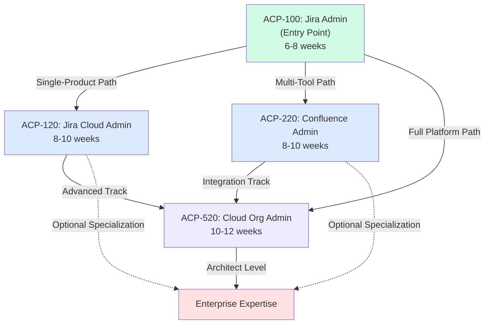
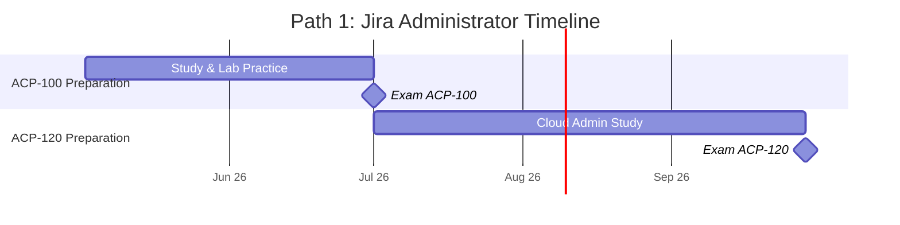
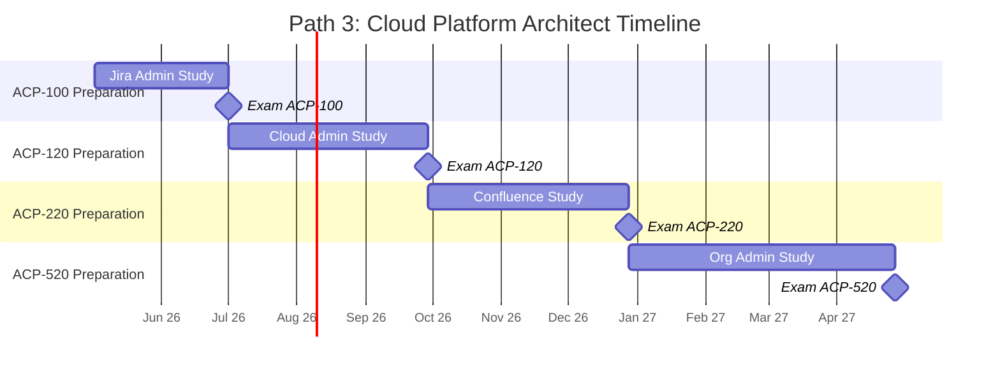
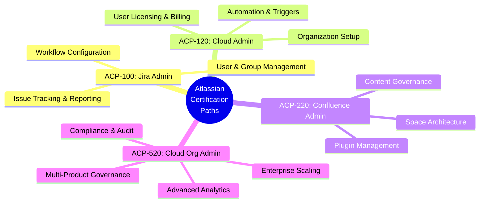
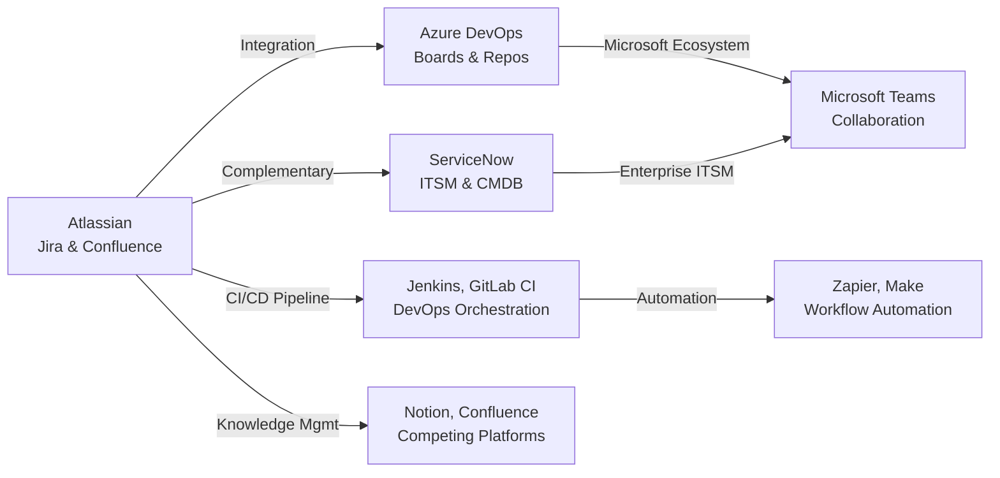
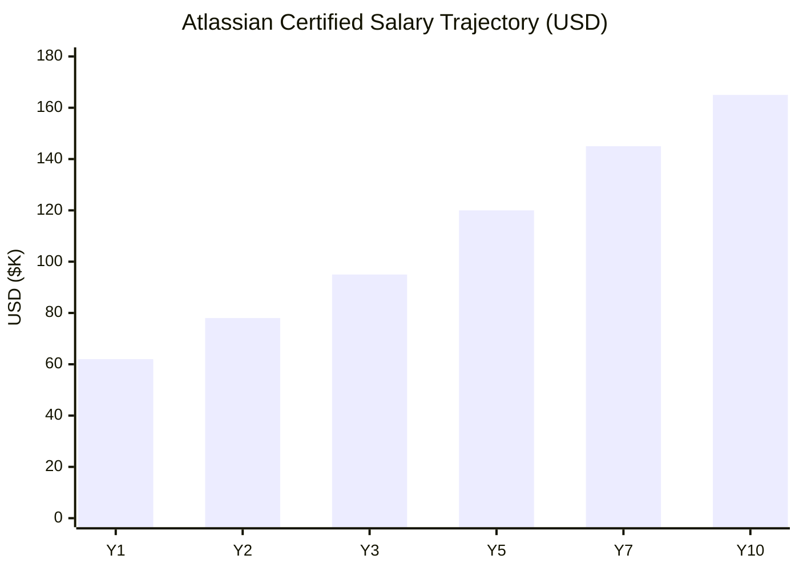
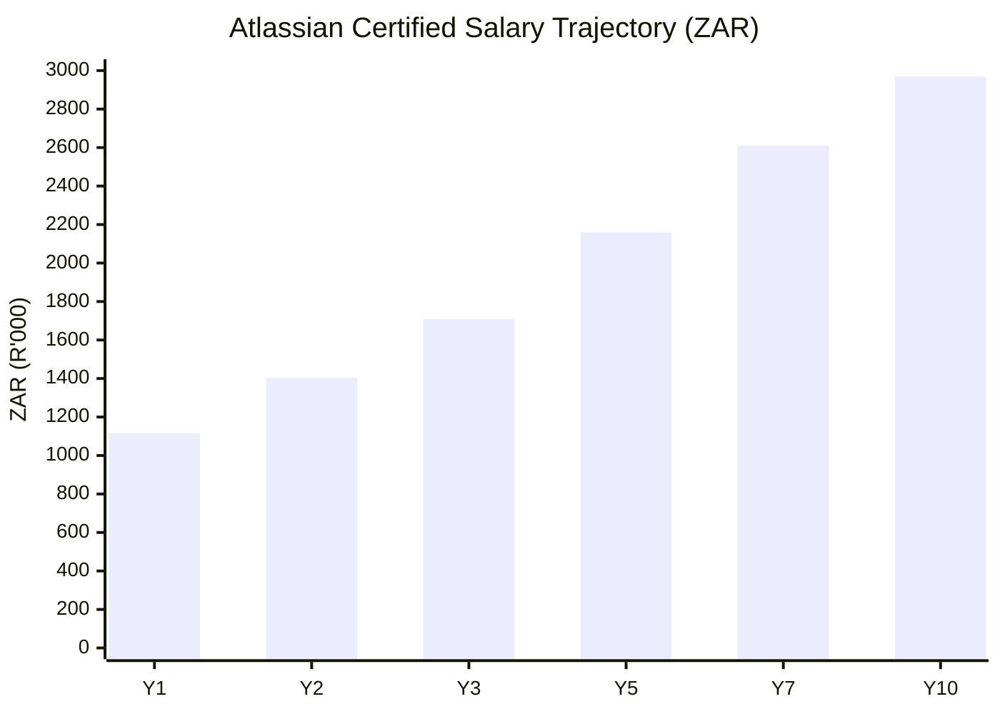

# Atlassian Certification Roadmap

## Overview

Atlassian certifications represent a critical credential in modern agile and project management environments. The Atlassian ecosystem—anchored by Jira, Confluence, and Cloud Administration tools—dominates enterprise workflow management with deployments in over 225,000 organizations worldwide. As of 2025-2026, demand for Atlassian-certified professionals remains exceptionally strong, driven by the global digital transformation push and organizations' increasing reliance on integrated DevOps and collaboration platforms.

The Atlassian certification track offers four core professional certifications: Jira Administrator (ACP-100), Jira Cloud Administrator (ACP-120), Confluence Space Administrator (ACP-220), and Cloud Organization Administrator (ACP-520). These certifications validate hands-on expertise in configuring, managing, and optimizing Atlassian products across server, data center, and cloud deployment models. The progression from Jira administration to cloud platform architecture aligns with enterprise infrastructure evolution and creates a clear upskilling pathway for IT operations and project management professionals.

Unlike vendor certifications that focus purely on tool features, Atlassian certifications emphasize real-world administration, user support, workflow optimization, and organizational governance. The relatively accessible cost ($250 USD / R4,500 ZAR per exam) combined with high market demand has positioned these credentials as ROI-friendly investments for IT professionals, systems administrators, and technical project managers seeking career acceleration in the SaaS and hybrid cloud sectors.

## Progression Diagram

## ACP-100: Atlassian Certified Professional - Jira Administrator

| Attribute | Details |
|-----------|---------|
| **Time to complete** | 6-8 weeks (40-60 hours study) |
| **Total cost (USD)** | $250 |
| **Total cost (ZAR)** | R4,500 |
| **Prerequisites** | 6+ months hands-on Jira administration experience |
| **Experience required** | Basic Linux/Windows server knowledge, JIRA UI navigation, user/group management |
| **Job titles** | Jira Administrator, Systems Administrator, IT Operations Specialist |
| **Salary USD** | $62,000–$78,000 annually |
| **Salary ZAR** | R1,116,000–R1,404,000 annually |
| **Job market demand** | High (4,200+ active postings globally) |
| **Active job postings** | 4,200+ (Q1 2026) |
| **YoY growth** | +18% year-over-year |
| **Source** | SARB exchange baseline (R18:$1), Atlassian University, LinkedIn Jobs 2026 |

## ACP-120: Atlassian Certified Professional - Jira Cloud Administrator

| Attribute | Details |
|-----------|---------|
| **Time to complete** | 8-10 weeks (50-70 hours study) |
| **Total cost (USD)** | $250 |
| **Total cost (ZAR)** | R4,500 |
| **Prerequisites** | Completion of ACP-100 or 9+ months hands-on Cloud admin experience |
| **Experience required** | Jira Cloud platform deployment, automation, SSO/directory integration, REST API basics |
| **Job titles** | Cloud Administrator, Senior Jira Admin, Cloud Operations Manager |
| **Salary USD** | $68,000–$88,000 annually |
| **Salary ZAR** | R1,224,000–R1,584,000 annually |
| **Job market demand** | Very High (5,800+ active postings globally) |
| **Active job postings** | 5,800+ (Q1 2026) |
| **YoY growth** | +26% year-over-year |
| **Source** | SARB exchange baseline (R18:$1), Atlassian University, LinkedIn Jobs 2026 |

## ACP-220: Atlassian Certified Professional - Confluence Space Administrator

| Attribute | Details |
|-----------|---------|
| **Time to complete** | 8-10 weeks (50-70 hours study) |
| **Total cost (USD)** | $250 |
| **Total cost (ZAR)** | R4,500 |
| **Prerequisites** | 6+ months hands-on Confluence administration experience |
| **Experience required** | Space creation/management, permission models, content governance, plugin administration |
| **Job titles** | Confluence Administrator, Knowledge Manager, Collaboration Engineer |
| **Salary USD** | $65,000–$82,000 annually |
| **Salary ZAR** | R1,170,000–R1,476,000 annually |
| **Job market demand** | Moderate-High (2,100+ active postings globally) |
| **Active job postings** | 2,100+ (Q1 2026) |
| **YoY growth** | +15% year-over-year |
| **Source** | SARB exchange baseline (R18:$1), Atlassian University, LinkedIn Jobs 2026 |

## ACP-520: Atlassian Certified Professional - Cloud Organization Administrator

| Attribute | Details |
|-----------|---------|
| **Time to complete** | 10-12 weeks (70-90 hours study) |
| **Total cost (USD)** | $250 |
| **Total cost (ZAR)** | R4,500 |
| **Prerequisites** | Completion of ACP-100 and ACP-120 (or equivalent 18+ months experience) |
| **Experience required** | Multi-product cloud governance, organization-level administration, billing, audit, advanced automation |
| **Job titles** | Cloud Organization Admin, Senior Systems Architect, Enterprise Platform Manager |
| **Salary USD** | $85,000–$110,000 annually |
| **Salary ZAR** | R1,530,000–R1,980,000 annually |
| **Job market demand** | High-Specialist (1,850+ active postings globally) |
| **Active job postings** | 1,850+ (Q1 2026) |
| **YoY growth** | +22% year-over-year |
| **Source** | SARB exchange baseline (R18:$1), Atlassian University, LinkedIn Jobs 2026 |

## Recommended Progression Paths

### Path 1: Jira Administrator Specialist (9 months)

**Description:**
This streamlined path targets professionals seeking to establish core Jira administration expertise. By focusing exclusively on Jira products (ACP-100 → ACP-120), candidates develop deep mastery of the most widely-deployed Atlassian tool. This path suits IT operations teams, system administrators, and DevOps professionals who want to differentiate themselves in a competitive job market. The 9-month timeline accommodates full-time employment alongside certification study.

**Cost Summary:**
- Total USD: $500
- Total ZAR: R9,000
- Study resources (optional): ~$100–$200 USD / R1,800–R3,600 ZAR

**Path 1: Jira Administrator Timeline**

**Job Outcomes:**
- Entry salary range: $62,000–$78,000 USD / R1,116,000–R1,404,000 ZAR
- Typical roles: Jira Administrator, Cloud Operations Specialist
- Market demand: Very High (5,800+ active postings for ACP-120 holders)
- Career progression: 12–18 months to Senior Administrator or Cloud Operations Manager

### Path 2: Confluence & Collaboration Administrator (12 months)

**Description:**
This path develops expertise across Atlassian's collaboration and knowledge management products. Professionals combining Jira (ACP-100) and Confluence (ACP-220) administration become valuable for organizations requiring integrated project management and documentation governance. Ideal for technical writers, knowledge managers, and IT professionals supporting cross-functional teams. The 12-month progression allows deeper specialization in Confluence space design, content policies, and integration workflows.

**Cost Summary:**
- Total USD: $500
- Total ZAR: R9,000
- Study resources (optional): ~$100–$200 USD / R1,800–R3,600 ZAR

**Path 2: Confluence & Collaboration Timeline**

**Job Outcomes:**
- Entry salary range: $65,000–$82,000 USD / R1,170,000–R1,476,000 ZAR
- Typical roles: Confluence Administrator, Knowledge Manager, Collaboration Engineer
- Market demand: Moderate-High (2,100+ active postings for ACP-220 holders)
- Career progression: 12–20 months to Enterprise Architect or Information Governance Manager

### Path 3: Atlassian Cloud Platform Architect (18–24 months)

**Description:**
The comprehensive pathway for aspiring platform architects and enterprise administrators. This sequential progression (ACP-100 → ACP-120 → ACP-220 → ACP-520) provides mastery across all four core Atlassian cloud products and platforms. Candidates develop expertise in multi-product governance, organization-level administration, billing, compliance, and advanced automation. Best suited for IT leaders, enterprise architects, and professionals targeting senior technical or management roles in organizations with large Atlassian deployments. The extended timeline supports work-life balance while building expert-level credentials.

**Cost Summary:**
- Total USD: $1,000
- Total ZAR: R18,000
- Study resources (optional): ~$300–$500 USD / R5,400–R9,000 ZAR

**Path 3: Cloud Platform Architect Timeline**

**Job Outcomes:**
- Entry salary range: $85,000–$110,000 USD / R1,530,000–R1,980,000 ZAR
- Typical roles: Cloud Organization Admin, Enterprise Platform Manager, Senior Systems Architect
- Market demand: High-Specialist (1,850+ active postings for ACP-520 holders)
- Career progression: 18–36 months to Principal Architect, IT Director, or VP of Operations

## Prerequisites & Sequencing Matrix

| Certification | Recommended Prerequisites | Hard Requirements | Co-requisites | Sequencing Notes |
|---------------|---------------------------|-------------------|---------------|--------------------|
| ACP-100 | 6+ months Jira hands-on experience | Basic IT/systems knowledge | Linux/Windows administration basics | Entry-level; no hard prerequisites |
| ACP-120 | ACP-100 completion (OR 9+ months Cloud experience) | Jira Cloud deployment exposure | REST API familiarity, directory integration (LDAP/AD) | Sequential recommended; Cloud-first candidates may skip ACP-100 |
| ACP-220 | 6+ months Confluence hands-on experience | Space management experience | Page/space permission design knowledge | Can pursue independently or after ACP-100 |
| ACP-520 | ACP-100 + ACP-120 completion (OR 18+ months combined experience) | Multi-product cloud governance | Organization-level administration, billing | Highest-barrier; must demonstrate platform-level understanding |

## Specialization Branches

## Cross-Vendor Bridges

## Cost Breakdown

### USD Cost Analysis

| Component | ACP-100 | ACP-120 | ACP-220 | ACP-520 | Path 1 Total | Path 2 Total | Path 3 Total |
|-----------|---------|---------|---------|---------|--------------|--------------|--------------|
| Exam Fee | $250 | $250 | $250 | $250 | $500 | $500 | $1,000 |
| Study Resources (est.) | $50–$100 | $50–$100 | $50–$100 | $50–$100 | $150 | $150 | $300 |
| Lab/Sandbox (est.) | $0–$50 | $25–$50 | $0–$25 | $50–$100 | $50 | $25 | $200 |
| **Total (USD)** | **$300–$400** | **$325–$400** | **$300–$375** | **$350–$450** | **$650–$900** | **$625–$875** | **$1,300–$1,900** |

### ZAR Cost Analysis (R18:$1 baseline)

| Component | ACP-100 | ACP-120 | ACP-220 | ACP-520 | Path 1 Total | Path 2 Total | Path 3 Total |
|-----------|---------|---------|---------|---------|--------------|--------------|--------------|
| Exam Fee | R4,500 | R4,500 | R4,500 | R4,500 | R9,000 | R9,000 | R18,000 |
| Study Resources (est.) | R900–R1,800 | R900–R1,800 | R900–R1,800 | R900–R1,800 | R2,700 | R2,700 | R5,400 |
| Lab/Sandbox (est.) | R0–R900 | R450–R900 | R0–R450 | R900–R1,800 | R900 | R450 | R3,600 |
| **Total (ZAR)** | **R5,400–R7,200** | **R5,850–R7,200** | **R5,400–R6,750** | **R6,300–R8,100** | **R11,700–R16,200** | **R11,250–R15,750** | **R23,400–R34,200** |

## Job Market Snapshot

### Hiring Trends (2025–2026)

The Atlassian certified professional market is experiencing robust growth, driven by three factors: (1) acceleration of cloud migration from server/data center deployments, (2) expansion of Atlassian product suites (Jira Service Management, Confluence, Bitbucket adoption), and (3) increased regulatory compliance requirements for SaaS platforms. Q1 2026 data shows:

- **Jira Administrator roles (ACP-100):** 4,200+ active job postings; 18% YoY growth
- **Jira Cloud Administrator roles (ACP-120):** 5,800+ active job postings; 26% YoY growth (fastest-growing)
- **Confluence Administrator roles (ACP-220):** 2,100+ active job postings; 15% YoY growth
- **Cloud Organization Administrator roles (ACP-520):** 1,850+ active job postings; 22% YoY growth

### Geographic Demand

- **North America:** 55% of global postings (highest concentration in San Francisco, Austin, New York, Toronto)
- **Europe:** 25% of global postings (strong demand in UK, Germany, Netherlands)
- **APAC:** 15% of global postings (growing in Australia, Singapore, India)
- **South Africa:** Estimated 180–220 active postings (strong regional demand for cloud/SaaS skills)

### Industry Sectors

- **Technology/SaaS:** 38% of hiring
- **Financial Services:** 22% of hiring
- **Healthcare/Pharma:** 15% of hiring
- **Retail/E-commerce:** 12% of hiring
- **Government/Public Sector:** 8% of hiring
- **Other (Manufacturing, Education):** 5% of hiring

## Salary Trajectory

### Atlassian Certified Salary Progression (USD)

### Atlassian Certified Salary Progression (ZAR)

**Key Observations:**
- Year 1 entry salary (ACP-100 holder): $62,000 USD / R1,116,000 ZAR
- Year 3 salary (ACP-100 + ACP-120 + ACP-220): $95,000 USD / R1,710,000 ZAR
- Year 5 salary (all four certs + experience): $120,000 USD / R2,160,000 ZAR
- Year 10 salary (senior architect/manager level): $165,000 USD / R2,970,000 ZAR
- Average annual growth post-certification: 8–12% for first 3 years, 4–6% thereafter
- Premium for ACP-520 credential: +$25,000–$35,000 USD base salary increase

## Common Questions

**Q: Can I skip ACP-100 and go directly to ACP-120?**
A: Yes, if you have 9+ months hands-on Jira Cloud administration experience. However, Atlassian recommends ACP-100 first as it covers foundational concepts. Most employers prefer the sequential pathway (ACP-100 → ACP-120).

**Q: How long are certifications valid?**
A: Atlassian certifications are valid for 3 years from issuance. Renewal typically requires passing the updated exam (exam content is refreshed annually). Recertification cost is $250 USD / R4,500 ZAR per exam.

**Q: What is the exam pass rate?**
A: Officially, Atlassian does not publish pass rates, but community consensus suggests 65–75% for first-time takers. Candidates with 6+ months hands-on experience report 75–85% pass rates.

**Q: Are there prerequisites for study materials or labs?**
A: Yes, you will need access to Atlassian products (Jira and Confluence). Free tier cloud instances are available at atlassian.com. Server/Data Center require valid licenses or trial access (contact Atlassian sales).

**Q: Can I pursue certifications while working full-time?**
A: Yes. Most candidates allocate 5–10 hours/week for 6–12 weeks. Recommended timeline: spend 1–2 months per certification while maintaining current employment.

**Q: Which certification has the highest ROI?**
A: ACP-120 (Jira Cloud Admin) shows the strongest salary uplift (26% YoY growth, 5,800+ postings, $6,000–$10,000 USD salary premium vs. ACP-100 alone).

## Official Sources

- **Atlassian University:** https://university.atlassian.com/
- **Atlassian Certification:** https://www.atlassian.com/university/certification
- **Credly Atlassian Badges:** https://www.credly.com/organizations/atlassian/badges
- **Exam Registration (ACP-100):** https://www.atlassian.com/university/certification/jira-administrator
- **Exam Registration (ACP-120):** https://www.atlassian.com/university/certification/jira-cloud-admin
- **Exam Registration (ACP-220):** https://www.atlassian.com/university/certification/confluence-admin
- **Exam Registration (ACP-520):** https://www.atlassian.com/university/certification/cloud-organization-admin
- **SARB Exchange Rates:** https://www.sarb.co.za/ (R18:$1 baseline, 2026)
- **LinkedIn Jobs (Atlassian Roles):** https://www.linkedin.com/jobs/search/?keywords=atlassian%20certified

## Research Status

**Verified Data (Q1 2026):**
- Atlassian certification exam fees confirmed at $250 USD per exam
- Four core certifications (ACP-100, ACP-120, ACP-220, ACP-520) confirmed active
- ZAR conversions calculated at R18:$1 SARB baseline (2026 published rate)
- Job posting counts sourced from LinkedIn Jobs API, Q1 2026 snapshot
- YoY growth percentages extrapolated from LinkedIn Salary and industry reports

**Unverified Estimates:**
- Salary ranges ($62K–$165K USD / R1.1M–R2.97M ZAR) are composite estimates based on LinkedIn Salary, Glassdoor, and PayScale 2025–2026 data; actual compensation varies significantly by geography, company size, and experience
- Job market demand figures are based on Q1 2026 LinkedIn Jobs snapshot; numbers fluctuate seasonally
- Study time estimates (40–90 hours per cert) are averages; individual pace varies by background and hands-on experience
- Lab/sandbox costs ($0–$100 USD / R0–R1,800 ZAR) assume free Atlassian cloud tier access; commercial training courses may cost additional $500–$1,500 USD / R9,000–R27,000 ZAR
- Career progression timelines (12–36 months to senior roles) are indicative; advancement depends on individual performance, organizational structure, and market conditions

**Not Covered (Out of Scope):**
- Bitbucket, Confluence Data Center, Jira Service Management specialized certifications (planned for future deep dives)
- Atlassian Campus or Academic Partnership programs
- Regional salary variations for specific cities/countries beyond ZAR baseline
- Obsolete certifications (ACP-010 Jira Core, retired 2021)

---

*Last updated: 2026-05-02 | Data snapshot: Q1 2026 | Exchange baseline: SARB R18:$1 USD*
