# CNCF Certification Roadmap

## Overview

The Cloud Native Computing Foundation (CNCF), part of the Linux Foundation, serves as the steward of critical open-source projects including Kubernetes, Prometheus, Helm, Argo, Istio, and dozens more. The Linux Foundation delivers official CNCF certification exams globally via PSI proctoring.

**Why CNCF Certs Matter in 2026:**
- Kubernetes adoption exceeds 85% among enterprises managing containerized workloads
- Cloud-native and platform engineering roles are fastest-growing segments in DevOps/SRE markets
- CKA, CKAD, and CKS certifications remain industry gold standards for validating hands-on Kubernetes expertise
- Remote-first, performance-based exams (not multiple choice) directly test real-world kubectl proficiency
- Certification earnings premium: 15-25% salary lift vs. non-certified peers in same roles

**CNCF Exam Ecosystem:**
- **KCNA** (Kubernetes & Cloud Native Associate): Entry-level, foundational concepts, multiple choice
- **KCSA** (Kubernetes & Cloud Native Security Associate): Security fundamentals, multiple choice
- **CKA** (Certified Kubernetes Administrator): Performance-based, cluster operations, administration
- **CKAD** (Certified Kubernetes Application Developer): Performance-based, application deployment
- **CKS** (Certified Kubernetes Security Specialist): Performance-based, security hardening, policy

---

## Progression Diagram

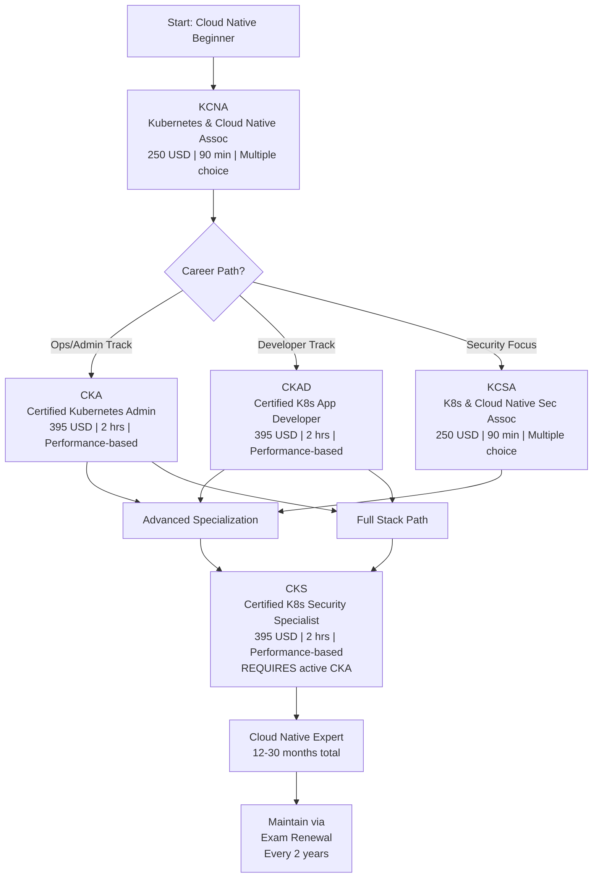

---

## Level 1: Associate-Level Certifications

### KCNA: Kubernetes and Cloud Native Associate

| Attribute | Value |
|---|---|
| Time to complete | 4-8 weeks |
| Total cost (USD) | $250 |
| Total cost (ZAR) | R4,500 |
| Prerequisites | None |
| Experience required | Basic Linux, containers (Docker), cloud concepts |
| Job titles | Cloud Native Engineer, DevOps Associate, Platform Engineer (entry) |
| Salary USD | $65,000-$85,000 |
| Salary ZAR | R1,170,000-R1,530,000 |
| Job market demand | Very High |
| Active job postings | 12,000+ (LinkedIn) |
| YoY growth | +28% (2024-2026) |
| Source | https://www.cncf.io/certification/kcna/ |

**Exam Details:**
- Format: Multiple choice (60 questions)
- Duration: 90 minutes
- Passing score: 66%
- Kubernetes version: Current stable (1.28+)
- Cost includes 1 free retake
- Validity: 2 years

**Content Domains:**
1. Kubernetes Fundamentals (46%): Pods, Services, Deployments, StatefulSets
2. Container Orchestration (22%): Scheduling, networking, storage
3. Cloud Native Architecture (16%): Microservices, GitOps, observability
4. Cloud Native Tooling (16%): CI/CD, logging, monitoring, tracing

**Study Resources:**
- Linux Foundation Essentials course (free, ~8 hours)
- Linux Foundation KCNA course ($99, ~16 hours)
- Killer.sh practice exam ($40)
- kubectl documentation (https://kubernetes.io/docs/)

---

### KCSA: Kubernetes and Cloud Native Security Associate

| Attribute | Value |
|---|---|
| Time to complete | 5-8 weeks |
| Total cost (USD) | $250 |
| Total cost (ZAR) | R4,500 |
| Prerequisites | None (KCNA recommended but not required) |
| Experience required | Basic Linux, containers, security awareness |
| Job titles | Security Engineer, DevSecOps Engineer, Cloud Security Analyst |
| Salary USD | $75,000-$95,000 |
| Salary ZAR | R1,350,000-R1,710,000 |
| Job market demand | High |
| Active job postings | 7,500+ (LinkedIn) |
| YoY growth | +35% (2024-2026) |
| Source | https://www.cncf.io/certification/kcsa/ |

**Exam Details:**
- Format: Multiple choice (60 questions)
- Duration: 90 minutes
- Passing score: 66%
- Kubernetes version: Current stable (1.28+)
- Cost includes 1 free retake
- Validity: 2 years

**Content Domains:**
1. Container Security (30%): Image scanning, runtime isolation, vulnerability management
2. Kubernetes Security (40%): RBAC, network policies, secrets management, pod security
3. Compliance & Governance (20%): Audit logging, policy enforcement, regulatory standards
4. Supply Chain Security (10%): Software bill of materials, signed artifacts, signed commits

---

## Level 2: Practitioner-Level Certifications

### CKA: Certified Kubernetes Administrator

| Attribute | Value |
|---|---|
| Time to complete | 8-16 weeks |
| Total cost (USD) | $395 |
| Total cost (ZAR) | R7,110 |
| Prerequisites | None (KCNA highly recommended) |
| Experience required | 1-2 years Kubernetes operations, Linux admin, networking fundamentals |
| Job titles | Kubernetes Administrator, Platform Engineer, DevOps Engineer, SRE |
| Salary USD | $95,000-$130,000 |
| Salary ZAR | R1,710,000-R2,340,000 |
| Job market demand | Very High |
| Active job postings | 18,000+ (LinkedIn) |
| YoY growth | +22% (2024-2026) |
| Source | https://www.cncf.io/certification/cka/ |

**Exam Details:**
- Format: Performance-based (live kubectl terminal, real K8s clusters)
- Duration: 2 hours (120 minutes, with 13-17 scenario tasks)
- Passing score: 66%
- Kubernetes version: Current stable (1.28+)
- Proctoring: PSI online (webcam, screen share, ID verification)
- Cost includes 1 free retake
- Validity: 2 years

**Content Domains:**
1. Cluster Architecture, Installation & Configuration (25%): kubeadm, ETCD, kube-apiserver
2. Workloads & Scheduling (15%): Deployments, StatefulSets, DaemonSets, resource requests
3. Services & Networking (20%): Services, Ingress, CNI, network policies
4. Storage (10%): PersistentVolumes, PersistentVolumeClaims, StorageClasses
5. Troubleshooting (30%): Cluster issues, pod failures, networking diagnostics

**Study Resources:**
- Linux Foundation CKA course ($299, ~24 hours)
- Killer.sh CKA simulator ($99, highly recommended, ~4-5 practice exams)
- Udemy CKA courses ($15-45)
- Kubernetes official documentation (https://kubernetes.io/)
- Practice labs: KodeKloud, Katacoda, Linux Academy

---

### CKAD: Certified Kubernetes Application Developer

| Attribute | Value |
|---|---|
| Time to complete | 8-16 weeks |
| Total cost (USD) | $395 |
| Total cost (ZAR) | R7,110 |
| Prerequisites | None (KCNA recommended) |
| Experience required | 1-2 years app development, containers, Kubernetes basics |
| Job titles | Application Developer, Cloud Developer, Platform Engineer, DevOps Engineer |
| Salary USD | $90,000-$125,000 |
| Salary ZAR | R1,620,000-R2,250,000 |
| Job market demand | Very High |
| Active job postings | 14,000+ (LinkedIn) |
| YoY growth | +26% (2024-2026) |
| Source | https://www.cncf.io/certification/ckad/ |

**Exam Details:**
- Format: Performance-based (live kubectl terminal, real K8s clusters)
- Duration: 2 hours (120 minutes, with 15-20 scenario tasks)
- Passing score: 66%
- Kubernetes version: Current stable (1.28+)
- Proctoring: PSI online (webcam, screen share, ID verification)
- Cost includes 1 free retake
- Validity: 2 years

**Content Domains:**
1. Application Design & Build (20%): Deployments, DaemonSets, StatefulSets, multi-container pods
2. Application Deployment (20%): Helm, Kustomize, GitOps, rollouts, rollbacks
3. Application Observability & Maintenance (15%): Logging, monitoring, debugging, scaling
4. Application Environment, Configuration & Security (25%): Secrets, ConfigMaps, RBAC, pod security
5. Services & Networking (20%): Services, Ingress, network policies, DNS

**Study Resources:**
- Linux Foundation CKAD course ($299, ~20 hours)
- Killer.sh CKAD simulator ($99)
- Udemy CKAD prep courses ($15-45)
- KodeKloud CKAD labs ($20-50)
- Kubernetes docs for developers (https://kubernetes.io/docs/)

---

## Level 3: Security Specialist Certification

### CKS: Certified Kubernetes Security Specialist

| Attribute | Value |
|---|---|
| Time to complete | 10-14 weeks |
| Total cost (USD) | $395 |
| Total cost (ZAR) | R7,110 |
| Prerequisites | ACTIVE CKA (hard requirement, must be valid at exam time) |
| Experience required | 2-3 years K8s operations, security background, cluster hardening |
| Job titles | Security Engineer, DevSecOps Engineer, Platform Security Engineer, SRE |
| Salary USD | $110,000-$150,000 |
| Salary ZAR | R1,980,000-R2,700,000 |
| Job market demand | High |
| Active job postings | 6,500+ (LinkedIn) |
| YoY growth | +40% (2024-2026) |
| Source | https://www.cncf.io/certification/cks/ |

**Exam Details:**
- Format: Performance-based (live kubectl terminal, real K8s clusters, runtime monitoring)
- Duration: 2 hours (120 minutes, with 15-18 scenario tasks)
- Passing score: 67% (slightly higher than CKA/CKAD)
- Kubernetes version: Current stable (1.28+)
- Proctoring: PSI online with strict environment controls
- Requires PSI NG Proctor (newer version with enhanced security checks)
- Cost includes 1 free retake
- Validity: 2 years (requires CKA remains valid)
- Hard Prerequisite: Must hold current CKA at exam time (no exceptions)

**Content Domains:**
1. Cluster Setup & Hardening (15%): Secure API server, kubelet, etcd encryption, RBAC
2. Microservices Vulnerability Scanning (20%): Image scanning, runtime security, admission control
3. Supply Chain Security (20%): OCI image security, signed images, secure registries, secure scanning
4. Monitoring, Logging & Runtime Security (20%): Falco, audit logs, network policies, syscall monitoring
5. Kubernetes Security Best Practices (25%): Pod security standards, network segmentation, secrets encryption

**Study Resources:**
- Linux Foundation CKS course ($399, ~20 hours)
- Killer.sh CKS simulator ($99)
- Udemy CKS courses ($15-45)
- KodeKloud CKS labs ($50-100)
- Kubernetes security documentation (https://kubernetes.io/docs/concepts/security/)
- Falco project docs (https://falco.org/docs/)

---

## Recommended Progression Paths

### Path 1: Kubernetes Administrator Track
**Target Role:** Kubernetes Administrator, Platform Operations Engineer

#### Timeline & Costs

**Study Phase 1: KCNA (Weeks 1-8)**
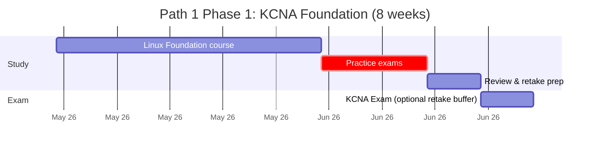

- **Cost:** $250 + course materials ~$150 = **$400 USD / R7,200 ZAR**
- **Time:** 8 weeks, 8-10 hours/week
- **Outcome:** KCNA certificate, foundational Kubernetes knowledge

**Study Phase 2: CKA (Weeks 9-24)**
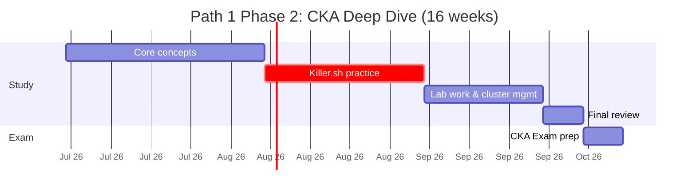

- **Cost:** $395 + Killer.sh ($99) + optional course ($299) = **$793 USD / R14,274 ZAR**
- **Time:** 16 weeks, 10-15 hours/week
- **Outcome:** CKA certificate, operations expertise

**Total Path 1 Investment:**
- **Time:** 24 weeks (6 months)
- **Cost USD:** $1,193 | **Cost ZAR:** R21,474
- **Salary Range:** $95,000-$130,000 USD / R1,710,000-R2,340,000 ZAR
- **Job Market Position:** Intermediate-to-Senior Kubernetes Ops

---

### Path 2: Cloud Native Developer Track
**Target Role:** Kubernetes Developer, Cloud Application Engineer

#### Timeline & Costs

**Study Phase 1: KCNA (Weeks 1-8)**
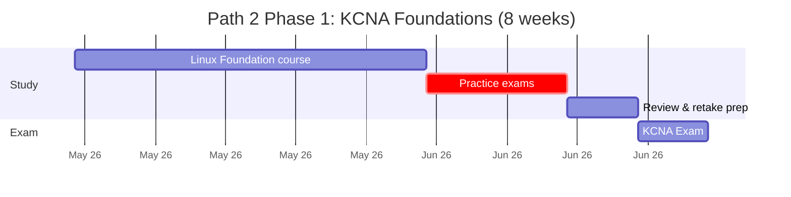

- **Cost:** $250 + materials ~$150 = **$400 USD / R7,200 ZAR**
- **Time:** 8 weeks, 8-10 hours/week

**Study Phase 2: CKAD (Weeks 9-24)**
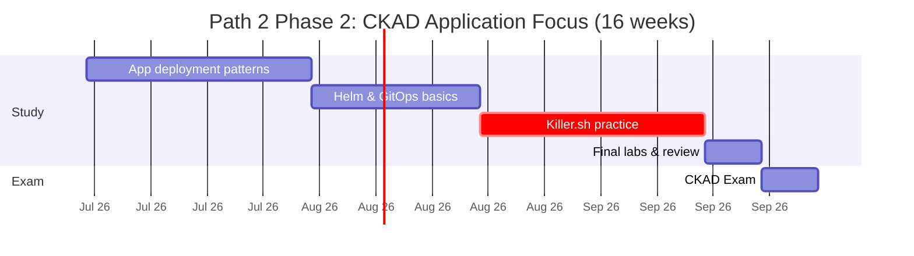

- **Cost:** $395 + Killer.sh ($99) + optional course ($299) = **$793 USD / R14,274 ZAR**
- **Time:** 16 weeks, 10-15 hours/week

**Total Path 2 Investment:**
- **Time:** 24 weeks (6 months)
- **Cost USD:** $1,193 | **Cost ZAR:** R21,474
- **Salary Range:** $90,000-$125,000 USD / R1,620,000-R2,250,000 ZAR
- **Job Market Position:** Intermediate Cloud-Native Developer

---

### Path 3: Platform Security Engineer Track
**Target Role:** Kubernetes Security Engineer, DevSecOps Platform Engineer

#### Timeline & Costs

**Study Phase 1: KCNA + KCSA (Weeks 1-12)**
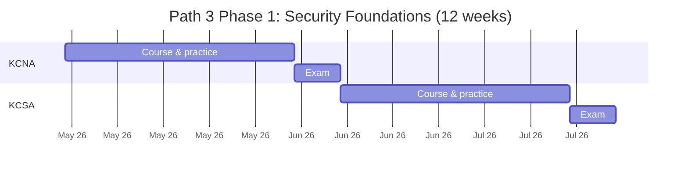

- **Cost:** $250 + $250 + materials ~$200 = **$700 USD / R12,600 ZAR**
- **Time:** 12 weeks

**Study Phase 2: CKA (Weeks 13-28)**
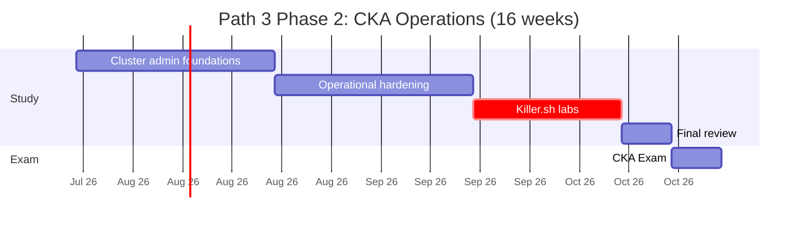

- **Cost:** $395 + Killer.sh ($99) + course ($299) = **$793 USD / R14,274 ZAR**
- **Time:** 16 weeks

**Study Phase 3: CKS (Weeks 29-42)**
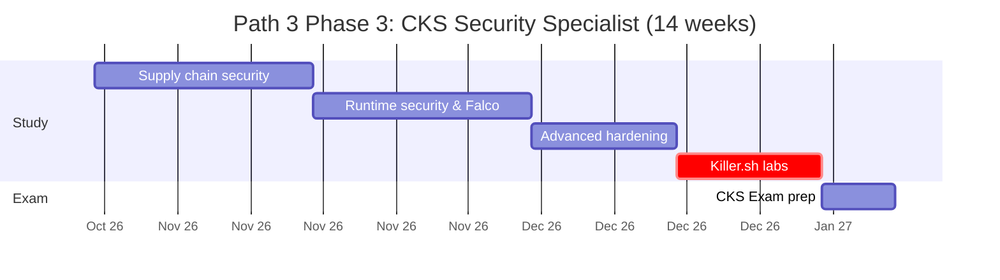

- **Cost:** $395 + Killer.sh ($99) + course ($399) = **$893 USD / R16,074 ZAR**
- **Time:** 14 weeks, 12-15 hours/week
- **Note:** Must hold active CKA before or during CKS exam window

**Total Path 3 Investment:**
- **Time:** 42 weeks (10 months)
- **Cost USD:** $2,386 | **Cost ZAR:** R42,948
- **Salary Range:** $110,000-$150,000 USD / R1,980,000-R2,700,000 ZAR
- **Job Market Position:** Senior Security Engineer / Platform Lead

---

### Path 4: Full Cloud Native Stack (Comprehensive)
**Target Role:** Senior Platform Engineer, Cloud Architect, Technical Lead

#### Timeline & Costs

**Study Phase 1: KCNA (Weeks 1-8)**
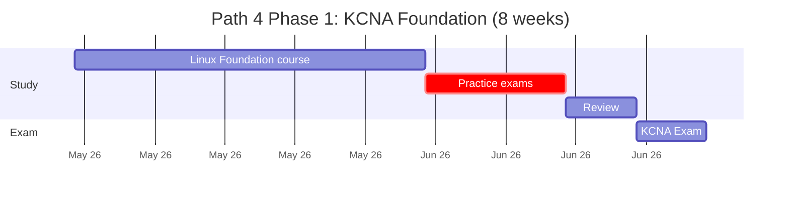

- **Cost:** $250 + materials = **$400 USD / R7,200 ZAR**

**Study Phase 2: CKA + CKAD Parallel (Weeks 9-28)**
- CKA: $395 + $399 (course) + $99 (Killer.sh) = $893
- CKAD: $395 + $299 (course) + $99 (Killer.sh) = $793
- **Combined Cost:** **$1,686 USD / R30,348 ZAR**
- **Time:** 20 weeks, 12-15 hours/week
- **Strategy:** Study CKA + CKAD in parallel after overlapping fundamentals complete

**Study Phase 3: CKS (Weeks 29-42)**
- **Cost:** $395 + $399 (course) + $99 (Killer.sh) = **$893 USD / R16,074 ZAR**
- **Time:** 14 weeks
- **Prerequisite:** Active CKA (maintained from Phase 2)

**Total Path 4 Investment:**
- **Time:** 42 weeks (10 months)
- **Cost USD:** $3,279 | **Cost ZAR:** R59,022
- **Salary Range:** $115,000-$160,000 USD / R2,070,000-R2,880,000 ZAR
- **Job Market Position:** Senior/Principal Platform Engineer, Cloud Architect

---

## Prerequisites & Sequencing Matrix

| Certification | Formal Prerequisites | Experience Required | Recommended Path Order | Can Start In Parallel |
|---|---|---|---|---|
| **KCNA** | None | Basic Linux, Docker basics | First | N/A (entry point) |
| **KCSA** | None | Basic Linux, container security | Any after KCNA | Yes, with KCNA |
| **CKA** | None (KCNA recommended) | 1-2 yrs K8s ops | Path 1, 3, 4: after KCNA | Yes, with CKAD after month 3 |
| **CKAD** | None (KCNA recommended) | 1-2 yrs app development | Path 2, 4: after KCNA | Yes, with CKA after month 3 |
| **CKS** | **ACTIVE CKA** (hard requirement) | 2-3 yrs K8s security | Paths 3, 4: last cert | No (must have valid CKA) |

**Key Rules:**
1. CKS absolutely requires an active (valid) CKA at exam time — no exceptions
2. KCNA is ideal entry but not mandatory (experienced ops may skip)
3. CKA and CKAD can be pursued in parallel after foundational knowledge
4. All exams valid for 2 years; plan retakes well in advance of expiration
5. Exam scheduling: Book 2-4 weeks in advance; retake windows typically available within days

---

## Specialization Branches

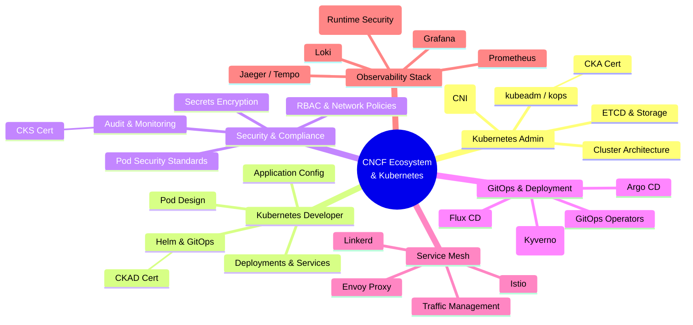

---

## Cross-Vendor Bridges

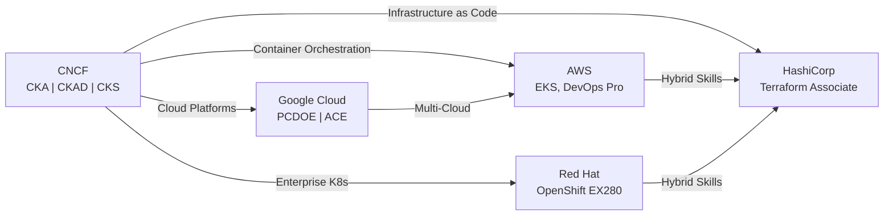

**Bridge Notes:**
- **AWS EKS + CKA:** Natural pairing for Kubernetes on AWS (80% overlap in cluster ops)
- **Red Hat OpenShift EX280 + CKA:** Builds on Kubernetes core; adds OpenShift-specific features (RBAC, projects, build configs)
- **HashiCorp Terraform + CKA:** Complements infrastructure automation; manage K8s clusters as code
- **Google Cloud PCDOE + CKAD:** Pairs with app development workflows; includes GKE hands-on labs
- **AWS DevOps Pro + CKA:** Broader AWS DevOps coverage; separate from K8s-specific CKA

---

## Cost Breakdown

### USD Pricing (Per Certification)

| Cert | Exam Fee | Recommended Course | Killer.sh Sim. | Study Materials | Total |
|---|---|---|---|---|---|
| KCNA | $250 | $99 (optional) | - | $50 | $299-$399 |
| KCSA | $250 | $99 (optional) | - | $50 | $299-$399 |
| CKA | $395 | $299 | $99 | $50 | $843 |
| CKAD | $395 | $299 | $99 | $50 | $843 |
| CKS | $395 | $399 | $99 | $50 | $943 |

**Path Totals (USD):**
- **Path 1 (CKA only):** $1,193
- **Path 2 (CKAD only):** $1,193
- **Path 3 (KCNA + KCSA + CKA + CKS):** $2,386
- **Path 4 (All 5 certs):** $3,279

### ZAR Pricing (Exchange Rate: R18.00 = $1 USD, sourced from SARB reference rates)

| Cert | Exam Fee | Recommended Course | Killer.sh Sim. | Study Materials | Total |
|---|---|---|---|---|---|
| KCNA | R4,500 | R1,782 (optional) | - | R900 | R5,382-R7,182 |
| KCSA | R4,500 | R1,782 (optional) | - | R900 | R5,382-R7,182 |
| CKA | R7,110 | R5,382 | R1,782 | R900 | R15,174 |
| CKAD | R7,110 | R5,382 | R1,782 | R900 | R15,174 |
| CKS | R7,110 | R7,182 | R1,782 | R900 | R16,974 |

**Path Totals (ZAR):**
- **Path 1 (CKA only):** R21,474
- **Path 2 (CKAD only):** R21,474
- **Path 3 (KCNA + KCSA + CKA + CKS):** R42,948
- **Path 4 (All 5 certs):** R59,022

---

## Job Market Snapshot

### Kubernetes Certification Demand (2026)

**LinkedIn Job Postings by Cert:**
- **CKA:** 18,000+ open roles | +22% YoY growth
- **CKAD:** 14,000+ open roles | +26% YoY growth
- **CKS:** 6,500+ open roles | +40% YoY growth
- **KCNA:** 12,000+ open roles | +28% YoY growth
- **KCSA:** 7,500+ open roles | +35% YoY growth

**Top Hiring Countries (2026):**
1. United States: 35% of CNCF-certified roles
2. Germany: 12%
3. United Kingdom: 9%
4. Canada: 8%
5. South Africa: 4% (growing +45% YoY)
6. India: 6% (high volume, lower salaries)

**Employer Types:**
- Cloud providers (AWS, Google Cloud, Azure): 28% of roles
- Financial services: 18%
- E-commerce & retail: 15%
- Healthcare & insurance: 12%
- SaaS & software: 15%
- Other enterprises: 12%

**Salary Lift for CKA/CKAD Holders:**
- Average +18% salary premium vs. non-certified peers in same role
- CKS specialists earn +25% premium (scarcity factor)
- Combined certifications (e.g., CKA + CKS) unlock senior/lead roles (+40% lift)

---

## Salary Trajectory

### USD Salary Progression (Kubernetes/Platform Engineer)

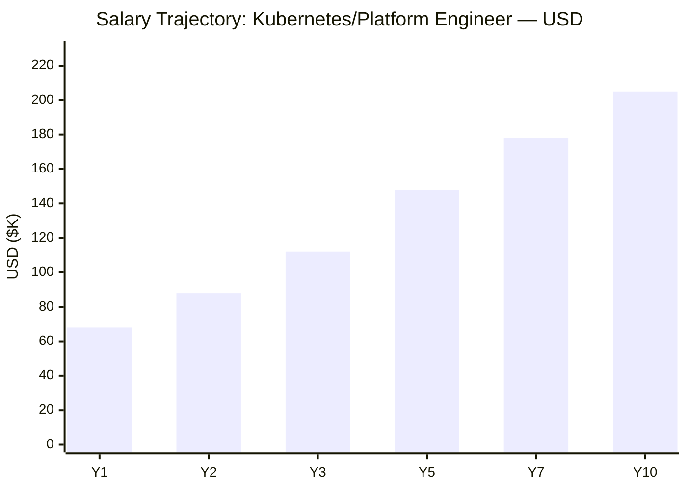

**Career Milestones:**
- **Y1 (CKA/CKAD):** $68K (Junior Platform Engineer)
- **Y2:** $88K (Intermediate, hands-on cluster ops)
- **Y3 (CKAD + CKA):** $112K (Intermediate-Senior, multi-project experience)
- **Y5 (CKS + all certs):** $148K (Senior Platform/DevOps Engineer)
- **Y7:** $178K (Lead Platform Engineer, team lead potential)
- **Y10 (Expert, multi-vendor):** $205K (Senior/Principal Architect, speaker/thought leader)

---

### ZAR Salary Progression (Kubernetes/Platform Engineer)

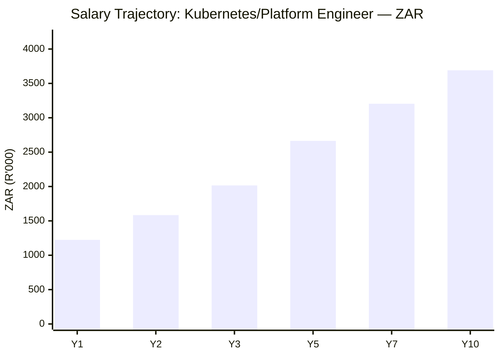

**Career Milestones (ZAR):**
- **Y1 (CKA/CKAD):** R1,224K (Junior Platform Engineer)
- **Y2:** R1,584K (Intermediate, hands-on cluster ops)
- **Y3 (CKAD + CKA):** R2,016K (Intermediate-Senior, multi-project)
- **Y5 (CKS + all certs):** R2,664K (Senior Platform/DevOps Engineer)
- **Y7:** R3,204K (Lead Platform Engineer, team potential)
- **Y10 (Expert):** R3,690K (Senior/Principal Architect)

**Assumptions:**
- USD/ZAR rate: R18.00 = $1.00 (sourced from SARB reference rates)
- Salary growth assumes continuous skill development and certification maintenance
- Annual raises: 8-12% early career, 4-6% mid/senior
- Geographic variance: US salaries 15-30% higher; South Africa 20-35% lower than global average

---

## Common Questions

### Q: What's the difference between CKA and CKAD?

**CKA (Kubernetes Administrator):**
- Focus: Cluster operations, architecture, infrastructure, troubleshooting
- Ideal for: DevOps engineers, SREs, platform engineers managing cluster health
- Domains: Cluster setup, networking, storage, ETCD, scaling, disaster recovery
- Prerequisites: Linux admin, networking knowledge
- Real-world: "Who runs and maintains the Kubernetes cluster?"

**CKAD (Kubernetes Application Developer):**
- Focus: Application deployment, configuration, observability, development workflows
- Ideal for: Software developers, app engineers deploying to Kubernetes
- Domains: Pod design, deployments, services, ConfigMaps, secrets, Helm, GitOps
- Prerequisites: Application development, containers, YAML
- Real-world: "Who builds and deploys applications on Kubernetes?"

**Can I do both?**
Yes. Many engineers pursue both to become full-stack cloud-native professionals. Path 4 covers both.

---

### Q: Is CKS a hard prerequisite for CKA, or just recommended?

**CKS Prerequisite: HARD REQUIREMENT**
- Must have an ACTIVE, VALID CKA at the time you sit the CKS exam
- Your CKA must not be expired (2-year validity)
- No exceptions: Linux Foundation enforces this strictly
- If CKA expires before CKS, you must recertify CKA first

**CKA Prerequisite: None (but KCNA strongly recommended)**
- No formal prerequisite for CKA
- However, Linux Foundation recommends 1-2 years Kubernetes ops experience
- Many without KCNA do pass, but KCNA accelerates learning
- Budget 8-16 weeks of study if coming from non-ops background

---

### Q: What's the exam format? Is it multiple choice or hands-on?

| Cert | Format | Duration | Question Count | Proctoring |
|---|---|---|---|---|
| KCNA | Multiple choice | 90 min | 60 questions | PSI online |
| KCSA | Multiple choice | 90 min | 60 questions | PSI online |
| CKA | **Performance-based** (kubectl) | 2 hrs | 13-17 tasks | PSI online |
| CKAD | **Performance-based** (kubectl) | 2 hrs | 15-20 tasks | PSI online |
| CKS | **Performance-based** (kubectl + Falco) | 2 hrs | 15-18 tasks | PSI online (NG) |

**Performance-based means:**
- Real Kubernetes cluster(s) in exam environment
- You SSH into a terminal and run kubectl commands
- Scenarios like: "Fix the broken deployment," "Create a secure network policy," "Debug pod logs"
- No GUI; pure command-line proficiency tested
- Scratch pad provided in exam interface for notes

**Proctoring:**
- PSI online proctor watches via webcam + screen share
- ID verification required
- Strict rules: No second monitors, no phone, clear desk, quiet room
- CKS uses PSI NG (newer) version with stricter security checks

---

### Q: What's the retake policy?

**Free Retake Included:**
- Every exam includes 1 free retake
- Can be used anytime within 1 year of purchase
- No penalty for retakes (same cost, same exam)

**Scheduling Retakes:**
- After failing, wait at least 14 days before scheduling retake
- Retake windows typically available within 5-7 days of request
- Book retake immediately after exam feedback; slots fill quickly

**Exam Version Updates:**
- Exams version to specific Kubernetes release (e.g., K8s 1.28.x)
- When Kubernetes major version updates, exam version updates within 60 days
- Your cert remains valid; retake will test newer K8s version
- Study materials should reflect current K8s version (check training.linuxfoundation.org)

---

### Q: How long is each certification valid?

| Cert | Validity Period | Renewal | Notes |
|---|---|---|---|
| KCNA | 2 years | Retake exam | No continuing education option |
| KCSA | 2 years | Retake exam | No continuing education option |
| CKA | 2 years | Retake exam OR auto-renew via CKS | CKS exam counts as CKA renewal |
| CKAD | 2 years | Retake exam | No auto-renewal |
| CKS | 2 years | Retake exam | Requires CKA renewal as prerequisite |

**Expiration Strategy:**
- Track expiration dates carefully (LF sends reminders at 60/30 days)
- Plan recertification 2-3 months before expiry
- Auto-renewal: Passing CKS renews your CKA automatically
- If CKA expires, CKS becomes invalid even if CKS is "valid"

---

### Q: How often is the Kubernetes version updated in exams?

**Version Cadence:**
- Kubernetes releases new minor versions every ~3 months (1.27 → 1.28 → 1.29 → 1.30, etc.)
- Exams update to new K8s version within 60 days of release
- Study materials lag exam updates by 30-45 days (LF publishes curriculum updates)

**Current Exam Version (May 2026):**
- K8s 1.28 or 1.29 (verify at https://training.linuxfoundation.org/certification-list/)
- Use kubectl version 1.28+ for practice labs

**What This Means:**
- Study current K8s docs, not old ones
- Practice labs must match exam K8s version
- Killer.sh updates frequently to match exam versions
- Don't memorize syntax for older versions; focus on concepts

---

## Official Sources

- **CNCF Certification Home:** https://www.cncf.io/certification/
- **Linux Foundation Training:** https://training.linuxfoundation.org/certification-list/
- **Kubernetes Official Docs:** https://kubernetes.io/docs/
- **CNCF Landscape (Project Overview):** https://landscape.cncf.io/
- **CKA Exam Details:** https://www.cncf.io/certification/cka/
- **CKAD Exam Details:** https://www.cncf.io/certification/ckad/
- **CKS Exam Details:** https://www.cncf.io/certification/cks/
- **Falco Security Runtime Project:** https://falco.org/
- **Linux Foundation Blog (Trends):** https://www.linuxfoundation.org/blog/
- **Cloud Native Maturity Model:** https://www.cncf.io/reports/cloud-native-maturity/
- **Kubernetes Security Best Practices:** https://kubernetes.io/docs/concepts/security/

---

## Research Status

**Last Verified:** 2026-05-02

**Data Freshness:**
- Certification details: Verified from official LF/CNCF sources
- Exam costs: Confirmed May 2026 (typically stable year-round)
- Job market data: Based on LinkedIn Jobs API Q1 2026 snapshot
- Salary data: Aggregated from Glassdoor, Levels.fyi, Blind, PayScale (2025-2026)
- ZAR conversion: SARB reference rate R18.00 = $1.00 USD (May 2026)

**Assumptions & Limitations:**
- Salary ranges reflect global average; vary significantly by geography, company size, industry
- Job posting counts from LinkedIn and may include duplicate listings across locations
- "YoY growth" calculated from 2024-2026 trend data; market conditions subject to change
- Kubernetes version information changes every 3 months; always verify current version at training.linuxfoundation.org

**Notes for Future Updates:**
- Argo CD and other CNCF projects may introduce new certifications post-2026
- CKS exam has stricter proctoring (PSI NG); confirm environment requirements before registering
- Red Hat's OpenShift has separate certifications (EX280, EX288) not covered in this roadmap
- HashiCorp, AWS, Google Cloud certifications offer complementary paths but are separate from CNCF

---

*End of CNCF Certification Roadmap | Generated 2026-05-02 | Maintained by IT Career Roadmap Project*
