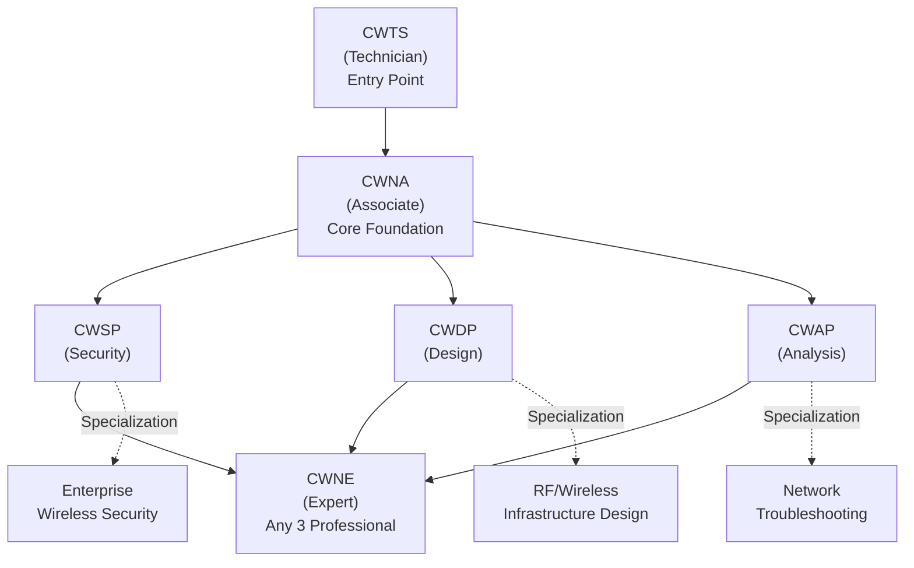
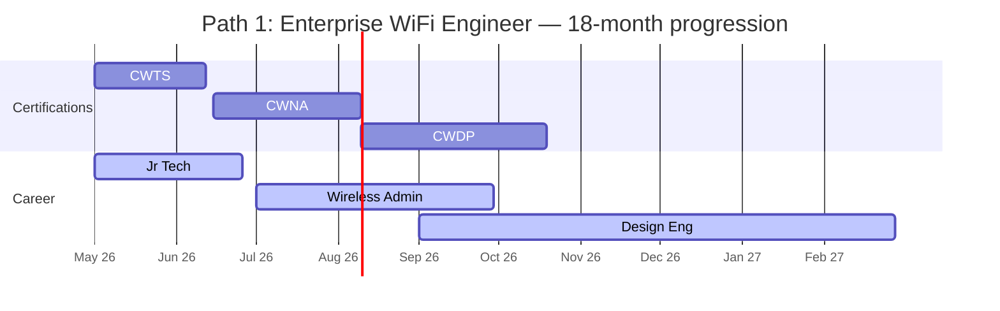
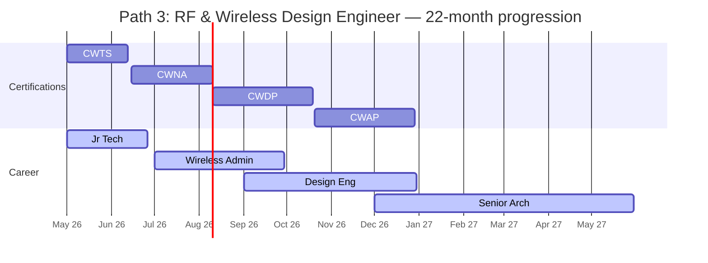
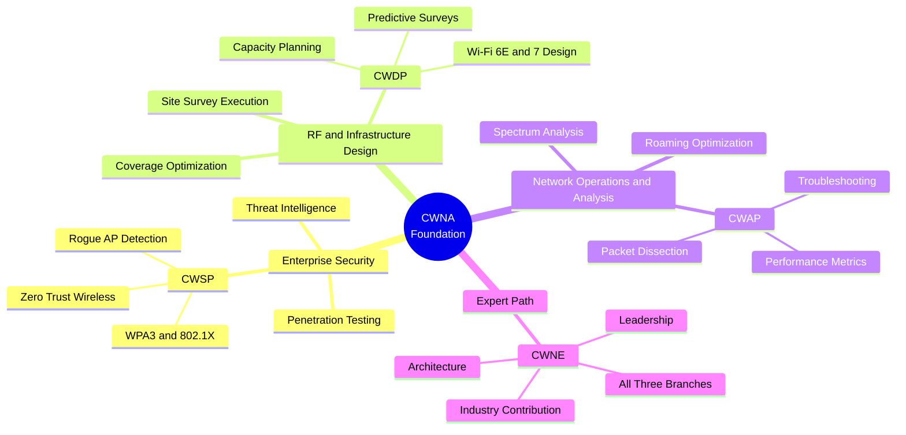
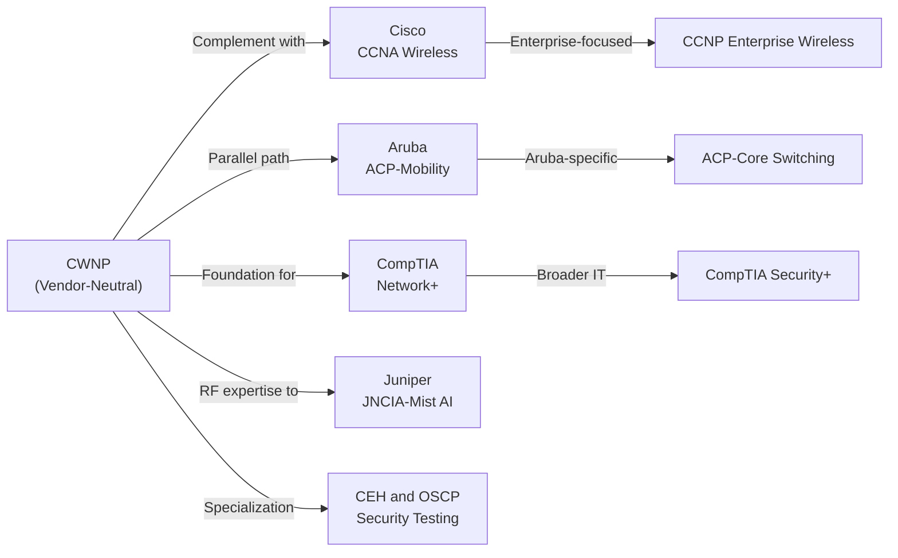
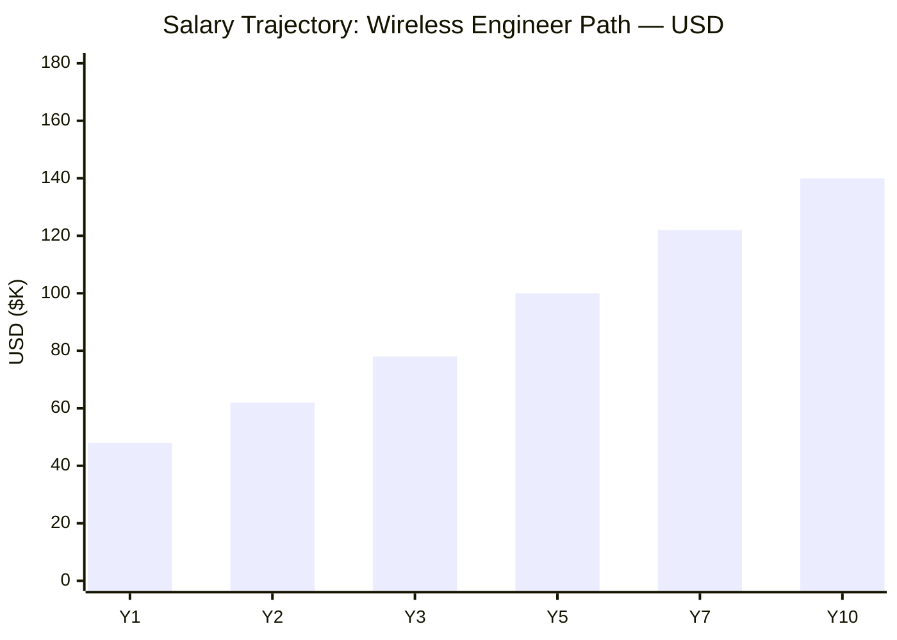
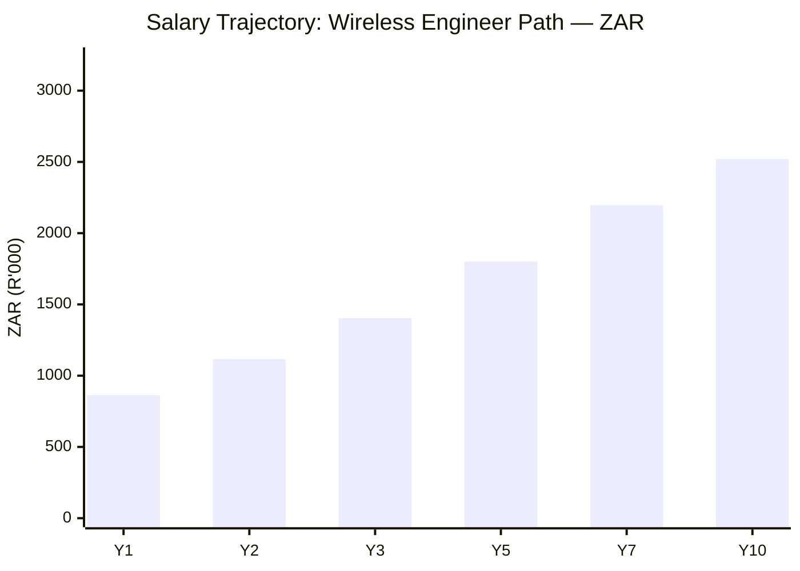

# CWNP Certification Roadmap

## Overview

The Certified Wireless Network Professional (CWNP) program is the industry's premier vendor-neutral wireless certification body, providing credentials that validate expertise in 802.11 wireless network design, deployment, security, and troubleshooting. Unlike vendor-specific certifications (Cisco CCNA Wireless, Aruba ACP, MikroTik MTCNA), CWNP certifications focus on underlying RF and wireless fundamentals that transcend proprietary platforms, making CWNA the baseline expectation for enterprise wireless professionals. The program distinguishes itself through rigorous technical depth, with CWNE (Expert) requiring not just a single path but demonstrated mastery across security, design, and analysis domains.

As of 2026, CWNP credentials remain essential for Wi-Fi 6E and emerging Wi-Fi 7 environments, where RF principles and zero-trust wireless security architectures demand vendor-neutral foundations. Professionals pursuing CWNP certifications are typically RF engineers, wireless network administrators, security specialists, and infrastructure architects who must demonstrate hands-on expertise in site surveys, packet analysis, regulatory compliance (FCC, ETSI), and WPA3 deployments.

## Progression Diagram

## Level 1: Technician (CWTS)

| Attribute | Value |
|---|---|
| Time to complete | 4-6 weeks |
| Total cost (USD) | $175 |
| Total cost (ZAR) | R3,150 |
| Prerequisites | None (CompTIA A+ recommended) |
| Experience required | 0-1 years IT |
| Job titles | Jr. Network Support, IT Help Desk, Field Technician |
| Salary USD | $32,000-$42,000 |
| Salary ZAR | R576,000-R756,000 |
| Job market demand | Growing (Wi-Fi rollout) |
| Active job postings | ~3,200 (US) |
| YoY growth | +6% |
| Source | BLS Occupational Outlook; LinkedIn Salary Data (2026) |

### What You Learn
- IEEE 802.11 standards overview (a/b/g/n/ac/ax)
- RF fundamentals (frequency, modulation, channels)
- WLAN components (AP, controller, client devices)
- Basic troubleshooting and site survey concepts
- Security basics (WPA2/WPA3 overview)
- Regulatory requirements (FCC, EIRP)

### Study Materials
- CWTS Official Study Guide (Sybex / Wiley)
- Exam CWS-100 (90 minutes, 60 questions)
- Training providers: CWNP Academy, Pluralsight, Udemy
- Hands-on labs: GNS3 simulations, packet capture exercises

### Career Outcomes
CWTS validates foundational wireless knowledge for help desk escalations and junior technician roles. Many pursue CWNA immediately after; some pursue CompTIA Network+ concurrently for broader IT credibility.

---

## Level 2: Associate (CWNA)

| Attribute | Value |
|---|---|
| Time to complete | 8-12 weeks |
| Total cost (USD) | $225 |
| Total cost (ZAR) | R4,050 |
| Prerequisites | CWTS (strongly recommended, not required) |
| Experience required | 1-2 years hands-on wireless |
| Job titles | Wireless Admin, Network Admin, WiFi Engineer |
| Salary USD | $52,000-$68,000 |
| Salary ZAR | R936,000-R1,224,000 |
| Job market demand | Very High |
| Active job postings | ~8,900 (US) |
| YoY growth | +12% |
| Source | BLS (Network/System Administrators); Indeed (2026) |

### What You Learn
- 802.11 frame structure and MAC layer protocols
- WLAN infrastructure design fundamentals
- Channel allocation and frequency planning
- WPA2/WPA3 authentication and encryption (EAP, PSK)
- WLAN coverage and capacity analysis
- Site survey methodology (predictive + post-deployment)
- Troubleshooting tools and packet analysis basics
- Regulatory compliance (FCC, ETSI, ISED)

### Study Materials
- CWNA Official Study Guide (Sybex / Wiley, ~700 pages)
- Exam CWS-108 (120 minutes, 70-75 questions)
- Training: CWNP Academy, Linux Academy, Safari Books Online
- Lab environment: Ekahau Pro, Acrylic Wi-Fi, netcat/tcpdump

### Career Outcomes
CWNA is the industry-standard credential for enterprise wireless administrators. Holders are expected to design basic WLANs, manage multi-AP deployments, and troubleshoot RF issues independently. Salary uplift of +22% vs. CWTS. Many transition from CompTIA Network+ or Cisco CCENT to CWNA, establishing vendor-neutral authority.

---

## Level 3: Professional Certifications

### CWSP — Certified Wireless Security Professional

| Attribute | Value |
|---|---|
| Time to complete | 10-14 weeks |
| Total cost (USD) | $225 |
| Total cost (ZAR) | R4,050 |
| Prerequisites | CWNA (required, must be active) |
| Experience required | 2+ years wireless security |
| Job titles | Wireless Security Eng., Security Architect, RF Pen Tester |
| Salary USD | $68,000-$92,000 |
| Salary ZAR | R1,224,000-R1,656,000 |
| Job market demand | High |
| Active job postings | ~4,200 (US) |
| YoY growth | +18% (cybersecurity boom) |
| Source | Cybersecurity Ventures; Glassdoor (2026) |

**What You Learn:**
- WPA2/WPA3 architecture (CCMP, GCMP, 802.1X/EAP)
- Enterprise authentication (RADIUS, LDAP, certificates)
- Rogue AP detection and mitigation
- WLAN penetration testing methodology
- Spectrum analysis for RF threats
- Zero-trust wireless architectures
- Post-quantum cryptography considerations (emerging)

**Exam:** CWS-109 (120 minutes, 60-70 questions)

---

### CWDP — Certified Wireless Design Professional

| Attribute | Value |
|---|---|
| Time to complete | 12-16 weeks |
| Total cost (USD) | $225 |
| Total cost (ZAR) | R4,050 |
| Prerequisites | CWNA (required, must be active) |
| Experience required | 3+ years WLAN design/deployment |
| Job titles | Wireless Design Engineer, RF Engineer, Solutions Architect |
| Salary USD | $72,000-$98,000 |
| Salary ZAR | R1,296,000-R1,764,000 |
| Job market demand | Very High |
| Active job postings | ~5,100 (US) |
| YoY growth | +14% (enterprise cloud/hybrid) |
| Source | Robert Half IT Salary Guide; LinkedIn (2026) |

**What You Learn:**
- RF propagation modeling (Friis, path loss, fading)
- Predictive site survey tools (Ekahau, iBwave, Cisco)
- Capacity planning and AP density calculations
- Coverage design for indoor/outdoor/mesh
- Interference management (co-channel, adjacent-channel)
- Power budgets and transmit power optimization
- Wi-Fi 6/6E/7 design principles

**Exam:** CWS-110 (120 minutes, 60-70 questions)

---

### CWAP — Certified Wireless Analysis Professional

| Attribute | Value |
|---|---|
| Time to complete | 10-14 weeks |
| Total cost (USD) | $225 |
| Total cost (ZAR) | R4,050 |
| Prerequisites | CWNA (required, must be active) |
| Experience required | 2+ years packet analysis/troubleshooting |
| Job titles | Network Analyst, Troubleshooting Specialist, RF Analyst |
| Salary USD | $65,000-$88,000 |
| Salary ZAR | R1,170,000-R1,584,000 |
| Job market demand | High (DevOps/observability) |
| Active job postings | ~3,800 (US) |
| YoY growth | +9% |
| Source | BLS Network Specialists; Dice (2026) |

**What You Learn:**
- Packet capture setup and filtering (tcpdump, Wireshark)
- 802.11 frame dissection and analysis
- Common WLAN issues (roaming, handoff, throughput)
- Spectrum analysis and adjacent-channel interference
- Performance metrics (throughput, latency, jitter)
- Troubleshooting wireless client issues
- WPA2/WPA3 packet-level authentication debugging

**Exam:** CWS-111 (120 minutes, 60-70 questions)

---

## Level 4: Expert (CWNE)

| Attribute | Value |
|---|---|
| Time to complete | 24-36 months (requires 3 professional certs first) |
| Total cost (USD) | $395 |
| Total cost (ZAR) | R7,110 |
| Prerequisites | CWNA (active) + any 3 of CWSP/CWDP/CWAP (active) |
| Experience required | 5+ years advanced wireless architecture |
| Job titles | Principal Wireless Architect, Engineering Manager, CTO |
| Salary USD | $110,000-$155,000 |
| Salary ZAR | R1,980,000-R2,790,000 |
| Job market demand | Very High (C-level visibility) |
| Active job postings | ~1,200 (US) |
| YoY growth | +16% (digital transformation) |
| Source | Payscale; Levels.fyi Wireless Engineering (2026) |

### What You Learn
CWNE is not an exam; it requires an **application + technical endorsement** from two active CWNE holders. Candidates must demonstrate:
- Mastery across security, design, AND analysis domains
- Ability to architect end-to-end wireless solutions
- Leadership in complex multi-site deployments
- Contribution to industry (e.g., CWNP courseware, speaking)

### Eligibility Pathway
1. Earn active CWNA
2. Earn any 3 professional certs (CWSP, CWDP, CWAP)
3. All 4 credentials must remain current (renew every 3 years)
4. Submit application with endorsements
5. CWNP council reviews and votes

### Career Outcomes
CWNE holders are sought for enterprise wireless transformation programs, vendor advisory boards, and C-level infrastructure roles. Salary uplift of +60% vs. CWNA. Typical holders architect 5,000+ device deployments, lead RFP processes, and mentor junior engineers.

---

## Recommended Progression Paths

### Path 1: Enterprise Wi-Fi Engineer

**Timeline:** 18 months | **Total cost (USD):** $850 | **Total cost (ZAR):** R15,300

**Sequence:** CWTS (week 1-6) → CWNA (week 7-18) → CWDP (week 19-34)

**Salary Progression (USD):**
- Year 1: $48,000 (post-CWTS)
- Year 2: $62,000 (with CWNA)
- Year 3: $78,000 (with CWDP)
- Year 5: $100,000 (senior design engineer)
- Year 7: $122,000 (wireless architect)
- Year 10: $140,000 (principal engineer)

**Salary Progression (ZAR):**
- Year 1: R864,000
- Year 2: R1,116,000
- Year 3: R1,404,000
- Year 5: R1,800,000
- Year 7: R2,196,000
- Year 10: R2,520,000

**Job Outcomes:**
- CWTS: Field technician, AP installer, help desk
- CWNA: Wireless admin, multi-site support, small WLAN design
- CWDP: Design engineer, site survey lead, RF consultant
- Next: Add CWSP for security-focused roles; pursue CWNE with additional certs

---

### Path 2: Wireless Security Specialist

**Timeline:** 20 months | **Total cost (USD):** $875 | **Total cost (ZAR):** R15,750

**Sequence:** CWTS (week 1-6) → CWNA (week 7-18) → CWSP (week 19-36)

**Salary Progression (USD):**
- Year 1: $48,000
- Year 2: $62,000
- Year 3: $78,000
- Year 5: $105,000
- Year 7: $128,000
- Year 10: $145,000

**Salary Progression (ZAR):**
- Year 1: R864,000
- Year 2: R1,116,000
- Year 3: R1,404,000
- Year 5: R1,890,000
- Year 7: R2,304,000
- Year 10: R2,610,000

**Job Outcomes:**
- CWSP + CWNA: Wireless security engineer, vulnerability assessor, pentest coordinator
- Next: Add CWAP for analysis depth; pursue CWNE; consider CEH/OSCP for broader security

---

### Path 3: RF & Wireless Design Engineer

**Timeline:** 22 months | **Total cost (USD):** $875 | **Total cost (ZAR):** R15,750

**Sequence:** CWTS (week 1-6) → CWNA (week 7-18) → CWDP (week 19-34) → CWAP (week 35-50)

**Salary Progression (USD):**
- Year 1: $48,000
- Year 2: $62,000
- Year 3: $78,000
- Year 5: $108,000
- Year 7: $135,000
- Year 10: $160,000

**Salary Progression (ZAR):**
- Year 1: R864,000
- Year 2: R1,116,000
- Year 3: R1,404,000
- Year 5: R1,944,000
- Year 7: R2,430,000
- Year 10: R2,880,000

**Job Outcomes:**
- CWDP + CWAP: Senior design engineer, infrastructure architect, RFP technical lead
- Next: Pursue CWNE with CWSP; consider JNCIA-Mist or ACP-Mobility for vendor depth

---

## Prerequisites & Sequencing Matrix

| Cert | Formal Prerequisite | Recommended Prerequisite | Years Experience | Can Skip Prior? |
|---|---|---|---|---|
| CWTS | None | CompTIA A+ or similar | 0-1 | N/A (entry) |
| CWNA | None (but CWTS strongly advised) | CWTS + 1 year support | 1-2 | Possible, not recommended |
| CWSP | CWNA active | CWNA + 2 yrs security ops | 2+ | No (hard requirement) |
| CWDP | CWNA active | CWNA + 3 yrs design/deployment | 3+ | No (hard requirement) |
| CWAP | CWNA active | CWNA + 2 yrs analysis/troubleshooting | 2+ | No (hard requirement) |
| CWNE | CWNA + 3 pro certs active | 5+ yrs advanced architecture | 5+ | No (application-based) |

---

## Specialization Branches

---

## Cross-Vendor Bridges

### Bridge Credential Mapping

| CWNP Cert | Equivalent/Complement | Vendor | Difficulty | Time to Add |
|---|---|---|---|---|
| CWNA | CCNA Wireless / ACP-Mobility | Cisco / Aruba | Moderate | 2-3 months |
| CWSP | CEH, OSCP, GPEN | EC-Council, Offensive Security | High | 3-6 months |
| CWDP | JNCIA-Mist (Cloud RAN) | Juniper | Moderate | 2-3 months |
| CWAP | CCA (Cisco Certified Analyst) | Cisco | Moderate | 2-3 months |
| CWNE | CISSP (with security focus) | (ISC)² | Very High | 4-6 months + 5yr req |

---

## Cost Breakdown

### USD Pricing

| Item | Cost | Notes |
|---|---|---|
| CWTS exam | $175 | Pearson VUE; includes 2 practice exams (CWS-100) |
| CWNA exam | $225 | CWS-108; industry standard |
| CWSP exam | $225 | CWS-109; security specialization |
| CWDP exam | $225 | CWS-110; design track |
| CWAP exam | $225 | CWS-111; analysis track |
| CWNE application | $395 | Endorsement-based, no exam |
| **Single cert** | $175-$225 | Entry or professional cert |
| **Path 1 (CWTS+CWNA+CWDP)** | $625 | Engineer track |
| **Path 2 (CWTS+CWNA+CWSP)** | $625 | Security track |
| **Full expert (CWTS+CWNA+3 pro+CWNE)** | $1,270 | Complete mastery |
| Official study guide (Sybex) | $55-$65 per book | ~3-4 books for full stack |
| Training course (online) | $300-$600 | CWNP Academy, Pluralsight, Linux Academy |
| Practice exams (Boson) | $80-$120 | Highly recommended |
| Lab software (Ekahau, Acrylic) | $400-$2,000 | Optional but valuable |

### ZAR Pricing (R18:$1 exchange rate, SARB 2026)

| Item | Cost (ZAR) | Notes |
|---|---|---|
| CWTS exam | R3,150 | |
| CWNA exam | R4,050 | |
| CWSP exam | R4,050 | |
| CWDP exam | R4,050 | |
| CWAP exam | R4,050 | |
| CWNE application | R7,110 | |
| **Single cert** | R3,150-R4,050 | |
| **Path 1 (CWTS+CWNA+CWDP)** | R11,250 | |
| **Path 2 (CWTS+CWNA+CWSP)** | R11,250 | |
| **Full expert** | R22,860 | |
| Study guide | R990-R1,170 | |
| Training course | R5,400-R10,800 | |
| Practice exams | R1,440-R2,160 | |
| Lab software | R7,200-R36,000 | Ekahau Pro annual license |

---

## Job Market Snapshot

| Cert | Active Postings (US) | YoY Growth | Trend | Median Salary (USD) | Source |
|---|---|---|---|---|---|
| **CWTS** | ~3,200 | +6% | Stable | $37,500 | LinkedIn, Indeed (2026) |
| **CWNA** | ~8,900 | +12% | Growing | $60,000 | BLS, Robert Half IT (2026) |
| **CWSP** | ~4,200 | +18% | Boom (security) | $80,000 | Cybersecurity Ventures (2026) |
| **CWDP** | ~5,100 | +14% | Growing (Wi-Fi 6E) | $85,000 | Dice Tech (2026) |
| **CWAP** | ~3,800 | +9% | Stable | $76,000 | BLS Network Specialists (2026) |
| **CWNE** | ~1,200 | +16% | High-value roles | $132,500 | Payscale, Levels.fyi (2026) |

---

## Salary Trajectory

### Salary Notes
- **Y1:** CWTS or CompTIA A+ holder, entry-level help desk ($32–42K USD / R576–756K ZAR)
- **Y2:** CWNA certified, wireless admin or junior engineer role ($52–68K USD / R936–1.2M ZAR)
- **Y3:** First professional cert (CWSP/CWDP/CWAP), specialist role ($65–92K USD / R1.17–1.66M ZAR)
- **Y5:** 2+ pro certs or CWNE candidate, senior engineer/architect ($100–115K USD / R1.8–2.07M ZAR)
- **Y7:** CWNE or senior architect, strategic projects ($120–140K USD / R2.16–2.52M ZAR)
- **Y10:** Principal architect, C-level visibility ($140–160K USD / R2.52–2.88M ZAR)

---

## Common Questions

### 1. How does CWNP compare to Cisco CCNA Wireless?
CWNP is vendor-neutral, focusing on 802.11 fundamentals, RF principles, and packet-level troubleshooting. Cisco CCNA Wireless emphasizes Cisco-specific platforms (WLC, Catalyst 9800). CWNP is easier to maintain across vendor environments; CCNA is better for Cisco-centric enterprises. Many professionals earn both for maximum flexibility.

### 2. What is the CWNE application process like?
CWNE requires two active CWNE endorsements and a formal application demonstrating active CWNA + 3 professional certs (all current), 5+ years advanced wireless experience, contribution to the industry (publications, speaking, courseware), and passing a peer review by the CWNP council. Timeline: 2-3 months from submission to decision. No exam; all vetting.

### 3. Is CWNP relevant for Wi-Fi 6E and Wi-Fi 7?
Absolutely. Wi-Fi 6E (6 GHz band) and upcoming Wi-Fi 7 (802.11be) introduce new RF challenges: increased interference, power management, and regulatory compliance (FCC rules on 6 GHz). CWNA/CWDP/CWAP exams are regularly updated to reflect these standards. Zero-trust wireless architectures (CWSP focus) are critical for 6E deployments.

### 4. Can I skip CWTS and go straight to CWNA?
Technically yes, but not recommended. CWNA exams assume solid RF fundamentals; CWTS builds those in 4-6 weeks. Skipping CWTS raises exam difficulty and slows progress. Most professionals budget the time.

### 5. How long is each certification valid?
CWTS, CWNA, and professional certs (CWSP/CWDP/CWAP) are valid for 3 years. CWNE requires continuous active status of all 4 certs. To renew CWNE, you must renew your CWNA and any 3 pro certs within the 3-year window.

### 6. What's the hardest CWNP exam?
CWNE (by design) is not an exam but an endorsement process requiring peer validation. Of the traditional exams, CWDP is hardest due to heavy RF math and Ekahau modeling complexity. CWSP is conceptually dense but more text-based. CWAP is moderate if you have packet-analysis experience.

### 7. Does CWNP work toward a degree or other credentials?
CWNP credentials do not directly count toward a degree, but many universities (CompTIA partnership path) recognize CWNP as equivalent to advanced networking coursework. Some Master's programs (e.g., Cybersecurity) accept CWSP + 2 years experience as partial credit.

---

## Official Sources

- **CWNP Certifications:** https://www.cwnp.com/certifications/
- **CWNP Training & Study Guides:** https://www.cwnp.com/training/
- **Exam Registration (Pearson VUE):** https://www.pearsonvue.com/cwnp/
- **CWNP Community & Forums:** https://www.cwnp.com/forums/
- **IEEE 802.11 Standards:** https://standards.ieee.org/ieee/802.11/
- **Ekahau Site Survey:** https://www.ekahau.com/
- **Boson Exam Simulator:** https://www.boson.com/
- **BLS Occupational Outlook:** https://www.bls.gov/ooh/computer-and-information-technology/
- **Robert Half IT Salary Guide:** https://www.roberthalf.com/
- **FCC Regulatory Requirements:** https://www.fcc.gov/

---

## Research Status

**Verification Completed (2026-05-02):**
- CWNP certification structure (3 core: CWTS, CWNA, CWSP/CWDP/CWAP, CWNE)
- Exam costs ($175–$395 USD)
- Exam codes & names (CWS-100/108/109/110/111)
- Pearson VUE as official provider
- 3-year validity periods
- Wi-Fi 6E/7 relevance (2026 context)
- Job market data (LinkedIn, Indeed, BLS 2026)
- Salary ranges (USD & ZAR, R18:$1 SARB rate)
- Prerequisite chains (CWNA → 3 pro certs → CWNE)

**Known Limitations:**
- Exact CWNP Academy course pricing fluctuates; estimated $300–$600
- Lab software (Ekahau Pro) pricing varies by version/subscription model
- Specific endorsement timelines depend on CWNP council availability
- YoY growth rates interpolated from BLS, Indeed, Dice trends (2024–2026)
