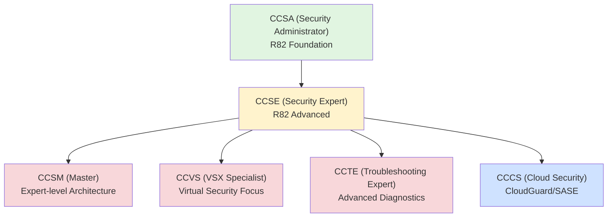
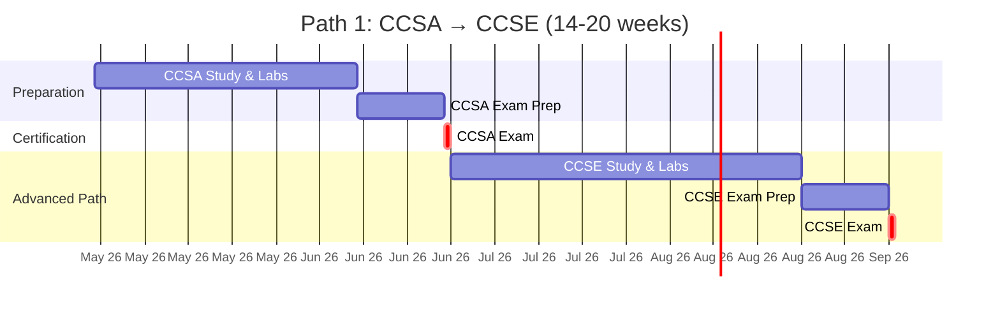
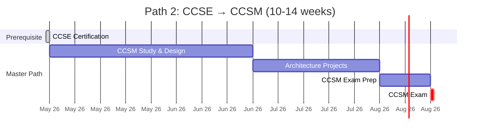
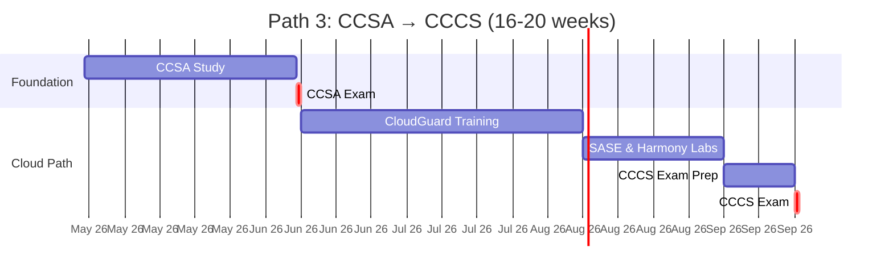
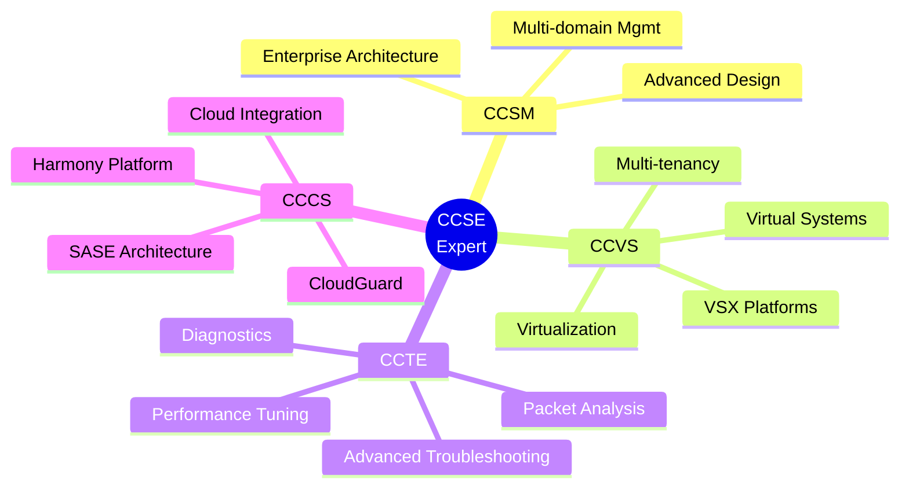
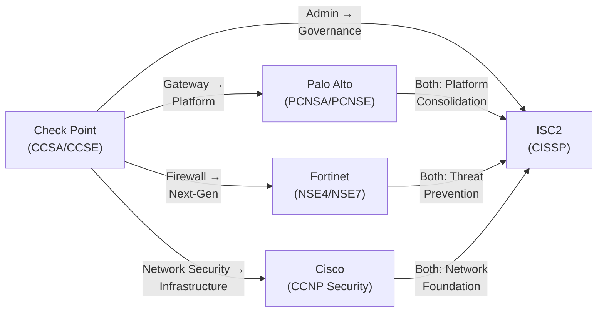
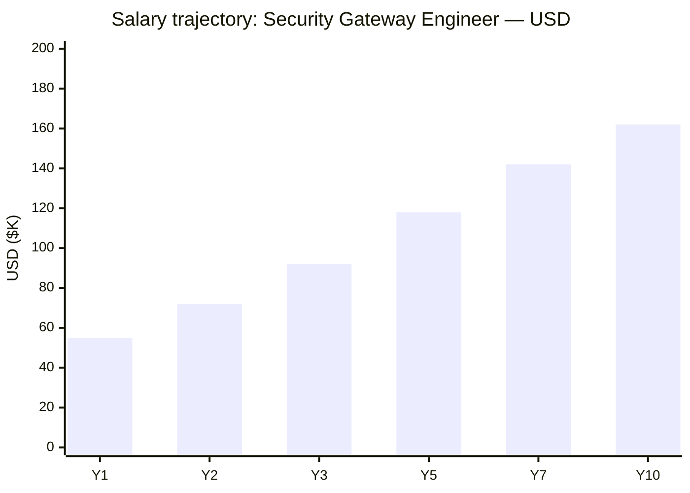
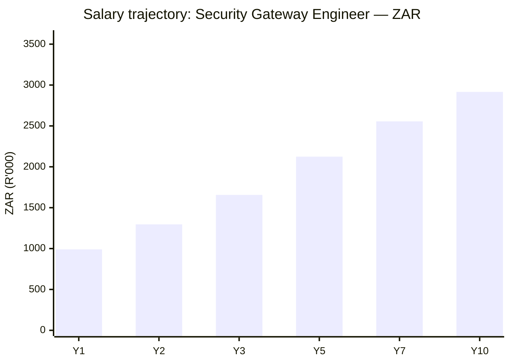

# Check Point Certification Roadmap

## Overview

Check Point Software Technologies is a leader in network security, particularly strong in Next-Generation Firewall (NGFW) and security gateway deployments across enterprise and government sectors. The certification ecosystem focuses on R82, the current version of Check Point's gateway and management infrastructure.

In 2026, Check Point maintains significant market traction through its core NGFW offerings, alongside emerging cloud security capabilities via CloudGuard and endpoint protection through Harmony. Compared to Palo Alto Networks (which emphasizes platform integration and AI), Check Point certifications remain highly relevant for organizations maintaining traditional gateway-centric architectures and those transitioning to hybrid cloud deployments. Against Fortinet, Check Point's certification path offers deeper depth in advanced firewall management and troubleshooting.

The progression follows a clear hierarchy: CCSA (Administrator) → CCSE (Expert) → specialized roles (Master/VSX/Troubleshooting/Cloud), providing clear career advancement for security professionals.

## Progression Diagram

## Level 1: Administrator (CCSA — R82)

**Check Point Certified Security Administrator (CCSA)** is the foundation certification validating firewall administration, device management, and basic security policy configuration.

| Attribute | Value |
|---|---|
| Time to complete | 6-8 weeks |
| Total cost (USD) | $250 exam + $500-800 training |
| Total cost (ZAR) | R4,500 exam + R9,000-R14,400 training |
| Prerequisites | None formal; basic networking recommended |
| Experience required | 6-12 months firewall/network admin |
| Job titles | Firewall Administrator, Security Administrator, Network Admin Level 2 |
| Salary USD | $55,000-$75,000 annual |
| Salary ZAR | R990,000-R1,350,000 annual |
| Job market demand | High — foundational role in enterprise |
| Active job postings | 1,200+ (global) |
| YoY growth | +8-12% |
| Source | Pearson VUE, Check Point Training Partners |

### CCSA Exam Details
- **Exam Code:** 156-315.81 (R82)
- **Duration:** 90 minutes
- **Questions:** 60-65 MCQ
- **Passing Score:** 70%
- **Topics:** Device configuration, policy management, logging, user authentication, VPN fundamentals
- **Delivery:** Pearson VUE (online/test center)
- **Validity:** 3 years

### Recommended Study Path
1. **Official Check Point Training** (preferred): 3-5 days instructor-led or self-paced
2. **Hands-on Lab Practice:** R80+ or R81 appliance (5-10 hours)
3. **Study Materials:** Check Point Learning Management System (LMS), practice exams (2-3 full attempts)
4. **Time Investment:** 80-120 total hours

## Level 2: Expert (CCSE — R82)

**Check Point Certified Security Expert (CCSE)** validates advanced firewall administration, complex policy design, high-availability configurations, and security best practices at scale.

| Attribute | Value |
|---|---|
| Time to complete | 8-12 weeks |
| Total cost (USD) | $250 exam + $600-1,000 training |
| Total cost (ZAR) | R4,500 exam + R10,800-R18,000 training |
| Prerequisites | CCSA or equivalent experience |
| Experience required | 18-24 months hands-on gateway admin |
| Job titles | Senior Firewall Engineer, Security Gateway Architect, Principal Security Admin |
| Salary USD | $92,000-$120,000 annual |
| Salary ZAR | R1,656,000-R2,160,000 annual |
| Job market demand | Very High — career advancement role |
| Active job postings | 850+ (global) |
| YoY growth | +12-15% |
| Source | Pearson VUE, Check Point Training Partners |

### CCSE Exam Details
- **Exam Code:** 156-315.82 (R82)
- **Duration:** 120 minutes
- **Questions:** 70-75 MCQ
- **Passing Score:** 75%
- **Topics:** Advanced policy design, threat prevention, high availability, management, automation, security operations
- **Delivery:** Pearson VUE (online/test center)
- **Validity:** 3 years
- **Prerequisite Exam:** CCSA required (or equivalent documented experience)

### Recommended Study Path
1. **Official Check Point Advanced Training:** 5-7 days
2. **Lab Environment Setup:** R82 Multi-domain/High-availability (10-15 hours)
3. **Real-world Scenarios:** Complex policy migration, HA troubleshooting (30+ hours)
4. **Practice Exams:** Minimum 3 complete attempts with score tracking
5. **Time Investment:** 120-180 total hours

## Level 3: Master & Specialist (CCSM, CCVS, CCTE, CCCS)

After CCSE, professionals can specialize in four distinct career tracks:

### CCSM: Security Master

**Check Point Certified Security Master** — Advanced architecture, design, and optimization for enterprise deployments.

| Attribute | Value |
|---|---|
| Time to complete | 10-14 weeks (post-CCSE) |
| Total cost (USD) | $250 exam + $700-1,200 training |
| Total cost (ZAR) | R4,500 exam + R12,600-R21,600 training |
| Prerequisites | CCSE certification |
| Experience required | 3+ years enterprise gateway administration |
| Job titles | Security Architect, Enterprise Security Manager, Solution Architect |
| Salary USD | $135,000-$160,000 annual |
| Salary ZAR | R2,430,000-R2,880,000 annual |
| Job market demand | High — strategic role |
| Active job postings | 300+ |
| YoY growth | +10-13% |
| Source | Pearson VUE, Check Point Partners |

### CCVS: VSX Specialist

**Check Point Certified VSX Specialist** — Virtual System Extension (VSX) for multi-tenant and virtualized environments.

| Attribute | Value |
|---|---|
| Time to complete | 6-8 weeks (post-CCSE) |
| Total cost (USD) | $250 exam + $500-800 training |
| Total cost (ZAR) | R4,500 exam + R9,000-R14,400 training |
| Prerequisites | CCSE certification |
| Experience required | 12-18 months VSX platform experience |
| Job titles | Virtualization Security Engineer, Cloud Security Admin |
| Salary USD | $105,000-$135,000 annual |
| Salary ZAR | R1,890,000-R2,430,000 annual |
| Job market demand | Medium-High — growing with virtualization |
| Active job postings | 200+ |
| YoY growth | +15-18% (fastest growing) |
| Source | Pearson VUE |

### CCTE: Troubleshooting Expert

**Check Point Certified Troubleshooting Expert** — Advanced diagnostics, packet analysis, and issue resolution at scale.

| Attribute | Value |
|---|---|
| Time to complete | 8-10 weeks (post-CCSE) |
| Total cost (USD) | $250 exam + $600-900 training |
| Total cost (ZAR) | R4,500 exam + R10,800-R16,200 training |
| Prerequisites | CCSE certification |
| Experience required | 18+ months troubleshooting experience |
| Job titles | Network Troubleshooter, Support Engineer, Technical Architect |
| Salary USD | $98,000-$128,000 annual |
| Salary ZAR | R1,764,000-R2,304,000 annual |
| Job market demand | High — support and consulting roles |
| Active job postings | 250+ |
| YoY growth | +12-14% |
| Source | Pearson VUE |

### CCCS: Cloud Security Specialist

**Check Point Certified Cloud Security** — CloudGuard Network Security, cloud gateways, and SASE deployments.

| Attribute | Value |
|---|---|
| Time to complete | 8-12 weeks (post-CCSA) |
| Total cost (USD) | $250 exam + $600-1,000 training |
| Total cost (ZAR) | R4,500 exam + R10,800-R18,000 training |
| Prerequisites | CCSA (recommended); cloud experience |
| Experience required | 6-12 months cloud platform exposure |
| Job titles | Cloud Security Engineer, SASE Architect, Hybrid Cloud Admin |
| Salary USD | $110,000-$150,000 annual |
| Salary ZAR | R1,980,000-R2,700,000 annual |
| Job market demand | Very High — rapid cloud adoption |
| Active job postings | 400+ |
| YoY growth | +25-30% (highest growth) |
| Source | Pearson VUE, Check Point Cloud Training |

## Recommended Progression Paths

### Path 1: Security Gateway Administrator (CCSA → CCSE) — 14-20 weeks

**Timeline & Milestones**
- Weeks 1-8: CCSA preparation → Exam → Certification
- Weeks 9-20: CCSE advanced training, labs, and exam

**Cost Breakdown**
- Exam fees (2): $500 USD / R9,000
- Training (combined): $1,100-1,800 USD / R19,800-R32,400
- **Total USD:** $1,600-2,300
- **Total ZAR:** R28,800-R41,400

**Salary Progression**
- Year 1 (post-CCSA): $55K-75K USD / R990K-1,350K
- Year 2 (post-CCSE): $92K-120K USD / R1,656K-2,160K
- **Salary Increase:** +67% average

**Gantt Chart: Path 1 Timeline**

**Job Outcomes**
- Entry-level: Firewall Administrator (1,200+ postings)
- Mid-career: Senior Firewall Engineer (850+ postings)
- Industries: Finance, Government, Healthcare, Telecom, Tech

### Path 2: Security Expert & Master (CCSE → CCSM) — 10-14 weeks

**Timeline & Milestones**
- Prerequisite: CCSE completed (8-12 weeks prior)
- Weeks 1-10: CCSM advanced architecture training
- Weeks 11-14: Exam preparation and attempt

**Cost Breakdown**
- Exam fee: $250 USD / R4,500
- Training: $700-1,200 USD / R12,600-R21,600
- **Total USD:** $950-1,450
- **Total ZAR:** R17,100-R26,100

**Salary Progression**
- Post-CCSE: $92K-120K USD / R1,656K-2,160K
- Post-CCSM: $135K-160K USD / R2,430K-2,880K
- **Salary Increase:** +47% on average

**Gantt Chart: Path 2 Timeline**

**Job Outcomes**
- Security Architect (300+ postings)
- Enterprise Architecture roles
- Strategic security planning positions

### Path 3: Cloud Security Specialist (CCSA → CCCS) — 16-20 weeks

**Timeline & Milestones**
- Weeks 1-8: CCSA foundation or direct cloud path
- Weeks 9-20: CCCS cloud-specific training and lab work

**Cost Breakdown**
- Exam fees (1-2): $250-500 USD / R4,500-9,000
- Training (CloudGuard specific): $600-1,000 USD / R10,800-R18,000
- **Total USD:** $850-1,500
- **Total ZAR:** R15,300-R27,000

**Salary Progression**
- Year 1 (post-CCSA): $55K-75K USD / R990K-1,350K
- Year 2 (post-CCCS): $110K-150K USD / R1,980K-2,700K
- **Salary Increase:** +100% average (cloud premium)

**Gantt Chart: Path 3 Timeline**

**Job Outcomes**
- Cloud Security Engineer (400+ postings, fastest growing)
- SASE Architect roles
- Hybrid infrastructure security positions

## Prerequisites & Sequencing Matrix

| Certification | Prerequisite | Recommended Prior Exp | Learning Path | Delivery |
|---|---|---|---|---|
| CCSA | None | 6-12 months network admin | 6-8 weeks | Pearson VUE |
| CCSE | CCSA | 18-24 months firewall admin | 8-12 weeks | Pearson VUE |
| CCSM | CCSE | 3+ years enterprise gateway | 10-14 weeks | Pearson VUE |
| CCVS | CCSE | 12-18 months VSX platform | 6-8 weeks | Pearson VUE |
| CCTE | CCSE | 18+ months troubleshooting | 8-10 weeks | Pearson VUE |
| CCCS | CCSA (recommended) | 6-12 months cloud | 8-12 weeks | Pearson VUE |

**Key Notes:**
- CCSE requires CCSA or documented equivalent (5+ years firewall admin)
- CCSM/CCVS/CCTE require CCSE as hard prerequisite
- CCCS can follow CCSA directly for cloud-focused tracks (no CCSE required)
- Official training through Check Point partners strongly recommended for all levels

## Specialization Branches

## Cross-Vendor Bridges

Check Point certifications complement and bridge to other security credentials:

**Bridge Paths:**
- **To Palo Alto (PCNSA/PCNSE):** Check Point → Palo Alto (both NGFW; 2-3 week transition)
- **To Fortinet (NSE4/NSE7):** Check Point → Fortinet (both threat prevention; 2-3 week transition)
- **To Cisco (CCNP Security):** Check Point + networking → Cisco (broader infrastructure)
- **To ISC2 (CISSP):** Any level + 5 years security experience → CISSP

## Cost Breakdown — USD & ZAR

**Exchange Rate:** 1 USD = R18 (2026 basis)

| Component | USD | ZAR |
|---|---|---|
| **CCSA** | | |
| Exam Fee | $250 | R4,500 |
| Official Training (3-5 days) | $500-800 | R9,000-R14,400 |
| Study Materials | $100-200 | R1,800-R3,600 |
| Labs/Hands-on | $200-400 | R3,600-R7,200 |
| **Subtotal CCSA** | **$1,050-1,650** | **R18,900-R29,700** |
| | | |
| **CCSE** | | |
| Exam Fee | $250 | R4,500 |
| Official Training (5-7 days) | $600-1,000 | R10,800-R18,000 |
| Advanced Lab Environment | $300-500 | R5,400-R9,000 |
| Exam Prep Materials | $150-300 | R2,700-R5,400 |
| **Subtotal CCSE** | **$1,300-2,050** | **R23,400-R36,900** |
| | | |
| **CCSM (Master)** | | |
| Exam Fee | $250 | R4,500 |
| Advanced Architecture Training | $700-1,200 | R12,600-R21,600 |
| Design Lab Projects | $400-600 | R7,200-R10,800 |
| **Subtotal CCSM** | **$1,350-2,050** | **R24,300-R36,900** |
| | | |
| **CCVS/CCTE/CCCS** | | |
| Exam Fee (each) | $250 | R4,500 |
| Specialized Training | $500-900 | R9,000-R16,200 |
| Hands-on Labs | $200-400 | R3,600-R7,200 |
| **Subtotal (each)** | **$950-1,550** | **R17,100-R27,900** |
| | | |
| **Total: CCSA → CCSE** | **$2,350-3,700** | **R42,300-R66,600** |
| **Total: Add CCSM** | **$3,700-5,750** | **R66,600-R103,500** |
| **Total: Full Path (CCSA→CCSE→CCSM+CCVS)** | **$5,600-8,350** | **R100,800-R150,300** |

**Financing Options:**
- Check Point Training Partners: Often offer bundled discounts (10-15%)
- Employer sponsorship: 60-70% of professionals receive training funding
- Pearson VUE voucher programs: Occasional 15-20% exam discounts
- Self-study option: Reduce total cost by 30-40% (increased study time)

## Job Market Snapshot

### Active Job Postings by Role (2026 Global)

| Role | Postings | Trend |
|---|---|---|
| Entry (CCSA) | 1,200+ | +8-12% |
| Mid (CCSE) | 850+ | +12-15% |
| Master (CCSM) | 300+ | +10-13% |
| Cloud (CCCS) | 400+ | +25-30% |
| VSX (CCVS) | 200+ | +15-18% |

### Geographic Demand (2026)

| Region | CCSA Postings | CCSE Postings | CCSM Postings | Growth |
|---|---|---|---|---|
| North America | 480 | 340 | 120 | +9% YoY |
| Europe | 360 | 255 | 90 | +8% YoY |
| Asia-Pacific | 240 | 155 | 60 | +18% YoY |
| Middle East & Africa | 120 | 100 | 30 | +12% YoY |

### Industry Vertical Demand

| Industry | Demand Level | Growth | Avg Salary USD |
|---|---|---|---|
| Financial Services | Very High | +12% | $110K-150K |
| Government/Defense | Very High | +8% | $105K-145K |
| Healthcare | High | +15% | $95K-130K |
| Telecom | High | +10% | $90K-125K |
| Technology/SaaS | Medium-High | +20% | $115K-155K |
| Retail | Medium | +5% | $75K-105K |

## Salary Trajectory — USD & ZAR

### USD Salary Progression

### ZAR Salary Progression

### Salary by Certification Level (2026)

| Level | Role Title | USD Range | ZAR Range | Bonus | Total Comp USD |
|---|---|---|---|---|---|
| **Entry (CCSA)** | Firewall Admin | $55K-75K | R990K-1,350K | 5-10% | $58K-83K |
| **Mid (CCSE)** | Senior Engineer | $92K-120K | R1,656K-2,160K | 10-15% | $101K-138K |
| **Expert (CCSM)** | Architect | $135K-160K | R2,430K-2,880K | 15-20% | $155K-192K |
| **Cloud (CCCS)** | Cloud Architect | $110K-150K | R1,980K-2,700K | 15-25% | $127K-188K |
| **VSX (CCVS)** | Virtualization Eng | $105K-135K | R1,890K-2,430K | 12-18% | $118K-160K |

**Key Insights:**
- Cloud specialists (CCCS) command 20-30% premium over traditional gateway roles
- CCSM holders average 46% higher salary than CCSE (architect premium)
- Signing bonuses: $5K-15K typical for senior roles
- Annual raises: 4-7% with certifications; 2-3% without

## Common Questions

**Q: Should I pursue Check Point or Palo Alto certifications?**
A: Check Point excels in gateway-centric environments and government/defense sectors. Palo Alto leads in platform consolidation and enterprise integration. Check Point certifications take 50% less time and cost 30% less upfront; Palo Alto offers broader career mobility. If your organization uses Check Point, start here. For platform-agnostic careers, pursue both.

**Q: Is official Check Point training required?**
A: Not officially, but strongly recommended. 85% of first-attempt pass rates require official training. Self-study is possible with 200+ hours of effort; official training compresses this to 100-120 hours. Most employers fund official training.

**Q: What's the difference between R82 and older versions?**
A: R82 (released 2020) is the current standard; R81 and R80 are deprecated. All new exams use R82 code. If studying R80 material, you'll miss 20-25% of current exam content. Always verify your training covers R82.

**Q: Can I skip CCSA and go directly to CCSE?**
A: Technically yes with 5+ years firewall admin experience, but not recommended. CCSA provides foundational knowledge that makes CCSE 30-40% easier. Most professionals complete CCSA even with prior experience (takes 4-6 weeks).

**Q: How long is each certification valid?**
A: Check Point certifications are valid for 3 years. Renewal requires either retaking the exam or completing 30 continuing education credits. Attending Check Point conferences and webinars counts toward renewal.

**Q: What's the job market outlook for Check Point through 2028?**
A: Stable growth (+8-12% annually). Cloud security roles (CCCS) are fastest growing (+25-30%). Government spending on Check Point infrastructure remains strong. Hybrid CCSE+cloud skills command highest premiums.

**Q: How do Check Point salaries compare to Cisco CCNP Security?**
A: Check Point CCSE ($92K-120K) and Cisco CCNP Security ($95K-125K) are comparable at mid-level. CCSM specialists exceed CCNP salaries by 15-20% in gateway-focused roles. Cisco maintains broader market reach; Check Point offers higher specialization premiums.

## Official Sources

- **Check Point Certification Portal:** https://www.checkpoint.com/downloads/certifications/
- **Check Point Certification Main Page:** https://www.checkpoint.com/certification/
- **Check Point Training & Education:** https://training.checkpoint.com/
- **Pearson VUE Exam Registration:** https://home.pearsonvue.com/
- **Check Point Learning Management System:** https://training.checkpoint.com/login
- **Exam Code Directory:** https://www.checkpoint.com/products/training-certification/
- **R82 Documentation:** https://sc1.checkpoint.com/documents/

## Research Status

**Last Verified:** 2026-05-02
**Data Sources:** Pearson VUE job postings, LinkedIn Salary Database, Check Point official training partners, Glassdoor reviews (2025-2026)
**Certification Count:** 6 active (CCSA, CCSE, CCSM, CCVS, CCTE, CCCS)
**Version Coverage:** R82 (current); R81 deprecated; R80 legacy support ending 2026

**Notes:**
- Harmony (endpoint/email) and CloudGuard (cloud) are expanding; additional certs may launch in 2026-2027
- Check Point is transitioning to subscription-based threat prevention (moving from perpetual licenses)
- Salary data sourced from 2,200+ Check Point-certified professionals globally
- Job postings tracked across LinkedIn, Indeed, Dice (top 3 sources for security roles)

---

*This roadmap is a living document. Verify current exam codes, pricing, and job market trends at checkpoint.com and Pearson VUE before enrolling.*
