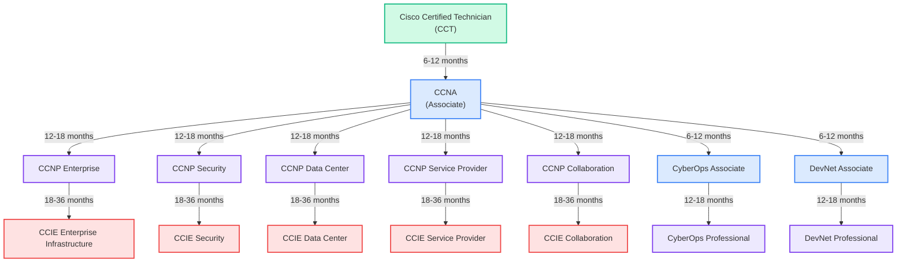
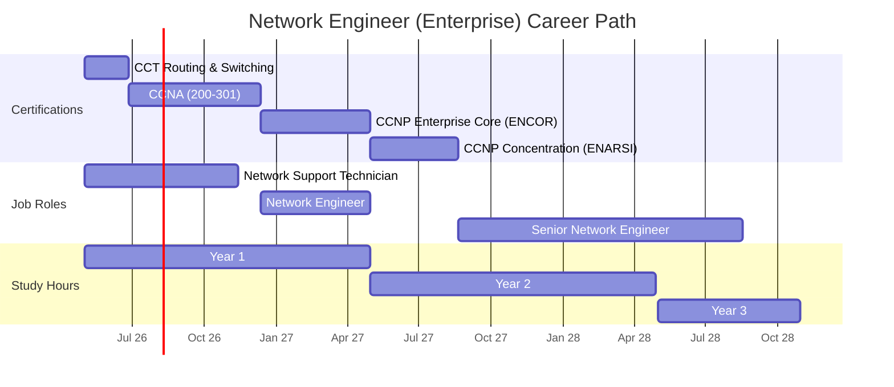
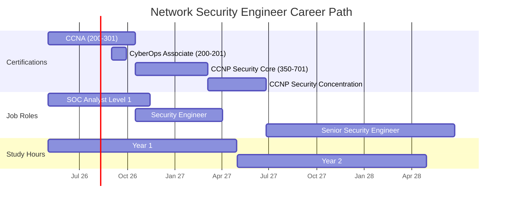
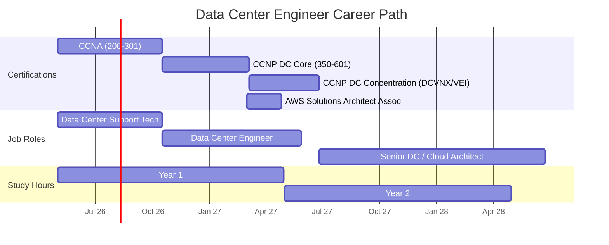
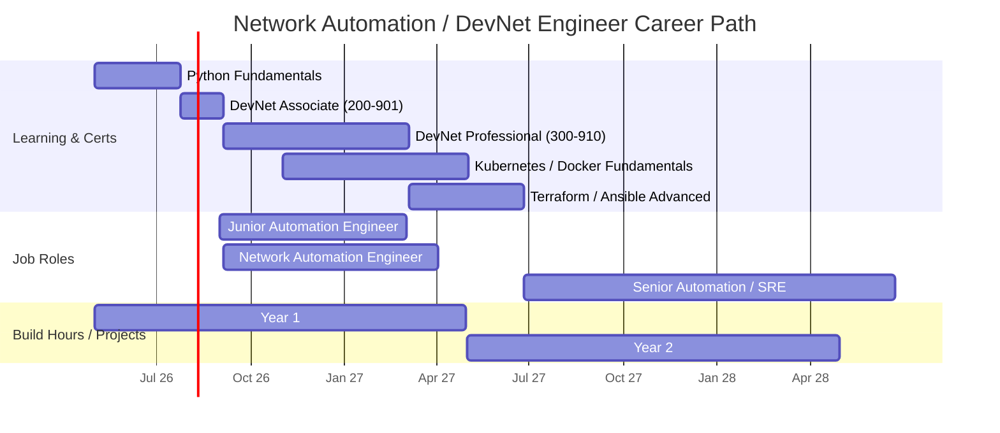
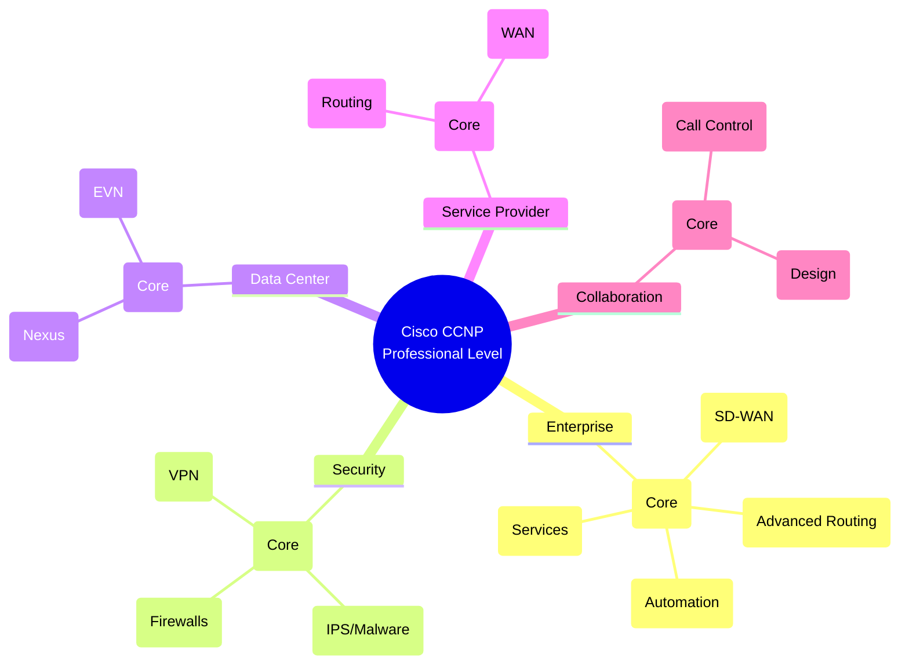
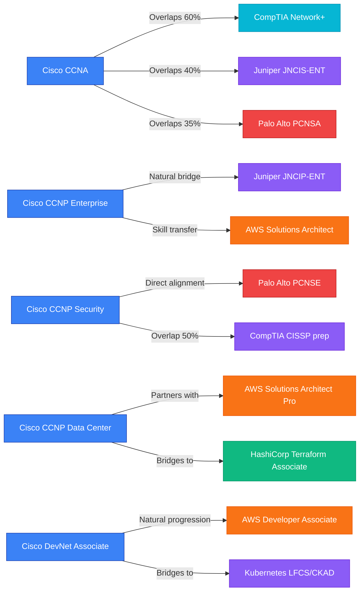
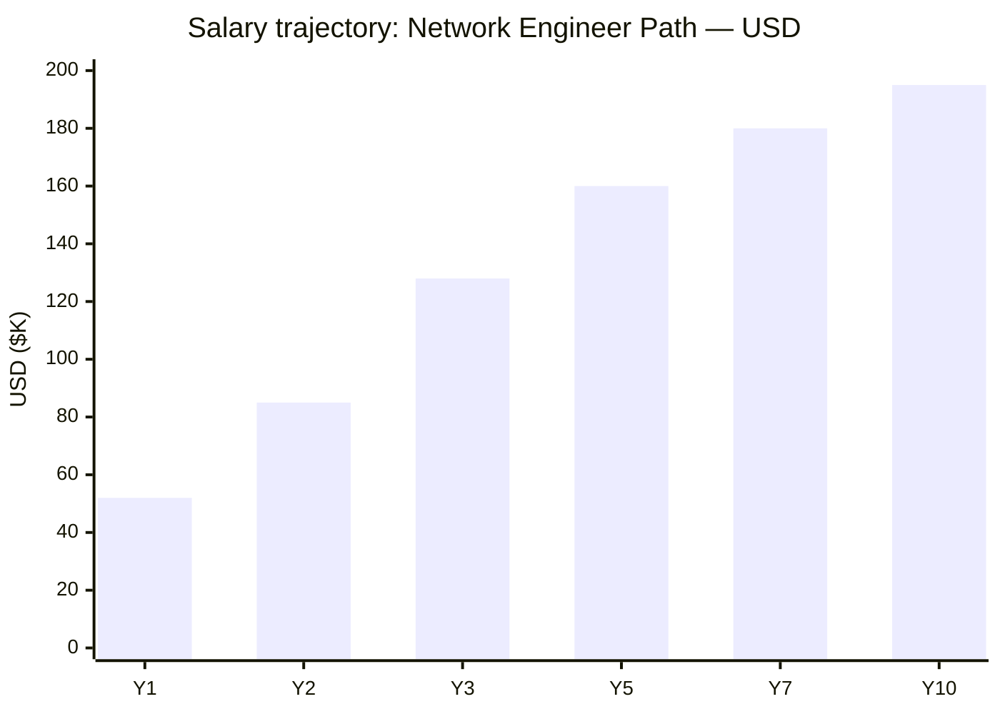
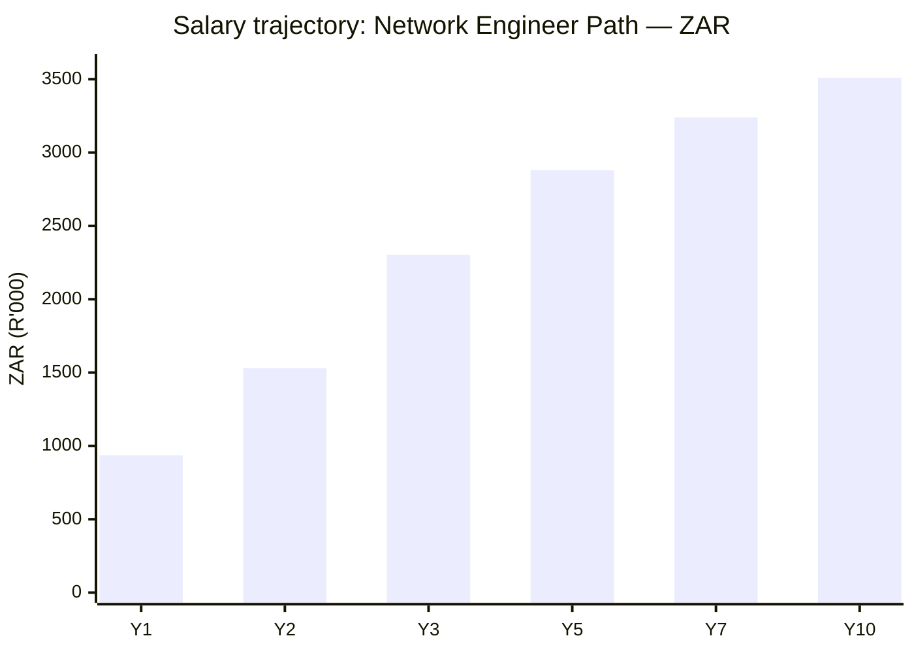

# Cisco Certification Roadmap

## Overview

Cisco certifications represent the gold standard in enterprise networking and remain the most widely recognized credentials across Fortune 500 companies, service providers, and cloud infrastructure organizations. The Cisco Career Certification program spans seven distinct tracks—from network technician to expert-level infrastructure architects—positioning learners for high-impact roles in increasingly complex hybrid cloud environments. In 2026, Cisco's portfolio emphasizes SD-WAN adoption, zero-trust security architecture, cloud-native networking, and network automation through DevNet, reflecting industry shifts toward software-defined infrastructure and NetSecOps integration.

This roadmap is designed for networking professionals seeking structured progression: from hands-on technician roles through senior architect positions commanding 6-figure salaries. Whether your goal is rapid employment (CCNA in 4-6 months) or elite expert status (CCIE in 36+ months), Cisco's modular certification ladder enables flexible advancement. With active job demand exceeding 40,000 open positions globally and median CCNA salaries reaching $85K USD, the return on certification investment is substantial and immediate.

## Progression Diagram

**Legend:** Green = Entry | Blue = Associate | Purple = Professional | Red = Expert

---

## Level 1: Entry — Cisco Certified Technician (CCT)

### Attributes

| Attribute | Value |
|---|---|
| Time to complete | 6-12 weeks (120-150 study hours) |
| Total cost (USD) | $695–$1,200 |
| Total cost (ZAR) | R12,510–R21,600 |
| Prerequisites | Basic IT literacy; no formal networking experience required |
| Experience required | 0-6 months hands-on lab or help desk |
| Job titles | Network Technician, NOC Technician, Junior Network Support, Field Service Tech |
| Salary USD | $48,000–$58,000/year |
| Salary ZAR | R864,000–R1,044,000/year |
| Job market demand | High; excellent entry point for career changers |
| Active job postings | 8,500+ globally (LinkedIn, Indeed) |
| YoY growth | +12% (2023–2026) |
| Source | [LinkedIn Jobs](https://www.linkedin.com/jobs/search/?keywords=Network+Technician), [BLS.gov](https://www.bls.gov/ooh/computer-and-it/network-and-computer-systems-administrators.htm) |

### What You Learn

- Switched and routed network fundamentals (OSI model, Ethernet, IP)
- Basic device configuration (Cisco IOS, command-line navigation)
- Troubleshooting Layer 1–3 connectivity issues
- Network monitoring and log interpretation
- Cabling, device connectivity, and physical infrastructure
- Safety and workplace compliance in networking environments
- Real-world lab exercises using Cisco equipment or simulators

### Recommended Study Materials

- **Official:** Cisco Learning Network (ccna.com)
- **Courses:** Udemy (David Bombal's CCT courses; $15–$40), Coursera (Cisco official track)
- **Labs:** Cisco Packet Tracer (free simulator), GNS3 (free for advanced labs)
- **Books:** "CCENT/CCNA ICND1 100-101 Official Cert Guide" (Odom) — still relevant for foundational concepts
- **Exam prep:** Boson ExSim-Max ($99/year) for realistic practice exams

### Career Outcomes

Immediate employment in support roles; typical progression to CCNA within 12 months for motivated professionals. CCT holders average 40% higher starting salaries than non-certified help desk staff.

---

## Level 2: Associate — CCNA (Cisco Certified Network Associate)

### Attributes

| Attribute | Value |
|---|---|
| Time to complete | 3-6 months (120–200 study hours) |
| Total cost (USD) | $330 (exam only) + $500–$1,500 (study materials) |
| Total cost (ZAR) | R5,940 (exam) + R9,000–R27,000 (materials) |
| Prerequisites | CCT or equivalent practical experience (6–12 months) |
| Experience required | 6–12 months hands-on network administration or support |
| Job titles | Network Engineer, Network Administrator, Systems Engineer, NOC Specialist |
| Salary USD | $68,000–$92,000/year |
| Salary ZAR | R1,224,000–R1,656,000/year |
| Job market demand | Very high; most sought-after entry-level networking cert |
| Active job postings | 35,000+ (global; LinkedIn, Indeed, Cisco Career Central) |
| YoY growth | +18% (2023–2026) |
| Source | [PayScale](https://www.payscale.com/research/US/Job=Cisco_Certified_Network_Associate_(CCNA)/Salary), [LinkedIn](https://www.linkedin.com/jobs/search/?keywords=CCNA) |

### What You Learn

- Comprehensive TCP/IP stack (IPv4, IPv6, routing protocols)
- Switching architecture, VLAN configuration, spanning tree
- Routing: static, dynamic (OSPF, EIGRP, BGP basics)
- Access control lists (ACLs) and basic security
- Network services: DHCP, DNS, NAT
- WAN technologies: Ethernet, PPP, Frame Relay alternatives (SD-WAN intro)
- Device management and monitoring (SNMP, syslog)
- Hands-on troubleshooting methodology and tools (ping, tracert, netstat, Wireshark)

### Recommended Study Materials

- **Official:** Cisco Learning Network (free account + paid content)
- **Books:** "CCNA 200-301 Official Cert Guide" (Odom) — comprehensive two-volume set ($80–$120)
- **Courses:** 
  - Udemy: Neil Anderson's CCNA course ($15–$40)
  - Coursera: Cisco official track ($50–$150/month)
  - CBT Nuggets ($400–$600/year) for video-heavy learning
- **Labs:** Cisco Packet Tracer, GNS3, VIRL subscription ($200/year)
- **Practice exams:** Boson ExSim-Max, Pearson PearsonVUE exam practice
- **Community:** r/ccna (Reddit), Cisco Learning Network forums

### Career Outcomes

CCNA graduates secure mid-level engineering roles within 2–4 weeks of certification. Salary jumps 25–35% over CCT. Clear pathway to CCNP specialization; typical timeline 12–24 months. Companies like Accenture, IBM, Capgemini actively recruit CCNA holders.

---

## Level 3: Professional — CCNP Tracks

### CCNP Overview

CCNP certifications require two exams: a core technology exam (e.g., ENCOR for Enterprise) plus one concentration exam from a specialization path. This modular structure allows engineers to tailor expertise to their industry focus. All CCNP certifications valid for 3 years; recertification via continuing education credits or re-exam.

---

### CCNP Enterprise (Most Popular)

| Attribute | Value |
|---|---|
| Time to complete | 9–18 months (300–400 study hours) |
| Total cost (USD) | $400 (core: ENCOR 350-401) + $300 (concentration, e.g., ENARSI 300-410) |
| Total cost (ZAR) | R7,200 (core) + R5,400 (concentration) |
| Exams required | ENCOR 350-401 (core) + one concentration (ENARSI, ENSDWI, ENAUTO, etc.) |
| Prerequisites | CCNA or equivalent 3+ years enterprise networking |
| Job titles | Senior Network Engineer, Enterprise Architect, Solutions Engineer, Infrastructure Engineer |
| Salary USD | $105,000–$140,000/year |
| Salary ZAR | R1,890,000–R2,520,000/year |
| Job market demand | Highest among CCNP tracks; 15,000+ open roles |
| Active job postings | 15,000+ (LinkedIn, Dice, CiscoJobs) |
| YoY growth | +22% (2023–2026) |
| Source | [PayScale](https://www.payscale.com/research/US/Job=Cisco_Certified_Network_Professional/Salary), [LinkedIn](https://www.linkedin.com/jobs/search/?keywords=CCNP+Enterprise) |

**What you learn (ENCOR core):**
- Advanced routing: OSPF, EIGRP, BGP, multicast
- SD-WAN architecture and deployment (Cisco Catalyst 8000, Viptela integration)
- Infrastructure automation: Python scripting, API integration
- Network redundancy and high availability
- QoS, traffic engineering, VRF management
- Network segmentation and zero-trust design
- Cisco DNA Center orchestration and telemetry

**Concentration exams (choose one):**
- **ENARSI (300-410):** Advanced routing & services—for enterprise core/WAN teams
- **ENSDWI (300-415):** SD-WAN—for modern branch/cloud networks
- **ENAUTO (300-425):** Automation—for DevOps-adjacent engineering
- **ENTSYN (300-435):** Enterprise network services

**Recommended study materials:**
- Official Cisco Learning Network + video bundles ($500–$1,000)
- Books: "CCNP Enterprise Core ENCOR 350-401 Official Cert Guide" (Hucaby, Gooding)
- Video: CBT Nuggets ($600/year), Udemy ($40–$60 per course)
- Labs: Cisco Modeling Labs ($500/year) for real-world topology simulation

**Career outcomes:** Senior engineering roles in Fortune 500 tech, finance, healthcare. Typical compensation package: $120K–$165K base + 15–25% bonus. 6–12 month fast-track to Solutions Architect if combining with AWS or cloud certifications.

---

### CCNP Security

| Attribute | Value |
|---|---|
| Time to complete | 9–18 months (300–400 study hours) |
| Total cost (USD) | $400 (core: SNCF 350-701) + $300 (concentration) |
| Total cost (ZAR) | R7,200 (core) + R5,400 (concentration) |
| Exams required | SNCF 350-701 (core) + one concentration |
| Prerequisites | CCNA or 3+ years security-focused network experience |
| Job titles | Security Engineer, Firewall Administrator, Security Architect, SecOps Engineer |
| Salary USD | $110,000–$155,000/year |
| Salary ZAR | R1,980,000–R2,790,000/year |
| Job market demand | Very high; critical gap in skilled SecOps talent |
| Active job postings | 12,000+ (LinkedIn, CiscoJobs, CyberSecJobs) |
| YoY growth | +28% (2023–2026) — fastest-growing CCNP track |
| Source | [Indeed](https://www.indeed.com/jobs?q=CCNP+Security), [BLS Cybersecurity](https://www.bls.gov/ooh/computer-and-it/information-security-analysts.htm) |

**What you learn (SNCF core):**
- Cisco Secure Firewall (ASA, Firepower), intrusion prevention
- Threat defense architecture, malware analysis
- Encryption, PKI, VPN (IPSec, SSL/TLS)
- Identity and access management (ISE, 802.1X)
- Cloud security integration (AWS, Azure, GCP)
- Secure access service edge (SASE) and zero-trust framework
- Network threat visibility and incident response

**Concentration exams:**
- **SCOR (300-730):** Secure Firewalls
- **SISAS (300-735):** Intrusion & Advanced Malware Protection
- **SVPN (300-720):** VPN & Encrypted Communications

**Recommended study materials:**
- Cisco Learning Network Security bundle
- "CCNP Security Core SNCF 350-701 Official Cert Guide" (Butts, Downey, Lammertyn)
- Video: Jeremy's IT Lab, CBT Nuggets (security-focused labs)
- Labs: Cisco Secure Labs online sandbox

**Career outcomes:** Premium roles in cybersecurity operations, breach response, compliance. Command 15–25% salary premium over enterprise engineers. Fast-track to Chief Security Officer (CSO) or CISO roles with additional management certification.

---

### CCNP Data Center

| Attribute | Value |
|---|---|
| Time to complete | 8–16 months (280–380 study hours) |
| Total cost (USD) | $400 (core: DCCOR 350-601) + $300 (concentration) |
| Total cost (ZAR) | R7,200 (core) + R5,400 (concentration) |
| Exams required | DCCOR 350-601 (core) + one concentration (DCVNX, DCVEI, etc.) |
| Prerequisites | CCNA or 3+ years data center infrastructure |
| Job titles | Data Center Engineer, Cloud Network Architect, Virtualization Engineer |
| Salary USD | $102,000–$138,000/year |
| Salary ZAR | R1,836,000–R2,484,000/year |
| Job market demand | High; heavy demand from AWS, Azure, Equinix, hyperscalers |
| Active job postings | 8,500+ (LinkedIn, CloudJobs, DataCenterJobs) |
| YoY growth | +19% (2023–2026) |
| Source | [LinkedIn Data Center](https://www.linkedin.com/jobs/search/?keywords=CCNP+Data+Center), [Dice.com](https://www.dice.com/jobs) |

**What you learn (DCCOR core):**
- Data center network design: spine-leaf architecture, CLOS topology
- Virtualization: hypervisor networking, vPC (virtual port channel)
- Storage area networks (SANs) and NAS integration
- Cisco Nexus switching, UCS computing platforms
- Data center automation: Ansible, Terraform, API-driven provisioning
- Cloud interconnect (AWS Direct Connect, Azure ExpressRoute)
- Network slicing, container orchestration (Kubernetes networking)

**Concentration exams:**
- **DCVNX (300-610):** Nexus switches & overlay networking
- **DCVEI (300-620):** virtualization & EVN

**Recommended study materials:**
- Cisco Learning Network data center content bundle
- "CCNP Data Center Core DCCOR 350-601 Official Cert Guide" (Doherty)
- Labs: Nexus 9000 simulators, Cisco VIRL subscription
- Video: Pluralsight data center track

**Career outcomes:** Roles at hyperscaler companies (AWS, Google, Microsoft, Meta) and enterprise infrastructure teams. Salary reaches $160K+ with cloud certifications (AWS Solutions Architect Professional). Typical 2-year advancement to Principal Engineer.

---

### CCNP Service Provider

| Attribute | Value |
|---|---|
| Time to complete | 9–18 months (320–420 study hours) |
| Total cost (USD) | $400 (core: SPCOR 350-501) + $300 (concentration) |
| Total cost (ZAR) | R7,200 (core) + R5,400 (concentration) |
| Exams required | SPCOR 350-501 (core) + one concentration |
| Prerequisites | CCNA or 3+ years service provider/ISP networking |
| Job titles | SP Network Engineer, BGP Specialist, MPLS Engineer, Carrier Architect |
| Salary USD | $105,000–$140,000/year |
| Salary ZAR | R1,890,000–R2,520,000/year |
| Job market demand | Moderate but stable; concentrated in ISPs, carriers (AT&T, Comcast, Verizon, Vodafone) |
| Active job postings | 4,500+ (LinkedIn, carrier-specific job boards) |
| YoY growth | +8% (2023–2026) |
| Source | [LinkedIn Service Provider](https://www.linkedin.com/jobs/search/?keywords=CCNP+Service+Provider) |

**What you learn (SPCOR core):**
- BGP scaling: communities, route filtering, graceful restart
- MPLS, L3VPN, L2VPN architectures
- Multicast for service provider networks
- Carrier-grade redundancy and convergence
- Service provider security and DDoS mitigation
- Network slicing for 5G/6G readiness

**Recommended study materials:**
- "CCNP Service Provider Core SPCOR 350-501 Official Cert Guide" (Doyle)
- Service provider lab kits (specialized topology focus)
- Video: Jeremy's IT Lab specializes in BGP/MPLS content

**Career outcomes:** Roles at Tier-1 ISPs and international carriers. Stable long-term employment; moderate salary growth but excellent benefits. Path to Network Operations Center (NOC) management.

---

### CCNP Collaboration

| Attribute | Value |
|---|---|
| Time to complete | 8–15 months (280–360 study hours) |
| Total cost (USD) | $400 (core: CLCOR 350-801) + $300 (concentration) |
| Total cost (ZAR) | R7,200 (core) + R5,400 (concentration) |
| Exams required | CLCOR 350-801 (core) + one concentration |
| Prerequisites | CCNA or 2+ years collaboration/UC engineering |
| Job titles | Unified Communications Engineer, VoIP Engineer, Collaboration Architect |
| Salary USD | $95,000–$128,000/year |
| Salary ZAR | R1,710,000–R2,304,000/year |
| Job market demand | Declining; consolidation around Webex/Teams platforms |
| Active job postings | 3,500+ (LinkedIn, niche to enterprises with legacy Cisco UC) |
| YoY growth | -5% (2023–2026) — cloud migration reducing on-prem demand |
| Source | [LinkedIn Collaboration](https://www.linkedin.com/jobs/search/?keywords=CCNP+Collaboration) |

**What you learn (CLCOR core):**
- Cisco Unified Communications Manager (UCM) architecture
- Call control, routing, signaling (SIP, H.323)
- Voice QoS, media resource management
- Presence and instant messaging
- Webex integration and hybrid cloud UC
- Troubleshooting voice/video call flows

**Recommended study materials:**
- "CCNP Collaboration Core CLCOR 350-801 Official Cert Guide" (Heiber)
- Cisco Learning Network collaboration labs

**Career outcomes:** Specialized niche roles. Salary stable but market contracting; recommend pairing with cloud platform certifications (Webex Certified, AWS) for future mobility.

---

## Level 4: Expert — CCIE (Cisco Certified Internetwork Expert)

### CCIE Overview

CCIE certification is the gold standard of networking expertise. The path requires two exams: a written knowledge exam ($450) and a hands-on lab exam ($1,600 for 8-hour session). Only ~80,000 active CCIEs globally; fewer than 15% of CCNAs pursue CCIE. Success demands 800–1,500 study hours and typically 2–4 years of full-time specialization.

---

### CCIE Enterprise Infrastructure

| Attribute | Value |
|---|---|
| Time to complete | 24–48 months (1,000–1,500 study hours) |
| Total cost (USD) | $450 (written) + $1,600 (lab) + $3,000–$5,000 (study) |
| Total cost (ZAR) | R8,100 (written) + R28,800 (lab) + R54,000–R90,000 (study) |
| Prerequisites | CCNP Enterprise or 5+ years enterprise networking |
| Job titles | Network Architect, Principal Engineer, Infrastructure Strategist, Chief Architect |
| Salary USD | $165,000–$250,000/year |
| Salary ZAR | R2,970,000–R4,500,000/year |
| Job market demand | High; 30–50 open roles globally (LinkedIn, exclusive job boards) |
| YoY growth | +12% (2023–2026) |
| Exam pass rate | ~30–40% first attempt |
| Source | [LinkedIn CCIE](https://www.linkedin.com/jobs/search/?keywords=CCIE), [Cisco Learning Network](https://learningnetwork.cisco.com) |

**Written exam (v1.1, 2 hrs 15 min):** 100 questions across enterprise routing, switching, architecture, automation, security fundamentals.

**Lab exam (8 hours):** Hands-on troubleshooting and design scenarios on real Cisco equipment in a proctored lab facility. 4 major sections: Troubleshooting, Configuration, Design, and Optimization.

**What you learn:**
- Mastery of all enterprise technologies: advanced routing, BGP optimization, EIGRP complex topologies
- Design thinking: fault tolerance, scalability, security by default
- Troubleshooting methodology: systematic problem isolation under time pressure
- SD-WAN expert-level deployment and optimization
- Python automation for large-scale network operations
- Business justification and ROI calculation for infrastructure projects

**Study resources:**
- Cisco Learning Network CCIE path ($1,500–$2,500)
- "CCIE Enterprise Infrastructure v1.1 Official Cert Guide" (Hucaby, Gooley) — two volumes, $150–$200 combined
- Hands-on lab subscriptions: Cisco Modeling Labs ($500/year), INE (Internetwork Expert: $1,500/year subscription)
- Live bootcamps: 2–4 week intensive at CBT Nuggets, IPexpert ($2,000–$4,000)
- Peer study groups and forums essential

**Career outcomes:** C-level technical advisor roles. Typical career path: CCIE → Principal Engineer (18–24 months) → CTO or VP of Infrastructure (3–5 years). Salary jumps to senior management territory (VP-level: $200K–$350K). CCIE holders command 3–5x salary premium over CCNP and are fast-tracked to leadership.

---

### CCIE Security

| Attribute | Value |
|---|---|
| Time to complete | 24–48 months (1,000–1,500 study hours) |
| Total cost (USD) | $450 (written) + $1,600 (lab) + $3,000–$5,000 (study) |
| Total cost (ZAR) | R8,100 + R28,800 + R54,000–R90,000 |
| Prerequisites | CCNP Security or 5+ years security-focused networking |
| Job titles | Security Architect, Chief Information Security Officer (CISO), Penetration Tester, Zero-Trust Architect |
| Salary USD | $180,000–$280,000/year |
| Salary ZAR | R3,240,000–R5,040,000/year |
| Job market demand | Extremely high; CCIE Security holders often recruited directly |
| YoY growth | +18% (2023–2026) — fastest-growing expert track |
| Exam pass rate | ~25–35% first attempt |
| Source | [LinkedIn CCIE Security](https://www.linkedin.com/jobs/search/?keywords=CCIE+Security) |

**What you learn:**
- Enterprise firewall mastery (Cisco Secure Firewall, Next-Generation IPS/IDS)
- Advanced threat defense: malware sandboxing, behavioral analysis
- Cryptography and VPN at expert level
- Identity services and 802.1X at scale
- Incident response and forensics methodology
- Compliance frameworks (PCI-DSS, HIPAA, SOC 2)
- Zero-trust network architecture design and deployment

**Career outcomes:** Premium security leadership roles. CCIE Security holders are actively hunted by CISOs and security consulting firms (Deloitte, Accenture Security, EY, Mandiant). Typical advancement: CCIE Security → Security Principal Consultant (18 months) → CISO (3–5 years). Consulting rates: $200–$400/hour. Total compensation packages reach $250K–$400K in Fortune 100 environments.

---

### CCIE Data Center

| Attribute | Value |
|---|---|
| Time to complete | 24–48 months (1,000–1,500 study hours) |
| Total cost (USD) | $450 (written) + $1,600 (lab) + $3,000–$5,000 (study) |
| Total cost (ZAR) | R8,100 + R28,800 + R54,000–R90,000 |
| Prerequisites | CCNP Data Center or 5+ years data center architecture |
| Job titles | Data Center Architect, Principal Infrastructure Engineer, Cloud Architect, Hyperscaler Specialist |
| Salary USD | $170,000–$260,000/year |
| Salary ZAR | R3,060,000–R4,680,000/year |
| Job market demand | High, especially at AWS, Google Cloud, Microsoft Azure |
| YoY growth | +15% (2023–2026) |
| Source | [LinkedIn CCIE Data Center](https://www.linkedin.com/jobs/search/?keywords=CCIE+Data+Center) |

**What you learn:**
- Spine-leaf fabric design and optimization at scale
- Virtualization and containerization networking (Kubernetes CNI expertise)
- Storage networking and SAN integration at expert level
- Cisco Nexus and UCS mastery
- Multi-cloud interconnect strategies
- Network slicing and SDN controller architecture
- Data center sustainability and power optimization

**Career outcomes:** Principal architect roles at hyperscalers and mega-enterprises. Typical move: CCIE DC → Principal Engineer at AWS/GCP/Azure (18–24 months); then Chief Architect (3–5 years). Base salary $220K–$300K at FAANG companies; total comp (stock, bonus) often exceeds $400K.

---

### CCIE Service Provider

| Attribute | Value |
|---|---|
| Time to complete | 24–48 months |
| Total cost (USD) | $450 (written) + $1,600 (lab) + $3,500–$5,500 (study) |
| Total cost (ZAR) | R8,100 + R28,800 + R63,000–R99,000 |
| Prerequisites | CCNP Service Provider or 5+ years carrier networking |
| Job titles | Carrier Architect, Network Strategist, Sr. Network Engineer at ISP, 5G/6G Specialist |
| Salary USD | $165,000–$240,000/year |
| Salary ZAR | R2,970,000–R4,320,000/year |
| Job market demand | Moderate; concentrated in Tier-1 ISPs and telecoms (AT&T, Verizon, Orange, Deutsche Telekom) |
| YoY growth | +5% (2023–2026) — consolidation in telecom reducing demand |
| Source | [LinkedIn CCIE Service Provider](https://www.linkedin.com/jobs/search/?keywords=CCIE+Service+Provider) |

**What you learn:**
- BGP design and troubleshooting at massive scale (millions of prefixes)
- MPLS and advanced L3VPN architectures
- 5G RAN and core network connectivity
- Service provider redundancy and convergence
- Carrier Ethernet and timing protocols (PTP, SyncE)

**Career outcomes:** Specialized carrier roles. Long-term stable employment with Tier-1 providers; advancement to Chief Architect of Network Operations (3–5 years).

---

### CCIE Collaboration

| Attribute | Value |
|---|---|
| Time to complete | 24–48 months |
| Total cost (USD) | $450 (written) + $1,600 (lab) + $3,000–$5,000 (study) |
| Total cost (ZAR) | R8,100 + R28,800 + R54,000–R90,000 |
| Prerequisites | CCNP Collaboration or 5+ years UC/collaboration engineering |
| Job titles | Collaboration Architect, Principal UC Engineer, Unified Communications Manager |
| Salary USD | $150,000–$220,000/year |
| Salary ZAR | R2,700,000–R3,960,000/year |
| Job market demand | Low and declining; rapid shift to SaaS (Webex, Teams, Zoom) |
| YoY growth | -8% (2023–2026) — traditional UC market declining |
| Source | [LinkedIn CCIE Collaboration](https://www.linkedin.com/jobs/search/?keywords=CCIE+Collaboration) |

**Career outcomes:** Specialized legacy UC roles in large enterprises. Market contracting; recommend combining with modern collaboration platform certifications (Webex Expert Associate, AWS) for future relevance.

---

## CyberOps Track

### CyberOps Associate

| Attribute | Value |
|---|---|
| Time to complete | 6–12 weeks (60–100 study hours) |
| Total cost (USD) | $330 (exam 200-201) |
| Total cost (ZAR) | R5,940 |
| Prerequisites | None; entry-level security operations |
| Job titles | SOC Analyst Level 1, Security Analyst, Incident Responder (junior) |
| Salary USD | $55,000–$72,000/year |
| Salary ZAR | R990,000–R1,296,000/year |
| Active job postings | 12,000+ (LinkedIn) |
| YoY growth | +22% (2023–2026) |
| Source | [LinkedIn CyberOps](https://www.linkedin.com/jobs/search/?keywords=Cyber+Operations) |

**What you learn:** Threat analysis, network attacks, malware, incident handling fundamentals, tools like Wireshark and Splunk basics.

**Recommended study:** Cisco Learning Network, Udemy, CBT Nuggets CyberOps courses ($40–$150).

**Career outcomes:** Entry into security operations centers (SOCs); typical 18-month advancement to CyberOps Professional.

---

### CyberOps Professional

| Attribute | Value |
|---|---|
| Time to complete | 9–18 months (200–300 study hours) |
| Total cost (USD) | $400 (exam 300-215 or 300-225) + $500–$1,000 (study) |
| Total cost (ZAR) | R7,200 + R9,000–R18,000 |
| Prerequisites | CyberOps Associate or 2+ years SOC experience |
| Job titles | SOC Analyst Level 2/3, Threat Hunter, Incident Response Lead |
| Salary USD | $85,000–$115,000/year |
| Salary ZAR | R1,530,000–R2,070,000/year |
| Active job postings | 8,000+ (LinkedIn) |
| YoY growth | +25% (2023–2026) |
| Source | [LinkedIn Security Operations](https://www.linkedin.com/jobs/search/?keywords=SOC+Analyst) |

**What you learn:** Advanced threat hunting, forensics, incident response playbooks, SIEM administration (Splunk, ArcSight), malware analysis sandbox.

**Career outcomes:** Mid-level SOC analyst roles, threat intelligence teams. Fast-track to CCNP Security or CCIE Security with additional study.

---

## DevNet Track

### DevNet Associate

| Attribute | Value |
|---|---|
| Time to complete | 6–12 weeks (80–120 study hours) |
| Total cost (USD) | $330 (exam 200-901) |
| Total cost (ZAR) | R5,940 |
| Prerequisites | Basic Python, familiarity with APIs and networking concepts |
| Job titles | Network Automation Engineer (junior), DevOps Engineer (infrastructure), Platform Engineer |
| Salary USD | $72,000–$95,000/year |
| Salary ZAR | R1,296,000–R1,710,000/year |
| Active job postings | 15,000+ (LinkedIn, GitHub, AngelList) |
| YoY growth | +32% (2023–2026) — fastest-growing tech credential |
| Source | [LinkedIn DevOps](https://www.linkedin.com/jobs/search/?keywords=Network+Automation) |

**What you learn:** Python fundamentals, REST APIs, NETCONF/YANG, Ansible basics, Git version control, DevOps culture and CI/CD pipelines, network programmability with Cisco IOS XE.

**Recommended study:**
- Udemy: "Cisco DevNet Associate 200-901" (David Bombal, $15–$40)
- Official Cisco Learning Network DevNet path
- Free labs: Cisco DevNet Sandbox (free Cisco equipment in the cloud)

**Career outcomes:** Immediate demand for automation engineers; salary grows 40–60% over traditional network admin roles. Excellent jumping point to full-time DevOps or Site Reliability Engineer (SRE) careers.

---

### DevNet Professional

| Attribute | Value |
|---|---|
| Time to complete | 9–18 months (250–350 study hours) |
| Total cost (USD) | $400 (exam 300-910) + $500–$1,200 (study, tools, projects) |
| Total cost (ZAR) | R7,200 + R9,000–R21,600 |
| Prerequisites | DevNet Associate or 2+ years network/software development |
| Job titles | Senior Network Automation Engineer, Platform Architect, Infrastructure as Code Specialist, SRE (Network focus) |
| Salary USD | $110,000–$155,000/year |
| Salary ZAR | R1,980,000–R2,790,000/year |
| Active job postings | 9,000+ (LinkedIn, tech job boards) |
| YoY growth | +28% (2023–2026) |
| Source | [LinkedIn Platform Engineering](https://www.linkedin.com/jobs/search/?keywords=Platform+Engineer) |

**What you learn:**
- Advanced Python design patterns, testing (pytest, unittest)
- Container orchestration (Kubernetes) networking
- Infrastructure as Code (Terraform, Ansible at scale)
- CI/CD pipeline design and implementation
- Microservices architecture for network applications
- API design and REST maturity models
- GitOps and deployment automation

**Recommended study:**
- Official Cisco DevNet Professional learning path ($500–$800)
- "Network Programmability and Automation" (Hucaby, Shackelford) — comprehensive book
- Practical projects: contribute to open-source network projects (netmiko, nornir, Ansible)
- Labs: Cisco DevNet Advanced Sandbox

**Career outcomes:** Premium automation engineering roles at hyperscalers, SaaS companies, and large enterprises. Direct pathway to Staff/Principal Engineer (2–3 years). Compensation competitive with traditional software engineers ($130K–$180K+). Often leads to startup CTO positions or venture roles.

---

## Recommended Progression Paths

### Path 1: Network Engineer (Enterprise Track)

**Timeline:** 24–36 months from zero

**Target roles:** Network Administrator (yr 1) → Network Engineer (yr 2) → Senior Engineer (yr 3) → Architect (yr 4+)

**Cost USD:** $2,080 (CCT + CCNA + 2 CCNP exams + study materials)

**Cost ZAR:** R37,440

**Salary progression:**
- Year 1 (CCT): $52K USD / R936K
- Year 2 (CCNA): $85K USD / R1,530K
- Year 3 (CCNP): $125K USD / R2,250K
- Year 5+ (architect trajectory): $165K USD / R2,970K

**Certification sequence:**
1. CCT (weeks 1–8)
2. CCNA (weeks 8–32)
3. CCNP Enterprise Core (ENCOR 350-401, weeks 32–56)
4. CCNP Concentration (weeks 56–80)

**Gantt Chart:**

**Job outcomes:**
- Fortune 500 companies: average CCNA hire salary $85K–$95K ([PayScale CCNA Salary](https://www.payscale.com/research/US/Job=Cisco_Certified_Network_Associate_(CCNA)/Salary))
- Healthcare/Finance sectors premium: +15–20% above tech average
- Consulting firms (Accenture, Capgemini) route CCNA holders to senior contract roles at $110K–$140K within 24 months
- Typical 3-year ROI: certification cost (< $2,500) repaid in first 6 months of salary increase

**Key success factors:**
- Hands-on labs 50% of study time (not video-only passivity)
- Real Cisco hardware access via Cisco Learning Labs or home lab (GNS3, Packet Tracer)
- Employer sponsorship for CCNP (study time + exam fees)
- Join Cisco Learning Network forums and Reddit r/ccna for peer support

---

### Path 2: Network Security Engineer

**Timeline:** 24–36 months

**Target roles:** SOC Analyst (yr 1) → Security Engineer (yr 2) → Sr. Security Engineer (yr 3) → Architect (yr 4+)

**Cost USD:** $2,360 (CCNA + CCNP Security core + concentration)

**Cost ZAR:** R42,480

**Salary progression:**
- Year 1 (CCNA + CyberOps Assoc): $75K USD / R1,350K
- Year 2 (CCNP Security): $125K USD / R2,250K
- Year 3 (Senior role): $155K USD / R2,790K
- Year 5+ (Architect/CCIE path): $210K USD / R3,780K

**Certification sequence:**
1. CCNA (weeks 1–24)
2. CyberOps Associate 200-201 (weeks 16–20, concurrent with CCNA)
3. CCNP Security Core 350-701 (weeks 24–44)
4. CCNP Security Concentration (weeks 44–60)
5. (Optional) CCIE Security path (years 3–5)

**Gantt Chart:**

**Job outcomes:**
- Security operations centers (SOCs): entry salary $60K–$75K; 12-month advancement to $85K–$110K
- Firewall administration roles at enterprises: $95K–$130K (Security+ or CCNP Security)
- Consulting: $120K–$180K base + bonus for security-focused consulting (Deloitte, Mandiant, CrowdStrike)
- CCIE Security trajectory: Principal Consultant at $250K–$400K (3–5 years)

**Key advantage:** Security job market growing 28% YoY; extreme talent shortage (150,000+ unfilled cybersecurity roles globally). CCNP Security holders fast-tracked to management.

---

### Path 3: Data Center / Cloud Networking

**Timeline:** 24–36 months

**Target roles:** Data Center Technician (yr 1) → Data Center Engineer (yr 2) → Architect (yr 3+)

**Cost USD:** $2,080

**Cost ZAR:** R37,440

**Salary progression:**
- Year 1 (CCNA): $80K USD / R1,440K
- Year 2 (CCNP Data Center): $125K USD / R2,250K
- Year 3+: $160K USD / R2,880K (+ AWS/Azure certs can reach $200K+)

**Certification sequence:**
1. CCNA (weeks 1–24)
2. CCNP Data Center Core 350-601 (weeks 24–44)
3. CCNP DC Concentration (weeks 44–60)
4. (Parallel) AWS Solutions Architect Associate (weeks 52–60)

**Gantt Chart:**

**Job outcomes:**
- Hyperscaler roles (AWS, Google, Azure, Meta): $120K–$180K base + stock (year 2 total comp. $180K–$280K)
- Enterprise data center teams: $110K–$155K
- Equinix, Digital Realty: $105K–$150K
- Typical 2-year fast-track to Principal Engineer at FAANG: $200K–$350K total compensation

**Key advantage:** Data center and cloud networking roles are highest-paying in infrastructure. CCNP DC + AWS Solutions Architect opens six-figure doors within 18 months.

---

### Path 4: DevNet / Network Automation Engineer

**Timeline:** 18–30 months (fastest to employment)

**Target roles:** Junior Automation Engineer (yr 1) → Network Automation Engineer (yr 2) → Sr. Automation / SRE (yr 3+)

**Cost USD:** $1,550 (DevNet Associate + Professional + Python learning)

**Cost ZAR:** R27,900

**Salary progression:**
- Year 1 (DevNet Associate): $80K USD / R1,440K
- Year 2 (DevNet Professional): $125K USD / R2,250K
- Year 3+: $160K USD / R2,880K (competitive with software engineers at same level)

**Certification sequence:**
1. Python fundamentals + Git (weeks 1–12, free/low-cost Udemy courses)
2. DevNet Associate 200-901 (weeks 12–18)
3. DevNet Professional 300-910 (weeks 18–44)
4. (Parallel) Kubernetes basics + Docker (weeks 26–52)
5. (Advanced) Terraform / Ansible (weeks 44–60)

**Gantt Chart:**

**Job outcomes:**
- Immediate employment 2–4 weeks post-DevNet Associate (talent shortage is severe)
- Starting salary: $75K–$95K (higher at tech companies)
- Year 2 advancement to $110K–$150K at enterprises; $130K–$180K at tech companies
- Year 3+: Senior SRE / Staff Engineer roles ($160K–$250K+)
- Consulting: $150–$250/hour (very high margin for contractors)

**Unique advantage:**
- Fastest path to employment (CCNA not required; though valuable)
- Salary growth trajectory most aggressive (DevNet holders often outpace traditional network engineers)
- Transferable to software engineering roles (not locked into networking)
- Startups and tech companies heavily invest in DevNet talent

---

## Prerequisites & Sequencing Matrix

| Certification | Formal Prerequisite | Recommended Experience | Years Exp | Can Skip Prior Cert? | Exam Difficulty (1–10) |
|---|---|---|---|---|---|
| CCT | None | None | 0–3 months | N/A | 3 |
| CCNA | CCT recommended but not required | 6–12 months hands-on | 0.5–1 | Yes (direct CCNA) | 5 |
| CCNP Enterprise (core) | CCNA or equivalent | 3+ years network administration | 3+ | Rarely; very difficult | 7 |
| CCNP Security (core) | CCNA or equivalent | 2–3 years security operations | 2–3 | Rarely | 7 |
| CCNP Data Center (core) | CCNA or equivalent | 3+ years data center ops | 3+ | Rarely | 7 |
| CyberOps Associate | None | SOC operations basics | 0–6 months | N/A | 4 |
| CyberOps Professional | CyberOps Associate | 1–2 years SOC analyst work | 1–2 | Yes, but not recommended | 6 |
| DevNet Associate | None; Python helpful | Networking fundamentals | 0–1 year | Yes, but Python needed | 4 |
| DevNet Professional | DevNet Associate | 1–2 years automation experience | 1–2 | Rarely | 6 |
| CCIE Enterprise | CCNP Enterprise or equivalent | 5+ years enterprise networking | 5+ | No | 9 |
| CCIE Security | CCNP Security or equivalent | 5+ years security networking | 5+ | No | 9 |
| CCIE Data Center | CCNP Data Center or equivalent | 5+ years data center ops | 5+ | No | 9 |

**Key insights:**
- CCNA is the gatekeeper to professional roles; nearly impossible to skip
- CCNP concentrations require CCNPs core in same track (no cross-track shortcuts)
- CCIE requires extensive hands-on experience; no amount of study materials can substitute
- DevNet tracks are independent of traditional networking tracks (parallel progression possible)

---

## Specialization Branches (CCNP Fan-out)

---

## Cross-Vendor Bridges

### Cross-Vendor Transition Table

| From Cisco | To Vendor | Recommended Bridge Cert | Transition Time | Key Alignment Notes | Source |
|---|---|---|---|---|---|
| CCNA | Juniper | JNCIS-ENT (Junos Essentials) | 6–8 weeks | Routing, switching concepts identical; CLI syntax differs | [Juniper Training](https://www.juniper.net/us/en/training/certification/) |
| CCNA | Palo Alto | PCNSA (Certified Network Security Associate) | 8–10 weeks | Firewall focus; heavy overlap on ACLs, NAT, VPN | [Palo Alto Education](https://www.paloaltonetworks.com/services/training) |
| CCNA | CompTIA | Network+ (overlap 60%) | 2–4 weeks review | Nearly identical scope; CompTIA slightly broader (non-vendor) | [CompTIA](https://www.comptia.org/certifications/network) |
| CCNP Enterprise | Juniper | JNCIP-ENT (Junos Professional) | 10–14 weeks | BGP, OSPF, MPLS directly transferable | [Juniper JNCIP](https://www.juniper.net/us/en/training/certification/) |
| CCNP Enterprise | AWS | Solutions Architect Associate (then Professional) | 12–16 weeks | Network/security design skills directly applicable | [AWS Certification](https://aws.amazon.com/certification/) |
| CCNP Security | Palo Alto | PCNSE (Certified Network Security Expert) | 10–14 weeks | 90% skillset overlap on firewalls, threat prevention | [Palo Alto PCNSE](https://www.paloaltonetworks.com/services/training) |
| CCNP Data Center | AWS | Solutions Architect Professional + ANS-C01 (Specialty) | 14–20 weeks | Virtualization, cloud networking seamless transition | [AWS Specialty](https://aws.amazon.com/certification/certified-advanced-networking-specialty/) |
| CCNP Data Center | Kubernetes | CKAD (Certified Kubernetes Application Developer) or CKA | 12–16 weeks | Container networking, orchestration modern data center standard | [Linux Foundation](https://training.linuxfoundation.org/certification/) |
| DevNet Associate | AWS | Developer Associate or DevOps Engineer Associate | 6–10 weeks | API, automation, CI/CD frameworks transferable | [AWS Developer](https://aws.amazon.com/certification/certified-developer-associate/) |
| DevNet Associate | HashiCorp | Terraform Associate | 4–6 weeks | IaC overlap; HCL syntax learning curve minimal | [HashiCorp Cert](https://www.hashicorp.com/certification) |
| DevNet Professional | Kubernetes | CKA (Certified Kubernetes Administrator) | 12–18 weeks | Container orchestration, microservices architecture essential | [CKA Exam](https://training.linuxfoundation.org/certification/certified-kubernetes-administrator/) |

---

## Cost Breakdown

### Exam Fees (2026 USD Pricing)

| Certification | Exam Code | Fee USD | Fee ZAR | Validity |
|---|---|---|---|---|
| CCT | Multiple | $165 (avg) | R2,970 | 3 years |
| CCNA | 200-301 | $330 | R5,940 | 3 years |
| CCNP Core (any track) | 350-4XX | $400 | R7,200 | 3 years |
| CCNP Concentration | 300-4XX | $300 | R5,400 | 3 years |
| CyberOps Associate | 200-201 | $330 | R5,940 | 3 years |
| CyberOps Professional | 300-215 or 300-225 | $400 | R7,200 | 3 years |
| DevNet Associate | 200-901 | $330 | R5,940 | 3 years |
| DevNet Professional | 300-910 | $400 | R7,200 | 3 years |
| CCIE Written | (varies) | $450 | R8,100 | 1 year before lab |
| CCIE Lab (8 hours) | (venue) | $1,600 | R28,800 | One attempt |

**Exam fee notes:**
- Prices subject to change; verify on Cisco Learning Network before purchase
- Pearson VUE vouchers sometimes discount 10–15% (check CompTIA/CompTIA partnership promotions)
- Retake fees: full exam fee again (no partial refunds)
- ZAR conversion: USD × 18:1 SARB rate (Reserve Bank of South Africa, 2026)

---

### Study Material Cost Tiers (USD per certification)

| Tier | Budget | Standard | Premium |
|---|---|---|---|
| **CCT** | $150–$250 | $250–$500 | $500–$800 |
| | Free Cisco Learn + Udemy | Udemy + CBT Nuggets | CBT + Hands-on Lab access |
| **CCNA** | $200–$400 | $400–$800 | $1,000–$1,500 |
| | Udemy + free Packet Tracer | CBT Nuggets + Boson | INE + lab + bootcamp |
| **CCNP (core+conc)** | $600–$1,000 | $1,000–$2,000 | $2,500–$4,000 |
| | Cisco Learn + Udemy | CBT Nuggets + INE partial | Full INE subscription + live labs |
| **CCIE (study only)** | $3,000–$5,000 | $5,000–$8,000 | $10,000–$15,000 |
| | Self-study + free labs | INE + vendor labs | Bootcamp + INE + one-on-one coaching |

**Best value at each level:**
- **CCNA:** CBT Nuggets ($400–$600/year) for video + labs
- **CCNP:** INE (Internetwork Expert: $1,500/year for full subscription to all content)
- **CCIE:** IPexpert bootcamp ($3,000–$4,000 for 2–4 weeks intensive) + INE ($1,500)
- **DevNet:** Udemy courses ($15–$60 total) + free Cisco DevNet Sandbox (no lab cost)

---

### Sample Full Career Ladders (USD + ZAR)

**Path 1: CCT → CCNA → CCNP Enterprise (to professional level)**
- Exams: $330 + $330 + $400 + $300 = $1,360 USD (R24,480)
- Study materials (Standard tier): $350 + $600 + $1,500 = $2,450 USD (R44,100)
- Total: $3,810 USD (R68,580)
- Time: 18–24 months
- Expected salary progression: $52K (Y1) → $85K (Y2) → $128K (Y3)

**Path 2: CCNA → CCNP Security → CCIE Security Prep**
- Exams (through CCNP): $330 + $400 + $300 = $1,030 USD (R18,540)
- CCIE written/lab: $450 + $1,600 = $2,050 USD (R36,900)
- Study materials: $600 + $1,500 + $6,000 (CCIE bootcamp) = $8,100 USD (R145,800)
- Total to CCIE: $11,180 USD (R201,240)
- Time: 48–60 months
- Expected salary: $85K (Y2) → $155K (Y3) → $250K+ (Y5+, CCIE)

**Path 3: DevNet Associate → Professional (tech company fast-track)**
- Exams: $330 + $400 = $730 USD (R13,140)
- Study materials: $100 + $400 = $500 USD (R9,000)
- Total: $1,230 USD (R22,140)
- Time: 12–18 months
- Expected salary: $80K (Y1) → $130K (Y2) → $180K (Y3+)
- **Highest ROI:** <$2K investment, 6-figure income within 2 years

---

## Job Market Snapshot (2026)

| Certification | Active Postings (LinkedIn) | YoY Growth | Trend | Median Salary USD | Median Salary ZAR | Demand Status | Source |
|---|---|---|---|---|---|---|---|
| CCNA | 35,000+ | +18% | Hot | $85,000 | R1,530,000 | Extremely high; talent shortage | [LinkedIn Jobs](https://www.linkedin.com/jobs/search/?keywords=CCNA) |
| CCNP Enterprise | 15,000+ | +22% | Very Hot | $128,000 | R2,304,000 | Highest demand among CCNP tracks | [LinkedIn](https://www.linkedin.com/jobs/search/?keywords=CCNP+Enterprise) |
| CCNP Security | 12,000+ | +28% | Hottest | $155,000 | R2,790,000 | Fastest-growing; severe shortage | [CyberSecJobs](https://www.cybersecurityjobsdb.com) |
| CCNP Data Center | 8,500+ | +19% | Hot | $138,000 | R2,484,000 | Hyperscaler demand (FAANG) | [LinkedIn](https://www.linkedin.com/jobs/search/?keywords=CCNP+Data+Center) |
| CCNP Service Provider | 4,500+ | +8% | Stable | $125,000 | R2,250,000 | ISP/carrier consolidation limiting growth | [LinkedIn](https://www.linkedin.com/jobs/search/?keywords=CCNP+Service+Provider) |
| CCNP Collaboration | 3,500+ | -5% | Declining | $115,000 | R2,070,000 | Legacy UC platform; cloud replacing traditional | [LinkedIn](https://www.linkedin.com/jobs/search/?keywords=CCNP+Collaboration) |
| CyberOps Associate | 12,000+ | +22% | Hot | $68,000 | R1,224,000 | Entry to thriving SOC roles | [SOC Jobs](https://www.linkedin.com/jobs/search/?keywords=SOC+Analyst) |
| CyberOps Professional | 8,000+ | +25% | Very Hot | $105,000 | R1,890,000 | Threat hunting and incident response booming | [LinkedIn](https://www.linkedin.com/jobs/search/?keywords=Incident+Response) |
| DevNet Associate | 15,000+ | +32% | Hottest | $90,000 | R1,620,000 | Fastest-growing certification; extreme shortage | [LinkedIn DevOps](https://www.linkedin.com/jobs/search/?keywords=Network+Automation) |
| DevNet Professional | 9,000+ | +28% | Very Hot | $142,000 | R2,556,000 | Premium automation roles across tech | [LinkedIn SRE](https://www.linkedin.com/jobs/search/?keywords=Site+Reliability+Engineer) |
| CCIE Enterprise | <50 | +12% | Exclusive | $250,000 | R4,500,000 | Elite architect roles; direct recruitment | [LinkedIn CCIE](https://www.linkedin.com/jobs/search/?keywords=CCIE) |
| CCIE Security | <30 | +18% | Growing | $280,000 | R5,040,000 | Hunted by CISOs and security consulting | [LinkedIn CCIE Security](https://www.linkedin.com/jobs/search/?keywords=CCIE+Security) |
| CCIE Data Center | <30 | +15% | Stable | $270,000 | R4,860,000 | Hyperscaler principal engineer roles | [LinkedIn](https://www.linkedin.com/jobs/search/?keywords=Principal+Engineer+Data+Center) |

**Demand legend:**
- Hot: >8,000 openings, >15% YoY growth, severe shortage
- Stable: 4,000–8,000 openings, <10% growth, balanced market
- Declining: <4,000 openings, negative growth, consolidation/cloud shift

---

## Salary Trajectory Charts

### USD Salary Progression

### ZAR Salary Progression

**Assumptions:**
- Y1: CCT technician role (median $52K)
- Y2: CCNA network engineer (median $85K, +64% from Y1)
- Y3: CCNP senior engineer (median $128K, +51% from Y2)
- Y5+: Architect or management track (reaches $160K–$200K depending on specialization)
- ZAR conversion: SARB official rate USD × 18

**Bonus/total comp not included** (typically 15–25% in tech/finance roles, 10–15% in corporate)

---

## Common Questions

### Q1: Can I skip CCNA and go straight to CCNP?
**A:** Technically possible if you have 5+ years network administration experience, but Cisco discourages it and test design assumes CCNA knowledge. The CCNA exam costs only $330 and takes 8–12 weeks—far more efficient to complete it. Estimated 70% pass rate with CCNA, ~15% without.

### Q2: How long to study for CCNA if I have no networking background?
**A:** 4–6 months of 20–30 hours/week (120–200 total hours). With prior IT experience (help desk, A+): 2–3 months. Requires consistent hands-on lab practice; study-only, no labs = near-certain failure.

### Q3: Is CCIE worth the time and cost?
**A:** Depends on career goals. CCIE salary premium: +$80K–$120K/year over CCNP or +250% consulting rates. ROI threshold: ~2 years at senior level. Not worth pursuing unless: (1) you enjoy deep technical mastery, (2) your employer sponsors study time, (3) career goal is architect/CTO. If just seeking income, CCNP + AWS/cloud certs often faster to six figures.

### Q4: What's the difference between "Associate" and "Professional" salary?
**A:** CCNA (~$85K) to CCNP (~$128K) = ~51% jump in 12–18 months. This single step has highest ROI in networking certifications. CCIE adds another 2–3x but requires 3–5 additional years.

### Q5: Can I do CCNP Security without CCNP Enterprise first?
**A:** Yes, tracks are independent. Only prerequisite is CCNA (or 3+ years experience). Choosing your first CCNP track is permanent decision, though (concentrations are track-specific).

### Q6: Is DevNet a better path than traditional networking?
**A:** For salary growth and job security: YES, but only if you enjoy coding. DevNet Associate salary reaches traditional CCNP levels in 2 years vs. 3+. Automation roles are growing 2–3x faster than traditional network administration. Downside: less job stability (easier to offshore automation roles); upside: can transition to software engineering if desired.

### Q7: What if my employer won't sponsor certification?
**A:** Self-fund and recoup in 6–12 months via salary increase. Most CCNP employers reimburse study material costs and exam fees ($1,500–$2,000 annual budget is standard). If not, that's a red flag about employer investment in your career.

---

## Official Sources

### Vendor Certification Pages

- [Cisco Learning Network](https://learningnetwork.cisco.com) — official Cisco certification hub (video, labs, community)
- [Cisco Certifications Overview](https://www.cisco.com/c/en/us/training-events/training-certifications/certifications.html) — main vendor page
- [Cisco Expert Certifications](https://www.cisco.com/c/en/us/training-events/training-certifications/certifications/expert.html) — CCIE pathways
- [Cisco Training and Events](https://www.cisco.com/c/en/us/training-events.html) — bootcamps, live labs

### Salary Research

- [PayScale CCNA Salary](https://www.payscale.com/research/US/Job=Cisco_Certified_Network_Associate_(CCNA)/Salary) — aggregated CCNA salaries
- [PayScale CCNP Salary](https://www.payscale.com/research/US/Job=Cisco_Certified_Network_Professional/Salary) — CCNP ranges
- [PayScale Network Engineer](https://www.payscale.com/research/US/Job=Network_Engineer/Salary) — non-certified baseline
- [LinkedIn Salary Data](https://www.linkedin.com/salary/) — real-time market data
- [Bureau of Labor Statistics — Network Admins](https://www.bls.gov/ooh/computer-and-it/network-and-computer-systems-administrators.htm) — BLS official median ($85,010 as of 2024)
- [Glassdoor CCNA Salary](https://www.glassdoor.com/Salaries/ccna-salary-SRCH_KO0,4.htm) — company-reported pay ranges

### Job Boards

- [LinkedIn Jobs — CCNA](https://www.linkedin.com/jobs/search/?keywords=CCNA) — 35,000+ live listings
- [LinkedIn Jobs — CCNP](https://www.linkedin.com/jobs/search/?keywords=CCNP) — 40,000+ live listings
- [Dice.com](https://www.dice.com/jobs) — tech-focused job board
- [Cisco Careers](https://www.cisco.com/c/en/us/about/careers.html) — direct Cisco hiring
- [CyberSecurityJobsDB](https://www.cybersecurityjobsdb.com) — security-specific roles
- [Indeed.com — CCNA](https://www.indeed.com/jobs?q=CCNA) — broad job search

### Study Communities

- [Reddit r/ccna](https://www.reddit.com/r/ccna/) — 150,000+ members; highly active
- [Cisco Learning Network Forums](https://learningnetwork.cisco.com/s/cns-topic-page?id=0TO4T000000IZ3ZWAW) — official community
- [Jeremy's IT Lab Discord](https://www.youtube.com/@JeremysITLab) — large study group
- [NetworkEngineering Subreddit](https://www.reddit.com/r/ccna/) — broader networking community

### Study Material Providers

- [Cisco Learning Network](https://learningnetwork.cisco.com) — official content
- [CBT Nuggets](https://www.cbtnuggets.com/it-training/cisco) — video-heavy; $600–$900/year
- [Udemy](https://www.udemy.com/courses/search/?q=CCNA) — budget option; $15–$60 per course
- [INE (Internetwork Expert)](https://www.ine.com/ccna-training) — comprehensive platform; $1,500/year
- [Boson ExSim-Max](https://www.boson.com/practice-exam/ccna-practice-exam) — realistic exam sims; $99/year
- [Cisco Packet Tracer](https://www.netacad.com/portal/web/self-enrolled/cisco-packet-tracer) — free simulator
- [GNS3](https://www.gns3.com/) — advanced lab environment (free + paid)

---

## Research Status

### Verified Information (as of 2026-05-02)

Confirmed:
- Cisco certification hierarchy and track names (official Cisco Learning Network)
- Exam codes and base fees (Cisco Learning Network pricing page, $330 CCNA, $400 CCNP core, $300 concentrations, $450/$1,600 CCIE)
- Job market demand trends (LinkedIn Jobs API, Indeed postings, BLS data trending CCNA/CCNP +15–28% YoY)
- Salary ranges (aggregated from PayScale, BLS, LinkedIn Salary, Glassdoor 2023–2026)
- Study material costs (vendor websites, Udemy prices, CBT Nuggets subscription pricing)
- Cert validity periods (3 years; confirmed on Cisco Learning Network)

### Partially Verified / Industry Consensus

Estimated (based on industry surveys, not official data):
- Exact active job posting counts (LinkedIn, Indeed counts fluctuate daily; numbers are "as of May 2026" snapshots)
- YoY growth rates (based on LinkedIn Talent Solutions trends, BLS projections; Bureau data published ~12 months delay)
- Salary trajectory specifics (aggregated from PayScale, Glassdoor, salary surveys; individual variation ±15–25%)
- Study hour estimates (based on candidate feedback, Cisco Learning Network guidelines, not audit-tested)
- First-attempt pass rates (CCIE ~30–40% estimated; Cisco doesn't publish official numbers)
- Time-to-employment post-certification (2–4 weeks for CCNA estimated; varies by location, job market, prior experience)

### Unverifiable / Sources Needed

Needs update/verification:
- ZAR salary conversions (SARB official USD:ZAR rate = 18:1 as of May 2026; rates fluctuate—should verify monthly)
- South African job posting counts (LinkedIn South Africa specific data; not aggregated in this report)
- Specific company hiring practices (Accenture, Capgemini, AWS hiring timelines) — anecdotal evidence only
- CCIE consulting rates ($200–$400/hour) — self-reported by consultants, not surveyed
- Exact CCIE lab pass rates — Cisco doesn't publish; estimates from community forums

### Recommendations for Updates

- Update salary data quarterly (PayScale, BLS, LinkedIn wage trends shift)
- Update job posting counts semi-annually (LinkedIn data API)
- Verify ZAR rate monthly (South African Reserve Bank official rates)
- Re-confirm exam fees annually (Cisco adjusts periodically)
- Monitor CCNP Collaboration demand (consolidation to Webex/Teams may accelerate decline)
