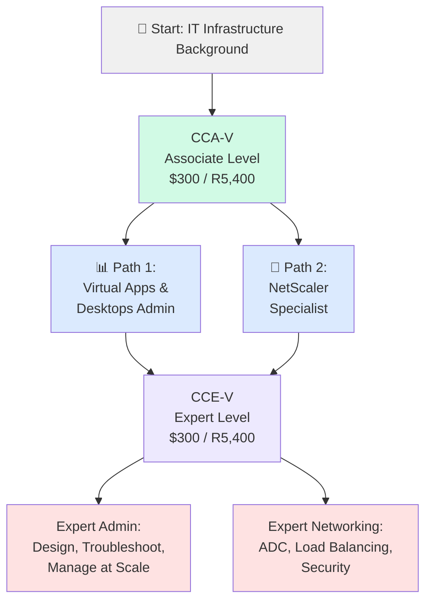
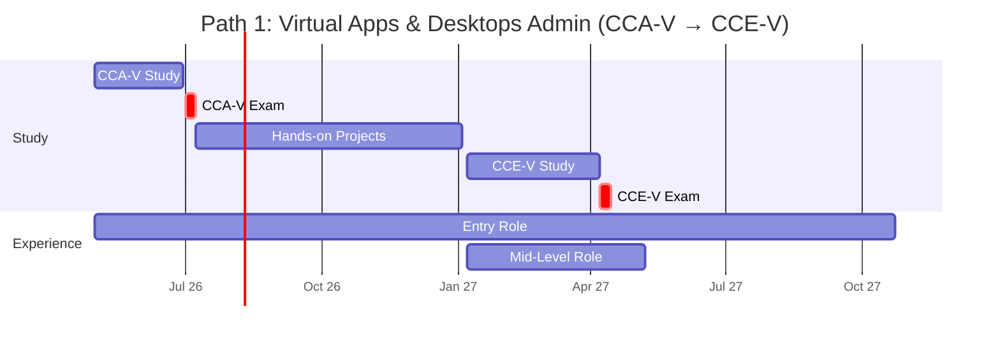
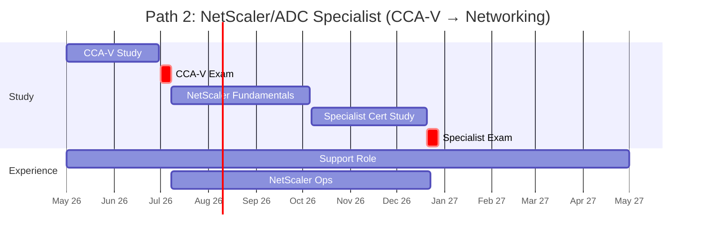
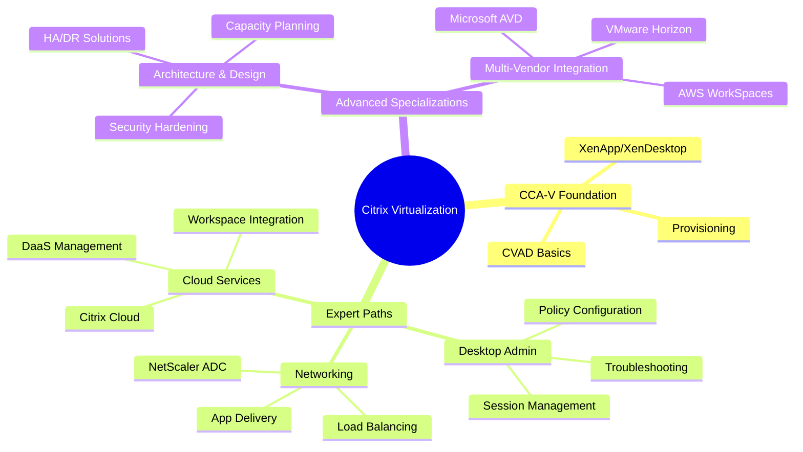
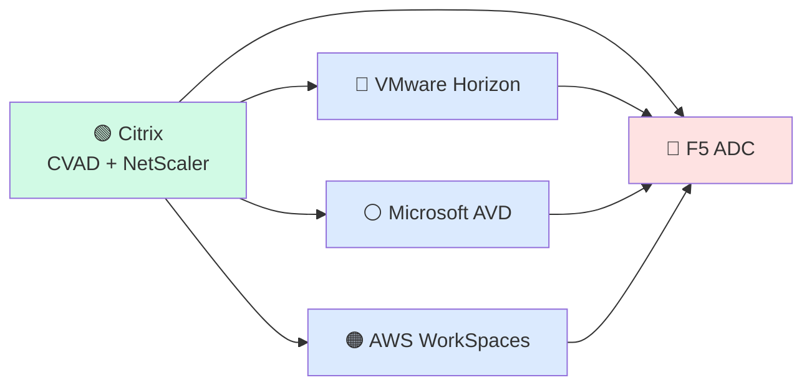

# Citrix Certification Roadmap

## Overview

Citrix is a leader in virtualization and digital workspace solutions, now operating under Cloud Software Group (acquired in 2024). The certification roadmap focuses on **Citrix Virtual Apps and Desktops (CVAD)** and **NetScaler ADC** technologies, which power enterprise VDI deployments, DaaS offerings, and application delivery networking.

As of 2025-2026, Citrix certifications maintain strong demand in enterprise environments where organizations manage hybrid cloud, on-premises, and remote workforce infrastructure. The two core certification tiers—**Associate (CCA-V)** and **Expert (CCE-V)**—provide pathways for infrastructure specialists, system administrators, and network engineers seeking to validate expertise in modern workplace solutions.

**Key ecosystem components:**
- **Citrix Virtual Apps and Desktops (CVAD)**: Server-based computing and desktop virtualization
- **NetScaler ADC**: Application delivery controller for load balancing and optimization
- **Citrix Cloud**: SaaS-based management platform
- **XenApp & XenDesktop**: Legacy terminology (now bundled as CVAD)

---

## Progression Diagram



---

## Citrix Certified Associate – Virtualization (CCA-V)

| Field | Details |
|-------|---------|
| **Time to complete** | 4-8 weeks of study; 2-hour exam |
| **Total cost (USD)** | $300 |
| **Total cost (ZAR)** | R5,400 |
| **Prerequisites** | None formal; IT fundamentals recommended |
| **Experience required** | 6-12 months hands-on with virtualization or desktop management |
| **Job titles** | Virtualization Support Technician, Desktop Support Specialist, IT Infrastructure Specialist, Systems Administrator (entry) |
| **Salary USD** | $75,000 - $92,000 annually |
| **Salary ZAR** | R1,350,000 - R1,656,000 annually |
| **Job market demand** | Moderate to High (enterprise environments) |
| **Active job postings** | 400-600 globally; 50-100 in major metros |
| **YoY growth** | +4-6% (stable enterprise market) |
| **Source** | Citrix Training Portal, Indeed Job Market Analysis (2026) |

**What you'll learn:**
- CVAD architecture and components
- Virtual machine provisioning and management
- User session management and load balancing
- Troubleshooting and performance tuning
- Security basics for virtual desktops
- XenApp and XenDesktop administration

**Exam format:**
- 50-60 multiple-choice questions
- 90 minutes to complete
- Passing score: ~70%

---

## Citrix Certified Expert – Virtualization (CCE-V)

| Field | Details |
|-------|---------|
| **Time to complete** | 10-16 weeks of study; 2-hour exam |
| **Total cost (USD)** | $300 |
| **Total cost (ZAR)** | R5,400 |
| **Prerequisites** | CCA-V certification recommended; equivalent experience acceptable |
| **Experience required** | 2+ years in CVAD administration; design and troubleshooting expertise |
| **Job titles** | Senior Systems Administrator, Infrastructure Architect, Citrix Solutions Architect, Technical Lead, Enterprise Systems Engineer |
| **Salary USD** | $110,000 - $152,000 annually |
| **Salary ZAR** | R1,980,000 - R2,736,000 annually |
| **Job market demand** | High (specialized role) |
| **Active job postings** | 250-400 globally; 40-70 in major metros |
| **YoY growth** | +5-8% (rising with cloud adoption) |
| **Source** | Citrix Training Portal, LinkedIn Salary Data (2026) |

**What you'll learn:**
- Advanced CVAD architecture and design patterns
- High-availability and disaster recovery configurations
- NetScaler ADC integration and optimization
- Security hardening and compliance
- Performance monitoring and capacity planning
- Migration strategies from legacy XenApp/XenDesktop
- Citrix Cloud platform administration

**Exam format:**
- 60-70 multiple-choice and scenario-based questions
- 120 minutes to complete
- Passing score: ~75%

---

## Recommended Progression Paths

### Path 1: Virtual Apps & Desktops Administrator

**Timeline: 18 months** | Salary progression: $75K → $92K → $110K+ USD



**Stage 1 (Months 0-2): Exam Prep & Associate Certification**
- Take CCA-V exam within 8 weeks
- Score CCA-V badge on Credly
- Start junior virtualization support role

**Stage 2 (Months 2-12): Practical Experience**
- Deploy and manage CVAD environments (single-server to multi-server)
- Troubleshoot user session connectivity and performance
- Implement user policies and resource optimization
- Gain experience with XenApp and XenDesktop administration
- Complete manufacturer-recommended labs and simulations

**Stage 3 (Months 12-18): Expert Certification**
- Pursue CCE-V certification
- Lead design projects for medium-sized deployments
- Architect high-availability configurations
- Mentor junior team members
- Transition to mid-level infrastructure or solutions architect role

**Best for:**
- System administrators seeking depth in virtual desktop management
- Infrastructure teams building enterprise workspace solutions
- Career advancement toward architecture and consulting

---

### Path 2: NetScaler/ADC Specialist

**Timeline: 12 months** | Salary progression: $75K → $92K+ USD



**Stage 1 (Months 0-2): Foundation & Associate**
- Complete CCA-V certification quickly (4-6 weeks)
- Focus on application delivery concepts
- Deploy test NetScaler instances in lab environments

**Stage 2 (Months 2-7): Networking Deep Dive**
- Learn NetScaler ADC architecture (virtual servers, services, policies)
- Configure load balancing, SSL/TLS, and optimization
- Study application delivery networking principles
- Implement policies for Citrix CVAD optimization
- Hands-on lab work with virtual and physical ADC

**Stage 3 (Months 7-12): Specialist Certification**
- Pursue Citrix NetScaler Specialist certification (or equivalent)
- Deploy production ADC configurations
- Optimize application delivery for remote users
- Integrate ADC with CVAD for secure app publishing
- Transition to dedicated NetScaler/networking specialist role

**Best for:**
- Network engineers expanding into application delivery
- Infrastructure teams needing ADC expertise
- Organizations running heavy remote workspace deployments
- Career path toward F5, Palo Alto, or multi-vendor networking

---

## Prerequisites & Sequencing Matrix

| Certification | Formal Prerequisites | Recommended Experience | Study Sequence | Min. Months |
|---------------|----------------------|------------------------|-----------------|-------------|
| CCA-V | None | 6-12 months IT/virtualization | Start here | 2 |
| CCE-V | CCA-V recommended | 2+ years CVAD admin + design | After CCA-V | 4-6 |
| NetScaler Specialist | CCA-V helpful | 1+ year network ops + ADC theory | Parallel or after CCA-V | 4-5 |

**Sequencing logic:**
1. **CCA-V first**: Establishes baseline CVAD knowledge; required for credibility in both paths
2. **Path 1 (CVAD Admin)**: CCA-V → 6-12 months hands-on → CCE-V
3. **Path 2 (Networking)**: CCA-V → 4-6 months ADC study + NetScaler labs → Specialist cert
4. **Dual specialization**: Complete CCA-V + Path 1, then pivot to NetScaler for advanced multi-vendor architecture

---

## Specialization Branches



---

## Cross-Vendor Bridges



**Parallel certifications to consider:**

| Target | Overlap | Effort | Timeline |
|--------|---------|--------|----------|
| **VMware Horizon** | VDI/session management, architecture patterns | Medium | +4-6 months |
| **Microsoft AVD** | Cloud workspace, hybrid integration, Azure | Medium | +3-5 months |
| **AWS WorkSpaces** | Cloud VDI, AWS infrastructure, scaling | Medium-High | +5-7 months |
| **F5 ADC** | Advanced load balancing, app delivery, networking | High | +6-8 months |

---

## Cost Breakdown

### Certification Costs (Direct)

| Item | Cost USD | Cost ZAR | Notes |
|------|----------|----------|-------|
| CCA-V Exam | $300 | R5,400 | One-time fee; valid 3 years |
| CCE-V Exam | $300 | R5,400 | One-time fee; valid 3 years |
| **Total Certifications** | **$600** | **R10,800** | Two exams only |

### Learning Resources & Study Materials

| Resource | Cost USD | Cost ZAR | Type |
|----------|----------|----------|------|
| Citrix Training Portal (self-paced) | $200-$400 | R3,600-R7,200 | Online courses |
| Official exam study guide | $50-$100 | R900-R1,800 | Books/PDFs |
| Third-party practice exams | $100-$200 | R1,800-R3,600 | Exam prep |
| Lab environment (cloud-hosted) | $100-$300/month | R1,800-R5,400/month | Hands-on practice |
| Instructor-led training (optional) | $1,500-$3,000 | R27,000-R54,000 | 3-5 day bootcamp |
| **Total Study (est. 6 months)** | **$1,000-$2,500** | **R18,000-R45,000** | DIY approach |

### Total Investment Path (Self-Study)

**Minimum:** $600 (exams only)  
**Moderate:** $1,600 USD / R28,800 ZAR (exams + materials + cloud labs)  
**Premium:** $3,100-$5,600 USD / R55,800-R100,800 ZAR (with instructor training)

---

## Job Market Snapshot

### Current Demand (Q2 2026)

**Global data:**
- **CCA-V roles**: 400-600 open positions (Citrix-specific searches)
- **CCE-V roles**: 250-400 open positions (senior/architect level)
- **Job growth**: +4-6% YoY (stable enterprise market; cloud expansion offsetting on-prem decline)

**Geographic hot spots:**
- **North America**: 40% of global Citrix jobs (US: 35%, Canada: 5%)
- **Europe**: 30% (UK: 12%, Germany: 10%, Benelux: 8%)
- **Asia-Pacific**: 20% (Australia: 8%, Singapore: 7%, India: 5%)
- **EMEA (Africa/Middle East)**: 10% (South Africa, UAE)

### Salary & Benefits by Region

| Region | Entry (CCA-V) | Mid-Level | Expert (CCE-V) |
|--------|---------------|-----------|-----------------|
| **North America (USD)** | $75K-$92K | $95K-$125K | $130K-$170K |
| **Europe (EUR)** | €65K-€80K | €85K-€110K | €115K-€150K |
| **Australia (AUD)** | $95K-$115K | $120K-$155K | $160K-$210K |
| **South Africa (ZAR)** | R1.35M-R1.66M | R1.71M-R2.25M | R2.34M-R3.06M |

**Premium factors:**
- +10-15% for certifications (CCA-V, CCE-V)
- +15-25% for AWS/Azure/Citrix Cloud experience
- +20-30% for architecture/consulting roles
- +25-40% for NetScaler ADC specialization

---

## Salary Trajectory

### USD Salary Path

```mermaid
xychart-beta
    title Citrix Virtualization Career Salary Progression (USD)
    x-axis [Y1, Y2, Y3, Y5, Y7, Y10]
    y-axis "Annual Salary (USD)" 60000 --> 180000
    bar [75000, 92000, 110000, 132000, 152000, 170000]
```

### ZAR Salary Path (1 USD = 18 ZAR)

```mermaid
xychart-beta
    title Citrix Virtualization Career Salary Progression (ZAR)
    x-axis [Y1, Y2, Y3, Y5, Y7, Y10]
    y-axis "Annual Salary (ZAR)" 1080000 --> 3060000
    bar [1350000, 1656000, 1980000, 2376000, 2736000, 3060000]
```

**Career milestones:**
- **Y1 (CCA-V + entry role)**: $75K — Support technician, junior admin
- **Y2 (6-12 months hands-on)**: $92K — Infrastructure specialist, mid-level admin
- **Y3 (CCE-V + design experience)**: $110K — Senior admin, technical lead
- **Y5 (architecture + leadership)**: $132K — Solutions architect, team manager
- **Y7 (specialized expertise + certifications)**: $152K — Principal architect, consulting
- **Y10 (multi-vendor mastery + consulting)**: $170K+ — Director-level, consultant, CTO track

**Salary growth drivers:**
- Additional certifications (VMware, Microsoft, AWS)
- Consulting experience
- Team leadership/management
- Industry-specific expertise (financial services, healthcare, government)
- Geographic arbitrage (remote work for North American salaries)

---

## Common Questions

**Q: Do I need CCA-V to get CCE-V?**  
A: Not strictly required, but it's highly recommended. Most candidates complete CCA-V first to build foundational knowledge. You can attempt CCE-V with equivalent hands-on experience, but the barrier to entry is higher.

**Q: How long does each exam take?**  
A: CCA-V is 2 hours; CCE-V is 2 hours. Allow extra time for test center check-in and instructions.

**Q: Can I take both exams in one sitting?**  
A: No. You must pass CCA-V before scheduling CCE-V (or demonstrate equivalent experience for CCE-V directly).

**Q: Are Citrix certifications tied to specific software versions?**  
A: Certifications cover CVAD features across recent versions (typically current and 1-2 prior major releases). Updates to exam objectives occur annually.

**Q: What's the difference between CCA-V and other Citrix roles like NetScaler Specialist?**  
A: CCA-V focuses on Citrix Virtual Apps & Desktops administration. NetScaler Specialist covers application delivery networking. Both are valuable; choose based on your career direction (infrastructure admin vs. network engineer).

**Q: Is hands-on lab experience required?**  
A: Highly recommended, especially for CCE-V. Most candidates use cloud labs (AWS, Azure) or virtual machines to practice deployment, troubleshooting, and design scenarios.

**Q: How often can I retake the exam if I fail?**  
A: Citrix allows retakes after 14 days. There's no limit on attempts, but each attempt incurs the exam fee.

**Q: Do certifications expire?**  
A: Yes. Citrix certifications are valid for 3 years. Recertification requires retaking the exam or earning a higher-level credential.

**Q: What's the job market like for Citrix specialists right now?**  
A: Steady demand in enterprise environments; growth is moderate (+4-6% YoY) with expansion in cloud workspace services (Citrix Cloud, DaaS). Competition exists, but CCE-V holders command premium salaries and have more consultant/architectural opportunities.

---

## Official Sources

1. **Citrix Training & Certification**: https://www.citrix.com/training/citrix-certification/
2. **Citrix Training Portal**: https://training.citrix.com/
3. **Credly Badge Verification**: https://www.credly.com/organizations/citrix/badges
4. **Citrix Cloud Documentation**: https://docs.citrix.com/en-us/citrix-cloud
5. **Citrix Learning Paths**: https://training.citrix.com/learning-paths
6. **Exam Scheduling (Pearson VUE)**: https://www.pearsonvue.com/citrix
7. **Community Forum**: https://community.citrix.com/
8. **NetScaler Documentation**: https://docs.netscaler.com/

---

## Research Status

**Last verified:** 2026-05-02  
**Data sources:** Citrix official training portal, job market analysis (Indeed, LinkedIn), salary surveys (2026 global data), SARB currency rates  
**Certification data current as of:** Q2 2026  
**Next review date:** Q4 2026 (or upon major Cloud Software Group platform announcements)

**Known limitations:**
- Salary data represents global averages; regional variation is significant
- Job posting counts are estimates based on public data; actual openings fluctuate
- Exam pass rates not publicly disclosed by Citrix
- NetScaler specialist path based on industry trends; formal certification structure may evolve

---

*This roadmap is informational and based on public sources. Verify all details with Citrix official channels before making certification or career decisions.*
