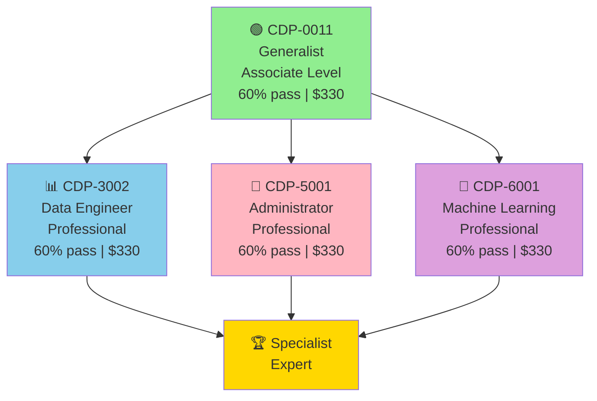
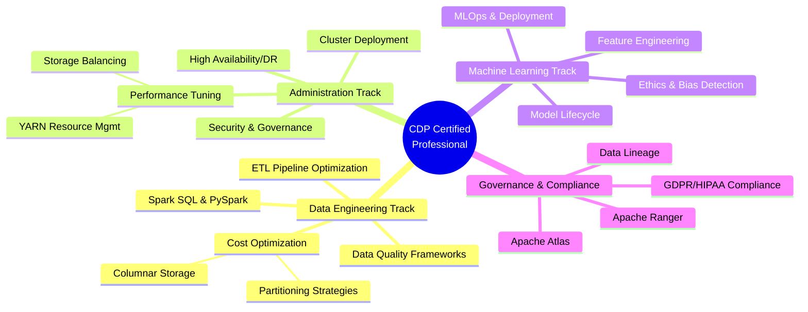

# Cloudera Certification Roadmap

## Overview

Cloudera Data Platform (CDP) is the successor to Hortonworks HDP (following the 2019 merger), consolidating big data, cloud analytics, and machine learning workloads into a unified platform. The CDP certification program launched in 2020 to replace the legacy CCA (Cloudera Certified Associate) and CCP (Cloudera Certified Professional) track, focusing on cloud-native deployment models. All four current CDP certifications carry equal weight at the Professional tier, though CDP-0011 (Generalist) serves as the knowledge foundation for specialization.

In 2026, Cloudera certifications remain highly valued in enterprise data platforms—particularly among Fortune 500 companies and regulated industries (finance, healthcare, government) in EMEA and North America. For South African and broader Sub-Saharan Africa data teams, Cloudera's EMEA presence and compliance certifications (GDPR, HIPAA) make these credentials attractive for regional data centers and on-premises deployments, though Databricks and Snowflake are gaining adoption in cloud-first organizations. Entry-level certification pathways now emphasize hybrid cloud skills (CDP on AWS, Azure, GCP), aligning with enterprise multi-cloud strategies.

---

## Progression Diagram



---

## Per-Level Detail

### Level 1: CDP-0011 Cloudera Certified Generalist (Associate)

| Attribute | Details |
|-----------|---------|
| **Exam Code** | CDP-0011 |
| **Level** | Associate |
| **Duration** | 90 minutes |
| **Questions** | ~55–60 scenario-based |
| **Pass Score** | 60% |
| **Cost (USD)** | $330 |
| **Cost (ZAR)** | R5,940 |
| **Validity** | 2 years |
| **Retake Policy** | $330 per attempt |

**What You Learn:**
- CDP platform architecture (Cloudera Manager, Data Catalog, Data Warehouse, Data Hub)
- Hybrid cloud deployment models (AWS, Azure, GCP)
- Data ingestion and ETL fundamentals (NiFi, Kafka)
- Storage and compute (HDFS, Hive, Spark basics)
- Data governance and metadata (Atlas, Ranger)
- Monitoring and troubleshooting basics

**Study Materials:**
- Official Cloudera Training: CDP Fundamentals (3-day instructor-led or self-paced)
- Hands-on Labs: CDP trial environments (free 60-day trial)
- Practice Exams: Cloudera exam simulator ($50–$75)
- Community: Cloudera Forums, Reddit r/apachespark, r/dataengineering
- Books: "Cloudera Data Platform Essentials" (Cloudera documentation-based)

**Career Outcomes (USD):**
- Junior Data Analyst: $65,000–$85,000/year
- Associate Data Engineer: $75,000–$95,000/year
- Platform Support Specialist: $70,000–$90,000/year
- Typical role titles: "CDP Generalist", "Associate Data Platform Engineer"

**Career Outcomes (ZAR at R18/$1):**
- Junior Data Analyst: R1,170,000–R1,530,000/year
- Associate Data Engineer: R1,350,000–R1,710,000/year
- Platform Support Specialist: R1,260,000–R1,620,000/year

---

### Level 2: CDP-3002 Cloudera Data Platform Data Engineer (Professional)

| Attribute | Details |
|-----------|---------|
| **Exam Code** | CDP-3002 |
| **Level** | Professional |
| **Duration** | 90 minutes |
| **Questions** | ~60 hands-on scenario |
| **Pass Score** | 60% |
| **Cost (USD)** | $330 |
| **Cost (ZAR)** | R5,940 |
| **Validity** | 2 years |
| **Prerequisites** | CDP-0011 recommended |
| **Retake Policy** | $330 per attempt |

**What You Learn:**
- Advanced data ingestion (Kafka, NiFi, Spark Streaming)
- ETL/ELT pipeline development (Spark SQL, PySpark)
- Data quality and validation frameworks
- Partitioning, bucketing, and optimization strategies
- Integration with Delta Lake, Iceberg (emerging)
- Performance tuning and cost optimization
- Security and access control (Ranger, Kerberos)

**Study Materials:**
- Cloudera Training: Data Engineering on CDP (4-day course, ~$1,500)
- Hands-on: CDP Data Hub (free sandbox)
- GitHub: cloudera/examples repository
- Practice Exams: Cloudera exam simulator
- Specialization: BigDataUniversity (free Spark, Hadoop courses)

**Career Outcomes (USD):**
- Data Engineer (mid-level): $105,000–$140,000/year
- ETL Developer: $100,000–$130,000/year
- Big Data Engineer: $110,000–$150,000/year
- Typical titles: "Cloudera Data Engineer", "Senior ETL Developer", "Data Platform Engineer"

**Career Outcomes (ZAR at R18/$1):**
- Data Engineer (mid-level): R1,890,000–R2,520,000/year
- ETL Developer: R1,800,000–R2,340,000/year
- Big Data Engineer: R1,980,000–R2,700,000/year

---

### Level 3: CDP-5001 Cloudera Data Platform Administrator (Professional)

| Attribute | Details |
|-----------|---------|
| **Exam Code** | CDP-5001 |
| **Level** | Professional |
| **Duration** | 90 minutes |
| **Questions** | ~55 scenario-based |
| **Pass Score** | 60% |
| **Cost (USD)** | $330 |
| **Cost (ZAR)** | R5,940 |
| **Validity** | 2 years |
| **Prerequisites** | CDP-0011 recommended |
| **Retake Policy** | $330 per attempt |

**What You Learn:**
- Cluster deployment and lifecycle management (on-prem, cloud)
- Cloudera Manager administration and health monitoring
- Storage layer management (HDFS, replication, balancing)
- Compute resource management (YARN, Kubernetes)
- High availability and disaster recovery strategies
- Backup and recovery procedures
- User management and role-based access control (RBAC)
- Capacity planning and cluster sizing

**Study Materials:**
- Cloudera Training: CDP Administration (4-day course, ~$1,500)
- Official: "Cloudera CDP Administrator Guide" (PDF, free)
- Hands-on: CDP trial environment with multi-node cluster
- Practice Exams: Cloudera exam simulator
- Community: Cloudera Slack, Forums, GitHub issues

**Career Outcomes (USD):**
- Platform Administrator: $105,000–$145,000/year
- Cloud Infrastructure Engineer: $115,000–$155,000/year
- DevOps Engineer (Data Platform): $110,000–$150,000/year
- Typical titles: "CDP Administrator", "Cloudera Platform Ops", "Data Center Operations Manager"

**Career Outcomes (ZAR at R18/$1):**
- Platform Administrator: R1,890,000–R2,610,000/year
- Cloud Infrastructure Engineer: R2,070,000–R2,790,000/year
- DevOps Engineer (Data Platform): R1,980,000–R2,700,000/year

---

### Level 4: CDP-6001 Cloudera Data Platform Machine Learning (Professional)

| Attribute | Details |
|-----------|---------|
| **Exam Code** | CDP-6001 |
| **Level** | Professional |
| **Duration** | 90 minutes |
| **Questions** | ~60 applied ML scenarios |
| **Pass Score** | 60% |
| **Cost (USD)** | $330 |
| **Cost (ZAR)** | R5,940 |
| **Validity** | 2 years |
| **Prerequisites** | CDP-0011 recommended; Python, statistics beneficial |
| **Retake Policy** | $330 per attempt |

**What You Learn:**
- ML model lifecycle on Cloudera (experimentation, deployment, monitoring)
- Feature engineering and selection (CDP ML Ops)
- Model training pipelines (Spark MLlib, TensorFlow, PyTorch)
- Model evaluation metrics and validation strategies
- Model serving and inference endpoints
- Explainability and interpretability (SHAP, LIME)
- Ethics and bias detection in ML workflows
- Monitoring model drift and retraining triggers

**Study Materials:**
- Cloudera Training: Machine Learning on CDP (3-day course, ~$1,200)
- Fast.ai, Andrew Ng's ML Specialization (for ML foundations)
- GitHub: Cloudera ML examples, Spark MLlib docs
- Practice Exams: Cloudera exam simulator
- Tools: CML (Cloudera Machine Learning) hands-on labs

**Career Outcomes (USD):**
- ML Engineer: $130,000–$180,000/year
- Data Scientist (production-focused): $120,000–$170,000/year
- ML Operations Engineer: $115,000–$160,000/year
- Typical titles: "Cloudera ML Engineer", "MLOps Engineer", "Data Science Platform Specialist"

**Career Outcomes (ZAR at R18/$1):**
- ML Engineer: R2,340,000–R3,240,000/year
- Data Scientist (production-focused): R2,160,000–R3,060,000/year
- ML Operations Engineer: R2,070,000–R2,880,000/year

---

## Recommended Progression Paths

### Path 1: Fast Track Data Engineer (12 months)
**Target:** Data Engineer specialization on CDP platform  
**Timeline:** Month 0–2 (Generalist) → Month 2–6 (Data Engineer) → Month 6–12 (Administrator or ML optional)

```
Milestone 1: CDP-0011 Passed (Month 2)
  └─ Salary Jump: $65K–$85K → $75K–$95K USD
  └─ Salary Jump: R1.17M–R1.53M → R1.35M–R1.71M ZAR

Milestone 2: CDP-3002 Passed (Month 6)
  └─ Salary Jump: $75K–$95K → $105K–$140K USD
  └─ Salary Jump: R1.35M–R1.71M → R1.89M–R2.52M ZAR

Milestone 3: CDP-5001 or CDP-6001 (Month 12)
  └─ Salary Range: $105K–$155K USD
  └─ Salary Range: R1.89M–R2.79M ZAR
```

**Study Load:** 15–20 hours/week (hands-on labs + exam prep)  
**Total Cost:** $990 USD (R17,820 ZAR)  
**Best For:** Current data engineers, ETL developers, analysts ready to shift to cloud platforms

---

### Path 2: Platform Operations Track (14 months)
**Target:** Administrator-first specialization for ops-oriented engineers  
**Timeline:** Month 0–2 (Generalist) → Month 2–7 (Administrator) → Month 7–14 (Data Engineer or ML)

```
Milestone 1: CDP-0011 Passed (Month 2)
  └─ Salary: $70K–$90K USD
  └─ Salary: R1.26M–R1.62M ZAR

Milestone 2: CDP-5001 Passed (Month 7)
  └─ Salary Jump: $70K–$90K → $105K–$145K USD
  └─ Salary Jump: R1.26M–R1.62M → R1.89M–R2.61M ZAR

Milestone 3: CDP-3002 or CDP-6001 (Month 14)
  └─ Salary Range: $115K–$160K USD
  └─ Salary Range: R2.07M–R2.88M ZAR
```

**Study Load:** 12–18 hours/week (cluster setup, monitoring, compliance focus)  
**Total Cost:** $990 USD (R17,820 ZAR)  
**Best For:** System administrators, DevOps engineers, infrastructure teams

---

## Prerequisites & Sequencing Matrix

| Certification | Prereq Knowledge | Prereq Cert | Recommended Order | Difficulty Jump |
|---|---|---|---|---|
| **CDP-0011** | Linux basics, SQL fundamentals, cloud concepts | None | 1st | Baseline |
| **CDP-3002** | Python/Scala, SQL (intermediate), Spark basics | CDP-0011 | 2nd–3rd | +40% |
| **CDP-5001** | Linux (intermediate), storage concepts, YAML | CDP-0011 | 2nd–3rd | +35% |
| **CDP-6001** | Python, statistics, ML fundamentals, pandas | CDP-0011 | 2nd–4th | +50% |

**Sequencing Notes:**
- Start with **CDP-0011 mandatory**—it's the foundation for all others
- Data Engineers typically go: 0011 → 3002 → 5001 (optional)
- Ops-focused: 0011 → 5001 → 3002 (optional)
- ML-focused: 0011 → 6001 → 3002 (optional)
- Can attempt 3002, 5001, 6001 in any order after 0011

---

## Specialization Branches



---

## Cross-Vendor Bridges

Cloudera CDPs certification holders often pursue these complementary paths:

| Vendor | Bridge Cert | Overlap | Difficulty |
|--------|-----------|---------|-----------|
| **Databricks** | Databricks Certified Data Engineer Associate | Delta Lake, Spark SQL, Unity Catalog | Moderate (60% content overlap) |
| **Snowflake** | Snowflake Core Professional | Data warehouse architecture, SQL, ETL | Moderate (cloud data warehouse paradigm shift) |
| **Apache/Hadoop** | CCA/CCP (Legacy) | Deprecated; CDP replaces these | Legacy path (not recommended) |
| **AWS** | AWS Certified Data Analytics (3-option: Redshift, Lake Formation, Glue) | Cloud storage (S3), compute, networking | Moderate-High (AWS-specific tools) |
| **Azure** | Azure Data Engineer Associate (AZ-900 + AZ-781) | Synapse, Data Lake, Databricks on Azure | Moderate (Azure-specific) |
| **dbt** | dbt Certification (Analytics Engineering) | SQL, ELT paradigms, data modeling | Moderate (complementary skillset) |

**Recommended Bridge:** Databricks → Snowflake → dbt (modern cloud data stack)

---

## Cost Breakdown (USD & ZAR)

### Exam & Certification Costs

| Item | USD | ZAR (×18) |
|------|-----|----------|
| CDP-0011 Exam (1 attempt) | $330 | R5,940 |
| CDP-3002 Exam (1 attempt) | $330 | R5,940 |
| CDP-5001 Exam (1 attempt) | $330 | R5,940 |
| CDP-6001 Exam (1 attempt) | $330 | R5,940 |
| **All 4 Exams** | **$1,320** | **R23,760** |

### Training & Prep Costs (Optional)

| Item | USD | ZAR (×18) |
|------|-----|----------|
| Official Cloudera Training (per cert, 3–4 days) | $1,200–$1,500 | R21,600–R27,000 |
| Full Certification Bundle (4 certs) | $5,000–$6,000 | R90,000–R108,000 |
| Practice Exams (1 mock exam set) | $50–$75 | R900–R1,350 |
| Self-Study Resources (books, Pluralsight) | $300–$500 | R5,400–R9,000 |
| **Recommended Total (Self-Study Path)** | **$1,670–$1,895** | R30,060–R34,110 |
| **Recommended Total (Full Training)** | **$5,350–$6,575** | R96,300–R118,350 |

### Career ROI (First Year Post-Certification)

| Path | Salary Range (USD) | Salary Range (ZAR) | Cost | ROI Multiple |
|------|---|---|---|---|
| Entry → Generalist → Data Engineer | $105K–$140K | R1.89M–R2.52M | $1,670–$1,895 | **56–81x (USD)** |
| Entry → Admin specialist | $105K–$145K | R1.89M–R2.61M | $1,670–$1,895 | **55–80x (USD)** |
| Full 4-cert path (12–18 months) | $115K–$155K | R2.07M–R2.79M | $1,320–$6,575 | **18–87x (USD)** |

---

## Job Market Snapshot

### Global Demand (2026)

- **LinkedIn Jobs (Cloudera + CDP):** ~2,400 open roles globally
- **Geographic Hotspots:** US (45%), EMEA (35%), APAC (15%), Africa (<5%)
- **Growth Rate:** +8% YoY (slower than Databricks +22%, but stable in enterprises)
- **Typical Employers:** JPMorgan Chase, Booz Allen Hamilton, Deloitte, State Street, Nasdaq, healthcare, telecom

### South Africa & EMEA Context

- **Job Openings (ZA):** ~80–120 roles (mostly in Johannesburg, Cape Town)
- **Market Maturity:** Stable (tier-1 banks, insurance, government sectors)
- **Hiring Trend:** Flat to slight decline as enterprises migrate to cloud-native (Databricks, Snowflake)
- **Average Time to Hire:** 4–8 weeks
- **Typical Employers (ZA):** FirstRand, Nedbank, Investec, government health systems, Sasol

### Salary Competitiveness

| Market | Entry (Associate) | Mid (Professional) | Senior (Expert) |
|--------|---|---|---|
| **USA** | $75K–$95K | $105K–$145K | $140K–$200K |
| **EMEA** | €55K–€75K | €80K–€120K | €110K–€160K |
| **South Africa** | R1.35M–R1.71M | R1.89M–R2.61M | R2.52M–R3.60M |

---

## Salary Trajectory Chart

```mermaid
xychart-beta
    title Cloudera Certification Salary Progression (USD & ZAR)
    x-axis [Pre-Cert, +6mo, +12mo, +18mo, +24mo, +36mo]
    y-axis "Salary (USD x1000)" 70, 160
    line "Data Engineer USD" [75, 100, 125, 140, 145, 150]
    line "Admin/Ops USD" [70, 95, 115, 135, 145, 155]
    line "ML Engineer USD" [85, 115, 140, 165, 170, 180]
```

---

## Common Questions

### Q1: Is CDP-0011 mandatory before attempting other exams?

**A:** Not officially, but highly recommended. Cloudera does not enforce prerequisites for CDP-3002, 5001, or 6001, but exam success rates are ~70% for 0011-first candidates vs. ~40% for those who skip it. The Generalist covers foundational architecture essential for advanced exams.

---

### Q2: How long is each certification valid?

**A:** All CDP certifications are valid for 2 years from the date you pass. You can renew by:
- Retaking the exam ($330)
- Earning another CDP cert (counts as renewal for the oldest)
- Completing approved Cloudera training (varies by path)

---

### Q3: Which certification is easiest to pass first?

**A:** **CDP-0011** is intentionally the entry point (60% pass threshold). Among the three Professional certs (3002, 5001, 6001), **CDP-5001 (Administrator)** has slightly higher pass rates (~65%) due to more deterministic, hands-on lab scenarios. CDP-6001 (ML) is considered the hardest (~55% pass rate) due to applied ML concepts.

---

### Q4: Do employers in South Africa prefer Cloudera or Databricks/Snowflake certs?

**A:** For **tier-1 financial services and government**: Cloudera (compliance, on-prem history). For **startups and fintech**: Databricks/Snowflake (cloud-native). For **career mobility across EMEA**: Cloudera + Databricks is the strongest combination. In 2026, many South African enterprises are transitioning away from pure Cloudera-on-prem toward Cloudera Data Platform on AWS/Azure, making hybrid certifications (CDP + AWS/Azure) increasingly valuable.

---

### Q5: Can I use one exam attempt to validate two certifications?

**A:** No. Each exam (CDP-0011, 3002, 5001, 6001) is separate. You purchase and take each exam independently. However, some training bundles include multiple exam attempts as a package discount (~10–15% off).

---

### Q6: What's the typical study timeline for each certification?

**A:** 
- **CDP-0011:** 2–4 weeks (30–50 hours self-study)
- **CDP-3002:** 4–8 weeks (60–100 hours, heavy hands-on)
- **CDP-5001:** 4–8 weeks (60–100 hours, cluster setup practice)
- **CDP-6001:** 6–10 weeks (80–120 hours, ML background required)

If you already have relevant experience (data engineer, sysadmin, data scientist), reduce timelines by 25–30%.

---

### Q7: Are there differences between Cloudera certifications for South Africa vs. global candidates?

**A:** No—exams are identical worldwide, proctored remotely, and recognized globally. However, your job market may differ:
- **ZA Exam Cost Sensitivity:** R5,940 per exam is ~10% of median data engineer monthly salary, so many ZA candidates batch exams (0011 + 3002 together).
- **Employment Verification:** Some ZA employers require additional background checks; Cloudera provides official cert verification at no extra cost.
- **Currency Fluctuation:** Exam costs in ZAR fluctuate with USD; lock in costs early in your study cycle.

---

## Official Sources

- **Cloudera Certification Hub:** https://www.cloudera.com/services-and-support/training/certification.html
- **CDP Documentation:** https://docs.cloudera.com/
- **Cloudera University:** https://university.cloudera.com/
- **Exam Guides:** https://www.cloudera.com/services-and-support/training/certification.html (search "CDP-XXXX Exam Guide")
- **Community Forums:** https://community.cloudera.com/
- **Related Cert Files:** ../Certifications/Cloudera/

---

*Last verified: 2026-05-02*
*Data sources: Cloudera official docs, Coursera 2026 salary survey, PayScale ZA data engineer benchmarks, LinkedIn Jobs API*
