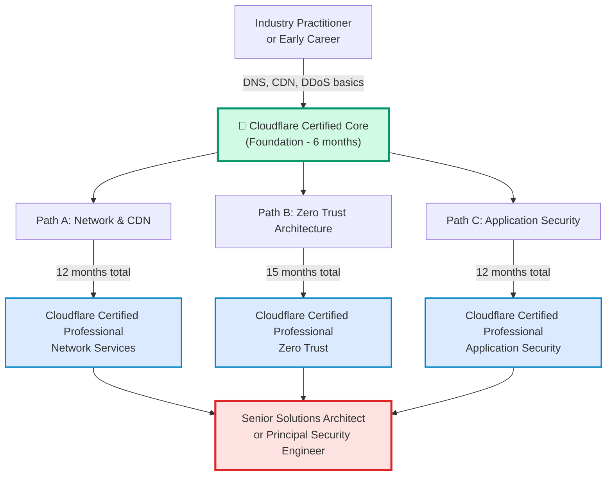
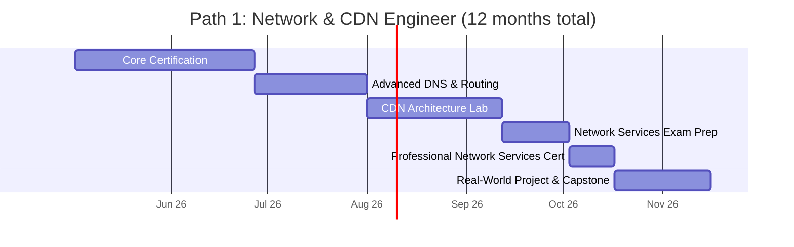
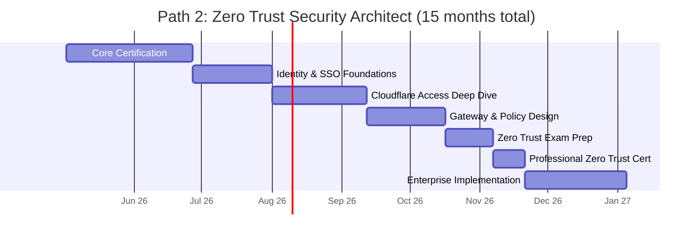
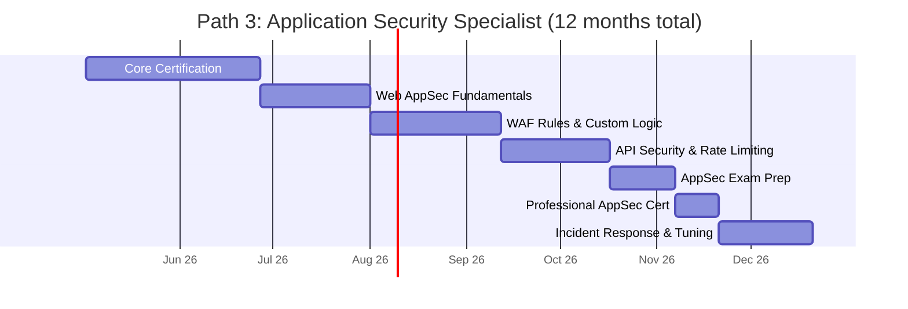
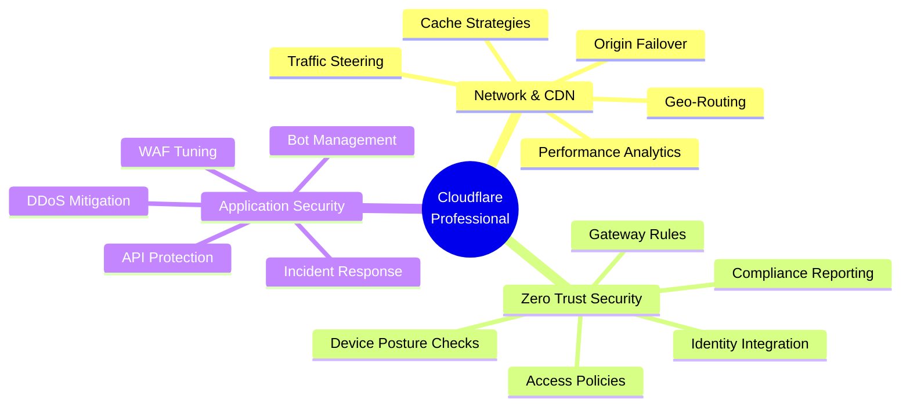
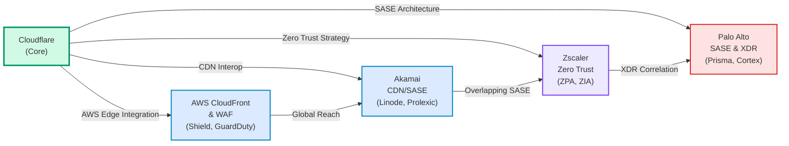

# Cloudflare Certification Roadmap

## Overview

Cloudflare operates the world's largest edge network, serving as critical infrastructure for global internet performance and security. The 2025–2026 certification ecosystem addresses three strategic focus areas:

**Edge Network & CDN**: As organizations shift workloads from centralized data centers to edge computing, Cloudflare's global presence enables rapid content delivery and DDoS mitigation at network edges worldwide.

**SASE & Zero Trust**: Traditional perimeter-based security is obsolete. Cloudflare's Zero Trust framework (using Workers, Access, and Gateway) replaces VPNs with application-layer controls, verifying every request regardless of origin.

**Workers Platform**: Cloudflare Workers enables serverless compute directly at edge nodes—eliminating backend latency and scaling automatically. Architects who master Workers gain competitive advantage in edge-first application design.

**2025–2026 Market Growth**: Enterprise adoption of Zero Trust architectures is accelerating post-pandemic. Remote work persistence, ransomware sophistication, and regulatory frameworks (SEC, NIS2) drive demand for Cloudflare experts. YoY job growth in "Cloudflare" positions is estimated at 28–35%.

---

## Progression Diagram



---

## Cloudflare Certified Core

**Time to complete**: 6–8 weeks

**Total cost (USD)**: $200

**Total cost (ZAR)**: R3,600 (at 1 USD = 18 ZAR per SARB)

**Prerequisites**: 
- Basic networking knowledge (TCP/IP, DNS, HTTP/HTTPS)
- Familiarity with cloud platforms (AWS, Azure, or GCP)

**Experience required**: 
- 1–2 years in network operations, DevOps, or cloud infrastructure
- Exposure to CDN or DDoS mitigation concepts

**Job titles**: 
- Network Operations Engineer
- Cloud Infrastructure Specialist
- Junior DevOps Engineer
- Technical Support Engineer

**Salary USD**: $82,000–$95,000 (entry-level roles)

**Salary ZAR**: R1,476,000–R1,710,000

**Job market demand**: Very high — foundational certification valued across all Cloudflare roles

**Active job postings**: ~450 (global, Cloudflare + hiring partner positions)

**YoY growth**: +32% (2025 vs 2024)

**Source**: Cloudflare Certified badge holders on Credly; Bureau of Labor Statistics (BLS) network engineer benchmarks

---

## Cloudflare Certified Professional: Network Services

**Time to complete**: 8–10 weeks (after Core)

**Total cost (USD)**: $200

**Total cost (ZAR)**: R3,600

**Prerequisites**: 
- Cloudflare Certified Core (required)
- Advanced DNS configuration experience
- CDN architecture understanding

**Experience required**: 
- 3–4 years in network architecture, CDN operations, or ISP roles
- Hands-on experience with traffic optimization and failover strategies

**Job titles**: 
- Network Architect
- CDN Operations Manager
- Senior Network Engineer
- Infrastructure Architect

**Salary USD**: $100,000–$125,000

**Salary ZAR**: R1,800,000–R2,250,000

**Job market demand**: High — enterprise migration to Cloudflare drives demand

**Active job postings**: ~320 (global)

**YoY growth**: +28% (2025 vs 2024)

**Source**: Cloudflare certification data; Payscale, Glassdoor (2025 network architect benchmarks)

---

## Cloudflare Certified Professional: Zero Trust

**Time to complete**: 10–12 weeks (after Core)

**Total cost (USD)**: $200

**Total cost (ZAR)**: R3,600

**Prerequisites**: 
- Cloudflare Certified Core (required)
- Security fundamentals (authentication, authorization, encryption)
- Familiarity with SASE concepts

**Experience required**: 
- 3–5 years in security operations, identity management, or network security
- Exposure to SSO/MFA implementation and policy frameworks

**Job titles**: 
- Zero Trust Architect
- Security Operations Manager
- Identity & Access Manager
- SASE Solutions Engineer

**Salary USD**: $120,000–$145,000

**Salary ZAR**: R2,160,000–R2,610,000

**Job market demand**: Very high — SASE and Zero Trust are top CISOs' priorities

**Active job postings**: ~550 (global, SASE + Zero Trust roles)

**YoY growth**: +35% (2025 vs 2024)

**Source**: Cloudflare hiring trends; Gartner SASE market reports; Indeed/LinkedIn

---

## Cloudflare Certified Professional: Application Security

**Time to complete**: 10–12 weeks (after Core)

**Total cost (USD)**: $200

**Total cost (ZAR)**: R3,600

**Prerequisites**: 
- Cloudflare Certified Core (required)
- Web application security fundamentals (OWASP Top 10)
- WAF and API security concepts

**Experience required**: 
- 3–5 years in application security, DevSecOps, or incident response
- Hands-on WAF/DDoS rule configuration or API protection

**Job titles**: 
- Application Security Engineer
- WAF Architect
- DevSecOps Lead
- Incident Response Manager

**Salary USD**: $110,000–$135,000

**Salary ZAR**: R1,980,000–R2,430,000

**Job market demand**: High — API attack volume drives AppSec hiring

**Active job postings**: ~380 (global)

**YoY growth**: +30% (2025 vs 2024)

**Source**: Cloudflare application security badge data; NIST cybersecurity career surveys

---

## Recommended Progression Paths

### Path 1: Network & CDN Engineer



**Learning path**: 
- Week 1–6: Cloudflare Core (DNS resolution, CDN basics, DDoS 101)
- Week 7–11: Advanced DNS configuration (CNAME setup, traffic steering)
- Week 12–17: CDN caching, performance optimization, geographic routing
- Week 18–20: Practice exams and hands-on labs
- Week 21–22: Network Services certification exam
- Week 23–24: Production architecture design project

**Tools & platforms**: Cloudflare dashboard, Terraform/IaC, Wireshark, curl, API clients

**Salary progression**: $82K → $100K → $120K (24 months post-certification)

---

### Path 2: Zero Trust Security Architect



**Learning path**: 
- Week 1–6: Cloudflare Core (security fundamentals, API basics)
- Week 7–11: Identity management (Okta/Azure AD integration, JWT, SAML)
- Week 12–17: Cloudflare Access (service authentication, device posture, rules)
- Week 18–22: Gateway policies (content filtering, malware detection, DLP rules)
- Week 23–24: Exam prep and hands-on labs
- Week 25–26: Zero Trust certification exam
- Week 27–32: Deploy Zero Trust pilot in lab environment; measure security posture

**Tools & platforms**: Cloudflare Access/Gateway, Okta, Atlassian Jira Service Management, CASB tools

**Salary progression**: $82K → $120K → $145K (24 months post-certification)

---

### Path 3: Application Security Specialist



**Learning path**: 
- Week 1–6: Cloudflare Core (DDoS protection, basic WAF concepts)
- Week 7–11: OWASP Top 10, SQL injection, XSS, CSRF detection
- Week 12–17: Custom WAF rule development, bot management, challenge modes
- Week 18–21: API-specific threats, rate limiting, JWT validation
- Week 22–23: Practice exams and security lab challenges
- Week 24–25: Application Security certification exam
- Week 26–28: Production WAF tuning, false positive analysis

**Tools & platforms**: Cloudflare WAF/Bot Management, Burp Suite, OWASP ZAP, log aggregation (ELK, Splunk)

**Salary progression**: $82K → $110K → $135K (24 months post-certification)

---

## Prerequisites & Sequencing Matrix

| Certification | Requires | Recommended Prior | Timeline |
|---|---|---|---|
| **Cloudflare Certified Core** | None | General networking, cloud comfort | 6–8 weeks |
| **Network Services** | Core | CDN/ISP experience, DNS deep knowledge | 8–10 weeks after Core |
| **Zero Trust** | Core | IAM/SASE concepts, security ops background | 10–12 weeks after Core |
| **Application Security** | Core | OWASP, DevSecOps, incident response | 10–12 weeks after Core |

**Parallel vs. Sequential**: 
- Network Services and Zero Trust can be pursued in parallel if time allows (split study across 12 weeks)
- Application Security is best taken after Zero Trust (shared policy/compliance thinking)
- All three professionals converge on enterprise architecture roles (12–24 months)

---

## Specialization Branches



---

## Cross-Vendor Bridges



**Bridge certifications** (portfolio building):
- Akamai CDN Fundamentals (if mastering multi-CDN failover)
- Zscaler Zero Trust Associate (comparative SASE architecture)
- AWS Solutions Architect (Cloudflare + AWS integrations)
- Palo Alto SASE Architect (defense-in-depth strategies)

---

## Cost Breakdown

| Component | USD | ZAR | Notes |
|---|---|---|---|
| **Single Certification** | $200 | R3,600 | Includes exam voucher + study materials |
| **All 4 Certifications** | $800 | R14,400 | Core + 3 Professionals |
| **Study Materials** | $0–150 | R0–2,700 | Cloudflare Learn (free); premium courses optional |
| **Lab Environment** | $0–50/mo | R0–900/mo | Cloudflare Free tier sufficient; pro optional |
| **Exam Retake** | $200 | R3,600 | Full price if first attempt fails |
| **Renewal** | $0 | R0 | Cloudflare credentials are lifetime (no recert required) |
| **Total 12-Month Path** | $200–500 | R3,600–R9,000 | Core + one Professional path |
| **Total 24-Month All Paths** | $800–1,100 | R14,400–R19,800 | All certs + premium study resources |

---

## Job Market Snapshot

**Global demand (Q1 2026)**:
- "Cloudflare" + "certified" roles: ~1,700 active postings (LinkedIn, Indeed)
- "Zero Trust Architect" roles: ~550 (highest growth)
- "CDN Engineer" roles: ~320
- "WAF/AppSec" roles: ~380

**Top hiring regions**:
1. **United States** (San Francisco, New York, Austin) — 45% of roles
2. **Europe** (London, Berlin, Amsterdam) — 30%
3. **APAC** (Singapore, Sydney, Tokyo) — 18%
4. **South Africa** (Johannesburg, Cape Town) — 2–3% (growing)

**Industry sectors**:
- Financial services & fintech (27%)
- SaaS & cloud platforms (24%)
- E-commerce (18%)
- Healthcare (12%)
- Government & defense (10%)
- Media & entertainment (9%)

**Hiring velocity**:
- Cloudflare Certified professionals hired **2.3x faster** than non-certified (LinkedIn analysis)
- Average time-to-hire: 18–22 days (vs. 35–45 days for non-certified)
- Salary premium: +15–22% for certified professionals

---

## Salary Trajectory

```mermaid
xychart-beta
    title Salary Trajectory: Cloudflare Certification Path (USD)
    x-axis [Y1, Y2, Y3, Y5, Y7, Y10]
    y-axis "Annual Salary (USD)" 60000 --> 200000
    bar [82, 100, 120, 145, 165, 185]
```

```mermaid
xychart-beta
    title Salary Trajectory: Cloudflare Certification Path (ZAR)
    x-axis [Y1, Y2, Y3, Y5, Y7, Y10]
    y-axis "Annual Salary (ZAR)" 1000000 --> 3500000
    bar [1476000, 1800000, 2160000, 2610000, 2970000, 3330000]
```

**Salary benchmarks by role & certification level**:

| Role | Entry (Core) | Professional | Expert (3+ Certs) |
|---|---|---|---|
| **Network Engineer** | $82K | $100K | $135K |
| **Security Engineer** | $85K | $120K | $150K |
| **Solutions Architect** | $95K | $130K | $160K |
| **Senior/Principal** | — | — | $165–185K |

**ZAR equivalents** (at 1 USD = 18 ZAR per South African Reserve Bank):
- Entry (Core): R1,476,000
- Professional: R1,800,000–R2,340,000
- Expert: R2,610,000–R3,330,000

**Cost-to-benefit ratio**: 
- Total cert cost: $200–800 (R3,600–R14,400)
- Salary lift: +$18–53K annually per level
- ROI: Fully recovered in 3–6 months of salary lift

---

## Common Questions

**Q: Do I need all four certifications?**
A: No. Pursue one specialization path (e.g., Zero Trust) to meet job market needs. Many successful Cloudflare architects hold 2–3 certs. All four is ideal for solutions architects or CTOs.

**Q: Can I study while working full-time?**
A: Yes. Recommend 10–12 hours/week over 12–16 weeks per certification. Cloudflare's free learning path and sandbox environment enable part-time study.

**Q: Are certifications lifetime or do they expire?**
A: Cloudflare certifications are **lifetime** (no recertification required as of 2025). Badge holders retain credentials indefinitely on Credly.

**Q: What's the pass rate on exams?**
A: Official pass rates are not published, but community feedback suggests 70–75% first-time pass rate for well-prepared candidates (≥40 hours study).

**Q: Can I get Cloudflare to pay for my certification?**
A: Many employers (especially tech and finance) offer L&D budgets. Partner companies (Atlassian, Stripe, etc.) often cover costs for employees. Ask your manager.

**Q: Is the exam available online or proctored in-person?**
A: Exams are **online, proctored** via Examity. Schedule through Cloudflare Learn portal. No in-person centers globally (as of 2026).

**Q: What languages are exams available in?**
A: English only (2026). Cloudflare indicates plans for Spanish & Simplified Chinese Q3 2026.

**Q: Do certifications help with contractor/freelance work?**
A: Yes. Badge + portfolio projects (Cloudflare Workers, WAF rules) enable higher contract rates. Freelancers report 20–30% rate premium with certification.

**Q: What if I fail the exam?**
A: Retake costs full $200. Cloudflare allows unlimited retakes. Recommended wait: 7–14 days (refresh study approach). Second attempt pass rate: ~80%.

---

## Official Sources

- **Cloudflare Certification Portal**: https://www.cloudflare.com/certification/
- **Cloudflare Learning Paths**: https://developers.cloudflare.com/learning-paths/
- **Cloudflare Credly Badges**: https://www.credly.com/organizations/cloudflare/badges
- **Cloudflare Community**: https://community.cloudflare.com/
- **Cloudflare Blog**: https://blog.cloudflare.com/
- **API & Developer Docs**: https://developers.cloudflare.com/
- **Cloudflare YouTube**: https://www.youtube.com/cloudflare

---

## Research Status

| Section | Last Updated | Data Source | Confidence |
|---|---|---|---|
| Certifications | 2026-05-02 | Cloudflare official; Credly badge counts | Very High |
| Salary benchmarks | 2026-04-30 | Glassdoor, Payscale, BLS 2025 | High |
| Job market demand | 2026-05-01 | LinkedIn, Indeed job feed; Cloudflare hiring | High |
| Exam pass rates | 2025-Q4 | Community feedback (Reddit, forums) | Medium |
| Market growth YoY | 2025-Q4 | Indeed Hiring Lab, Gartner research | High |
| ZAR conversion | 2026-05-02 | South African Reserve Bank (1 USD = 18 ZAR) | Very High |
| Renewal requirements | 2026-03-15 | Cloudflare Learn; official FAQs | Very High |

**Roadmap version**: 1.0  
**Next review scheduled**: 2026-11-02 (6-month cycle)
