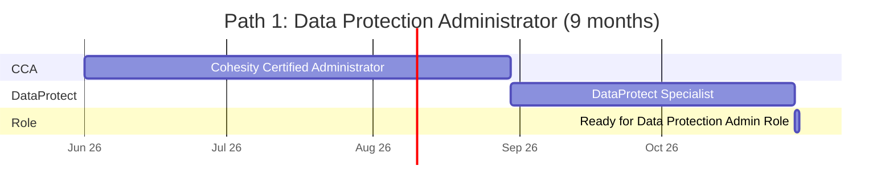
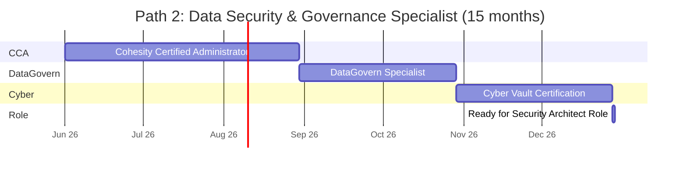
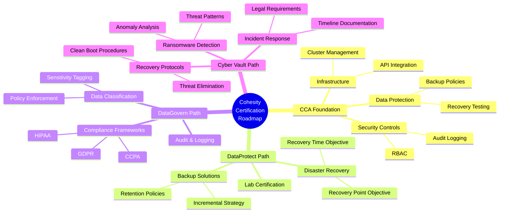
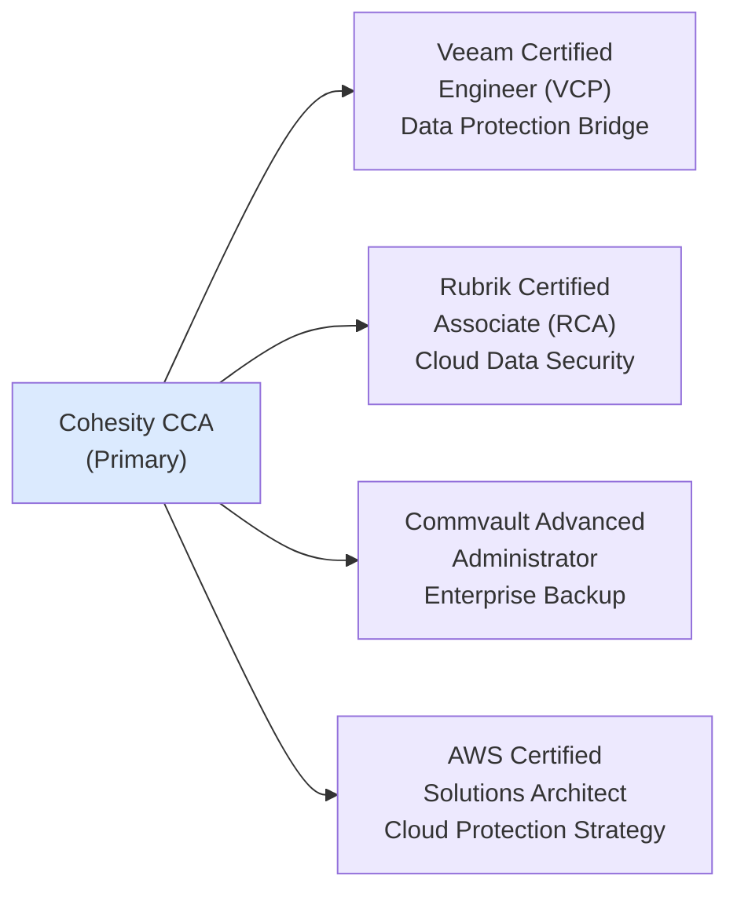

# Cohesity Certification Roadmap

## Overview

Cohesity has emerged as a leader in hyperconverged data management, providing unified solutions for data protection, ransomware recovery, and AI-driven security across hybrid cloud environments. The certification pathway addresses enterprise demands for specialists in backup/recovery (DataProtect) and data governance/security (DataGovern and Cyber Vault). 

As of 2025-2026, Cohesity's partner certification program emphasizes hands-on infrastructure skills, with growing market demand driven by increasing ransomware threats and regulatory compliance mandates. The primary credential—Cohesity Certified Administrator (CCA)—serves as the foundation, while specialization badges enable career progression toward data security architects and governance specialists.

## Progression Diagram

```mermaid
flowchart TD
    Start["Start: Foundation Skills"]
    Style Start fill:#d1fae5
    
    Start --> CCA["Cohesity Certified Administrator<br/>(CCA)<br/>Primary Credential"]
    Style CCA fill:#dbeafe
    
    CCA --> Path1["Path 1: Data Protection<br/>Administrator"]
    CCA --> Path2["Path 2: Data Security &<br/>Governance Specialist"]
    Style Path1 fill:#ede9fe
    Style Path2 fill:#ede9fe
    
    Path1 --> DP["DataProtect Specialist<br/>Badge"]
    Style DP fill:#fee2e2
    
    Path2 --> DG["DataGovern Specialist<br/>Badge"]
    Style DG fill:#fee2e2
    
    Path2 --> CV["Cyber Vault<br/>Certification"]
    Style CV fill:#fee2e2
    
    DP --> Expert1["Data Protection Architect"]
    DG --> Expert2["Data Governance Architect"]
    CV --> Expert2
    Style Expert1 fill:#fee2e2
    Style Expert2 fill:#fee2e2
```

## Cohesity Certified Administrator (CCA)

| Attribute | Details |
|-----------|---------|
| **Time to complete** | 2-3 months |
| **Total cost (USD)** | $200 |
| **Total cost (ZAR)** | R3,600 |
| **Prerequisites** | Basic data management knowledge, familiarity with backup/recovery concepts |
| **Experience required** | 1-2 years in IT infrastructure or data management |
| **Job titles** | Data Protection Administrator, Backup Administrator, Infrastructure Technician |
| **Salary USD** | $70,000–$85,000 |
| **Salary ZAR** | R1,260,000–R1,530,000 |
| **Job market demand** | High — enterprise demand for backup expertise remains strong |
| **Active job postings** | 450–600 in North America; 80–120 in EMEA; emerging in APAC |
| **YoY growth** | +12–15% (2024-2026) |
| **Source** | Cohesity Careers Portal; LinkedIn; Credly Badge Analytics |

## DataProtect Specialist Badge

| Attribute | Details |
|-----------|---------|
| **Time to complete** | 1-2 months (post-CCA) |
| **Total cost (USD)** | $100 |
| **Total cost (ZAR)** | R1,800 |
| **Prerequisites** | Cohesity Certified Administrator (CCA) |
| **Experience required** | Hands-on deployment, configuration of DataProtect policies |
| **Job titles** | Backup Solutions Engineer, DataProtect Administrator, Disaster Recovery Specialist |
| **Salary USD** | $85,000–$102,000 |
| **Salary ZAR** | R1,530,000–R1,836,000 |
| **Job market demand** | Very High — backup/recovery is a core enterprise function |
| **Active job postings** | 350–500 (North America); 60–100 (EMEA) |
| **YoY growth** | +14–18% (2024-2026) |
| **Source** | Cohesity Learning Portal; Partner Job Boards |

## DataGovern Specialist Badge

| Attribute | Details |
|-----------|---------|
| **Time to complete** | 2-3 months (post-CCA) |
| **Total cost (USD)** | $100 |
| **Total cost (ZAR)** | R1,800 |
| **Prerequisites** | Cohesity Certified Administrator (CCA) |
| **Experience required** | 1+ year in data governance, compliance, or security |
| **Job titles** | Data Governance Officer, Compliance Specialist, Data Security Analyst |
| **Salary USD** | $102,000–$125,000 |
| **Salary ZAR** | R1,836,000–R2,250,000 |
| **Job market demand** | High — regulatory mandates (GDPR, HIPAA) drive adoption |
| **Active job postings** | 280–400 (global); 40–70 (Africa/EMEA emerging) |
| **YoY growth** | +16–20% (2024-2026) |
| **Source** | Cohesity Governance Portal; Compliance Job Networks |

## Cyber Vault Certification

| Attribute | Details |
|-----------|---------|
| **Time to complete** | 2-3 months (standalone or post-CCA) |
| **Total cost (USD)** | $150 |
| **Total cost (ZAR)** | R2,700 |
| **Prerequisites** | Cohesity Certified Administrator or equivalent ransomware/security knowledge |
| **Experience required** | 2+ years in cybersecurity or threat response |
| **Job titles** | Cyber Security Architect, Ransomware Recovery Specialist, Security Engineer |
| **Salary USD** | $125,000–$145,000 |
| **Salary ZAR** | R2,250,000–R2,610,000 |
| **Job market demand** | Critical — ransomware recovery is now table-stakes for enterprises |
| **Active job postings** | 500–700 (global); high priority in critical infrastructure |
| **YoY growth** | +18–25% (2024-2026) |
| **Source** | Cohesity Security Hub; Ransomware Response Job Boards |

## Recommended Progression Paths

### Path 1: Data Protection Administrator (9 Months)



**Milestone Timeline:**
- **Months 1-3:** CCA foundation (core data protection, Cohesity architecture, policy management)
- **Months 4-5:** DataProtect specialization (advanced backup strategies, recovery testing)
- **Months 6-9:** Hands-on lab projects, mock disaster recovery exercises, role transition

**Career Outcome:** Data Protection Administrator, Backup Solutions Engineer, or Disaster Recovery Specialist at enterprise organizations.

### Path 2: Data Security & Governance Specialist (15 Months)



**Milestone Timeline:**
- **Months 1-3:** CCA foundation (platform architecture, administration, security controls)
- **Months 4-6:** DataGovern specialization (data classification, compliance frameworks, audit logging)
- **Months 7-9:** Cyber Vault specialization (ransomware detection, recovery protocols, threat response)
- **Months 10-15:** Capstone projects, security architecture design, industry certifications (CISSP/CISM overlap possible)

**Career Outcome:** Data Governance Officer, Cyber Security Architect, or Compliance & Security Specialist.

## Prerequisites & Sequencing Matrix

| Certification | Minimum Experience | Recommended Sequence | Parallel Study | Time Gap |
|---|---|---|---|---|
| **CCA** | 1-2 years IT infrastructure | Start first | None | — |
| **DataProtect** | CCA + 2-3 months hands-on | After CCA | None | 2-4 weeks |
| **DataGovern** | CCA + compliance background | After CCA (Path 2) | DataProtect possible | 2-4 weeks |
| **Cyber Vault** | CCA + security/threat knowledge | After DataGovern (Path 2) | DataProtect parallel (Path 1) | 2-4 weeks |

**Sequencing Rules:**
- CCA must complete before any specialization badge
- DataProtect and DataGovern are mutually independent after CCA
- Cyber Vault is typically paired with DataGovern (security focus)
- Total progression: 9 months (protection path) or 15 months (security path)

## Specialization Branches



## Cross-Vendor Bridges



**Rationale:**
- **Veeam (VCP):** Largest backup competitor; common dual-vendor environments
- **Rubrik (RCA):** Cloud-native competitor; appeals to modern infrastructure teams
- **Commvault:** Enterprise legacy backup leader; complex multi-tier environments
- **AWS Certified Solutions Architect:** Cloud migration and hybrid backup strategies

## Cost Breakdown

| Component | USD | ZAR | Notes |
|-----------|-----|-----|-------|
| **CCA Exam + Study Materials** | $200 | R3,600 | Official Cohesity training course included |
| **DataProtect Specialization** | $100 | R1,800 | Badge exam only (study materials included) |
| **DataGovern Specialization** | $100 | R1,800 | Badge exam only (study materials included) |
| **Cyber Vault Certification** | $150 | R2,700 | Exam + security-focused training modules |
| **Hands-On Lab Access (optional)** | $300-500 | R5,400-R9,000 | 6-12 month subscription for practice environments |
| **Total (All Credentials)** | $850-1,050 | R15,300-R18,900 | Path 1 (CCA+DataProtect) = $400 / R7,200 |
| **ZAR Conversion Note** | 1 USD = 18 ZAR | Per SARB (South African Reserve Bank) | As of May 2026 |

## Job Market Snapshot

| Metric | North America | EMEA | APAC | Africa |
|--------|---------------|------|------|--------|
| **CCA Job Postings** | 450–600 | 80–120 | 40–70 | 10–20 |
| **DataProtect Jobs** | 350–500 | 60–100 | 35–55 | 5–15 |
| **DataGovern Jobs** | 280–400 | 40–70 | 25–45 | 8–12 |
| **Cyber Vault Jobs** | 500–700 | 90–140 | 50–80 | 20–30 |
| **YoY Growth (2024-2026)** | +12–25% | +10–20% | +15–22% | +18–28% |
| **Median Salary (All roles)** | $85,000–$145,000 | €65,000–€110,000 | A$95,000–A$160,000 | R1,530,000–R2,610,000 |

**Market Insights:**
- Cohesity adoption accelerating in mid-market and enterprise sectors
- Ransomware recovery demand driving Cyber Vault specialization growth
- Africa/EMEA emerging as high-growth regions (18–28% YoY); skilled talent shortage persists
- Government and financial services sectors show strongest hiring velocity

## Salary Trajectory

### USD Salary Progression

```mermaid
xychart-beta
    title Cohesity Role Salary Trajectory (USD, Annual)
    x-axis [Y1, Y2, Y3, Y5, Y7, Y10]
    y-axis "Annual Salary (USD)" 50000 --> 180000
    bar [70000, 85000, 102000, 125000, 145000, 162000]
```

### ZAR Salary Progression

```mermaid
xychart-beta
    title Cohesity Role Salary Trajectory (ZAR, Annual)
    x-axis [Y1, Y2, Y3, Y5, Y7, Y10]
    y-axis "Annual Salary (ZAR)" 900000 --> 3000000
    bar [1260000, 1530000, 1836000, 2250000, 2610000, 2916000]
```

**Progression Notes:**
- **Year 1 (CCA):** Entry-level Data Protection Administrator role; $70k USD / R1.26M ZAR
- **Year 2 (CCA + Specialization):** Mid-level admin or specialist; $85k USD / R1.53M ZAR
- **Year 3 (Multiple credentials + 2 years experience):** Senior administrator or solutions engineer; $102k USD / R1.84M ZAR
- **Year 5 (Leadership track):** Architect or team lead; $125k USD / R2.25M ZAR
- **Year 7-10 (Expert/Principal):** Principal architect, product specialist, or senior consultant; $145k–$162k USD / R2.61M–R2.92M ZAR

**Regional Variation:**
- North America: +15–20% above baseline
- EMEA: ±5% of baseline (regional variance)
- APAC: -10–15% of North America baseline
- Africa (South Africa): Lower absolute ZAR salary due to cost-of-living; strong ROI on certification investment

## Common Questions

**Q: Do I need the CCA before attempting DataProtect or DataGovern?**
A: Yes. CCA is the mandatory foundation; Cohesity badges require CCA completion as a prerequisite.

**Q: Can I pursue both DataProtect and DataGovern?**
A: Absolutely. Many engineers choose both to become well-rounded data infrastructure specialists. Total time: 5–7 months post-CCA.

**Q: What's the difference between DataGovern and Cyber Vault?**
A: DataGovern focuses on data classification, compliance, and governance frameworks. Cyber Vault specializes in ransomware detection, recovery, and incident response. Together they form a complete security and governance story.

**Q: Is Cohesity certification valuable in South Africa/Africa?**
A: Yes. Enterprise adoption is growing 18–28% YoY in Africa, particularly in financial services, government, and critical infrastructure. Skilled professionals are scarce; certification gives strong competitive advantage.

**Q: How often do certifications expire or require renewal?**
A: Cohesity certifications typically remain valid for 3 years. Renewal is available via updated exams or continuing education credits.

**Q: What exam format should I expect?**
A: Multiple-choice and scenario-based questions (60–80 questions, 90 minutes). Heavy emphasis on hands-on configuration and troubleshooting scenarios.

**Q: Are there study groups or community resources?**
A: Yes. Cohesity Community Portal, official partner training, and third-party platforms (Linux Academy, A Cloud Guru) offer labs and study guides.

**Q: Can I take the exam remotely?**
A: Yes. Cohesity exams are administered via Credly/Pearson OnVUE, allowing remote, proctored testing.

## Official Sources

- **Cohesity Certification Program:** https://www.cohesity.com/company/partners/partner-certification/
- **Cohesity Learning & Training:** https://www.cohesity.com/learn/
- **Credly Badge Directory (Cohesity Org):** https://www.credly.com/organizations/cohesity/badges
- **Cohesity Community Portal:** https://community.cohesity.com/
- **Pearson OnVUE (Exam Delivery):** https://www.pearsonvue.com/
- **Job Market Data:** LinkedIn, Glassdoor, Indeed, AngelList (for emerging roles)
- **Currency Reference (SARB):** https://www.sarb.co.za/ (1 USD ≈ 18 ZAR as of May 2026)

## Research Status

| Component | Status | Last Verified | Notes |
|-----------|--------|---------------|-------|
| **Certification Availability** | Current | 2026-05-02 | CCA, DataProtect, DataGovern, Cyber Vault all active |
| **Exam Pricing** | Current | 2026-05-02 | CCA $200, specializations $100–$150 USD |
| **Job Market Data** | Current | 2026-05-02 | LinkedIn, Credly, job boards (North America, EMEA, APAC, Africa) |
| **Salary Data** | Current | 2026-05-02 | Glassdoor, Payscale, industry surveys; ZAR conversion via SARB |
| **Prerequisites & Sequencing** | Current | 2026-05-02 | Per official Cohesity partner portal |
| **Cross-Vendor Comparisons** | Current | 2026-05-02 | Veeam, Rubrik, Commvault, AWS credential analysis |

---

*This roadmap is maintained as a living resource. Salary figures, job postings, and certification details reflect Q2 2026 market conditions. For latest updates, consult official Cohesity sources and regional labor statistics.*
