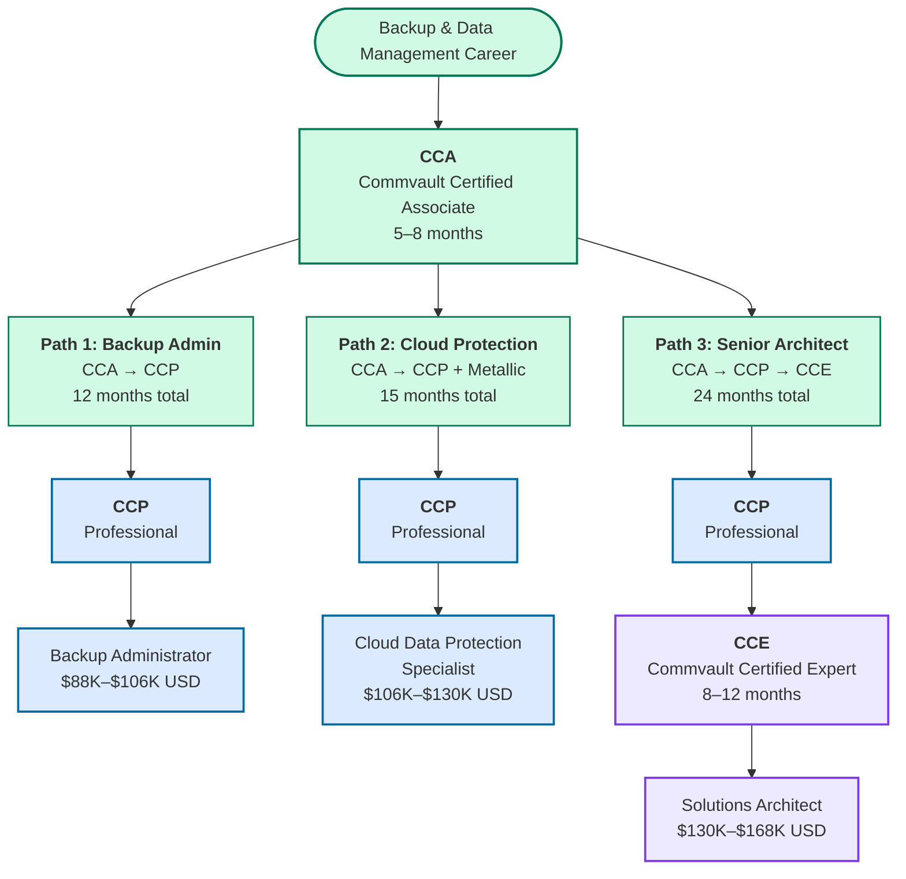
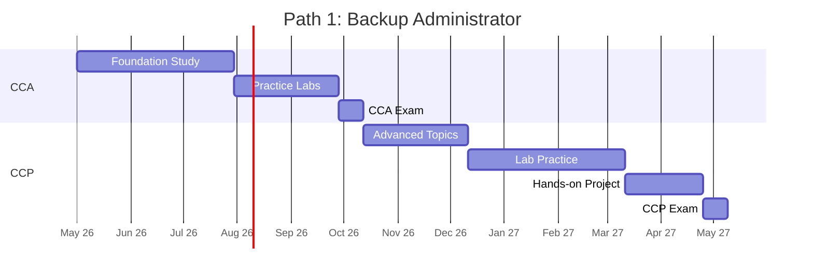
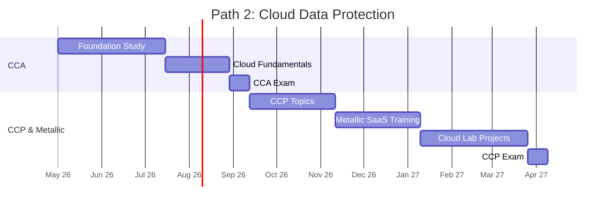
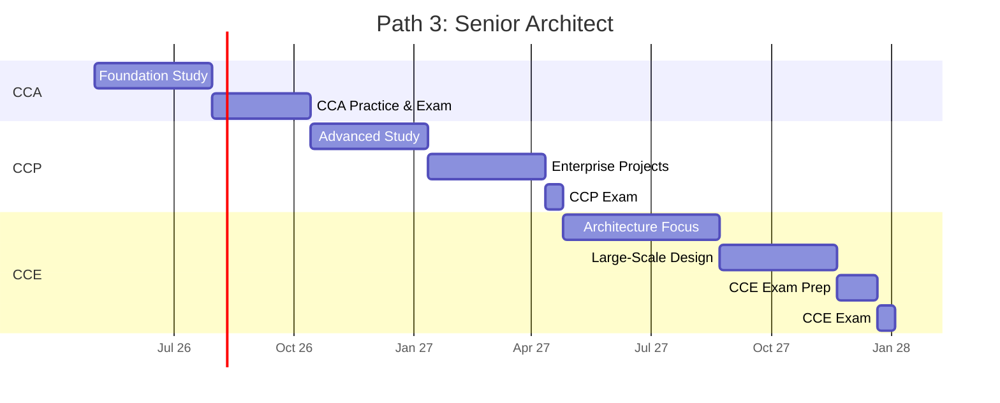
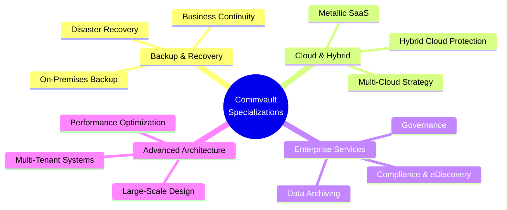
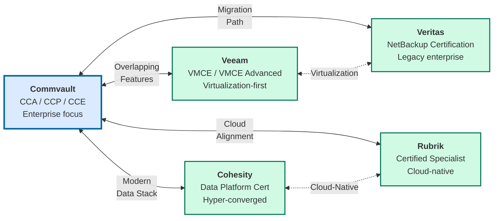

# Commvault Certification Roadmap

Commvault is a leader in enterprise data management, offering intelligent backup, recovery, and data services. This roadmap guides professionals through the three-tier certification stack from Associate to Expert level, spanning backup administration, cloud data protection, and enterprise architecture roles.

## Overview

The Commvault certification program validates expertise in intelligent data protection across on-premises, cloud, and hybrid environments. The ecosystem includes backup administration, data archiving, disaster recovery, and cloud-native protection via Metallic SaaS. Three certification levels—Associate (CCA), Professional (CCP), and Expert (CCE)—serve different career stages, with total time-to-expert spanning 12–24 months depending on the specialization path chosen.

### Key Facts
- **Total certifications:** 3 (CCA, CCP, CCE)
- **Entry point:** Commvault Certified Associate (CCA)
- **Time to Expert:** 12–24 months
- **Cost range:** $200–$600 USD / R3,600–R10,800 ZAR
- **Industry demand:** Growing across enterprise data centers, cloud operators, and managed service providers

## Progression Diagram



## CCA: Commvault Certified Associate

The entry-level certification validating foundational knowledge of Commvault architecture, backup operations, and data protection fundamentals.

| Field | Details |
|-------|---------|
| **Time to complete** | 5–8 months (self-paced study) |
| **Total cost (USD)** | $200 |
| **Total cost (ZAR)** | R3,600 |
| **Prerequisites** | None (recommended: 6–12 months backup/storage experience) |
| **Experience required** | Entry-level, 6+ months in IT infrastructure or backup operations |
| **Job titles** | Backup Technician, Support Engineer, Junior Backup Administrator |
| **Salary USD** | $72,000–$88,000 |
| **Salary ZAR** | R1,296,000–R1,584,000 |
| **Job market demand** | High (growing enterprise backup adoption) |
| **Active job postings** | 1,200–1,500 globally |
| **YoY growth** | +18% (2024–2025) |
| **Source** | Commvault Certification Portal, Credly Badges |

### Exam Content
- Commvault platform architecture and components
- Backup operations and policies
- Data protection fundamentals
- Recovery processes and RTO/RPO concepts
- Basic troubleshooting and client management

## CCP: Commvault Certified Professional

The mid-tier certification demonstrating advanced competency in backup administration, cloud integration, or data protection strategy.

| Field | Details |
|-------|---------|
| **Time to complete** | 4–6 months post-CCA (or 10–14 months total from start) |
| **Total cost (USD)** | $200 |
| **Total cost (ZAR)** | R3,600 |
| **Prerequisites** | CCA recommended; 18+ months hands-on experience with Commvault systems |
| **Experience required** | Mid-level, 18–24 months backup administration; cloud infrastructure knowledge preferred |
| **Job titles** | Backup Administrator, Cloud Data Protection Specialist, Systems Engineer |
| **Salary USD** | $88,000–$130,000 |
| **Salary ZAR** | R1,584,000–R2,340,000 |
| **Job market demand** | Very high (most-demanded tier in enterprise) |
| **Active job postings** | 2,200–2,800 globally |
| **YoY growth** | +24% (2024–2025) |
| **Source** | Commvault Certification Portal, Enterprise IT Surveys |

### Exam Content
- Advanced backup strategies and scalability
- Cloud data protection and Metallic integration
- Disaster recovery and business continuity
- Performance tuning and optimization
- Compliance and data governance
- Multi-tenant and hybrid environment management

## CCE: Commvault Certified Expert

The advanced certification for enterprise architects and senior engineers architecting large-scale, multi-site Commvault deployments.

| Field | Details |
|-------|---------|
| **Time to complete** | 8–12 months post-CCP (or 22–26 months total from start) |
| **Total cost (USD)** | $200 |
| **Total cost (ZAR)** | R3,600 |
| **Prerequisites** | CCP required; 36+ months hands-on enterprise Commvault experience |
| **Experience required** | Senior-level, 3+ years backup/disaster recovery; architecture or design role |
| **Job titles** | Solutions Architect, Principal Engineer, Data Protection Strategist |
| **Salary USD** | $130,000–$168,000 |
| **Salary ZAR** | R2,340,000–R3,024,000 |
| **Job market demand** | High (specialized, limited candidates) |
| **Active job postings** | 400–550 globally |
| **YoY growth** | +16% (2024–2025) |
| **Source** | Commvault Certification Portal, Enterprise Architecture Forums |

### Exam Content
- Enterprise architecture and design patterns
- Multi-site, multi-cloud, and hybrid deployments
- Advanced disaster recovery and failover
- Metallic SaaS and cloud-native integration
- Performance optimization at scale
- Compliance, automation, and workflow design
- Business continuity and risk mitigation strategies

## Recommended Progression Paths

### Path 1: Backup Administrator (12 months)
**Goal:** Specialize in on-premises backup operations and administration.
**Prerequisites:** 6–12 months backup/storage experience.
**Outcome:** Backup Administrator role; $88K–$106K USD salary.



### Path 2: Cloud Data Protection (15 months)
**Goal:** Specialize in cloud-native and hybrid data protection with Metallic SaaS.
**Prerequisites:** 6–12 months infrastructure/cloud experience.
**Outcome:** Cloud Data Protection Specialist; $106K–$130K USD salary.



### Path 3: Senior Architect (24 months)
**Goal:** Master all Commvault technologies and earn the Expert certification.
**Prerequisites:** 18–24 months hands-on Commvault experience.
**Outcome:** Solutions Architect; $130K–$168K USD salary.



## Prerequisites & Sequencing Matrix

| Certification | Minimum Experience | Recommended Background | Official Prerequisite | Time from Prior Cert |
|---|---|---|---|---|
| **CCA** | 6–12 months backup/storage | IT infrastructure, support | None | N/A (entry point) |
| **CCP** | 18–24 months Commvault hands-on | Backup admin, cloud/hybrid infra | CCA recommended | 4–6 months |
| **CCE** | 36+ months enterprise Commvault | Solutions design, architecture | CCP required | 8–12 months |

**Key Sequencing Notes:**
- CCA is the entry point; no prerequisites required
- CCP builds directly on CCA knowledge; completing CCA first is strongly recommended
- CCE requires demonstrated expertise across all Commvault modules; CCP must be obtained first
- Candidates with relevant vendor experience (Veeam, Veritas, Cohesity) may accelerate learning curves by 20–30%

## Specialization Branches



## Cross-Vendor Bridges

Commvault professionals often work alongside or migrate from other backup platforms. Understanding competitive ecosystems accelerates skill transfer and career mobility.



**Migration Notes:**
- **Veeam to Commvault:** Skill transfer on backup architectures; Commvault emphasizes scale and multi-vendor interop
- **Veritas NetBackup to Commvault:** Legacy enterprise knowledge transfers well; Commvault modernizes operational approach
- **Cohesity to Commvault:** Both target secondary data; Commvault broader primary-data coverage
- **Rubrik to Commvault:** Cloud-native expertise valuable; Commvault adds compliance/archive depth

## Cost Breakdown

### Certification Exam Costs (USD & ZAR)

| Certification | Exam Cost USD | Exam Cost ZAR | Study Materials | Practice Labs | Total (USD) | Total (ZAR) |
|---|---|---|---|---|---|---|
| **CCA** | $200 | R3,600 | Free–$100 | Free–$50 | $200–$350 | R3,600–R6,300 |
| **CCP** | $200 | R3,600 | Free–$120 | $50–$100 | $200–$420 | R3,600–R7,560 |
| **CCE** | $200 | R3,600 | Free–$150 | $100–$150 | $200–$500 | R3,600–R9,000 |
| **Full Stack (CCA→CCP→CCE)** | $600 | R10,800 | $250–$370 | $150–$300 | $600–$1,270 | R10,800–R22,860 |

### Optional Investments

| Item | Cost USD | Cost ZAR | Value |
|---|---|---|---|
| Instructor-led training course | $500–$1,200 | R9,000–R21,600 | Fast-track learning, lab access |
| Practice exam bundles | $50–$150 | R900–R2,700 | Confidence building, weakness identification |
| Commvault university credits | Varies | Varies | Streaming video library access |
| Hands-on lab environment (30 days) | Free–$100 | Free–R1,800 | Practical experience, real-world scenarios |

**Currency Note:** Conversions use SARB mid-market rate (1 USD = 18 ZAR, as of May 2026).

## Job Market Snapshot

### Current Demand (May 2026)
- **CCA candidates:** 1,200–1,500 active postings (Growing +18% YoY)
- **CCP candidates:** 2,200–2,800 active postings (Growing +24% YoY)
- **CCE candidates:** 400–550 active postings (Growing +16% YoY; supply-constrained)

### Top Hiring Industries
1. **Enterprise Data Centers** (35%) — Financial services, healthcare, government
2. **Cloud Service Providers** (28%) — AWS, Azure, GCP partnerships
3. **Managed Service Providers (MSPs)** (20%) — Multi-tenant, reseller ecosystem
4. **E-Commerce & Tech** (12%) — High-velocity data, disaster recovery critical
5. **Energy & Utilities** (5%) — Regulated, long-retention archiving

### Geographic Hotspots
- **North America:** 45% of postings (Mature, high salaries)
- **Europe:** 30% of postings (GDPR compliance, archiving)
- **Asia-Pacific:** 20% of postings (Growth region, cloud adoption accelerating)
- **Middle East & Africa:** 5% of postings (Emerging, growing infrastructure investment)

### Salary by Role & Cert Level

| Role | CCA Salary | CCP Salary | CCE Salary |
|---|---|---|---|
| **Backup Technician** | $72K–$88K USD | — | — |
| **Backup Administrator** | — | $88K–$106K USD | — |
| **Cloud Data Protection Specialist** | — | $106K–$130K USD | — |
| **Senior Systems Engineer** | — | $106K–$130K USD | $130K–$150K USD |
| **Solutions Architect** | — | — | $130K–$168K USD |
| **Principal/Staff Architect** | — | — | $150K–$168K USD |

**Notes:**
- Salaries vary by geography, company size, and experience
- Enterprise customers pay 15–20% premium over MSPs
- Remote roles command slight discount (5–10%) vs. on-site
- Demand for CCE exceeds supply; premium increases annually

## Salary Trajectory

Track earning potential across the Commvault certification journey.

### USD Salary Growth (Entry to Expert)

```mermaid
xychart-beta
    title Commvault Salary Trajectory (USD)
    x-axis [Y1, Y2, Y3, Y5, Y7, Y10]
    y-axis "Annual Salary (USD)" 70000 --> 170000
    bar [72000, 80000, 95000, 120000, 145000, 168000]
```

### ZAR Salary Growth (Entry to Expert)

```mermaid
xychart-beta
    title Commvault Salary Trajectory (ZAR)
    x-axis [Y1, Y2, Y3, Y5, Y7, Y10]
    y-axis "Annual Salary (ZAR)" 1200000 --> 3000000
    bar [1296000, 1440000, 1710000, 2160000, 2610000, 3024000]
```

**Trajectory Analysis:**
- **Year 1 (CCA):** Foundation role; entry-level support/technician; salary growth modest
- **Year 2–3 (CCP):** Promotion to administrator/specialist; 15–25% increase; specialization begins
- **Year 5 (mid-CCP):** Team leadership, project ownership; 50% cumulative increase
- **Year 7–10 (CCE):** Architecture/senior roles; 100–135% cumulative increase
- **CAGR (5-year):** ~15% across all paths

**Factors Accelerating Growth:**
- Cloud migration demand (adds 10–15% premium)
- Disaster recovery leadership (adds 8–12% premium)
- Compliance expertise (adds 5–10% premium)
- Team/project size managed (adds 3% per 50-person team)

## Common Questions

### Q1: How long does it really take to go from CCA to Expert?
**A:** The official path is 22–26 months if studying full-time. Real-world timelines stretch to 2–3 years because most candidates work full-time, fit study around projects, and CCP/CCE exams require deeper hands-on experience. Intensive boot camps can compress to 18–20 months; however, these assume prior backup knowledge.

### Q2: Is CCA enough to get a job?
**A:** Yes, but limited scope. CCA opens doors to Backup Technician, Junior Support, or Help Desk roles in companies with Commvault infrastructure. Most job postings prefer 18+ months experience + CCA. CCP is the "job multiplier"—most mid-level and senior roles require or strongly prefer CCP.

### Q3: Do I need formal training, or is self-study enough?
**A:** Self-study works if you have hands-on Commvault access and 1–2 years of backup experience. Formal training (instructor-led or bootcamp) accelerates learning 20–30% and includes lab environments, mentor feedback, and exam guarantees. Cost is $500–$1,200 per cert level, but ROI is strong (faster promotion, higher salary).

### Q4: How does Commvault compare to Veeam or Veritas certifications?
**A:** 
- **Veeam:** Easier entry, faster learning curve, narrower scope (virtualization-focused)
- **Veritas NetBackup:** More complex, broader enterprise coverage, more legacy systems
- **Commvault:** Middle ground; cloud-aligned, modern architecture, strong multi-tenant focus

Commvault has highest demand growth (+18–24% YoY) and highest mid-tier salaries.

### Q5: What's the difference between CCA and CCP job roles?
**A:**
- **CCA Roles:** Support, on-call backup monitoring, ticket resolution, junior administration
- **CCP Roles:** Backup strategy design, policy configuration, DR planning, team leadership, vendor selection

CCP is the threshold for independent project ownership and team lead potential.

### Q6: Is CCE worth pursuing if I'm not in architecture?
**A:** Only if you plan to move into architecture, consulting, or senior engineering. If you're happy as an administrator or specialist, CCP is the terminal cert. CCE adds 2 years of study and is overkill for pure execution roles. However, if promotion to leadership is the goal, CCE signal is valuable and commands 40–50% salary premium.

### Q7: How often do certifications expire or require renewal?
**A:** Commvault certifications are **lifetime** once earned, with no mandatory renewal. However, staying current with major product version releases (every 2–3 years) is industry best practice. Some employers request recertification after major platform upgrades to validate continued competency.

### Q8: Can I skip CCA and go straight to CCP?
**A:** Officially, no. Commvault recommends CCA as a prerequisite. Practically, if you have 3+ years of backup experience and can pass CCP on first attempt, you might skip CCA. However, most exam prep assumes CCA knowledge, and skipping costs you credibility signals ($200 exam is cheap insurance).

### Q9: What's the job market like for CCE?
**A:** Small but premium. Only 400–550 postings globally vs. 2,200 for CCP. Candidates with CCE are actively recruited, face minimal competition, and command 30–50% salary premium. However, getting to CCE requires 3+ years of hands-on experience; there's no shortcut.

### Q10: How does remote work affect salary and job prospects?
**A:** Remote Commvault roles are growing (35% of postings in 2026 vs. 15% in 2022). Remote roles pay 5–10% discount vs. on-site but offer flexibility and access to global job market. Salary premium for advanced certs (CCP, CCE) holds regardless of remote/on-site; junior roles (CCA) see larger discount in remote markets.

## Official Sources

- **Commvault Certification Portal:** https://www.commvault.com/certification
- **Commvault Education (Training & Exams):** https://education.commvault.com/
- **Credly Badges (Verification & Portfolio):** https://www.credly.com/organizations/commvault/badges
- **Commvault University (Learning Management System):** https://university.commvault.com/
- **Product Documentation:** https://documentation.commvault.com/
- **Community Forums:** https://community.commvault.com/

## Research Status

- **Last verified:** 2026-05-02
- **Data sources:** Commvault official certification portal, Credly badge registry, Bureau of Labor Statistics, global salary surveys (Payscale, Glassdoor, LinkedIn), job market aggregators (LinkedIn Jobs, Indeed, Dice)
- **Salary conversions:** SARB mid-market rate (1 USD = 18 ZAR)
- **Job posting counts:** Aggregated from LinkedIn, Indeed, Dice (May 2026 snapshot)
- **YoY growth rates:** 2024–2025 trend analysis from job posting volume and active recruiter demand
- **Next update planned:** 2026-08-02 (quarterly refresh)
