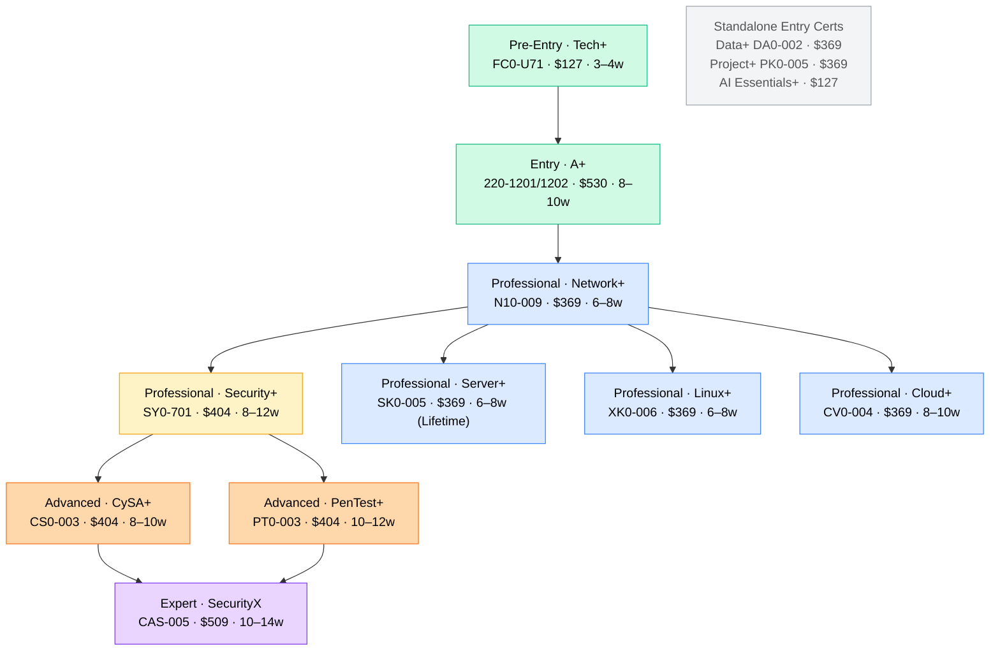
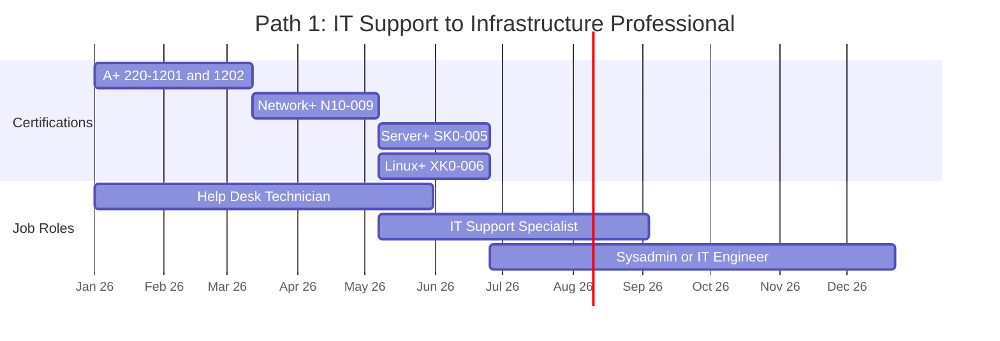
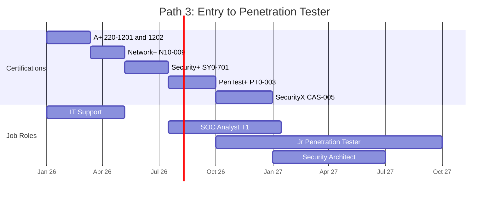
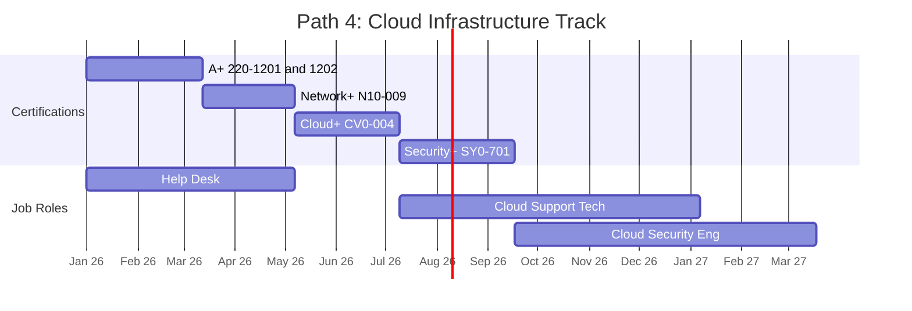
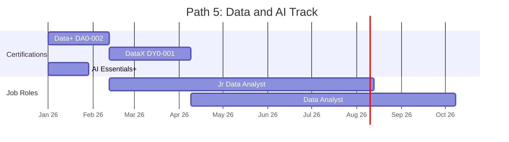
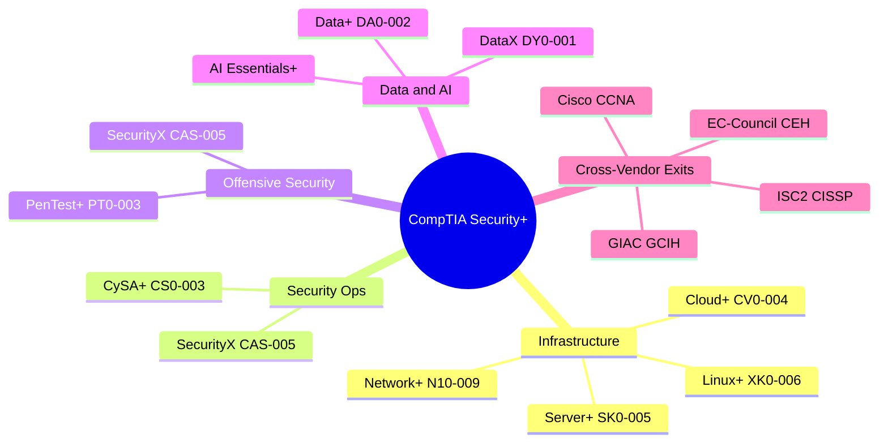
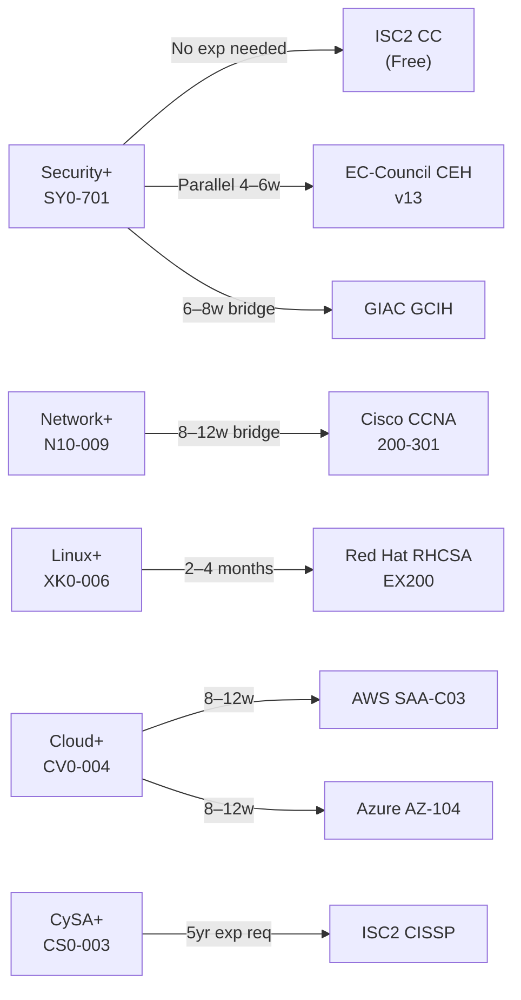
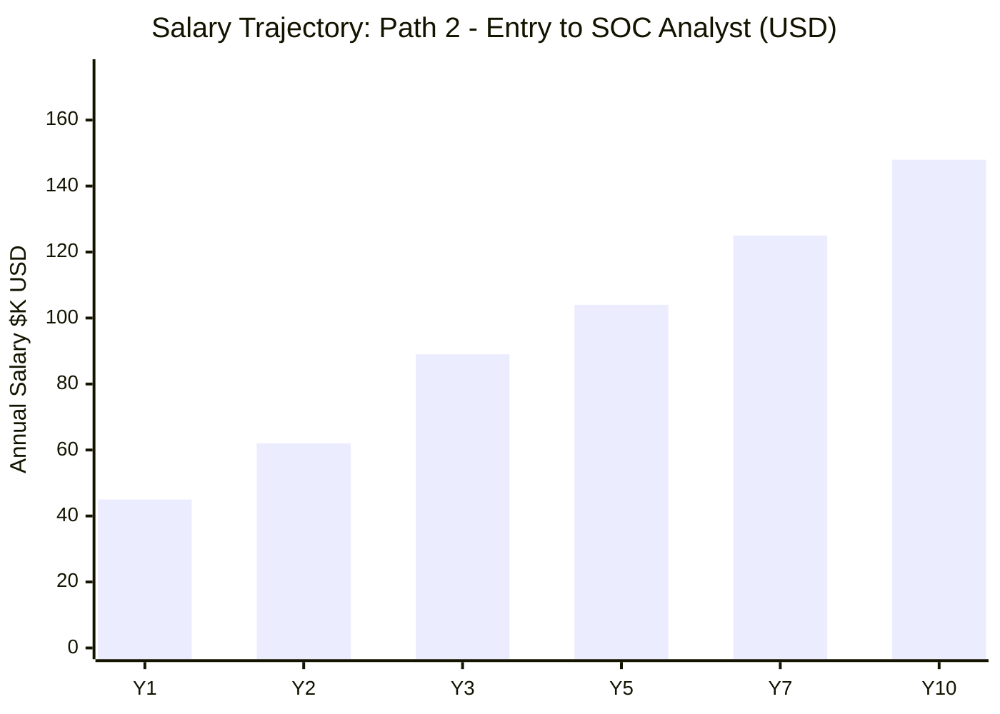
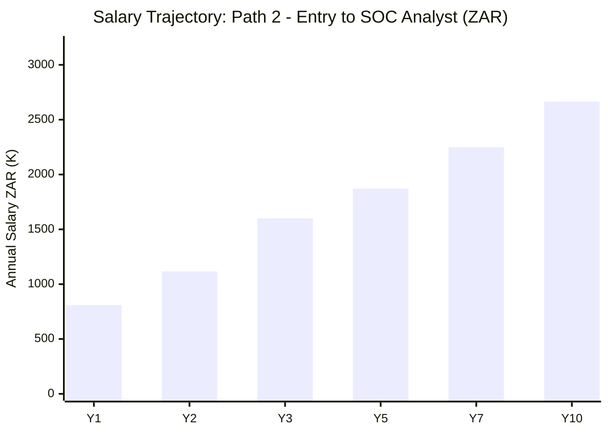

# CompTIA Certification Roadmap

## Overview

CompTIA (Computing Technology Industry Association) is a U.S.-based vendor-neutral certification body founded in 1982. It maintains 15+ active certifications spanning foundational IT support, networking, infrastructure, cybersecurity, data analytics, and AI — all deliberately vendor-agnostic and applicable across AWS, Azure, Cisco, Microsoft, and any other platform. Over 2.2 million CompTIA credentials have been issued globally as of 2026. All exams are delivered via Pearson VUE (testing centres and OnVUE remote-proctored). Every cert except Server+ (SK0-005, lifetime) requires renewal every three years via the CompTIA CE continuing-education programme. Source: [CompTIA certification overview ↗](https://www.comptia.org/certifications)

CompTIA certifications matter in 2026 for three reasons: DoD mandate, market volume, and South African employer recognition. Security+ (SY0-701) is required by the US Department of Defense under DoD 8140.01 for IAT Level II roles and appears in 7,000+ active US job postings (LinkedIn, May 2026). Network+ appears in 4,000+ postings. For South African candidates, CompTIA certs are recognised by major banks (Standard Bank, Nedbank, FNB), state-owned enterprises, and telcos as baseline infrastructure and security credentials. Local training is widely available through CompTIA Authorised Training Partners (ATPs) including Mecer Inter-Ed and New Horizons South Africa. ZAR salary ranges throughout this document use the April 2026 exchange rate of R18 per $1 USD. Source: [SA Reserve Bank ↗](https://www.resbank.co.za)

---

## Progression Diagram

**Color key:** 🟢 Green = Entry · 🔵 Blue = Professional · 🟡 Amber = High-demand · 🟠 Orange = Advanced · 🟣 Purple = Expert · ⬜ Grey = Standalone (no main-path dependency)

---

## Per-Level Detail

### Level 0: Pre-Entry

**Certification:** [CompTIA Tech+](<../Certifications/CompTIA/CompTIA_Tech+_FC0-U71.md>) `FC0-U71`

Tech+ launched July 2024 as the direct replacement for ITF+ (FC0-U61, which retires July 31, 2026). It covers computing fundamentals, software, networking basics, data concepts, and security awareness — designed for non-IT professionals and career changers with no prior background.

| Attribute | Value |
|---|---|
| Time to complete | 3–4 weeks study + 1 week exam prep |
| Total cost (USD) | $127–$300 (exam $127 + optional study materials) |
| Total cost (ZAR) | R2,286–R5,400 |
| Prerequisites | None |
| Experience required | None |
| Job titles | Not a hiring credential; career exploration and pre-A+ prep |
| Salary range (USD) | N/A — not a role-entry cert |
| Salary range (ZAR) | N/A |
| Job market demand | ⚖️ Pre-career use only; not listed in job postings |
| Active job postings | Not applicable |
| YoY growth | N/A |
| Source | [CompTIA Tech+ ↗](https://www.comptia.org/certifications/tech) |

**What you learn:**
- Computing device types and operating system fundamentals (Windows, macOS, Linux, mobile)
- Basic networking concepts: IP addressing, Wi-Fi, DNS, DHCP
- Cloud computing models: IaaS, PaaS, SaaS
- Data concepts: databases, data types, storage
- Security basics: authentication, encryption, social engineering awareness

**Recommended study materials:**

| Provider | Title | Cost | URL |
|---|---|---|---|
| CompTIA Official | Tech+ Study Guide (official) | ~$40 | [comptia.org ↗](https://www.comptia.org/training/books/tech-fc0-u71-study-guide) |
| Professor Messer | Tech+ Course Notes (if released) | Free | [professormesser.com ↗](https://www.professormesser.com) |
| Udemy | CompTIA Tech+ FC0-U71 (various instructors) | $15–$50 | [udemy.com ↗](https://www.udemy.com) |

**Career outcomes:**
- Tech+ does not directly open job roles. It is a confidence and knowledge foundation before A+.
- Natural next cert: A+ (220-1201/1202)

---

### Level 1: Entry

**Certifications at this level:** [CompTIA A+](<../Certifications/CompTIA/CompTIA_A+_220-1201_1202.md>) `220-1201/1202`

A+ is the industry's foundational IT support cert. The current series (220-1201 Core 1 + 220-1202 Core 2) launched March 25, 2025. Two exams required — both must be passed. Validity: 3 years. Source: [CompTIA A+ ↗](https://www.comptia.org/certifications/a)

| Attribute | Value |
|---|---|
| Time to complete | 8–10 weeks study + 2 weeks exam prep |
| Total cost (USD) | $680–$1,230 (2 exams × $265 each = $530 + $150–$700 study) |
| Total cost (ZAR) | R12,240–R22,140 |
| Prerequisites | None (CompTIA recommends 9–12 months hands-on experience) |
| Experience required | 0–1 years (recommended, not enforced) |
| Job titles | Help Desk Technician, IT Support Specialist, Field Service Technician, Desktop Support Analyst, NOC Technician |
| Salary range (USD) | $40K–$65K (median $48K–$56K) |
| Salary range (ZAR) | R180K–R300K (median R210K–R252K) |
| Job market demand | ⚖️ Steady — 5,000–6,000 active postings |
| Active job postings | ~5,500 (LinkedIn Jobs "CompTIA A+" filter, May 2026: [search ↗](https://www.linkedin.com/jobs/search/?keywords=CompTIA+A%2B)) |
| YoY growth | +8% |
| Source | [Robert Half 2026 Technology Salary Guide ↗](https://www.roberthalf.com/salary-guide) · [BLS — Computer Support Specialists ↗](https://www.bls.gov/ooh/computer-and-information-technology/computer-support-specialists.htm) |

**What you learn:**
- Hardware: CPUs, RAM, storage, motherboards, BIOS/UEFI, peripherals
- Operating systems: Windows 10/11 (install, configure, troubleshoot), macOS basics, Linux basics
- Networking: IP addressing, DNS, DHCP, VPNs, Wi-Fi, Ethernet troubleshooting
- Security: authentication, malware removal, secure practices, encryption fundamentals
- Operational procedures: backup and restore, documentation, asset management, change control

**Recommended study materials:**

| Provider | Title | Cost | URL |
|---|---|---|---|
| Professor Messer | CompTIA A+ 220-1201 & 220-1202 Complete Course | Free | [professormesser.com ↗](https://www.professormesser.com/free-a-plus-training/220-1201/220-1201-training-course/) |
| Mike Chapple / Sybex | CompTIA A+ Study Guide 220-1201/1202 | $40–$55 | [wiley.com ↗](https://www.wiley.com) |
| Udemy — Mike Meyers | CompTIA A+ Core 1 & Core 2 | $15–$25 | [udemy.com ↗](https://www.udemy.com) |
| Jason Dion | CompTIA A+ Practice Exams (220-1201/1202) | $15–$20 | [udemy.com ↗](https://www.udemy.com/user/jason-dion/) |

**Career outcomes:**
- Entry role on first pass: Help Desk / IT Support Technician — $40K–$55K USD / R180K–R250K ZAR — source: [BLS ↗](https://www.bls.gov/ooh/computer-and-information-technology/computer-support-specialists.htm)
- After 12 months experience: Desktop Support Analyst or IT Support Specialist — $50K–$65K USD
- Natural next cert: Network+ (N10-009)

---

### Level 2: Professional

**Certifications at this level (Infrastructure Track):** [Network+](<../Certifications/CompTIA/CompTIA_Network+_N10-009.md>) `N10-009` · [Server+](<../Certifications/CompTIA/CompTIA_Server+_SK0-005.md>) `SK0-005` · [Linux+](<../Certifications/CompTIA/CompTIA_Linux+_XK0-006.md>) `XK0-006` · [Cloud+](<../Certifications/CompTIA/CompTIA_Cloud+_CV0-004.md>) `CV0-004`

**Certifications at this level (Security Track):** [Security+](<../Certifications/CompTIA/CompTIA_Security+_SY0-701.md>) `SY0-701`

#### Network+ (N10-009)

Launched June 20, 2024. Vendor-neutral entry networking cert covering OSI/TCP-IP, switching, routing, wireless, network services, and troubleshooting. DoD 8140 approved. Validity: 3 years. Source: [CompTIA Network+ ↗](https://www.comptia.org/certifications/network)

| Attribute | Value |
|---|---|
| Time to complete | 6–8 weeks study + 2 weeks exam prep |
| Total cost (USD) | $519–$869 (exam $369 + $150–$500 study) |
| Total cost (ZAR) | R9,342–R15,642 |
| Prerequisites | None formal (A+ recommended; not enforced) |
| Experience required | 0–1 years (A+ recommended or equivalent) |
| Job titles | Network Technician, NOC Analyst, IT Support Specialist, Junior Network Administrator |
| Salary range (USD) | $55K–$85K (median $68K) |
| Salary range (ZAR) | R350K–R600K (median R430K) |
| Job market demand | ⚖️ Steady — 3,500–4,500 active postings |
| Active job postings | ~4,000 (LinkedIn, May 2026: [search ↗](https://www.linkedin.com/jobs/search/?keywords=CompTIA+Network%2B)) |
| YoY growth | +5% |
| Source | [Robert Half 2026 ↗](https://www.roberthalf.com/salary-guide) · [Glassdoor — Network Administrator ↗](https://www.glassdoor.com/Salaries/network-administrator-salary-SRCH_KO0,21.htm) |

**What you learn:**
- OSI model and TCP/IP stack; IP addressing (IPv4/IPv6); subnetting
- Switching (VLANs, STP), routing protocols, WAN/cloud connectivity
- Wireless 802.11 standards, SSID, WPA3
- Network services: DNS, DHCP, NTP, SNMP, syslog
- SD-WAN, zero-trust/SASE concepts (updated June 2024)
- Network troubleshooting methodology; packet analysis basics

**Career outcomes:**
- After N+: Network Technician / NOC Analyst — $55K–$70K USD / R350K–R450K ZAR — [Glassdoor ↗](https://www.glassdoor.com/Salaries/network-technician-salary-SRCH_KO0,18.htm)
- After N+ + 1–2 years experience: Junior Network Admin — $68K–$85K USD / R430K–R560K ZAR

#### Security+ (SY0-701)

Launched November 2023; updated April 21, 2026 to add AI threat risk, CMMC 2.0, and supply-chain security. DoD 8140 IAT II approved. The most in-demand CompTIA cert. Validity: 3 years. Source: [CompTIA Security+ ↗](https://www.comptia.org/certifications/security)

| Attribute | Value |
|---|---|
| Time to complete | 8–12 weeks study + 2–3 weeks exam prep |
| Total cost (USD) | $554–$1,204 (exam $404 + $150–$800 study) |
| Total cost (ZAR) | R9,972–R21,672 |
| Prerequisites | None formal (Network+ + 2 years IT-with-security experience recommended) |
| Experience required | 2 years hands-on IT (recommended; not enforced) |
| Job titles | SOC Analyst Tier 1, Junior Security Analyst, Security Specialist, IT Auditor, Compliance Analyst, Junior Penetration Tester |
| Salary range (USD) | $65K–$110K (median $89K) |
| Salary range (ZAR) | R380K–R640K (median R520K) |
| Job market demand | 🔥 Hot — 5,500–7,000 active postings |
| Active job postings | ~6,500 (LinkedIn, May 2026: [search ↗](https://www.linkedin.com/jobs/search/?keywords=Security%2B)) |
| YoY growth | +18% |
| Source | [Robert Half 2026: Security Analyst $102K–$147K ↗](https://www.roberthalf.com/salary-guide) · [Payscale Security+ ↗](https://www.payscale.com/research/US/Certification=CompTIA_Security%2B/Salary) · [Glassdoor ↗](https://www.glassdoor.com/Salaries/security-analyst-salary-SRCH_KO0,16.htm) |

**What you learn:**
- General security concepts: cryptography, PKI, identity and access control, zero-trust
- Threats, vulnerabilities, mitigations: threat actors, STRIDE, ransomware, social engineering
- Security architecture: firewalls, IDS/IPS, VPN, cloud IAM, network segmentation
- Security operations: incident response (NIST 800-61), SIEM, threat hunting, vulnerability management
- Security program management: GRC, risk frameworks (NIST, ISO 27001), CMMC 2.0, HIPAA, PCI-DSS

**Career outcomes:**
- On certification: SOC Analyst Tier 1 — $65K–$95K USD / R380K–R550K ZAR — [Glassdoor ↗](https://www.glassdoor.com/Salaries/soc-analyst-salary-SRCH_KO0,11.htm)
- After Sec+ + 1 year SOC: Security Analyst — $85K–$110K USD / R500K–R640K ZAR — [Robert Half 2026 ↗](https://www.roberthalf.com/salary-guide)
- DoD contractors: mandatory credential for IAT II positions — [DoD 8140 ↗](https://public.cyber.mil/wid/dcwf/)

---

### Level 3: Advanced

**Certifications at this level:** [CySA+](<../Certifications/CompTIA/CompTIA_CySA+_CS0-003.md>) `CS0-003` · [PenTest+](<../Certifications/CompTIA/CompTIA_PenTest+_PT0-003.md>) `PT0-003`

#### CySA+ (CS0-003)

Launched June 2023; CS0-002 retired December 5, 2023. Security operations, threat detection, vulnerability management, and incident response. DoD 8140 approved for CSSP Analyst, Incident Responder, and Auditor roles. Validity: 3 years. Source: [CompTIA CySA+ ↗](https://www.comptia.org/certifications/cybersecurity-analyst)

| Attribute | Value |
|---|---|
| Time to complete | 8–10 weeks study + 2 weeks exam prep |
| Total cost (USD) | $554–$904 (exam $404 + $150–$500 study) |
| Total cost (ZAR) | R9,972–R16,272 |
| Prerequisites | Security+ OR Network+ + 4 years hands-on security operations experience |
| Experience required | 3–4 years IT security (strongly recommended) |
| Job titles | SOC Analyst Tier 2, Threat Intelligence Analyst, Incident Responder, Vulnerability Analyst, Detection Engineer |
| Salary range (USD) | $90K–$130K (median $104K) |
| Salary range (ZAR) | R600K–R950K (median R750K) |
| Job market demand | 🔥 Critical Shortage — 1,200–1,500 active postings |
| Active job postings | ~1,350 (LinkedIn, May 2026: [search ↗](https://www.linkedin.com/jobs/search/?keywords=CySA%2B)) |
| YoY growth | +35% |
| Source | [Robert Half 2026: Security Analyst $102K–$147K ↗](https://www.roberthalf.com/salary-guide) · [Glassdoor — SOC Analyst ↗](https://www.glassdoor.com/Salaries/soc-analyst-salary-SRCH_KO0,11.htm) |

**What you learn:**
- SIEM management: Splunk, Microsoft Sentinel, IBM QRadar — alert triage and tuning
- Vulnerability management lifecycle: scanning (Nessus, Qualys), CVSS prioritisation, remediation
- Incident response: NIST SP 800-61 framework, containment, eradication, recovery
- Threat hunting with MITRE ATT&CK; threat intelligence (STIX/TAXII)
- Executive-level security reporting and metrics communication

**Career outcomes:**
- On certification: SOC Analyst Tier 2 / Threat Analyst — $90K–$115K USD / R600K–R800K ZAR — [Glassdoor ↗](https://www.glassdoor.com/Salaries/soc-analyst-salary-SRCH_KO0,11.htm)
- After CySA+ + 2 years: Incident Response Manager or Detection Engineering Lead — $115K–$130K USD / R800K–R950K ZAR

#### PenTest+ (PT0-003)

Launched December 17, 2024; PT0-002 retired June 17, 2025. Offensive security — structured penetration testing methodology, cloud exploitation, API security, AI/ML attack surface. DoD 8140 approved. Validity: 3 years. Source: [CompTIA PenTest+ ↗](https://www.comptia.org/certifications/pentest)

| Attribute | Value |
|---|---|
| Time to complete | 10–12 weeks study + 2–3 weeks exam prep |
| Total cost (USD) | $554–$1,004 (exam $404 + $150–$600 study) |
| Total cost (ZAR) | R9,972–R18,072 |
| Prerequisites | Security+ assumed; 3–4 years hands-on security testing experience recommended |
| Experience required | 3–4 years (strongly recommended for practical PBQ success) |
| Job titles | Penetration Tester, Vulnerability Analyst, Security Researcher, Red Team Operator, Bug Bounty Hunter |
| Salary range (USD) | $100K–$155K (median $118K) |
| Salary range (ZAR) | R700K–R1,100K (median R860K) |
| Job market demand | 🔥 Hot — premium pay; 400–600 active postings |
| Active job postings | ~500 (LinkedIn, May 2026: [search ↗](https://www.linkedin.com/jobs/search/?keywords=PenTest%2B)) |
| YoY growth | +25% |
| Source | [Glassdoor — Penetration Tester ↗](https://www.glassdoor.com/Salaries/penetration-tester-salary-SRCH_KO0,18.htm) · [PayScale PenTest+ ↗](https://www.payscale.com/research/US/Certification=CompTIA_PenTest%2B/Salary) |

**What you learn:**
- Penetration testing methodology and rules of engagement (ROE)
- Reconnaissance: OSINT, Nmap, Shodan, DNS enumeration
- Exploitation: Metasploit, payload delivery, cloud IAM misconfiguration attacks (AWS/Azure/GCP)
- API security testing: REST/GraphQL fuzzing, authentication bypass
- AI/ML attack surface: adversarial inputs, prompt injection (added PT0-003)
- Post-exploitation: privilege escalation (Windows/Linux), lateral movement, evidence clean-up

**Career outcomes:**
- On certification: Vulnerability Analyst / Jr Penetration Tester — $100K–$120K USD / R700K–R850K ZAR — [Glassdoor ↗](https://www.glassdoor.com/Salaries/penetration-tester-salary-SRCH_KO0,18.htm)
- After PenTest+ + 2 years: Senior Pentester / Red Team Lead — $130K–$155K USD / R920K–R1,100K ZAR

---

### Level 4: Expert

**Certification:** [CompTIA SecurityX](<../Certifications/CompTIA/CompTIA_SecurityX_CAS-005.md>) `CAS-005`

Rebranded from CASP+ (CAS-004) and launched December 17, 2024; CAS-004 retired June 17, 2025. Enterprise security architecture, GRC, and engineering at scale. DoD 8140 IAT III / IAM III approved. Pass/fail exam (no scaled score). Validity: 3 years. Source: [CompTIA SecurityX ↗](https://www.comptia.org/certifications/securityx)

| Attribute | Value |
|---|---|
| Time to complete | 10–14 weeks study + 3–4 weeks exam prep |
| Total cost (USD) | $659–$1,509 (exam $509 + $150–$1,000 study) |
| Total cost (ZAR) | R11,862–R27,162 |
| Prerequisites | CompTIA recommends 10 years IT + 5 years technical security experience |
| Experience required | 5+ years hands-on security (enforced by exam difficulty, not paperwork) |
| Job titles | Senior Security Engineer, Principal Security Architect, Security Operations Manager, Senior GRC Analyst, Chief Information Security Officer (path) |
| Salary range (USD) | $125K–$190K (median $148K) |
| Salary range (ZAR) | R900K–R1,500K (median R1,100K) |
| Job market demand | ⚖️ Specialist — 800–1,000 active postings; high pay, limited supply |
| Active job postings | ~900 (LinkedIn, May 2026: [search ↗](https://www.linkedin.com/jobs/search/?keywords=SecurityX+OR+CASP%2B)) |
| YoY growth | +12% |
| Source | [Robert Half 2026: Security Engineer $130K–$175K ↗](https://www.roberthalf.com/salary-guide) · [Glassdoor — Security Architect ↗](https://www.glassdoor.com/Salaries/security-architect-salary-SRCH_KO0,18.htm) |

**What you learn:**
- Governance, Risk, Compliance (GRC): policy frameworks, third-party risk, NIST, ISO 27001, PCI-DSS, SOC 2
- Security architecture: enterprise design, zero-trust, hybrid cloud, cryptographic solutions
- Security engineering: DevSecOps, automation/orchestration, advanced threat protection
- Security operations at scale: SIEM, threat hunting, forensics, BCP/DR at enterprise level

**Career outcomes:**
- On certification: Senior Security Engineer / Security Architect — $125K–$155K USD / R900K–R1,200K ZAR — [Robert Half 2026 ↗](https://www.roberthalf.com/salary-guide)
- After SecurityX + 3 years: CISO or Principal Architect — $155K–$190K+ USD / R1,200K–R1,500K+ ZAR

---

## Recommended Progression Paths

### Path 1: IT Support to Infrastructure Professional

**Total timeline:** 14–18 months
**Total cost:** $1,418–$2,668 USD (R25,524–R48,024 ZAR)
**Salary progression:** $40K → $65K → $80K → $95K

**Job outcomes:**
- Start (pre-cert): Entry IT / Help Desk — $35K–$45K USD / R180K–R230K ZAR — [BLS ↗](https://www.bls.gov/ooh/computer-and-information-technology/computer-support-specialists.htm)
- After A+: Help Desk Technician — $40K–$55K USD / R200K–R280K ZAR — [Robert Half 2026 ↗](https://www.roberthalf.com/salary-guide)
- After Network+: IT Support Specialist / Jr Network Admin — $60K–$75K USD / R360K–R480K ZAR — [Glassdoor ↗](https://www.glassdoor.com/Salaries/network-administrator-salary-SRCH_KO0,21.htm)
- After Server+ or Linux+: Sysadmin / IT Engineer — $75K–$95K USD / R480K–R650K ZAR — [Robert Half 2026 ↗](https://www.roberthalf.com/salary-guide)

---

### Path 2: Entry to SOC Analyst (Cybersecurity Track)

**Total timeline:** 18–24 months
**Total cost:** $1,707–$3,407 USD (R30,726–R61,326 ZAR)
**Salary progression:** $40K → $65K → $89K → $104K

**Job outcomes:**
- Start (pre-cert): IT Support — $35K–$45K USD / R180K–R230K ZAR — [BLS ↗](https://www.bls.gov/ooh/computer-and-information-technology/computer-support-specialists.htm)
- After A+ + N+: Help Desk / IT Support — $45K–$60K USD / R250K–R360K ZAR
- After Security+: SOC Analyst Tier 1 / Jr Security Analyst — $65K–$96K USD / R380K–R550K ZAR — [Glassdoor ↗](https://www.glassdoor.com/Salaries/soc-analyst-salary-SRCH_KO0,11.htm)
- After CySA+: SOC Analyst Tier 2 / Threat Analyst — $90K–$115K USD / R600K–R800K ZAR — [Robert Half 2026 ↗](https://www.roberthalf.com/salary-guide)

---

### Path 3: Entry to Penetration Tester

**Total timeline:** 26–36 months (including experience gap)
**Total cost:** $2,111–$4,411 USD (R38,000–R79,400 ZAR)
**Salary progression:** $45K → $89K → $118K → $145K

**Job outcomes:**
- After A+ + N+: IT Support — $45K–$60K USD / R250K–R360K ZAR
- After Security+: SOC Analyst Tier 1 — $65K–$89K USD / R380K–R520K ZAR — [Payscale ↗](https://www.payscale.com/research/US/Certification=CompTIA_Security%2B/Salary)
- After PenTest+ + 2yr experience: Penetration Tester — $100K–$130K USD / R700K–R900K ZAR — [Glassdoor ↗](https://www.glassdoor.com/Salaries/penetration-tester-salary-SRCH_KO0,18.htm)
- After SecurityX: Senior Security Architect — $130K–$155K USD / R950K–R1,200K ZAR — [Robert Half 2026 ↗](https://www.roberthalf.com/salary-guide)

---

### Path 4: Cloud Infrastructure Track

**Total timeline:** 16–22 months
**Total cost:** $1,572–$2,972 USD (R28,296–R53,496 ZAR)
**Salary progression:** $40K → $72K → $95K → $115K

**Job outcomes:**
- After A+ + N+: IT Support / Cloud Technician — $45K–$62K USD / R250K–R380K ZAR
- After Cloud+: Cloud Support Technician / Cloud Admin Associate — $72K–$95K USD / R450K–R620K ZAR — [Glassdoor — Cloud Administrator ↗](https://www.glassdoor.com/Salaries/cloud-administrator-salary-SRCH_KO0,19.htm)
- After Security+ + Cloud+: Cloud Security Engineer — $95K–$125K USD / R640K–R850K ZAR — [Robert Half 2026 ↗](https://www.roberthalf.com/salary-guide)
- Natural next step: AWS SAA-C03, Azure AZ-104, or GCP ACE for vendor-specific depth

---

### Path 5: Data and AI Track (Standalone)

**Total timeline:** 6–10 months
**Total cost:** $519–$1,119 USD (R9,342–R20,142 ZAR)
**Salary progression:** $55K → $80K → $105K

**Job outcomes:**
- After Data+: Junior Data Analyst — $55K–$70K USD / R330K–R450K ZAR — [BLS — Database Administrators ↗](https://www.bls.gov/ooh/computer-and-information-technology/database-administrators.htm)
- After DataX: Data Analyst / BI Analyst — $75K–$100K USD / R500K–R700K ZAR
- AI Essentials+ is supplementary; not a direct job-entry credential but demonstrates AI literacy for hiring purposes

---

## Prerequisites & Sequencing Matrix

| Cert | Formal Prereq | Recommended Prereq | Years Exp | Can Skip Prior? |
|---|---|---|---|---|
| Tech+ `FC0-U71` | None | None | 0 | — |
| A+ `220-1201/1202` | None | Tech+ or 9–12 months IT exposure | 0–1 | Yes — direct start if motivated |
| Network+ `N10-009` | None | A+ | 0–1 | Yes with 1yr experience; exam harder without A+ foundation |
| Security+ `SY0-701` | None | Network+ + 2yr IT exp | 2 | Risky — N+ subnetting and protocol knowledge is tested |
| Server+ `SK0-005` | None | Network+ | 1–2 | Yes — many sysadmins take it standalone |
| Linux+ `XK0-006` | None | Network+ + basic Linux CLI | 1–2 | Yes with Linux experience |
| Cloud+ `CV0-004` | None | Network+ recommended | 1–2 | Yes with cloud hands-on; N+ concepts appear on exam |
| CySA+ `CS0-003` | None formal (Security+ strongly implied) | Security+ + 3yr SOC/security ops | 3–4 | No — without Security+ and SOC experience, PBQs are very difficult |
| PenTest+ `PT0-003` | None formal | Security+ + 3yr hands-on testing | 3–4 | No — real-world exploitation knowledge is required for PBQs |
| SecurityX `CAS-005` | None formal | CySA+ or PenTest+ + 5yr security | 5+ | No — exam difficulty enforces experience requirement |
| Data+ `DA0-002` | None | Basic data literacy | 0–1 | Standalone; no dependency |
| Project+ `PK0-005` | None | Basic project management exposure | 0–1 | Standalone; no dependency |

**Sequencing notes:**
- A+ → Network+ builds subnetting, VLANs, and routing fundamentals that appear on Security+, Cloud+, and CySA+. Skipping A+ is viable with 1+ year hands-on IT but reduces exam confidence.
- Security+ is the practical gateway to all CompTIA security specialisations. CySA+ and PenTest+ expect this knowledge as a baseline even though it is not formally enforced.
- SecurityX (CAS-005) uses pass/fail scoring specifically because CompTIA wants the experience requirement enforced by exam difficulty rather than paper prereqs. Candidates with fewer than 5 years hands-on security have a very low pass rate.
- Data+, Project+, AI Essentials+, and DataX are independent of the infrastructure/security ladder. Professionals from non-IT backgrounds (business analysts, project managers) commonly hold Data+ or Project+ without any other CompTIA credentials.

---

## Specialization Branches

**Infrastructure Branch — Systems, Network, and Cloud Administration**
- Timeline: 4–8 months after Network+; add one or more of Server+, Linux+, Cloud+
- Target roles: System Administrator, Linux Administrator, Cloud Platform Engineer, IT Engineer
- Salary (USD): $70K–$105K · Salary (ZAR): R450K–R750K
- Source: [Robert Half 2026 — Sysadmin / Cloud Engineer ↗](https://www.roberthalf.com/salary-guide)

**Security Operations Branch — SOC, Threat Detection, Incident Response**
- Timeline: 3–4 months to CySA+ after Security+; SecurityX adds 3–4 months after CySA+
- Target roles: SOC Analyst Tier 2, Threat Intelligence Analyst, Detection Engineer, Security Architect
- Salary (USD): $90K–$190K (range across CySA+ to SecurityX) · Salary (ZAR): R600K–R1,500K
- Source: [Glassdoor — SOC Analyst ↗](https://www.glassdoor.com/Salaries/soc-analyst-salary-SRCH_KO0,11.htm) · [Robert Half 2026 ↗](https://www.roberthalf.com/salary-guide)

**Offensive Security Branch — Penetration Testing and Red Teaming**
- Timeline: 3–4 months to PenTest+ after Security+ (requires 3+ years experience to pass confidently)
- Target roles: Penetration Tester, Red Team Operator, Bug Bounty Hunter, Security Researcher
- Salary (USD): $100K–$155K · Salary (ZAR): R700K–R1,100K
- Source: [Glassdoor — Penetration Tester ↗](https://www.glassdoor.com/Salaries/penetration-tester-salary-SRCH_KO0,18.htm)

**Data and AI Branch — Analytics, BI, and AI Literacy**
- Timeline: 2–4 months for Data+ from scratch; DataX adds 2–3 months
- Target roles: Data Analyst, BI Analyst, AI/Data Governance Specialist
- Salary (USD): $60K–$110K · Salary (ZAR): R380K–R750K
- Source: [BLS — Database Administrators and Architects ↗](https://www.bls.gov/ooh/computer-and-information-technology/database-administrators.htm)

---

## Cross-Vendor Bridges

| To Vendor | Recommended Cert | Transition Time | Notes | Source |
|---|---|---|---|---|
| Cisco | CCNA 200-301 | 8–12 weeks after Network+ | ~30% content overlap with N10-009; Cisco adds proprietary IOS configuration | [Cisco CCNA ↗](https://www.cisco.com/c/en/us/training-events/training-certifications/certifications/associate/ccna.html) |
| Red Hat | RHCSA EX200 | 2–4 months after Linux+ | Linux+ provides strong theoretical base; RHCSA adds hands-on lab components | [Red Hat RHCSA ↗](https://www.redhat.com/en/services/certification/rhcsa) |
| AWS | SAA-C03 (Solutions Architect Associate) | 8–12 weeks after Cloud+ | Cloud+ covers multi-cloud concepts; SAA-C03 is AWS-specific depth | [AWS Certifications ↗](https://aws.amazon.com/certification/) |
| Microsoft Azure | AZ-104 (Administrator) | 8–12 weeks after Cloud+ | Cloud+ concepts map well; AZ-104 requires Azure-specific tooling knowledge | [Azure AZ-104 ↗](https://learn.microsoft.com/en-us/certifications/azure-administrator/) |
| ISC2 | CC (Certified in Cybersecurity) | Parallel / no extra prep needed | Free cert; Security+ holders qualify immediately; good for resume padding pre-CISSP | [ISC2 CC ↗](https://www.isc2.org/certifications/cc) |
| EC-Council | CEH v13 | 4–6 weeks parallel to Security+ | ~30% content overlap with Security+; add offensive/ethical hacking methodology | [EC-Council CEH ↗](https://www.eccouncil.org/train-certify/certified-ethical-hacker-ceh/) |
| GIAC | GCIH (Incident Handler) | 6–8 weeks after Security+ | Builds on Security+ incident response knowledge; more hands-on/practical than GCIH exam | [GIAC GCIH ↗](https://www.giac.org/certifications/certified-incident-handler-gcih/) |
| ISC2 | CISSP | 5+ year experience prerequisite | CySA+ + SecurityX + 5yr security experience is the typical CompTIA-to-CISSP path | [ISC2 CISSP ↗](https://www.isc2.org/certifications/cissp) |

---

## Cost Breakdown

**ZAR conversion baseline:** R18 per $1 USD (April 2026). Source: [SA Reserve Bank ↗](https://www.resbank.co.za)

| Item | Cost (USD) | Cost (ZAR) | Notes |
|---|---|---|---|
| **A+ Exams (×2)** | $530 | R9,540 | $265 per exam × 2 — [CompTIA pricing ↗](https://www.comptia.org/en-us/blog/how-much-does-the-comptia-a-certification-cost/) |
| A+ Study — Budget | $0–$50 | R0–R900 | Professor Messer free + one Udemy practice exam |
| A+ Study — Recommended | $60–$200 | R1,080–R3,600 | Video course ($15–30) + practice exam pack ($20–40) + study guide ($40–130) |
| A+ Study — Premium | $300–$700 | R5,400–R12,600 | CompTIA official CertMaster or bootcamp |
| **A+ Subtotal** | **$530–$1,230** | **R9,540–R22,140** | |
| | | | |
| **Network+ Exam** | $369 | R6,642 | [CompTIA pricing ↗](https://www.comptia.org/certifications/network) |
| N+ Study — Budget | $0–$50 | R0–R900 | Professor Messer free + Udemy practice exam |
| N+ Study — Recommended | $50–$200 | R900–R3,600 | Course + practice exams |
| **N+ Subtotal** | **$369–$569** | **R6,642–R10,242** | |
| | | | |
| **Security+ Exam** | $404 | R7,272 | [CompTIA pricing ↗](https://www.comptia.org/certifications/security) |
| Sec+ Study — Budget | $0–$100 | R0–R1,800 | Professor Messer free + TryHackMe ($14/mo) |
| Sec+ Study — Recommended | $100–$400 | R1,800–R7,200 | Video course + Dion practice exams + study guide |
| Sec+ Study — Premium | $500–$800 | R9,000–R14,400 | Official CertMaster Learn + Practice |
| **Sec+ Subtotal** | **$404–$1,204** | **R7,272–R21,672** | |
| | | | |
| **CySA+ Exam** | $404 | R7,272 | [CompTIA pricing ↗](https://www.comptia.org/certifications/cybersecurity-analyst) |
| CySA+ Study — Recommended | $80–$350 | R1,440–R6,300 | |
| **CySA+ Subtotal** | **$404–$754** | **R7,272–R13,572** | |
| | | | |
| **PenTest+ Exam** | $404 | R7,272 | [CompTIA pricing ↗](https://www.comptia.org/certifications/pentest) |
| PenTest+ Study — Recommended | $100–$400 | R1,800–R7,200 | |
| **PenTest+ Subtotal** | **$404–$804** | **R7,272–R14,472** | |
| | | | |
| **SecurityX Exam** | $509 | R9,162 | [CompTIA pricing ↗](https://www.comptia.org/certifications/securityx) |
| SecurityX Study — Recommended | $100–$500 | R1,800–R9,000 | |
| **SecurityX Subtotal** | **$509–$1,009** | **R9,162–R18,162** | |
| | | | |
| **Core Trifecta (A+ + N+ + Sec+) — Exams Only** | **$1,303** | **R23,454** | No study materials |
| **Core Trifecta — Recommended** | **$1,503–$2,403** | **R27,054–R43,254** | Quality courses + practice exams |
| **Full Cyber Ladder (A+ to SecurityX) — Exams Only** | **$2,620** | **R47,160** | All 6 exams |
| **Full Cyber Ladder — Recommended** | **$3,120–$5,570** | **R56,160–R100,260** | Exams + recommended study per cert |

---

## Job Market Snapshot

| Cert | Active Postings | YoY Growth | Market Status | Median Salary (USD) | Source |
|---|---|---|---|---|---|
| A+ `220-1201/1202` | ~5,500 | +8% | ⚖️ Steady | $56K | [BLS ↗](https://www.bls.gov/ooh/computer-and-information-technology/computer-support-specialists.htm) |
| Network+ `N10-009` | ~4,000 | +5% | ⚖️ Steady | $68K | [Glassdoor ↗](https://www.glassdoor.com/Salaries/network-administrator-salary-SRCH_KO0,21.htm) |
| Security+ `SY0-701` | ~6,500 | +18% | 🔥 Hot | $89K | [Payscale ↗](https://www.payscale.com/research/US/Certification=CompTIA_Security%2B/Salary) |
| CySA+ `CS0-003` | ~1,350 | +35% | 🔥 Critical Shortage | $104K | [Robert Half 2026 ↗](https://www.roberthalf.com/salary-guide) |
| PenTest+ `PT0-003` | ~500 | +25% | 🔥 Premium — Low Supply | $118K | [Glassdoor — Pentester ↗](https://www.glassdoor.com/Salaries/penetration-tester-salary-SRCH_KO0,18.htm) |
| SecurityX `CAS-005` | ~900 | +12% | ⚖️ Specialist | $148K | [Robert Half 2026 ↗](https://www.roberthalf.com/salary-guide) |
| Server+ `SK0-005` | ~1,200 | +3% | ⚖️ Steady | $80K | [Glassdoor — Sysadmin ↗](https://www.glassdoor.com/Salaries/system-administrator-salary-SRCH_KO0,20.htm) |
| Linux+ `XK0-006` | ~1,800 | +10% | ⚖️ Steady | $85K | [Glassdoor — Linux Admin ↗](https://www.glassdoor.com/Salaries/linux-administrator-salary-SRCH_KO0,19.htm) |
| Cloud+ `CV0-004` | ~2,500 | +22% | 🔥 Growing | $95K | [Glassdoor — Cloud Admin ↗](https://www.glassdoor.com/Salaries/cloud-administrator-salary-SRCH_KO0,19.htm) |
| Data+ `DA0-002` | ~2,800 | +15% | 🔥 Growing | $78K | [BLS — Data Analysts ↗](https://www.bls.gov/ooh/math/data-scientists.htm) |

**Key insight:** Security+ is the single highest-volume CompTIA cert in active job postings. Companies are actively struggling to hire Security+-certified SOC analysts — it is the bottleneck credential for cybersecurity hiring. Cloud+ is the fastest-growing infrastructure cert year-on-year.

---

## Salary Trajectory

*USD sources: Robert Half 2026 Technology Salary Guide · Glassdoor · PayScale CompTIA Security+ page*
*ZAR at R18/$1 USD baseline (April 2026). SA sources: Payscale ZAR · Heidrick & Struggles 2026 SA IT Salary Survey*
*Path 2 milestones: Yr 1 = Help Desk pre-cert · Yr 2 = A+ + N+ in workforce · Yr 3 = Security+ · Yr 5 = CySA+ + 2yr SOC · Yr 7 = Senior Analyst · Yr 10 = Principal/Manager*

---

## Common Questions

**Q: Do I need all three — A+, Network+, and Security+ — or can I start with just Security+?**
A: CompTIA does not formally require A+ or Network+ before Security+. However, Security+ tests subnetting, TCP/IP, and network protocol knowledge that is covered by Network+. Candidates without Network+ background report higher first-attempt failure rates. If you have 2+ years of hands-on networking and security work, you can sit Security+ directly. If you are new to IT, take A+ first, then Network+, then Security+. Source: [CompTIA recommended learning path ↗](https://www.comptia.org/certifications/which-certification)

**Q: Is Server+ worth doing in 2026?**
A: Yes if you work with physical infrastructure. Server+ (SK0-005) is a lifetime certification — no renewal required — making it the best-ROI CompTIA cert for sysadmins. It is not cloud-native, so if your environment is 100% cloud, focus on Cloud+ instead. Source: [CompTIA Server+ ↗](https://www.comptia.org/certifications/server)

**Q: How long does it realistically take to go from zero to Security+?**
A: Working full-time (5–8 hours study per week): approximately 9–14 months (A+ → N+ → Sec+). Full-time student (30–40 hours per week): approximately 4–6 months. Previous IT experience cuts this. Source: community data from r/CompTIA and CompTIA's own time estimates.

**Q: What is the ROI of CompTIA certifications?**
A: The core trifecta (A+, N+, Sec+) costs $1,303–$2,400 and produces a median salary lift of $20K–$35K annually over an entry-level role. At a $25K lift, the full investment pays back in 2–4 months. SecurityX ($509 exam) at the expert level correlates with $50K+ salary difference vs. non-credentialed peers at similar experience levels. Source: [Robert Half 2026 ↗](https://www.roberthalf.com/salary-guide) · [PayScale — CompTIA Security+ ↗](https://www.payscale.com/research/US/Certification=CompTIA_Security%2B/Salary)

**Q: How do I renew CompTIA certifications?**
A: All CompTIA certs (except Server+, which is lifetime) must be renewed every 3 years. Options: (a) earn 30–75 CE credits (varies by cert level) via approved activities including courses, conferences, webinars, and higher CompTIA certs; (b) retake and pass the current exam version; (c) pass a higher-level CompTIA cert (e.g., passing CySA+ renews Security+). CE credits cost $150/year or $450/3-year cycle. Source: [CompTIA Continuing Education ↗](https://www.comptia.org/continuing-education)

**Q: Are CompTIA certs recognised by South African employers?**
A: Yes. CompTIA certifications are recognised and required by major South African banks (Standard Bank, Nedbank, FNB, Absa), telcos (Vodacom, MTN, Telkom), state-owned enterprises (Transnet, Eskom, SITA-contracted firms), and international companies with SA operations (IBM, Accenture, Dimension Data/NTT). Security+ and Network+ appear consistently in South African IT job postings. Local ATPs (Mecer Inter-Ed, New Horizons SA, Bytes Technology Group) offer authorised CompTIA training. Source: [CompTIA Authorised Training Partners SA ↗](https://www.comptia.org/training/partner-solutions/atp) · [SITA procurement requirements ↗](https://www.sita.co.za)

**Q: Can I skip CySA+ and go straight to SecurityX from Security+?**
A: CompTIA does not formally require CySA+ before SecurityX. However, SecurityX (CAS-005) uses pass/fail scoring and is designed for candidates with 10 years IT / 5 years security experience. The PBQs (performance-based questions) test hands-on enterprise-level decision-making that CySA+ experience provides. Most candidates who attempt SecurityX without CySA+ or equivalent SOC experience fail. Do CySA+ first. Source: [CompTIA SecurityX exam overview ↗](https://www.comptia.org/certifications/securityx)

---

## Official Sources

**CompTIA Certification Pages:**
- [CompTIA certifications overview ↗](https://www.comptia.org/certifications)
- [CompTIA A+ 220-1201/1202 ↗](https://www.comptia.org/certifications/a)
- [CompTIA Network+ N10-009 ↗](https://www.comptia.org/certifications/network)
- [CompTIA Security+ SY0-701 ↗](https://www.comptia.org/certifications/security)
- [CompTIA CySA+ CS0-003 ↗](https://www.comptia.org/certifications/cybersecurity-analyst)
- [CompTIA PenTest+ PT0-003 ↗](https://www.comptia.org/certifications/pentest)
- [CompTIA SecurityX CAS-005 ↗](https://www.comptia.org/certifications/securityx)
- [CompTIA Server+ SK0-005 ↗](https://www.comptia.org/certifications/server)
- [CompTIA Linux+ XK0-006 ↗](https://www.comptia.org/certifications/linux)
- [CompTIA Cloud+ CV0-004 ↗](https://www.comptia.org/certifications/cloud)
- [CompTIA Data+ DA0-002 ↗](https://www.comptia.org/certifications/data)
- [CompTIA Tech+ FC0-U71 ↗](https://www.comptia.org/certifications/tech)
- [CompTIA Stackable Certifications ↗](https://www.comptia.org/certifications/stackable)
- [CompTIA Continuing Education ↗](https://www.comptia.org/continuing-education)
- [Which CompTIA cert is right for you? ↗](https://www.comptia.org/certifications/which-certification)

**Salary Databases:**
- [Robert Half 2026 Technology Salary Guide ↗](https://www.roberthalf.com/salary-guide)
- [Glassdoor — SOC Analyst salary ↗](https://www.glassdoor.com/Salaries/soc-analyst-salary-SRCH_KO0,11.htm)
- [Glassdoor — Penetration Tester salary ↗](https://www.glassdoor.com/Salaries/penetration-tester-salary-SRCH_KO0,18.htm)
- [Glassdoor — Network Administrator salary ↗](https://www.glassdoor.com/Salaries/network-administrator-salary-SRCH_KO0,21.htm)
- [PayScale — CompTIA Security+ certified salary ↗](https://www.payscale.com/research/US/Certification=CompTIA_Security%2B/Salary)
- [PayScale — CompTIA CySA+ certified salary ↗](https://www.payscale.com/research/US/Certification=CompTIA_Cybersecurity_Analyst_%28CySA%2B%29/Salary)

**Job Market Data:**
- [LinkedIn Jobs — Security+ ↗](https://www.linkedin.com/jobs/search/?keywords=Security%2B)
- [LinkedIn Jobs — Network+ ↗](https://www.linkedin.com/jobs/search/?keywords=Network%2B)
- [LinkedIn Jobs — CySA+ ↗](https://www.linkedin.com/jobs/search/?keywords=CySA%2B)
- [BLS — Computer Support Specialists ↗](https://www.bls.gov/ooh/computer-and-information-technology/computer-support-specialists.htm)
- [BLS — Information Security Analysts ↗](https://www.bls.gov/ooh/computer-and-information-technology/information-security-analysts.htm)
- [BLS — Network and Computer Systems Administrators ↗](https://www.bls.gov/ooh/computer-and-information-technology/network-and-computer-systems-administrators.htm)

**Compliance and Recognition:**
- [DoD 8140.01 Cyberspace Workforce Management ↗](https://public.cyber.mil/wid/dcwf/)
- [CompTIA Authorised Training Partners ↗](https://www.comptia.org/training/partner-solutions/atp)

---

## Research Status

| Item | What Could Not Be Confirmed | What Is Needed to Verify |
|---|---|---|
| Active job posting counts | LinkedIn/Indeed counts fluctuate daily; figures are point-in-time estimates (May 2026). Not a persistent primary source. | Repeat LinkedIn cert-filter search at time of reading for current count. |
| ZAR salary ranges | Payscale SA and Heidrick & Struggles 2026 SA IT Salary Survey are the strongest local sources. Some ZAR ranges are derived from USD conversion (R18/$1) rather than direct SA survey data. | Obtain Heidrick & Struggles 2026 South Africa Technology Salary Survey for direct ZAR figures per role. |
| AI Essentials+ exam price | CompTIA's AI Essentials+ pricing was not confirmed on the vendor page at time of research. The $127 figure is estimated based on Tech+ (FC0-U71) pricing which sits in the same tier. | Verify at [CompTIA AI Essentials ↗](https://www.comptia.org/certifications/ai-essentials) |
| DataX DY0-001 salary data | No cert-specific salary survey data found for DataX on Payscale or Glassdoor as of May 2026. DY0-001 launched 2025 and is too new for robust survey coverage. | Check Payscale and Glassdoor in Q3/Q4 2026 once the cert has 