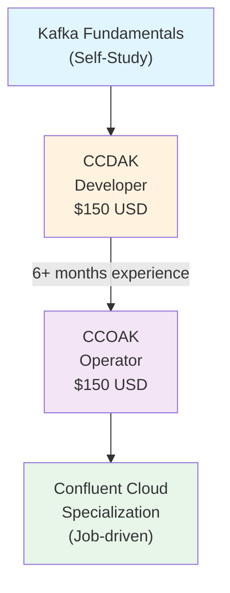
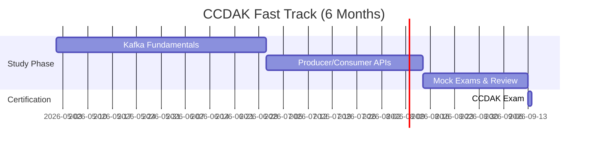
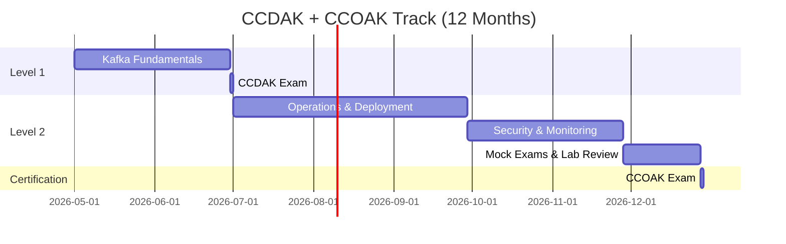
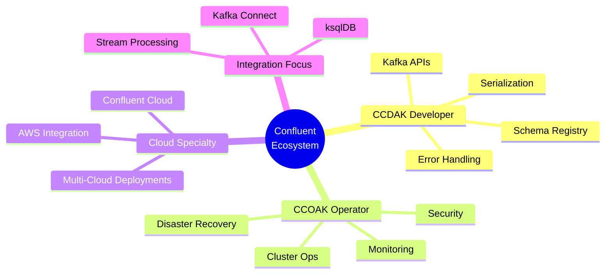
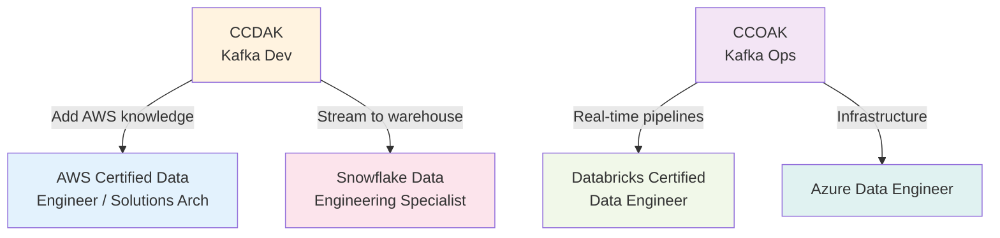

# Confluent Certification Roadmap

## Overview

Confluent offers industry-leading Apache Kafka certifications that validate expertise in building, deploying, and operating event-streaming applications. As enterprises accelerate digital transformation through real-time data pipelines, Kafka skills command premium compensation (20–30% salary bump for certified developers). The two-tier pathway—Developer first, then Operator—mirrors the technical progression from application development to production infrastructure management, making these certifications highly relevant for South African tech professionals entering or advancing in the data engineering space.

In 2026, event streaming remains a cornerstone of modern data architectures across fintech, e-commerce, IoT, and SaaS sectors. The CCDAK (entry) and CCOAK (advanced) certifications establish credibility for roles in streaming platform teams, cloud migration projects, and real-time analytics initiatives—critical competencies as organisations scale to handle continuous data flows.

## Progression Diagram



## Per-Level Detail

### Level 1: Entry — Confluent Certified Developer for Apache Kafka (CCDAK)

| Attribute | Value |
|-----------|-------|
| **Cost (USD)** | $150 |
| **Cost (ZAR)** | R2,700 |
| **Duration** | 90 minutes |
| **Questions** | 55 multiple-choice |
| **Pass Rate** | ~65% required |
| **Valid For** | 2 years |
| **Typical Salary (USD)** | $110,000–$130,000 |
| **Typical Salary (ZAR)** | R1,980,000–R2,340,000 |
| **Prerequisites** | 6–12 months Kafka/streaming experience; basic Java, Python, or REST knowledge |

#### What You Learn
- Kafka broker architecture, topics, partitions, and replication
- Producer and Consumer APIs (Java, Python)
- Serialisation & schema management (Avro, Protobuf, JSON Schema)
- Error handling, idempotence, and exactly-once semantics
- Confluent Platform integration
- Basic monitoring and troubleshooting

#### Study Materials
- [Confluent Training Portal](https://training.confluent.io/)
- Udemy: "Confluent Certified Developer for Apache Kafka" courses
- DataCamp: [The Complete Guide to Kafka Certifications](https://www.datacamp.com/blog/kafka-certifications)
- Official Study Guide: www.confluent.io/certification
- Hands-on labs: Confluent Cloud sandbox environment

#### Career Outcomes
- **Immediate:** Applications engineer, stream processing developer, data pipeline specialist
- **Senior roles:** Solutions architect for streaming platforms, kafka platform lead
- **Salary trajectory:** Entry $110K USD → 3 years $145K USD → 5 years $165K USD (or ZAR equivalents at R18/$1)

---

### Level 2: Professional — Confluent Certified Operator for Apache Kafka (CCOAK)

| Attribute | Value |
|-----------|-------|
| **Cost (USD)** | $150 |
| **Cost (ZAR)** | R2,700 |
| **Duration** | 90 minutes |
| **Questions** | 55 multiple-choice |
| **Pass Rate** | ~65% required |
| **Valid For** | 2 years |
| **Typical Salary (USD)** | $130,000–$160,000 |
| **Typical Salary (ZAR)** | R2,340,000–R2,880,000 |
| **Prerequisites** | CCDAK OR 2+ years production Kafka ops experience |

#### What You Learn
- Kafka cluster architecture, broker configuration, and tuning
- Deployment strategies (on-premises, cloud, hybrid)
- Security: ACLs, SASL, SSL/TLS, Kerberos
- Monitoring, logging, and performance optimization
- Disaster recovery, backups, and failover
- Confluent Control Center administration
- Multi-cluster and cross-datacenter replication
- Capacity planning and cost optimisation

#### Study Materials
- [Confluent CCOAK Training Program](https://training.confluent.io/content/certifications)
- Medium: [How to Prepare for CCOAK](https://medium.com/@stephane.maarek/how-to-prepare-for-the-confluent-certified-operator-for-apache-kafka-ccoak-exam-546cea7bb705)
- Udemy practice exams and labs
- Hands-on: Deploy and manage a multi-broker Kafka cluster
- Confluent documentation: Operations and deployment guides

#### Career Outcomes
- **Immediate:** Kafka platform engineer, SRE specialist, DevOps engineer (streaming focus)
- **Senior roles:** Platform architect, Head of Data Infrastructure, Kafka platform manager
- **Salary trajectory:** Entry $130K USD → 3 years $160K USD → 5 years $190K USD

---

## Recommended Progression Paths

### Path A: Rapid Developer Track (6 months)
**Target:** Individual contributors wanting streaming app development skills.



**Costs:** $150 USD (R2,700)  
**Salary Expectation:** $110,000–$130,000 USD annually (R1,980,000–R2,340,000)

---

### Path B: Operations Track (12 months)
**Target:** Infrastructure engineers transitioning to streaming platform roles.



**Costs:** $300 USD (R5,400)  
**Salary Progression:**  
- After CCDAK: $110K USD → $130K USD (R1,980,000–R2,340,000)
- After CCOAK: $130K USD → $160K USD (R2,340,000–R2,880,000)

---

## Prerequisites & Sequencing Matrix

| Prerequisite | CCDAK | CCOAK | Notes |
|--------------|-------|-------|-------|
| Kafka experience | 6–12 months | 2+ years OR CCDAK | CCOAK assumes deep operational knowledge |
| Language skills | Java/Python/REST basics | Systems & networking | Ops role demands broader infrastructure context |
| Infrastructure knowledge | Optional | Required | CCOAK covers deployment, HA, tuning |
| SQL/data modeling | Not required | Not required | Added value for analytics-heavy orgs |
| Cloud platform (AWS/Azure) | Optional | Helpful | Confluent Cloud labs accelerate learning |

---

## Specialisation Branches



---

## Cross-Vendor Bridges

### Confluent ↔ AWS / Azure / Databricks / Snowflake



| Bridge | Complementary Cert | Overlap | Time to Dual Cert |
|--------|-------------------|---------|-------------------|
| **Confluent + AWS** | AWS Certified Data Engineer | Real-time pipelines on AWS | 9–12 months |
| **Confluent + Databricks** | Databricks Certified Data Engineer | Stream processing & Delta Lake | 8–10 months |
| **Confluent + Snowflake** | Snowflake Data Engineering | Kafka → Snowflake ingestion | 8–9 months |
| **Confluent + Azure** | Azure Data Engineer Associate | Multi-cloud event streaming | 10–12 months |

---

## Cost Breakdown

### USD Costs
| Item | Cost | Notes |
|------|------|-------|
| CCDAK Exam (1 attempt) | $150 | Includes 55 questions, 90 min |
| CCOAK Exam (1 attempt) | $150 | Assumes CCDAK already passed |
| Study materials (Udemy, DataCamp, etc.) | $50–$150 | Typically one-time purchase |
| **Total (both certs)** | **$300–$350** | Assumes first-pass success |
| Retake buffer (1 CCOAK retry) | +$150 | Budget for re-exam if needed |

### ZAR Costs (at R18/$1 as of 2026-05-02)
| Item | Cost | Notes |
|------|------|-------|
| CCDAK Exam | R2,700 | $150 USD × 18 |
| CCOAK Exam | R2,700 | $150 USD × 18 |
| Study materials | R900–R2,700 | $50–$150 USD |
| **Total (both certs)** | **R5,400–R6,300** | Assumes first-pass success |

---

## Job Market Snapshot

**2026 Market Data:**
- **Job Openings:** 100+ Kafka-focused roles in North America; significant demand in EU and APAC
- **Salary Premium:** Certified developers command 20–30% premium vs. non-certified peers
- **Industries:** Fintech, e-commerce, IoT platforms, real-time analytics, SaaS
- **Typical Titles:** Streaming Data Engineer, Kafka Platform Engineer, SRE (Streaming), Solutions Architect
- **High-Demand Regions:** US, UK, Australia, Singapore, Canada

**South African Context:**  
Growing adoption in financial services (POPIA compliance), retail tech, and cloud-native startups. Certified candidates are rare and highly sought.

---

## Salary Trajectory

```mermaid
xychart-beta
    title Salary Progression: CCDAK → CCOAK
    x-axis [Entry, +1 yr, +2 yr, +3 yr, +5 yr]
    line "CCDAK Developer (USD)" [110000, 120000, 130000, 145000, 165000]
    line "CCOAK Operator (USD)" [130000, 145000, 155000, 170000, 200000]
    line "CCDAK Developer (ZAR)" [1980000, 2160000, 2340000, 2610000, 2970000]
    line "CCOAK Operator (ZAR)" [2340000, 2610000, 2790000, 3060000, 3600000]
```

**Notes:**  
- USD salaries based on 2026 market data; ZAR conversions assume R18/$1 rate
- CCOAK salary assumes progression after 6+ months of operator-level work
- Salaries vary by geography, company size, and specialisation
- Additional certifications (AWS, Databricks) can accelerate progression by +$15K–$30K

---

## Common Questions

### Q1: Do I need to take CCDAK before CCOAK?
**A:** Not strictly required, but highly recommended. CCDAK covers foundational Kafka concepts that CCOAK assumes you know. Most professionals follow the CCDAK → CCOAK path.

### Q2: How long should I study?
**A:** Expect 60–100 hours for CCDAK (4–8 weeks), and 80–120 hours for CCOAK (6–10 weeks). Prior hands-on experience significantly reduces study time.

### Q3: Is hands-on lab experience required?
**A:** Yes. Both exams heavily test practical knowledge. Use Confluent Cloud free tier or set up a local Kafka cluster for practice.

### Q4: What's the pass rate?
**A:** Industry estimates suggest 65–75% first-pass rate for CCDAK, and 60–70% for CCOAK. Proper study and practice exams increase your odds significantly.

### Q5: How relevant is this in South Africa?
**A:** Very relevant for companies in fintech (JSE listings, payment platforms), e-commerce (Takealot, etc.), and cloud-native startups. POPIA compliance drives demand for real-time data architectures. Certified professionals command premium salaries in ZAR (up to R3M+ for senior roles).

### Q6: Do certifications expire?
**A:** Yes, both expire after 2 years. Renewal requires passing the exam again or completing approved continuing education.

---

## Official Sources

- **Confluent Certification Portal:** https://www.confluent.io/certification/
- **Training Platform:** https://training.confluent.io/
- **CCDAK Exam Details:** https://training.confluent.io/examdetail/confluent-dev
- **Study Guide & Syllabus:** https://www.confluent.io/certification/
- **Community Resources:** https://mentorcruise.com/certifications/kafka/
- **DataCamp Kafka Guide:** https://www.datacamp.com/blog/kafka-certifications

---

*Last verified: 2026-05-02*  
*Salary and job market data sourced from Glassdoor, ZipRecruiter, Indeed, and industry reports.*
