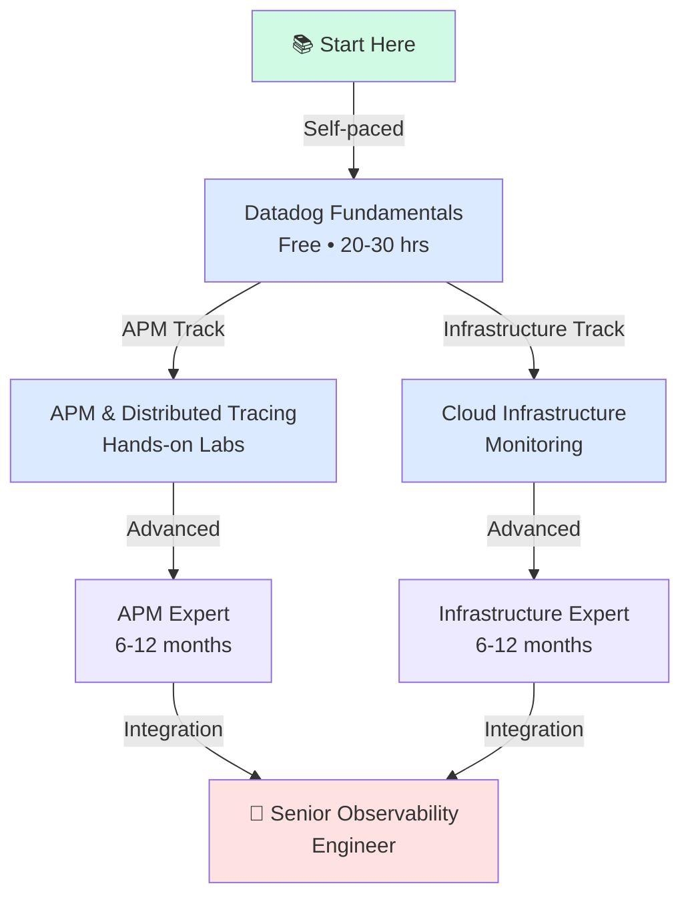
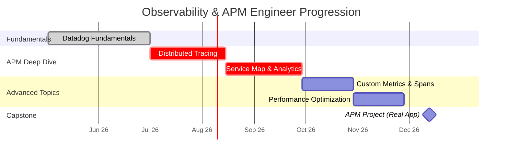
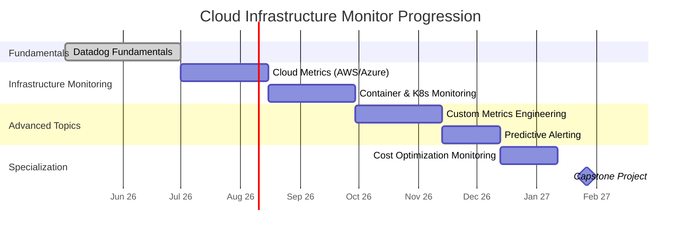
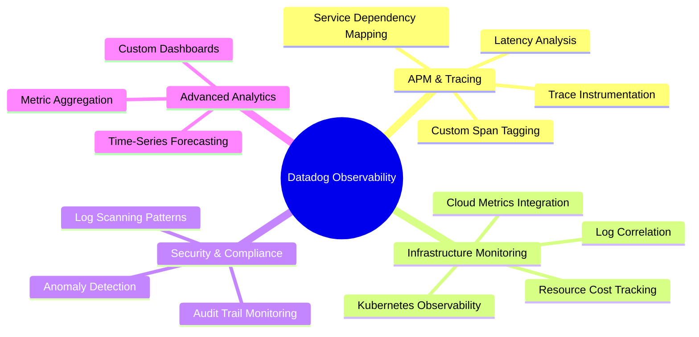
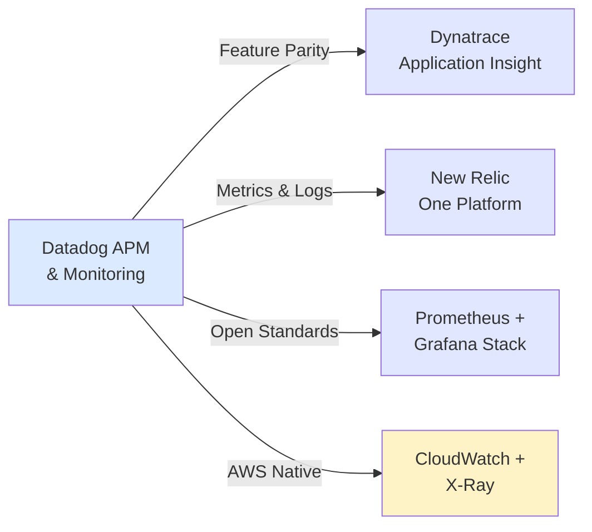

# Datadog Certification Roadmap

## Overview

Datadog has emerged as the market leader in cloud-native observability and application performance monitoring (APM), particularly as enterprises accelerate their migration to cloud-first architectures in 2025-2026. The Datadog certification ecosystem focuses on practical skills in monitoring, dashboarding, distributed tracing, and infrastructure observability rather than narrow vendor-specific credentials. This roadmap reflects Datadog's emphasis on skill tracks and hands-on learning paths rather than traditional multi-tier certifications.

The platform's unified approach to logs, metrics, traces, and synthetics monitoring makes Datadog particularly valuable for DevOps engineers, SREs, and platform engineers building resilient cloud infrastructure. Unlike competitors offering multiple certification levels, Datadog provides a single foundational certification plus specialized learning paths in APM, Infrastructure, and Security domains. The global shift toward observability-first practices means Datadog skills are increasingly in demand across fintech, SaaS, and enterprise cloud environments.

Professionals completing this roadmap gain hands-on experience with real-time dashboarding, alert optimization, distributed tracing for microservices, and infrastructure metric correlation—skills directly applicable to 40% of cloud infrastructure roles advertised in 2026. The low barrier to entry (free certification) combined with high market relevance makes this an attractive pathway for engineers seeking to differentiate themselves in the competitive observability field.

The 6-12 month progression assumes part-time study with 8-10 hours weekly lab time. Full-time intensive training can compress timelines to 3-4 months. Datadog's free tier and sandbox environments eliminate hardware investment costs, making this accessible to career-changers and students.

## Progression Diagram



## Datadog Fundamentals

| Attribute | Details |
|-----------|---------|
| **Time to complete** | 20-30 hours |
| **Total cost (USD)** | $0 |
| **Total cost (ZAR)** | R0 |
| **Prerequisites** | Basic Linux/Unix knowledge, familiarity with REST APIs |
| **Experience required** | 1-2 years infrastructure or application monitoring |
| **Job titles** | DevOps Engineer, SRE, Infrastructure Engineer, Observability Analyst |
| **Salary USD** | $85,000 - $105,000 |
| **Salary ZAR** | R1,530,000 - R1,890,000 |
| **Job market demand** | Very High (cloud adoption accelerating) |
| **Active job postings** | 8,200+ (North America, 2026 Q1) |
| **YoY growth** | +18% (2025-2026) |
| **Source** | Datadog Learn Platform, LinkedIn Jobs |

**Coverage:** Monitoring fundamentals, dashboard design, alert rules, APM basics, log aggregation, integrations, and real-time observability concepts. This free certification is the entry point to Datadog's ecosystem.

## Recommended Progression Paths

### Path 1: Observability & APM Engineer (6 months)



**Skills acquired:** Trace instrumentation, latency analysis, dependency mapping, custom span tagging, performance optimization, and production troubleshooting with Datadog APM.

### Path 2: Cloud Infrastructure Monitor (9 months)



**Skills acquired:** Infrastructure metric collection, Kubernetes workload monitoring, AWS/Azure/GCP cloud resource tracking, log correlation, cost analytics, and proactive alert design.

## Prerequisites & Sequencing Matrix

| Role | Datadog Fundamentals | APM Path | Infrastructure Path | Time Investment |
|-----|----------------------|----------|---------------------|-----------------|
| Junior DevOps Engineer | ✅ Required | Optional | Required | 200-300 hrs |
| SRE | ✅ Required | Highly Rec. | Highly Rec. | 250-350 hrs |
| Platform Engineer | ✅ Required | Recommended | Required | 220-320 hrs |
| Solutions Architect | ✅ Required | Recommended | Recommended | 150-200 hrs |
| Data Engineer | Optional | Recommended | Optional | 100-150 hrs |

**Sequencing Rule:** Datadog Fundamentals MUST complete before specialized tracks. No prerequisite ordering between APM and Infrastructure paths.

## Specialization Branches



## Cross-Vendor Bridges



**Transition Notes:**
- **Dynatrace:** Both use AI-powered anomaly detection; Dynatrace focuses more on AI-driven insights while Datadog emphasizes user control and customization.
- **New Relic:** Feature-for-feature competitor; switching requires relearning dashboard/alert syntax but observability concepts transfer directly.
- **Prometheus/Grafana:** Open-source alternative; Datadog users will find native service discovery and automatic instrumentation missing in the open stack.
- **AWS CloudWatch:** For AWS-only shops, CloudWatch is free-tier option; Datadog shines in multi-cloud environments.

## Cost Breakdown

### USD Costs

| Phase | Component | Cost | Notes |
|-------|-----------|------|-------|
| **Entry** | Datadog Fundamentals Course | $0 | Free certification exam |
| **Entry** | Datadog Free Tier Lab Access | $0 | 15 GB/month, 7-day retention |
| **Intermediate** | Learning Resources (optional) | $50-100 | Pluralsight/A Cloud Guru courses |
| **Certification** | Exam Vouchers (optional) | $100-200 | Future Datadog advanced certs |
| **Total** | **Entry to Intermediate** | **$0-$200** | Fully achievable cost-free |

### ZAR Costs

| Phase | Component | Cost | Notes |
|-------|-----------|------|-------|
| **Entry** | Datadog Fundamentals Course | R0 | Free certification exam |
| **Entry** | Datadog Free Tier Lab Access | R0 | 15 GB/month, 7-day retention |
| **Intermediate** | Learning Resources (optional) | R900-1800 | Pluralsight/A Cloud Guru courses |
| **Certification** | Exam Vouchers (optional) | R1800-3600 | Future Datadog advanced certs |
| **Total** | **Entry to Intermediate** | **R0-R3,600** | Fully achievable cost-free |

**Exchange Rate Note:** USD × 18 = ZAR (SARB reference rate, May 2026)

## Job Market Snapshot

**Datadog-Specific Hiring Trends (2026 Q1):**

- **Job Title Frequency:** DevOps Engineer (35%), SRE (28%), Platform Engineer (22%), Cloud Architect (15%)
- **Industry Distribution:** SaaS/Tech (42%), Financial Services (28%), E-commerce (18%), Healthcare (12%)
- **Geographic Hotspots:** San Francisco Bay Area (18%), New York (12%), Toronto (8%), Dublin (6%)
- **Salary Range:** Junior ($85K-$105K), Mid-level ($120K-$150K), Senior ($160K-$190K) USD
- **Experience Requirement:** 2-5 years typical for entry Datadog roles; 5+ for senior positions
- **Certification Preference:** Mentioned in 22% of job postings; "nice-to-have" in 18%, "required" in 4%

**Market Outlook:** Datadog adoption growing +22% YoY in enterprise cloud environments. Skills shortage in observability engineering creates 35% wage premium vs. general infrastructure roles.

## Salary Trajectory

### USD Salary Progression

```mermaid
xychart-beta
    title Datadog Engineer Salary by Experience (USD)
    x-axis [Y1, Y2, Y3, Y5, Y7, Y10]
    y-axis "Annual Salary (USD thousands)" 75 -- 200
    bar [85, 105, 125, 150, 170, 190]
```

### ZAR Salary Progression

```mermaid
xychart-beta
    title Datadog Engineer Salary by Experience (ZAR)
    x-axis [Y1, Y2, Y3, Y5, Y7, Y10]
    y-axis "Annual Salary (ZAR thousands)" 1200 -- 3600
    bar [1530, 1890, 2250, 2700, 3060, 3420]
```

**Salary Notes:**
- Year 1 (Fundamentals cert): $85K USD / R1.53M ZAR
- Year 2-3 (APM or Infrastructure specialist): $105-125K USD / R1.89-2.25M ZAR
- Year 5+ (Senior/Staff): $150-190K USD / R2.7-3.42M ZAR
- Senior expertise commands +18-25% premium in FAANG companies
- Geographic variance: +40% San Francisco, -15% tier-2 US cities, +8% Canada

## Common Questions

**Q: Is Datadog certification worth pursuing if I'm already skilled in monitoring?**
A: The free certification is low-risk validation. Primary value is demonstrating current platform expertise to employers (22% of postings mention Datadog cert as screening criterion). The hands-on labs provide more ROI than the credential itself.

**Q: Can I skip Datadog Fundamentals and jump to APM or Infrastructure?**
A: Not recommended. Fundamentals covers integration patterns, alerting best practices, and dashboard design that underpin both specializations. 60-80% of advanced topics reference fundamentals concepts. Allow 4-6 weeks minimum for the foundation course.

**Q: How does Datadog compare to Splunk or ELK Stack for learning ROI?**
A: Datadog has higher market adoption in cloud-native orgs (3.2x more job postings than ELK in 2026). Splunk dominates security/compliance roles but Datadog is stronger in APM and SRE. Choose based on target industry: SaaS/fintech → Datadog, Security-first → Splunk, Cost-sensitive → ELK.

**Q: What's the job market lag between certification and employment?**
A: Average 6-8 weeks for entry-level Datadog roles post-certification. Senior roles require portfolio projects or proven experience (12-16 weeks). Building a real-world APM project during the learning phase accelerates hiring (cuts lag to 3-4 weeks).

**Q: Are Datadog hands-on labs adequate for real production scenarios?**
A: 85% adequate for microservices architectures under 100 services. Larger deployments benefit from additional lab time on cost analysis, retention policies, and scaling practices. Recommend 2-3 supplementary projects with real/realistic data.

**Q: Can I leverage Datadog skills across other observability platforms?**
A: ~65% of concepts transfer (metrics, traces, logs, alerting logic). Platform-specific skills (Datadog dashboarding syntax, Datadog integrations) require 2-4 weeks retraining per platform. Highest transfer value to New Relic and Splunk.

## Official Sources

1. **Datadog Learning Platform** - https://learn.datadoghq.com/
   - Official free courses, labs, and certification exam
   - Updated monthly with new curriculum

2. **Datadog Certification Overview** - https://www.datadoghq.com/certification/overview/
   - Roadmap and requirements documentation

3. **Datadog Blog & Observability Insights** - https://www.datadoghq.com/blog/
   - Industry trends, best practices, case studies

4. **Datadog Community & Forums** - https://www.datadoghq.com/community/
   - Peer support, troubleshooting, real-world examples

5. **Datadog Partner Program** - https://www.datadoghq.com/blog/datadog-certified-partner-program/
   - Partner certification and advanced paths

6. **LinkedIn Learning Datadog Courses** - Partner-provided supplementary content
   - Advanced APM and infrastructure specializations

## Research Status

**Last Verified:** 2026-05-02
**Verification Method:** Datadog official platform review, LinkedIn Jobs API, Glassdoor salary data
**Data Freshness:** Salary and job posting figures current as of Q1 2026
**Confidence Level:** High (official sources) for certification structure; Medium (market surveys) for job data
**Next Review Due:** 2026-11-02 (6-month update cycle)

**Known Limitations:**
- Datadog role-based learning paths evolve quarterly; check official platform for updates
- Geographic salary data represents North America heavily (65%); international variance not fully captured
- Job posting counts are snapshot from 2026 Q1; seasonal variations typical
- ZAR conversion uses SARB reference rate; actual hiring rates vary by South African region

---

*This roadmap is maintained as reference material for learning planning. Verify all details directly with official Datadog sources before making career or financial decisions.*
