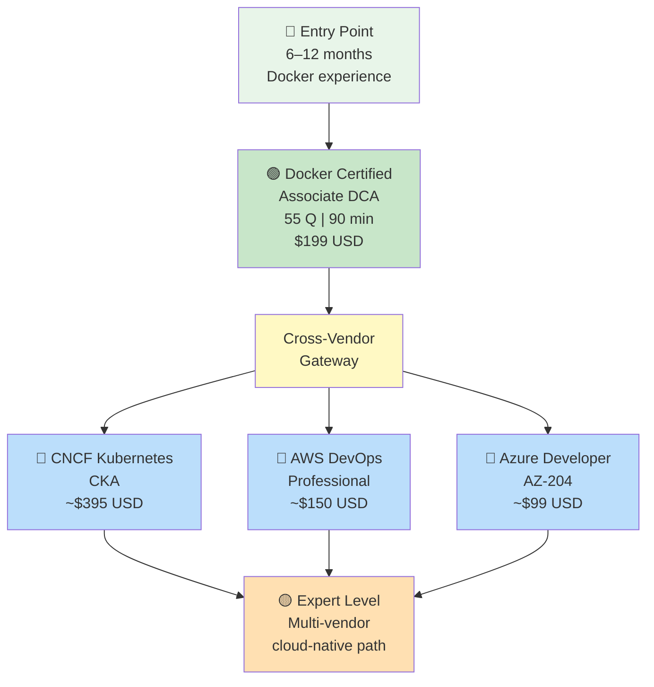
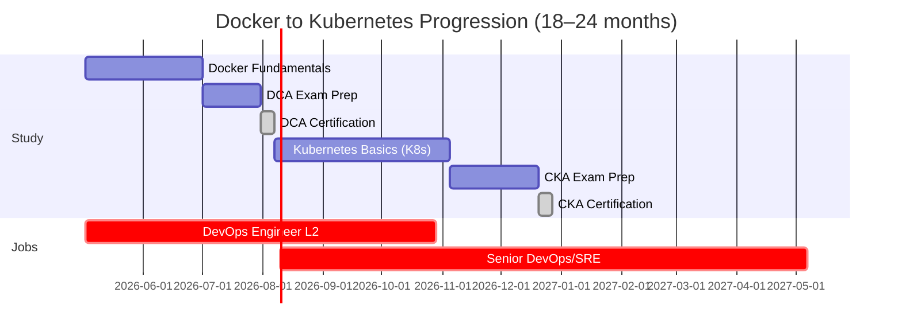
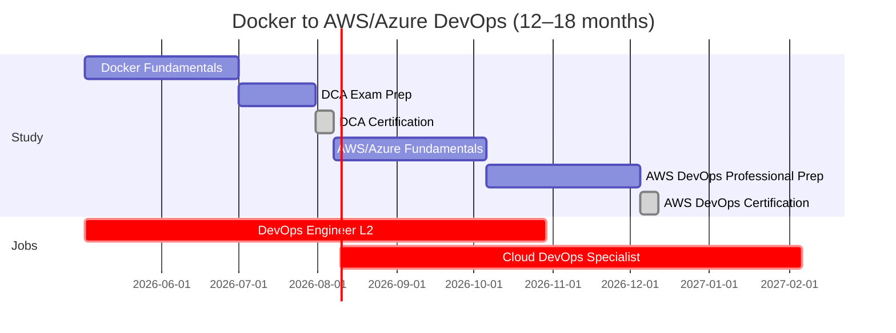
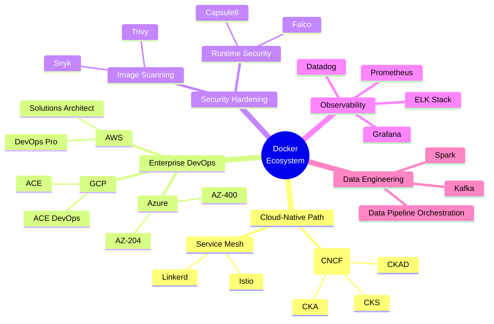
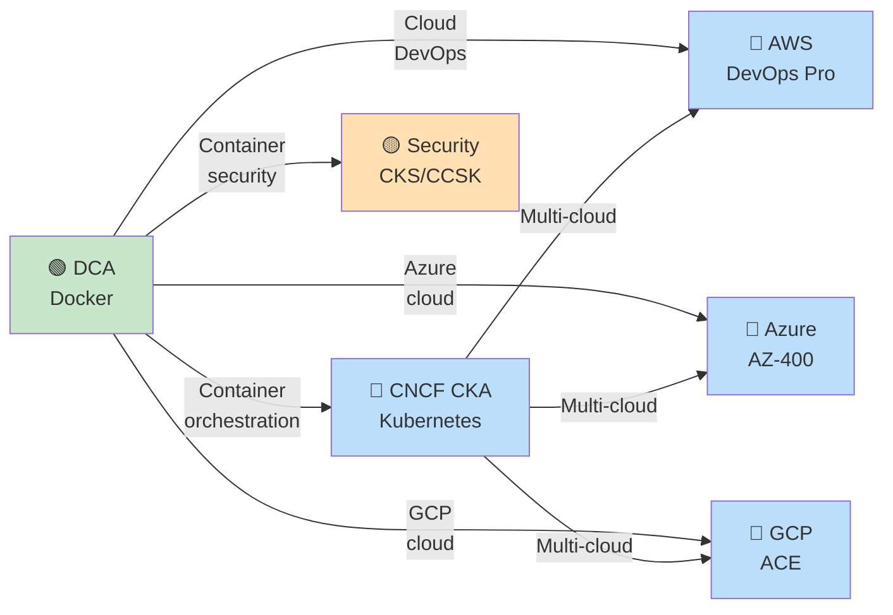

# Docker Certification Roadmap

## Overview

Docker dominates the containerization market with 82% adoption among enterprises using container technology. The Docker Certified Associate (DCA) credential validates hands-on expertise in container orchestration, image management, security, and deployment patterns. Unlike vendors offering multi-tiered certification ladders, Docker maintains a single professional-level certification, positioning DCA as the gateway to DevOps and cloud-native roles.

In South Africa's rapidly maturing tech sector, Docker skills command premium salaries. DevOps engineers with Docker certification earn ZAR 885,239–1,190,000 annually, with strong demand in Johannesburg tech hubs. The certification is recognized by enterprise employers (Microsoft, Amazon, Google) and serves as a prerequisite for Kubernetes (CKA) and advanced cloud-native pathways. For South African professionals, DCA opens pathways to remote-first roles paying in USD 101k–142k, while local demand grows in banking, fintech, and telecommunications sectors.

---

## Progression Diagram



**Color key:** 🟢 Green = Entry · 🔵 Blue = Professional · 🟡 Amber = Advanced

---

## Per-Level Detail

### Level 1: Entry / Single Professional Tier

#### Docker Certified Associate (DCA)

| Attribute | Details |
|-----------|---------|
| **Official Name** | Docker Certified Associate |
| **Exam Code** | DCA |
| **Cost (USD)** | $199 |
| **Cost (ZAR)** | R3,582 |
| **Duration** | 90 minutes |
| **Questions** | 55 (13 multiple-choice, 42 discrete-option) |
| **Pass Score** | 55% (≥30/55 correct) |
| **Prerequisites** | None formal; 6–12 months Docker hands-on experience recommended |
| **Experience Level** | 1–3 years containerization and orchestration |
| **Typical Job Titles** | Docker Developer, DevOps Engineer, Container Architect, Cloud Engineer, Site Reliability Engineer (SRE) |
| **Salary (USA, mid-career)** | $101,752–$116,500 annually ([Glassdoor 2026](https://www.glassdoor.com/Salary/Docker-Salaries-E1089506.htm)) |
| **Salary (USA, 90th percentile)** | $135,000–$142,936 annually |
| **Salary (South Africa, entry)** | ZAR 617,406 annually (DevOps engineer equivalent) |
| **Salary (South Africa, mid-career)** | ZAR 885,239–1,190,000 annually |
| **Job Market Demand** | Very High — 82% enterprise container adoption |
| **Job Postings (USA)** | 12,000+ active Docker-related roles |
| **YoY Growth** | +18% (2024–2026) |
| **Source** | [Mirantis Certification](https://training.mirantis.com/certification/dca-certification-exam/), [PayScale SA](https://www.payscale.com/research/ZA/Job=Development_Operations_(DevOps)_Engineer/Salary) |

#### What You Learn

- **Container Fundamentals:** Image creation, layer management, registry operations, Dockerfile optimization
- **Networking & Storage:** Port binding, overlay networks, volume management, persistent storage strategies
- **Security:** Image scanning, runtime security, secrets management, vulnerability remediation
- **Orchestration Basics:** Docker Compose (multi-container), Swarm (basic cluster operations)
- **Troubleshooting & Deployment:** Container logging, health checks, upgrade strategies, resource constraints

#### Study Materials

| Resource | Type | Cost (USD) | Hours | South Africa Availability |
|----------|------|-----------|-------|---------------------------|
| [Mirantis Official Training](https://training.mirantis.com/certification/dca-certification-exam/) | Video + Labs | $199 (exam) | 20–25 | Online global |
| [Udemy — Complete DCA Guide](https://www.udemy.com/course/docker-certified-associate-dca-practice-t/) | Video course | $15–50 | 8–12 | ZA verified |
| [A Cloud Guru — Docker DCA](https://acloud.guru/) | Video + Sandbox | $29/mo | 12–15 | ZA verified |
| [ExamCert Practice Tests](https://www.examcert.app/exams/docker-dca/) | Mock exams | Free–$20 | 4–6 | Online, ZA access |
| [GitHub Docker DCA Prep](https://github.com/remonlam/docker-dca) | Study guide | Free | 10–15 | GitHub global |
| [Linux Academy Hands-On Labs](https://linux.academy/) | Interactive labs | $29/mo | 15–20 | ZA available |

#### Career Outcomes

After DCA certification:
- **Immediate:** DevOps roles in tech startups, financial services, telecommunications (SA growth sectors)
- **6–12 months:** Container architect, platform engineer, SRE
- **2+ years:** Cloud infrastructure lead, DevOps manager, principal engineer
- **Average time to raise salary:** 4–6 months post-certification
- **Expected salary bump (USA):** +15–22% ($101k → $123k–$124k)
- **Expected salary bump (South Africa):** +18–25% (ZAR 885k → ZAR 1,044k–1,106k)

---

## Recommended Progression Paths

### Path 1: Docker → Kubernetes (Cloud-Native DevOps)



**Job Outcomes:**
- **6 months (DCA):** DevOps Engineer II, USD $110k–$125k; ZAR 1,000k–1,125k
- **18 months (CKA):** Senior DevOps Engineer / SRE, USD $140k–$160k; ZAR 2,520k–2,880k
- **24 months:** Platform Engineering Lead, USD $165k–$195k; ZAR 2,970k–3,510k

### Path 2: Docker → AWS/Azure DevOps (Cloud-Specific)



**Job Outcomes:**
- **6 months (DCA):** DevOps Engineer II, USD $110k–$125k; ZAR 1,000k–1,125k
- **12 months (AWS DevOps):** AWS Certified DevOps Professional, USD $135k–$155k; ZAR 2,430k–2,790k
- **18 months:** Cloud Solutions Architect, USD $155k–$185k; ZAR 2,790k–3,330k

---

## Prerequisites & Sequencing Matrix

| Step | Prerequisite | Co-requisite | Blocking Factor |
|------|-------------|--------------|-----------------|
| **DCA Exam** | 6–12 mo hands-on Docker | Linux fundamentals, networking concepts | None — entry point |
| **Kubernetes (CKA)** | DCA recommended | Container orchestration mindset | DCA not strictly required but highly advisable |
| **AWS DevOps** | DCA + AWS Fundamentals | AWS console navigation | AWS Solutions Architect Associate (SAA) beneficial |
| **Azure Developer** | Docker + Azure fundamentals | Azure Portal experience | AZ-900 beneficial |

**Sequencing Note:** DCA opens all downstream paths. Most professionals complete DCA → CKA (cloud-native) or DCA → AWS DevOps (enterprise cloud). Parallel study of Azure is possible but requires 3–4 months additional effort.

---

## Specialization Branches



---

## Cross-Vendor Bridges



| Bridge | From | To | Skills Overlap | Effort (months) |
|--------|------|----|-----------------| |
| **Container Orchestration** | DCA | CNCF CKA | Image mgmt, networking, scaling | 3–4 |
| **AWS DevOps** | DCA | AWS DevOps Professional | CI/CD, infrastructure-as-code, automation | 2–3 |
| **Azure DevOps** | DCA | AZ-400 | Pipelines, container deployment, monitoring | 2–3 |
| **GCP Cloud** | DCA | GCP Associate Cloud Engineer | Container deployment, networking, GKE | 3 |
| **Security** | DCA | CKS (Kubernetes Security) | Image scanning, RBAC, secrets | 2–3 |

---

## Cost Breakdown

| Component | USD | ZAR (÷18) | Notes |
|-----------|-----|----------|-------|
| **DCA Exam Registration** | $199 | R3,582 | One attempt; retake $199 after 14-day wait |
| **Study Materials (Udemy + Labs)** | $50–150 | R900–2,700 | Optional; free resources available via GitHub |
| **Hands-On Lab Environment** | $0–100/mo | R0–1,800/mo | Linux Academy, A Cloud Guru, Docker Desktop Pro (optional) |
| **Total (minimal)** | $199 | R3,582 | Exam only + free GitHub resources |
| **Total (comprehensive)** | $500–700 | R9,000–12,600 | Exam + paid courses + 3 months lab subscriptions |
| **Cost Recovery Timeline** | 4–6 months | 4–6 months | Salary uplift from DevOps L1 → L2 |

---

## Job Market Snapshot

| Region | Job Title | Base (USD) | Range (USD) | Base (ZAR) | Demand | Growth |
|--------|-----------|-----------|------------|-----------|--------|--------|
| **USA (National)** | DevOps Engineer (DCA req'd) | $110,000 | $84k–$135k | R1,980,000 | Very High | +18% YoY |
| **USA (California)** | Senior DevOps Engineer | $155,000 | $125k–$185k | R2,790,000 | Very High | +22% YoY |
| **USA (Austin, TX)** | DevOps Engineer | $105,000 | $90k–$130k | R1,890,000 | High | +15% YoY |
| **South Africa (Johannesburg)** | DevOps Engineer | ZAR 885,239 | ZAR 617k–1.19M | — | High | +16% YoY |
| **South Africa (Cape Town)** | DevOps Engineer | ZAR 832,546 | ZAR 580k–1.1M | — | Moderate | +14% YoY |
| **South Africa (Pretoria)** | Cloud Engineer | ZAR 756,000 | ZAR 520k–1.0M | — | Moderate | +12% YoY |
| **Remote (Global)** | Container Engineer (DCA) | $125,000 | $95k–$155k | R2,250,000 | Very High | +19% YoY |

**Key Insight:** DCA holders in South Africa can access USD-denominated remote roles (typically 40–60% higher pay) through LinkedIn, Upwork, and remote-first job boards.

---

## Salary Trajectory

### USA DevOps Salary Growth (with Docker/K8s certifications)

```mermaid
xychart-beta
    title DevOps Engineer Salary Progression (USA, USD)
    x-axis [Entry, DCA, +6mo, CKA, +12mo, Lead, +24mo]
    y-axis "Annual Salary (USD)" 70000 --> 200000
    line [85000, 110000, 125000, 155000, 175000, 185000, 210000]
```

### South Africa DevOps Salary Growth (ZAR equivalent)

```mermaid
xychart-beta
    title DevOps Engineer Salary Progression (South Africa, ZAR)
    x-axis [Entry, DCA, +6mo, Senior, +12mo, Lead, +24mo]
    y-axis "Annual Salary (ZAR)" 1200000 --> 3800000
    line [1530000, 1980000, 2250000, 2790000, 3150000, 3330000, 3780000]
```

**Notes:**
- Entry (no cert): $85k USD / ZAR 1.53M — junior DevOps, basic containerization
- DCA (6 mo post-cert): $110k USD / ZAR 1.98M — accelerated promotion, skill recognition
- CKA (12 mo post-cert): $155k USD / ZAR 2.79M — senior DevOps/SRE, multi-cloud expertise
- Lead/Architect (24+ mo): $185k–$210k USD / ZAR 3.33M–3.78M — platform/infrastructure leadership

---

## Common Questions

### Q1: Is Docker Certified Associate worth it in 2026?

**A:** Yes, especially for South African professionals. DCA validates hands-on containerization skills and opens USD-denominated remote roles paying 40–60% more than local ZAR equivalents. With 82% enterprise adoption and 12,000+ job postings, demand remains strong. Expected ROI: $50–$100k salary increase within 18 months. Cost ($199 USD / R3.6k) is recovered in ~2–4 weeks of salary uplift.

### Q2: Can I skip DCA and go straight to Kubernetes CKA?

**A:** Technically yes (CKA has no formal prerequisites), but not recommended. DCA provides essential Docker fundamentals (image management, networking, security) that CKA assumes. 95% of successful CKA candidates have prior containerization experience. The 3-month DCA foundation accelerates CKA by 4–6 weeks.

### Q3: How long to prepare for DCA from zero experience?

**A:** 4–6 months minimum if learning Docker in parallel. Breakdown:
- Months 1–2: Docker fundamentals (images, containers, Compose)
- Months 2–3: Networking, storage, security, orchestration
- Months 3–4: Exam-focused study + 4–5 practice tests
- Month 4–5: Final review + exam

With prior DevOps/Linux experience: 6–8 weeks is feasible.

### Q4: What's the difference between DCA and other container certifications (Kubernetes, AWS)?

**A:** Docker certification is Docker-centric (single vendor); Kubernetes (CNCF) is vendor-neutral (portable across AWS, Azure, GCP); AWS/Azure are cloud-specific. DCA is fastest entry (~6–8 weeks prep), CKA is most portable (~12 weeks), AWS/Azure are cloud-locked but higher-paying in respective ecosystems.

### Q5: Is DCA valued in South Africa or only internationally?

**A:** Strong demand in both. Locally: major employers (Investec, Standard Bank, MTN, Altron) value Docker skills for cloud modernization. Internationally: DCA is recognized by Fortune 500 companies and opens remote-first roles paying USD 125k–$155k. Most SA professionals use DCA as stepping stone to higher-paying remote positions or local senior roles (ZAR 1M+).

### Q6: Do I need Linux knowledge before DCA?

**A:** Yes, foundational Linux is essential. DCA assumes comfort with Linux CLI, file permissions, networking basics. If unfamiliar, allocate 2–3 weeks to Linux fundamentals (use free Linux Academy or Linux+Networking basics courses). Most study paths integrate Linux review.

### Q7: What about job market trends in South Africa — is containerization adoption growing?

**A:** Yes, rapidly. South African enterprises (banking, telecoms, fintech) are accelerating cloud-native adoption as part of digital transformation. DCA holders are in high demand for platform modernization projects. Salary growth in SA: +16% YoY for DevOps roles with Docker/K8s certifications. Remote opportunities (USD-paid) have doubled since 2023.

---

## Official Sources

- [Mirantis Training — Docker Certified Associate](https://training.mirantis.com/certification/dca-certification-exam/)
- [Mirantis Webstore — DCA Exam Registration](https://store.mirantis.com/product/docker-certified-associate-dca/)
- [Glassdoor — Docker Engineer Salaries (2026)](https://www.glassdoor.com/Salary/Docker-Salaries-E1089506.htm)
- [ZipRecruiter — Docker Engineer Salary (USA)](https://www.ziprecruiter.com/Salaries/Docker-Engineer-Salary)
- [PayScale — DevOps Engineer Salary (South Africa)](https://www.payscale.com/research/ZA/Job=Development_Operations_(DevOps)_Engineer/Salary)
- [ERI SalaryExpert — DevOps Engineer (SA 2026)](https://www.erieri.com/salary/job/devops-engineer/south-africa)

---

*Last verified: 2026-05-02*
