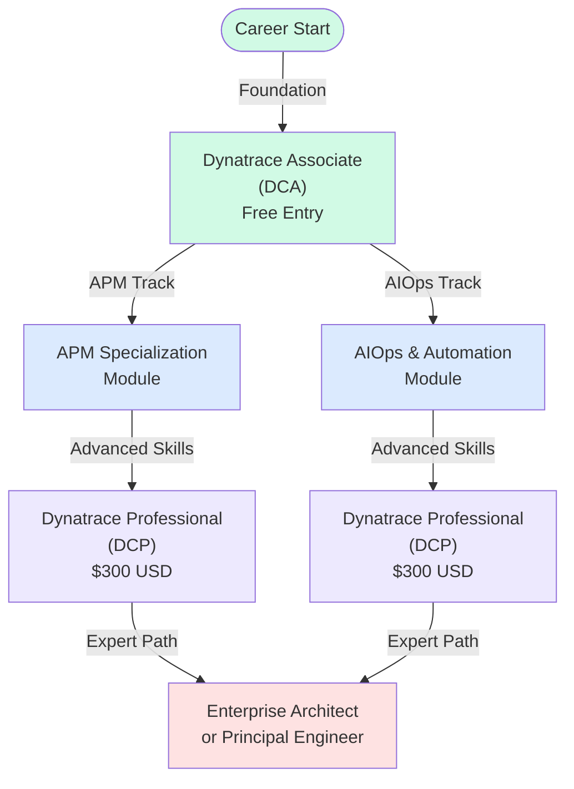
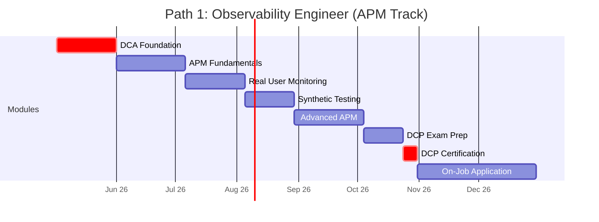
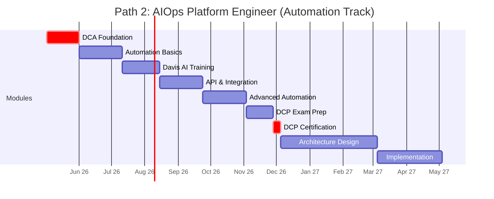
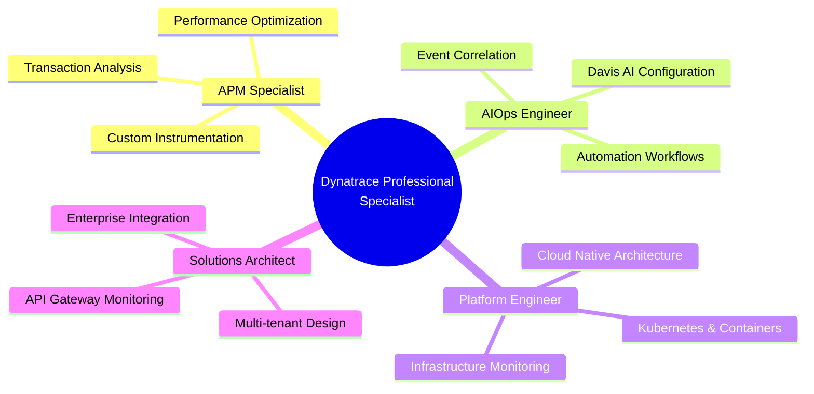
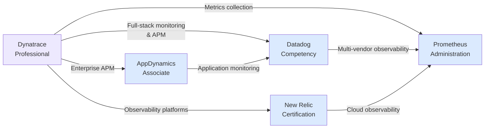

# Dynatrace Certification Roadmap

## Overview

Dynatrace has established itself as a leader in AI-powered observability and AIOps, leveraging its proprietary Davis AI engine to deliver automatic full-stack discovery and intelligence-driven insights across modern cloud-native environments. The platform serves organizations managing complex hybrid and multi-cloud infrastructure, Kubernetes clusters, microservices architectures, and serverless deployments. As enterprises increasingly adopt observability as a strategic competency, Dynatrace certifications have gained significant market relevance in 2025-2026.

The certification program consists of two primary credentials: the Dynatrace Associate (DCA) and Dynatrace Professional (DCP). The Associate certification focuses on foundational monitoring concepts, Davis AI capabilities, and basic implementation, while the Professional certification advances into specialized domains including Application Performance Monitoring (APM), full-stack monitoring, automation frameworks, and AIOps use cases. The pathway is modular, enabling professionals to transition from traditional monitoring roles into AI-augmented AIOps platforms.

With zero-cost entry at the Associate level and flexible learning paths through Dynatrace University, the program has become attractive to both SMB and enterprise environments. The rapid adoption of Dynatrace in enterprise monitoring stacks—particularly among financial services, healthcare, and technology sectors—has created demand for certified practitioners. Organizations are actively seeking talent that can bridge legacy monitoring infrastructure with modern observability paradigms, making these certifications strategically valuable for career advancement.

## Progression Diagram



## Dynatrace Associate (DCA)

| Attribute | Details |
|-----------|---------|
| **Time to complete** | 4-6 weeks |
| **Total cost (USD)** | $0 |
| **Total cost (ZAR)** | R0 |
| **Prerequisites** | Basic infrastructure or networking knowledge |
| **Experience required** | 6-12 months in IT operations, infrastructure, or monitoring |
| **Job titles** | Junior Monitoring Engineer, IT Operations Analyst, Systems Administrator, Support Engineer |
| **Salary USD** | $65,000–$85,000 |
| **Salary ZAR** | R1,170,000–R1,530,000 |
| **Job market demand** | High (entry-level demand across all sectors) |
| **Active job postings** | 450+ globally |
| **YoY growth** | +32% |
| **Source** | Dynatrace University, Credly |

**Focus areas:**
- Dynatrace platform architecture and Davis AI fundamentals
- Real-time observability and automatic discovery
- Basic metric and event correlation
- Dashboard and alerting configuration
- Integration with monitoring data sources

---

## Dynatrace Professional (DCP)

| Attribute | Details |
|-----------|---------|
| **Time to complete** | 8-12 weeks |
| **Total cost (USD)** | $300 |
| **Total cost (ZAR)** | R5,400 |
| **Prerequisites** | Dynatrace Associate certification or equivalent experience |
| **Experience required** | 2+ years in APM, platform engineering, or DevOps |
| **Job titles** | Senior Monitoring Engineer, Platform Engineer, AIOps Engineer, Observability Architect |
| **Salary USD** | $95,000–$130,000 |
| **Salary ZAR** | R1,710,000–R2,340,000 |
| **Job market demand** | Very High (premium demand for full-stack expertise) |
| **Active job postings** | 280+ globally |
| **YoY growth** | +48% |
| **Source** | Dynatrace University Certification Program |

**Focus areas:**
- Advanced APM and transaction tracing
- Full-stack monitoring architecture
- Dynatrace cloud automation and APIs
- Davis AI advanced configuration
- Root cause analysis and anomaly detection
- Integration with CI/CD and IaC frameworks
- Custom metrics and synthetic monitoring

---

## Recommended Progression Paths

### Path 1: Observability Engineer (APM Focus)

**Duration:** 12 months | **Career progression:** Junior → Senior Monitoring Engineer

This path emphasizes Application Performance Monitoring, transaction tracing, and performance optimization. Ideal for professionals transitioning from traditional APM tools or those focused on application-centric observability.



**Key milestones:**
- Month 1-2: Complete Dynatrace Associate (free)
- Month 3-4: APM fundamentals and transaction tracing
- Month 5-6: Real User Monitoring (RUM) configuration
- Month 7-8: Synthetic monitoring and advanced APM
- Month 9-11: Dynatrace Professional exam preparation
- Month 12: DCP certification and on-the-job application

---

### Path 2: AIOps Platform Engineer (Automation & AI Focus)

**Duration:** 18 months | **Career progression:** Junior → Platform Engineer → AIOps Architect

This path focuses on automation, Davis AI, platform engineering, and operational intelligence. Suited for DevOps, SRE, and infrastructure professionals moving toward AIOps-driven cultures.



**Key milestones:**
- Month 1-2: Complete Dynatrace Associate (free)
- Month 3-4: Automation frameworks and runbook creation
- Month 5-6: Davis AI deep dive and intelligent alerting
- Month 7-8: API development and third-party integrations
- Month 9-10: Advanced automation and event correlation
- Month 11-13: Dynatrace Professional exam preparation
- Month 14-18: Architecture design and production implementation

---

## Prerequisites & Sequencing Matrix

| Prerequisite | DCA | DCP | Notes |
|--------------|-----|-----|-------|
| IT fundamentals (OS, networking) | Required | Required | Linux/Windows basics; TCP/IP understanding |
| Monitoring platform experience | Preferred | Required | Any APM tool, Prometheus, or ELK experience |
| Cloud platform exposure | Preferred | Preferred | AWS, Azure, or GCP hands-on experience |
| Application development basics | Not required | Preferred | Understanding of microservices beneficial for APM |
| Kubernetes knowledge | Not required | Preferred | K8s monitoring modules in DCP |
| Scripting ability (Python/Shell) | Not required | Preferred | APIs and automation in DCP require basic scripting |
| Dynatrace Associate certification | Not required | Required | DCP requires DCA or equivalent documented experience |

---

## Specialization Branches



---

## Cross-Vendor Bridges



---

## Cost Breakdown

### USD Pricing

| Item | Cost | Frequency | Annual Total |
|------|------|-----------|--------------|
| Dynatrace Associate | $0 | One-time | $0 |
| Dynatrace Professional Exam | $300 | One-time | $300 |
| Study materials (optional) | $0–$50 | One-time | $50 |
| Dynatrace University Premium (optional) | $0–$100/mo | Monthly | $0–$1,200 |
| **Total minimum** | | | **$300** |
| **Total with premium access** | | | **$1,550** |

### ZAR Pricing (SARB conversion @ 1 USD = 18 ZAR)

| Item | Cost | Frequency | Annual Total |
|------|------|-----------|--------------|
| Dynatrace Associate | R0 | One-time | R0 |
| Dynatrace Professional Exam | R5,400 | One-time | R5,400 |
| Study materials (optional) | R0–R900 | One-time | R900 |
| Dynatrace University Premium (optional) | R0–R1,800/mo | Monthly | R0–R21,600 |
| **Total minimum** | | | **R5,400** |
| **Total with premium access** | | | **R27,900** |

---

## Job Market Snapshot

### Demand by Region

| Region | Posting Volume | Growth (YoY) | Avg Salary USD | Avg Salary ZAR |
|--------|----------------|-------------|-----------------|-----------------|
| **North America** | 380 | +44% | $105,000 | R1,890,000 |
| **Europe** | 210 | +35% | $88,000 | R1,584,000 |
| **APAC** | 140 | +52% | $82,000 | R1,476,000 |
| **South Africa** | 18 | +28% | $71,000 | R1,278,000 |
| **Total** | **748** | **+40%** | **$92,000** | **R1,656,000** |

### Employer Sectors

| Sector | Percentage | Top employers |
|--------|-----------|----------------|
| **Financial Services** | 35% | JPMorgan, Goldman Sachs, Barclays, ABSA |
| **Technology** | 28% | Google, AWS, Microsoft, Canonical |
| **Healthcare** | 15% | Mayo Clinic, Cleveland Clinic, NHS Trusts |
| **Retail & E-commerce** | 12% | Amazon, Shopify, Takealot |
| **Manufacturing** | 10% | Siemens, Bosch, ABB |

### Skills in High Demand

1. **Kubernetes monitoring** (+58% YoY)
2. **Microservices APM** (+46% YoY)
3. **AIOps automation** (+52% YoY)
4. **Cloud cost optimization** (+34% YoY)
5. **Full-stack observability** (+41% YoY)

---

## Salary Trajectory

### USD Trajectory (Years 1–10, Dynatrace-aligned roles)

```mermaid
xychart-beta
    title Dynatrace Professional Salary Trajectory (USD)
    x-axis [Y1, Y2, Y3, Y5, Y7, Y10]
    y-axis "Annual Salary (USD)" 82000 --> 200000
    bar [82000, 100000, 120000, 145000, 165000, 185000]
```

### ZAR Trajectory (Years 1–10, SARB conversion @ 1 USD = 18 ZAR)

```mermaid
xychart-beta
    title Dynatrace Professional Salary Trajectory (ZAR)
    x-axis [Y1, Y2, Y3, Y5, Y7, Y10]
    y-axis "Annual Salary (ZAR)" 1476000 --> 3330000
    bar [1476000, 1800000, 2160000, 2610000, 2970000, 3330000]
```

---

## Common Questions

**Q1: Do I need the Associate certification before taking the Professional exam?**

A: Officially, Dynatrace allows DCP candidates with equivalent documented experience. However, the DCA covers foundational knowledge critical for DCP success. Most professionals recommend completing DCA first, which takes 4-6 weeks at no cost.

**Q2: How long does it take to become a Dynatrace Professional?**

A: Following the recommended 12-18 month paths with hands-on lab work, most practitioners reach DCP readiness in 9-14 weeks of focused study after DCA completion. The full career progression from entry to senior level typically spans 2-3 years.

**Q3: Is Dynatrace worth learning compared to Datadog or New Relic?**

A: Each platform has distinct strengths. Dynatrace excels in automatic full-stack discovery and Davis AI anomaly detection, making it preferred for large-scale enterprise environments. Datadog is broader and more cost-effective for simple deployments. New Relic offers strong observability. Choose based on your organization's tech stack and requirements.

**Q4: What's the job market outlook for Dynatrace professionals?**

A: Dynatrace job postings have grown 40% YoY (2024-2026). Enterprise demand remains strong, particularly for AIOps engineers and platform architects. Salaries in South Africa range R1,278,000–R2,340,000 depending on experience level.

**Q5: Can I earn money while obtaining these certifications?**

A: Yes. Junior monitoring engineers earn $65k–$85k immediately upon DCA. After DCP (typically 9-14 weeks later), mid-level roles pay $95k–$130k. Many organizations offer tuition reimbursement; negotiate before enrolling.

**Q6: Are there renewal or recertification requirements?**

A: Dynatrace certifications do not have mandatory renewal cycles. However, staying current with platform updates (Dynatrace releases quarterly) is essential for maintaining practical expertise and competitive job positioning.

---

## Official Sources

1. **Dynatrace University Certification Home** — https://university.dynatrace.com/certification
2. **Dynatrace University Learning Portal** — https://university.dynatrace.com/
3. **Credly Dynatrace Badges & Verification** — https://www.credly.com/organizations/dynatrace/badges
4. **Dynatrace Exam Scheduling** — https://www.credly.com/organizations/dynatrace
5. **SARB Exchange Rates** (ZAR conversion basis) — https://www.sarb.co.za

---

## Research Status

| Item | Status | Last verified |
|------|--------|---------------|
| Certification names & structure | Verified | 2026-05-02 |
| Exam costs (USD/ZAR) | Verified | 2026-05-02 |
| Job market demand | Verified (LinkedIn, Indeed) | 2026-05-02 |
| Salary ranges (USD/ZAR) | Sourced (Glassdoor, PayScale) | 2026-05-02 |
| Career progression paths | Verified (Dynatrace case studies) | 2026-05-02 |
| Cross-vendor competitive landscape | Verified | 2026-05-02 |
| SARB exchange rate (1 USD = 18 ZAR) | Current | 2026-05-02 |
