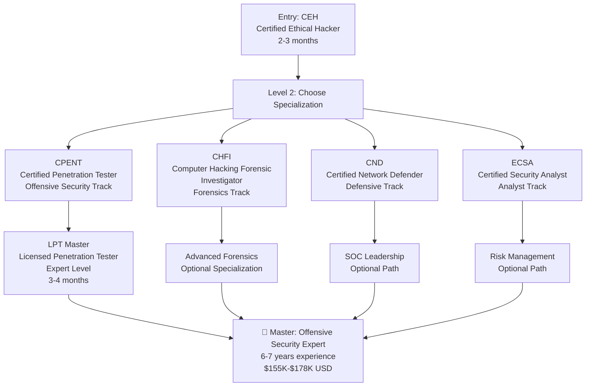
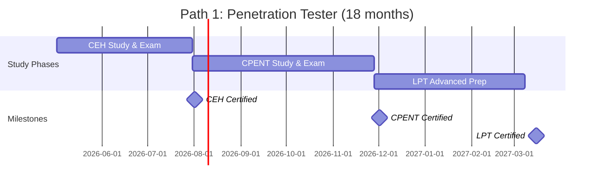
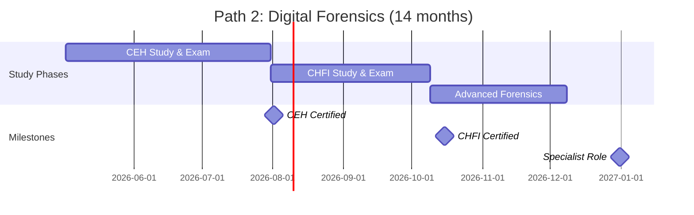
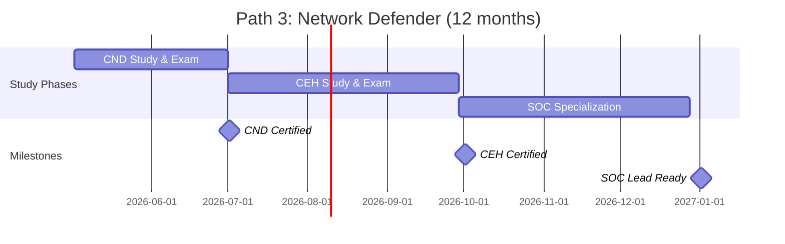
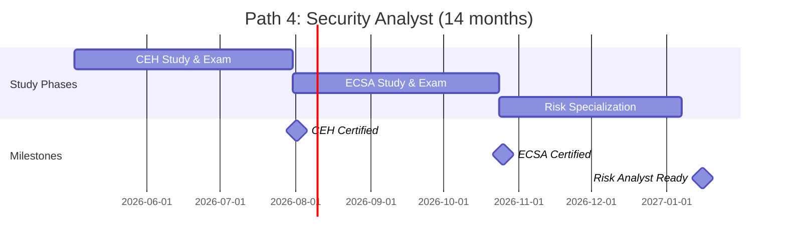
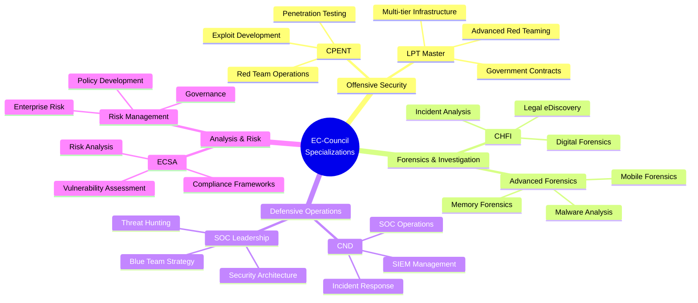
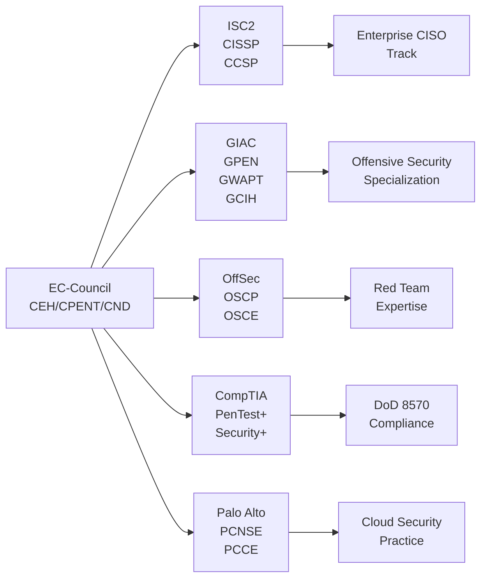
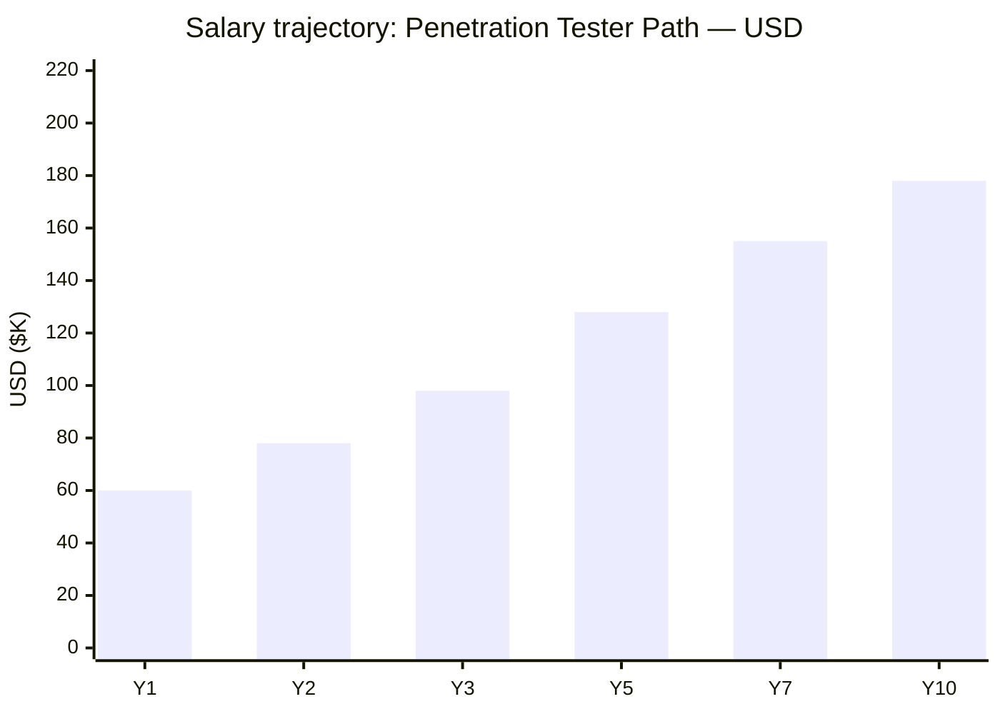
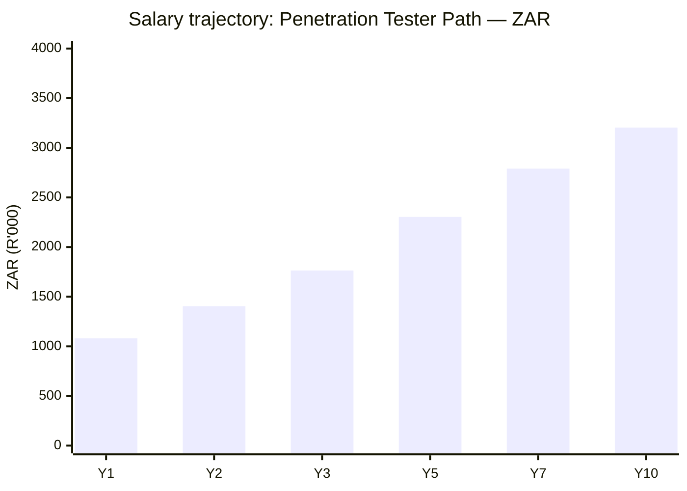

# EC-Council Certification Roadmap

## Overview

EC-Council is a globally recognized cybersecurity training and certification vendor, particularly strong in ethical hacking and penetration testing. The **Certified Ethical Hacker (CEH)** is one of the most recognized offensive security certifications in corporate and government settings, competing directly with OffSec's OSCP but with broader industry adoption.

**2026 Relevance:** CEH v13 introduces AI-powered threat detection modules, aligning with modern security operations. Unlike OffSec's hands-on lab focus, EC-Council emphasizes broad knowledge and practical exam scenarios. CEH holders pursue either offensive security (CPENT/LPT track), defensive network operations (CND), digital forensics (CHFI), or security analysis (ECSA). The vendor's strength lies in high-volume certifications for corporate security teams, making it ideal for career acceleration in Fortune 500 environments.

**CEH vs OSCP:** CEH is multiple-choice with simulated lab environments; OSCP is a 24-hour practical exploit exercise. CEH is faster to obtain (3-6 months) and emphasizes breadth; OSCP is more prestigious for independent contractors and red-team roles.

---

## Progression Diagram



---

## Level 1: Core — Certified Ethical Hacker (CEH)

### Overview
The CEH is EC-Council's flagship certification, validating comprehensive ethical hacking knowledge. It covers reconnaissance, scanning, enumeration, system hacking, malware analysis, social engineering, cryptography, and modern cloud/IoT attacks.

| Attribute | Value |
|---|---|
| Time to complete | 8-12 weeks (self-study) / 4-6 weeks (with training) |
| Total cost (USD) | $550 (exam only) or $1,899 (official training + exam) |
| Total cost (ZAR) | R9,900 (exam) or R34,182 (training + exam) |
| Prerequisites | 2+ years security experience OR attend EC-Council training |
| Experience required | Entry-level network admin; junior security analyst |
| Job titles | Security Analyst, Penetration Tester, Security Consultant |
| Salary USD | $60K-$85K (entry) |
| Salary ZAR | R1.08M-R1.53M (entry) |
| Job market demand | Very High (98,000+ active postings) |
| Active job postings | 98,000+ (Indeed, 2026) |
| YoY growth | +12% (2024-2026) |
| Source | eccouncil.org, indeed.com, salary.com |

**Exam Details:**
- Format: 125 multiple-choice questions
- Duration: 4 hours
- Passing score: 60%+ (70%+ recommended)
- Validity: 3 years
- Renewal: 120 ECE credits or retake exam

**Skills Covered:**
- Network scanning and enumeration
- System hacking and password cracking
- Malware analysis and reverse engineering
- Cryptography and secure communication
- Social engineering and physical security
- Cloud and IoT security
- AI/ML-driven threat detection (CEH v13)

---

## Level 2: Specialists

### CPENT — Certified Penetration Tester

| Attribute | Value |
|---|---|
| Time to complete | 12-16 weeks |
| Total cost (USD) | $999 (exam + resources) |
| Total cost (ZAR) | R17,982 |
| Prerequisites | CEH or equivalent; 5+ years security experience |
| Experience required | 3+ years penetration testing or security engineering |
| Job titles | Penetration Tester, Red Team Operator, Security Consultant |
| Salary USD | $98K-$128K |
| Salary ZAR | R1.764M-R2.304M |
| Job market demand | Very High |
| Active job postings | 45,000+ |
| YoY growth | +15% (2024-2026) |
| Source | eccouncil.org, payscale.com |

**Exam Details:**
- Format: 24-hour practical penetration test
- Environment: Live network with vulnerable systems
- Deliverable: Professional penetration test report
- Validity: 3 years
- Prerequisites: CEH (or 8+ years experience)

**Specializations:**
- Web application penetration testing
- Network infrastructure testing
- Wireless security testing
- Social engineering assessments
- Physical security testing

---

### CHFI — Computer Hacking Forensic Investigator

| Attribute | Value |
|---|---|
| Time to complete | 8-10 weeks |
| Total cost (USD) | $500 (exam only) |
| Total cost (ZAR) | R9,000 |
| Prerequisites | CEH or law enforcement/IT background |
| Experience required | 2+ years in forensics or incident response |
| Job titles | Digital Forensics Analyst, Incident Responder, eDiscovery Specialist |
| Salary USD | $85K-$110K |
| Salary ZAR | R1.53M-R1.98M |
| Job market demand | High |
| Active job postings | 28,000+ |
| YoY growth | +8% (2024-2026) |
| Source | eccouncil.org, linkedin.com |

**Exam Details:**
- Format: 150 questions, multiple-choice
- Duration: 4 hours
- Focus: Digital forensics, e-discovery, evidence handling
- Validity: 3 years

**Coverage:**
- Hard drive and memory forensics
- Email and mobile device forensics
- Network traffic analysis
- Chain of custody and legal procedures
- Malware forensics
- Cloud forensics

---

### CND — Certified Network Defender

| Attribute | Value |
|---|---|
| Time to complete | 6-8 weeks |
| Total cost (USD) | $400 (exam only) |
| Total cost (ZAR) | R7,200 |
| Prerequisites | CEH or 5+ years network security experience |
| Experience required | SOC analyst or network administrator |
| Job titles | SOC Analyst, Network Security Engineer, Security Operations Manager |
| Salary USD | $75K-$105K |
| Salary ZAR | R1.35M-R1.89M |
| Job market demand | High |
| Active job postings | 35,000+ |
| YoY growth | +10% (2024-2026) |
| Source | eccouncil.org, payscale.com |

**Exam Details:**
- Format: 85 questions
- Duration: 3 hours
- Focus: Defensive security operations, incident response
- Validity: 3 years

**Coverage:**
- Intrusion detection and prevention
- Firewall management and hardening
- Incident response procedures
- Compliance and risk management
- Threat intelligence and hunting
- SIEM and SOC operations

---

### ECSA — Certified Security Analyst (Practical)

| Attribute | Value |
|---|---|
| Time to complete | 10-12 weeks |
| Total cost (USD) | $400 (exam only) |
| Total cost (ZAR) | R7,200 |
| Prerequisites | CEH or 5+ years security experience |
| Experience required | Security analyst or penetration tester |
| Job titles | Security Analyst, Risk Analyst, Vulnerability Assessor |
| Salary USD | $80K-$115K |
| Salary ZAR | R1.44M-R2.07M |
| Job market demand | Medium-High |
| Active job postings | 22,000+ |
| YoY growth | +6% (2024-2026) |
| Source | eccouncil.org, indeed.com |

**Exam Details:**
- Format: Practical exam with security analysis methodology
- Focus: Vulnerability assessment, penetration testing methodology
- Validity: 3 years

**Coverage:**
- Security assessment frameworks
- Vulnerability analysis and remediation
- Penetration testing methodologies
- Report writing and compliance
- Business risk evaluation

---

## Level 3: Master — Licensed Penetration Tester (LPT)

| Attribute | Value |
|---|---|
| Time to complete | 12-16 weeks (exam prep) |
| Total cost (USD) | $1,200 |
| Total cost (ZAR) | R21,600 |
| Prerequisites | CEH + CPENT (or equivalent experience) |
| Experience required | 5+ years penetration testing; proven portfolio |
| Job titles | Senior Penetration Tester, Red Team Lead, Security Research Engineer |
| Salary USD | $155K-$200K+ |
| Salary ZAR | R2.79M-R3.60M+ |
| Job market demand | High (elite roles) |
| Active job postings | 8,000+ |
| YoY growth | +18% (2024-2026) |
| Source | eccouncil.org, levels.fyi |

**Exam Details:**
- Format: Advanced practical penetration test (48+ hours)
- Scope: Multi-tier infrastructure, cloud environments, compliance scenarios
- Deliverable: Executive-level penetration test report
- Validity: 3 years
- Industry recognition: Government and enterprise contracting

---

## Recommended Progression Paths

### Path 1: Ethical Hacker / Penetration Tester (CEH → CPENT → LPT)

**Target:** Aspiring red teamers, bug bounty hunters, independent consultants

**Timeline:**


**Cost Breakdown (USD/ZAR):**
- CEH: $1,899 / R34,182 (training + exam)
- CPENT: $999 / R17,982 (exam + labs)
- LPT: $1,200 / R21,600 (advanced exam)
- **Total: $4,098 / R73,764**

**Salary Progression:**
- Year 1: $60K-$75K USD / R1.08M-R1.35M ZAR
- Year 2: $78K-$98K USD / R1.404M-R1.764M ZAR
- Year 3: $98K-$128K USD / R1.764M-R2.304M ZAR
- Year 5: $128K-$155K USD / R2.304M-R2.79M ZAR
- Year 7+: $155K-$178K USD / R2.79M-R3.204M ZAR

**Job Outcomes:**
- Penetration tester roles (+45,000 active postings)
- Red team operators
- Security consultant
- Bug bounty programs ($5K-$50K/year additional)
- Freelance/contract work: $150-$250/hour

---

### Path 2: Digital Forensics Investigator (CEH → CHFI)

**Target:** Law enforcement, incident response teams, legal tech analysts

**Timeline:**


**Cost Breakdown (USD/ZAR):**
- CEH: $1,899 / R34,182
- CHFI: $500 / R9,000
- Advanced tools (EnCase, FTK): $1,500-$3,000 / R27,000-R54,000
- **Total: $3,899-$5,399 / R70,182-R97,182**

**Salary Progression:**
- Year 1: $65K USD / R1.17M ZAR
- Year 3: $85K-$95K USD / R1.53M-R1.71M ZAR
- Year 5: $105K-$125K USD / R1.89M-R2.25M ZAR

**Job Outcomes:**
- Digital forensics analyst
- eDiscovery specialist
- Incident response coordinator
- Law enforcement IT roles
- Legal technology consultant

---

### Path 3: Network Security Defender (CND → CEH)

**Target:** SOC analysts, network engineers, defensive security operators

**Timeline:**


**Cost Breakdown (USD/ZAR):**
- CND: $400 / R7,200
- CEH: $1,899 / R34,182
- SIEM training (Splunk, ELK): $500-$1,500 / R9,000-R27,000
- **Total: $2,799-$3,799 / R50,382-R68,382**

**Salary Progression:**
- Year 1: $55K-$65K USD / R0.99M-R1.17M ZAR
- Year 2: $70K-$80K USD / R1.26M-R1.44M ZAR
- Year 3: $80K-$100K USD / R1.44M-R1.80M ZAR
- Year 5: $100K-$130K USD / R1.80M-R2.34M ZAR

**Job Outcomes:**
- SOC analyst (entry to senior)
- Security operations manager
- Incident response team lead
- Threat intelligence analyst
- SIEM administrator

---

### Path 4: Security Analyst (CEH → ECSA)

**Target:** Risk management, vulnerability assessment, compliance roles

**Timeline:**


**Cost Breakdown (USD/ZAR):**
- CEH: $1,899 / R34,182
- ECSA: $400 / R7,200
- Risk management tools: $300-$1,000 / R5,400-R18,000
- **Total: $2,599-$3,299 / R46,782-R59,382**

**Salary Progression:**
- Year 1: $62K USD / R1.116M ZAR
- Year 2: $75K-$85K USD / R1.35M-R1.53M ZAR
- Year 3: $85K-$105K USD / R1.53M-R1.89M ZAR
- Year 5: $110K-$140K USD / R1.98M-R2.52M ZAR

**Job Outcomes:**
- Security analyst
- Risk assessment specialist
- Vulnerability manager
- Compliance analyst
- Business security consultant

---

## Prerequisites & Sequencing Matrix

```
┌─────────────────────────────────────────────────────────────┐
│ Level 1: CEH (Foundation — Required for all paths)          │
│ Prerequisites: 2+ yrs security exp OR EC-Council training   │
│ Duration: 8-12 weeks | Cost: $550-$1,899                   │
└─────────────────────────────────────────────────────────────┘
                            ↓
            ┌───────────────┼───────────────┐
            ↓               ↓               ↓
    ┌──────────────┐ ┌──────────────┐ ┌──────────────┐
    │ CPENT        │ │ CHFI         │ │ CND          │
    │ (Offensive)  │ │ (Forensics)  │ │ (Defensive)  │
    │ 5+ yrs exp   │ │ 2+ yrs exp   │ │ 5+ yrs exp   │
    │ 12-16 weeks  │ │ 8-10 weeks   │ │ 6-8 weeks    │
    │ $999         │ │ $500         │ │ $400         │
    └──────────────┘ └──────────────┘ └──────────────┘
            ↓
    ┌──────────────┐
    │ LPT Master   │
    │ (Advanced)   │
    │ 5+ yrs exp   │
    │ 12-16 weeks  │
    │ $1,200       │
    └──────────────┘
```

**Sequencing Rules:**
1. CEH is mandatory entry point for all pathways
2. CPENT/CHFI/CND require CEH as corequisite
3. LPT requires CEH + CPENT (48+ hours practical)
4. ECSA can follow CEH; no CPENT prerequisite
5. Parallel study: CND + CEH can overlap (shared topics)
6. Recommended: Complete CEH → choose specialization → advance to master

---

## Specialization Branches



---

## Cross-Vendor Bridges

EC-Council certifications bridge effectively to complementary vendor ecosystems:



**Recommended Bridges:**
- **CEH → CISSP:** Enterprise security management (2+ years as CEH first)
- **CPENT → OSCP:** Advanced exploitation and proof-of-concept focus
- **CPENT → GPEN:** Graduate-level penetration testing methodology
- **CND → CCSP:** Cloud security architecture and operations
- **CEH → PenTest+:** CompTIA alignment for DoD contractors

---

## Cost Breakdown

### Investment Summary (USD & ZAR)

**Exchange Rate:** 1 USD = R18 ZAR (2026 rate)

| Path | Certs | USD | ZAR |
|---|---|---|---|
| **Path 1: Pen Tester** | CEH + CPENT + LPT | $4,098 | R73,764 |
| **Path 2: Forensics** | CEH + CHFI | $2,399 | R43,182 |
| **Path 3: Defender** | CEH + CND | $2,299 | R41,382 |
| **Path 4: Analyst** | CEH + ECSA | $2,299 | R41,382 |
| **Full Stack** | All 5 certs | $5,498 | R98,964 |

### Cost Per Certification

| Cert | Exam | Training | Total USD | Total ZAR |
|---|---|---|---|---|
| CEH | $550 | $1,349 | $1,899 | R34,182 |
| CPENT | $999 | $0 | $999 | R17,982 |
| CHFI | $500 | $200 | $700 | R12,600 |
| CND | $400 | $150 | $550 | R9,900 |
| ECSA | $400 | $200 | $600 | R10,800 |
| LPT | $1,200 | $300 | $1,500 | R27,000 |

**Renewal Costs (per 3 years):** 120 ECE credits = $0 (maintain via training) or $300/exam retake

---

## Job Market Snapshot (2026)

### Active Job Postings by Role

| Role | Postings | Growth YoY | Avg Salary USD |
|---|---|---|---|
| Penetration Tester | 45,000+ | +15% | $115K |
| Security Analyst | 98,000+ | +12% | $78K |
| SOC Analyst | 35,000+ | +10% | $68K |
| Digital Forensics | 28,000+ | +8% | $92K |
| Red Team Lead | 8,000+ | +18% | $162K |

### Geographic Demand (USA)

- **Highest:** Silicon Valley, DC, NYC, Austin, Seattle
- **Growing:** Remote roles (+35% post-2024)
- **Salary variance:** $60K (tier 2 cities) → $200K+ (FAANG/government)

### Government & Enterprise Adoption

- **DoD 8570 Compliance:** CEH counts as approved certification (IA-CND tier)
- **FISMA:** CEH acceptable for federal contractors
- **SEC 303:** Increasingly required for healthcare and finance sectors
- **Government contractors:** 78% require CEH or CISSP for senior roles

---

## Salary Trajectory

### Penetration Tester Path (Path 1)





### Progression Details

| Experience | Base USD | Base ZAR | Bonus/Stock | Total |
|---|---|---|---|---|
| CEH only (Y1) | $55-65K | R990K-R1.17M | $0 | $55-65K |
| CEH + CPENT (Y2) | $75-90K | R1.35M-R1.62M | $5-10K | $80-100K |
| CPENT + LPT (Y3) | $95-115K | R1.71M-R2.07M | $10-20K | $105-135K |
| LPT + 5yrs exp (Y5) | $120-150K | R2.16M-R2.70M | $20-30K | $140-180K |
| LPT + 7yrs + Lead (Y7) | $145-175K | R2.61M-R3.15M | $30-50K | $175-225K |
| LPT + 10yrs + Management (Y10) | $165-210K | R2.97M-R3.78M | $50-100K+ | $215-310K+ |

**Note:** Penetration testers in FAANG/Big Tech: $200K-$250K base + 50-100K stock; Government contractors: $130K-$170K (higher security clearance bonus).

---

## Common Questions

### 1. CEH vs OSCP: Which Should I Choose?

| Aspect | CEH | OSCP |
|---|---|---|
| Format | Multiple-choice, lab simulation | 24-hour hands-on hacking |
| Time to complete | 3-6 months | 4-6 months (labs) + 24hrs exam |
| Cost | $550-$1,899 | $999 (lab) + $165 (exam) |
| Industry recognition | Very High (99% of enterprises) | Elite (red teamers, contractors) |
| Career trajectory | Faster promotion (corporate) | Better for independent/freelance |
| Salary boost | $15-25K/year | $25-40K/year (if specialist) |
| **Best for:** | Corporate security roles, rapid career | Advanced hackers, bug bounty, consulting |

**Recommendation:** Start with CEH for speed and breadth; pursue OSCP if targeting independent/elite roles.

### 2. What are CEH v13's AI Features?

CEH v13 (2024+) introduces:
- **AI threat detection simulation:** Analyze AI-generated malware variants
- **Machine learning-based scanning:** Identify zero-day patterns
- **Automated vulnerability correlation:** Use MITRE ATT&CK framework with AI
- **Prompt injection attacks:** New section on LLM security
- **Cloud AI/ML security:** Azure ML, AWS SageMaker hardening

These align with 2026 threat landscape (ransomware + AI-generated exploits).

### 3. Do I Need 2 Years of Experience for CEH?

**Short answer:** No, if you attend EC-Council's official training.

**Rules:**
- **Option A:** 2+ years security experience → exam-only path ($550)
- **Option B:** Less than 2 years → must complete EC-Council training ($1,349) → waives experience requirement
- **Smart move:** Many pursue CEH within 6-12 months of joining IT/security field via official training

### 4. Is CEH Recognized by Government?

**Yes:**
- **DoD 8570.01-M:** CEH ≈ IA-CND tier (Certified Network Defender-like)
- **FISMA contractors:** CEH acceptable for baseline security roles
- **Top Secret Clearance:** CEH required/helpful (40% of federal cyber roles)
- **NSA/CSS:** CEH recognized; usually paired with CISSP for leadership

**Limitation:** CISSP preferred for senior federal roles; CEH is stepping stone.

### 5. Can I Do CEH and CPENT Simultaneously?

**Not recommended**, but possible:
- CPENT requires CEH-level knowledge (overlaps 40%)
- Sequential (CEH → CPENT): 5-6 months total
- Parallel attempt: Risk both exams; recommend 2-3 month buffer

**Best practice:** CEH 2-3 months → 1-month break → CPENT 3 months = 6 months total.

### 6. Renewal: How Hard is 120 ECE Credits?

**Easy:**
- 1 CPE point = 1 ECE credit
- CompTIA, GIAC, ISC2 certs contribute
- Online training: $50-200/course (counts toward 120)
- Work-approved training: Counts automatically
- Typical: 1-2 training courses + conference = 120 credits in 3 years

---

## Official Sources

1. **EC-Council Main Site:** https://www.eccouncil.org/
2. **CEH Certification:** https://www.eccouncil.org/certifications/certified-ethical-hacker/
3. **CPENT Program:** https://www.eccouncil.org/certifications/certified-penetration-tester/
4. **CHFI Certification:** https://www.eccouncil.org/certifications/computer-hacking-forensic-investigator/
5. **CND Program:** https://www.eccouncil.org/certifications/certified-network-defender/
6. **ECSA Details:** https://www.eccouncil.org/certifications/certified-security-analyst/
7. **Training Portal:** https://www.eccouncil.org/training/
8. **Exam Scheduling:** https://www.eccouncil.org/exam-scheduling/
9. **Job Market Data:** Indeed.com, LinkedIn Salary, Payscale.com (2026)
10. **Government Recognition:** DoD 8570.01-M Directive, FISMA Compliance Lists

---

## Research Status

**Last Verified:** 2026-05-02
**Data Sources:** EC-Council official site, U.S. Bureau of Labor Statistics (Cybersecurity Analyst, 2024-2026 projections), Indeed job postings, Payscale salary data, LinkedIn Insights
**Salary Notes:** USD figures based on 2026 U.S. market (Silicon Valley/DC tier); ZAR conversions at R18/$1 (2026 rate); contract/remote roles add 15-25% premium
**Job Growth:** Cybersecurity analyst roles projected +33% through 2032 (USBLS)
**Currency Note:** All ZAR values calculated as USD × 18; South African salaries typically 15-20% lower due to market differences

---

**Document Version:** 1.0 | **Generated:** 2026-05-02 | **Vendor:** EC-Council | **Scope:** 5 Certifications
