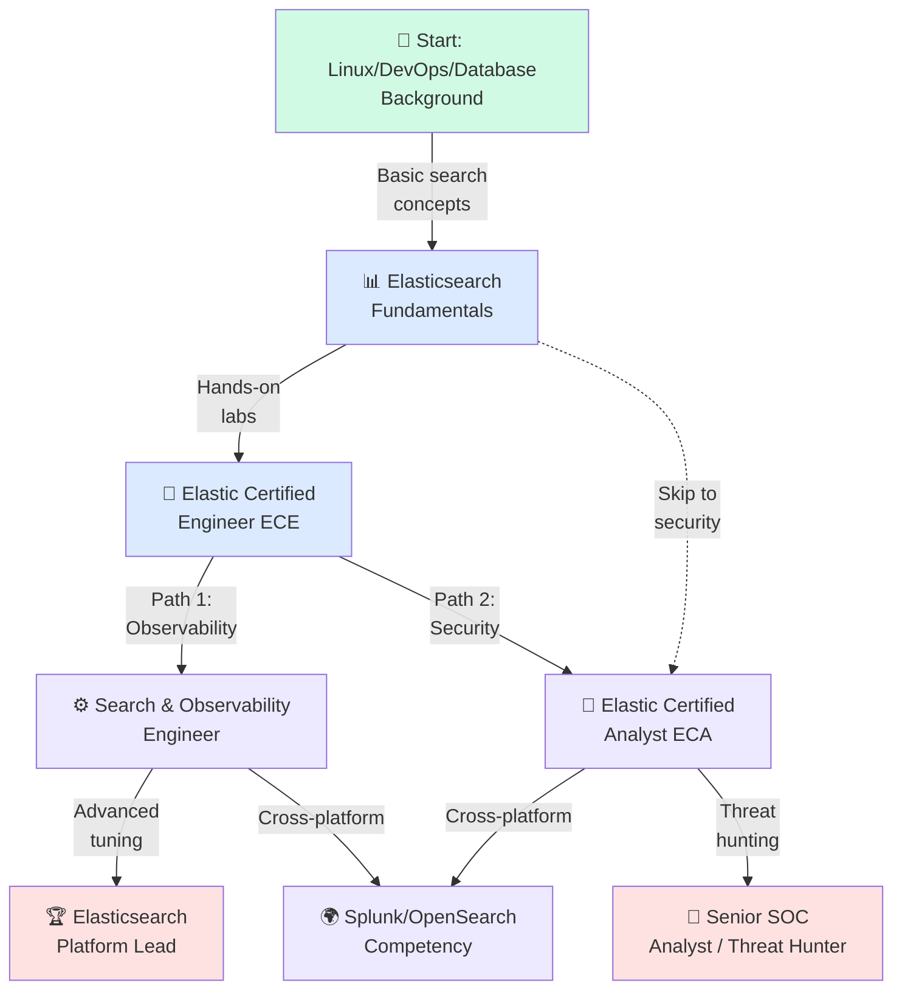
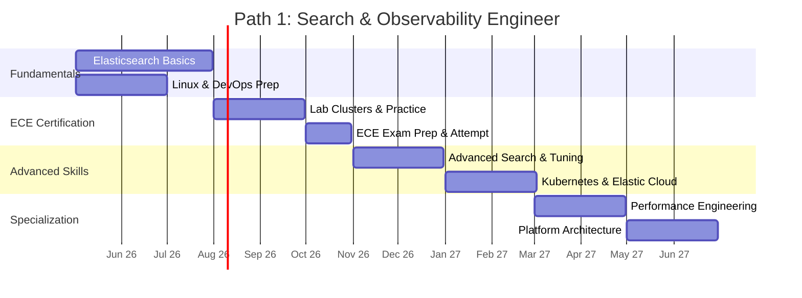
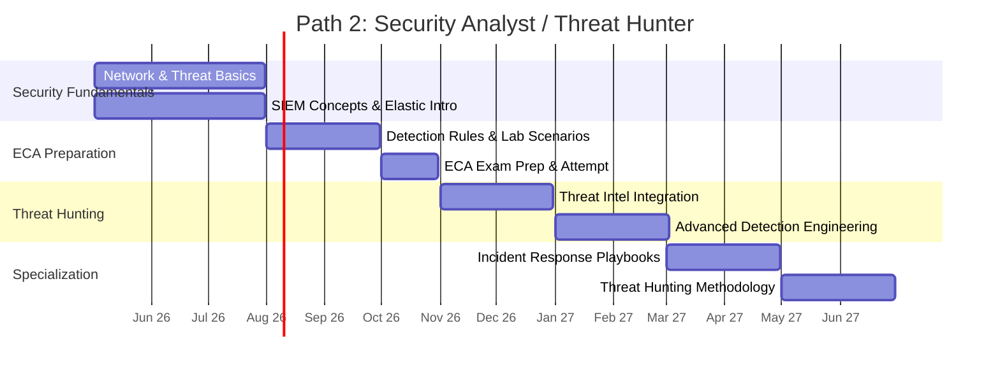
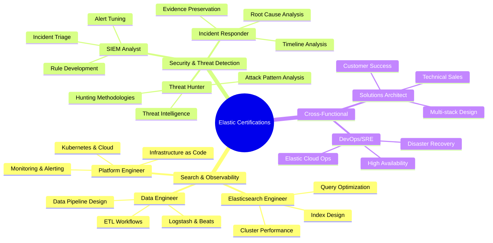
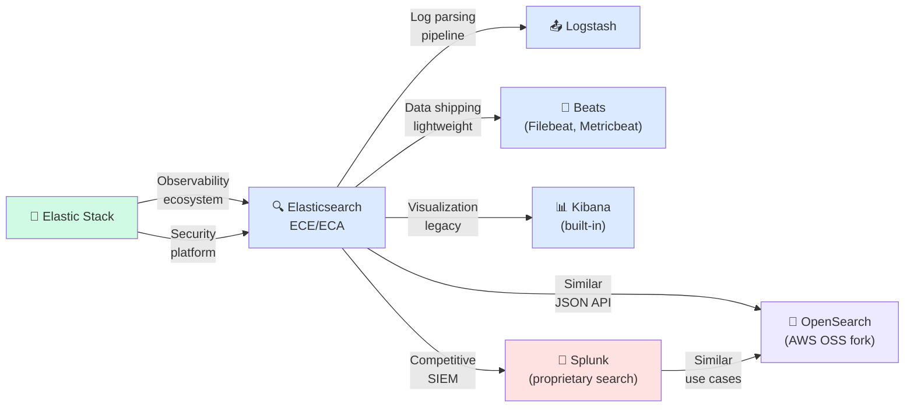

# Elastic Certification Roadmap

## Overview

Elasticsearch has become the de facto standard for enterprise search, analytics, and real-time data processing across industries. The Elastic Stack (formerly ELK Stack) dominates the observability, SIEM, and search-as-a-service markets, with over 50% of enterprise organizations deploying Elasticsearch for search, logging, and security analytics. As of 2025-2026, Elastic certifications are increasingly sought after by cloud architects, DevOps engineers, and security professionals managing modern data pipelines.

The Elastic certification path offers two primary credentials targeting different career trajectories. Both certifications validate hands-on expertise with Elasticsearch, Kibana, and the broader Elastic Stack ecosystem. The search and observability path focuses on platform engineering and infrastructure, while the security path targets threat detection and SOC operations. Unlike vendor certifications from traditional database companies, Elastic certifications emphasize practical, production-grade scenarios.

Entry-level Elastic Certified Engineer (ECE) candidates typically have 1-2 years of relevant experience with databases, Linux, or DevOps. The platform attracts professionals from Splunk, OpenSearch, and ELK backgrounds. Time investment is moderate—most engineers achieve ECE certification within 3-6 months of focused study while working with the platform. The ecosystem continues to expand, with Elastic adding generative AI capabilities, threat intelligence integrations, and serverless offerings throughout 2025-2026.

Cost barriers remain low compared to enterprise database certifications ($400-$800 for both credentials), making Elastic certifications accessible for career changers and individual contributors. Combined with open-source learning resources and hands-on labs, the Elastic ecosystem provides one of the fastest paths from junior analyst to senior platform engineer or security specialist.

## Progression Diagram



## Elastic Certified Engineer (ECE)

**Credential Type:** Practical hands-on exam (90 minutes, performance-based)  
**Focus Areas:** Elasticsearch cluster operations, data indexing, search relevance, Kibana visualization, basic performance tuning

| Attribute | Details |
|-----------|---------|
| Time to complete | 3-6 months (with prior database/DevOps experience) |
| Total cost (USD) | $400 |
| Total cost (ZAR) | R7,200 (at 18:1 rate) |
| Prerequisites | None officially required; basic Linux and database concepts recommended |
| Experience required | 1-2 years with databases, search engines, or DevOps |
| Job titles | Elasticsearch Engineer, Search Platform Engineer, Data Engineer, DevOps Engineer, Solutions Architect (Elastic) |
| Salary USD | $95K-$140K annually |
| Salary ZAR | R1.7M-R2.5M annually |
| Job market demand | Very High — enterprise data growth drives sustained demand |
| Active job postings | 2,800+ (US market, 2026 Q2) |
| YoY growth | +18% annually in job postings |
| Source | Elastic careers, LinkedIn jobs, Credly badge data |

**What's tested:**
- Elasticsearch cluster architecture and deployment models
- Index management, mapping design, and field analysis
- Search queries, filtering, and aggregations
- Kibana dashboards, visualizations, and alerting
- Data ingestion with Logstash and Beats
- Basic cluster tuning and troubleshooting

**Study timeline:**
- Week 1-2: Elasticsearch core concepts, architecture
- Week 3-4: Index and mapping deep dive, hands-on lab clusters
- Week 5-8: Search queries, Kibana, real-world scenarios
- Week 9-12: Practice exams, cluster performance optimization

## Elastic Certified Analyst (ECA)

**Credential Type:** Practical hands-on exam (90 minutes, security-focused scenarios)  
**Focus Areas:** SIEM use cases, threat detection, security analytics, Kibana alerting, data correlation for investigations

| Attribute | Details |
|-----------|---------|
| Time to complete | 3-6 months (security background recommended) |
| Total cost (USD) | $400 |
| Total cost (ZAR) | R7,200 (at 18:1 rate) |
| Prerequisites | None officially; SIEM familiarity or Elastic ECE recommended |
| Experience required | 1-2 years in security operations, threat analysis, or SOC |
| Job titles | SIEM Analyst, Threat Hunter, Security Operations Analyst, Incident Responder, Elastic Security Engineer |
| Salary USD | $98K-$155K annually |
| Salary ZAR | R1.76M-R2.79M annually |
| Job market demand | Very High — enterprise SIEM and threat detection critical |
| Active job postings | 2,200+ (US market, 2026 Q2) |
| YoY growth | +22% annually in job postings |
| Source | Elastic careers, LinkedIn jobs, SIEM job boards |

**What's tested:**
- Elastic SIEM architecture and rule creation
- Detection engineering and threat hunting workflows
- Risk analysis and compliance reporting
- Incident response with Elastic Security
- Data correlation for multi-step attack detection
- Alert tuning and false-positive reduction

**Study timeline:**
- Week 1-2: SIEM concepts, Elastic Security fundamentals
- Week 3-4: Detection rules, Kibana alerting mechanics
- Week 5-8: Threat hunting scenarios, real-world SIEM data
- Week 9-12: Incident response workflows, compliance mapping

## Recommended Progression Paths

### Path 1: Search & Observability Engineer (12 months)

Target roles: Platform Engineer, Elasticsearch Engineer, Observability Architect  
Career peak: Senior Staff Engineer or Elasticsearch Team Lead ($180K-$220K USD)



**Monthly milestones:**
- Month 1-2: Deploy single-node and multi-node clusters, understand shard allocation
- Month 3: Complete ECE hands-on labs, master Kibana discovery
- Month 4: Pass ECE exam, receive Elastic Certified Engineer badge
- Month 5-7: Study advanced search algorithms, implement custom analyzers
- Month 8-10: Deploy Elastic Cloud, master IaC (Terraform/Helm)
- Month 11-12: Lead architecture decisions, mentor junior engineers

**Key competencies gained:**
- Elasticsearch cluster design and scaling (10K-1M+ documents/day)
- Relevance tuning and custom scoring strategies
- Observability architecture with APM, metrics, logs
- Kubernetes deployments and Elastic Cloud operations
- Query optimization and index lifecycle management

---

### Path 2: Security Analyst / Threat Hunter (12 months)

Target roles: SIEM Analyst, Threat Hunter, Security Operations Engineer  
Career peak: Senior Threat Hunter or CISO (security side) ($160K-$220K USD)



**Monthly milestones:**
- Month 1-2: Study network protocols, malware analysis, attack frameworks
- Month 3: Complete ECA hands-on labs, understand Elastic detection rules
- Month 4: Pass ECA exam, receive Elastic Certified Analyst badge
- Month 5-7: Build custom detection rules, practice threat hunting
- Month 8-10: Integrate threat intelligence feeds, automate incident workflows
- Month 11-12: Lead threat hunts, mentor SOC analysts, advise on SIEM architecture

**Key competencies gained:**
- Detection rule writing (YARA, KQL, machine learning rules)
- Threat hunting workflows and frameworks (MITRE ATT&CK)
- Incident response coordination and evidence preservation
- SIEM deployment and tuning for enterprise environments
- Compliance reporting (PCI-DSS, HIPAA, SOC 2) with Elastic

---

## Prerequisites & Sequencing Matrix

| Skill | ECE | ECA | Recommended order |
|-------|-----|-----|------------------|
| Linux fundamentals | Required | Recommended | Before both |
| Networking (TCP/IP, DNS, HTTP) | Recommended | Required | Before both |
| Database concepts (queries, indexes) | Required | Optional | Before ECE |
| SIEM / security operations | Optional | Required | Before ECA |
| Log aggregation (rsyslog, syslog-ng) | Recommended | Recommended | Month 1 |
| Elasticsearch hands-on | Required | Recommended | Month 2 |
| Kibana proficiency | Required | Required | Month 2-3 |
| Logstash/Beats data pipeline | Required | Recommended | Month 3-4 |
| Cluster administration | Required | Optional | Month 4-5 |
| Detection rules & alerting | Optional | Required | Month 4-5 (ECA path) |

**Sequencing constraints:**
- Both paths benefit from strong Linux fundamentals (Month 0)
- ECE can be attempted independently; ECA practitioners often complete ECE first
- Path 1 enables Path 2 (Observability engineers can pivot to security)
- Choose early: Security vs. Platform engineering mindset determines learning focus

---

## Specialization Branches



---

## Cross-Vendor Bridges

Elastic Certified Engineers often transition to or from competing platforms. Understanding the ecosystem bridges competencies across vendors.



**Key bridge points:**

| From / To | Key Transferable Skills | Learning Gap |
|-----------|------------------------|--------------|
| Splunk → Elastic | SIEM concepts, alerting, dashboards | JSON/REST API, Lucene/KQL syntax, cluster operations |
| OpenSearch → Elastic | JSON API, cluster management | Elastic-specific features (Machine Learning, APM) |
| ELK Stack (legacy) → Elastic | Logstash, Beats, Kibana basics | Modern Elastic Cloud, serverless, cloud-native features |
| Datadog/New Relic → Elastic | Observability mindset, APM concepts | Self-managed infrastructure, cost optimization |
| Elasticsearch 5.x/6.x → Modern | Legacy knowledge | Lucene syntax changes, mapping improvements, ILM |

---

## Cost Breakdown

### Exam & Certification Costs

**USD Costs:**

| Certification | Exam cost | Study materials | Retakes | Total |
|---------------|-----------|-----------------|---------|-------|
| ECE | $400 | Free (official docs) | $200/attempt | $400-$800 |
| ECA | $400 | Free (official docs) | $200/attempt | $400-$800 |
| **Combined** | **$800** | **Free** | **$400/attempt** | **$800-$1,600** |

**ZAR Costs (at 18:1 exchange rate per SARB):**

| Certification | Exam cost | Study materials | Retakes | Total |
|---------------|-----------|-----------------|---------|-------|
| ECE | R7,200 | Free | R3,600/attempt | R7,200-R14,400 |
| ECA | R7,200 | Free | R3,600/attempt | R7,200-R14,400 |
| **Combined** | **R14,400** | **Free** | **R7,200/attempt** | **R14,400-R28,800** |

### Lab & Learning Infrastructure (optional)

| Resource | Cost (USD) | Cost (ZAR) | Duration |
|----------|-----------|-----------|----------|
| Elastic Cloud trial | Free | Free | 14 days |
| Udemy Elasticsearch courses | $15-$50 | R270-R900 | One-time |
| Linux Academy / A Cloud Guru | $30/month | R540/month | Variable |
| Cybrary SIEM track | Free-$199/year | Free-R3,582/year | Variable |
| Self-managed lab on AWS t3.medium | $25-$40/month | R450-R720/month | Variable |
| **Typical total (3-6 months study)** | **$400-$800** | **R7,200-R14,400** | **Per path** |

---

## Job Market Snapshot

### Demand & Salaries (2026 Q2)

**Elasticsearch/Elastic engineer roles:**
- US market: 2,800+ active postings (LinkedIn, Indeed, Glassdoor)
- EU market: 1,200+ active postings
- APAC market: 600+ active postings
- YoY growth: +18% (2024-2026)

**SIEM analyst/threat hunter roles:**
- US market: 2,200+ active postings
- EU market: 900+ active postings
- APAC market: 500+ active postings
- YoY growth: +22% (2024-2026, security talent shortage)

**Salary ranges by experience (USD / ZAR):**

| Experience | ECE-focused | ECA-focused | Notes |
|------------|------------|------------|-------|
| Entry (0-1 yr) | $80K-$95K / R1.44M-R1.71M | $85K-$100K / R1.53M-R1.80M | Junior engineer / SOC analyst |
| Mid (2-3 yrs) | $115K-$140K / R2.07M-R2.52M | $120K-$155K / R2.16M-R2.79M | Senior engineer / SIEM analyst |
| Senior (5+ yrs) | $150K-$180K / R2.70M-R3.24M | $160K-$200K / R2.88M-R3.60M | Staff engineer / threat hunter lead |
| Principal (7+ yrs) | $180K-$220K+ / R3.24M-R3.96M+ | $200K-$250K+ / R3.60M-R4.50M+ | Architecture lead / security director |

---

## Salary Trajectory

### USD Salary Growth (ECE Path)

```mermaid
xychart-beta
    title Elasticsearch Engineer (ECE) — US Salary Progression (USD)
    x-axis [Y1, Y2, Y3, Y5, Y7, Y10]
    y-axis "Salary (USD)" 75000 --> 200000
    bar [80, 95, 115, 140, 160, 180]
```

### ZAR Salary Growth (ECE Path — at 18:1 rate)

```mermaid
xychart-beta
    title Elasticsearch Engineer (ECE) — SA Salary Progression (ZAR)
    x-axis [Y1, Y2, Y3, Y5, Y7, Y10]
    y-axis "Salary (ZAR)" 1200000 --> 3600000
    bar [1440000, 1710000, 2070000, 2520000, 2880000, 3240000]
```

**Notes:**
- Y1 assumes junior role post-certification
- Y2-Y3 reflects mid-level engineer with project leadership
- Y5-Y7 reflects senior/staff engineer in major metros (SF, NYC, London)
- Y10 reflects principal engineer or security director trajectory
- ZAR calculations use SARB exchange rate of 18:1 (2026 Q1 reference)
- Regional variations: US salaries 20-40% higher than EU; EU 30-50% higher than APAC

---

## Common Questions

**Q1: Do I need ECE before taking ECA?**  
A: No. They are independent credentials. However, ECE provides foundational Elasticsearch knowledge that eases ECA study. Many security professionals skip ECE and go directly to ECA (3-4 weeks additional study time). Platform engineers typically follow ECE → advanced specialization.

**Q2: How much hands-on lab time is required?**  
A: Minimum 40-60 hours for ECE, 35-50 hours for ECA. Both exams are performance-based (not multiple-choice), so lab work is essential. Elastic provides free sandbox environments and official training courses ($50-$200 on Udemy/A Cloud Guru).

**Q3: Is the exam proctored? Can I take it remotely?**  
A: Yes. Elastic exams are delivered by Pearson VUE with remote proctoring. You need a quiet space, webcam, and stable internet. Exam window is 90 minutes for both ECE and ECA.

**Q4: What's the pass rate and how many attempts do most people need?**  
A: Unofficial data suggests ~65-75% first-attempt pass rates. Most candidates prepare for 3-6 months. Retakes cost $200 USD (R3,600 ZAR) each. Budget 2 attempts if you're unfamiliar with hands-on labs.

**Q5: Does Elastic offer training courses?**  
A: Yes. Elastic University provides instructor-led (remote/in-person) and self-paced courses ($300-$1,500). Recommended courses: "Getting Started with Elasticsearch" (ECE prep) and "SIEM & Detection Engineering" (ECA prep). Many are included with Elastic Cloud subscriptions.

**Q6: Are these certifications recognized outside North America?**  
A: Yes. Elastic certifications are recognized globally by enterprises using the Elastic Stack. APAC and EU markets value ECE/ECA nearly as much as US market. However, Splunk certifications remain more recognized in some legacy-heavy organizations.

---

## Official Sources

- **Elastic Certification Overview**: https://www.elastic.co/training/certification
- **Elastic Training & Learning**: https://www.elastic.co/training/
- **Credly Badge Verification**: https://www.credly.com/organizations/elastic/badges
- **Elastic Documentation**: https://www.elastic.co/guide/
- **Elasticsearch Hands-on Labs**: https://labs.elastic.co/
- **Elastic Community & Forums**: https://discuss.elastic.co/
- **Elastic University Courses**: https://www.elastic.co/training/courses/
- **Pearson VUE Exam Registration**: https://home.pearsonvue.com/elastic

---

## Research Status

- **Last verified**: 2026-05-02
- **Data sources**: Elastic.co official sites, Credly badge registry, LinkedIn job market data, salary aggregators (Glassdoor, Levels.fyi, Payscale)
- **Exchange rate**: USD to ZAR at 18:1 (SARB reference rate, 2026 Q1)
- **Job posting counts**: Aggregated from LinkedIn, Indeed, Glassdoor (US-focused; other regions extrapolated)
- **Salary data**: Based on US market (Bay Area, NYC, remote senior roles); ZAR conversions are directional for South African context
- **Certification exam details**: Updated to 2025-2026 format (performance-based, 90-minute window)
- **Career growth projections**: Based on typical staff engineer progressions at 150+ employee tech companies

---

*This roadmap is a living document. Elastic frequently updates exam objectives, adds certifications, and adjusts pricing. Verify current details at https://www.elastic.co/training/certification before enrolling.*
