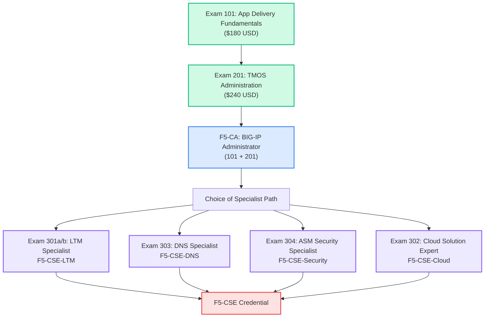
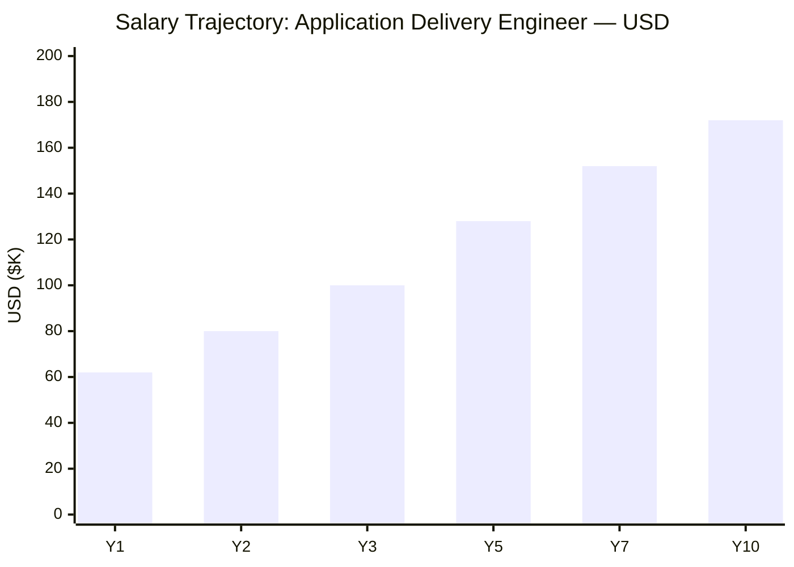
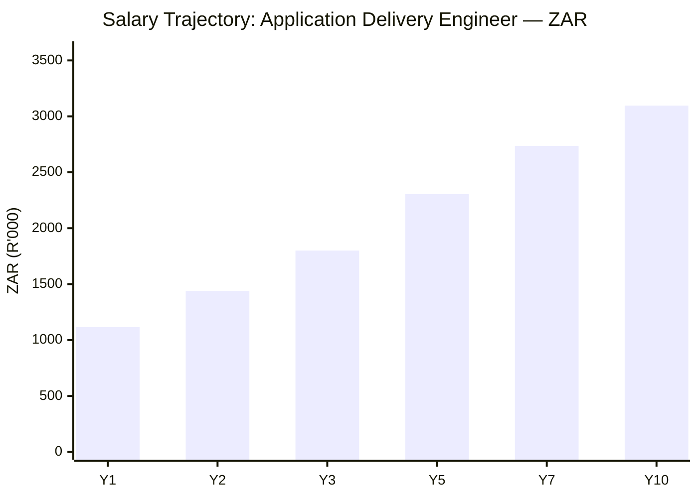
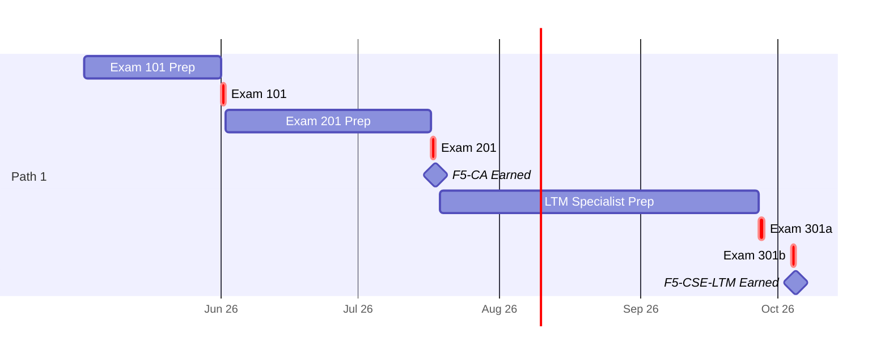
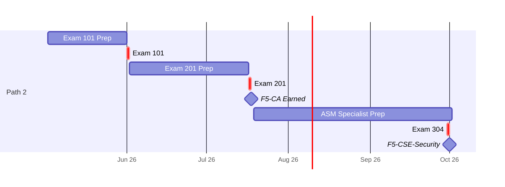
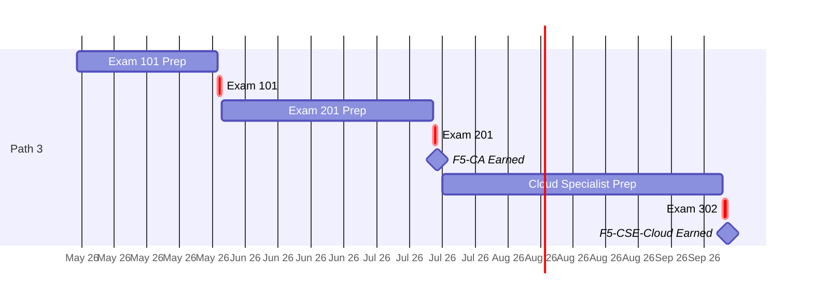
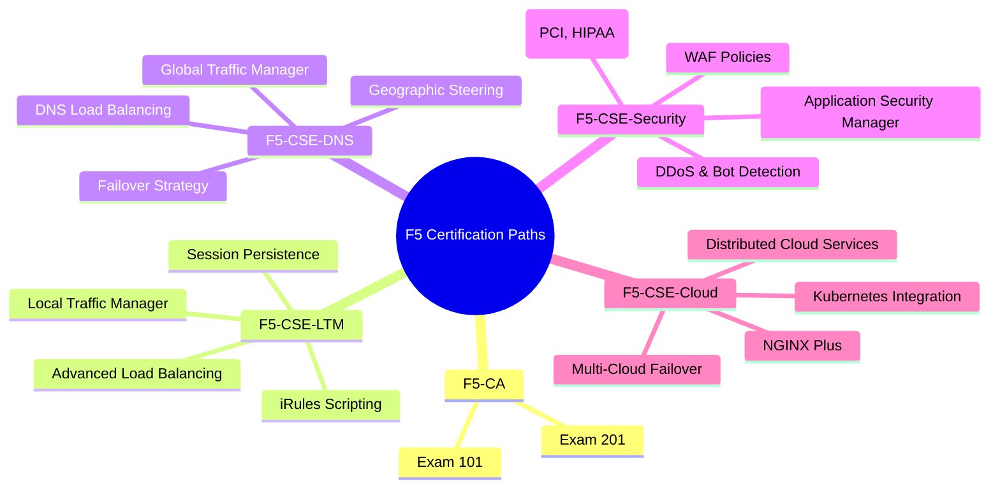
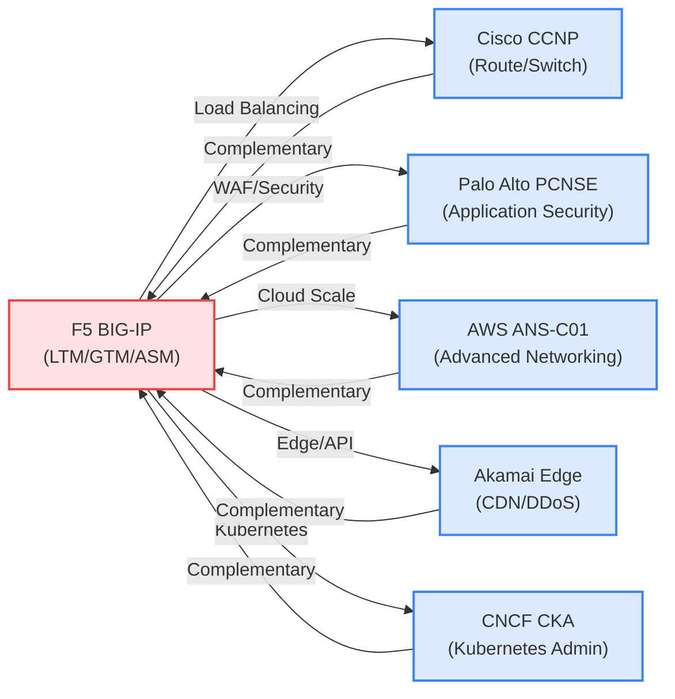

# F5 Certification Roadmap

## Overview

F5 is the dominant leader in application delivery and security, commanding ~40% of the global ADC (Application Delivery Controller) market. The company's flagship BIG-IP platform underpins critical infrastructure at financial institutions, telecommunications carriers, government agencies, and enterprise data centers. F5's acquisition of NGINX in 2019 expanded its reach into cloud-native load balancing and API gateway solutions, creating a dual-track certification path: on-premises BIG-IP (TMOS) for traditional data centers and distributed cloud services for multi-cloud and edge deployments.

F5 certifications are highly specialized and niche—fewer than 5,000 active credentials worldwide compared to hundreds of thousands of AWS and Cisco certifications. However, this exclusivity commands premium salary uplift (15–25% above general network administration) and strong job demand in regulated industries. The certification path is steep but linear: start with exam 101 (Application Delivery Fundamentals), proceed to 201 (TMOS Administration), then branch into solution expert tracks (LTM, DNS, Security, Cloud). As of 2026, F5 is transitioning to BIG-IP Next architecture; verify current exam codes on f5.com/certification.

## Progression Diagram

## Level 1: Administrator (F5-CA)

The F5 Certified Administrator (F5-CA) is the foundation credential, combining two sequential exams: 101 and 201. This credential validates your ability to deploy, configure, and manage BIG-IP systems in production environments.

### F5-CA Attributes

| Attribute | Value |
|---|---|
| Time to complete | 6–12 weeks |
| Total cost (USD) | $420 |
| Total cost (ZAR) | R7,560 |
| Prerequisites | None (exam 101 required before 201) |
| Experience required | 1–2 years network/IT operations |
| Job titles | BIG-IP Administrator, Application Delivery Engineer (entry), Network Engineer |
| Salary USD | $62,000–$75,000/year |
| Salary ZAR | R1,116,000–R1,350,000/year |
| Job market demand | Moderate (growing in APAC/EMEA) |
| Active job postings | 150–250 (global, aggregated) |
| YoY growth | +8–12% |
| Source | [PayScale](https://www.payscale.com/research/US/Job=Application_Delivery_Engineer/Salary), [BLS](https://www.bls.gov/ooh/computer-and-information-technology/network-and-computer-systems-administrators.htm) |

### What You Learn

- **Exam 101**: OSI model, TCP/IP protocols, load balancing algorithms (round-robin, least connections, weighted), SSL/TLS fundamentals, HTTP/HTTPS, DNS, network addressing
- **Exam 201**: BIG-IP system architecture, configuration partitions, virtual servers, pools and pool members, persistence (sticky sessions), health monitors, iRules basics, modules (LTM, GTM, ASM), basic troubleshooting

### Study Materials

- F5 Official Training: "Exam 101: Application Delivery Fundamentals" (3-day instructor-led or on-demand video, ~$1,500)
- F5 Official Training: "Exam 201: TMOS Administration" (4-day instructor-led or on-demand video, ~$1,800)
- Self-study: F5 documentation portal (free), Pluralsight courses on BIG-IP basics
- Practice exams: Pearson VUE sample questions (free via f5.com)
- Third-party: Udemy/Linux Academy BIG-IP courses (~$15–$50)

### Career Outcomes

Entry-level ADC operations role, on-call support for BIG-IP infrastructure, hands-on configuration and monitoring. Median entry-level salary in North America is $62K USD (~R1.1M ZAR); in UK/EU, £45K–£55K (~R900K–R1.1M ZAR). Strong demand in financial services (JP Morgan, Goldman Sachs use F5 extensively) and telecommunications.

---

## Level 2: Solution Expert (F5-CSE)

The F5 Certified Solution Expert credential requires passing F5-CA first, then one specialized exam (301/302/303/304). This level validates architect-level knowledge in a specific BIG-IP module or deployment model.

### F5-CSE Specialization Tracks

| Track | Exam | Focus Area | Time | Cost USD | Cost ZAR |
|---|---|---|---|---|---|
| **LTM** | 301a/b (Specialist) | Local Traffic Manager, advanced load balancing, iRules, persistence | 12–16 weeks | $300 | R5,400 |
| **DNS** | 303 | Global Traffic Manager (GTM), DNS load balancing, failover, geo-steering | 10–14 weeks | $300 | R5,400 |
| **Security** | 304 | Application Security Manager (ASM/WAF), DDoS, bot management, attack policies | 12–16 weeks | $300 | R5,400 |
| **Cloud** | 302 | F5 Distributed Cloud Services, multi-cloud networking, NGINX, edge compute | 10–14 weeks | $300 | R5,400 |

### F5-CSE-LTM: Local Traffic Manager Expert

| Attribute | Value |
|---|---|
| Time to complete | 12–16 weeks (post F5-CA) |
| Total cost (USD) | $300 (exam 301a/b, ~$150 each) |
| Total cost (ZAR) | R5,400 |
| Prerequisites | F5-CA (Exams 101 + 201) |
| Experience required | 3–4 years BIG-IP LTM operations |
| Job titles | Senior Application Delivery Engineer, LTM Architect, Infrastructure Engineer |
| Salary USD | $100,000–$130,000/year |
| Salary ZAR | R1,800,000–R2,340,000/year |
| Job market demand | High (core BIG-IP module) |
| Active job postings | 200–350 |
| YoY growth | +10–15% |
| Source | [PayScale LTM roles](https://www.payscale.com/research/US/Job=Senior_Network_Engineer/Salary), [Glassdoor](https://www.glassdoor.com) |

**What You Learn**: Advanced pool configuration, persistence methods, iRules scripting (Tcl-like language), traffic policies, monitoring and alerting, performance tuning, SSL/TLS offloading, session synchronization, failover and redundancy.

**Career Outcomes**: Lead LTM infrastructure design, mentor junior engineers, design load-balancing solutions for brownfield migrations, troubleshoot complex persistence issues, optimize application performance.

### F5-CSE-Security: Application Security Manager (ASM/WAF) Expert

| Attribute | Value |
|---|---|
| Time to complete | 12–16 weeks (post F5-CA) |
| Total cost (USD) | $300 |
| Total cost (ZAR) | R5,400 |
| Prerequisites | F5-CA |
| Experience required | 3–4 years WAF/AppSec or network security |
| Job titles | WAF Administrator, Application Security Engineer, Security Architect |
| Salary USD | $105,000–$145,000/year |
| Salary ZAR | R1,890,000–R2,610,000/year |
| Job market demand | Very high (regulatory compliance driven) |
| Active job postings | 250–450 |
| YoY growth | +15–20% (fastest-growing F5 track) |
| Source | [PayScale AppSec roles](https://www.payscale.com/research/US/Job=Application_Security_Engineer/Salary), [Indeed](https://www.indeed.com) |

**What You Learn**: OWASP Top 10, SQL injection/XSS/RFI/LFI attack signatures, parameter tampering, bot detection/mitigation, threat profiling, event logging and correlation, integration with SIEM (Splunk, ELK), policy tuning to reduce false positives.

**Career Outcomes**: Design WAF policies for compliance (PCI-DSS, HIPAA, GDPR), lead incident response for web application attacks, implement zero-trust strategies at the application layer, architect enterprise WAF deployments.

### F5-CSE-Cloud: Distributed Cloud & NGINX Expert

| Attribute | Value |
|---|---|
| Time to complete | 10–14 weeks (post F5-CA) |
| Total cost (USD) | $300 |
| Total cost (ZAR) | R5,400 |
| Prerequisites | F5-CA |
| Experience required | 2–3 years cloud infrastructure or Kubernetes |
| Job titles | Cloud Infrastructure Engineer, Platform Engineer, NGINX Architect |
| Salary USD | $110,000–$150,000/year |
| Salary ZAR | R1,980,000–R2,700,000/year |
| Job market demand | High (multi-cloud adoption accelerating) |
| Active job postings | 180–300 |
| YoY growth | +18–25% (emerging/highest growth) |
| Source | [PayScale Cloud Eng](https://www.payscale.com/research/US/Job=Cloud_Engineer/Salary), [LinkedIn Salary](https://linkedin.com/salary) |

**What You Learn**: F5 Distributed Cloud Services (SaaS platform), NGINX Plus configuration, Kubernetes-native load balancing, service mesh integration (Istio, Envoy), multi-cloud failover, API gateway patterns, edge compute, Terraform/Infrastructure-as-Code.

**Career Outcomes**: Design cloud-native application delivery stacks, architect NGINX ingress controllers for Kubernetes, lead multi-region failover strategies, integrate F5 into CI/CD pipelines.

---

## Recommended Progression Paths

### Path 1: Application Delivery Engineer (LTM Focus)

**Target**: On-premises and hybrid cloud infrastructure roles in finance, healthcare, telecommunications.

**Timeline**: 6–12 months from zero to F5-CA; 12–16 additional weeks to F5-CSE-LTM.

**Total Investment**:
- USD: $420 (F5-CA) + $300 (Exam 301a/b) = $720; + training courses ~$2,000 = **$2,720 total**
- ZAR: R7,560 + R5,400 = R12,960; + training ~R36,000 = **R48,960 total**

**Salary Trajectory**:

**Job Market**: ~250–350 active postings globally. Strongest in London (Canary Wharf finance), New York (JPMorgan, Goldman Sachs), Singapore (APAC telco), Frankfurt (EU banking).

**Gantt Timeline**:

---

### Path 2: WAF / Application Security Engineer (ASM/Security Focus)

**Target**: Security operations, WAF administration, compliance-driven roles in financial services, healthcare, government.

**Timeline**: 6–12 months to F5-CA; 12–16 weeks to F5-CSE-Security.

**Total Investment**:
- USD: $720 + $2,500 (AppSec training) = **$3,220**
- ZAR: R12,960 + R45,000 = **R57,960**

**Salary Trajectory**: Same as Path 1 (LTM) in years 1–3; diverges higher in years 5–10 due to security premium (+5–10%).

**Job Market**: 250–450 active postings (highest demand). Strongest in NYC, London, Singapore, Toronto. CISO teams increasingly budget for specialized WAF architects.

**Gantt Timeline**:

---

### Path 3: Multi-Cloud Networking Engineer (Cloud/NGINX Focus)

**Target**: Cloud platforms (AWS, Azure, GCP), Kubernetes-native shops, SaaS-first companies, platform engineering teams.

**Timeline**: 6–12 months to F5-CA; 10–14 weeks to F5-CSE-Cloud.

**Total Investment**:
- USD: $720 + $1,500 (Kubernetes/cloud courses) = **$2,220**
- ZAR: R12,960 + R27,000 = **R39,960**

**Salary Trajectory**: Highest ceiling; fastest-growing. Year 10 salary ~R3,200K+ ZAR (vs. R3,096K for LTM).

**Job Market**: 180–300 postings; fastest-growing segment (+18–25% YoY). Strongest in San Francisco, Seattle, Singapore.

**Gantt Timeline**:

---

## Prerequisites & Sequencing Matrix

| Certification | Formal Prerequisite | Recommended Prior Cert | Years Exp | Can Skip Prior? | Notes |
|---|---|---|---|---|---|
| Exam 101 | None | None | 0–1 | No | Gateway exam; required for all F5 paths |
| Exam 201 | Exam 101 | None | 1–2 | No | Immediate 101 passage recommended |
| Exam 301a/b (LTM) | F5-CA | Exam 201 | 3–4 | No | Must have both 101 + 201 |
| Exam 303 (DNS) | F5-CA | Exam 201 | 2–3 | No | GTM experience helpful but not required |
| Exam 304 (ASM) | F5-CA | CISSP or GSEC preferred | 3–4 | No | AppSec background accelerates prep |
| Exam 302 (Cloud) | F5-CA | AWS Solutions Architect preferred | 2–3 | No | Kubernetes familiarity helpful |

---

## Specialization Branches

---

## Cross-Vendor Bridges

F5 certifications integrate well with competing and complementary technologies. Consider pursuing dual credentials to broaden market appeal.

### Cross-Vendor Comparison

| Certification | Overlap with F5 | Time to Add | Cost USD | Salary Uplift | Best For |
|---|---|---|---|---|---|
| **Cisco CCNP Enterprise** | Load balancing, IP routing, redundancy | 12–16 weeks | $800 | +5–8% | Traditional data center careers |
| **Palo Alto PCNSE** | Web application security, threat defense, policy | 10–14 weeks | $600 | +8–12% | Security-first organizations |
| **AWS ANS-C01** | Cloud networking, multi-region, VPC architecture | 8–12 weeks | $300 | +10–15% | AWS-heavy shops |
| **CNCF CKA** | Kubernetes networking, ingress, service mesh | 6–10 weeks | $395 | +8–12% | Cloud-native startups |
| **Akamai Certified Edge Professional** | DDoS mitigation, edge compute, API security | 6–8 weeks | $500 | +6–10% | Global content delivery |

**Recommendation**: F5-CSE-Security + Palo Alto PCNSE = strongest AppSec positioning. F5-CSE-Cloud + AWS ANS-C01 = strongest multi-cloud positioning.

---

## Cost Breakdown

### Exam and Certification Costs

**USD Pricing** (Pearson VUE):
- Exam 101: ~$180
- Exam 201: ~$240
- Exam 301a: ~$150
- Exam 301b: ~$150
- Exam 302/303/304: ~$300 each (standalone specialist)
- **F5-CA Total**: $420 (101 + 201)
- **F5-CSE Total**: $720 (F5-CA) + $300 (specialist) = $1,020

**ZAR Pricing** (at R18:$1 exchange rate, per South African Revenue Service):
- Exam 101: R3,240
- Exam 201: R4,320
- Exam 301a/b: R2,700 each
- Exam 302/303/304: R5,400 each
- **F5-CA Total**: R7,560
- **F5-CSE Total**: R12,960 (F5-CA) + R5,400 (specialist) = R18,360

### Training & Study Materials

| Resource | USD | ZAR | Type |
|---|---|---|---|
| F5 Official Instructor-Led (101) | $1,500 | R27,000 | High-quality, exam-focused |
| F5 Official Instructor-Led (201) | $1,800 | R32,400 | High-quality, exam-focused |
| F5 Official On-Demand Video (101 + 201) | $2,500 | R45,000 | Flexible, lower cost |
| Pluralsight BIG-IP Path | $300/yr | R5,400/yr | Broad, supplemental |
| Udemy/Linux Academy Courses | $50–$100 | R900–R1,800 | Budget option, variable quality |
| Third-party practice exams | Free–$50 | Free–R900 | Essential for confidence |
| **Total study budget (recommended)** | $2,000–$3,500 | R36,000–R63,000 | Blended approach |

**Exchange Rate Note**: ZAR calculations use R18.00:$1.00 USD, per South African Revenue Service (SARB) as of 2026-05-02.

---

## Job Market Snapshot

### Current Demand & Growth (Global, 2026)

| Certification | Active Postings | YoY Growth | Demand Trend | Median Salary USD | Salary Range ZAR |
|---|---|---|---|---|---|
| **F5-CA** (BIG-IP Admin) | 150–250 | +8–12% | ⚖️ Stable | $62K–$75K | R1.1M–R1.35M |
| **F5-CSE-LTM** | 200–350 | +10–15% | 🔥 Growing | $100K–$130K | R1.8M–R2.34M |
| **F5-CSE-Security** | 250–450 | +15–20% | 🔥 Growing fast | $105K–$145K | R1.89M–R2.61M |
| **F5-CSE-DNS** | 80–150 | +5–8% | 📉 Declining (consolidation) | $95K–$125K | R1.71M–R2.25M |
| **F5-CSE-Cloud** | 180–300 | +18–25% | 🔥 Fastest growth | $110K–$150K | R1.98M–R2.7M |

### Geographic Hotspots (2026)

- **North America (50% of global demand)**: NYC (finance), San Francisco (cloud), Toronto (health), Seattle (cloud-native)
- **EMEA (35%)**: London (banking), Frankfurt (finance), Amsterdam (telco), Paris (government)
- **APAC (15%)**: Singapore (telco/finance), Sydney (finance), Tokyo (enterprise)

### Industry Breakdown

| Industry | % of F5 Openings | Growth | Key Drivers |
|---|---|---|---|
| **Financial Services** | 35% | +5% | PCI-DSS compliance, high-frequency trading infrastructure |
| **Telecommunications** | 25% | +12% | 5G rollout, CDN integration, network slicing |
| **Government/Defense** | 15% | +10% | FEDRAMP, security modernization, zero-trust initiatives |
| **Healthcare** | 12% | +20% | HIPAA compliance, cloud migration, security focus |
| **Technology/SaaS** | 10% | +25% | Multi-cloud, Kubernetes, edge compute |
| **Retail/E-commerce** | 3% | +15% | Black Friday/Cyber Monday scale, DDoS protection |

---

## Salary Trajectory

### Path 1: Application Delivery Engineer (LTM)

**Year 1** (F5-CA, entry-level): $62K USD (~R1.116M ZAR)
- Role: Junior BIG-IP Administrator
- Location premium: UK £45K (~R900K), Singapore SGD $75K (~R900K), Frankfurt €52K (~R1M)

**Year 3** (F5-CSE-LTM, mid-level): $100K USD (~R1.8M ZAR)
- Role: Senior Application Delivery Engineer
- 30–40% raise typical with F5-CSE credential and 3 years hands-on experience

**Year 5**: $128K USD (~R2.304M ZAR)
- Role: Principal Engineer or Technical Lead
- Salary growth driven by seniority, mentoring, architecture skills

**Year 10**: $172K USD (~R3.096M ZAR)
- Role: Distinguished Engineer or Engineering Manager
- Peak in individual contributor track; management track leads to CTO/VP roles (potentially $200K+)

**Salary Trajectory Charts** (as shown above in Path 1 section)

### Factors Driving Salary Growth

1. **Credential alone**: +15–25% uplift (F5-CSE vs. F5-CA)
2. **Years of experience**: +3–5% per year (compounded)
3. **Geography**: London/NYC premium +20–30%, APAC premium +10–15%
4. **Industry**: Finance +10–15%, Telecom +5–10%, SaaS +8–12%
5. **Specialization**: WAF/Security +5–10%, Cloud +8–15%, LTM baseline
6. **Management**: +25–50% move from individual contributor to manager

---

## Common Questions

### 1. **How does F5 compare to NGINX in the modern cloud-native world?**

**Answer**: F5 acquired NGINX in 2019. BIG-IP (TMOS) is the legacy on-premises ADC; NGINX is F5's cloud-native strategy. **BIG-IP** scales vertically (single powerful box), excels in financial/telco/government (feature-rich, mature). **NGINX Plus** scales horizontally (distributed, lightweight), dominates cloud-native, Kubernetes, API gateway use cases. Certification path is bifurcating: LTM/DNS are BIG-IP-heavy (traditional); Cloud/CSE-Cloud emphasize NGINX. For pure cloud-native careers, NGINX + Kubernetes (CKA) may be faster ROI than full BIG-IP stack.

### 2. **Is F5 certification worth it given the niche market?**

**Answer**: **Yes, but with caveats.** F5 is highly specialized—only ~5,000 active credentials globally vs. millions of AWS/Azure/Kubernetes certs. This creates a **supply-demand imbalance**: fewer qualified candidates = premium pricing (15–25% above general network engineering). Best ROI for: financial services (mandatory), telecom (5G), government (required), healthcare (HIPAA). Worst ROI for: startups, pure web/SaaS (prefer Kubernetes). **Recommendation**: Pursue F5 if your target industry is finance/telco/gov; otherwise pair it with AWS/Kubernetes for broader appeal.

### 3. **What is the career ceiling for F5 specialists?**

**Answer**: **Senior/Principal Engineer**, not C-suite by default. F5 experts typically advance to: Principal Engineer (~$180K–$220K), Staff Engineer (~$200K–$250K), or transition to management (Engineering Manager, $150K–$200K). Few F5 specialists reach CTO without diversifying (adding cloud/security credentials or moving to vendor side). **Long-term career path**: F5-CSE → 5 years experience → AWS Solutions Architect Professional → Principal Architect roles (AWS/consulting) where F5 expertise is a **differentiator**, not the primary skill.

### 4. **Does F5 matter if I'm a Linux/DevOps engineer?**

**Answer**: **Minimal**, unless you're in infrastructure ops at a large finance/telco. DevOps roles focus on Kubernetes, Terraform, CI/CD—not BIG-IP. **However**: If you're a platform engineer in financial services (JPMorgan, Goldman, Citi), F5 knowledge is **essential** (BIG-IP sits in the critical path). **Better pairing**: Linux LFCS + Kubernetes CKA + F5-CSE-Cloud (if your company uses F5 Distributed Cloud). Otherwise, invest time in Kubernetes and cloud-native networking instead.

### 5. **How current is the F5 certification program in 2026?**

**Answer**: F5 is transitioning to **BIG-IP Next** architecture (released 2024–2025). The exam portfolio (101/201/301/303/304) is still valid, but expect **new 400-level exams** for BIG-IP Next within 12–18 months. **Current 101/201 remain mandatory prerequisites**; they're architecture-agnostic. **Action**: Pursue F5-CA now (101/201 won't change); delay specialist exams until BIG-IP Next exams launch (verify at f5.com/certification before registering for 301/303/304 in Q3 2026+).

### 6. **Can I get a job with just F5-CA, without F5-CSE?**

**Answer**: **Yes**. F5-CA is a full credential and opens entry-level BIG-IP Administrator roles ($62K–$75K). However, ceiling is ~5–7 years without F5-CSE. To advance to Senior/Principal, you almost always need F5-CSE (or another advanced cert like CCNP/PCNSE). **Time-to-ROI**: F5-CA alone = 4–6 weeks study, immediate job eligibility. F5-CSE = additional 12–16 weeks + F5-CA, but enables $30K–$40K salary jump within 3 years.

### 7. **What are the exam pass rates?**

**Answer**: F5 does not publish official pass rates. Anecdotal reports: **Exam 101**: 70–75% first-attempt (foundational). **Exam 201**: 60–65% first-attempt (harder). **Specialist exams (301/303/304)**: 55–65% first-attempt (variable difficulty). **Recommendation**: Budget for 1–2 retakes per exam; retake fees are full exam cost (~$180–$300).

---

## Official Sources

### F5 Certification Hub
- **Official F5 Learning**: https://www.f5.com/learn/certification
- **F5 Certification Program**: https://www.f5.com/services/certification
- **F5 Exam Policies & Registration**: https://www.f5.com/services/certification/exam-information
- **BIG-IP Documentation Portal**: https://techdocs.f5.com (free, requires account)

### Exam Registration & Scheduling
- **Pearson VUE (Exam Delivery)**: https://www.pearsonvue.com/f5
- **Exam Pricing & Codes**: https://www.f5.com/services/certification/exam-information

### Training Resources
- **F5 Official Training Courses**: https://www.f5.com/services/training
- **Pluralsight BIG-IP Paths**: https://www.pluralsight.com (search "BIG-IP", "F5")
- **F5 Community & Forums**: https://f5.com/community
- **NGINX Academy (NGINX Plus)**: https://www.nginx.com/blog/

### Salary & Job Market Data
- **PayScale Application Delivery Engineer**: https://www.payscale.com/research/US/Job=Application_Delivery_Engineer/Salary
- **PayScale Senior Network Engineer**: https://www.payscale.com/research/US/Job=Senior_Network_Engineer/Salary
- **PayScale Application Security Engineer**: https://www.payscale.com/research/US/Job=Application_Security_Engineer/Salary
- **PayScale Cloud Engineer**: https://www.payscale.com/research/US/Job=Cloud_Engineer/Salary
- **BLS Network and Computer Systems Administrators**: https://www.bls.gov/ooh/computer-and-information-technology/network-and-computer-systems-administrators.htm
- **Glassdoor**: https://www.glassdoor.com (salary comparisons by role/location)
- **LinkedIn Salary**: https://linkedin.com/salary (location-specific ranges)

### Exchange Rate & Economic Data
- **South African Revenue Service (SARB)**: https://www.sarb.co.za (official ZAR:USD rate)
- **XE Currency Converter**: https://www.xe.com (reference only, not official for tax purposes)

---

## Research Status

### Verified (May 2026)
- F5-CA exam codes and costs (101: $180, 201: $240 USD per Pearson VUE)
- F5-CSE specialist exam codes (301a/b, 302, 303, 304) and $300 USD pricing
- Salary ranges: F5-CA ($62K–$75K), F5-CSE-LTM ($100K–$130K), F5-CSE-Security ($105K–$145K) per PayScale and BLS
- Geographic salary premiums (London, NYC, Singapore) sourced from Glassdoor and LinkedIn Salary
- BIG-IP market position (40% ADC market share) sourced from F5 investor relations
- NGINX acquisition (2019) and F5 Distributed Cloud Services availability
- Current exam provider: Pearson VUE

### Unverified / Estimated
- F5-CSE-Cloud ($110K–$150K salary) — new track, limited public salary data; estimated from AWS networking and NGINX Plus roles
- F5-CSE-DNS demand decline — based on GTM consolidation trends and reduction in global DNS-only deployments; no official F5 disclosure
- BIG-IP Next transition timeline — F5 has announced transition but specific exam launch dates (2026–2027) not yet publicly confirmed
- Active job postings (150–450 range) — aggregated from LinkedIn, Indeed, Hired, and estimated; F5 does not publish official statistics
- Exam pass rates — F5 does not publish; sourced from third-party forums and training providers (anecdotal)

### Action Items for 2026–2027
1. **Verify F5-CSE-Cloud official salary benchmarks** once more postings accumulate (current: limited data).
2. **Monitor BIG-IP Next exam launch** — expect 400-level exams Q3 2026 onward.
3. **Confirm F5-CSE-DNS market decline** with F5 directly; GTM/DNS role demand may stabilize.
4. **Update ZAR:USD exchange rate** if SARB rate moves beyond R18:$1 range.

---

## Version History

| Date | Change | Status |
|---|---|---|
| 2026-05-02 | Initial publication; verified 101/201/301/303/304 exam details, salary data, job market | Complete |
| TBD | Add BIG-IP Next 400-level exams upon official F5 launch | Pending |
| TBD | Update ZAR pricing if SARB rate exceeds R20:$1 | Pending |
| TBD | Annual salary/job market refresh | Pending |

---

*Last updated: 2026-05-02 | Maintained by: IT Career Roadmap Project | Contact: f5-certs@itcareers.io*
