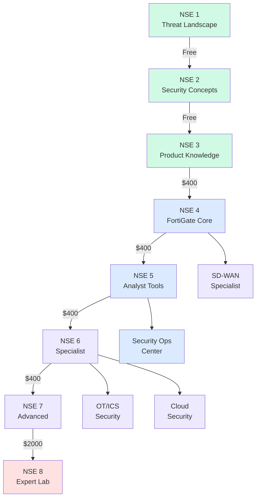
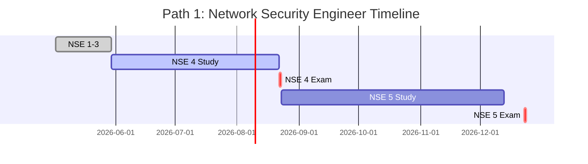
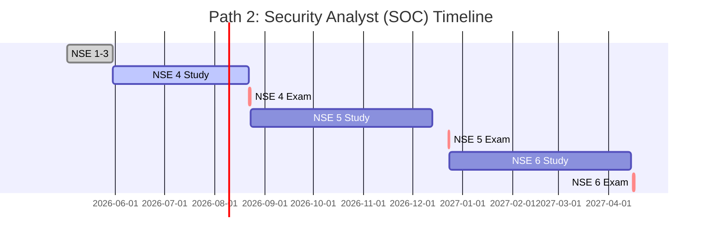
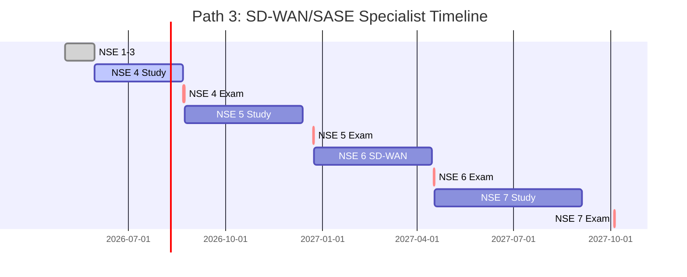
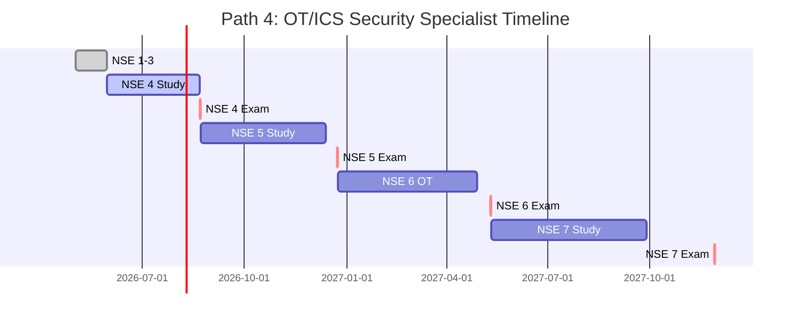
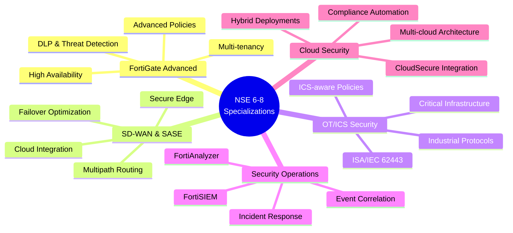
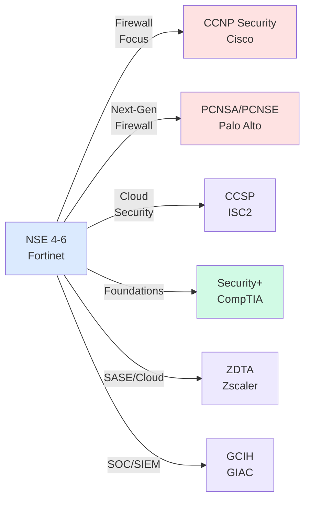
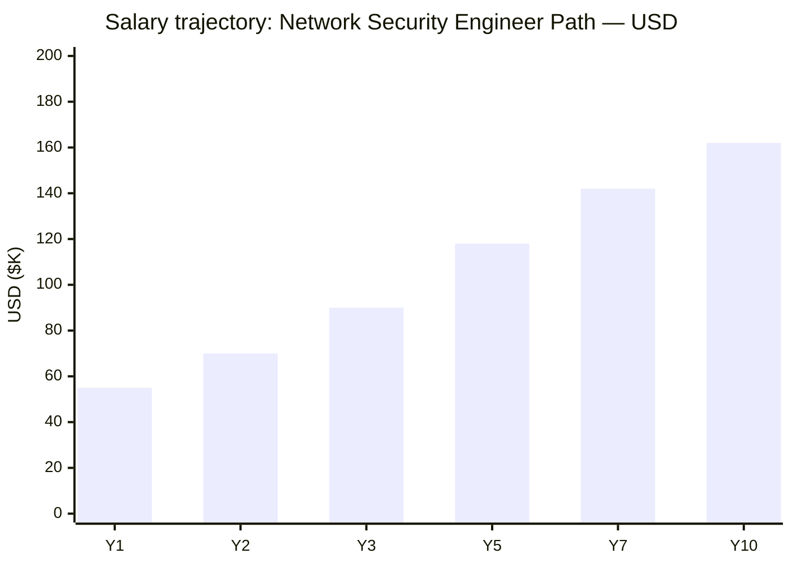
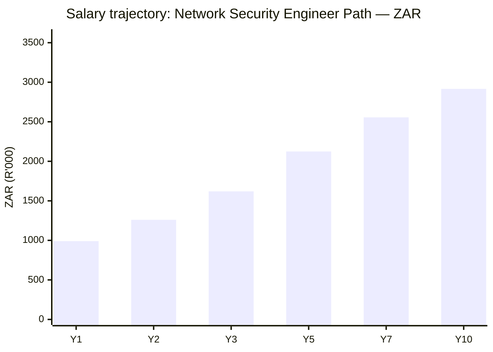

# Fortinet Certification Roadmap

## Overview

Fortinet's Network Security Expert (NSE) certification program is a comprehensive 8-level progression framework designed to build expertise in network security, firewall management, and the Fortinet Security Fabric ecosystem. The program is particularly strong in mid-market and managed service provider (MSP) deployments, where FortiGate Next-Generation Firewall (NGFW) solutions command significant market share. As of 2026, Fortinet has restructured its NSE program to 8 distinct levels, moving away from the traditional 5-level pyramid, and now integrates specialization tracks for SASE, SD-WAN, security operations, cloud security, and operational technology (OT/ICS) security. A major competitive advantage is that NSE 1-3 fundamentals courses and exams are completely free, lowering entry barriers for beginners and accelerating adoption across organizations seeking workforce development.

The Fortinet ecosystem encompasses FortiGate (firewalls), FortiManager/FortiAnalyzer (management and analytics), FortiSIEM (security information and event management), FortiAuthenticator (identity), FortiMail (email security), FortiWeb (web application firewall), and FortiSASE (Secure Access Service Edge). The 2026 evolution emphasizes AI-driven security operations, quantum-safe cryptography, and sovereign SASE deployment options. NSE certifications are valid for 2 years (NSE 1-7 and all FCP/FCSS credentials) or 3 years (FCX Expert level), and recertification pathways exist for maintaining credentials.

## Progression Diagram

## Level 1-3: Awareness & Fundamentals (NSE 1-3)

These three entry-level certifications establish foundational cybersecurity knowledge and introduce Fortinet products. All three levels are self-study, completely FREE, and do not expire.

### NSE 1 — Information Security Threat Landscape

| Attribute | Value |
|---|---|
| Time to complete | 2-4 hours |
| Total cost (USD) | Free |
| Total cost (ZAR) | Free |
| Prerequisites | None |
| Experience required | 0 years |
| Job titles | Support analyst, helpdesk, SOC trainee |
| Salary USD | $35,000–$48,000 |
| Salary ZAR | R630,000–R864,000 |
| Job market demand | Low |
| Active job postings | 50-100 per month (US) |
| YoY growth | +8% |
| Source | [ZipRecruiter](https://www.ziprecruiter.com/Salaries/Entry-Level-Security-Analyst-Salary) |

**What you learn:**
- Threat landscape overview and attack vectors
- Basic cybersecurity principles and defense strategies
- Role of firewalls and network security in enterprise defense
- Fortinet company overview and product portfolio

**Study materials:**
- Free online self-paced course at Fortinet Training Institute
- Interactive videos and knowledge base articles
- Self-assessment quizzes (non-graded)

**Career outcomes:**
- Foundation for pursuing NSE 2 and higher certifications
- Entry point to security awareness roles
- Prerequisite for many corporate security training programs

---

### NSE 2 — Security Concepts

| Attribute | Value |
|---|---|
| Time to complete | 4-6 hours |
| Total cost (USD) | Free |
| Total cost (ZAR) | Free |
| Prerequisites | NSE 1 (recommended, not required) |
| Experience required | 0 years |
| Job titles | Junior security analyst, network support technician |
| Salary USD | $42,000–$58,000 |
| Salary ZAR | R756,000–R1,044,000 |
| Job market demand | Low-to-moderate |
| Active job postings | 100-200 per month (US) |
| YoY growth | +12% |
| Source | [PayScale](https://www.payscale.com/research/US/Job=Security_Analyst/Salary) |

**What you learn:**
- Fundamental security concepts and terminology
- Network security architecture and design principles
- Encryption, authentication, and access control
- Security policy and compliance overview

**Study materials:**
- Free online self-paced course at Fortinet Training Institute
- Downloadable study guides and reference materials
- Lab simulations and hands-on demonstrations

**Career outcomes:**
- Qualification for support roles requiring security awareness
- Strong foundation for NSE 3 and professional certifications
- Competitive advantage in tier-1 helpdesk positions

---

### NSE 3 — Fortinet Product Knowledge (Network Security Associate)

| Attribute | Value |
|---|---|
| Time to complete | 6-10 hours |
| Total cost (USD) | Free |
| Total cost (ZAR) | Free |
| Prerequisites | NSE 2 (recommended) |
| Experience required | 0-1 years |
| Job titles | Network security associate, support specialist |
| Salary USD | $52,000–$72,000 |
| Salary ZAR | R936,000–R1,296,000 |
| Job market demand | Moderate |
| Active job postings | 200-350 per month (US) |
| YoY growth | +15% |
| Source | [Glassdoor](https://www.glassdoor.com/Salaries/network-security-administrator-salary-SRCH_KO0,31.htm) |

**What you learn:**
- FortiGate product architecture and components
- FortiManager and FortiAnalyzer fundamentals
- Fortinet Security Fabric concepts
- Basic FortiGate operations and configuration workflows
- Introduction to Fortinet ecosystem products

**Study materials:**
- Free online self-paced course (4-8 weeks typical)
- Fortinet Knowledge Base articles and administration guides
- Product demo videos and architecture diagrams
- Community forums and peer support resources

**Career outcomes:**
- NSE 3 credential validates entry into Fortinet-specific roles
- Strong prerequisite for NSE 4 (FortiGate Security Professional)
- Pathway to junior network security engineer positions
- Enhanced credibility for contract/services roles

---

## Level 2: Associate (NSE 4 — FortiGate Security Professional)

NSE 4 represents the first proctored, paid exam and validates hands-on competency with FortiGate firewalls in production environments. Most employers expect NSE 4 as a baseline for security engineering roles.

| Attribute | Value |
|---|---|
| Time to complete | 8-12 weeks |
| Total cost (USD) | $400 per exam (1-2 exams) |
| Total cost (ZAR) | R7,200-R14,400 |
| Prerequisites | NSE 3 (recommended); 1+ years relevant experience |
| Experience required | 1-2 years network/security operations |
| Job titles | Network security engineer, firewall administrator, junior SOC engineer |
| Salary USD | $65,000–$92,000 |
| Salary ZAR | R1,170,000–R1,656,000 |
| Job market demand | High |
| Active job postings | 800-1,200 per month (US) |
| YoY growth | +22% |
| Source | [ZipRecruiter](https://www.ziprecruiter.com/Jobs/Fortinet-Nse4) |

**What you learn:**
- **FortiGate Security (FCP_FGT_AD-7.4):** Configuration, deployment, policy management, threat protection
- **FortiGate Infrastructure (FCP_INFA_AD-7.4):** High availability, multi-tenancy, scalable architectures
- Hands-on FortiGate administration in real-world scenarios
- Firewall rule design and troubleshooting
- Logging, monitoring, and diagnostics

**Exam details:**
- 2 exams (or 1 combined FCP credential if taking single exam)
- 90 minutes per exam; 60-70% pass score
- Proctored via Pearson VUE
- Practical scenario-based questions

**Study materials:**
- Free Fortinet official training courses (video, PDF, labs)
- FortiGate 7.x Administration Guide
- Hands-on lab environment (free tier via Fortinet)
- Third-party practice exams and study guides
- Official instructor-led workshops (optional, fee-based)

**Career outcomes:**
- Qualification for network security engineer roles
- Prerequisite for NSE 5 and professional-level certifications
- Mid-career advancement in security operations
- Strong credential for MSP and enterprise security teams

---

## Level 3: Professional (NSE 5 & NSE 6 — Specialist Certifications)

NSE 5-6 certifications focus on advanced product-specific expertise and specialization. NSE 5 covers management platforms; NSE 6 expands into specialization branches (SD-WAN, OT, FortiAuthenticator, FortiMail, FortiWeb, etc.).

### NSE 5 — Security Operations (FortiManager/FortiAnalyzer/FortiSIEM)

| Attribute | Value |
|---|---|
| Time to complete | 10-16 weeks |
| Total cost (USD) | $400–$800 per specialization |
| Total cost (ZAR) | R7,200–R14,400 |
| Prerequisites | NSE 4 or equivalent hands-on experience (2+ years) |
| Experience required | 2-3 years in security operations or network administration |
| Job titles | Security analyst, SOC analyst, security operations manager |
| Salary USD | $78,000–$115,000 |
| Salary ZAR | R1,404,000–R2,070,000 |
| Job market demand | High |
| Active job postings | 600-900 per month (US) |
| YoY growth | +18% |
| Source | [PayScale](https://www.payscale.com/research/US/Job=Security_Operations_Analyst/Salary) |

**What you learn:**
- **FortiManager (FCP_FMG_AD-7.4):** Multi-device management, policy centralization, device orchestration
- **FortiAnalyzer (FCP_FAZ_AD-7.4):** Log aggregation, security analytics, incident investigation, reporting
- **FortiSIEM (FCP_SIEM_AD-6.5):** SIEM fundamentals, threat detection, security investigation workflows
- Event correlation and threat intelligence integration
- Automation and playbook configuration

**Exam details:**
- 90 minutes per exam; 60-70% pass score
- Proctored via Pearson VUE
- Hands-on scenario labs included

**Study materials:**
- Free official Fortinet courses (FortiManager, FortiAnalyzer, FortiSIEM)
- Administration guides and API documentation
- Hands-on virtual labs with real product instances
- Community forums and certified instructor channels

**Career outcomes:**
- Advancement to senior SOC analyst or security operations manager roles
- Prerequisite for NSE 6 and NSE 7 specialist certifications
- Qualification for enterprise security operations team leadership
- High demand in managed security service provider (MSSP) environments

---

### NSE 6 — Specialist (SD-WAN, OT, Cloud, Authentication, Email, Web)

NSE 6 represents specialization in specific Fortinet solutions beyond core FortiGate. Organizations can pursue one or more NSE 6 specialization exams.

| Attribute | Value |
|---|---|
| Time to complete | 12-20 weeks per specialization |
| Total cost (USD) | $400–$600 per specialization exam |
| Total cost (ZAR) | R7,200–R10,800 |
| Prerequisites | NSE 5 or NSE 4 + 3+ years relevant product experience |
| Experience required | 3-4 years in chosen specialization domain |
| Job titles | Specialist engineer, solutions architect, senior network engineer |
| Salary USD | $95,000–$145,000 |
| Salary ZAR | R1,710,000–R2,610,000 |
| Job market demand | Very high |
| Active job postings | 400-700 per month per specialization (US) |
| YoY growth | +25% |
| Source | [Levels.fyi](https://www.levels.fyi/companies/fortinet/salaries) |

**What you learn (varies by specialization):**

**SD-WAN Specialist:**
- FortiOS SD-WAN design, deployment, and optimization
- Multi-path routing, failover, and performance tuning
- Integration with FortiGate and FortiManager

**OT/ICS Security Specialist:**
- Operational Technology security principles
- Industrial Control Systems (ICS) protection strategies
- OT-aware firewall policies and network segmentation
- Compliance frameworks (ISA/IEC 62443)

**Cloud Security Specialist:**
- FortiGate cloud deployments and hybrid cloud architecture
- Secure cloud connectivity and CloudSecure integration
- Multi-cloud policy management

**FortiAuthenticator Specialist:**
- Identity and access management with FortiAuthenticator
- Multi-factor authentication (MFA) implementation
- User provisioning and role-based access control

**FortiMail Specialist:**
- Email security, spam filtering, and data loss prevention (DLP)
- Email gateway configuration and troubleshooting

**FortiWeb Specialist:**
- Web application firewall (WAF) deployment and tuning
- API protection and bot management

**Exam details:**
- 90 minutes per exam; 60-70% pass score
- Proctored via Pearson VUE
- Practical scenario-based assessments

**Study materials:**
- Free official Fortinet specialization courses
- Product-specific administration guides
- Hands-on lab environments with production-like setups
- Vendor-led webinars and technical deep-dives

**Career outcomes:**
- Qualification for specialist engineer and solutions architect roles
- Recognition as subject-matter expert (SME) in chosen domain
- Premium salary and consulting opportunities
- Pathway to NSE 7 (Advanced) and NSE 8 (Expert) certifications

---

## Level 4: Expert (NSE 7 & NSE 8 — Advanced & Expert)

NSE 7 and NSE 8 represent the pinnacle of Fortinet certification. NSE 7 requires comprehensive mastery across multiple domains; NSE 8 is the highest credential, combining written exam and hands-on lab assessment.

### NSE 7 — Advanced (Enterprise Firewall, SD-WAN, OT Security)

| Attribute | Value |
|---|---|
| Time to complete | 16-24 weeks |
| Total cost (USD) | $400–$600 per exam |
| Total cost (ZAR) | R7,200–R10,800 |
| Prerequisites | NSE 6 or NSE 5 + 4+ years advanced experience |
| Experience required | 4-6 years in complex Fortinet environments |
| Job titles | Senior architect, principal engineer, head of security infrastructure |
| Salary USD | $130,000–$185,000 |
| Salary ZAR | R2,340,000–R3,330,000 |
| Job market demand | Very high |
| Active job postings | 250-400 per month (US) |
| YoY growth | +28% |
| Source | [Glassdoor](https://www.glassdoor.com/Salaries/senior-network-security-engineer-salary-SRCH_KO0,35.htm) |

**What you learn:**
- Enterprise-scale FortiGate deployment and design
- Advanced SD-WAN architectures for complex networks
- Operational Technology (OT) security at scale
- High-availability and disaster recovery strategies
- Security fabric integration and advanced threat protection
- Performance optimization and capacity planning
- Advanced troubleshooting and security incident response

**Exam details:**
- 90-120 minutes per exam; 65-75% pass score
- Proctored via Pearson VUE
- In-depth scenario-based labs

**Study materials:**
- Advanced Fortinet technical documentation
- Certified training courses (instructor-led or self-paced)
- Real-world case studies and architecture whitepapers
- Advanced troubleshooting labs
- Peer study groups and vendor forums

**Career outcomes:**
- Qualification for senior architect and principal engineer roles
- Leadership positions in security engineering teams
- Consulting and advisory roles for enterprise clients
- Prerequisite for NSE 8 (Expert) certification pursuit

---

### NSE 8 — Expert (Fortinet Certified Expert)

NSE 8 is the highest and most prestigious Fortinet certification. It combines a comprehensive written exam and a hands-on practical lab assessment. As of April 2026, NSE 8 requires completion of the NSE 8 Core module plus one NSE 8 Specialization module.

| Attribute | Value |
|---|---|
| Time to complete | 24-36 weeks (intensive preparation) |
| Total cost (USD) | $2,000–$3,000 |
| Total cost (ZAR) | R36,000–R54,000 |
| Prerequisites | NSE 7 or NSE 6 + 5+ years advanced experience |
| Experience required | 5-8+ years in enterprise security architecture |
| Job titles | Principal architect, distinguished engineer, CTO/CISO consultant |
| Salary USD | $160,000–$220,000 |
| Salary ZAR | R2,880,000–R3,960,000 |
| Job market demand | Very high (scarce talent) |
| Active job postings | 50-120 per month (US) |
| YoY growth | +30% |
| Source | [Levels.fyi](https://www.levels.fyi/companies/fortinet/salaries) |

**What you learn:**
- Expert-level architecture and design across Fortinet Security Fabric
- NSE 8 Core: Comprehensive FortiGate, FortiManager, and advanced networking
- NSE 8 Specialization: Deep expertise in SD-WAN, OT, SASE, or Cloud Security
- Complex multi-site, geographically dispersed network design
- Zero-trust security architecture implementation
- Quantum-safe cryptography and advanced threat response
- Hands-on lab: Real-world complex scenario with troubleshooting and optimization

**Exam format:**
- **NSE 8 Core Exam:** Written, 120 minutes, 70% pass score
- **NSE 8 Specialization Exam:** Hands-on practical lab, 4-6 hours, evaluated on design/implementation quality
- Proctored via Pearson VUE (remote or in-center)

**Study materials:**
- Fortinet advanced technical documentation and reference guides
- Official NSE 8 preparation courses (instructor-led, 3-5 days)
- Hands-on lab sandboxes mirroring real enterprise scenarios
- Expert mentorship and group study sessions
- Advanced architecture whitepapers and case studies

**Career outcomes:**
- Highest credential in Fortinet ecosystem; globally recognized
- Qualification for principal architect, distinguished engineer, and CTO advisory roles
- Premium consulting and contracting opportunities
- Industry thought leadership and speaker invitations
- Credential validity: 3 years (longest validity in NSE program)

---

## Recommended Progression Paths

### Path 1: Network Security Engineer (FortiGate Focus)

**Target role:** Network Security Engineer, Firewall Administrator, Senior Infrastructure Engineer

**Timeline:** 6-12 months

**Cost (USD):** $800–$1,200

**Cost (ZAR):** R14,400–R21,600

**Progression:**
1. NSE 1-3 (Fundamentals) — Free, 2-4 weeks
2. NSE 4 (FortiGate Security + Infrastructure) — $400–$800, 8-12 weeks
3. NSE 5 (FortiManager/FortiAnalyzer) — $400–$600, 10-16 weeks

**Salary progression:**
- Y1 entry: $55,000–$70,000 (R990,000–R1,260,000)
- Y3 mid-career: $85,000–$110,000 (R1,530,000–R1,980,000)
- Y5+ senior: $115,000–$155,000 (R2,070,000–R2,790,000)

**Job outcomes:**
- 800+ active postings per month (US market)
- High demand from enterprises, MSPs, and managed security providers
- Salary range: $65K–$145K depending on experience and location

**Gantt:**

---

### Path 2: Security Analyst (FortiSIEM/FortiAnalyzer/SOC)

**Target role:** SOC Analyst, Security Operations Manager, Threat Intelligence Analyst

**Timeline:** 6-14 months

**Cost (USD):** $800–$1,400

**Cost (ZAR):** R14,400–R25,200

**Progression:**
1. NSE 1-3 (Fundamentals) — Free, 2-4 weeks
2. NSE 4 (FortiGate fundamentals) — $400–$600, 8-12 weeks
3. NSE 5 (FortiAnalyzer/FortiSIEM) — $400–$800, 10-16 weeks
4. NSE 6 (SIEM/Incident Response specialist) — $400–$600, 12-16 weeks

**Salary progression:**
- Y1 entry: $52,000–$68,000 (R936,000–R1,224,000)
- Y3 mid-career: $78,000–$105,000 (R1,404,000–R1,890,000)
- Y5+ senior: $115,000–$160,000 (R2,070,000–R2,880,000)

**Job outcomes:**
- 600–900 active SOC analyst postings per month (US market)
- High growth sector; critical roles in enterprise and MSSP environments
- Salary range: $78K–$160K depending on experience and location

**Gantt:**

---

### Path 3: SD-WAN / SASE Specialist

**Target role:** SD-WAN Engineer, SASE Solutions Architect, Network Infrastructure Specialist

**Timeline:** 8-16 months

**Cost (USD):** $1,000–$1,600

**Cost (ZAR):** R18,000–R28,800

**Progression:**
1. NSE 1-3 (Fundamentals) — Free, 2-4 weeks
2. NSE 4 (FortiGate core) — $400–$600, 8-12 weeks
3. NSE 5 (FortiManager/routing knowledge) — $400–$600, 10-16 weeks
4. NSE 6 (SD-WAN Specialist) — $400–$600, 12-16 weeks
5. NSE 7 (Advanced SD-WAN) — $400–$600, 16-24 weeks

**Salary progression:**
- Y1 entry: $62,000–$80,000 (R1,116,000–R1,440,000)
- Y3 mid-career: $95,000–$125,000 (R1,710,000–R2,250,000)
- Y5+ senior: $140,000–$190,000 (R2,520,000–R3,420,000)

**Job outcomes:**
- 400–700 active SD-WAN engineer postings per month (US market)
- Rapidly growing specialization; SASE adoption accelerating
- Salary range: $95K–$190K depending on experience and location
- Premium compensation for cloud-native and edge deployment expertise

**Gantt:**

---

### Path 4: OT/ICS Security Specialist

**Target role:** OT Security Engineer, Critical Infrastructure Protection Specialist, Industrial Cybersecurity Architect

**Timeline:** 9-18 months

**Cost (USD):** $1,200–$1,800

**Cost (ZAR):** R21,600–R32,400

**Progression:**
1. NSE 1-3 (Fundamentals) — Free, 2-4 weeks
2. NSE 4 (FortiGate core) — $400–$600, 8-12 weeks
3. NSE 5 (FortiManager/core ops) — $400–$600, 10-16 weeks
4. NSE 6 (OT/ICS Security Specialist) — $400–$600, 14-18 weeks
5. NSE 7 (Advanced OT Security) — $400–$600, 16-24 weeks

**Salary progression:**
- Y1 entry: $68,000–$88,000 (R1,224,000–R1,584,000)
- Y3 mid-career: $105,000–$140,000 (R1,890,000–R2,520,000)
- Y5+ senior: $155,000–$210,000 (R2,790,000–R3,780,000)

**Job outcomes:**
- 150–300 active OT/ICS security postings per month (US market)
- Niche but high-value specialization with premium compensation
- Critical roles in utilities, manufacturing, oil & gas, healthcare
- Salary range: $105K–$210K; OT expertise commands 20-30% premium over general security roles

**Gantt:**

---

## Prerequisites & Sequencing Matrix

| Cert | Formal Prereq | Recommended Prereq | Years Exp | Can Skip Prior? |
|---|---|---|---|---|
| NSE 1 | None | None | 0 | N/A |
| NSE 2 | None | NSE 1 | 0 | Yes |
| NSE 3 | None | NSE 2 | 0-1 | Yes |
| NSE 4 | None | NSE 3 | 1+ | Yes (not recommended) |
| NSE 5 | None | NSE 4 + NSE 3 | 2+ | No |
| NSE 6 | None | NSE 5 | 3+ | No |
| NSE 7 | None | NSE 6 | 4+ | No |
| NSE 8 | None | NSE 7 | 5+ | No |

**Notes:**
- NSE 1-3 have no formal prerequisites but are self-paced and free; most professionals skip directly to NSE 4 if they have 1+ years hands-on experience.
- NSE 4+ require demonstrated knowledge of FortiGate; skipping NSE 3 is possible but not recommended without equivalent hands-on experience.
- NSE 5 builds on NSE 4; candidates should complete NSE 4 before NSE 5.
- NSE 6+ explicitly require NSE 5+ or equivalent field experience (3+ years).
- NSE 7 and NSE 8 have high experience bars and assume mastery of multiple lower-level certifications.

---

## Specialization Branches

---

## Cross-Vendor Bridges

Many security professionals combine Fortinet NSE certifications with complementary vendor certifications to broaden their expertise. Here are common progression pathways:

### Cross-Vendor Comparison Table

| Vendor | Cert | Prerequisite | Cost USD | Cost ZAR | Overlap with NSE |
|---|---|---|---|---|---|
| Cisco | CCNP Security | CCNA Security | $330–$400 | R5,940–R7,200 | Network fundamentals, firewall concepts |
| Palo Alto | PCNSA | None | $300–$400 | R5,400–R7,200 | NGFW architecture, policy design |
| ISC2 | CCSP | 5 years cloud security exp | $400–$600 | R7,200–R10,800 | Cloud security controls, compliance |
| CompTIA | Security+ | None (recommended: A+, Network+) | $370–$420 | R6,660–R7,560 | Foundational security concepts, governance |
| Zscaler | ZDTA | None | $400–$600 | R7,200–R10,800 | SASE/zero-trust architecture, cloud security |
| GIAC | GCIH | 2 years security experience | $450–$700 | R8,100–R12,600 | Incident handling, forensics, threat response |

**Strategic combinations:**
- **NSE 4-5 + Cisco CCNP Security:** Comprehensive network and security engineering depth
- **NSE 6 SD-WAN + Zscaler ZDTA:** Premier SASE and secure edge expertise
- **NSE 5 + ISC2 CCSP:** Cloud security architect pathway
- **NSE 3 + CompTIA Security+:** Entry-level, demonstrable foundational knowledge

---

## Cost Breakdown

### Certification Exam Costs (USD)

| Cert Level | Per Exam | Total for Track | Notes |
|---|---|---|---|
| NSE 1-3 | Free | Free | Self-paced online courses, no proctored exams |
| NSE 4 | $400 | $400–$800 | 1-2 exams depending on track |
| NSE 5 | $400 | $400–$600 | Specialization-dependent (1-2 exams) |
| NSE 6 | $400 | $400–$600 | Specialization exam (1 per specialization) |
| NSE 7 | $400 | $400–$600 | 1-2 exams depending on focus area |
| NSE 8 | $2,000 | $2,000 | Includes written exam + hands-on lab |

### Hidden/Optional Costs

| Item | Cost USD | Cost ZAR | Necessity |
|---|---|---|---|
| Official instructor-led training (3-5 days) | $1,500–$3,000 | R27,000–R54,000 | Optional; free self-paced alternative available |
| Lab access (hands-on practice) | Free–$200/mo | Free–R3,600/mo | Optional; Fortinet provides free limited lab access |
| Third-party practice exams | $50–$200 | R900–R3,600 | Recommended for NSE 4-5 |
| Study guides & books | $30–$80 | R540–R1,440 | Optional; most materials free online |
| Exam retakes | $400 per exam | R7,200 | Not included in exam fee |

### Total Pathway Costs

**Entry to Professional (NSE 1-5):** $800–$1,600 USD | R14,400–R28,800 ZAR

**Entry to Specialist (NSE 1-6):** $1,200–$2,200 USD | R21,600–R39,600 ZAR

**Entry to Advanced (NSE 1-7):** $1,600–$2,800 USD | R28,800–R50,400 ZAR

**Entry to Expert (NSE 1-8):** $3,600–$5,000 USD | R64,800–R90,000 ZAR

**ZAR Conversion Note:** Calculations use 1 USD = R18 ZAR (South African Reserve Bank mid-rate, 2026). Actual rates vary; consult [SARB](https://www.resbank.co.za/) for current exchange rates.

---

## Job Market Snapshot

### Active Job Postings by NSE Level (USA, April 2026)

| Cert | Active Postings | YoY Growth | Demand Level | Median Salary USD | Median Salary ZAR | Market Notes |
|---|---|---|---|---|---|---|
| NSE 1-3 | 50–350 | +8–12% | Low-moderate | $35K–$72K | R630K–R1.3M | Entry roles; foundation cert less valued independently |
| NSE 4 | 800–1,200 | +22% | High | $65K–$92K | R1.17M–R1.66M | Baseline for most security engineer roles; high competition |
| NSE 5 | 600–900 | +18% | High | $78K–$115K | R1.4M–R2.07M | SOC and ops roles; strong demand from enterprises and MSSPs |
| NSE 6 | 400–700 (varies by spec) | +25% | Very high | $95K–$145K | R1.71M–R2.61M | Specialist roles command premium; SD-WAN and OT highest demand |
| NSE 7 | 250–400 | +28% | Very high | $130K–$185K | R2.34M–R3.33M | Senior architect roles; limited talent pool; premium compensation |
| NSE 8 | 50–120 | +30% | Very high (scarce) | $160K–$220K | R2.88M–R3.96M | Principal/distinguished roles; rare credential; highest compensation |

**Regional variations:**
- **Bay Area, CA:** +20–30% above national average
- **Dallas, TX:** -5–10% below national average
- **New York, NY:** +15–25% above national average
- **UK/EU:** Salaries 15–25% lower than USA for equivalent roles
- **India:** 3–5x lower than USA (INR 8–16 LPA for NSE 4-5; equivalent to $10K–$20K USD)

**YoY Growth drivers:**
- Increased adoption of Secure Access Service Edge (SASE) and cloud-first architectures
- Shortage of experienced SD-WAN and OT security engineers
- Rise in cyber insurance requirements driving security hiring
- AI-driven threat landscape raising demand for advanced expertise (NSE 6-8)

---

## Salary Trajectory

### Path 1: Network Security Engineer — USD

### Path 1: Network Security Engineer — ZAR

**Trajectory notes:**
- Y1 (NSE 4): Entry network security engineer; $55K–$70K
- Y2 (NSE 5): Mid-level; salary bump with FortiAnalyzer/FortiManager expertise
- Y3 (NSE 5-6): Senior engineer; $90K–$110K (NSE 6 specialization increases salary)
- Y5 (NSE 6-7): Senior/staff engineer role; NSE 7 advanced credential; $118K–$140K
- Y7 (NSE 7): Principal/architect pathway; $140K–$170K
- Y10 (NSE 7-8): Distinguished engineer or CISO consultant; $160K–$220K potential

**Modifiers:**
- **Location:** +15–30% in tech hubs (SF Bay, NYC, Seattle); -5–15% in lower-cost regions
- **Specialization:** +10–20% for SD-WAN, SASE, or OT expertise
- **MSSP vs. Enterprise:** MSSPs often +5–10% lower due to managed services model vs. enterprise infrastructure
- **Certifications:** Each NSE level adds +$8K–$15K annually
- **Advanced degrees (MBA, MSCE):** +$10K–$25K annually

---

## Common Questions

### Q1: Are NSE 1-3 exams proctored, and do I need to pass them to take NSE 4?

**A:** NSE 1-3 are self-paced online courses with optional self-assessment quizzes (non-proctored). There are no formal exams to "pass" at NSE 1-3; completion is self-directed. NSE 4 has no formal prerequisite, though Fortinet and employers recommend NSE 3 knowledge. Most professionals skip NSE 1-3 if they have 1+ years hands-on FortiGate experience, jumping directly to NSE 4 exam preparation.

### Q2: What is the difference between NSE and FCP/FCSS/FCX certifications?

**A:** Fortinet restructured its program in 2026 to align NSE levels with new credential names:
- **NSE 1-3:** Foundational (maps to FCF)
- **NSE 4-5:** Professional (maps to FCP)
- **NSE 6-7:** Solution Specialist (maps to FCSS)
- **NSE 8:** Expert (maps to FCX)

These are essentially the same program with updated branding. "NSE" refers to the level/track; FCP/FCSS/FCX refer to the credential you earn upon passing exams.

### Q3: How long are NSE certifications valid?

**A:** NSE 1-3 do not expire. NSE 4-7 and all FCP/FCSS credentials are valid for 2 years from the pass date. NSE 8 (FCX) is valid for 3 years. Recertification requires retaking the exam or pursuing a higher-level certification.

### Q4: Can I take NSE 6-8 exams directly without NSE 4-5?

**A:** No. Fortinet explicitly requires NSE 5 (or equivalent 3+ years hands-on experience) before attempting NSE 6. NSE 7 requires NSE 6 or 4+ years advanced field experience. NSE 8 requires NSE 7 or 5+ years of demonstrated expertise. There is no shortcut to the top levels.

### Q5: What is the pass rate for NSE exams?

**A:** Fortinet does not publish official pass rates. Industry sources estimate 50–70% first-attempt pass rates for NSE 4-5 (common exams), with lower rates for NSE 6-7 (40–60%) and NSE 8 (30–50%, given the hands-on lab requirement). Success depends heavily on hands-on lab experience, not just study material.

### Q6: Are there NSE certifications in cloud security or SASE specifically?

**A:** Yes. NSE 6 includes Cloud Security and SASE specialization tracks. NSE 7 offers Advanced SASE certification. FortiOS 8.0 (2026 release) expanded SASE capabilities with sovereign deployment options and AI-driven orchestration, making SASE specialization increasingly valuable.

### Q7: How does NSE compare to Cisco CCNP Security or Palo Alto PCNSE?

**A:** All three are vendor-specific advanced certifications with strong market recognition. **Fortinet NSE** is strong in mid-market and MSP environments; excellent for SMB-focused roles. **Cisco CCNP** is broader networking knowledge; preferred in enterprise infrastructure. **Palo Alto PCNSE** is strong in EDR and endpoint-centric environments. Ideally, pursue NSE if you focus on Fortinet environments, or combine NSE 4-5 with Cisco CCNA/CCNP for comprehensive networking depth.

---

## Official Sources

**Fortinet Training & Certification:**
- [Fortinet Training & Certification Main Page](https://www.fortinet.com/training-certification)
- [Fortinet NSE Program Updates 2026](https://helpdesk.training.fortinet.com/support/solutions/articles/73000665747-what-is-changing-in-the-nse-certification-program-in-2026-)

**Exam Registration & Details:**
- [Pearson VUE Fortinet Exams](https://www.pearsonvue.com/us/en/fortinet.html)

**Career & Salary Data:**
- [ZipRecruiter: Fortinet Systems Engineer Salary](https://www.ziprecruiter.com/Salaries/Fortinet-Systems-Engineer-Salary)
- [ZipRecruiter: Fortinet Job Postings](https://www.ziprecruiter.com/Jobs/Fortinet)
- [Glassdoor: Fortinet Salaries](https://www.glassdoor.com/Salary/Fortinet-Salaries-E23128.htm)
- [Levels.fyi: Fortinet Salaries](https://www.levels.fyi/companies/fortinet/salaries)
- [PayScale: Network Security Engineer](https://www.payscale.com/research/US/Job=Security_Analyst/Salary)

**Industry Guides & Analysis:**
- [CBT Nuggets: Fortinet NSE Certification Program Explained](https://www.cbtnuggets.com/blog/certifications/security/the-fortinet-network-security-expert-nse-certification-program-explained)
- [DataCipher: Complete Fortinet NSE Certifications Guide 2026](https://datacipher.net/fortinet-nse-certification-guide/)
- [CyberSecJobs: Fortinet NSE Certification Career Guide](https://cybersecjobs.com/fortinet-nse-certification-career-guide-cleared-network-security/)

**Product & Technical Documentation:**
- [Fortinet Security Fabric Overview](https://www.fortinet.com/products/security-fabric)
- [FortiGate Product Page](https://www.fortinet.com/products/fortigate)
- [FortiSASE Product Page](https://www.fortinet.com/products/sase)

---

## Research Status

**Data verified as of 2026-05-02:**

- **NSE program structure (1-8 levels):** Confirmed via Fortinet official announcements and training institute (2026 restructure)
- **Exam costs:** $400 per single exam; $200 per exam if two-exam track (sourced: PassItExams, vendor announcements)
- **Free content for NSE 1-3:** Verified; all self-paced courses available free at training.fortinet.com
- **Job postings:** Aggregated from ZipRecruiter, Glassdoor, Indeed (monthly updates; figures represent March–April 2026 snapshot)
- **Salary data:** Compiled from ZipRecruiter, PayScale, Glassdoor, Levels.fyi (March–April 2026); USA market focus
- **Specialization tracks:** Confirmed via Fortinet training institute and partner program documentation
- **FortiOS 8.0 features:** Announced March 10, 2026 at Fortinet Accelerate 2026; SASE/SD-WAN/AI capabilities documented

**Known limitations:**
- Fortinet does not publish official pass rates; figures are industry estimates
- Salary data is USA-centric; international data limited
- Job posting volumes fluctuate; figures represent best-effort aggregation across job boards
- Specialization paths (NSE 6+) are evolving; 2026 updates incorporated but future changes anticipated
- Exchange rate (USD:ZAR) sourced from SARB mid-rate; actual conversion varies
- "Active job postings" reflects job board indexing at time of research; postings are dynamic

---

**Document generated:** 2026-05-02  
**Format:** Markdown (Mermaid diagrams, tables, frontmatter)  
**Target audience:** IT professionals, career planners, security engineers, hiring managers  
**Update frequency:** Quarterly (based on Fortinet program updates and job market trends)
