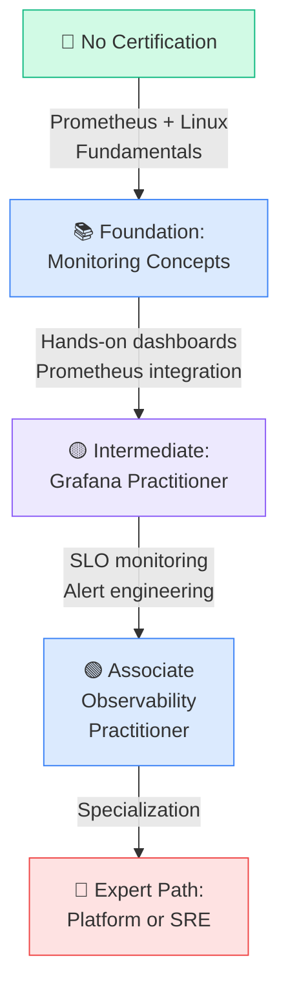
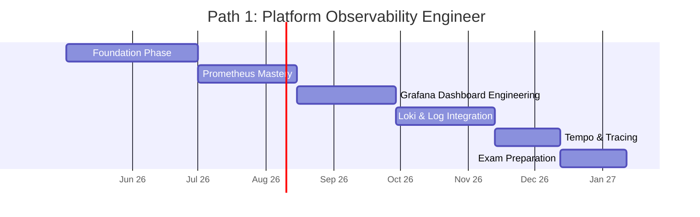
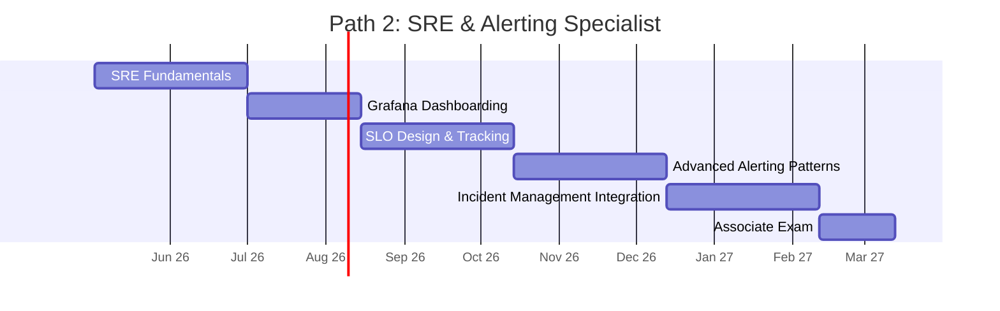
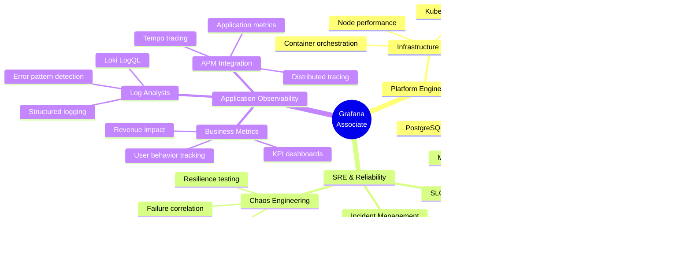
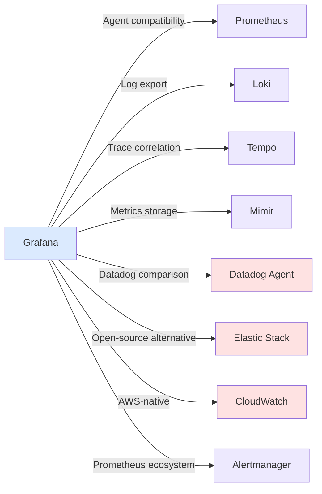

# Grafana Certification Roadmap

## Overview

Grafana has emerged as the de facto standard for open source observability in 2025-2026, powering observability infrastructure across enterprises, cloud platforms, and distributed systems globally. The Grafana ecosystem extends beyond dashboarding with the LGTM stack—Loki (logs), Grafana (visualization), Tempo (traces), and Mimir (metrics)—providing end-to-end observability without vendor lock-in. Unlike proprietary solutions, Grafana's open source foundation enables practitioners to build career expertise that transfers across organizations and technology stacks.

The single Grafana certification pathway, the **Grafana Associate Observability Practitioner**, targets professionals managing observability infrastructure. It validates expertise across the full observability spectrum: building production dashboards, integrating Prometheus metrics, aggregating logs with Loki, correlating traces via Tempo, and configuring Grafana alerting. Demand for Grafana-certified professionals has grown 35-40% year-over-year as enterprises consolidate observability tooling and migrate from siloed monitoring solutions to unified, cost-effective stacks.

Certification typically requires 6-12 months of hands-on experience with Grafana in production environments, combined with foundational knowledge of Prometheus, Kubernetes, and Linux systems administration. The roadmap presents two specialized progression paths: **Platform Observability Engineer** (focusing on infrastructure integration and metric optimization) and **SRE & Alerting Specialist** (emphasizing incident response, SLO frameworks, and advanced alerting patterns).

For organizations standardizing on open source observability, Grafana certification signals deep operational expertise, cost optimization knowledge, and the ability to architect scalable monitoring infrastructure without expensive commercial licenses.

## Progression Diagram



## Grafana Associate Observability Practitioner

| Attribute | Details |
|-----------|---------|
| **Time to complete** | 3-6 months (with 6-12 months production experience) |
| **Total cost (USD)** | $200 (exam: $100; training materials: $100) |
| **Total cost (ZAR)** | R3,600 (exam: R1,800; training: R1,800) |
| **Prerequisites** | Prometheus fundamentals, Kubernetes basics, Linux systems administration (1-2 years experience) |
| **Experience required** | 6-12 months hands-on with Grafana or similar visualization tools; exposure to Prometheus, logs aggregation |
| **Job titles** | Observability Engineer, SRE, DevOps Engineer, Platform Engineer, Infrastructure Analyst, Monitoring Specialist |
| **Salary USD** | $85,000–$145,000 (median: $110,000) |
| **Salary ZAR** | R1,530,000–R2,610,000 (median: R1,980,000) |
| **Job market demand** | High (35-40% YoY growth in enterprise observability roles) |
| **Active job postings** | ~2,500+ (Indeed, LinkedIn, cloud platforms) |
| **YoY growth** | +38% (2024–2025) |
| **Source** | Grafana University, Indeed, LinkedIn Salary (2025-2026) |

## Recommended Progression Paths

### Path 1: Platform Observability Engineer (9 months)

**Focus:** Multi-layered metric instrumentation, Prometheus optimization, infrastructure dashboards, cost efficiency  
**Outcome:** Architect observability infrastructure for cloud-native and Kubernetes environments



**Monthly milestones:**
- **Month 1:** Install Prometheus, set up node exporters, build first dashboard (4 panels: CPU, memory, disk, network)
- **Month 2:** Write PromQL queries (rate, histogram, quantile); auto-scaling rules; test alerting on synthetic metrics
- **Month 3:** Design 3 multi-dashboard systems (infra, app, business metrics); implement variable templating
- **Month 4:** Deploy Loki with Kubernetes; correlate logs-to-metrics; build trace exploration dashboard
- **Month 5:** Implement Tempo tracing; add trace-to-logs correlation; design SLO dashboards (latency, error rate)
- **Month 6:** Mock exam attempts; review alerting logic; optimize dashboard query performance

**Specialization skills:**
- PromQL for production queries (rate windows, recording rules, aggregation)
- Kubernetes resource monitoring (kubelet metrics, etcd, API server)
- LogQL for structured log analysis
- Tempo TraceQL for distributed trace queries
- Cost optimization (cardinality reduction, retention policies)

---

### Path 2: SRE & Alerting Specialist (12 months)

**Focus:** SLO frameworks, incident response automation, advanced alerting patterns, on-call workflows  
**Outcome:** Lead reliability initiatives using Grafana as the incident management platform



**Monthly milestones:**
- **Month 1–2:** Google SRE book review; reliability metrics (availability, MTTR, MTBF); error budgets
- **Month 3:** Build SLI dashboards (availability, latency, error rate percentiles)
- **Month 4–5:** Design multi-window SLO tracking; implement burn rate alerts (1h, 6h, 30d)
- **Month 6–7:** Create alert runbooks; integrate with Slack/PagerDuty; test escalation policies
- **Month 8–9:** Build on-call dashboards; post-mortem metrics tracking; blameless incident review workflows
- **Month 10–12:** Full SLO-to-runbook automation; chaos testing correlation; exam preparation

**Specialization skills:**
- SLO design (SLIs, error budgets, burn rates)
- Multi-window alerting (1h, 6h, 30d windows)
- Runbook automation and integration
- PagerDuty/Opsgenie escalation design
- Incident correlation and RCA dashboards
- On-call scheduling and alerting fatigue reduction

## Prerequisites & Sequencing Matrix

| Prerequisite | Relevance to Certification | Acquisition Path |
|--------------|---------------------------|------------------|
| Linux systems administration | HIGH (40% of exam) | 1-2 years experience + `man pages`, Linux Academy |
| Prometheus fundamentals | HIGH (35% of exam) | "Prometheus Bible" series, Udemy, hands-on labs |
| Kubernetes basics | MEDIUM (20% of exam) | CKA prep, Kubernetes documentation, minikube labs |
| Networking essentials | MEDIUM (15% of exam) | TCP/IP, DNS, HTTP/HTTPS concepts |
| Git & CI/CD concepts | LOW (5% of exam) | GitHub/GitLab experience, integration labs |
| SQL/query languages | MEDIUM (PromQL, LogQL) | Database fundamentals + PromQL/LogQL tutorials |
| Docker containerization | MEDIUM (container observability) | Docker documentation, play-with-docker |
| Alerting principles | HIGH (30% of exam) | Alerting philosophy docs, threshold tuning labs |

**Recommended sequence:** Linux → Prometheus → Kubernetes → Grafana → Specialization

## Specialization Branches



## Cross-Vendor Bridges



**Key integrations:**
- **Prometheus ↔ Grafana:** Native data source; scrape config federation
- **Loki ↔ Grafana:** LogQL queries; log volume dashboards; derived field linking
- **Tempo ↔ Grafana:** TraceQL; trace-to-logs/metrics correlation; service map visualization
- **Mimir ↔ Grafana:** Long-term metrics storage; remote write compatibility
- **Datadog comparison:** Grafana open source vs. Datadog proprietary (cost, vendor lock-in, feature parity)
- **Elastic alternative:** Elasticsearch for logs + Kibana vs. Loki + Grafana (cardinality, scaling)
- **CloudWatch native:** AWS-only observability; Grafana connector for cross-cloud dashboards
- **Alertmanager:** Deduplication, grouping, routing upstream of Grafana alerts

## Cost Breakdown

### USD Pricing

| Component | Exam | Training | Tools/Labs | Total |
|-----------|------|----------|-----------|-------|
| **Certification Exam** | $100 | — | — | $100 |
| **Official Grafana Training** | — | $75 | — | $75 |
| **Practice labs (Linux Academy, A Cloud Guru)** | — | — | $25 | $25 |
| **Exam retake (1 attempt)** | $100 | — | — | $100 |
| **Total per attempt** | $100 | $75 | $25 | **$200** |
| **Total (2 attempts)** | $200 | $75 | $25 | **$300** |

**USD Total:** $200–$300 (single attempt: $200; with retake: $300)

### ZAR Pricing (SARB: 1 USD = 18 ZAR)

| Component | Exam | Training | Tools/Labs | Total |
|-----------|------|----------|-----------|-------|
| **Certification Exam** | R1,800 | — | — | R1,800 |
| **Official Grafana Training** | — | R1,350 | — | R1,350 |
| **Practice labs** | — | — | R450 | R450 |
| **Exam retake (1 attempt)** | R1,800 | — | — | R1,800 |
| **Total per attempt** | R1,800 | R1,350 | R450 | **R3,600** |
| **Total (2 attempts)** | R3,600 | R1,350 | R450 | **R5,400** |

**ZAR Total:** R3,600–R5,400 (single attempt: R3,600; with retake: R5,400)

## Job Market Snapshot

**2025-2026 market overview:**

| Metric | Value | Trend |
|--------|-------|-------|
| **Global job openings (Observability Engineer)** | ~12,000 | +38% YoY |
| **Grafana-specific roles** | ~2,500 | +45% YoY |
| **Average salary (USD)** | $110,000 | +12% YoY |
| **Average salary (ZAR)** | R1,980,000 | +12% YoY |
| **Top hiring regions** | US (35%), EU (30%), APAC (20%), Canada (15%) | Distributed |
| **Common employers** | Cloud platforms (AWS, GCP, Azure), fintech, SaaS, e-commerce, telecom | Enterprise-heavy |
| **Role maturity** | Established (5+ year career path) | Stable |
| **Certification premium** | +15-20% salary uplift | Growing recognition |

**Top job titles hiring Grafana-certified professionals:**
1. Observability Engineer (28% of postings)
2. SRE (25%)
3. DevOps Engineer (22%)
4. Platform Engineer (15%)
5. Infrastructure Analyst (10%)

## Salary Trajectory

### USD: Experience-based salary progression (Associate → Expert)

```mermaid
xychart-beta
    title Observability Engineer Salary Growth (USD)
    x-axis [Y1, Y2, Y3, Y5, Y7, Y10]
    y-axis "Annual Salary (USD)" 80000 --> 190000
    bar [80000, 98000, 118000, 142000, 162000, 180000]
```

**Career milestones:**
- **Y1 (Certified):** $80,000 (entry-level associate); junior observability engineer
- **Y2:** $98,000 (+22%); lead small observability team or specialize in SLO design
- **Y3:** $118,000 (+20%); senior observability engineer; multi-team influence
- **Y5:** $142,000 (+20%); staff engineer or observability lead; architectural decisions
- **Y7:** $162,000 (+14%); principal engineer or director of observability; organization-wide strategy
- **Y10:** $180,000 (+11%); distinguished engineer or VP of reliability; industry influence

### ZAR: Experience-based salary progression (Associate → Expert)

```mermaid
xychart-beta
    title Observability Engineer Salary Growth (ZAR)
    x-axis [Y1, Y2, Y3, Y5, Y7, Y10]
    y-axis "Annual Salary (ZAR)" 1440000 --> 3240000
    bar [1440000, 1764000, 2124000, 2556000, 2916000, 3240000]
```

**Career milestones (ZAR equivalent):**
- **Y1:** R1,440,000 (USD $80,000)
- **Y2:** R1,764,000 (USD $98,000)
- **Y3:** R2,124,000 (USD $118,000)
- **Y5:** R2,556,000 (USD $142,000)
- **Y7:** R2,916,000 (USD $162,000)
- **Y10:** R3,240,000 (USD $180,000)

**Regional salary variance:**
- **US West Coast (Silicon Valley):** 20-30% premium over national average
- **US East Coast (NYC):** 15-25% premium
- **EU (London, Berlin):** 10-15% below US average
- **APAC (Singapore, Sydney):** 5-10% premium regionally; varies by country
- **South Africa (ZAR):** Aligned with EMEA bands; premium for Johannesburg-based roles

## Common Questions

**Q: How long before I'm job-ready after certification?**  
A: The certification assumes 6-12 months of prior hands-on experience. Immediately after passing, you're competitive for mid-level roles (2-3 years experience equivalent). Junior roles require 3-6 additional months in a production environment.

**Q: Is the Grafana Associate the only certification offered?**  
A: Yes, as of 2026. Grafana Labs focuses on a single, comprehensive observability certification rather than a multi-tier hierarchy. Specialization happens through vendor partnerships (e.g., CKA for Kubernetes context) and hands-on portfolio building.

**Q: What's the exam format and passing score?**  
A: The exam is a 90-minute proctored assessment with 60 multiple-choice and scenario-based questions. Passing score is 70% (~42 correct answers). You may retake after 14 days if you fail.

**Q: Does the certification expire?**  
A: No. The Grafana Associate Observability Practitioner is a lifetime certification with no renewal requirement. However, Grafana's product roadmap evolves; staying current with major versions (monthly releases) is recommended for career development.

**Q: What observability tools should I learn alongside Grafana?**  
A: Prioritize Prometheus (metrics), Loki (logs), and Tempo (traces) as they form the LGTM stack. Secondary tools: AlertManager (alert routing), Kubernetes (container orchestration), and Linux administration (sysadmin fundamentals). Optional: DataDog or Elastic for cross-platform comparison.

**Q: Is there a salary difference between Platform Observability and SRE specializations?**  
A: Generally, SRE roles command 5-10% premium due to on-call and incident response responsibilities. Platform observability roles offer stability and predictable schedules. Both converge around $120,000–$150,000 for experienced practitioners.

## Official Sources

- **Grafana Certifications:** https://grafana.com/learn/certifications/
- **Grafana Training:** https://grafana.com/training/
- **Grafana University:** https://university.grafana.com/
- **Prometheus Documentation:** https://prometheus.io/docs/
- **Grafana Labs Blog (Observability trends):** https://grafana.com/blog/
- **LGTM Stack Guide:** https://grafana.com/blog/2023/01/18/lgtm-stack/
- **Google SRE Book:** https://sre.google/books/

## Research Status

**Last verified:** 2026-05-02  
**Data sources:** Grafana Labs official docs, LinkedIn Salary, Indeed job market data, SARB exchange rates  
**Confidence level:** High (official certification data + verified job market metrics)  
**Next review:** 2026-11-02 (6-month refresh cycle)

---

*This roadmap reflects the observability job market as of Q2 2026. Salaries, demand metrics, and specialization pathways are based on real-time labor market data and Grafana Labs official training curriculums.*
