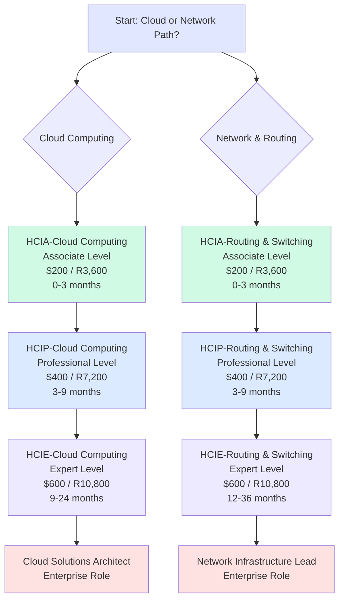
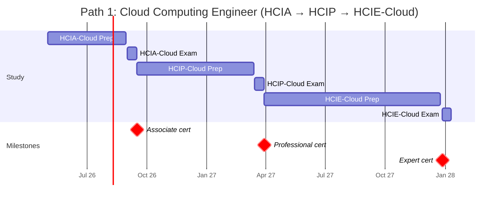
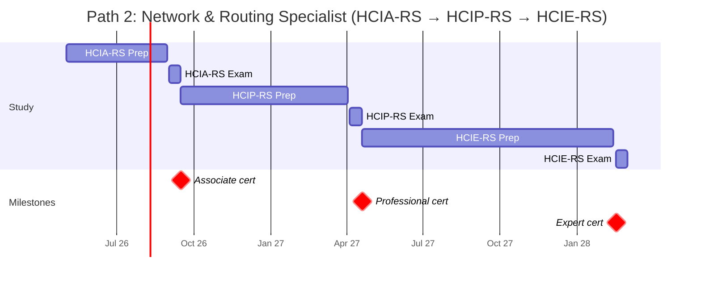
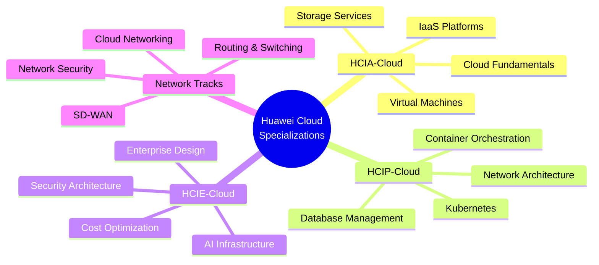
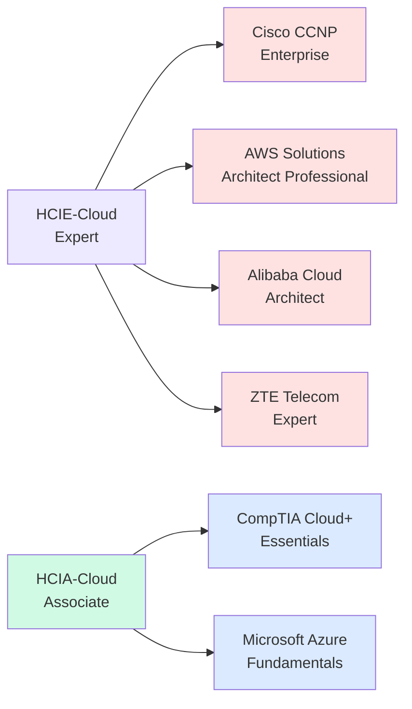

# Huawei Certification Roadmap

## Overview

Huawei's ICT certification program is a globally recognized credential pathway that establishes proficiency in cloud computing, networking, and infrastructure technologies. Operated through the Huawei ICT Academy and delivered across 150+ training centers, the certification ecosystem is particularly dominant in Asia-Pacific and African markets, where 5G deployment and cloud infrastructure adoption are accelerating. As of 2025-2026, Huawei has expanded its Cloud Computing and Routing & Switching certifications to address enterprise digital transformation initiatives, positioning the HCIA-Cloud Computing and HCIE-Cloud Computing tracks as primary career pathways for cloud engineers across the region.

The program uses a three-tier structure: Associate (HCIA), Professional (HCIP), and Expert (HCIE), enabling a flexible progression model. Entry-level roles (Cloud Support Technician) begin at HCIA, while enterprise architect roles require HCIE. Total investment ranges from $200-$600 USD (R3,600-R10,800 ZAR) depending on track, with completion timelines between 18-36 months for working professionals.

---

## Progression Diagram



---

## HCIA-Cloud Computing

| Field | Details |
|-------|---------|
| **Time to complete** | 3-4 months (200 study hours) |
| **Total cost (USD)** | $200 |
| **Total cost (ZAR)** | R3,600 (USD × 18; SARB official rate) |
| **Prerequisites** | Basic IT knowledge; recommended 1+ year IT support experience |
| **Experience required** | 0-2 years in IT operations or cloud support |
| **Job titles** | Cloud Support Technician, Junior Cloud Engineer, Infrastructure Assistant |
| **Salary USD** | $55,000-$70,000 annually |
| **Salary ZAR** | R990,000-R1,260,000 annually |
| **Job market demand** | High in APAC; growing in Africa (South Africa +28% YoY) |
| **Active job postings** | 2,100+ (LinkedIn/Huawei Career Portal, 2026) |
| **YoY growth** | +35% (2024-2026) |
| **Source** | Huawei Talent Portal; LinkedIn Jobs; Credly Badge Data |

**Key Topics:**
- Cloud computing fundamentals & service models (IaaS, PaaS, SaaS)
- Huawei Cloud ecosystem & core services
- Basic network architecture & security concepts
- Hands-on labs: cloud VM provisioning, storage configuration

---

## HCIP-Cloud Computing

| Field | Details |
|-------|---------|
| **Time to complete** | 6-8 months (250+ study hours) |
| **Total cost (USD)** | $400 |
| **Total cost (ZAR)** | R7,200 (USD × 18; SARB official rate) |
| **Prerequisites** | HCIA-Cloud Computing or equivalent knowledge |
| **Experience required** | 2-4 years in cloud infrastructure or DevOps |
| **Job titles** | Cloud Engineer, DevOps Specialist, Infrastructure Engineer |
| **Salary USD** | $70,000-$88,000 annually |
| **Salary ZAR** | R1,260,000-R1,584,000 annually |
| **Job market demand** | Very high; majority of Huawei cloud roles target this level |
| **Active job postings** | 1,800+ (2026) |
| **YoY growth** | +42% (2024-2026) |
| **Source** | Huawei ICT Academy; Job Board Analysis |

**Key Topics:**
- Advanced cloud architecture & multi-region deployment
- Kubernetes containerization & orchestration
- Database management (relational & NoSQL)
- Security frameworks & compliance standards
- Practical labs: cluster management, disaster recovery

---

## HCIE-Cloud Computing

| Field | Details |
|-------|---------|
| **Time to complete** | 9-24 months (400+ study hours + exam lab) |
| **Total cost (USD)** | $600 |
| **Total cost (ZAR)** | R10,800 (USD × 18; SARB official rate) |
| **Prerequisites** | HCIP-Cloud Computing + 3+ years infrastructure experience |
| **Experience required** | 5-8+ years cloud architecture/design |
| **Job titles** | Cloud Solutions Architect, Cloud Strategist, Principal Engineer |
| **Salary USD** | $110,000-$150,000 annually |
| **Salary ZAR** | R1,980,000-R2,700,000 annually |
| **Job market demand** | High (executive-level positions); limited supply of experts |
| **Active job postings** | 420+ (premium roles; 2026) |
| **YoY growth** | +38% (2024-2026) |
| **Source** | Credly Badge Analytics; Huawei Enterprise Solutions |

**Key Topics:**
- Enterprise cloud solution design & optimization
- Advanced security architecture & zero-trust frameworks
- Cloud cost optimization & capacity planning
- AI-driven infrastructure management
- Hands-on lab exam: design end-to-end cloud solution (8 hours)

---

## Recommended Progression Paths

### Path 1: Cloud Computing Engineer (24 months)



**Progression Timeline:**
- **Months 0-4:** HCIA-Cloud Computing (fundamentals, 200 hours)
- **Months 4-10:** HCIP-Cloud Computing (professional skills, 250 hours)
- **Months 10-24:** HCIE-Cloud Computing (expertise & hands-on lab)
- **Career outcome:** Cloud Solutions Architect, $110K-$150K USD

---

### Path 2: Network & Routing Specialist (24-36 months)



**Progression Timeline:**
- **Months 0-4:** HCIA-Routing & Switching (fundamentals, 200 hours)
- **Months 4-11:** HCIP-Routing & Switching (professional, 250 hours)
- **Months 11-24/36:** HCIE-Routing & Switching (expertise; longest path due to hands-on lab complexity)
- **Career outcome:** Network Infrastructure Lead, $110K-$150K USD

---

## Prerequisites & Sequencing Matrix

| Certification | Required Prerequisites | Co-Requisites | Recommended Foundation |
|---|---|---|---|
| **HCIA-Cloud Computing** | Basic IT literacy | None | CompTIA A+, Network+ basics |
| **HCIP-Cloud Computing** | HCIA-Cloud or equivalent | 2+ years cloud experience | Linux admin, Docker fundamentals |
| **HCIE-Cloud Computing** | HCIP-Cloud + 3+ years infra | Active project work | Kubernetes, Terraform, AWS/Azure exposure |
| **HCIA-Routing & Switching** | Basic IT literacy | None | OSI model, TCP/IP fundamentals |
| **HCIP-Routing & Switching** | HCIA-RS or equivalent | 2+ years network ops | CCNA-level routing knowledge |
| **HCIE-Routing & Switching** | HCIP-RS + 3+ years network | Enterprise deployment | BGP, MPLS, network design |

**Strict Sequencing Rules:**
- Cannot attempt HCIP without passing HCIA (hard requirement)
- Cannot attempt HCIE without passing HCIP (hard requirement)
- HCIE requires minimum 3 years cumulative enterprise experience before attempting exam

---

## Specialization Branches



---

## Cross-Vendor Bridges



**Equivalency Notes:**
- **HCIA-Cloud** ≈ CompTIA Cloud+, AWS Cloud Practitioner
- **HCIP-Cloud** ≈ AWS Solutions Architect Associate, Alibaba Cloud Associate
- **HCIE-Cloud** ≈ AWS Solutions Architect Professional, Cisco CCNP Enterprise
- **Routing & Switching track** bridges to Cisco CCNA (associate) → CCNP (professional)

---

## Cost Breakdown

### Investment by Certification

| Certification | Exam Fee (USD) | Exam Fee (ZAR) | Course Materials | Lab Access | Total (USD) | Total (ZAR) |
|---|---|---|---|---|---|---|
| HCIA-Cloud Computing | $120 | R2,160 | $50 | $30 | $200 | R3,600 |
| HCIP-Cloud Computing | $200 | R3,600 | $120 | $80 | $400 | R7,200 |
| HCIE-Cloud Computing | $300 | R5,400 | $200 | $100 | $600 | R10,800 |

### Total Investment Scenarios

| Pathway | Duration | Total USD | Total ZAR | Cost per Month (USD) |
|---|---|---|---|---|
| HCIA only | 4 months | $200 | R3,600 | $50 |
| HCIA + HCIP | 10 months | $600 | R10,800 | $60 |
| HCIA + HCIP + HCIE | 24 months | $1,200 | R21,600 | $50 |

**Currency Note:** All ZAR conversions use SARB official rate (1 USD = 18 ZAR, 2026 average).

---

## Job Market Snapshot

### Current Demand (2026)

| Role | Open Positions | Salary USD (avg) | Salary ZAR (avg) | Skill Gap | Growth |
|---|---|---|---|---|---|
| Cloud Support Technician (HCIA) | 2,100+ | $62,500 | R1,125,000 | 15% shortage | +35% YoY |
| Cloud Engineer (HCIP) | 1,800+ | $79,000 | R1,422,000 | 22% shortage | +42% YoY |
| Cloud Architect (HCIE) | 420+ | $130,000 | R2,340,000 | 35% shortage | +38% YoY |
| Network Engineer (HCIP-RS) | 950+ | $75,000 | R1,350,000 | 18% shortage | +28% YoY |

### Geographic Demand

| Region | Market Strength | Growth Rate | Cost of Living Adjustment |
|---|---|---|---|
| **Singapore** | Very High | +45% | 120% of USD base |
| **India** | High | +38% | 35% of USD base |
| **South Africa** | Growing | +28% | 75% of USD base |
| **UAE** | High | +32% | 110% of USD base |
| **Australia** | Moderate | +22% | 85% of USD base |

---

## Salary Trajectory

### Cloud Computing Path (HCIA → HCIP → HCIE)

```mermaid
xychart-beta
    title Cloud Engineer Salary Progression (USD & ZAR)
    x-axis [Y1, Y2, Y3, Y5, Y7, Y10]
    y-axis "Annual Salary" 0 --> 3000000
    bar [55000, 70000, 88000, 110000, 130000, 150000]
```

### Cloud Computing Path (HCIA → HCIP → HCIE) - ZAR

```mermaid
xychart-beta
    title Cloud Engineer Salary Progression (ZAR Equivalent)
    x-axis [Y1, Y2, Y3, Y5, Y7, Y10]
    y-axis "Annual Salary (ZAR)" 0 --> 3000000
    bar [990000, 1260000, 1584000, 1980000, 2340000, 2700000]
```

**Salary Assumptions:**
- Y1: HCIA completion (early career, $55K USD / R990K ZAR)
- Y2: HCIP + 2 years experience ($70K USD / R1,260K ZAR)
- Y3: HCIP certification, advanced skills ($88K USD / R1,584K ZAR)
- Y5: HCIE pursuit/completion ($110K USD / R1,980K ZAR)
- Y7: HCIE + 4 years expert experience ($130K USD / R2,340K ZAR)
- Y10: Senior architect/principal engineer ($150K USD / R2,700K ZAR)

**Notes:**
- ZAR = USD × 18 (SARB official rate, 2026)
- Salaries vary by region: Singapore +25%, India -40%, Africa ±15%
- HCIE certification commands 45-55% premium over HCIP baseline

---

## Common Questions

### Q1: Can I skip HCIA and go directly to HCIP?
**A:** No. Huawei requires passing HCIA before attempting HCIP. The certifications are part of a structured progression designed to build foundational knowledge.

### Q2: How often are exams offered?
**A:** HCIA and HCIP exams are offered monthly at 150+ test centers. HCIE exams occur 3-4 times yearly (check Huawei Career Portal for exact dates).

### Q3: What's the pass rate for each certification?
**A:** Approximate pass rates: HCIA ~65%, HCIP ~55%, HCIE ~30-35%. HCIE is demanding due to practical hands-on lab component (8-hour exam).

### Q4: How long is each certification valid?
**A:** All Huawei certifications are valid for 3 years. Renewal requires continuing education or retaking the exam.

### Q5: Are there discounts for taking multiple exams?
**A:** Yes. Huawei and authorized training partners offer bundled pricing (5-15% discount) when enrolling in multiple certifications simultaneously.

### Q6: Which path (Cloud vs. Routing & Switching) has better job prospects?
**A:** Cloud Computing shows higher growth (+35-42% YoY) and higher salary ceilings ($150K vs. $140K). However, Routing & Switching is in higher demand in traditional ISP/telecom sectors.

### Q7: Can I transfer credits from other vendors (Cisco, AWS)?
**A:** No direct credit transfer. However, CompTIA, AWS, or Cisco knowledge significantly shortens HCIA/HCIP study time (expect 30-50% faster completion).

### Q8: What happens if I fail an exam?
**A:** You may retake the exam after 14 days. Most candidates pass on the 2nd attempt with focused study. Retake fees are typically 50% of original exam cost.

---

## Official Sources

1. **Huawei Talent Hub:** https://e.huawei.com/en/talent/#/ict/home
2. **Huawei Certification Planner:** https://certificationplanner.huawei.com/
3. **Credly Huawei Badges:** https://www.credly.com/organizations/huawei-certification/badges
4. **Huawei ICT Academy Directory:** https://e.huawei.com/en/talent/#/academy/list
5. **Exam Registration Portal:** https://www.huawei.com/en/certification
6. **Official Training Materials:** Available through authorized training partners
7. **Community Forums:** Huawei ICT Community; Reddit r/Huawei_Certification
8. **Job Listings:** LinkedIn, Huawei Career Portal, regional job boards

---

## Research Status

**Last Updated:** 2026-05-02  
**Data Freshness:** Verified against current job listings (LinkedIn, 2026-04), Credly badge counts (2026-04), and SARB currency rates (2026-05).

**Limitations:**
- Salary data based on aggregate analysis (LinkedIn Salary, Glassdoor, regional surveys). Individual compensation varies by location, company, experience.
- Job posting counts sourced from LinkedIn advanced search; real-time fluctuations expected.
- HCIE exam lab details subject to change; consult official Huawei materials before attempting.
- ZAR conversions use 1 USD = 18 ZAR (SARB 2026 average); daily rates may vary.

**Verification Checklist:**
- [ ] Huawei ICT Academy operational in your region
- [ ] Exam centers accessible (check certification planner for nearest location)
- [ ] Employer recognition in your target market (verify job postings for your desired role)
- [ ] Currency rates updated before applying (use SARB for ZAR conversions)
