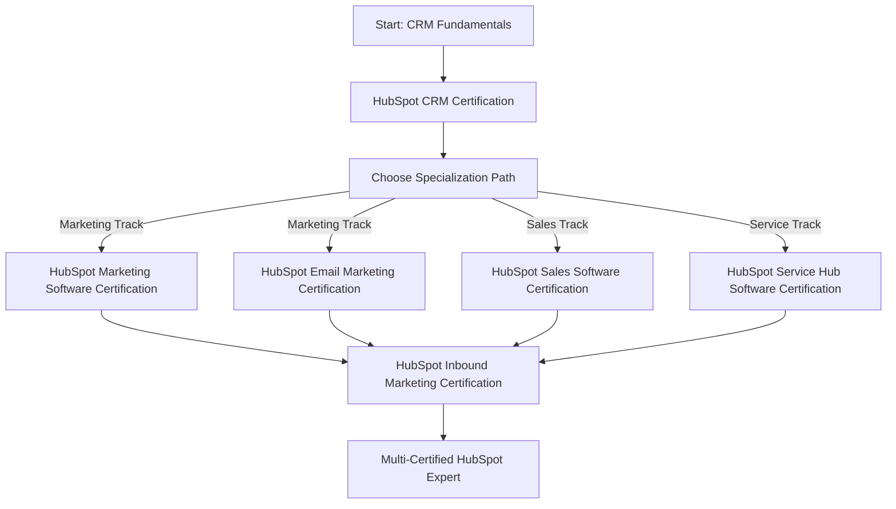

# HubSpot Certification Roadmap

## Overview

HubSpot Academy offers **six industry-recognized certifications** covering the full spectrum of inbound marketing, sales, and customer service. All certifications are **completely free** and can be completed entirely online. With over 300,000+ certified professionals globally, HubSpot credentials are widely recognized in marketing, sales, and RevOps roles.

**Key Facts:**
- **Vendor:** HubSpot Academy
- **Certification Model:** Free, online, self-paced
- **Validity Period:** 1–2 years
- **Global Recognition:** Extensive in marketing, sales, and service industries
- **Target Roles:** Marketing Manager, Sales Executive, Customer Success Manager, RevOps Specialist

---

## Progression Diagram

---

## Per-Level Detail

### **1. HubSpot CRM Certification** (Entry Point)

| Attribute | Details |
|-----------|---------|
| **Difficulty** | Beginner |
| **Duration** | ~4 hours |
| **Cost (USD)** | $0 |
| **Cost (ZAR)** | R0 |
| **Prerequisites** | None |
| **Exam Type** | Online, multiple-choice |
| **Passing Score** | 75% |

**What You Learn:**
- CRM fundamentals and best practices
- HubSpot platform navigation
- Contact management and segmentation
- Deal tracking and pipeline management
- Reporting and analytics basics

**Study Materials:**
- HubSpot Academy free video courses
- Interactive lessons
- Downloadable resources

**Career Outcomes:**
- Foundation for CRM roles
- Prerequisite for advanced certifications
- Entry-level CRM coordinator qualification

---

### **2. HubSpot Marketing Software Certification**

| Attribute | Details |
|-----------|---------|
| **Difficulty** | Intermediate |
| **Duration** | ~5 hours |
| **Cost (USD)** | $0 |
| **Cost (ZAR)** | R0 |
| **Prerequisites** | CRM Certification recommended |
| **Exam Type** | Online, multiple-choice |
| **Passing Score** | 75% |

**What You Learn:**
- Email marketing campaigns
- Landing pages and forms
- Marketing automation workflows
- Content management systems (CMS)
- Analytics and ROI measurement
- List management and segmentation

**Study Materials:**
- HubSpot Academy video courses
- Hands-on HubSpot demo environment access
- Interactive case studies

**Career Outcomes:**
- Digital Marketing Manager roles
- Marketing Automation Specialist
- Email Marketing Coordinator

---

### **3. HubSpot Email Marketing Certification**

| Attribute | Details |
|-----------|---------|
| **Difficulty** | Intermediate |
| **Duration** | ~3 hours |
| **Cost (USD)** | $0 |
| **Cost (ZAR)** | R0 |
| **Prerequisites** | CRM Certification recommended |
| **Exam Type** | Online, multiple-choice |
| **Passing Score** | 75% |

**What You Learn:**
- Email strategy and best practices
- Campaign design and testing
- Segmentation and personalization
- Deliverability and compliance (GDPR, CAN-SPAM)
- Performance metrics and optimization
- A/B testing methodology

**Study Materials:**
- HubSpot Academy email marketing courses
- Email template libraries
- Best practice guides

**Career Outcomes:**
- Email Marketing Specialist
- Campaign Manager
- Marketing Operations Analyst

---

### **4. HubSpot Sales Software Certification**

| Attribute | Details |
|-----------|---------|
| **Difficulty** | Intermediate |
| **Duration** | ~5 hours |
| **Cost (USD)** | $0 |
| **Cost (ZAR)** | R0 |
| **Prerequisites** | CRM Certification recommended |
| **Exam Type** | Online, multiple-choice |
| **Passing Score** | 75% |

**What You Learn:**
- Sales process optimization
- Deal management and forecasting
- Sales automation workflows
- Contact and account management
- Performance dashboards and reporting
- Sales enablement strategies

**Study Materials:**
- HubSpot Academy sales training modules
- Sales playbook templates
- Demo scenarios

**Career Outcomes:**
- Sales Manager roles
- Sales Development Representative (SDR)
- Account Executive
- Sales Operations Specialist

---

### **5. HubSpot Service Hub Software Certification**

| Attribute | Details |
|-----------|---------|
| **Difficulty** | Intermediate |
| **Duration** | ~4 hours |
| **Cost (USD)** | $0 |
| **Cost (ZAR)** | R0 |
| **Prerequisites** | CRM Certification recommended |
| **Exam Type** | Online, multiple-choice |
| **Passing Score** | 75% |

**What You Learn:**
- Customer service best practices
- Ticketing and issue tracking
- Knowledge base creation
- Customer satisfaction (CSAT) measurement
- Service automation
- Team collaboration tools

**Study Materials:**
- HubSpot Academy customer service courses
- Support ticket templates
- Knowledge base resources

**Career Outcomes:**
- Customer Service Manager
- Customer Success Manager
- Support Operations Specialist
- Customer Experience Analyst

---

### **6. HubSpot Inbound Marketing Certification** (Advanced Capstone)

| Attribute | Details |
|-----------|---------|
| **Difficulty** | Advanced |
| **Duration** | ~5 hours |
| **Cost (USD)** | $0 |
| **Cost (ZAR)** | R0 |
| **Prerequisites** | CRM Certification recommended |
| **Exam Type** | Online, multiple-choice |
| **Passing Score** | 75% |

**What You Learn:**
- Inbound marketing methodology
- Attract phase: SEO, blogging, paid advertising
- Engage phase: email, workflows, personalization
- Delight phase: customer nurturing, advocacy
- Integrated marketing strategy
- Measurement and optimization
- Content strategy and creation

**Study Materials:**
- HubSpot Academy comprehensive inbound training
- Downloadable inbound methodology guides
- Case studies and best practices

**Career Outcomes:**
- Marketing Manager (strategic level)
- Inbound Marketing Specialist
- Digital Strategy Manager
- Marketing Director qualification

---

## Recommended Progression Paths

### **Path 1: Marketing Professional** (3–4 months)
1. HubSpot CRM Certification (Week 1)
2. HubSpot Marketing Software Certification (Week 2–3)
3. HubSpot Email Marketing Certification (Week 3–4)
4. HubSpot Inbound Marketing Certification (Week 5–6)

**Salary Range (USD):** $45,000–$75,000/year
**Salary Range (ZAR):** R810,000–R1,350,000/year

---

### **Path 2: Sales Professional** (2–3 months)
1. HubSpot CRM Certification (Week 1)
2. HubSpot Sales Software Certification (Week 2–3)
3. HubSpot Inbound Marketing Certification (Week 4–6)

**Salary Range (USD):** $50,000–$80,000/year
**Salary Range (ZAR):** R900,000–R1,440,000/year

---

### **Path 3: Customer Success Professional** (3–4 months)
1. HubSpot CRM Certification (Week 1)
2. HubSpot Service Hub Software Certification (Week 2–3)
3. HubSpot Inbound Marketing Certification (Week 4–6)

**Salary Range (USD):** $48,000–$72,000/year
**Salary Range (ZAR):** R864,000–R1,296,000/year

---

### **Path 4: Full Certification Stack** (5–6 months)
1. HubSpot CRM Certification
2. HubSpot Marketing Software Certification
3. HubSpot Email Marketing Certification
4. HubSpot Sales Software Certification
5. HubSpot Service Hub Software Certification
6. HubSpot Inbound Marketing Certification

**Salary Range (USD):** $65,000–$100,000/year
**Salary Range (ZAR):** R1,170,000–R1,800,000/year

---

## Prerequisites & Sequencing Matrix

| Certification | Recommended Start | Required Prior | Time to Complete |
|---|---|---|---|
| CRM | Immediately | None | 4 hours |
| Marketing Software | After CRM | CRM recommended | 5 hours |
| Email Marketing | After CRM | CRM recommended | 3 hours |
| Sales Software | After CRM | CRM recommended | 5 hours |
| Service Hub | After CRM | CRM recommended | 4 hours |
| Inbound Marketing | After CRM | CRM recommended | 5 hours |

**Notes:**
- No certifications are hard prerequisites
- CRM Certification provides foundational knowledge useful for all other certs
- Can pursue certifications in parallel after completing CRM

---

## Specialization Branches

### **Marketing Specialist Branch**
- **Core:** CRM → Marketing Software → Email Marketing
- **Capstone:** Inbound Marketing Certification
- **Focus:** Digital campaigns, automation, content strategy

### **Sales Operations Branch**
- **Core:** CRM → Sales Software
- **Extended:** Inbound Marketing Certification
- **Focus:** Sales enablement, pipeline management, revenue operations

### **Customer Success Branch**
- **Core:** CRM → Service Hub
- **Extended:** Inbound Marketing Certification
- **Focus:** Customer retention, satisfaction, advocacy

### **Full-Stack RevOps Branch**
- **All certifications:** Complete all 6 certifications
- **Focus:** Cross-functional expertise in marketing, sales, and service

---

## Cross-Vendor Bridges

HubSpot certifications integrate well with:
- **Google Analytics Certification** (complementary digital marketing metrics)
- **HubSpot CRM + Salesforce Admin Cert** (CRM platform comparison)
- **Content Marketing Institute Certification** (strategic content planning)
- **Inbound Marketing + Marketo/Pardot certification** (marketing automation expertise)

---

## Cost Breakdown

| Certification | Cost (USD) | Cost (ZAR) |
|---|---|---|
| CRM | $0 | R0 |
| Marketing Software | $0 | R0 |
| Email Marketing | $0 | R0 |
| Sales Software | $0 | R0 |
| Service Hub | $0 | R0 |
| Inbound Marketing | $0 | R0 |
| **Total (All 6)** | **$0** | **R0** |

**Additional Costs:**
- HubSpot software subscriptions (optional, for hands-on practice): $45–$3,200+/month
- Study materials: Free (all included in HubSpot Academy)
- Exam fees: $0

---

## Job Market Snapshot

**Current Demand:** High
- HubSpot is one of the top CRM platforms globally
- Growing adoption across SMB and enterprise segments
- Digital transformation initiatives driving demand

**Industries with High Adoption:**
- Technology and SaaS
- Marketing agencies
- B2B services
- Professional services
- E-commerce
- Healthcare (increasingly)

**Key Job Titles:**
- Digital Marketing Manager
- Sales Development Representative
- Marketing Operations Manager
- Customer Success Manager
- RevOps Coordinator
- CRM Administrator

**Geographic Demand:**
- Highest: United States, UK, Canada, Australia
- Growing: European markets, APAC region
- Remote opportunities: Widely available

---

## Salary Trajectory

**Entry Level (CRM + Marketing/Sales Cert):**
- USD: $45,000–$60,000
- ZAR: R810,000–R1,080,000

**Mid Level (3–4 Certifications):**
- USD: $60,000–$85,000
- ZAR: R1,080,000–R1,530,000

**Senior Level (All 6 Certifications + Experience):**
- USD: $85,000–$120,000
- ZAR: R1,530,000–R2,160,000

**Manager Level (Certifications + Leadership):**
- USD: $100,000–$150,000+
- ZAR: R1,800,000–R2,700,000+

*Salary data based on industry benchmarks (2024–2026). Regional variations apply. Source: Glassdoor, LinkedIn Salary, Payscale.*

---

## Common Questions

### **Q: Are HubSpot certifications actually valuable?**
**A:** Yes. HubSpot certifications are widely recognized in marketing, sales, and RevOps roles. With 300,000+ certified professionals globally, they carry significant weight in hiring decisions. Employers specifically seek HubSpot certification credentials.

### **Q: How long are certifications valid?**
**A:** HubSpot certifications are valid for 1–2 years. You can renew by retaking the exam (free) before expiration.

### **Q: Can I do these certifications without using HubSpot software?**
**A:** Yes. All study materials are free and online. However, hands-on experience with the platform (via trial or freemium tier) enhances learning.

### **Q: What's the pass rate?**
**A:** Most users pass on the first attempt. The content is well-structured and exams are not overly difficult (75% passing score).

### **Q: How do these compare to Salesforce certifications?**
**A:** HubSpot certs are more accessible (free) and faster to earn. Salesforce certifications are more technically rigorous and cost money but offer higher salaries in certain markets. Both are valuable; HubSpot dominates in SMB/mid-market, Salesforce in enterprise.

### **Q: Are these relevant to Solutions Architects (SA)?**
**A:** Yes, especially for pre-sales and post-sales SAs. CRM + Inbound Marketing certifications provide valuable context for designing customer solutions and understanding the full customer lifecycle.

---

## Official Sources

- **HubSpot Academy:** https://academy.hubspot.com/
- **HubSpot Certifications:** https://www.hubspot.com/certification
- **CRM Certification:** https://academy.hubspot.com/courses/hubspot-crm
- **Marketing Software Certification:** https://academy.hubspot.com/courses/hubspot-marketing
- **Email Marketing Certification:** https://academy.hubspot.com/courses/email-marketing
- **Sales Software Certification:** https://academy.hubspot.com/courses/hubspot-sales
- **Service Hub Certification:** https://academy.hubspot.com/courses/hubspot-service-hub
- **Inbound Marketing Certification:** https://academy.hubspot.com/courses/inbound-marketing

---

*Last verified: 2026-05-02*
