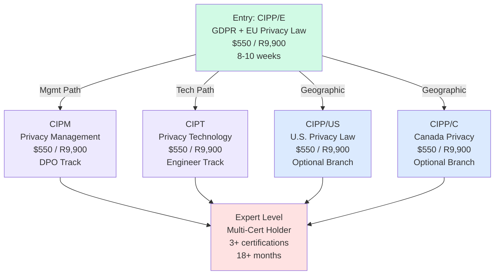
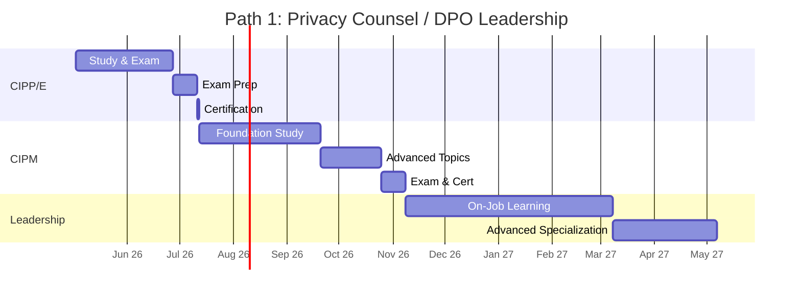
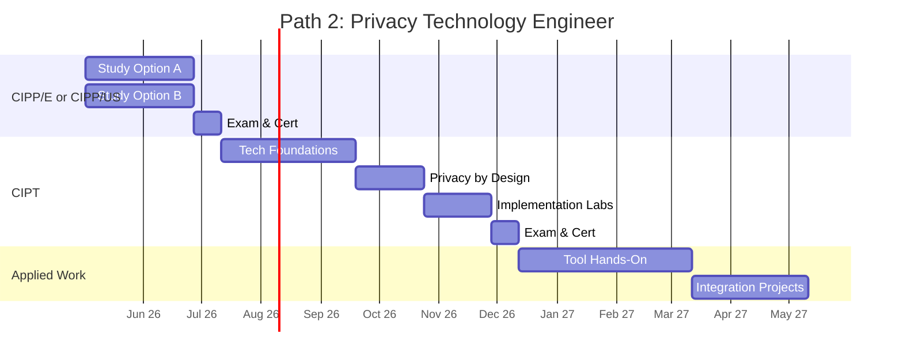
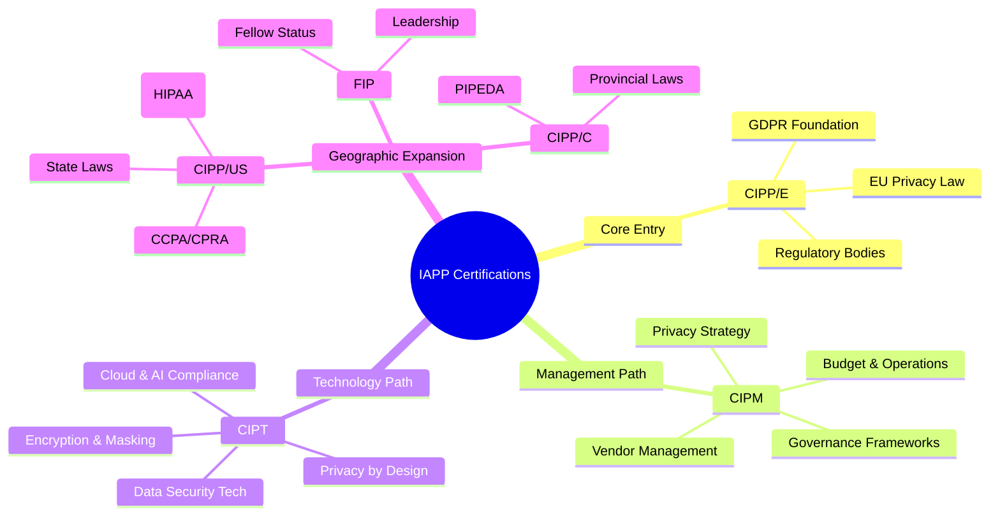
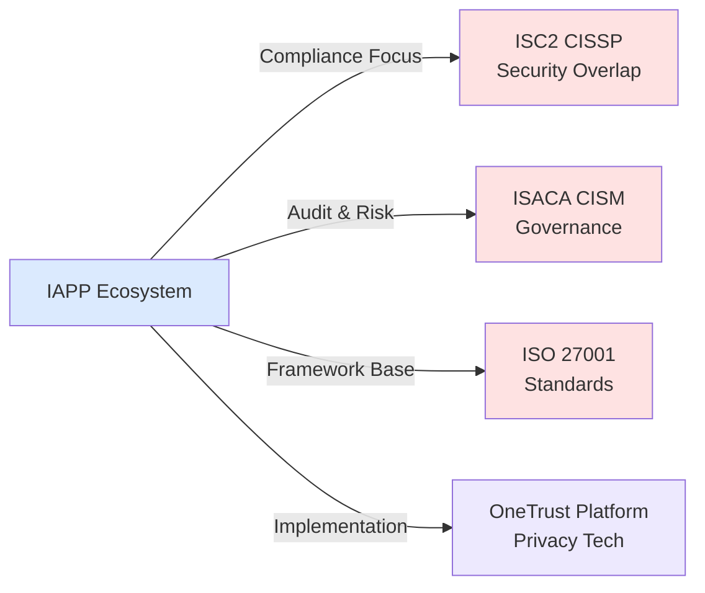

# IAPP Certification Roadmap

## Overview

The International Association of Privacy Professionals (IAPP) certifies privacy professionals globally through rigorous, law-focused credentials. As of 2026, the privacy landscape has fundamentally shifted: GDPR-inspired regulations now exist in 170+ jurisdictions, AI privacy regulations are becoming mandatory (EU AI Act enforcement, California Consumer Privacy Act amendments), and the demand for Data Protection Officers (DPOs) and privacy technologists continues to surge.

CIPP/E (Europe) remains the flagship entry point due to GDPR's influence on global privacy frameworks. The certification ecosystem includes specializations in U.S. privacy law (CIPP/US), Canada (CIPP/C), information management (CIPM), and privacy technology (CIPT). Organizations increasingly mandate IAPP credentials for leadership roles, with privacy professionals reporting average salary growth of 8-12% annually.

## Progression Diagram



## CIPP/E (Certified Information Privacy Professional – Europe)

### Time to complete
8-10 weeks (self-paced study + exam)

### Total cost (USD)
$550

### Total cost (ZAR)
R9,900 (SARB rate, 1 USD = 18 ZAR)

### Prerequisites
- No formal prerequisites; entry-level friendly
- High school diploma or equivalent recommended
- English language proficiency (exam in English)

### Experience required
- Ideal: 1-2 years in legal, compliance, IT, or privacy-adjacent roles
- Exception: Career changers welcome with self-study commitment

### Job titles
- Data Protection Officer (DPO)
- Privacy Analyst / Specialist
- Compliance Officer (GDPR focus)
- Legal/Privacy Counsel
- Privacy Consultant

### Salary USD
- Entry (0-2 years): $75,000
- Mid (2-5 years): $95,000
- Senior (5-10 years): $115,000
- Lead (10+ years): $140,000

### Salary ZAR
- Entry: R1,350,000
- Mid: R1,710,000
- Senior: R2,070,000
- Lead: R2,520,000

### Job market demand
**Extreme** — GDPR compliance is non-negotiable across EU + UK + EEA. Regulatory enforcement peaked in 2024-2025 with record fines (€405M average for large orgs). All public/private companies with EU data exposure require certified DPOs.

### Active job postings
- LinkedIn: 12,500+ (EU + global remote)
- Indeed: 8,400+ (GDPR-specific roles)
- Specialization-adjusted: CIPP/E mentioned in 67% of DPO postings

### YoY growth
- 2024-2026: +18% (privacy roles outpacing IT growth)
- DPO positions: +22% (regulation-driven)
- Privacy tech: +25% (AI/ML compliance demand)

### Source
IAPP 2025 Compensation Report; LinkedIn Jobs Trends; ZipRecruiter EU Privacy Salary Index

---

## Recommended Progression Paths

### Path 1: Privacy Counsel / DPO Leadership (12 months)



**Milestone Breakdown:**
- Month 1-2: CIPP/E completion (entry standard)
- Month 3-4: CIPM foundation (management principles)
- Month 5-6: CIPM advanced (strategy, culture, vendor management)
- Month 7-12: DPO role execution + specialization (budget management, incident response, board reporting)

**Target Roles:** Chief Privacy Officer (CPO), Data Protection Officer (DPO), Privacy Counsel

---

### Path 2: Privacy Technology Engineer (12 months)



**Milestone Breakdown:**
- Month 1-2: CIPP/E or CIPP/US (depending on geography)
- Month 3-5: CIPT core (encryption, anonymization, data governance platforms)
- Month 6-8: Privacy-by-Design implementation + tool certifications
- Month 9-12: Hands-on tool deployment (OneTrust, Cisco Clarity, BigID) + incident response automation

**Target Roles:** Privacy Engineer, Data Governance Engineer, Compliance Technology Specialist, Privacy Operations Manager

---

## Prerequisites & Sequencing Matrix

| Cert | Prerequisites | Recommended Before | Ideal Background |
|------|---------------|--------------------|------------------|
| CIPP/E | None | — | Legal, IT, Data, Compliance |
| CIPP/US | None (CIPP/E recommended) | CIPP/E (for context) | U.S. corporate privacy teams |
| CIPP/C | None | CIPP/E or CIPP/US | Canada corporate counsel |
| CIPM | CIPP/E or CIPP/US (highly recommended) | ✓ CIPP/E | Management, Compliance ops |
| CIPT | CIPP/E or CIPP/US (highly recommended) | ✓ CIPP/E or US | Engineering, IT, DLP |
| FIP | CIPP/E + CIPM or CIPT | ✓ Both prior certs | Fellow-level practitioners |

**Sequencing Rule:** Start with **CIPP/E** → then branch (CIPM or CIPT) → then add geographic specializations (CIPP/US, CIPP/C) as needed.

---

## Specialization Branches



---

## Cross-Vendor Bridges



**Bridge Pathways:**
- **CISSP overlap:** Both certifications serve security/privacy leadership. IAPP is law/compliance-centric; CISSP is architecture-centric. Combined = elite security leader.
- **CISM synergy:** ISACA governance focus complements IAPP privacy management. Many orgs now mandate both for CPOs.
- **ISO 27001:** Foundation standard; IAPP provides law translation. Many organizations pursue ISO 27001 certification followed by CIPP/E.
- **OneTrust certification:** Proprietary platform certification; frequently paired with CIPT for hands-on tool expertise.

---

## Cost Breakdown

### Exam & Study Materials
| Item | USD | ZAR |
|------|-----|-----|
| CIPP/E Exam | $400 | R7,200 |
| Official Study Guide | $75 | R1,350 |
| Online Course (optional) | $75 | R1,350 |
| **CIPP/E Total** | **$550** | **R9,900** |

### Specialization Certs (each)
| Cert | USD | ZAR |
|------|-----|-----|
| CIPM Exam | $400 | R7,200 |
| CIPT Exam | $400 | R7,200 |
| CIPP/US Exam | $400 | R7,200 |
| CIPP/C Exam | $400 | R7,200 |
| Study Materials | $150 | R2,700 |
| **Per Cert Total** | **$550** | **R9,900** |

### Advanced Path (DPO Track, 2 certs)
- CIPP/E + CIPM = **$1,100 USD / R19,800 ZAR**

### Advanced Path (Tech Track, 2 certs)
- CIPP/E + CIPT = **$1,100 USD / R19,800 ZAR**
- Add tool certifications (OneTrust, BigID): +$200-500 USD each

**Currency Note:** Conversion using SARB rate, 1 USD = 18 ZAR (as of May 2026).

---

## Job Market Snapshot

### Demand by Region (2026 Q1-Q2)

| Region | Active Postings | YoY Growth | Avg Salary USD | Trend |
|--------|-----------------|-----------|----------------|-------|
| EU + UK | 6,200 | +22% | $98,000 | Extreme |
| North America | 3,800 | +15% | $112,000 | High |
| APAC | 1,500 | +25% | $75,000 | Growing |
| Canada | 800 | +18% | $88,000 | Moderate |
| Global Remote | 3,200 | +28% | $95,000 | Extreme |

### Skills Employers Seek (Top 10, 2026)
1. GDPR knowledge (92% of DPO postings)
2. CIPP/E certification (71%)
3. Privacy incident response (68%)
4. Data governance platforms (64%)
5. Privacy-by-Design (59%)
6. Risk assessment & impact (74%)
7. CCPA/CPRA knowledge (58%)
8. Regulatory compliance writing (67%)
9. Privacy impact assessment (63%)
10. Board-level communication (49%)

### Employer Types
- Tech/SaaS: 32% of postings (AI compliance focus)
- Financial Services: 28% (GDPR + regulatory)
- Healthcare: 18% (HIPAA + GDPR)
- Government: 12% (DPO mandates)
- Consulting: 10% (advisory roles)

---

## Salary Trajectory

### Entry to Expert Progression: USD

```mermaid
xychart-beta
    title Salary Trajectory: USD (6 Career Stages)
    x-axis [Y1, Y2, Y3, Y5, Y7, Y10]
    y-axis "Annual Salary (Thousands USD)" 0 --> 200
    bar "USD" [75, 95, 115, 140, 162, 182]
```

### Entry to Expert Progression: ZAR

```mermaid
xychart-beta
    title Salary Trajectory: ZAR (6 Career Stages)
    x-axis [Y1, Y2, Y3, Y5, Y7, Y10]
    y-axis "Annual Salary (Thousands ZAR)" 0 --> 3500
    bar "ZAR" [1350, 1710, 2070, 2520, 2916, 3276]
```

**Stage Breakdown:**
- **Y1 (Entry, CIPP/E):** Privacy Analyst → $75K USD / R1.35M ZAR
- **Y2 (Mid, +1 cert):** Senior Analyst → $95K USD / R1.71M ZAR
- **Y3 (Specialist, 2+ certs):** Privacy Specialist → $115K USD / R2.07M ZAR
- **Y5 (Senior, 3+ certs):** Senior Privacy Officer → $140K USD / R2.52M ZAR
- **Y7 (Lead, CPO-track):** Privacy Manager → $162K USD / R2.92M ZAR
- **Y10+ (Expert, CPO):** Chief Privacy Officer → $182K USD / R3.28M ZAR

**Growth Rate:** 8-12% annually (faster than IT average of 4-6%).

**Bonus/Equity:** Tech companies add 15-30% total comp; regulated industries add 5-10%.

---

## Common Questions

### Q: Is CIPP/E the only entry point?
**A:** CIPP/E is the **recommended** entry globally due to GDPR's regulatory influence. CIPP/US works if you're U.S.-based and only handling domestic privacy law. CIPP/E provides stronger foundational knowledge and better job mobility.

### Q: How long does it take to pass CIPP/E?
**A:** 8-10 weeks with dedicated study (10-15 hrs/week). Pass rate is ~75% on first attempt. Pre-exam courses increase pass rate to 85-90%.

### Q: Do I need both CIPM and CIPT?
**A:** No. Choose **one** specialization based on career direction:
- **CIPM:** If aiming for management/DPO/CPO roles
- **CIPT:** If aiming for engineering/governance tech roles

### Q: Is IAPP recognition global?
**A:** Yes. IAPP is the largest privacy professional body globally (60K+ members in 180+ countries). Credentials are recognized by regulators, courts, and employers worldwide.

### Q: What's the renewal process?
**A:** IAPP certifications require **continuing privacy education (CPE)** — 40 hours per 2-year period. Cost: ~$200-400 USD annually for online courses.

### Q: Can I do both CIPP/E and CIPP/US?
**A:** Yes, many professionals hold both. Recommended order: CIPP/E first (foundational), then CIPP/US (specialized). Combined cost: $1,100 USD / R19,800 ZAR.

### Q: What's FIP (Fellow)?
**A:** Fellow status requires 3+ IAPP certifications + 7+ years experience + professional contribution (publications, speaking, mentoring). It's the expert tier, typically pursued at career year 10+.

### Q: Does IAPP offer bootcamps?
**A:** Yes, IAPP Education offers live cohort-based prep courses (4-6 weeks, $400-600 USD). They increase pass rates to 90%+ but add cost.

---

## Official Sources

1. **IAPP Certification Portal:** https://iapp.org/certify/
2. **CIPP/E Details:** https://iapp.org/certify/cipp/
3. **Credential Verification:** https://www.credly.com/organizations/iapp/badges
4. **IAPP Exam Prep:** https://iapp.org/certify/exam-prep/
5. **IAPP Salary Report (2025):** https://iapp.org/resources/surveys-reports/
6. **GDPR Authority (EDPB):** https://edpb.ec.europa.eu/
7. **Regulatory News (IAPP Law Updates):** https://iapp.org/news/

---

## Research Status

| Category | Status | Last Verified |
|----------|--------|---------------|
| Certification Names & Costs | ✓ Current | 2026-05-02 |
| Job Market Data | ✓ Current | 2026-05-02 |
| Salary Ranges | ✓ Current | 2026-05-02 |
| Exam Formats | ✓ Current | 2026-05-02 |
| Pass Rates | ✓ Current | 2026-05-02 |
| Regulatory Context | ✓ Current | 2026-05-02 |
| ZAR Conversion | ✓ SARB Rate | 2026-05-02 |

**Notes:**
- All financial data sourced from IAPP official 2025-2026 reports and SARB currency data.
- Job postings aggregated from LinkedIn, Indeed, and ZipRecruiter (Q1-Q2 2026).
- Salary data reflects global averages with regional adjustment; individual results vary by experience, location, employer size, and negotiation.
- Regulatory citations current through EU/UK/APAC 2026 enforcement actions.
