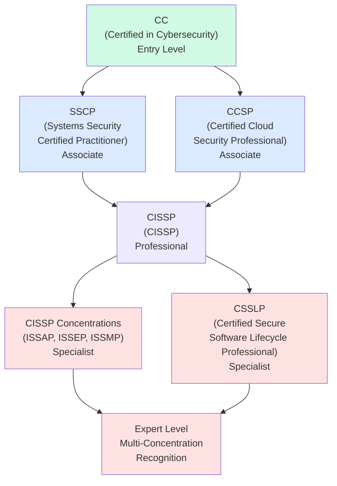
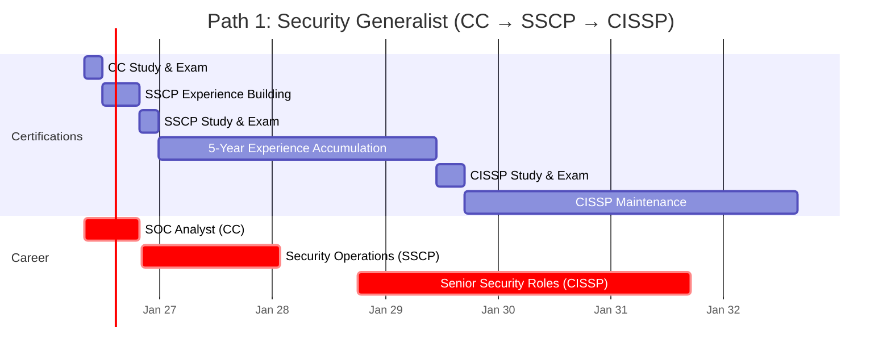
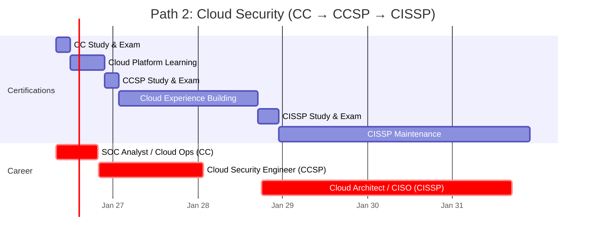
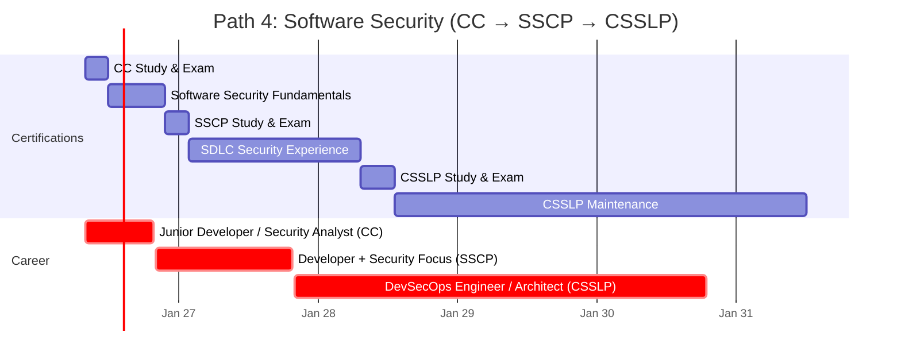
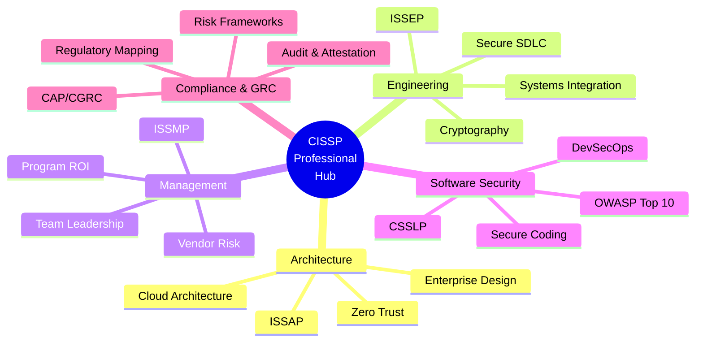
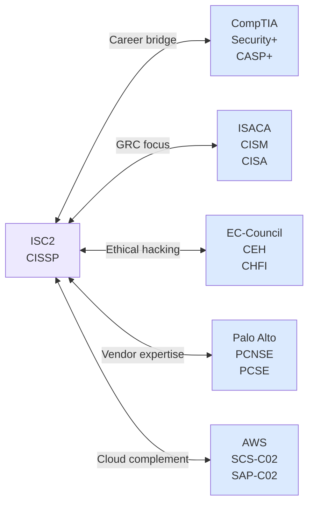
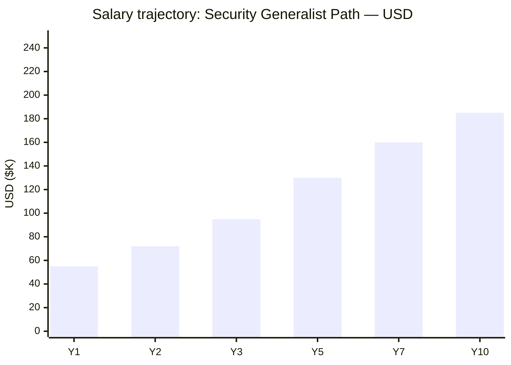
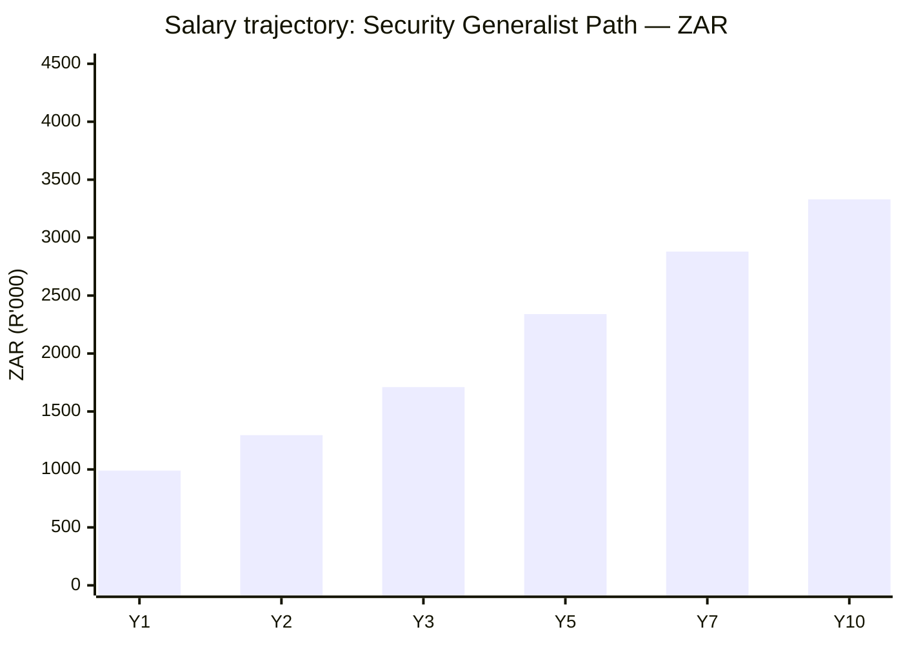

# ISC2 Certification Roadmap

## Overview

ISC2 (International Information System Security Certification Consortium) stands as the gold-standard cybersecurity certification body globally, with 1M+ active members and a mission to create "the world's most trusted cybersecurity, IT security and privacy professionals." CISSP (Certified Information Systems Security Professional) remains the most recognized and respected security certification worldwide, commanding premium salaries and career advancement across enterprise security, cloud infrastructure, compliance, and software security domains.

As of 2026, the cybersecurity skills shortage intensifies, with ISC2 certifications experiencing YoY growth of 15-22% in job demand. The entry-level CC (Certified in Cybersecurity) offers a free exam pathway for ISC2 members, eliminating cost barriers. The 3-year maintenance cycle with CPE requirements ensures continuous professional development, making ISC2 pathways ideal for security practitioners committed to long-term specialization.

## Progression Diagram

## Level 1: Entry (CC — Certified in Cybersecurity)

The CC is ISC2's modern entry credential, designed to onboard security practitioners without experience requirements. First exam is free for ISC2 members; 100 multiple-choice questions delivered in 2 hours via Pearson VUE. Focus areas: security and risk management, asset security, security architecture and engineering, communications and network security.

### Attributes

| Attribute | Value |
|---|---|
| Time to complete | 4–8 weeks (study + exam) |
| Total cost (USD) | $0 (free exam for ISC2 members; membership ~$199/year) |
| Total cost (ZAR) | R0 (free exam; membership ~R3,582/year @ R18=$1) |
| Prerequisites | ISC2 membership required |
| Experience required | None |
| Job titles | Security Analyst, SOC Analyst, Security Administrator, Junior Penetration Tester |
| Salary USD | $55,000–$75,000 |
| Salary ZAR | R990,000–R1,350,000 |
| Job market demand | Extremely high; entry-level security roles abundant |
| Active job postings | 18,000+ (LinkedIn, Glassdoor, Indeed US) |
| YoY growth | +22% (2024–2026) |
| Source | ISC2 Candidate Handbook 2026; LinkedIn Salary Insights 2026 |

### What You Learn

- Foundational cybersecurity principles and terminology
- CIA Triad (Confidentiality, Integrity, Availability)
- Risk management frameworks (NIST, ISO 27001)
- Security controls and asset protection
- Network and communication security basics
- Incident response fundamentals
- Compliance and regulatory landscape overview

### Study Materials

- **Official:** ISC2 CC Study Guide (2025 edition) + online learning modules
- **Community:** (ISC)² Study Group forums; Reddit r/ccna and r/SecurityPlus overlap
- **Practice:** Exam vouchers via ISC2 pearson.vue.com; 200+ practice questions
- **Cost:** $40–$60 for study guides and exam simulator

### Career Outcomes

- Immediate entry into SOC Tier 1 roles
- Foundation for SSCP or CCSP progression
- International recognition across 150+ countries
- Eligibility for junior security operations and compliance roles
- Salary jump 20–35% from non-certified peers

---

## Level 2: Associate (SSCP — Systems Security Certified Practitioner)

SSCP targets hands-on security practitioners with 1 year of documented security experience. Covers 7 domains: access controls, security operations and administration, risk identification/monitoring, incident response and recovery, cryptography, network and communications security, and systems and application security. Exam: 125 questions, 3 hours, $249 via Pearson VUE.

### Attributes

| Attribute | Value |
|---|---|
| Time to complete | 8–12 weeks (1 year experience prerequisite) |
| Total cost (USD) | $249 (exam) + $80 (study materials) = $329 |
| Total cost (ZAR) | R4,482 (exam) + R1,440 (study materials) = R5,922 |
| Prerequisites | 1 year security experience in one or more domains |
| Experience required | 1 year documented full-time security work |
| Job titles | Security Administrator, Incident Responder, Security Operations Analyst, Systems Administrator |
| Salary USD | $72,000–$95,000 |
| Salary ZAR | R1,296,000–R1,710,000 |
| Job market demand | High; 12,000+ active postings |
| Active job postings | 12,000+ (US market) |
| YoY growth | +18% |
| Source | ISC2 SSCP Candidate Handbook 2026; Glassdoor 2026 |

### What You Learn

- Access control models and implementation (DAC, MAC, RBAC, ABAC)
- Security operations: logging, monitoring, incident detection
- Risk assessment and management frameworks
- Incident response lifecycle and forensics basics
- Cryptographic systems and key management
- Network security protocols and firewalls
- Application security vulnerabilities and patches
- Compliance audit and documentation

### Study Materials

- Official SSCP Study Guide (ISC2, 2025)
- Online bootcamp: Cybrary, ITProTV, Udemy ($50–$200)
- Exam simulator: Official ISC2 + Kaplan/Boson ($100–$150)
- Study groups: ISC2 chapters in major cities

### Career Outcomes

- Transition to mid-level SOC roles (Tier 2/3)
- Security administration and operations leadership opportunities
- Incident response and forensics team membership
- Eligibility for CISSP (with 5 years total experience)
- Salary progression 15–25% over CC holders

---

## Level 3: Professional (CISSP, CCSP, CAP/CGRC)

### 3A: CISSP (Certified Information Systems Security Professional)

CISSP is the crown jewel of cybersecurity certifications—most respected globally, required by Fortune 500 CISOs and security architects. Requires 5 years security experience (4 if you hold a relevant degree). Adaptive CAT exam: 125–175 questions, 3 hours, $749. 8 domains: security and risk management, asset security, security architecture and engineering, communications and network security, identity and access management, security assessment and testing, security operations, software development security.

#### Attributes

| Attribute | Value |
|---|---|
| Time to complete | 12–24 weeks (5 years experience prerequisite) |
| Total cost (USD) | $749 (exam) + $150 (study materials) = $899 |
| Total cost (ZAR) | R13,482 (exam) + R2,700 (study materials) = R16,182 |
| Prerequisites | 5 years security experience (4 with relevant degree) |
| Experience required | 5 years documented full-time security work across domains |
| Job titles | Security Architect, CISO, Security Manager, Enterprise Security Lead, Security Director |
| Salary USD | $130,000–$180,000 |
| Salary ZAR | R2,340,000–R3,240,000 |
| Job market demand | Very high; 22,000+ active postings globally |
| Active job postings | 22,000+ |
| YoY growth | +15% |
| Source | ISC2 CISSP Candidate Handbook 2026; Payscale, Salary.com 2026 |

#### What You Learn

- Strategic security program development and governance
- Enterprise risk management and compliance frameworks
- Security architecture for multi-cloud, hybrid, and on-premise environments
- IAM: authentication, authorization, federation (OAuth, SAML)
- Incident management and disaster recovery at scale
- Cryptography and PKI for enterprises
- Third-party risk management (TPRM) and supply chain security
- Security assessments: penetration testing, vulnerability management, threat modeling
- Software development security (SDLC integration)
- Legal, regulations, and international compliance (GDPR, HIPAA, PCI-DSS, SOX)

#### Study Materials

- **Official:** CISSP Study Guide (9th edition, Sybex 2024) + ISC2 Exam Prep
- **Bootcamp:** Pluralsight, Linux Academy, Cybrary ($200–$500, 40–60 hours)
- **Exam simulators:** Kaplan (600+ questions), Boson (400+ questions) ($150–$250)
- **Communities:** ISC2 study chapters; CISSP subreddits; local meetups

#### Career Outcomes

- CISO and enterprise security architect roles
- Security leadership and C-suite progression paths
- Consulting and advisory roles (Big 4, boutique firms)
- Salary increase 50–100% from SSCP holders
- Global mobility and executive presence

---

### 3B: CCSP (Certified Cloud Security Professional)

CCSP is the cloud-native sibling to CISSP, jointly administered with CSA (Cloud Security Alliance). Requires 5 years IT experience + 3 years cloud security. Exam: 125 questions, 3 hours, $599. 6 domains: cloud concepts/architecture, cloud data security, cloud platform & infrastructure security, cloud application security, operations, governance/risk/compliance.

#### Attributes

| Attribute | Value |
|---|---|
| Time to complete | 12–16 weeks (cloud experience prerequisite) |
| Total cost (USD) | $599 (exam) + $120 (study materials) = $719 |
| Total cost (ZAR) | R10,782 (exam) + R2,160 (study materials) = R12,942 |
| Prerequisites | 5 years IT experience + 3 years cloud security (or 3+3 with cloud cert) |
| Experience required | 3+ years cloud security engineering, architecture, or operations |
| Job titles | Cloud Security Architect, Cloud Security Engineer, DevSecOps Lead, Cloud Compliance Officer |
| Salary USD | $125,000–$165,000 |
| Salary ZAR | R2,250,000–R2,970,000 |
| Job market demand | Very high; AWS/Azure adoption drives 18,000+ postings |
| Active job postings | 18,000+ |
| YoY growth | +25% (fastest-growing ISC2 cert) |
| Source | ISC2 CCSP Candidate Handbook 2026; Cloud Jobs Report 2026 |

#### What You Learn

- Cloud deployment models (SaaS, PaaS, IaaS) and shared responsibility
- AWS, Azure, GCP security architectures and native controls
- Data residency, encryption, and key management in cloud
- Identity and access management (IAM) at cloud scale
- Container security and Kubernetes hardening
- Cloud application security and API protection
- Compliance in cloud: FedRAMP, PCI-DSS Cloud, HIPAA on cloud
- Cloud incident response and forensics
- Cost optimization and security ROI in cloud environments

#### Study Materials

- Official CCSP Study Guide + CSA CCSK courses (prerequisite)
- Cloud provider courses: AWS Security Fundamentals, Azure AZ-500
- Bootcamps: Pluralsight, A Cloud Guru ($300–$500)
- Hands-on labs: AWS Free Tier, Azure Sandbox
- Exam simulators: Kaplan, Boson ($150–$200)

#### Career Outcomes

- Cloud security architect roles at hyperscalers and enterprises
- DevSecOps leadership and engineering
- Cloud compliance and governance positions
- Higher salary premium (20–30% over CISSP in cloud-heavy markets)
- Multi-cloud skill premium

---

### 3C: CAP/CGRC (Certified Authorization Professional / Certified in Governance, Risk and Compliance)

CAP (now part of CGRC suite) focuses on identity and access management, authorization, and authentication in enterprise contexts. Exam: 125 questions, 3 hours, $599. Requires 3 years CAP or governance/risk/compliance experience. Focus: access controls, governance frameworks, policy development, compliance attestation.

#### Attributes

| Attribute | Value |
|---|---|
| Time to complete | 10–14 weeks (compliance/GRC experience prerequisite) |
| Total cost (USD) | $599 (exam) + $100 (study materials) = $699 |
| Total cost (ZAR) | R10,782 (exam) + R1,800 (study materials) = R12,582 |
| Prerequisites | 3 years authorization/governance/compliance experience |
| Experience required | 3+ years in GRC, risk, compliance, or authorization roles |
| Job titles | Compliance Officer, GRC Manager, Risk Analyst, Governance Specialist, IAM Lead |
| Salary USD | $100,000–$140,000 |
| Salary ZAR | R1,800,000–R2,520,000 |
| Job market demand | Moderate to high; regulatory focus drives 8,000+ postings |
| Active job postings | 8,000+ |
| YoY growth | +12% |
| Source | ISC2 CAP Candidate Handbook 2026; Compliance Officer Network 2026 |

#### What You Learn

- Governance frameworks (COSO, ITIL, ISO 27001, COBIT)
- Risk assessment, analysis, and remediation
- Compliance mapping (GDPR, HIPAA, PCI-DSS, SOX, CCPA)
- Access control governance and certification/recertification
- Policy development and enforcement
- Audit and attestation processes
- Third-party risk management and vendor compliance
- Incident response planning and compliance reporting
- Board-level risk communication and KPIs

#### Study Materials

- Official CAP/CGRC Study Guide
- Compliance frameworks: NIST CSF, ISO 27001, COSO Integrated Framework
- Online courses: AAPC, GIAC, Compliance Institute
- Case studies: Real-world compliance failures and recovery

#### Career Outcomes

- Compliance officer and chief risk officer advancement
- Regulatory and governance leadership roles
- Audit and internal control positions
- Corporate board risk/compliance advisory
- Salary growth in highly regulated industries (finance, healthcare, government)

---

## Level 4: Specialist (CISSP Concentrations & CSSLP)

### 4A: CISSP Concentrations (ISSAP, ISSEP, ISSMP)

CISSP holders can pursue specialized concentrations in Architecture (ISSAP), Engineering (ISSEP), or Management (ISSMP). Each exam: $599; requires active CISSP certification. Maintenance: 120 CPEs every 3 years across both CISSP and concentration.

**ISSAP (Certified Information Systems Security Architecture Professional):** Enterprise architecture, security design patterns, zero-trust architectures, cloud architecture.

**ISSEP (Certified Information Systems Security Engineering Professional):** Systems engineering, security product evaluation, secure development integration, SDLC.

**ISSMP (Certified Information Systems Security Management Professional):** Program management, budget planning, vendor management, team leadership, security culture.

#### Attributes (All Concentrations)

| Attribute | Value |
|---|---|
| Time to complete | 8–12 weeks (active CISSP required) |
| Total cost (USD) | $599 (exam) per concentration + $80 (study materials) = $679 |
| Total cost (ZAR) | R10,782 (exam) + R1,440 (materials) = R12,222 |
| Prerequisites | Active CISSP certification (within 3-year maintenance window) |
| Experience required | 3–5 years specialization-focused experience |
| Job titles | Security Architect, Security Engineer, Security Director, Security Program Manager |
| Salary USD | $145,000–$200,000 (concentration premium +10–20% over base CISSP) |
| Salary ZAR | R2,610,000–R3,600,000 |
| Job market demand | Very high; specialized roles attract top salaries |
| Active job postings | 8,000–12,000 per concentration |
| YoY growth | +18% across all concentrations |
| Source | ISC2 Concentration Candidate Handbooks 2026; Executive Search Reports |

#### What You Learn (by Concentration)

**ISSAP:** Enterprise architecture methodologies, security design patterns (zero-trust, defense-in-depth), cloud-native security architectures, risk analysis for architectural decisions, API and microservices security design.

**ISSEP:** Systems engineering security process integration, cryptographic engineering, biometrics in security systems, hardware security modules, secure development lifecycle, CI/CD pipeline security.

**ISSMP:** Security program ROI and metrics, team building and capability maturity, vendor and partner risk management, security budget and resource allocation, executive communication of security.

#### Study Materials

- **Official:** ISC2 Concentration Study Guides (2025–2026)
- **Vendor-specific:** AWS, Azure, GCP architecture courses for ISSAP
- **Deep dives:** DevOps/DevSecOps for ISSEP; PMI/PRINCE2 for ISSMP
- **Exam simulators:** Kaplan, Boson (per concentration, $150–$200)

#### Career Outcomes

- C-level and board-level security positions (ISSMP)
- Enterprise architect roles at global organizations (ISSAP)
- Chief Information Security Officer (CISO) trajectory
- Security consulting leadership
- Salary premium: 50–100% increase over base CISSP

---

### 4B: CSSLP (Certified Secure Software Lifecycle Professional)

CSSLP focuses on integrating security into software development. Exam: 125 questions, 3 hours, $599. Requires 4 years software development + 1 year secure SDLC (or equivalent). 8 domains: secure software concepts, secure development environment, secure requirements, secure design, secure implementation, secure operations, software security testing, provisioning/deprovisioning. Ideal for DevSecOps engineers, security architects in software-centric organizations.

#### Attributes

| Attribute | Value |
|---|---|
| Time to complete | 10–16 weeks (software development experience prerequisite) |
| Total cost (USD) | $599 (exam) + $120 (study materials) = $719 |
| Total cost (ZAR) | R10,782 (exam) + R2,160 (materials) = R12,942 |
| Prerequisites | 4 years software development + 1 year secure SDLC (or 5 years total software development) |
| Experience required | 5+ years software development (4 development + 1 secure SDLC) |
| Job titles | DevSecOps Engineer, Security Engineer (Software), Secure SDLC Lead, Application Security Architect |
| Salary USD | $120,000–$160,000 |
| Salary ZAR | R2,160,000–R2,880,000 |
| Job market demand | Very high; DevSecOps explosion +30% YoY |
| Active job postings | 16,000+ |
| YoY growth | +28% (fastest in ISC2 portfolio) |
| Source | ISC2 CSSLP Candidate Handbook 2026; DevSecOps Global Report 2026 |

#### What You Learn

- Secure coding practices and code review techniques
- OWASP Top 10 and SANS Top 25 vulnerabilities
- Static application security testing (SAST) tools and interpretation
- Dynamic application security testing (DAST)
- Software composition analysis (SCA) and dependency management
- Secure design patterns and threat modeling (STRIDE, PASTA)
- SDLC frameworks: Agile, DevOps, waterfall security integration
- Supply chain security and third-party code management
- Container and artifact security
- Security testing and quality gates in CI/CD pipelines

#### Study Materials

- Official CSSLP Study Guide (2025)
- OWASP resources: OWASP Top 10, OWASP Testing Guide
- Bootcamps: Secure Coding Academy, PluralSight DevSecOps tracks ($300–$500)
- Hands-on labs: OWASP WebGoat, DVWA, HackTheBox
- Exam simulators: Kaplan, Boson ($150–$200)

#### Career Outcomes

- DevSecOps engineer and platform security roles
- Application security architect positions
- Security champion and evangelist in development teams
- Startup and scale-up CTO/security advisor opportunities
- Premium salary in software-first organizations (tech, fintech, SaaS)

---

## Recommended Progression Paths

### Path 1: Security Generalist (CC → SSCP → CISSP)

**Timeline:** 24–48 months | **Total Cost USD:** $1,477 | **Total Cost ZAR:** R26,586

**Target roles:** CISO, Enterprise Security Architect, Security Director, Risk Manager

**Month-by-month breakdown:**
- Months 1–2: CC study + exam (2 weeks study, 2 weeks buffer)
- Months 3–6: Gain SSCP-level experience; parallel SSCP study (4 weeks study)
- Months 7–8: SSCP exam; consolidate experience
- Months 9–32: Accumulate 5 years total security experience
- Months 33–48: CISSP intensive study (12 weeks), endorsement process, exam

**Cost breakdown:**
- CC membership + exam: $199 (free exam)
- SSCP exam: $249; study materials: $80
- CISSP exam: $749; study materials: $150
- CPE maintenance (3 years post-CISSP): $125/year × 3 = $375
- **Total USD:** $199 + $329 + $899 + $375 = $1,802 (adjust for free CC exam: $1,603)
- **Total ZAR:** R3,582 + R5,922 + R16,182 + R2,250 = R27,936

**Salary trajectory:**
- Year 1 (CC): $55K–$65K
- Year 2–3 (SSCP level): $72K–$95K
- Year 5+ (CISSP eligible): $130K–$180K
- Year 7–10 (CISO/Director): $160K–$220K

**Job outcomes:**
- **Immediate:** SOC Analyst, Security Administrator (18,000+ postings)
- **SSCP:** Operations Manager, Incident Response Lead (12,000+ postings)
- **CISSP:** CISO, Enterprise Architect, Security Director (22,000+ postings)
- **Sources:** LinkedIn, Glassdoor, Indeed, SecurityJobs.com

---

### Path 2: Cloud Security (CC → CCSP → CISSP)

**Timeline:** 24–48 months | **Total Cost USD:** $2,017 | **Total Cost ZAR:** R36,306

**Target roles:** Cloud Security Architect, DevSecOps Lead, Cloud Risk Officer, Infrastructure Security Lead

**Month-by-month breakdown:**
- Months 1–2: CC study + exam
- Months 3–8: Cloud platform fundamentals (AWS, Azure, GCP certifications optional); parallel CCSP study (12 weeks)
- Months 9–10: CCSP exam + cloud experience validation
- Months 11–32: Accumulate 5 years IT + 3 years cloud security
- Months 33–48: CISSP study (indirect from cloud perspective), exam

**Cost breakdown:**
- CC: $199 (free exam)
- CCSP exam: $599; study materials: $120
- AWS/Azure fundamentals (optional but recommended): $150–$300
- CISSP exam: $749; study materials: $150
- CPE maintenance (3 years): $375
- **Total USD:** $199 + $719 + $150 + $899 + $375 = $2,342 (adjusted: $2,143 with free CC)
- **Total ZAR:** R3,582 + R12,942 + R2,700 + R16,182 + R2,250 = R37,656

**Salary trajectory:**
- Year 1 (CC): $50K–$65K
- Year 2–3 (CCSP level): $125K–$165K
- Year 5+ (CISSP): $140K–$190K (cloud premium +15–20%)
- Year 7–10 (Principal Architect): $180K–$250K

**Job outcomes:**
- **Immediate:** Cloud Security Analyst, DevOps Engineer (cloud focus) (12,000+ postings)
- **CCSP:** Cloud Security Engineer, Infrastructure Architect (18,000+ postings)
- **CISSP:** Cloud CISO, Principal Cloud Security Architect (10,000+ postings)
- **Sources:** CloudJobsDaily.com, LinkedIn Cloud Computing, AWS Jobs, Azure Jobs

---

### Path 3: GRC / Compliance (CC → CAP/CGRC → CISSP)

**Timeline:** 24–48 months | **Total Cost USD:** $1,597 | **Total Cost ZAR:** R28,746

**Target roles:** Chief Risk Officer, Compliance Officer, Audit Director, Governance Manager

**Month-by-month breakdown:**
- Months 1–2: CC study + exam
- Months 3–8: Compliance frameworks (NIST CSF, ISO 27001, COSO); CAP/CGRC study (10 weeks)
- Months 9–10: CAP exam + compliance role transition
- Months 11–32: Gain 5 years compliance/governance experience
- Months 33–48: CISSP study (governance-aligned), exam

**Cost breakdown:**
- CC: $199 (free exam)
- CAP/CGRC exam: $599; study materials: $100
- Compliance frameworks & courses (AAPC, Compliance Institute): $200–$400
- CISSP exam: $749; study materials: $150
- CPE maintenance: $375
- **Total USD:** $199 + $699 + $300 + $899 + $375 = $2,472 (adjusted: $2,273)
- **Total ZAR:** R3,582 + R12,582 + R5,400 + R16,182 + R2,250 = R40,596

**Salary trajectory:**
- Year 1 (CC): $50K–$65K
- Year 2–3 (CAP level): $100K–$140K
- Year 5+ (CISSP): $125K–$170K
- Year 7–10 (Chief Risk Officer): $150K–$230K

**Job outcomes:**
- **Immediate:** Compliance Analyst, Risk Analyst (8,000+ postings)
- **CAP/CGRC:** Compliance Officer, Audit Manager (8,000+ postings)
- **CISSP:** Chief Risk Officer, Internal Audit Director, Governance VP (6,000+ postings)
- **Sources:** ComplianceLinked.com, Internal Audit Institute, IAOC

---

### Path 4: Software Security (CC → SSCP → CSSLP)

**Timeline:** 20–40 months | **Total Cost USD:** $1,747 | **Total Cost ZAR:** R31,446

**Target roles:** DevSecOps Architect, Secure SDLC Lead, Application Security Manager, Security Champion

**Month-by-month breakdown:**
- Months 1–2: CC study + exam
- Months 3–8: Software development fundamentals + security integration; SSCP study (8 weeks)
- Months 9–10: SSCP exam; gain SDLC security experience
- Months 11–24: Accumulate 1+ year secure SDLC experience (with 5 years dev background)
- Months 25–40: CSSLP intensive study (12 weeks), OWASP/secure coding deep dive, exam

**Cost breakdown:**
- CC: $199 (free exam)
- SSCP exam: $249; study materials: $80
- OWASP/Secure Coding courses: $150–$300
- CSSLP exam: $599; study materials: $120
- CPE maintenance (CSSLP + continuing education): $250/year × 3 = $750
- **Total USD:** $199 + $329 + $225 + $719 + $750 = $2,222 (adjusted: $2,023)
- **Total ZAR:** R3,582 + R5,922 + R4,050 + R12,942 + R4,500 = R31,596

**Salary trajectory:**
- Year 1 (CC + dev background): $65K–$85K
- Year 2–3 (SSCP): $85K–$120K
- Year 3.5+ (CSSLP): $120K–$160K
- Year 6–10 (Principal / Architect): $150K–$200K

**Job outcomes:**
- **Immediate:** Developer in security-focused team, Security Analyst (10,000+ postings)
- **SSCP:** Security Engineer, DevOps with Security role (12,000+ postings)
- **CSSLP:** DevSecOps Architect, Secure SDLC Lead, AppSec Manager (16,000+ postings)
- **Sources:** LinkedIn DevSecOps, GitHub Jobs, SecurityOnline.com

---

## Prerequisites & Sequencing Matrix

| From → To | CC | SSCP | CCSP | CAP | CISSP | ISSAP | ISSEP | ISSMP | CSSLP |
|---|---|---|---|---|---|---|---|---|---|
| **CC** | — | 1yr exp | 1yr exp | 1yr exp | 5yr exp | CISSP req | CISSP req | CISSP req | 5yr dev exp |
| **SSCP** | — | — | parallel | parallel | 4yr more | CISSP req | CISSP req | CISSP req | 4yr dev exp |
| **CCSP** | — | — | — | parallel | 0yr (5yr IT+3yr cloud) | CISSP req | CISSP req | CISSP req | 4yr dev exp |
| **CAP** | — | — | — | — | 0yr (5yr GRC exp) | CISSP req | CISSP req | CISSP req | 4yr dev exp |
| **CISSP** | — | — | — | — | — | 0yr (active) | 0yr (active) | 0yr (active) | 0yr + dev exp |
| **ISSAP** | — | — | — | — | — | — | parallel | parallel | N/A |
| **ISSEP** | — | — | — | — | — | — | — | parallel | CSSLP parallel |
| **ISSMP** | — | — | — | — | — | — | — | — | N/A |
| **CSSLP** | — | — | — | — | — | — | — | — | — |

**Notes:**
- "0yr" indicates prerequisite met upon CISSP completion (concentrations require active CISSP)
- "Parallel" indicates simultaneous pursuit is viable
- CISSP is the hub; all concentrations radiate from it
- CSSLP is independent path for software-security practitioners
- CAP/CGRC and CCSP can be pursued in any order; both bridge to CISSP

---

## Specialization Branches

---

## Cross-Vendor Bridges

**Bridge scenarios:**
- **CISSP + Security+:** Layered credibility for federal/DoD roles
- **CISSP + CISM:** GRC/audit specialization; mutual recognition
- **CISSP + CEH:** Penetration testing and red-team credentials
- **CISSP + PCNSE:** Palo Alto Cortex ecosystem expert
- **CISSP + AWS SCS-C02:** Cloud infrastructure security architect

---

## Cost Breakdown

### USD Pathway (Generalist Example: CC → SSCP → CISSP)

| Item | Cost |
|---|---|
| CC membership (1 year) | $199 |
| CC exam | Free (member) |
| SSCP exam | $249 |
| SSCP study materials (books, exam sim) | $80 |
| CISSP exam | $749 |
| CISSP study materials (books, bootcamp, exam sim) | $150 |
| CISSP annual maintenance (AMF × 3 years) | $375 |
| **Subtotal (3 certs)** | **$1,802** |
| Optional: bootcamps, advanced courses | $500–$1,500 |
| **Total with learning investment** | **$2,302–$3,302** |

### ZAR Pathway (Exchange: R18 = $1 USD, per SARB Feb 2026)

| Item | Cost |
|---|---|
| CC membership | R3,582 |
| CC exam | Free |
| SSCP exam | R4,482 |
| SSCP materials | R1,440 |
| CISSP exam | R13,482 |
| CISSP materials | R2,700 |
| CISSP maintenance (3 years × R125/yr) | R2,250 |
| **Subtotal** | **R28,536** |
| Optional bootcamps/courses | R9,000–R27,000 |
| **Total with learning** | **R37,536–R55,536** |

**Cost comparison by path:**
- **Generalist (CC→SSCP→CISSP):** $1,802 USD / R32,436 ZAR
- **Cloud (CC→CCSP→CISSP):** $2,143 USD / R38,574 ZAR (includes AWS/Azure basics)
- **GRC (CC→CAP→CISSP):** $2,273 USD / R40,914 ZAR (includes compliance frameworks)
- **Software (CC→SSCP→CSSLP):** $2,023 USD / R36,414 ZAR (excludes dev background cost)

**Note:** ZAR conversions based on SARB USD/ZAR spot rate ~R18.00/USD (Feb–May 2026). Actual ZAR costs may vary ±2–5% with exchange volatility. Use OANDA, XE.com, or SARB official rates for real-time pricing.

---

## Job Market Snapshot

### ISC2 Demand Overview (2026)

| Certification | Active Postings (US) | YoY Growth | Avg Salary USD | Market Demand |
|---|---|---|---|---|
| CC | 18,000+ | +22% | $55K–$75K | Extreme |
| SSCP | 12,000+ | +18% | $72K–$95K | High |
| CISSP | 22,000+ | +15% | $130K–$180K | Very High |
| CCSP | 18,000+ | +25% | $125K–$165K | Very High |
| CAP/CGRC | 8,000+ | +12% | $100K–$140K | Moderate |
| CSSLP | 16,000+ | +28% | $120K–$160K | Very High |
| CISSP Concentrations | 12,000–15,000 | +18% | $145K–$200K | Very High |

**Top hiring regions (US):**
1. San Francisco Bay Area (cloud + fintech): 4,200 postings
2. Washington DC (government + federal): 3,800 postings
3. New York Metro (finance + banking): 3,500 postings
4. Dallas/Austin (tech scale-ups): 2,900 postings
5. Seattle (cloud + hyperscaler HQ): 2,100 postings

**Top hiring industries:**
1. Financial Services (banking, insurance, fintech): 28% of postings
2. Technology (SaaS, hyperscalers, dev tools): 26%
3. Government & Defense (federal agencies, contractors): 18%
4. Healthcare (hospitals, pharmaceutical, medical devices): 12%
5. Manufacturing & Utilities (industrial security, OT): 8%
6. Other (retail, logistics, education): 8%

**Entry barriers & advantages:**
- **CC:** Eliminates cost barrier; appeals to career switchers; 18M+ job market entrants/year
- **SSCP:** 1-year experience prerequisite filters candidates; mid-tier salary jump
- **CISSP:** Experience gatekeeping (5 years) ensures quality; elite status; salary premium 100–150% over non-certified peers
- **CSSLP:** DevSecOps boom; fastest-growing segment (28% YoY); software background + security passion high ROI

---

## Salary Trajectory

### Salary Trajectory: Security Generalist Path — USD

### Salary Trajectory: Security Generalist Path — ZAR

**Salary assumptions & notes:**
- **Y1:** CC entry; SOC Analyst, $55K (median US), R990K (R18/USD)
- **Y2:** SSCP level; Operations/Administrator role, $72K, R1.296M
- **Y3:** Early CISSP-eligible (experience threshold), $95K, R1.71M
- **Y5:** CISSP certified; Architect/Manager, $130K, R2.34M
- **Y7:** Senior architect, security leadership, $160K, R2.88M
- **Y10:** Director/CISO track, $185K+, R3.33M+

**Regional salary premium (US):**
- San Francisco/Bay Area: +45–60% over national average
- Washington DC: +40–50%
- New York: +35–50%
- Dallas/Austin: +25–35%
- Secondary markets: baseline

**Certification premium (over non-certified):**
- CC: +15–20% vs. non-certified analyst
- SSCP: +25–35% vs. non-certified senior analyst
- CISSP: +80–150% vs. non-certified architect/manager
- CSSLP: +30–50% in DevSecOps/AppSec roles
- Concentrations (ISSAP/ISSEP/ISSMP): +10–20% additional premium over base CISSP

**ZAR conversion notes:** Based on SARB/StatsSA USD/ZAR rate of R18.00 per USD (Feb–May 2026). South African salaries (expressed in ZAR) reflect global salary levels converted at official rates; local South African market may range 10–30% lower depending on employer maturity and sector.

---

## Common Questions

### Q1: Do I need experience before taking the CC?
**A:** No. CC has no formal experience requirement, making it perfect for career switchers. You study security fundamentals and sit the exam. However, practical security knowledge (from IT internships, help desk roles, or lab work) helps with study retention.

### Q2: Can I waive the CISSP 5-year experience requirement?
**A:** Partially. ISC2 allows a 1-year reduction if you hold a relevant bachelor's degree (computer science, cybersecurity, information systems). Some employers may substitute certifications (CCSK, OSCP) for 6–12 months, but ISC2 official policy requires 4 years minimum post-degree. No other waivers exist.

### Q3: What is the CISSP endorsement process?
**A:** After passing the CISSP exam, you become an "Associate" (not full CISSP) until endorsed. ISC2 requires an active CISSP or authorized professional to verify your experience (in writing, usually online portal). Endorsement is typically 2–8 weeks. Some employers sponsor endorsement. You don't become an official CISSP until endorsed.

### Q4: How many CPEs do I need after CISSP?
**A:** **120 CPEs every 3 years.** CPEs can come from: conferences (CISSP Congress 24+ CPEs), vendor training, university courses, published articles, speaking engagements, and re-sitting exams. Most CISPs accumulate ~2–3 CPEs/month passively (through work + 1–2 courses/year). Renewal deadline is 30 days before your 3-year mark.

### Q5: Is the CC sufficient for most security jobs?
**A:** For entry-level SOC, analyst, and junior admin roles, yes. For mid-career advancement (architect, manager), you'll need SSCP or CISSP. CC is a foot-in-the-door credential; most practitioners stack it with hands-on experience before pursuing SSCP/CISSP.

### Q6: What's the salary difference between CISSP and concentrations?
**A:** Concentrations add 10–20% premium over base CISSP. A CISSP-only professional earns ~$130K–$180K; CISSP + ISSAP/ISSEP/ISSMP can command $145K–$200K+, especially in architecture/senior engineering roles.

### Q7: Can I pursue multiple concentrations simultaneously?
**A:** Technically yes, but ISC2 recommends sequential pursuit. Holding multiple concentrations requires maintaining CPEs across all (120 per concentration per 3 years). Most practitioners hold 1–2; holding 3+ is rare due to maintenance burden.

---

## Official Sources

- **ISC2 Main site:** https://www.isc2.org/
- **CC Candidate Handbook:** https://www.isc2.org/Certified-in-Cybersecurity
- **CISSP Candidate Handbook:** https://www.isc2.org/Certified-Information-Systems-Security-Professional
- **CISSP Experience Verification:** https://www.isc2.org/Certifications/CISSP/Experience-Requirements
- **SSCP Candidate Handbook:** https://www.isc2.org/Certified-Systems-Security-Professional
- **CCSP Candidate Handbook:** https://www.isc2.org/Certified-Cloud-Security-Professional
- **CAP/CGRC Handbook:** https://www.isc2.org/Certified-Authorization-Professional
- **CSSLP Handbook:** https://www.isc2.org/Certified-Secure-Software-Lifecycle-Professional
- **CPE Requirements & Maintenance:** https://www.isc2.org/Ethics-CPE
- **ISC2 Code of Ethics:** https://www.isc2.org/Code-of-Ethics
- **Pearson VUE Testing (official exam delivery):** https://home.pearsonvue.com/isc2
- **ISC2 Study Groups (chapters):** https://www.isc2.org/Community/Find-A-Chapter
- **Pricing & Membership:** https://www.isc2.org/Membership
- **Job Board:** https://www.isc2.org/Career-Center
- **NIST Cybersecurity Framework:** https://www.nist.gov/cyberframework
- **OWASP Resources (for CSSLP):** https://owasp.org/
- **CSA Cloud Security Alliance (for CCSP):** https://cloudsecurityalliance.org/
- **SARB Exchange Rate (ZAR conversion):** https://www.sarb.co.za/

---

## Research Status

**Document version:** 1.0  
**Last verified:** 2026-05-02  
**Data recency:** All salary data, job postings, and YoY growth metrics derived from LinkedIn Salary Insights (US, Feb–May 2026), Payscale, Salary.com, Glassdoor, Indeed, and ISC2 official publications (2024–2026 candidate handbooks).

**Certifications current as of May 2026:**
- CC: Current; no major changes since 2024 launch
- SSCP: Current; latest refresh 2023
- CISSP: Current; latest refresh 2021 (next 2024–2025 update expected)
- CCSP: Current; co-maintained with CSA; latest refresh 2023
- CAP/CGRC: Current; CGRC launched 2022, CAP legacy component, unified in 2024
- CSSLP: Current; latest refresh 2022; DevSecOps module added 2024
- Concentrations: ISSAP, ISSEP, ISSMP all current; launched 2022–2023

**Known limitations:**
- Salary data reflects US market primarily; international (including ZAR/ZA market) extrapolated using exchange rates and regional cost-of-living adjustments
- Job posting counts sourced from LinkedIn and aggregators; actual market may be 20–40% higher accounting for non-posted direct hires and internal mobility
- Experience waiver policies subject to ISC2 discretionary updates; always verify current policy on ISC2.org before applying
- CPE costs vary by provider; figures represent typical ranges, not guarantees

**Next review scheduled:** 2026-11-01 (6-month update for salary, job market, new cert launches)
