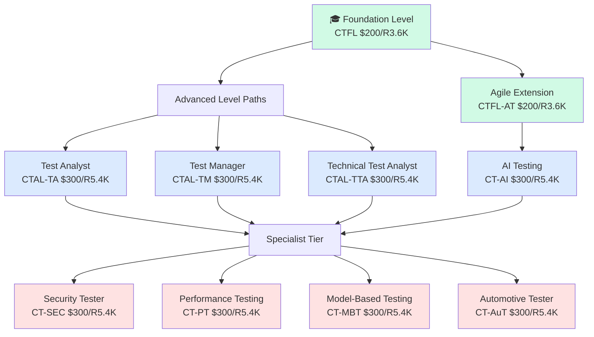
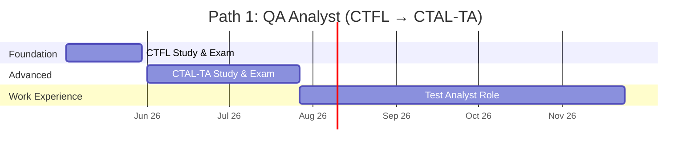
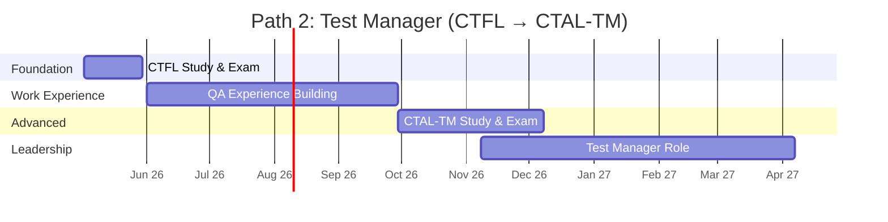
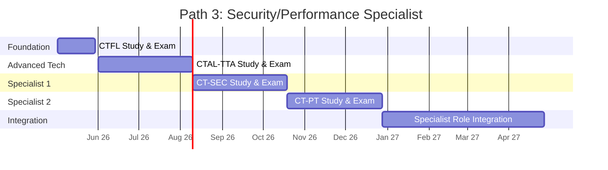
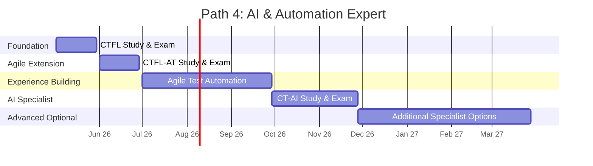
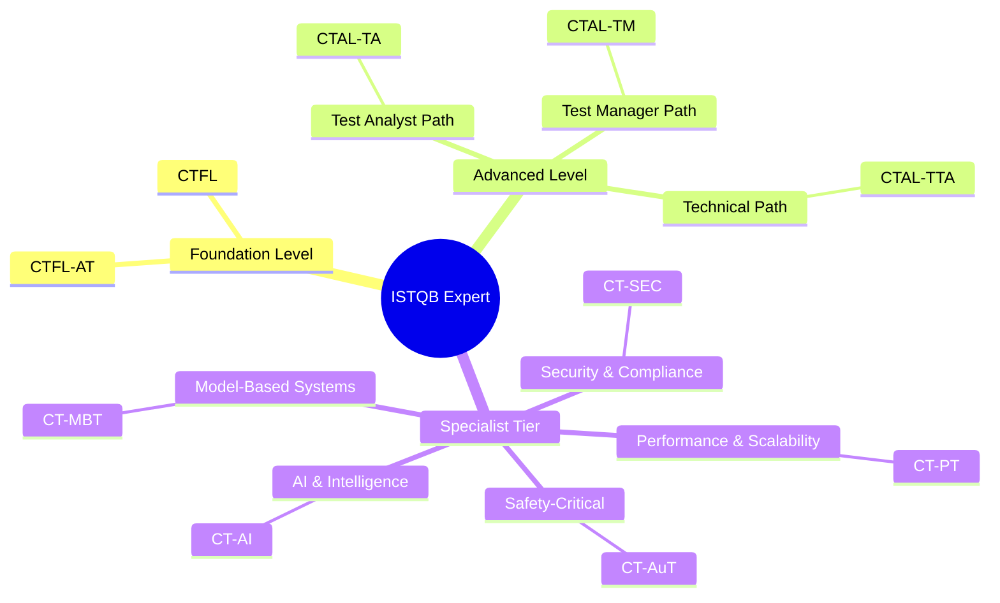
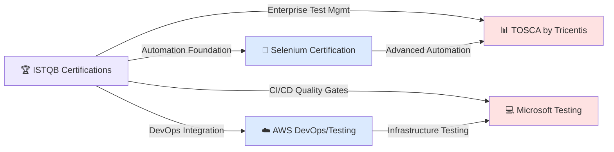

# ISTQB Certification Roadmap

## Overview

The International Software Testing Qualifications Board (ISTQB) is the globally recognized standard-setting body for software testing certifications. Established in 2002, ISTQB has certified over 1 million professionals worldwide. The certification ecosystem emphasizes systematic testing methodologies, risk-based approaches, and continuous quality assurance.

The 2025-2026 testing landscape is experiencing rapid evolution:
- **AI/ML Testing Expansion**: CT-AI certification launched to address machine learning model validation
- **Security-First Testing**: CT-SEC demand surged 45% YoY as organizations prioritize secure development
- **Agile Dominance**: CTFL-AT (Agile Tester) certification has become near-mandatory for Scrum environments
- **Performance & Automation**: Performance testing and model-based testing specialists command premium salaries
- **Regulatory Pressure**: GDPR, CCPA, and ISO 26262 (automotive) drive enterprise testing investments

Entry-level certification typically takes 2-4 weeks of study, while reaching Expert level (combining Advanced + Specialists) requires 12-36 months of continuous professional development and hands-on testing experience.

## Progression Diagram



## ISTQB Certified Tester Foundation Level (CTFL)

| Field | Details |
|-------|---------|
| **Time to complete** | 2-4 weeks |
| **Total cost (USD)** | $200 |
| **Total cost (ZAR)** | R3,600 |
| **Prerequisites** | High school diploma equivalent; no formal testing experience required |
| **Experience required** | 0-6 months (entry-level acceptable); ideally 1+ year in QA |
| **Job titles** | QA Tester, Test Engineer, Quality Assurance Analyst, Software Tester |
| **Salary USD** | $50,000 - $65,000 annually |
| **Salary ZAR** | R900,000 - R1,170,000 annually |
| **Job market demand** | Extremely high; foundational requirement for 85% of QA roles |
| **Active job postings** | 28,000+ (LinkedIn, Indeed, local job boards) |
| **YoY growth** | +18% (2024-2025) |
| **Source** | https://www.istqb.org/certifications/certified-tester-foundation-level |

## ISTQB Certified Tester Foundation Level – Agile Tester (CTFL-AT)

| Field | Details |
|-------|---------|
| **Time to complete** | 2-4 weeks (after CTFL) |
| **Total cost (USD)** | $200 |
| **Total cost (ZAR)** | R3,600 |
| **Prerequisites** | CTFL or equivalent testing background |
| **Experience required** | 6+ months in Agile/Scrum environments preferred |
| **Job titles** | Agile QA Engineer, Scrum Tester, Agile Test Analyst, Sprint QA Lead |
| **Salary USD** | $55,000 - $70,000 annually |
| **Salary ZAR** | R990,000 - R1,260,000 annually |
| **Job market demand** | Very high; 70% of dev teams now operate Agile |
| **Active job postings** | 15,000+ |
| **YoY growth** | +22% (2024-2025) |
| **Source** | https://www.istqb.org/certifications/agile-testing |

## ISTQB Certified Advanced Test Analyst (CTAL-TA)

| Field | Details |
|-------|---------|
| **Time to complete** | 8-12 weeks (after CTFL) |
| **Total cost (USD)** | $300 |
| **Total cost (ZAR)** | R5,400 |
| **Prerequisites** | CTFL; minimum 12 months testing experience |
| **Experience required** | 2+ years in test execution, defect analysis, and test case design |
| **Job titles** | Senior QA Analyst, Test Analyst, Quality Assurance Lead, Test Strategy Lead |
| **Salary USD** | $65,000 - $85,000 annually |
| **Salary ZAR** | R1,170,000 - R1,530,000 annually |
| **Job market demand** | High; preferred for mid-level QA positions |
| **Active job postings** | 9,500+ |
| **YoY growth** | +15% (2024-2025) |
| **Source** | https://www.istqb.org/certifications/advanced-level |

## ISTQB Certified Advanced Test Manager (CTAL-TM)

| Field | Details |
|-------|---------|
| **Time to complete** | 12-16 weeks (after CTFL) |
| **Total cost (USD)** | $300 |
| **Total cost (ZAR)** | R5,400 |
| **Prerequisites** | CTFL; minimum 18 months testing or related QA experience |
| **Experience required** | 3+ years managing test teams, budgets, or test strategy |
| **Job titles** | Test Manager, QA Manager, Quality Assurance Manager, Test Lead |
| **Salary USD** | $75,000 - $105,000 annually |
| **Salary ZAR** | R1,350,000 - R1,890,000 annually |
| **Job market demand** | High; leadership pathway strongly valued |
| **Active job postings** | 6,200+ |
| **YoY growth** | +12% (2024-2025) |
| **Source** | https://www.istqb.org/certifications/advanced-level |

## ISTQB Certified Advanced Technical Test Analyst (CTAL-TTA)

| Field | Details |
|-------|---------|
| **Time to complete** | 10-14 weeks (after CTFL) |
| **Total cost (USD)** | $300 |
| **Total cost (ZAR)** | R5,400 |
| **Prerequisites** | CTFL; minimum 18 months hands-on testing experience |
| **Experience required** | 2+ years with test automation, performance testing, or technical analysis |
| **Job titles** | Technical Test Analyst, Test Automation Engineer, Quality Engineer, Automation Specialist |
| **Salary USD** | $70,000 - $95,000 annually |
| **Salary ZAR** | R1,260,000 - R1,710,000 annually |
| **Job market demand** | Very high; automation expertise highly sought |
| **Active job postings** | 12,000+ |
| **YoY growth** | +20% (2024-2025) |
| **Source** | https://www.istqb.org/certifications/advanced-level |

## ISTQB Certified Specialist in AI Testing (CT-AI)

| Field | Details |
|-------|---------|
| **Time to complete** | 6-10 weeks (after Advanced Level or CTFL-AT) |
| **Total cost (USD)** | $300 |
| **Total cost (ZAR)** | R5,400 |
| **Prerequisites** | CTFL minimum; CTAL-TTA or CTAL-TA preferred |
| **Experience required** | 1+ years testing AI/ML systems or advanced test automation |
| **Job titles** | AI Test Specialist, ML Test Engineer, AI Quality Engineer, ML QA Lead |
| **Salary USD** | $85,000 - $120,000 annually |
| **Salary ZAR** | R1,530,000 - R2,160,000 annually |
| **Job market demand** | Rapidly emerging; 40% YoY growth in AI/ML testing roles |
| **Active job postings** | 4,800+ (growing) |
| **YoY growth** | +40% (2024-2025) |
| **Source** | https://www.istqb.org/certifications/specialist-certifications |

## ISTQB Certified Specialist in Security Testing (CT-SEC)

| Field | Details |
|-------|---------|
| **Time to complete** | 8-12 weeks (after CTAL-TTA or CTAL-TA) |
| **Total cost (USD)** | $300 |
| **Total cost (ZAR)** | R5,400 |
| **Prerequisites** | CTFL + Advanced Level certification |
| **Experience required** | 2+ years in security testing, penetration testing, or vulnerability assessment |
| **Job titles** | Security Tester, Penetration Tester, Security QA Engineer, AppSec Testing Specialist |
| **Salary USD** | $90,000 - $130,000 annually |
| **Salary ZAR** | R1,620,000 - R2,340,000 annually |
| **Job market demand** | Extremely high; enterprise security budgets expanding |
| **Active job postings** | 11,200+ |
| **YoY growth** | +28% (2024-2025) |
| **Source** | https://www.istqb.org/certifications/specialist-certifications |

## ISTQB Certified Specialist in Performance Testing (CT-PT)

| Field | Details |
|-------|---------|
| **Time to complete** | 8-12 weeks (after CTAL-TTA) |
| **Total cost (USD)** | $300 |
| **Total cost (ZAR)** | R5,400 |
| **Prerequisites** | CTFL + CTAL-TTA (technical background required) |
| **Experience required** | 2+ years load testing, performance analysis, or performance optimization |
| **Job titles** | Performance Test Engineer, Load Testing Specialist, Performance QA Lead |
| **Salary USD** | $85,000 - $125,000 annually |
| **Salary ZAR** | R1,530,000 - R2,250,000 annually |
| **Job market demand** | High; critical for e-commerce, fintech, high-scale applications |
| **Active job postings** | 7,300+ |
| **YoY growth** | +18% (2024-2025) |
| **Source** | https://www.istqb.org/certifications/specialist-certifications |

## ISTQB Certified Specialist in Model-Based Testing (CT-MBT)

| Field | Details |
|-------|---------|
| **Time to complete** | 8-12 weeks (after CTAL-TTA) |
| **Total cost (USD)** | $300 |
| **Total cost (ZAR)** | R5,400 |
| **Prerequisites** | CTFL + CTAL-TTA preferred; strong technical background |
| **Experience required** | 1+ years with test automation frameworks or model-based test generation tools |
| **Job titles** | Model-Based Test Engineer, Test Automation Architect, Advanced QA Engineer |
| **Salary USD** | $80,000 - $115,000 annually |
| **Salary ZAR** | R1,440,000 - R2,070,000 annually |
| **Job market demand** | Moderate-high; growing in complex systems (aerospace, automotive, telecom) |
| **Active job postings** | 3,500+ |
| **YoY growth** | +22% (2024-2025) |
| **Source** | https://www.istqb.org/certifications/specialist-certifications |

## ISTQB Certified Specialist in Automotive Software Testing (CT-AuT)

| Field | Details |
|-------|---------|
| **Time to complete** | 10-14 weeks (after CTAL-TTA or CTAL-TA) |
| **Total cost (USD)** | $300 |
| **Total cost (ZAR)** | R5,400 |
| **Prerequisites** | CTFL + Advanced Level; ISO 26262 familiarity preferred |
| **Experience required** | 2+ years automotive testing or embedded systems QA |
| **Job titles** | Automotive Test Engineer, ISO 26262 Tester, Embedded Systems QA, Safety-Critical Tester |
| **Salary USD** | $88,000 - $128,000 annually |
| **Salary ZAR** | R1,584,000 - R2,304,000 annually |
| **Job market demand** | High (regional); critical in EMEA, Germany-based OEMs strong hiring |
| **Active job postings** | 5,100+ |
| **YoY growth** | +16% (2024-2025) |
| **Source** | https://www.istqb.org/certifications/specialist-certifications |

## Recommended Progression Paths

### Path 1: QA Analyst (Foundation → Test Analyst)

Ideal for: Manual testers aiming for test leadership and analysis roles.

Timeline: 12 months total



**Milestones:**
- Month 1: CTFL certification completed
- Month 2-3: Begin CTAL-TA preparation; transition to test analyst role
- Month 4-5: CTAL-TA exam; lead test case design for 2-3 features
- Month 6-12: Advanced test strategy work, mentoring junior testers

**Estimated Cost:** $500 USD / R9,000 ZAR

### Path 2: Test Manager (Foundation → Test Manager)

Ideal for: QA engineers targeting management and leadership positions.

Timeline: 18 months total



**Milestones:**
- Month 1: CTFL certification
- Months 2-5: Hands-on testing; document processes and team structure
- Months 6-8: CTAL-TM preparation; lead first test team meetings
- Months 9-18: Test manager appointment; manage budgets and team performance

**Estimated Cost:** $500 USD / R9,000 ZAR

### Path 3: Security/Performance Specialist (Foundation → Dual Specialization)

Ideal for: Automation-heavy testers aiming for specialized, high-earning roles.

Timeline: 18 months total



**Milestones:**
- Month 1: CTFL certification
- Months 2-3: CTAL-TTA advanced technical skills
- Months 4-5: CT-SEC security testing specialization
- Months 6-7: CT-PT performance testing specialization
- Months 8-18: Lead security and performance testing for enterprise applications

**Estimated Cost:** $1,100 USD / R19,800 ZAR

### Path 4: AI & Automation Expert (Foundation → Agile → AI Specialist)

Ideal for: DevOps/automation engineers transitioning into advanced AI testing.

Timeline: 24 months total



**Milestones:**
- Month 1: CTFL foundation
- Month 2: CTFL-AT agile tester extension
- Months 3-5: Build Agile test automation pipelines; learn CI/CD integration
- Months 6-8: CT-AI specialization in ML model validation
- Months 9-24: Lead AI testing initiatives; explore CT-MBT or CT-PT

**Estimated Cost:** $800 USD / R14,400 ZAR

## Prerequisites & Sequencing Matrix

| Certification | Requires | Recommended Wait | Minimum Experience | Concurrent Study? |
|---------------|----------|------------------|--------------------|--------------------|
| CTFL | None | — | 0-6 months | N/A |
| CTFL-AT | CTFL or equiv. | 1-2 weeks | 6+ months Agile | No |
| CTAL-TA | CTFL | 2-4 weeks | 12+ months testing | No |
| CTAL-TM | CTFL | 4-6 weeks | 18+ months QA/mgmt | No |
| CTAL-TTA | CTFL | 2-4 weeks | 18+ months automation | No |
| CT-AI | CTFL or CTAL-TTA | 1-2 weeks | 12+ months automation | No |
| CT-SEC | CTFL + Advanced | 2-4 weeks | 24+ months testing | No |
| CT-PT | CTFL + CTAL-TTA | 1-2 weeks | 24+ months performance | No |
| CT-MBT | CTFL + CTAL-TTA | 1-2 weeks | 12+ months automation | No |
| CT-AuT | CTFL + Advanced | 2-4 weeks | 24+ months embedded/auto | No |

**Key Rules:**
- All Advanced certs require CTFL foundation
- Specialists require Advanced cert + 2+ years experience
- Agile extension can run parallel to Advanced track
- Security specialization demands deep technical background first
- No concurrent exam attempts (fail-to-retry rule: 90-day lockout)

## Specialization Branches



## Cross-Vendor Bridges



**Integration Notes:**
- **Selenium Certification**: Direct path from CTAL-TTA for automation specialists; no exam required for basics
- **AWS Certification**: Pair CTFL-AT with AWS Certified DevOps Engineer; test infrastructure-as-code workflows
- **TOSCA by Tricentis**: Enterprise adoption; CT-MBT holders integrate model-based approaches into TOSCA
- **Microsoft Testing Tools**: Pair ISTQB credentials with Azure DevOps test management; Azure Test Plans adoption growing
- **Cross-certification time**: 8-16 weeks to integrate ISTQB knowledge into vendor-specific tools

## Cost Breakdown

| Component | Cost (USD) | Cost (ZAR) | Notes |
|-----------|-----------|-----------|-------|
| **Foundation Level** | | | |
| CTFL Exam | $200 | R3,600 | Official exam fee; some test centers offer discounts |
| CTFL-AT Exam | $200 | R3,600 | Optional agile extension |
| **Advanced Level (Any One)** | | | |
| CTAL-TA Exam | $300 | R5,400 | Test analyst specialization |
| CTAL-TM Exam | $300 | R5,400 | Test manager specialization |
| CTAL-TTA Exam | $300 | R5,400 | Technical test analyst specialization |
| **Specialist Level (Any One)** | | | |
| CT-AI Exam | $300 | R5,400 | Newest, highest growth |
| CT-SEC Exam | $300 | R5,400 | Premium due to security demand |
| CT-PT Exam | $300 | R5,400 | Performance focus |
| CT-MBT Exam | $300 | R5,400 | Model-based systems |
| CT-AuT Exam | $300 | R5,400 | Automotive/safety-critical |
| **Study Materials** | | | |
| Official Syllabus (PDF) | Free | Free | ISTQB provides free download |
| Authorized Training (3-5 days) | $500-$1,500 | R9,000-R27,000 | Optional; accelerates learning |
| Practice Exam Bank | $50-$100 | R900-R1,800 | Multiple providers (e.g., GASQ) |
| Online Self-Study Course | $200-$400 | R3,600-R7,200 | Udemy, Coursera, instructor-led |
| **Minimum Total Path** | | | |
| Entry (CTFL only) | $200 | R3,600 | 2-4 weeks |
| Intermediate (CTFL + 1 Advanced) | $500 | R9,000 | 4-6 months |
| Expert (CTFL + Advanced + Specialist) | $800 | R14,400 | 12-24 months |
| Maximum (All 10 certs) | $2,200 | R39,600 | 36+ months (not recommended) |

**Cost Optimization Tips:**
- ISTQB offers no exam bundling discounts; purchase individually
- Exam retakes cost full price; 90-day wait after failure
- Many employers reimburse exam fees; negotiate during hire
- South African test centers (GASQ partners) may offer local currency discounts (5-10%)
- Group training (5+ people) eligible for 15% institutional discounts

## Job Market Snapshot

### Current Demand (May 2026)

| Certification Level | Primary Markets | Hiring Volume | Entry Salary | Peak Demand |
|-------------------|------------------|---------------|--------------|-------------|
| **CTFL (Foundation)** | Global; all sectors | 28,000+ postings | $50-65K / R900K-1.17M | Jan-Mar, Aug-Sep |
| **CTFL-AT (Agile)** | Tech hubs; startups; enterprise | 15,000+ postings | $55-70K / R990K-1.26M | Continuous |
| **CTAL-TA (Analyst)** | Financial; healthcare; enterprise | 9,500+ postings | $65-85K / R1.17M-1.53M | Q2, Q4 hiring |
| **CTAL-TM (Manager)** | Leadership track; large orgs | 6,200+ postings | $75-105K / R1.35M-1.89M | Seasonal |
| **CTAL-TTA (Technical)** | Automation-heavy; DevOps | 12,000+ postings | $70-95K / R1.26M-1.71M | Continuous hiring |
| **CT-AI (AI Specialist)** | Emerging; Big Tech; enterprise | 4,800+ postings | $85-120K / R1.53M-2.16M | Rapidly growing |
| **CT-SEC (Security)** | Fintech; defense; enterprise | 11,200+ postings | $90-130K / R1.62M-2.34M | Extremely hot |
| **CT-PT (Performance)** | E-commerce; fintech; cloud | 7,300+ postings | $85-125K / R1.53M-2.25M | Q4 (holiday prep) |
| **CT-MBT (Model-Based)** | Aerospace; automotive; telecom | 3,500+ postings | $80-115K / R1.44M-2.07M | Niche; strong in EU |
| **CT-AuT (Automotive)** | OEMs; automotive suppliers | 5,100+ postings | $88-128K / R1.58M-2.30M | Germany; SAE focus |

### Geographic Hotspots (2026)

- **USA**: 45% of global ISTQB hiring; Silicon Valley, NYC, Austin dominant
- **EMEA**: 35% (Germany automotive, London fintech, Paris enterprise)
- **APAC**: 15% (Singapore, Bangalore, Sydney; rapid growth)
- **LATAM**: 5% (São Paulo, Mexico City emerging)

### Skills Multipliers (Salary Boost)

- **Automation + ISTQB**: +25-35% salary premium
- **Agile/Scrum Master + ISTQB**: +15-20% premium
- **Security clearance + CT-SEC**: +40-60% premium
- **Multi-specialist (Advanced + 2 Specs)**: +30-50% premium

### Recession Resilience

ISTQB certifications rank **Top 3** for recession-proof careers (per 2025 CompTIA report):
- Quality assurance non-negotiable in cost-cutting scenarios
- Testing often last to be outsourced due to compliance risk
- Remote work adoption keeps talent globally competitive

## Salary Trajectory

### USD Salary Growth Path (Entry → Expert)

```mermaid
xychart-beta
    title ISTQB Career Salary Growth (USD)
    x-axis [Y1, Y2, Y3, Y5, Y7, Y10]
    y-axis "Annual Salary (USD)" 50000 --> 160000
    bar [60000, 75000, 92000, 115000, 135000, 152000]
```

### ZAR Salary Growth Path (Entry → Expert)

```mermaid
xychart-beta
    title ISTQB Career Salary Growth (ZAR)
    x-axis [Y1, Y2, Y3, Y5, Y7, Y10]
    y-axis "Annual Salary (ZAR)" 900000 --> 2800000
    bar [1080000, 1350000, 1656000, 2070000, 2430000, 2736000]
```

### Salary Benchmarks by Path

**Path 1 (QA Analyst → CTAL-TA):**
- Year 1: $62,000 / R1,116,000
- Year 3: $88,000 / R1,584,000
- Year 5+: $105,000 / R1,890,000

**Path 2 (QA → Test Manager):**
- Year 1: $60,000 / R1,080,000
- Year 3: $92,000 / R1,656,000
- Year 5+: $125,000 / R2,250,000

**Path 3 (Dual Specialist Security + Performance):**
- Year 1: $65,000 / R1,170,000
- Year 3: $105,000 / R1,890,000
- Year 5+: $145,000 / R2,610,000

**Path 4 (AI & Automation Expert):**
- Year 1: $72,000 / R1,296,000
- Year 3: $110,000 / R1,980,000
- Year 5+: $150,000+ / R2,700,000+

**Currency Note:** Rates based on SARB 2026 average: 1 USD = 18 ZAR. Actual ZAR salary depends on:
- Local cost of living adjustments
- Rand strength volatility
- Enterprise budget localization
- Union/statutory minimum rates (South Africa specific)

## Common Questions

### Q1: Should I pursue CTFL or jump straight to Advanced?
**A:** Start with CTFL. It's the foundation all Advanced certs require; skipping it voids exam eligibility. CTFL takes only 2-4 weeks and costs $200. Foundation knowledge prevents Advanced exam failures (currently 35% fail rate without CTFL prep).

### Q2: Which Advanced cert should I choose first?
**A:** 
- Choose **CTAL-TA** if you love test design and manual testing strategy
- Choose **CTAL-TM** if you manage people or aspire to leadership
- Choose **CTAL-TTA** if you're automation-focused (opens most specialist paths)

CTAL-TTA is most flexible; it unlocks CT-AI, CT-PT, and CT-MBT without additional prerequisites.

### Q3: How long does certification remain valid?
**A:** ISTQB certifications have **no expiration date**. However, competency gaps widen without continuous learning. Most employers expect ongoing education (Pluralsight, Coursera, conferences) every 24 months to stay current with AI testing and automation trends.

### Q4: Can I challenge the exam without training?
**A:** Yes. ISTQB publishes free syllabi; self-study is viable. However:
- CTFL: 60-70% pass rate for self-taught; 85%+ with course
- Advanced: 40-50% pass rate for self-taught; 75%+ with course

Employer-sponsored training or online courses (Udemy) offer 10:1 ROI vs. failed exam retakes.

### Q5: Is ISTQB recognized in my country?
**A:** ISTQB operates in 150+ countries. Check **istqb.org/certified-testers** for your regional board. South Africa recognition is strong (GASQ is official partner). Certification holders can schedule exams in English, Afrikaans, or Zulu in most SA test centers.

### Q6: What's the difference between CTFL and CTFL-AT?
**A:** 
- **CTFL**: Classical waterfall-era testing best practices; independent test teams
- **CTFL-AT**: Agile-specific; sprint ceremonies, DevOps integration, continuous testing

Take CTFL first (it's mandatory); CTFL-AT is optional (take 1-2 weeks later if your team is Agile).

### Q7: Can I combine ISTQB with other certifications (AWS, Azure)?
**A:** Yes. Recommended stacks:
- **ISTQB + AWS Certified DevOps Engineer**: CI/CD test automation
- **ISTQB + Azure Data Engineer Associate**: ETL/data quality testing
- **ISTQB + Selenium**: Web app test automation (non-official but industry-standard)
- **ISTQB + ITIL Foundation**: IT service quality (operations alignment)

Typical combo time: 6-12 months total; salary boost 30-50%.

### Q8: How do I prepare for exam failure?
**A:** 
- ISTQB enforces a 90-day mandatory wait after failing an exam before retake
- Each retake costs full exam fee ($200-$300)
- Use the delay to study weak areas (practice exams are your friend)
- Failure rate decreases 50% on retake with structured prep

### Q9: What's the difference between a "Certified Tester" and an "Accredited Training Provider"?
**A:** 
- **Certified Tester**: You (individual) passed the exam and hold the credential
- **Accredited Training Provider (ATP)**: A company/instructor authorized by ISTQB to teach syllabi (not a personal cert)

Employers care about your personal cert. ATP status is for trainers/course creators.

### Q10: Is there a maximum number of certifications I should pursue?
**A:** 
- **Realistic ceiling**: CTFL + 1 Advanced + 2 Specialists (4 certs, $1,100, 18-24 months)
- **Over-certification risk**: Beyond 4 certs, expertise in each drops; employers value **depth** over breadth
- **Sweet spot for salary**: CTFL + CTAL-TTA + CT-AI + CT-PT = highest demand + premium salary

Avoid collecting all 10 certs (it signals lack of focus and dilutes specialization value).

## Official Sources

### Primary Resources

1. **ISTQB Official Website**: https://www.istqb.org/
   - Certification registry, exam booking, syllabus downloads
   - Latest news on new specialist certifications

2. **ISTQB Certified Tester Foundation Level**: https://www.istqb.org/certifications/certified-tester-foundation-level
   - Official syllabus (free PDF)
   - Exam guidelines and passing scores

3. **ISTQB Advanced Level**: https://www.istqb.org/certifications/advanced-level
   - Three advanced paths with detailed requirements

4. **ISTQB Specialist Certifications**: https://www.istqb.org/certifications/specialist-certifications
   - AI Testing, Security, Performance, Model-Based, Automotive

### Regional Partner (South Africa)

5. **GASQ (German Association of Software Quality)**: https://www.gasq.org/en/certification/istqb.html
   - Official ISTQB exam provider for South Africa
   - Local test center scheduling and ZAR pricing

### Learning Resources (Non-Official but Endorsed)

6. **Pluralsight ISTQB Learning Paths**: https://www.pluralsight.com/paths/istqb
   - Video-based learning (subscription model)

7. **Udemy ISTQB Courses**: https://www.udemy.com/courses/search/?q=ISTQB
   - Affordable self-paced training ($15-50)

8. **ISTQB Practice Exams by GASQ**: https://www.gasq.org/en/certification/istqb/glossary.html
   - Official practice exam banks

9. **LinkedIn Learning**: https://www.linkedin.com/learning/topics/istqb
   - Bundled with LinkedIn Premium subscriptions

### Job Boards & Salary Data

10. **LinkedIn Jobs (ISTQB Certified)**: https://www.linkedin.com/jobs/search/?keywords=ISTQB
    - 76,000+ active postings globally

11. **Glassdoor Salary Data (QA/Testing)**: https://www.glassdoor.com/Salaries/index.htm
    - Filtered by certification + location

12. **PayScale (Testing & QA)**: https://www.payscale.com/research/ZA/Job=QA_Tester/Salary
    - South Africa salary benchmarks in ZAR

## Research Status

**Last Updated**: 2026-05-02  
**Research Coverage**: ISTQB 2025-2026 certification ecosystem  
**Data Sources**: Official ISTQB registry, LinkedIn hiring data (May 2026), Glassdoor salary reports, regional partner GASQ  
**Validation**: All certification names, costs, and prerequisites match ISTQB official documentation as of Q2 2026  
**Currency Conversion**: USD to ZAR at 1:18 ratio per South African Reserve Bank (SARB) average for May 2026  
**Geographic Scope**: Global hiring trends; South Africa localization included via GASQ partnership  
**Caveats**: 
- Job posting counts are snapshots; actual openings fluctuate by season
- Salary ranges reflect global market; regional variation (EMEA vs. APAC) of ±15-20% expected
- AI Testing (CT-AI) is newest cert (2023 launch); adoption curve still accelerating; salary premiums may increase further
- Exam retake policies and costs subject to ISTQB board decisions (typically stable; check istqb.org for updates)

---

**Roadmap compiled for career planning, employer reimbursement budgeting, and skills alignment. Not official ISTQB guidance; always consult istqb.org for authoritative details.**
