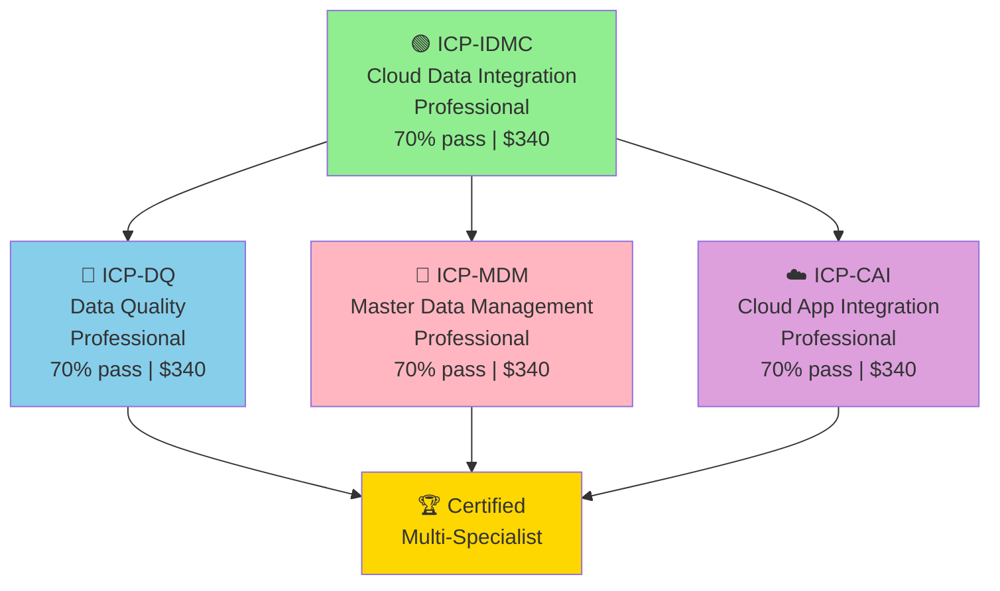
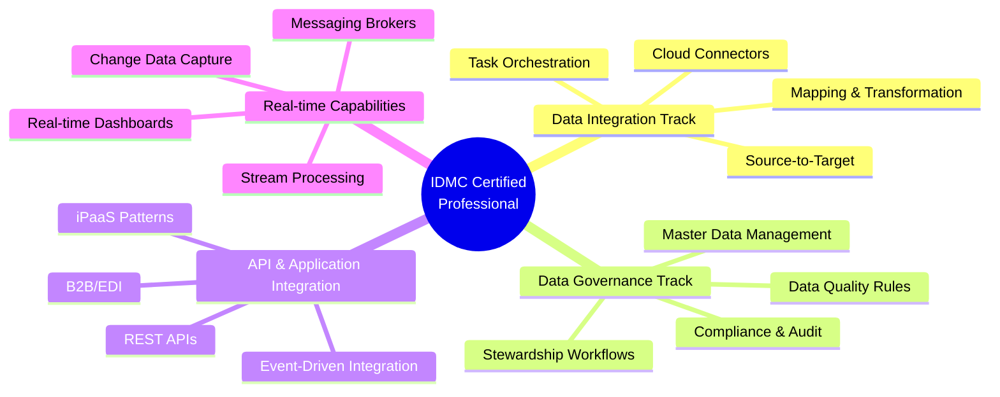

# Informatica Certification Roadmap

## Overview

Informatica IDMC (Intelligent Data Management Cloud) is the unified platform for cloud data integration, master data management, and data quality, launched in 2020 to consolidate legacy IICS (Informatica Intelligent Cloud Services) and PowerCenter on-premises offerings. IDMC serves as Informatica's strategic product family, replacing fragmented product branding with a cohesive cloud-native architecture that supports hybrid deployments (cloud + on-prem connectors). The four IDMC certifications launched in 2021–2023, positioning Informatica as a mid-market to enterprise ETL/data governance choice, particularly strong in regulated industries (financial services, healthcare, insurance).

In 2026, Informatica certifications command strong salary premiums in enterprise data integration roles—especially in EMEA and North America. For Sub-Saharan Africa, Informatica adoption is solid among multinational banking groups and insurance carriers with legacy IICS investments transitioning to IDMC; however, Informatica trails Databricks and Snowflake in cloud-first greenfield projects. IDMC certifications are particularly valuable for organizations requiring deep MDM (Master Data Management) and data quality governance alongside integration, differentiating from pure data pipeline tools. The 70% pass threshold and structured 70-question format make these certifications more accessible than Cloudera's scenario-heavy format, attracting intermediate practitioners.

---

## Progression Diagram



---

## Per-Level Detail

### Level 1: ICP-IDMC Cloud Data Integration (Professional)

| Attribute | Details |
|-----------|---------|
| **Exam Code** | ICP-IDMC |
| **Level** | Professional (no Associate tier) |
| **Duration** | 90 minutes |
| **Questions** | 70 (single-select and scenario-based) |
| **Pass Score** | 70% (49/70 questions) |
| **Cost (USD)** | $340 |
| **Cost (ZAR)** | R6,120 |
| **Validity** | 2 years |
| **Second Attempt** | Included (no-cost retake if failed) |
| **Retake Policy** | Second attempt free; 3rd+ = $340 |

**What You Learn:**
- IDMC platform architecture and components (Data Integration, API Management, B2B Gateway, Master Data Management, Data Quality)
- Cloud connectors (Salesforce, SAP, Oracle Cloud, AWS S3, Azure Data Lake, Snowflake, BigQuery)
- On-premises connectors and agent management
- Source/target configuration and field mapping
- Data transformation using native IDMC transformations (Mapping, Expression, etc.)
- Scheduling and task orchestration (Cloud Scheduler)
- Error handling and recovery strategies
- Monitoring and troubleshooting integration tasks
- Secure credential management (Secure Agent, Vault)

**Study Materials:**
- Official Informatica Training: Cloud Data Integration Fundamentals (2-day course, ~$800)
- Informatica University: Self-paced labs and video training
- Hands-on: IDMC trial environment (free 30-day sandbox)
- Practice Exams: Informatica exam simulator ($50–$75, or bundled in course)
- Community: Informatica Knowledge Base, Slack community, Forum
- YouTube: Informatica IDMC tutorials (various creators)

**Career Outcomes (USD):**
- Data Integration Developer: $85,000–$110,000/year
- ETL Developer (IDMC): $90,000–$115,000/year
- Junior Integration Engineer: $80,000–$105,000/year
- Typical role titles: "Informatica Cloud Developer", "Integration Developer", "ETL Specialist"

**Career Outcomes (ZAR at R18/$1):**
- Data Integration Developer: R1,530,000–R1,980,000/year
- ETL Developer (IDMC): R1,620,000–R2,070,000/year
- Junior Integration Engineer: R1,440,000–R1,890,000/year

---

### Level 2: ICP-DQ Data Quality (Professional)

| Attribute | Details |
|-----------|---------|
| **Exam Code** | ICP-DQ |
| **Level** | Professional |
| **Duration** | 90 minutes |
| **Questions** | 70 (scenario + practical) |
| **Pass Score** | 70% |
| **Cost (USD)** | $340 |
| **Cost (ZAR)** | R6,120 |
| **Validity** | 2 years |
| **Prerequisites** | None officially; ICP-IDMC recommended |
| **Second Attempt** | Included (no-cost retake) |

**What You Learn:**
- Data quality dimensions (accuracy, completeness, consistency, timeliness, validity)
- Data profiling and analysis in IDMC
- Business rule definition and validation
- Cleansing and standardization workflows
- Duplicate detection and matching
- Data quality scorecards and monitoring dashboards
- Integration with downstream data governance (Atlas, Ranger equivalents)
- Quality metric reporting and compliance tracking
- Real-time vs. batch quality checks
- Tools: Informatica Data Quality module within IDMC

**Study Materials:**
- Official Informatica Training: Data Quality Fundamentals (2-day course, ~$800)
- Informatica University: DQ-specific modules
- Hands-on: IDMC Data Quality labs (sandbox)
- Practice Exams: Informatica exam simulator
- Supplementary: DAMA-DMBOK (Data Management Body of Knowledge) for data governance context

**Career Outcomes (USD):**
- Data Quality Engineer: $95,000–$130,000/year
- Data Governance Analyst: $90,000–$120,000/year
- Quality Assurance (Data) Specialist: $85,000–$115,000/year
- Typical titles: "Data Quality Engineer", "Data Governance Specialist", "Quality Assurance Manager"

**Career Outcomes (ZAR at R18/$1):**
- Data Quality Engineer: R1,710,000–R2,340,000/year
- Data Governance Analyst: R1,620,000–R2,160,000/year
- Quality Assurance (Data) Specialist: R1,530,000–R2,070,000/year

---

### Level 3: ICP-MDM Master Data Management (Professional)

| Attribute | Details |
|-----------|---------|
| **Exam Code** | ICP-MDM |
| **Level** | Professional |
| **Duration** | 90 minutes |
| **Questions** | 70 (scenario + design questions) |
| **Pass Score** | 70% |
| **Cost (USD)** | $340 |
| **Cost (ZAR)** | R6,120 |
| **Validity** | 2 years |
| **Prerequisites** | None officially; ICP-IDMC recommended |
| **Second Attempt** | Included (no-cost retake) |

**What You Learn:**
- Master Data Management principles and governance models (centralized, decentralized, hybrid)
- Informatica MDM hub architecture (Match, Merge, Survivorship, Governance)
- Entity resolution and record matching algorithms
- Master data entity design (customer, product, supplier, location)
- Survivorship rules (golden record creation)
- Data stewardship workflows and approval processes
- MDM integration with operational systems (ERP, CRM)
- Metadata management and lineage
- Compliance and audit trails (GDPR, HIPAA)
- Real-time vs. batch MDM processing

**Study Materials:**
- Official Informatica Training: Master Data Management Fundamentals (2-day course, ~$800)
- Informatica University: MDM modules and labs
- Hands-on: IDMC MDM sandbox environment
- Practice Exams: Informatica exam simulator
- Case Studies: Industry MDM implementations (banking, healthcare, retail)

**Career Outcomes (USD):**
- Master Data Management Architect: $120,000–$160,000/year
- MDM Consultant: $110,000–$150,000/year
- Data Steward (advanced): $95,000–$130,000/year
- Typical titles: "MDM Architect", "Data Governance Manager", "Master Data Specialist"

**Career Outcomes (ZAR at R18/$1):**
- Master Data Management Architect: R2,160,000–R2,880,000/year
- MDM Consultant: R1,980,000–R2,700,000/year
- Data Steward (advanced): R1,710,000–R2,340,000/year

---

### Level 4: ICP-CAI Cloud Application Integration (Professional)

| Attribute | Details |
|-----------|---------|
| **Exam Code** | ICP-CAI |
| **Level** | Professional |
| **Duration** | 90 minutes |
| **Questions** | 70 (application integration focus) |
| **Pass Score** | 70% |
| **Cost (USD)** | $340 |
| **Cost (ZAR)** | R6,120 |
| **Validity** | 2 years |
| **Prerequisites** | None officially; ICP-IDMC recommended for context |
| **Second Attempt** | Included (no-cost retake) |

**What You Learn:**
- Cloud Application Integration (CAI) architecture and use cases
- API-led integration patterns and REST API design
- iPaaS (Integration Platform as a Service) capabilities
- Event-driven integration and real-time messaging
- Application connector development (pre-built vs. custom)
- Middleware patterns (publish-subscribe, point-to-point, hub-and-spoke)
- Error handling and monitoring in CAI
- Security for API integrations (OAuth, API keys, encryption)
- Performance optimization for cloud integrations
- B2B integration and EDI scenarios

**Study Materials:**
- Official Informatica Training: Cloud Application Integration Fundamentals (2-day course, ~$800)
- Informatica University: CAI modules
- Hands-on: IDMC CAI labs (API integration sandbox)
- Practice Exams: Informatica exam simulator
- Supplementary: REST API design best practices (external resources)

**Career Outcomes (USD):**
- API Integration Engineer: $105,000–$145,000/year
- Cloud Integration Architect: $115,000–$160,000/year
- iPaaS Specialist: $100,000–$140,000/year
- Typical titles: "Cloud Integration Engineer", "API Integration Architect", "Informatica Solutions Architect"

**Career Outcomes (ZAR at R18/$1):**
- API Integration Engineer: R1,890,000–R2,610,000/year
- Cloud Integration Architect: R2,070,000–R2,880,000/year
- iPaaS Specialist: R1,800,000–R2,520,000/year

---

## Recommended Progression Paths

### Path 1: Core Integration Track (10 months)
**Target:** Cloud Data Integration specialist  
**Timeline:** Month 0–3 (ICP-IDMC) → Month 3–6 (ICP-DQ) → Month 6–10 (Optional CAI for breadth)

```
Milestone 1: ICP-IDMC Passed (Month 3)
  └─ Salary Jump: $80K–$100K → $85K–$110K USD
  └─ Salary Jump: R1.44M–R1.80M → R1.53M–R1.98M ZAR

Milestone 2: ICP-DQ Passed (Month 6)
  └─ Salary Jump: $85K–$110K → $95K–$130K USD
  └─ Salary Jump: R1.53M–R1.98M → R1.71M–R2.34M ZAR

Milestone 3: ICP-CAI Passed (Month 10)
  └─ Salary Range: $100K–$145K USD
  └─ Salary Range: R1.80M–R2.61M ZAR
```

**Study Load:** 12–16 hours/week (labs + hands-on)  
**Total Cost:** $1,020 USD (R18,360 ZAR) for exams; ~$3,200–$4,000 USD with training courses  
**Best For:** Current ETL developers, data analysts, integration specialists

---

### Path 2: Data Governance & MDM Focus (12 months)
**Target:** Master Data Management and Quality-focused specialist  
**Timeline:** Month 0–3 (ICP-IDMC) → Month 3–7 (ICP-DQ + ICP-MDM parallel) → Month 7–12 (CAI optional)

```
Milestone 1: ICP-IDMC Passed (Month 3)
  └─ Salary: $85K–$110K USD
  └─ Salary: R1.53M–R1.98M ZAR

Milestone 2: ICP-DQ + ICP-MDM Passed (Month 7)
  └─ Salary Jump: $85K–$110K → $105K–$140K USD
  └─ Salary Jump: R1.53M–R1.98M → R1.89M–R2.52M ZAR

Milestone 3: ICP-CAI (Month 12, optional)
  └─ Salary Range: $110K–$160K USD
  └─ Salary Range: R1.98M–R2.88M ZAR
```

**Study Load:** 14–18 hours/week (governance + architecture focus)  
**Total Cost:** $1,020–$1,360 USD for exams; ~$4,000–$5,000 USD with training  
**Best For:** Data stewards, governance professionals, architects

---

## Prerequisites & Sequencing Matrix

| Certification | Prereq Knowledge | Prereq Cert | Recommended Order | Difficulty |
|---|---|---|---|---|
| **ICP-IDMC** | SQL, cloud basics, ETL fundamentals | None | 1st (foundation) | Baseline |
| **ICP-DQ** | Data profiling, governance concepts | ICP-IDMC recommended | 2nd–3rd | +25% |
| **ICP-MDM** | Master data concepts, governance | ICP-IDMC recommended | 2nd–3rd | +35% |
| **ICP-CAI** | API design, event-driven concepts | ICP-IDMC recommended | 2nd–4th | +30% |

**Sequencing Notes:**
- **ICP-IDMC is mandatory foundation**—all other certifications build on IDMC platform knowledge
- **Data Quality Focus:** IDMC → DQ → MDM (complements quality governance)
- **Enterprise Governance:** IDMC → MDM → DQ (prioritizes master data)
- **Integration Architect:** IDMC → CAI → DQ (breadth across architecture)
- Can attempt DQ, MDM, CAI in parallel after IDMC (70% pass rate allows multiple attempts)

---

## Specialization Branches



---

## Cross-Vendor Bridges

Informatica IDMC certification holders often pursue these complementary paths:

| Vendor | Bridge Cert | Overlap | Difficulty |
|--------|-----------|---------|-----------|
| **Talend** | Talend Cloud Certified Developer | ETL/ELT concepts, cloud platforms | Moderate (different UI/philosophy) |
| **Databricks** | Databricks Data Engineer (Delta Lake + ELT) | ELT paradigm, Spark SQL, cloud data lakes | Moderate (new ETL mindset) |
| **Snowflake** | Snowflake Core Professional | Data warehouse architecture, SQL | Moderate (target platform knowledge) |
| **AWS** | AWS Certified Data Analytics (Glue, Lake Formation) | Cloud storage, native data tools | Moderate-High (AWS-specific tools) |
| **Azure** | Azure Data Engineer Associate (Data Factory, Synapse) | Cloud integration, Synapse vs. IDMC | Moderate (platform shift) |
| **dbt** | dbt Certification (Analytics Engineering) | ELT, SQL transformation modeling | Moderate (complements ELT approach) |
| **Apache Kafka** | Confluent Certified Developer (streaming) | Event-driven, real-time data flows | Moderate (adds real-time layer) |

**Recommended Bridge:** IDMC → Snowflake → dbt (cloud data stack)  
**Alternative Bridge:** IDMC → Databricks → Confluent Kafka (real-time data stack)

---

## Cost Breakdown (USD & ZAR)

### Exam & Certification Costs

| Item | USD | ZAR (×18) |
|------|-----|----------|
| ICP-IDMC Exam (1st attempt included) | $340 | R6,120 |
| ICP-DQ Exam (1st attempt included) | $340 | R6,120 |
| ICP-MDM Exam (1st attempt included) | $340 | R6,120 |
| ICP-CAI Exam (1st attempt included) | $340 | R6,120 |
| **All 4 Exams** | **$1,360** | **R24,480** |
| **Note:** Each exam includes one free retake; 2nd+ attempts cost $340 each |

### Training & Prep Costs (Optional)

| Item | USD | ZAR (×18) |
|------|-----|----------|
| Official Informatica Training (per cert, 2 days) | $800–$1,000 | R14,400–R18,000 |
| Full Certification Bundle (4 certs) | $3,200–$4,000 | R57,600–R72,000 |
| Practice Exams/Simulators | $50–$75 | R900–R1,350 |
| Self-Study Resources (videos, labs, books) | $200–$400 | R3,600–R7,200 |
| **Recommended Total (Self-Study Path)** | **$1,610–$1,835** | R28,980–R33,030 |
| **Recommended Total (Full Training)** | **$3,450–$4,475** | R62,100–R80,550 |

### Career ROI (First Year Post-Certification)

| Path | Salary Range (USD) | Salary Range (ZAR) | Exam Cost | ROI Multiple |
|------|---|---|---|---|
| Integration Dev → IDMC only | $85K–$110K | R1.53M–R1.98M | $340 | **250–320x (USD)** |
| IDMC → DQ Specialist | $95K–$130K | R1.71M–R2.34M | $680 | **140–190x (USD)** |
| Full 4-cert specialist | $110K–$160K | R1.98M–R2.88M | $1,360 | **81–118x (USD)** |
| With full training (4 certs) | $110K–$160K | R1.98M–R2.88M | $4,000–$5,000 | **22–40x (USD)** |

---

## Job Market Snapshot

### Global Demand (2026)

- **LinkedIn Jobs (Informatica + IDMC):** ~3,200 open roles globally
- **Geographic Hotspots:** US (50%), EMEA (32%), APAC (12%), Africa (<6%)
- **Growth Rate:** +5% YoY (stable; market consolidation around Informatica IDMC)
- **Typical Employers:** Financial services (JPMorgan, Goldman Sachs), healthcare (UnitedHealth, CVS), insurance (Zurich, AIG), enterprise (Fortune 100)

### South Africa & EMEA Context

- **Job Openings (ZA):** ~100–150 roles (mostly Johannesburg, Cape Town, Durban)
- **Market Maturity:** Growing (legacy PowerCenter/IICS teams transitioning to IDMC)
- **Hiring Trend:** Stable, with slight acceleration in MDM/governance roles
- **Average Time to Hire:** 3–6 weeks
- **Typical Employers (ZA):** FirstRand, Standard Bank, Absa, Discovery Health, Momentum, government data agencies

### Salary Competitiveness

| Market | IDMC Only | Multi-Cert | Architect |
|--------|---|---|---|
| **USA** | $85K–$110K | $105K–$145K | $130K–$190K |
| **EMEA** | €65K–€85K | €85K–€120K | €110K–€160K |
| **South Africa** | R1.53M–R1.98M | R1.89M–R2.61M | R2.34M–R3.42M |

---

## Salary Trajectory Chart

```mermaid
xychart-beta
    title Informatica IDMC Salary Progression (USD)
    x-axis [Pre-Cert, +3mo, +6mo, +12mo, +18mo, +24mo]
    y-axis "Salary (USD x1000)" 75, 165
    line "IDMC Only" [80, 90, 110, 115, 120, 125]
    line "IDMC + DQ" [80, 90, 95, 130, 135, 140]
    line "Full 4-Cert Path" [80, 90, 105, 135, 150, 160]
```

---

## Common Questions

### Q1: Is ICP-IDMC mandatory before other certifications?

**A:** Informatica does not enforce prerequisites, but **strongly recommend** taking ICP-IDMC first. The platform knowledge is foundational for DQ, MDM, and CAI exams. Success rates: 75% (IDMC-first candidates) vs. 50% (skipping IDMC). ICP-IDMC includes the free retake, so you can validate your readiness before pursuing specialization certs.

---

### Q2: What's included in the $340 exam cost?

**A:** The $340 covers:
- One exam attempt (90 minutes, 70 questions)
- One free retake if you fail (same exam)
- 2–3 months of access to Informatica University training portal
- Official exam guide and study materials (PDF)

No-cost retake is unique to Informatica; most vendors charge per attempt.

---

### Q3: How difficult is each certification relative to Cloudera?

**A:**
- **ICP-IDMC vs. CDP-0011:** Informatica slightly easier (70% vs. 60% pass threshold; more deterministic)
- **ICP-DQ vs. CDP-3002:** Informatica easier (70% threshold, narrower scope)
- **ICP-MDM vs. CDP-5001:** Comparable difficulty (architectural/design focus)
- **ICP-CAI vs. CDP-6001:** Informatica slightly easier (API-focused vs. ML-heavy)

Overall: Informatica certs are **15–20% more achievable** due to the 70% pass bar and included retake.

---

### Q4: Can I attempt multiple IDMC exams in one exam window?

**A:** No. Each exam is scheduled and administered separately. However, you can register for consecutive exams (e.g., IDMC on Tuesday, DQ on Friday) in the same week if you're confident. Most candidates space exams 6–12 weeks apart.

---

### Q5: Which IDMC certification is most valuable in South Africa?

**A:** 
- **ICP-IDMC:** Widest job market (every data team needs integrations)
- **ICP-DQ:** Growing (banks and insurance prioritize data quality post-GDPR compliance)
- **ICP-MDM:** Niche but high-paying (tier-1 financial groups, insurance actuaries)
- **ICP-CAI:** Emerging (API integration is new focus for SA enterprises)

**Recommendation:** IDMC + DQ is the strongest combo for ZA job market in 2026.

---

### Q6: Are Informatica certifications recognized outside enterprise roles?

**A:** Informatica is heavily weighted toward **enterprise data teams**. Job market distribution:
- Enterprise (90%): Finance, insurance, healthcare, government
- Mid-market (8%): Regional tech, manufacturing
- Startups (2%): Rare; startups prefer Talend, dbt, or Databricks

For startup careers or indie consulting, Databricks + dbt are more portable. For enterprise stability, Informatica + Snowflake are stronger in 2026.

---

### Q7: How do IDMC certs compare to legacy Informatica/IICS certs?

**A:** 
- **Legacy IICS certs (pre-2020):** Deprecated; not worth pursuing (vendors prefer IDMC)
- **PowerCenter certs (on-prem):** Still valued for legacy infrastructure maintenance, but declining relevance
- **IDMC certs (2021–2026):** Modern, cloud-first, future-proof

If your employer runs legacy PowerCenter, negotiate IDMC transition training as a career investment. Most enterprise migrations are complete by 2026.

---

## Official Sources

- **Informatica Certifications Hub:** https://success.informatica.com/certifications.html
- **Certified Professional Program:** https://now.informatica.com/Certified-Professional-Program.html
- **IDMC Documentation:** https://docs.informatica.com/
- **Informatica University:** https://university.informatica.com/
- **Exam Guides:** https://success.informatica.com/ (search "ICP-IDMC Exam Guide", etc.)
- **Community Forums:** https://community.informatica.com/
- **Related Cert Files:** ../Certifications/Informatica/

---

*Last verified: 2026-05-02*
*Data sources: Informatica official docs, dumpsgate.com 2026 pricing, PayScale ZA data engineer benchmarks, LinkedIn Jobs API*
