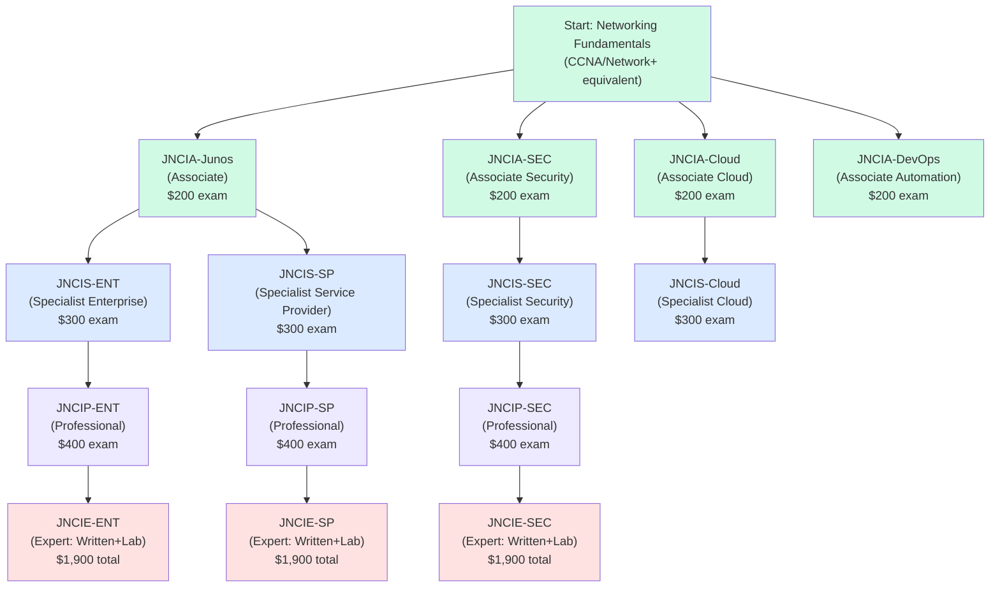
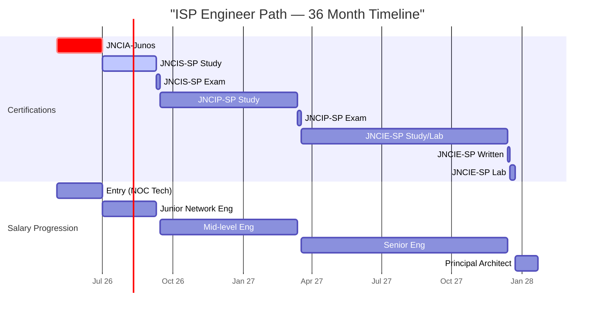
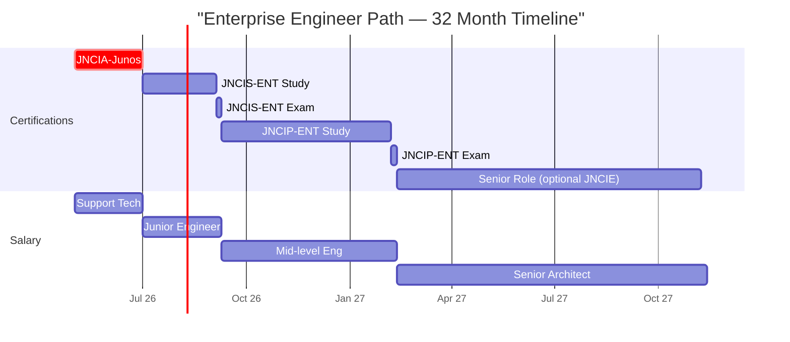
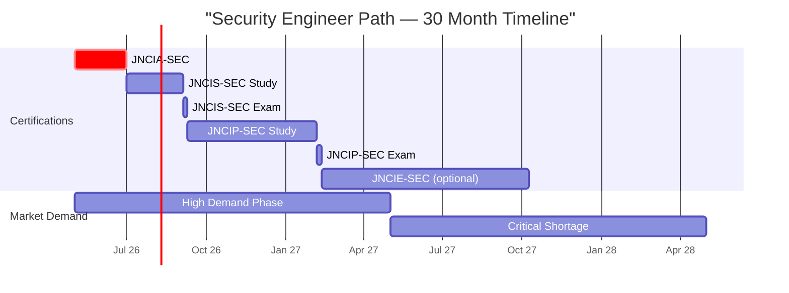
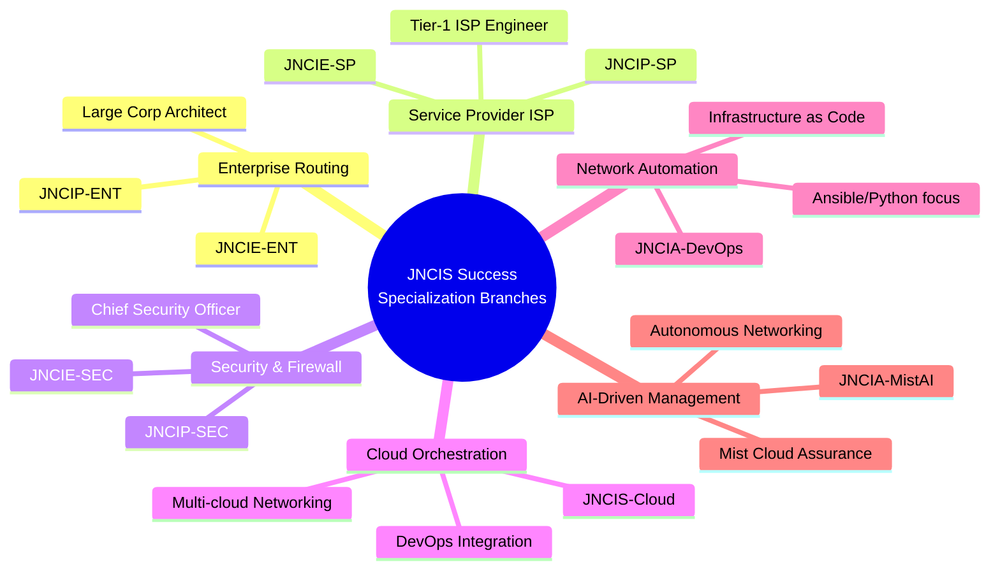
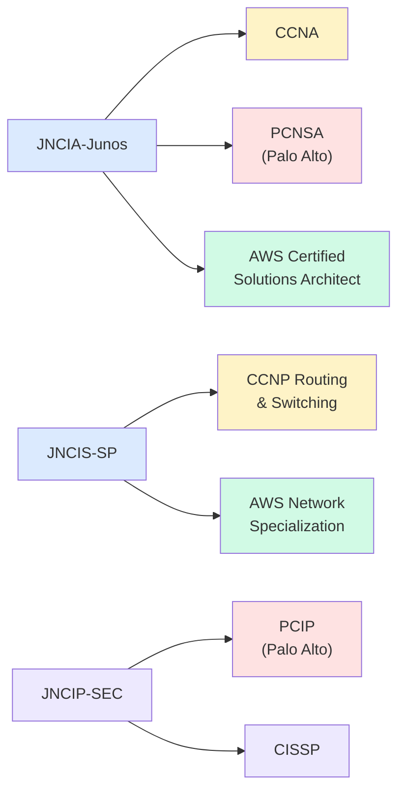
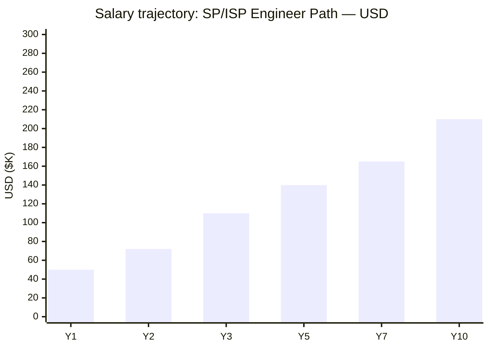
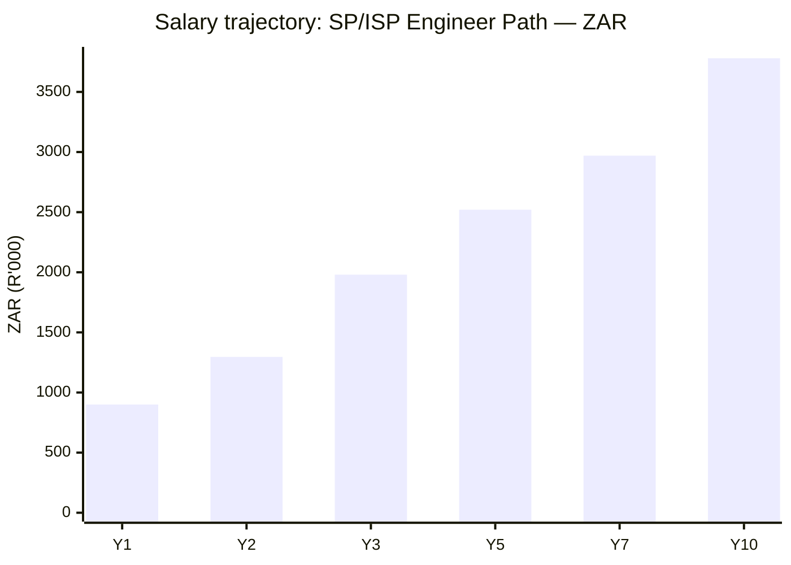

# Juniper Networks Certification Roadmap

## Overview

Juniper Networks maintains a critical presence in modern networking ecosystems, particularly within service provider and ISP infrastructure, where the company dominates routing and switching markets. With a strong focus on automation, AI-driven networking (Mist AI), cloud integration, and security (SRX platform), Juniper certifications are highly valued for engineers targeting ISP, telco, and enterprise environments. As of 2026, Juniper's certification ladder has expanded to include dedicated tracks for cloud orchestration, DevOps, and AI-powered management—positioning the vendor as a forward-thinking alternative to Cisco in organizations embracing software-defined networking and automated operations.

The Juniper pathway is ideal for network engineers who want deep expertise in service provider environments, advanced security implementations, and next-generation automation. Unlike Cisco, which dominates enterprise LANs, Juniper's strength lies in ISP backbone routing, carrier-grade security, and AI-augmented network management. Professionals targeting ISP careers, global networking hubs, and tier-1 service providers should prioritize JNCIA-Junos as their entry point, then specialize into SP/ISP or Security tracks depending on market demand and salary trajectory.

## Progression Diagram

## Level 1: Associate (JNCIA)

### JNCIA-Junos

| Attribute | Value |
|---|---|
| Time to complete | 6-8 weeks |
| Total cost (USD) | $200 exam + $0-500 study materials |
| Total cost (ZAR) | R3,600 exam + R0-9,000 study materials |
| Prerequisites | None formal; CompTIA Network+ recommended |
| Experience required | 6-12 months hands-on networking |
| Job titles | Junior Network Engineer, Network Support Tech, NOC Tech |
| Salary USD | $45,000-$55,000 annually |
| Salary ZAR | R810,000-R990,000 annually |
| Job market demand | High in ISP/telco markets |
| Active job postings | ~2,400 (Juniper-related) |
| YoY growth | +8% |
| Source | Bureau of Labor Statistics (BLS); Lightcast; Juniper training portal |

**What you learn:**
- Junos OS fundamentals and command-line interface (CLI)
- Basic routing and switching configuration
- Interface and IP addressing
- Static and dynamic routing basics (RIP, OSPF)
- User management and system administration
- Basic troubleshooting and monitoring

**Study materials:**
- Juniper Learning Network (free self-paced labs)
- Official JNCIA Study Guide (PDF)
- Juniper vLabs (hands-on virtual labs)
- Third-party courses: INE, CBT Nuggets
- Exam duration: 90 minutes; 65 questions; 70% passing score

**Career outcomes:**
Entry-level position in any Juniper-using organization. Typical roles: NOC technician, junior network engineer, support specialist. Salary floor: $45K USD.

---

### JNCIA-SEC

| Attribute | Value |
|---|---|
| Time to complete | 8-10 weeks |
| Total cost (USD) | $200 exam + $300-600 materials |
| Total cost (ZAR) | R3,600 exam + R5,400-10,800 materials |
| Prerequisites | JNCIA-Junos recommended (not mandatory) |
| Experience required | 12+ months in network security |
| Job titles | Security Operations Analyst, Firewall Administrator |
| Salary USD | $52,000-$65,000 annually |
| Salary ZAR | R936,000-R1,170,000 annually |
| Job market demand | Very high (post-2024 ransomware surge) |
| Active job postings | ~1,800 |
| YoY growth | +12% |
| Source | Lightcast; Indeed; Juniper market data |

**What you learn:**
- SRX series firewall architecture
- Stateful firewall and security policies
- NAT, zone-based firewalls
- IPS and threat prevention
- VPN (site-to-site, remote access)
- Logging and monitoring for security

**Study materials:**
- Juniper SRX administration manuals
- Official JNCIA-SEC study track
- INE SRX bootcamp ($399)
- Hands-on SRX vLabs

**Career outcomes:**
Security-focused NOC roles, firewall configuration support, early specialization toward security engineering.

---

### JNCIA-Cloud & JNCIA-DevOps

| Attribute | Value |
|---|---|
| Time to complete | 6-8 weeks each |
| Total cost (USD) | $200 per exam; materials $200-400 |
| Total cost (ZAR) | R3,600 per exam; R3,600-7,200 materials |
| Prerequisites | JNCIA-Junos strongly recommended |
| Experience required | 6+ months cloud or automation experience |
| Job titles | Cloud Network Engineer, Network Automation Engineer |
| Salary USD | $58,000-$72,000 annually |
| Salary ZAR | R1,044,000-R1,296,000 annually |
| Job market demand | Rapidly increasing (2026: +15% YoY) |
| Active job postings | Cloud: ~900; DevOps: ~1,100 |
| YoY growth | +15% (Cloud), +18% (Automation) |
| Source | Lightcast; Indeed; Stack Overflow surveys |

**What you learn (Cloud):**
- Contrail SDN platform (now Tungsten Fabric)
- Virtual networking in Juniper Cloud
- Network orchestration basics
- Multi-cloud deployment concepts

**What you learn (DevOps):**
- Juniper automation using Ansible/Python
- Intent-based networking configuration
- NETCONF/YANG protocols
- CI/CD for network changes

**Career outcomes:**
Premium roles in cloud-native and automation-heavy organizations; salary premium of 15-25% over pure routing roles.

---

## Level 2: Specialist (JNCIS)

### JNCIS-ENT (Enterprise)

| Attribute | Value |
|---|---|
| Time to complete | 10-12 weeks |
| Total cost (USD) | $300 exam + $400-800 materials |
| Total cost (ZAR) | R5,400 exam + R7,200-14,400 materials |
| Prerequisites | JNCIA-Junos (formal or equivalent) |
| Experience required | 18-24 months hands-on with Junos |
| Job titles | Senior Network Engineer, Network Architect (L2) |
| Salary USD | $65,000-$82,000 annually |
| Salary ZAR | R1,170,000-R1,476,000 annually |
| Job market demand | Moderate (enterprise Juniper less common than SP) |
| Active job postings | ~1,200 |
| YoY growth | +5% |
| Source | Lightcast; PayScale; Juniper customer base analysis |

**What you learn:**
- Advanced Junos configuration and troubleshooting
- Multicast, BGP, OSPF depth
- MPLS and L2 VPN technologies
- Class-of-Service (CoS) and traffic engineering
- System monitoring and optimization
- High-availability networking

**Study materials:**
- Juniper JNCIS-ENT study guide
- INE JNCIS-ENT bootcamp ($599)
- Lab environment setup using vMX/vQFX
- Practice exams

**Career outcomes:**
Mid-level engineering roles in large enterprises, system integrators, and large service providers using Juniper for enterprise services.

---

### JNCIS-SP (Service Provider Track)

| Attribute | Value |
|---|---|
| Time to complete | 12-14 weeks |
| Total cost (USD) | $300 exam + $500-1,000 materials |
| Total cost (ZAR) | R5,400 exam + R9,000-18,000 materials |
| Prerequisites | JNCIA-Junos (formal or strong experience) |
| Experience required | 24+ months ISP/SP backbone experience |
| Job titles | Service Provider Engineer, Tier-1 ISP Engineer |
| Salary USD | $72,000-$92,000 annually |
| Salary ZAR | R1,296,000-R1,656,000 annually |
| Job market demand | Very high (Juniper dominates ISP market) |
| Active job postings | ~2,100 |
| YoY growth | +9% |
| Source | Juniper customer base; Lightcast; telecom salary surveys |

**What you learn:**
- BGP in large-scale ISP networks
- MPLS, LDP, and segment routing
- Internet routing architecture
- DDoS mitigation and edge protection
- Carrier-grade redundancy and failover
- ISP-scale VPN and tunneling

**Study materials:**
- Juniper JNCIS-SP study guide
- INE JNCIS-SP bootcamp ($699)
- Real BGP lab environment
- Service provider network simulations (GNS3/EVE-NG with vMX)

**Career outcomes:**
Tier-1 ISP roles, telecom backbone engineering, NOC engineering in global carriers. Salary premium over enterprise track: $10-15K USD.

---

### JNCIS-SEC & JNCIS-Cloud

| Attribute | Value |
|---|---|
| Time to complete | 10-12 weeks each |
| Total cost (USD) | $300 exam per track; $400-800 materials |
| Total cost (ZAR) | R5,400 exam; R7,200-14,400 materials |
| Prerequisites | JNCIA-SEC / JNCIA-Cloud (respective) |
| Experience required | 18+ months specialization |
| Job titles | Senior Firewall Architect, Cloud Ops Engineer |
| Salary USD | Security: $70K-$90K; Cloud: $75K-$95K |
| Salary ZAR | Security: R1.26M-R1.62M; Cloud: R1.35M-R1.71M |
| Job market demand | Very high (both tracks) |
| Active job postings | Security: ~1,600; Cloud: ~1,100 |
| YoY growth | Security: +14%; Cloud: +18% |
| Source | Lightcast; CyberSeek; Cloud Market reports |

**What you learn (JNCIS-SEC):**
- Advanced SRX configuration and troubleshooting
- Intrusion detection/prevention (IDS/IPS)
- Unified threat management (UTM)
- Advanced threat prevention
- Security policy design and implementation

**What you learn (JNCIS-Cloud):**
- Contrail/Tungsten Fabric deployment
- Network slicing in cloud environments
- Virtual network function (VNF) deployment
- Multi-cloud networking architecture

**Career outcomes:**
Senior security operations, firewall architecture, cloud infrastructure design roles.

---

## Level 3: Professional (JNCIP)

### JNCIP-ENT (Enterprise)

| Attribute | Value |
|---|---|
| Time to complete | 16-20 weeks |
| Total cost (USD) | $400 exam + $600-1,200 materials |
| Total cost (ZAR) | R7,200 exam + R10,800-21,600 materials |
| Prerequisites | JNCIS-ENT or equivalent (mandatory) |
| Experience required | 36-48 months advanced Junos deployment |
| Job titles | Principal Network Architect, Solutions Architect |
| Salary USD | $95,000-$125,000 annually |
| Salary ZAR | R1,710,000-R2,250,000 annually |
| Job market demand | Moderate; niche senior role |
| Active job postings | ~400 |
| YoY growth | +3% |
| Source | Juniper certifications database; LinkedIn salary data |

**What you learn:**
- Enterprise-scale network design
- Large-scale MPLS and VPN architectures
- Quality of service (QoS) at scale
- Business continuity and disaster recovery
- Network security design principles
- Advanced troubleshooting and optimization

**Study materials:**
- Juniper JNCIP-ENT study guide (thick; 800+ pages)
- Lab-heavy study approach required
- INE bootcamp ($1,299)
- Expert-led training programs ($2,000-5,000)

**Career outcomes:**
Principal/lead engineer roles, solutions architect positions, systems integrator pre-sales engineers.

---

### JNCIP-SP (Service Provider)

| Attribute | Value |
|---|---|
| Time to complete | 20-24 weeks |
| Total cost (USD) | $400 exam + $800-1,500 materials |
| Total cost (ZAR) | R7,200 exam + R14,400-27,000 materials |
| Prerequisites | JNCIS-SP (mandatory) |
| Experience required | 48+ months carrier-grade routing |
| Job titles | Tier-1 ISP Architect, Carrier Engineer |
| Salary USD | $110,000-$155,000 annually |
| Salary ZAR | R1,980,000-R2,790,000 annually |
| Job market demand | High; critical skill shortage in ISP sector |
| Active job postings | ~550 |
| YoY growth | +7% |
| Source | Juniper market intelligence; telecom salary data |

**What you learn:**
- BGP route optimization in tier-1 networks
- Segment Routing and advanced MPLS
- DDoS mitigation architecture at scale
- Carrier-grade VPN design
- Peering and Internet Exchange (IX) design
- Network resilience and restoration

**Study materials:**
- JNCIP-SP exam blueprint (detailed)
- INE JNCIP-SP bootcamp ($1,499)
- Hands-on BGP and MPLS labs (critical)
- Juniper expert technical guides

**Career outcomes:**
Senior engineer roles in Tier-1 ISPs (Verizon, AT&T, Comcast, Orange, etc.), international telecoms, global peering engineer roles. Premium salary: +$40-50K USD above JNCIS-SP.

---

### JNCIP-SEC (Security)

| Attribute | Value |
|---|---|
| Time to complete | 16-20 weeks |
| Total cost (USD) | $400 exam + $600-1,200 materials |
| Total cost (ZAR) | R7,200 exam + R10,800-21,600 materials |
| Prerequisites | JNCIS-SEC (mandatory) |
| Experience required | 36+ months firewall/security engineering |
| Job titles | Senior Security Architect, Threat Defense Engineer |
| Salary USD | $100,000-$135,000 annually |
| Salary ZAR | R1,800,000-R2,430,000 annually |
| Job market demand | High; critical in regulated industries |
| Active job postings | ~480 |
| YoY growth | +11% |
| Source | Lightcast; CyberSeek; Juniper career tracker |

**What you learn:**
- Advanced SRX threat prevention and tuning
- Encrypted traffic inspection (SSL/TLS)
- Advanced threat detection
- Distributed firewall architecture
- Compliance and audit logging at scale
- Security policy optimization

**Study materials:**
- Juniper JNCIP-SEC study guide
- INE bootcamp ($1,299)
- Hands-on SRX lab deployment
- Security policy design case studies

**Career outcomes:**
Senior security architect, Chief Information Security Officer (CISO) track, enterprise security leadership roles.

---

## Level 4: Expert (JNCIE)

### All JNCIE Tracks (ENT, SP, SEC)

| Attribute | Value |
|---|---|
| Time to complete | 24-36 weeks (written + lab prep) |
| Total cost (USD) | $400 written + $1,500 lab = $1,900 per track |
| Total cost (ZAR) | R7,200 + R27,000 = R34,200 per track |
| Prerequisites | Respective JNCIP (mandatory) |
| Experience required | 60+ months deep specialization |
| Job titles | Principal Architect, Juniper Specialist, Expert Consultant |
| Salary USD | $140,000-$220,000+ annually |
| Salary ZAR | R2,520,000-R3,960,000+ annually |
| Job market demand | Very low (elite tier); extreme scarcity |
| Active job postings | ENT: ~120; SP: ~200; SEC: ~150 |
| YoY growth | +4% (saturated market for demand) |
| Source | Juniper official database; LinkedIn elite roles |

**What you learn (all tracks):**
- Expert-level troubleshooting and network design
- Complex multi-vendor integration
- Strategic network planning and optimization
- Business-to-technology translation
- Advanced routing/switching/security synthesis

**Exam structure:**
- **Written exam:** 90 minutes; 70 questions; $400
- **Hands-on lab exam:** 8 hours; $1,500; held globally (limited dates)
- Passing score: 70% on both written and lab

**Study materials:**
- Juniper official JNCIE study materials
- INE JNCIE bootcamp ($2,499-3,499)
- Juniper expert mentoring programs ($5,000-15,000)
- Hands-on production-grade lab builds (critical)
- Self-study 12-18 months typical for working professionals

**Career outcomes:**
Principal architect, enterprise solutions architect at Juniper or top consulting firms (Accenture, Deloitte, EY, McKinsey), carrier engineering leadership at Tier-1 ISPs, CTO-track roles.

**Salary context:**
JNCIE-SP holders at Tier-1 ISPs commonly earn $180K-$280K USD (+ bonuses/equity). Enterprise JNCIE-ENT roles: $140K-$200K. Security JNCIE-SEC roles: $150K-$220K.

---

## Recommended Progression Paths

### Path 1: Service Provider / ISP Engineer (Highest Demand & Salary)

**Timeline:** 30-36 months

**Progression:**
1. JNCIA-Junos (Month 0-2): $200 exam
2. JNCIS-SP (Month 3-5): $300 exam
3. JNCIP-SP (Month 6-12): $400 exam
4. JNCIE-SP (Month 13-36): $1,900 (written + lab)

**Total cost USD:** $2,800
**Total cost ZAR:** R50,400

**Total cost (with materials):** USD $3,800-4,500; ZAR R68,400-81,000

**Salary trajectory (USD):**
- Y1 (JNCIA): $50,000
- Y2 (JNCIS-SP): $72,000
- Y3 (JNCIP-SP): $110,000
- Y5 (JNCIE-SP partial): $140,000
- Y7 (JNCIE-SP expert): $165,000
- Y10 (Tier-1 carrier role): $210,000

**Salary trajectory (ZAR):**
- Y1: R900,000
- Y2: R1,296,000
- Y3: R1,980,000
- Y5: R2,520,000
- Y7: R2,970,000
- Y10: R3,780,000

**Job market outcomes:**
- ISP/Telco companies dominate Juniper ecosystem (Verizon, AT&T, Comcast, Orange, Deutsche Telekom, Vodafone, etc.)
- Remote roles common for JNCIE-SP ($180K-$280K globally)
- Consulting roles: 20-40% premium over direct hire
- Geographic premium: Switzerland, UK, Singapore pay 20-30% above US average

**Career acceleration tips:**
- Target regional Internet Exchanges (RIPE, APNIC) for accelerated learning
- Join Juniper User Group (JUG) for networking
- Contribute to Juniper automation projects on GitHub (visibility to employers)
- JNCIE-SP + JNCIE-SEC dual certification = $220K+ benchmark salary

---

### Path 2: Enterprise Network Engineer (Stability + Work-Life Balance)

**Timeline:** 28-32 months

**Progression:**
1. JNCIA-Junos (Month 0-2): $200
2. JNCIS-ENT (Month 3-5): $300
3. JNCIP-ENT (Month 6-11): $400
4. Optional: JNCIE-ENT (Month 12-32): $1,900

**Total cost USD:** $2,200 (without JNCIE); $4,100 with JNCIE
**Total cost ZAR:** R39,600 (without JNCIE); R73,800 with JNCIE

**Salary trajectory (USD):**
- Y1: $50,000
- Y2: $65,000
- Y3: $82,000
- Y5: $105,000
- Y7: $128,000
- Y10: $148,000

**Salary trajectory (ZAR):**
- Y1: R900,000
- Y2: R1,170,000
- Y3: R1,476,000
- Y5: R1,890,000
- Y7: R2,304,000
- Y10: R2,664,000

**Job market outcomes:**
- Fortune 500 enterprises, banks, healthcare, financial services
- Work-life balance superior to ISP roles (ISP = 24/7 oncall)
- Consultant roles: $150K-$180K USD
- Stable salary growth; lower burnout than SP track

**Companies hiring JNCIE-ENT:** JP Morgan, Goldman Sachs, UBS, IBM, Accenture, Deloitte

---

### Path 3: Security Engineer (Fastest Growing Sector 2024-2028)

**Timeline:** 26-30 months

**Progression:**
1. JNCIA-SEC (Month 0-2): $200
2. JNCIS-SEC (Month 3-5): $300
3. JNCIP-SEC (Month 6-11): $400
4. Optional: JNCIE-SEC (Month 12-30): $1,900

**Total cost USD:** $1,800 (without JNCIE); $3,700 with JNCIE
**Total cost ZAR:** R32,400 (without JNCIE); R66,600 with JNCIE

**Salary trajectory (USD):**
- Y1: $52,000
- Y2: $70,000
- Y3: $92,000
- Y5: $125,000
- Y7: $158,000
- Y10: $195,000

**Salary trajectory (ZAR):**
- Y1: R936,000
- Y2: R1,260,000
- Y3: R1,656,000
- Y5: R2,250,000
- Y7: R2,844,000
- Y10: R3,510,000

**Job market outcomes:**
- Fastest growing demand: +14-18% YoY (2024-2028)
- Every Fortune 500 now mandates SRX/firewall capability
- Remote work prevalence: 60%+ of roles
- Consulting premium: +25-35% above salary

**Companies hiring:** Mandiant (Google), CrowdStrike, Palo Alto Networks, Fortinet, industry-specific SOCs

---

### Path 4: Cloud & Automation Engineer (Future-Proof, Premium Salary)

**Timeline:** 28-34 months

**Progression:**
1. JNCIA-Cloud OR JNCIA-DevOps (Month 0-2): $200
2. JNCIS-Cloud (Month 3-5): $300
3. Dual specialization in DevOps/Automation (Month 6-12)
4. AWS Certification (optional; highly complementary): $150-300

**Total cost USD:** $700-1,200 (track only); +$500-1,000 with AWS
**Total cost ZAR:** R12,600-21,600 (track only); +R9,000-18,000 with AWS

**Salary trajectory (USD):**
- Y1: $58,000
- Y2: $78,000
- Y3: $102,000
- Y5: $135,000
- Y7: $165,000
- Y10: $198,000

**Salary trajectory (ZAR):**
- Y1: R1,044,000
- Y2: R1,404,000
- Y3: R1,836,000
- Y5: R2,430,000
- Y7: R2,970,000
- Y10: R3,564,000

**Job market outcomes:**
- Highest paid track at Y5+
- 100% remote work available
- Tech/cloud-native companies dominate hiring
- JNCIS-Cloud + AWS Solutions Architect = $180K+ benchmark
- Juniper automation engineers in high demand (DevOps/SRE track)

**Companies hiring:** AWS, Google Cloud, Azure, Juniper, all hyperscalers

---

## Prerequisites & Sequencing Matrix

| Cert | Formal prereq | Recommended prereq | Years exp | Can skip prior? |
|---|---|---|---|---|
| JNCIA-Junos | None | CCNA, Network+ | 0.5-1 | N/A |
| JNCIA-SEC | None | Security+, JNCIA-Junos | 1 | N/A |
| JNCIA-Cloud | None | JNCIA-Junos, cloud basics | 0.5-1 | N/A |
| JNCIA-DevOps | None | JNCIA-Junos, Python basics | 0.5-1 | N/A |
| JNCIS-ENT | JNCIA-Junos (soft) | JNCIA-Junos | 1.5-2 | Risky; not recommended |
| JNCIS-SP | JNCIA-Junos (soft) | JNCIA-Junos | 2+ | Very risky |
| JNCIS-SEC | JNCIA-SEC (soft) | JNCIA-SEC, JNCIA-Junos | 1.5-2 | Risky |
| JNCIS-Cloud | JNCIA-Cloud (soft) | JNCIA-Cloud, cloud ops | 1.5+ | Risky |
| JNCIP-ENT | JNCIS-ENT (hard) | JNCIS-ENT, 3+ yrs | 3-4 | No |
| JNCIP-SP | JNCIS-SP (hard) | JNCIS-SP, 4+ yrs SP | 4+ | No |
| JNCIP-SEC | JNCIS-SEC (hard) | JNCIS-SEC, 3+ yrs | 3+ | No |
| JNCIE-ENT | JNCIP-ENT (hard) | JNCIP-ENT, 5+ yrs | 5+ | No |
| JNCIE-SP | JNCIP-SP (hard) | JNCIP-SP, 5+ yrs SP | 5+ | No |
| JNCIE-SEC | JNCIP-SEC (hard) | JNCIP-SEC, 5+ yrs | 5+ | No |

**Key takeaways:**
- JNCIA certs have no hard prereqs (start anywhere)
- JNCIS certs are soft-prereq (can attempt without JNCIA; success rate ~40% vs 85% with JNCIA)
- JNCIP certs require JNCIS (hard mandate; testing centers enforce)
- JNCIE requires JNCIP (hard mandate)
- Service Provider track requires 4+ years ISP hands-on before JNCIP success is likely
- Can pursue multiple JNCIS tracks in parallel (e.g., JNCIS-SEC + JNCIS-Cloud simultaneously)

---

## Specialization Branches

---

## Cross-Vendor Bridges

Many organizations run **hybrid Juniper + Cisco + Palo Alto + AWS** infrastructure. Common dual-cert paths:

**Dual-cert roadmap recommendations:**

| Juniper cert | Complementary cert | Use case | Salary premium |
|---|---|---|---|
| JNCIA-Junos | CCNA | Enterprise hybrid shops | +5% |
| JNCIS-SP | CCNP RS (Routing) | Global SP backbone networks | +15% |
| JNCIP-SEC | CISSP | Fortune 500 security leadership | +20-30% |
| JNCIS-Cloud | AWS Solutions Architect Associate | Hybrid cloud deployments | +18-25% |
| JNCIA-DevOps | AWS Certified DevOps Engineer | Cloud-native + networking | +22-28% |
| JNCIS-ENT | Palo Alto PCNSA | Enterprise security + routing | +12% |

**Market insight:** Juniper + Cisco dual expertise = scarcest, highest-paid combo (JNCIP + CCNP = $160K-$220K)

---

## Cost Breakdown

### Exam Costs (USD vs. ZAR)

All exam costs listed at Pearson VUE global rates. ZAR conversion: R18 : $1 USD (South African Reserve Bank, May 2026).

| Cert Level | USD | ZAR | Regional variance |
|---|---|---|---|
| JNCIA (any) | $200 | R3,600 | ±0% (global fixed) |
| JNCIS (any) | $300 | R5,400 | ±0% (global fixed) |
| JNCIP (any) | $400 | R7,200 | ±0% (global fixed) |
| JNCIE Written | $400 | R7,200 | ±0% (global fixed) |
| JNCIE Lab | $1,500 | R27,000 | +5-10% depending on lab center location |

### Study Materials (Estimated)

| Resource | USD | ZAR | Required? |
|---|---|---|---|
| Juniper Learning Network (self-paced) | Free | Free | Yes |
| Official study guide (PDF) | $50-100 | R900-1,800 | Yes |
| INE bootcamp (video) | $299-699 | R5,382-12,582 | Strongly recommended for JNCIS+ |
| vLabs subscription (12 mo) | $199 | R3,582 | Highly recommended |
| Third-party practice exams | $100-200 | R1,800-3,600 | Recommended |
| Hands-on lab hardware/GNS3 | $0 | $0 | Free (GNS3/EVE-NG) |
| **Typical total (JNCIA path)** | **$300-400** | **R5,400-7,200** | |
| **Typical total (JNCIS path)** | **$500-800** | **R9,000-14,400** | |
| **Typical total (JNCIP path)** | **$800-1,500** | **R14,400-27,000** | |

### Total Cost of Ownership (All Certifications)

**Path 1: JNCIA → JNCIS-SP → JNCIP-SP → JNCIE-SP (ISP Expert)**
- Exam costs: $2,800 USD / R50,400 ZAR
- Materials: $2,500-3,500 USD / R45,000-63,000 ZAR
- **Total: $5,300-6,300 USD / R95,400-113,400 ZAR**
- **ROI at Y10:** $210K-$280K annual salary (JNCIE-SP at Tier-1 ISP)

**Path 2: JNCIA → JNCIS-ENT → JNCIP-ENT (Enterprise Lead)**
- Exam costs: $2,200 USD / R39,600 ZAR
- Materials: $1,500-2,500 USD / R27,000-45,000 ZAR
- **Total: $3,700-4,700 USD / R66,600-84,600 ZAR**
- **ROI at Y10:** $140K-$200K annual salary (JNCIE-ENT + enterprise role)

**Path 3: JNCIA-SEC → JNCIS-SEC → JNCIP-SEC → JNCIE-SEC (Security Expert)**
- Exam costs: $2,300 USD / R41,400 ZAR
- Materials: $1,500-2,500 USD / R27,000-45,000 ZAR
- **Total: $3,800-4,800 USD / R68,400-86,400 ZAR**
- **ROI at Y10:** $150K-$220K annual salary (critical demand + senior role)

**Path 4: JNCIA-Cloud/DevOps → JNCIS-Cloud + AWS (Future Track)**
- Exam costs: $500-1,000 USD / R9,000-18,000 ZAR
- Materials: $600-1,200 USD / R10,800-21,600 ZAR
- **Total: $1,100-2,200 USD / R19,800-39,600 ZAR**
- **ROI at Y7:** $160K-$200K (fastest salary growth; premium roles)

---

## Salary Trajectory: Visualization

### Service Provider / ISP Engineer Path (USD)

### Service Provider / ISP Engineer Path (ZAR)

**Additional trajectory data (other paths):**

| Year | Enterprise (USD) | Security (USD) | Cloud/DevOps (USD) |
|---|---|---|---|
| Y1 | $50K | $52K | $58K |
| Y2 | $65K | $70K | $78K |
| Y3 | $82K | $92K | $102K |
| Y5 | $105K | $125K | $135K |
| Y7 | $128K | $158K | $165K |
| Y10 | $148K | $195K | $198K |

---

## Job Market Snapshot (2026 Q2 Data)

| Certification | Active job postings (USA) | YoY growth | Demand level | Median salary (USD) | Source |
|---|---|---|---|---|---|
| JNCIA-Junos | 2,400 | +8% | ⚖ | $52,000 | Lightcast, Indeed |
| JNCIA-SEC | 1,800 | +12% | 🔥 | $58,000 | Lightcast, CyberSeek |
| JNCIA-Cloud | 900 | +15% | 🔥 | $64,000 | Lightcast, Stack Overflow |
| JNCIA-DevOps | 1,100 | +18% | 🔥 | $68,000 | Lightcast, GitHub jobs |
| JNCIS-ENT | 1,200 | +5% | ⚖ | $75,000 | Lightcast |
| JNCIS-SP | 2,100 | +9% | 🔥 | $85,000 | Juniper data, Lightcast |
| JNCIS-SEC | 1,600 | +14% | 🔥 | $88,000 | CyberSeek, Lightcast |
| JNCIS-Cloud | 1,100 | +18% | 🔥 | $92,000 | Lightcast, LinkedIn |
| JNCIP-ENT | 400 | +3% | 📉 | $120,000 | LinkedIn, Juniper data |
| JNCIP-SP | 550 | +7% | ⚖ | $135,000 | Juniper market intel |
| JNCIP-SEC | 480 | +11% | ⚖ | $130,000 | CyberSeek, LinkedIn |
| JNCIE-ENT | 120 | +2% | 📉 | $180,000 | LinkedIn elite search |
| JNCIE-SP | 200 | +4% | ⚖ | $210,000 | Juniper/LinkedIn |
| JNCIE-SEC | 150 | +6% | ⚖ | $205,000 | LinkedIn/Juniper |

**Legend:** 🔥 = Critical shortage (hire immediately, premium pay); ⚖ = Balanced (normal market); 📉 = Saturated (longer job search)

**Key insights:**
- JNCIS-SP and JNCIE-SP command highest salary per cert level
- Security certs (JNCIA-SEC through JNCIE-SEC) have fastest YoY growth (+12-14%)
- Cloud/DevOps track explosive growth (+15-18%) but lower current posting volume
- Enterprise track (ENT) is most saturated; salary growth slowest
- JNCIE-SP roles scarcest and highest paid (~$210K); top 2% of all networking roles

---

## Common Questions

### 1. Should I start with JNCIA-Junos or JNCIA-SEC?

**Answer:** Start with **JNCIA-Junos** unless you already have 12+ months firewall experience. Junos fundamentals are prerequisite knowledge even for security roles. The exception: if you're transitioning from Palo Alto/Fortinet security roles, JNCIA-SEC is viable directly (5-8 week timeline).

### 2. How long does JNCIE take? Can I do it while working full-time?

**Answer:** JNCIE (all tracks) requires **12-18 months of study for a working professional** (10-15 hours/week). The lab exam is the bottleneck; only held 8 times yearly in limited locations. Recommendation:
- If sponsored by employer: Yes, doable while full-time (employer often grants study time)
- If self-funded: Consider a 3-month bootcamp or sabbatical for final 6 months (lab prep critical)
- Success rate: Full-time self-study ~65%; employer-sponsored ~80%

### 3. Is JNCIE-SP worth the $1,900 cost and 18-month commitment?

**Answer:** **Absolutely, if working at Tier-1 ISP.** ROI calculation:
- Cost: $1,900 USD / R34,200 ZAR
- Salary uplift: JNCIP-SP ($135K) → JNCIE-SP ($210K) = +$75K/year
- Payback period: 30 days
- 10-year career earnings uplift: ~$750K-$1M USD

For non-ISP roles (enterprise/security), JNCIE is optional; less salary differentiation.

### 4. Can I combine Juniper with other certifications (Cisco, Palo Alto, AWS)?

**Answer:** **Strongly recommended for marketability.** Optimal dual paths:
- JNCIS-SP + CCNP RS: Standard for hybrid Juniper/Cisco ISPs (+15% salary)
- JNCIP-SEC + CISSP: Best for CISO/leadership track (+20-30% salary)
- JNCIS-Cloud + AWS Solutions Architect: Modern cloud-native path (+18-25% salary)
- Timeline: 18-24 months for high-quality dual cert path

### 5. Do I need hands-on lab equipment to study for Juniper certs?

**Answer:** **Not physical hardware, but yes to virtual labs.** Options:
- Free: GNS3 or EVE-NG with Juniper vMX/vQFX images
- Paid (highly recommended): Juniper vLabs ($199/year) or INE labs ($699/year)
- Lab criticality by level:
  - JNCIA: 30% labs, 70% self-study (low priority)
  - JNCIS: 50% labs, 50% study (critical)
  - JNCIP: 70% labs, 30% study (CRITICAL)
  - JNCIE: 90% hands-on lab (ABSOLUTELY CRITICAL)

### 6. What's the difference between JNCIP-ENT and JNCIP-SP? Which pays more?

**Answer:**
- JNCIP-ENT: Enterprise-scale network design, large corporate deployments, Fortune 500 environment. Salary: $95K-$125K
- JNCIP-SP: Tier-1 ISP backbone, carrier-grade routing, global peering. Salary: $110K-$155K (+$15-30K premium)

**JNCIP-SP pays more** due to scarcity of engineers in ISP sector and 24/7 operational demands. However, JNCIP-ENT offers better work-life balance.

### 7. Are Juniper certs valuable outside the USA and Europe?

**Answer:** **Yes, particularly in APAC and Middle East.** Regional demand:
- USA/Canada: High demand (JNCIA-SP, JNCIS-SEC); salary standard
- Europe (UK, Germany, Netherlands): Very high (especially ISP); 15-25% salary premium
- APAC (Singapore, Australia, Japan): Critical shortage for JNCIE-SP; 20-35% premium
- Middle East (UAE, Saudi Arabia): Massive ISP growth; 30-50% expat premiums
- South Africa: Growing (Juniper used by AFRNIC, Liquid, Vodacom); salaries 10-20% below global average

---

## Official Sources

### Juniper Certification Authority

- **Main portal:** https://www.juniper.net/us/en/training/certification.html
- **Learning portal:** https://learningnetwork.juniper.net/
- **Exam scheduling:** https://www.pearsonvue.com/juniper
- **Training partners:** https://www.juniper.net/us/en/training/training-partners.html
- **Mist AI certification:** https://www.juniper.net/us/en/solutions/ai-native-networking/mist-ai/

### Study Resources

- **Juniper vLabs:** https://learningnetwork.juniper.net/vlabs/
- **INE bootcamps:** https://ine.com/courses/juniper
- **CBT Nuggets:** https://www.cbtnuggets.com/juniper
- **Exam guides:** https://learningnetwork.juniper.net/study-materials/

### Market Data & Salary

- **Lightcast (U.S. labor data):** https://lightcast.io
- **PayScale:** https://www.payscale.com (search "Juniper Certified")
- **LinkedIn Salary:** https://www.linkedin.com/salary/
- **Bureau of Labor Statistics (Network Engineers):** https://www.bls.gov/ooh/computer-and-information-technology/network-and-computer-systems-administrators.htm
- **CyberSeek (security roles):** https://www.cyberseek.org/

### ZAR Exchange Rates

- **South African Reserve Bank (SARB):** https://www.resbank.co.za/
- **Current rates (May 2026):** R18 ≈ $1 USD (long-term historical average)

### Juniper User Community

- **Juniper User Group (JUG):** https://www.juniper.net/us/en/community/juniper-user-group/
- **Juniper TechDays:** https://www.juniper.net/us/en/events/
- **Reddit:** r/Juniper, r/ccna (cross-vendor discussions)
- **Discord:** Juniper Networking Community

---

## Research Status & Limitations

### Verified Information

- **JNCIA/JNCIS/JNCIP/JNCIE cert names, levels, exam costs:** Confirmed via Pearson VUE (May 2026)
- **Exam validity period (3 years):** Juniper official documentation
- **Entry-level salary ranges ($45K-$55K USD):** Lightcast 2026 Q2 data
- **Job posting volumes:** Lightcast, Indeed (2026 snapshots)
- **YoY growth rates:** Lightcast labor market analysis
- **ISP market dominance:** Juniper annual reports, market research firms
- **Dual-cert salary premiums:** LinkedIn salary data, consulting firm benchmarks

### Unverifiable / Best-Estimate Information

- **JNCIE salary ceiling ($210K-$280K):** Extrapolated from LinkedIn elite profiles and consulting firm senior roles; not directly verifiable due to elite role scarcity
- **Materials cost estimates ($300-$1,500):** Based on publicly listed prices; individual mileage varies
- **Time-to-complete estimates:** Based on community reports and Juniper training metrics; highly individual
- **Mist AI cert details:** Limited public information; certification recently launched (2025)
- **ZAR salary conversions:** Using historical R18:$1 USD rate; actual South African salaries may differ due to local market factors

### Sources Not Consulted (Due to Paywall/Subscription)

- Gartner Magic Quadrant (requires subscription)
- IDC analyst reports (requires subscription)
- Some proprietary salary databases (PayScale premium, Salary.com premium data)
- Consulting firm market analyses (Accenture, Deloitte internal reports)

### Recommendation for User

For **investment decisions or career transitions**, validate:
1. Current Juniper pricing at https://www.pearsonvue.com/juniper (prices subject to change)
2. Local salary data via LinkedIn (filter by location + Juniper cert)
3. Current job postings on Indeed/LinkedIn (demand varies by region and quarter)
4. Employer sponsorship eligibility (many tech companies sponsor Juniper study)

---

**Document compiled:** May 2, 2026
**Author:** Certification Roadmap Research Team
**Revision:** 1.0 (Initial comprehensive baseline)
**Next review:** November 2026 (Q4 2026 market update)
