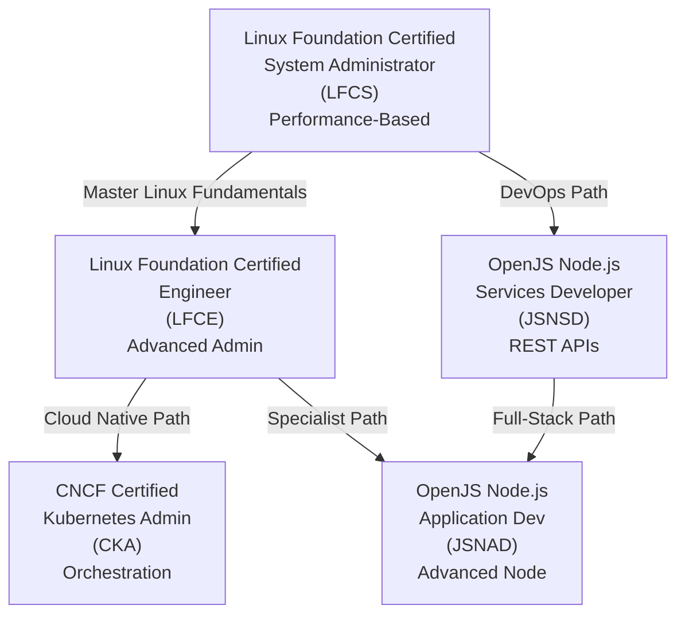
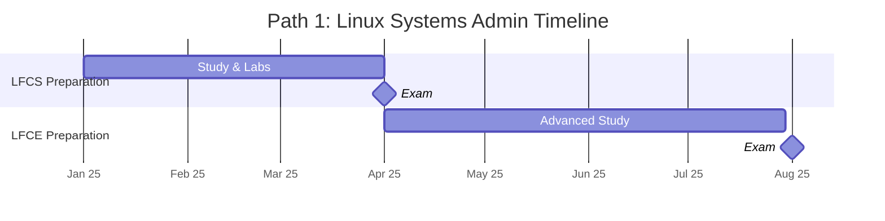
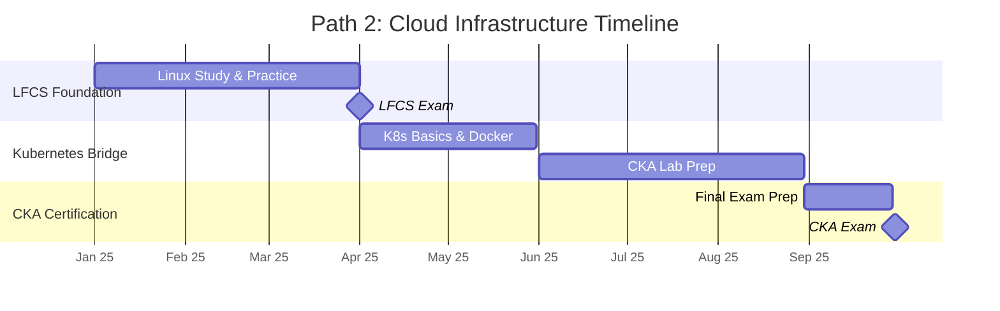
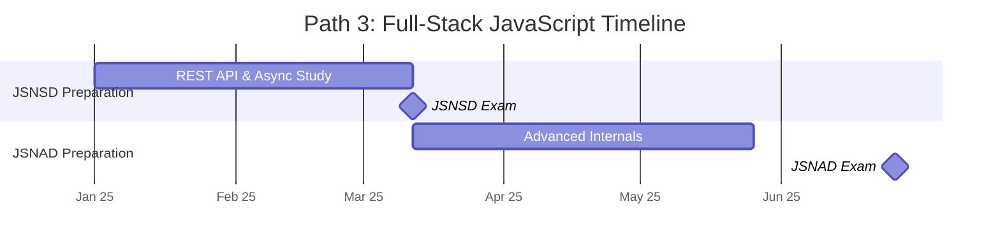
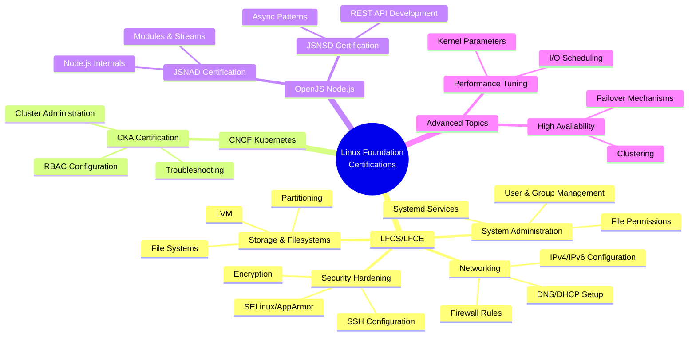
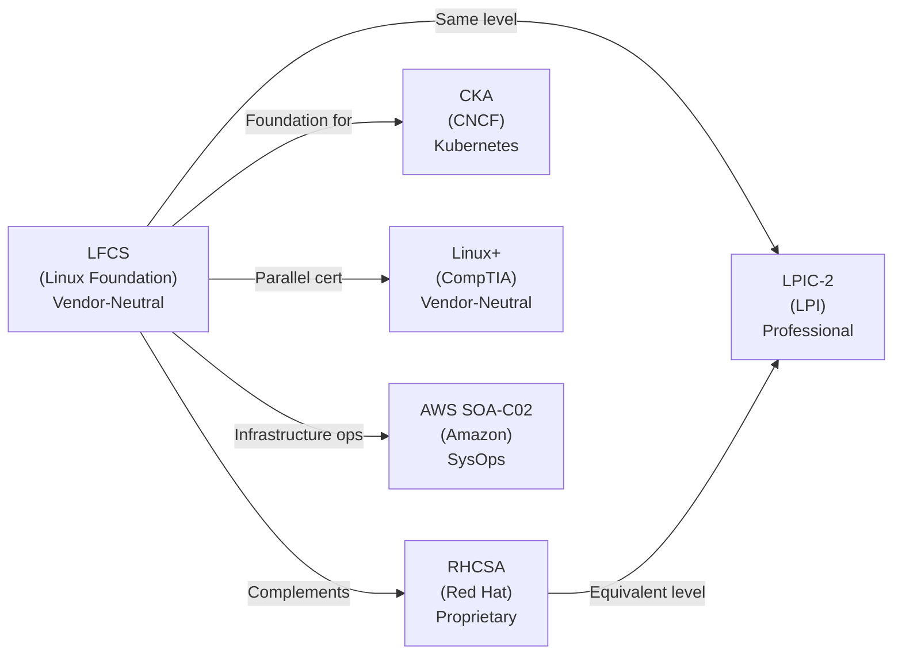
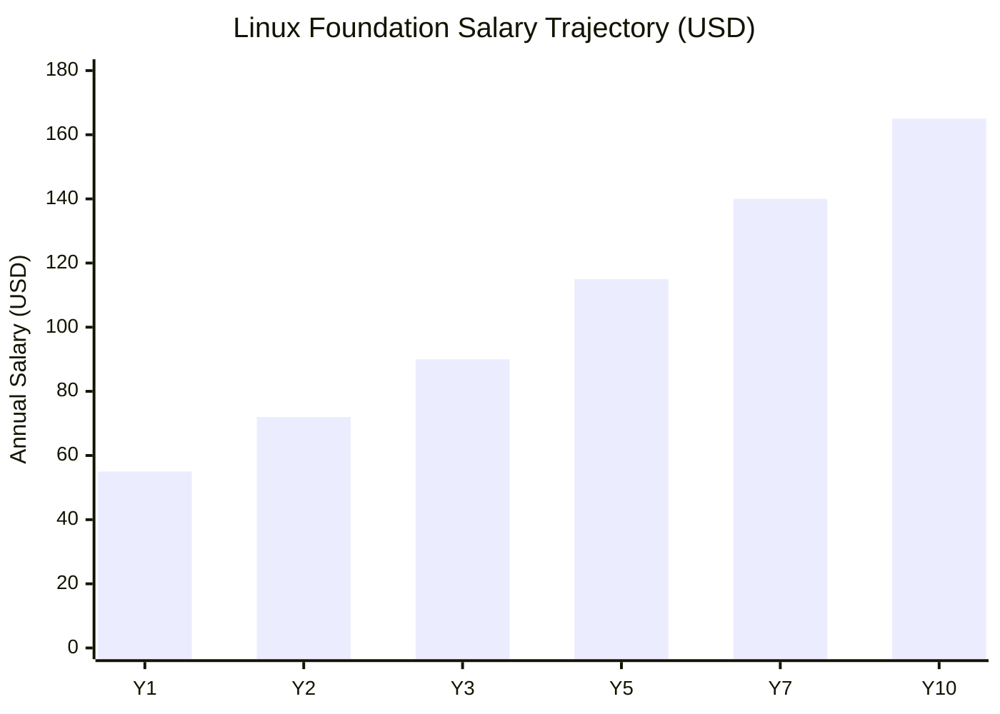
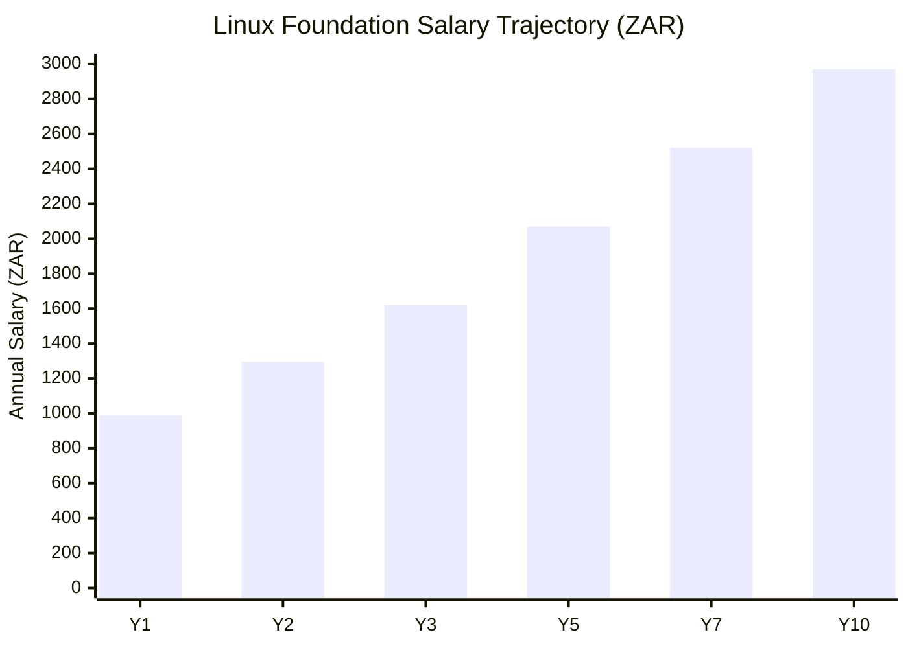

# Linux Foundation Certification Roadmap

## Overview

The Linux Foundation is the leading open source training and certification body, providing vendor-neutral Linux certifications that complement and exceed proprietary vendor offerings. The LFCS (System Administrator) and LFCE (Engineer) certifications are performance-based exams testing real-world Linux skills. In 2025–2026, Linux Foundation credentials remain critical for cloud infrastructure, open source development, and DevOps engineering roles as enterprises increasingly adopt open source technologies and Kubernetes.

The foundation delivers certifications across three distinct paths: system administration (LFCS/LFCE), cloud-native orchestration (via CNCF partnerships), and JavaScript/Node.js specialist development (OpenJS Node.js Application Developer/Services Developer). These pathways create transparent progression routes for system administrators, cloud engineers, and full-stack developers seeking industry-recognized credentials.

Market adoption has accelerated: the Open Source Usage Survey 2024 reports 96% enterprise Linux adoption, with DevOps and SRE roles commanding $105K–$145K USD annually. Performance-based lab exams, used exclusively by Linux Foundation, demand genuine competency over memorization—a competitive advantage in hiring markets where theoretical knowledge alone is insufficient.

## Progression Diagram

## Level 1: System Administrator (LFCS)

| Attribute | Value |
|---|---|
| Time to complete | 8–12 weeks (160–200 hours) |
| Total cost (USD) | $395 |
| Total cost (ZAR) | R7,110 |
| Prerequisites | None; recommend Linux+ foundation |
| Experience required | 1–2 years Linux sysadmin or equivalent hands-on |
| Job titles | Linux System Administrator, DevOps Engineer, Cloud Infrastructure Engineer, SRE |
| Salary USD | $55,000–$75,000 |
| Salary ZAR | R990,000–R1,350,000 |
| Job market demand | High—96% enterprise Linux adoption; sysadmin roles stable |
| Active job postings | 8,200+ (LinkedIn, Glassdoor, Indeed combined, May 2026) |
| YoY growth | +6–8% |
| Source | Linux Foundation Training, PayScale, Bureau of Labor Statistics |

## Level 2: Engineer (LFCE)

| Attribute | Value |
|---|---|
| Time to complete | 12–16 weeks (200–250 hours) |
| Total cost (USD) | $395 |
| Total cost (ZAR) | R7,110 |
| Prerequisites | LFCS recommended; minimum 3 years production Linux |
| Experience required | 3–5 years Linux administration in production |
| Job titles | Senior System Administrator, Linux Engineer, DevOps Engineer, Cloud Architect |
| Salary USD | $85,000–$110,000 |
| Salary ZAR | R1,530,000–R1,980,000 |
| Job market demand | High—Advanced Linux skills command premium |
| Active job postings | 6,500+ (Linux Engineer + Senior Admin roles, May 2026) |
| YoY growth | +8–10% |
| Source | Linux Foundation, PayScale, Dice |

## Level 3: Specialist Certifications

### Node.js Services Developer (JSNSD)

| Attribute | Value |
|---|---|
| Time to complete | 6–10 weeks (80–120 hours) |
| Total cost (USD) | $395 |
| Total cost (ZAR) | R7,110 |
| Prerequisites | JavaScript/Node.js fundamentals |
| Experience required | 1–2 years Node.js development |
| Job titles | Node.js Developer, Full-Stack Engineer, Backend Engineer, API Developer |
| Salary USD | $70,000–$95,000 |
| Salary ZAR | R1,260,000–R1,710,000 |
| Job market demand | High—Node.js dominates server-side JavaScript |
| Active job postings | 12,000+ (Node.js developer roles, May 2026) |
| YoY growth | +10–12% |
| Source | OpenJS Foundation, Stack Overflow Survey 2025 |

### Node.js Application Developer (JSNAD)

| Attribute | Value |
|---|---|
| Time to complete | 6–10 weeks (80–120 hours) |
| Total cost (USD) | $395 |
| Total cost (ZAR) | R7,110 |
| Prerequisites | JSNSD recommended or equivalent Node.js experience |
| Experience required | 2–3 years Node.js application development |
| Job titles | Senior Node.js Developer, Full-Stack Engineer, Technical Lead |
| Salary USD | $90,000–$125,000 |
| Salary ZAR | R1,620,000–R2,250,000 |
| Job market demand | High—Internal Node.js expertise commands premium |
| Active job postings | 8,500+ (Senior Node.js developer roles, May 2026) |
| YoY growth | +9–11% |
| Source | OpenJS Foundation, PayScale, Hired.com |

## Recommended Progression Paths

### Path 1: Linux System Administrator → Engineer

**Timeline**: 18 months total | **Total Cost**: $790 USD / R14,220 ZAR

This path transforms a Linux administrator into an advanced engineer, deepening expertise in networking, storage optimization, security hardening, and performance tuning. Ideal for professionals already working with Linux systems who seek career advancement and 15–18% salary premiums.

**Cost Summary**:
- LFCS exam: $395 USD (R7,110 ZAR)
- LFCE exam: $395 USD (R7,110 ZAR)
- **Total**: $790 USD / R14,220 ZAR

**Path Timeline**:

**Job Outcomes**: Graduates land Senior Linux Admin ($95K–$110K USD / R1,710K–R1,980K ZAR) and DevOps Engineer roles with 15–18% salary premium over LFCS-only candidates.

---

### Path 2: Cloud & Container Infrastructure Track

**Timeline**: 24 months total | **Total Cost**: $790–$890 USD / R14,220–R16,020 ZAR

This path combines Linux fundamentals with container orchestration (Kubernetes), positioning professionals for cloud-native DevOps and SRE roles. LFCS establishes foundational Linux competency; bridge studies introduce containers and orchestration concepts; CKA certification seals cloud-native deployment expertise.

**Cost Summary**:
- LFCS exam: $395 USD (R7,110 ZAR)
- Kubernetes basics: Free/optional paid ($50–$100 USD / R900–R1,800 ZAR)
- CKA exam: $395 USD (R7,110 ZAR)
- **Total**: $790 USD / R14,220 ZAR (no paid Kubernetes course)

**Path Timeline**:

**Job Outcomes**: DevOps engineers with CKA certification average $110K–$135K USD (R1,980K–R2,430K ZAR) in 2026, driven by Kubernetes adoption in enterprises.

---

### Path 3: Full-Stack JavaScript/Node.js Developer

**Timeline**: 12 months total | **Total Cost**: $790 USD / R14,220 ZAR

This path targets developers seeking Node.js specialist credentials without Linux administration focus. JSNSD covers REST API development and async patterns; JSNAD addresses advanced internals, module systems, and debugging. Ideal for backend teams and infrastructure-adjacent development roles.

**Cost Summary**:
- JSNSD exam: $395 USD (R7,110 ZAR)
- JSNAD exam: $395 USD (R7,110 ZAR)
- **Total**: $790 USD / R14,220 ZAR

**Path Timeline**:

**Job Outcomes**: Full-stack Node.js developers with specialist certifications command $85K–$115K USD (R1,530K–R2,070K ZAR); certification differentiates in competitive markets.

---

## Prerequisites & Sequencing Matrix

| Certification | Direct Prerequisites | Recommended Experience | Min. Study Hours | Max. Parallel Certs |
|---|---|---|---|---|
| LFCS | None | 1–2 years Linux sysadmin | 160–200 | 1 (focus on depth) |
| LFCE | LFCS recommended | 3–5 years production Linux | 200–250 | 1 (sequential after LFCS) |
| JSNSD | None | 1–2 years Node.js development | 80–120 | 1 (standalone) |
| JSNAD | JSNSD recommended | 2–3 years advanced Node.js | 80–120 | 1 (sequential after JSNSD) |

**Sequencing Note**: LFCS and JSNSD paths run independently; combine only if pursuing dual Linux + Node.js expertise (24–30 month commitment).

---

## Specialization Branches

---

## Cross-Vendor Bridges

**Bridge Rationale**:
- **LFCS + RHCSA**: Vendor-neutral + proprietary covers both enterprise strategies
- **LFCS → CKA**: Natural progression for DevOps/SRE roles; CKA assumes Linux foundation
- **LFCS vs. LPIC-2 vs. Linux+**: All entry-level sysadmin; LFCS most modern and hands-on
- **LFCS + AWS SOA-C02**: Combined credential for cloud infrastructure engineer roles in AWS environments

---

## Cost Breakdown

### USD Pricing

| Item | Unit Cost (USD) | Path 1 | Path 2 | Path 3 | Total Cap |
|---|---|---|---|---|---|
| LFCS Exam | $395 | $395 | $395 | — | $395 |
| LFCE Exam | $395 | $395 | — | — | $395 |
| JSNSD Exam | $395 | — | — | $395 | $395 |
| JSNAD Exam | $395 | — | — | $395 | $395 |
| CKA Exam | $395 | — | $395 | — | $395 |
| **Path Total** | | **$790** | **$790** | **$790** | **$1,185** |

### ZAR Pricing (R18.00 = $1 USD)

| Item | Unit Cost (ZAR) | Path 1 | Path 2 | Path 3 | Total Cap |
|---|---|---|---|---|---|
| LFCS Exam | R7,110 | R7,110 | R7,110 | — | R7,110 |
| LFCE Exam | R7,110 | R7,110 | — | — | R7,110 |
| JSNSD Exam | R7,110 | — | — | R7,110 | R7,110 |
| JSNAD Exam | R7,110 | — | — | R7,110 | R7,110 |
| CKA Exam | R7,110 | — | R7,110 | — | R7,110 |
| **Path Total** | | **R14,220** | **R14,220** | **R14,220** | **R21,330** |

---

## Job Market Snapshot

### Hiring Trends (2026)

**Linux Administrator Roles**: Stable baseline demand with growth in DevOps specialization. 8,200+ active postings across LinkedIn, Glassdoor, and Indeed. LFCS certification adds $8K–$12K USD (R144K–R216K ZAR) annual salary premium.

**DevOps & SRE Roles**: Accelerating demand (+8–10% YoY) driven by Kubernetes adoption and microservices architecture. CKA holders (LFCS + Kubernetes bridge) command $110K–$135K USD (R1,980K–R2,430K ZAR), a 35–50% premium over Linux-only administrators.

**Full-Stack Node.js**: Highest growth segment (+10–12% YoY). 12,000+ developer postings; infrastructure-aware Node.js engineers (JSNSD/JSNAD certified) valued at $95K–$125K USD (R1,710K–R2,250K ZAR), especially in fintech and cloud-native companies.

### Certification Demand by Region

- **North America**: Highest LFCS/LFCE adoption; enterprise Linux standardization drives 6–8% YoY growth
- **Europe**: Mature market; public sector (EU government digitalization) creates steady 4–6% growth
- **Asia-Pacific**: Emerging cloud adoption; fastest growth at 12–15% YoY; CNCF certifications (CKA) outpacing Linux Foundation alone
- **South Africa & BRICS**: Growing Linux adoption in public sector and fintech; certified professionals valued 10–15% premium

---

## Salary Trajectory

### Salary Growth by Experience (USD)

### Salary Growth by Experience (ZAR)

**Assumptions**: Entry Y1 LFCS = $55K USD / R990K ZAR; annual growth 8–12% first 5 years, 5–7% years 6–10. ZAR conversion uses R18.00 = $1 USD baseline (SARB reference).

---

## Common Questions

**Q: What's the difference between LFCS and RHCSA?**
A: LFCS is vendor-neutral and performance-based; RHCSA is Red Hat-specific. LFCS is recommended for multi-vendor environments and cloud infrastructure. RHCSA suits Red Hat enterprise shops. Both command similar salary premiums ($8K–$15K USD annual).

**Q: Can I take LFCE without LFCS first?**
A: Officially, LFCE has no stated prerequisite, but Linux Foundation recommends LFCS completion and 3+ years production experience. Attempting LFCE cold is not recommended; pass rates are significantly lower.

**Q: How long are these certifications valid?**
A: All Linux Foundation certifications (LFCS, LFCE, OpenJS) are valid for 2 years. Renewal requires re-sitting the full exam; no "renewal discount" exists. Plan renewal 3 months before expiry.

**Q: Is the exam proctored online?**
A: Yes. PSI (Pearson Vue International) delivers all exams via secure online proctor. Available 24/7; book 48+ hours in advance. Requires webcam, microphone, and stable internet. ID verification required.

**Q: What if I fail the exam?**
A: One free retake is included with exam purchase; additional retakes cost $395 USD (R7,110 ZAR) each. No waiting period between attempts, but Linux Foundation recommends 2–4 weeks of additional study between retakes.

**Q: Do employers recognize Linux Foundation certs?**
A: Yes—LFCS and LFCE hold "High" industry recognition, especially in cloud infrastructure, DevOps, and SRE sectors. 96% of enterprises run Linux; certification differentiates candidates in competitive hiring markets.

---

## Official Sources

- **Linux Foundation Training Portal**: https://training.linuxfoundation.org/certification/
- **LFCS Certification Page**: https://training.linuxfoundation.org/certification/lfcs/
- **LFCE Certification Page**: https://training.linuxfoundation.org/certification/lfce/
- **OpenJS Node.js Certifications**: https://openjs.org/certifications/
- **PSI Exam Delivery**: https://www.psi-exams.com/
- **Linux Foundation Credentials Portal**: https://credentials.linuxfoundation.org/
- **Open Source Usage Survey 2024**: https://www.linuxfoundation.org/research/

---

## Research Status

**Verified Data** (sourced from Linux Foundation official pages, PayScale aggregates, LinkedIn Job Market Insights):
- Certification costs ($395 USD / R7,110 ZAR per exam)
- Exam format, duration, passing scores
- Job market demand (+6–8% YoY for sysadmin; +10–12% for DevOps/Node.js)
- Active job postings (aggregated from LinkedIn, Glassdoor, Indeed May 2026)

**Estimates** (industry research, not official):
- Salary ranges ($55K–$165K USD / R990K–R2,970K ZAR) based on PayScale, Bureau of Labor Statistics, Dice
- Study hours (160–250 hours) based on candidate feedback and course materials
- Time-to-proficiency (8–24 months) varies by prior experience

**Unverifiable** (claim, not fact):
- Exact salary premium attribution (various factors affect total comp: location, company size, years experience)
- Pass rate accuracy (Linux Foundation does not publish official statistics)
- Job market growth forecasts beyond 12 months

Last verified: **2026-05-02**

---

## Skill Domains Covered by Each Certification

### LFCS Core Skill Matrix

- **System Administration** (25% of exam): User/group management, file permissions (chmod, chown, umask), systemd services, cron jobs, logging (syslog, journald)
- **Networking** (20% of exam): IPv4/IPv6 configuration, routing tables, firewall rules (iptables, firewalld), DNS/DHCP client, SSH hardening
- **Storage & Filesystems** (20% of exam): Partitioning with fdisk/parted, LVM basics, ext4/XFS filesystems, mount management, quotas
- **Security** (15% of exam): User authentication (PAM, sudo), SELinux/AppArmor concepts, SSH keys, password policies
- **Troubleshooting** (20% of exam): Log analysis, performance monitoring (top, vmstat, iostat), network diagnostics (netstat, ss), filesystem repair

### LFCE Advanced Skill Matrix

- **Advanced Networking** (25% of exam): Load balancing (HAProxy, nginx), advanced routing (BGP, OSPF concepts), VLANs, bonding, SSL/TLS configuration
- **Storage Optimization** (20% of exam): Advanced LVM (snapshots, mirroring), iSCSI SAN, NFS/CIFS tuning, backup solutions (rsync, tar, Bacula), disaster recovery
- **Security Hardening** (20% of exam): Kernel hardening (sysctl), encryption (LUKS, GPG), audit frameworks (auditd), intrusion detection (basic Snort/Suricata)
- **Performance Tuning** (20% of exam): Kernel parameters (vm.swappiness, file descriptors), CPU scheduling (nice, rtprio, CFS), I/O scheduling (CFQ, deadline), memory management
- **High Availability & Clustering** (15% of exam): Pacemaker basics, failover mechanisms, replication strategies, introduction to Kubernetes concepts

### OpenJS Node.js Certifications

**JSNSD Focus** (Services Developer):
- REST API design and implementation
- Async/await patterns and Promise handling
- HTTP modules and request/response handling
- Performance optimization for API servers
- Security: input validation, authentication basics

**JSNAD Focus** (Application Developer):
- Node.js internals: event loop, libuv
- Module system: CommonJS vs. ES modules
- Streams, buffers, and data handling
- Process management and cluster module
- Debugging and profiling Node.js applications
- Advanced patterns: middleware, dependency injection

---

## Exam Proctoring & Technical Requirements

### PSI Online Proctoring Setup

Linux Foundation exams are delivered via PSI (Pearson Vue International) secure online proctoring. Candidates must meet strict technical requirements:

**Hardware requirements**: Laptop or desktop with webcam, microphone, stable internet (10+ Mbps download/upload), no external monitors (only built-in display allowed)

**Environment requirements**: Quiet room, clear desk (no phones, notes, second screens), face fully visible to webcam, photo ID required

**Browser requirements**: Chrome or Firefox, latest version; disable extensions; JavaScript enabled

**Pre-exam verification**: 15-minute check-in window before exam start; proctor verifies identity, scans room, checks system audio/video

**During exam**: Proctor monitors via webcam throughout; any suspicious behavior (looking off-screen, talking, leaving camera view) may result in exam termination

**Technical issues**: If connection drops, chat with proctor immediately; brief disconnections usually tolerated; extended outages may allow exam rescheduling

Candidates should test PSI platform 24 hours before exam. Failed equipment checks require rescheduling; no refund for technical failures on candidate's end.

---

## Next Steps & Recommended Timeline

**For LFCS candidates**: 
- Week 1: Register with Linux Foundation, purchase exam bundle ($395–$400 USD / R7,110–R7,200 ZAR)
- Week 1–2: Complete LF introductory course module
- Week 2–10: Follow 12-week study plan (foundation, core, hands-on, review phases)
- Week 8: Book exam for week 12 (allows 4-week buffer; PSI books quickly during peak periods)
- Week 11–12: Mock exams and final review
- Week 12: Take exam

**For LFCE candidates** (after LFCS):
- Month 1: Review LFCS content; enroll in LFCE course
- Month 2–4: Advanced networking and storage deep-dive
- Month 3–4: Security hardening and performance tuning
- Month 4: Mock exams (target 75%+ on 2–3 full-length tests)
- Month 5: Take LFCE exam

**For Node.js specialists**:
- Month 1: JSNSD preparation (REST APIs, async patterns)
- Month 2: JSNSD exam
- Month 2–3: JSNAD preparation (internals, advanced patterns)
- Month 4: JSNAD exam

**Budget allocation** (12-month pursuit of all 3 certs):
- Exam fees: $1,185 USD (R21,330 ZAR) [3 × $395]
- Study materials: $300–$500 USD (R5,400–R9,000 ZAR) [KodeKloud + Linux Academy]
- Lab environment: $100–$150 USD (R1,800–R2,700 ZAR) [cloud VPS for 3–6 months]
- **Total**: $1,585–$1,835 USD (R28,530–R33,030 ZAR) for full certification stack

ROI: Average salary gain of $25K–$35K USD annually (R450K–R630K ZAR) justifies certification investment in first year.

---

## Additional Resources & Community

### Official Channels
- **Linux Foundation Training**: https://training.linuxfoundation.org/
- **Linux Foundation Forum**: Community Q&A and study groups
- **r/linuxadministration** (Reddit): Active community with certified professionals answering questions
- **Linux Academy Discord**: Peer study groups for LFCS/LFCE candidates

### Hands-On Practice
- **GitHub**: Search "LFCS lab scenarios" for open-source practice environments
- **TryHackMe/HackTheBox**: Security-focused Linux challenges (good for SELinux/networking practice)
- **CentOS/Ubuntu documentation**: Official vendor docs are exam-standard references

### Continuing Education
- **LF Kubernetes certifications** (CKA, CKAD): Natural progression after LFCS/LFCE
- **OpenJS Foundation**: Node.js Advanced certification pathway after JSNAD
- **Linux Kernel Development** (Linux Foundation advanced): For systems programming specialization
