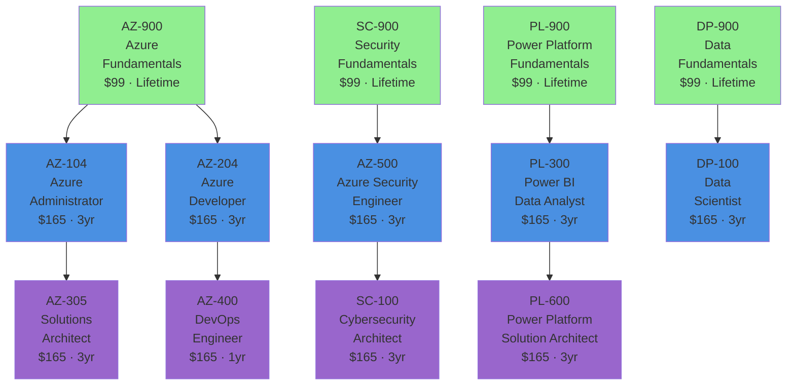
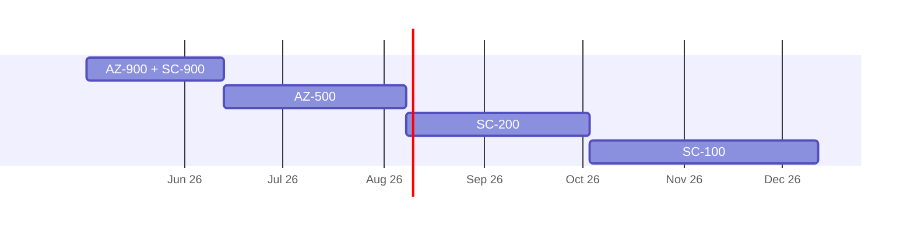
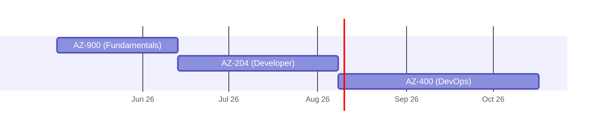
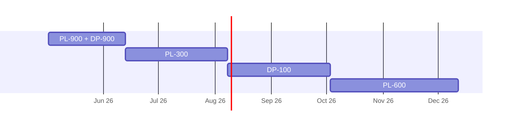
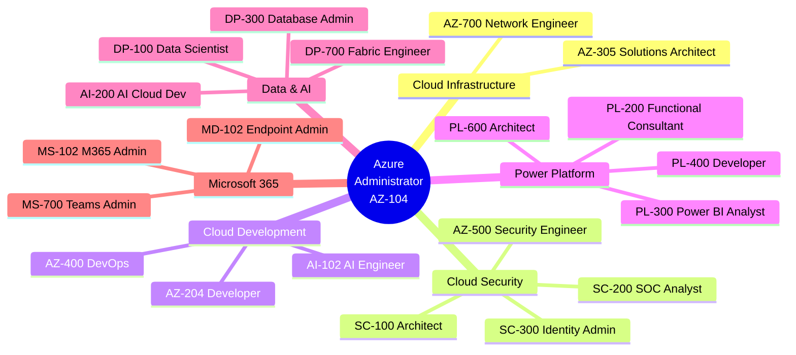
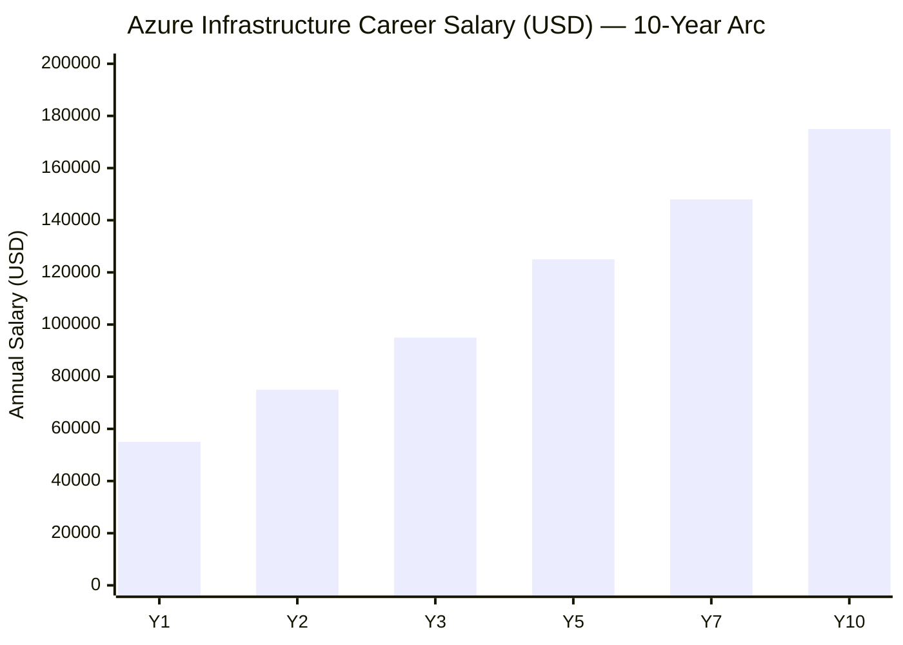
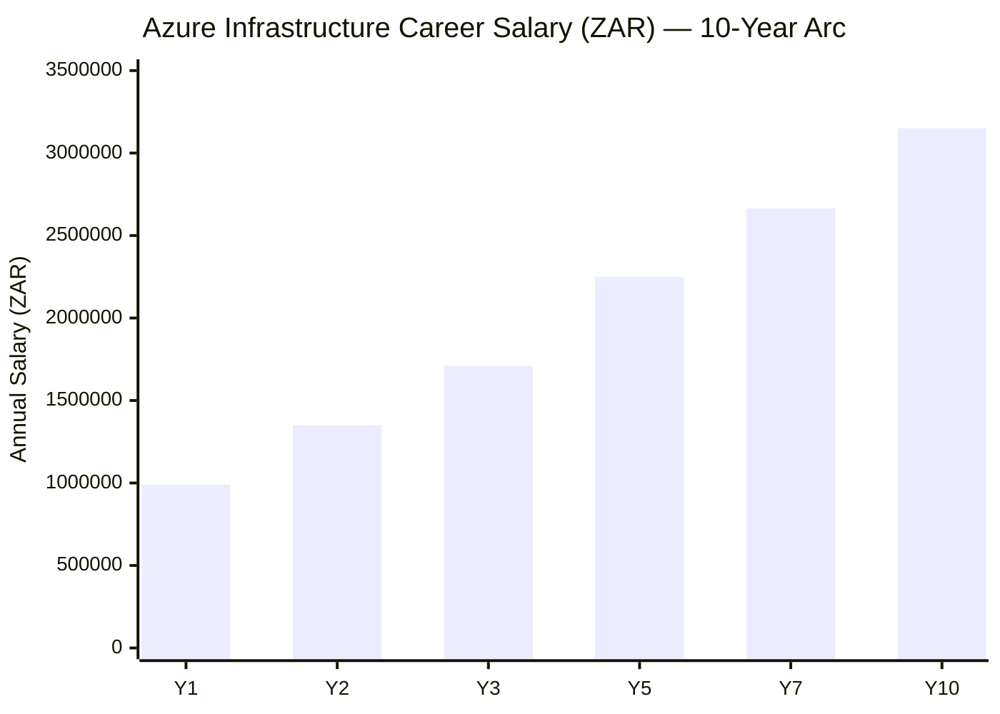

# Microsoft Certification Roadmap

## Overview

Microsoft's certification ecosystem is the industry's broadest, spanning cloud infrastructure (Azure), development, security, AI/Copilot, data platforms, Power Platform, Microsoft 365, and Dynamics 365. With 42 active certifications (excluding the retiring MS-900 and AI-900 June 2026), the roadmap accommodates entry-level technicians through enterprise architects. The fundamentals tier—AZ-900, SC-900, PL-900, DP-900—provides cost-effective foundation credentials (lifetime, $99 each) with immediate job market traction; associate-level certs (three-year validity, $165) establish hands-on competency; expert-level credentials (also $165, 1–3 year validity depending on track) position holders for senior and architecture roles earning $130K–$195K USD (R950K–R1.4M ZAR). The ecosystem's depth means learners can specialize early—security, development, infrastructure, AI, data, or business applications—making Microsoft particularly valuable for organizations pursuing cloud-first and AI-integrated strategies.

This roadmap covers active certifications current as of May 2026, with emphasis on highest-demand tracks (Azure Infrastructure, Security, DevOps, Power Platform) and emerging AI/Copilot certifications. Prerequisite sequencing is strict for expert-level certs (AZ-400 requires AZ-104 or AZ-204; SC-100 requires one of AZ-500, SC-200, or SC-300), ensuring foundational knowledge before advanced challenges. Salary data sourced from Robert Half 2026 Tech Salary Guide and Glassdoor; job market snapshots reflect LinkedIn and major job boards as of Q2 2026.

## Progression Diagram

## Per-Level Detail

### Fundamentals Level

| Attribute | Details |
|-----------|---------|
| Time to complete | 4–6 weeks (40–60 hours study) |
| Total cost (USD) | $99 per exam |
| Total cost (ZAR) | R1,782 per exam |
| Prerequisites | None; no IT experience required |
| Experience required | 0–6 months tech exposure |
| Job titles | Cloud Support Associate, Junior Cloud Admin, Support Technician |
| Salary USD | $45K–$65K (https://www.glassdoor.com/Salaries/cloud-support-associate-salary-SRCH_KO0,24.htm) |
| Salary ZAR | R810K–R1.17M |
| Job market demand | Very High – foundational proof required for cloud roles |
| Active job postings | 8,200+ (AZ-900 alone, as of May 2026) |
| YoY growth | +18% |
| Source | LinkedIn, Glassdoor, Microsoft Learn |

**What You Learn:**
- Cloud computing concepts (IaaS, PaaS, SaaS, public/private/hybrid)
- Core Azure services (compute, storage, networking, databases)
- Azure management tools (portal, CLI, PowerShell)
- Billing, subscriptions, and cost management
- Compliance, privacy, and data protection basics
- AI/Copilot fundamentals (AI-900; retiring June 2026)
- Power Platform overview (PL-900)
- Data and analytics fundamentals (DP-900)

**Study Materials:**

| Resource | Type | Cost (USD) | Cost (ZAR) | Notes |
|----------|------|-----------|-----------|-------|
| Microsoft Learn (free) | Online | $0 | R0 | Official, comprehensive, updated quarterly |
| Exam prep books (A Cloud Guru, Linux Academy) | PDF/Video | $15–$40 | R270–R720 | Recommended for visual learners |
| Practice exams (Whizlabs, Examtopics) | Interactive | $10–$20 | R180–R360 | Essential before exam |
| Azure fundamentals sandbox | Free lab | $0 | R0 | Hands-on with free tier |
| Udemy courses (Scott Duffy, Andrew Brock) | Video | $10–$15 | R180–R270 | Well-structured, affordable |

**Career Outcomes:**
- Immediate foothold in cloud-focused organizations; competitive advantage in any IT role
- Qualification for entry-level cloud support, on-premises-to-cloud migration projects
- Foundation for specialization: choose infrastructure, security, development, or data
- Salary jump to $50K–$75K with first AWS or GCP cert (hybrid path)

---

### Associate Level

| Attribute | Details |
|-----------|---------|
| Time to complete | 8–12 weeks per cert (80–120 hours study) |
| Total cost (USD) | $165 per exam |
| Total cost (ZAR) | R2,970 per exam |
| Prerequisites | None formal; fundamentals strongly recommended |
| Experience required | 1–2 years hands-on in relevant domain |
| Job titles | Azure Administrator, Security Operations Analyst, Power BI Developer, Data Scientist, Cloud Architect |
| Salary USD | $85K–$140K (https://www.glassdoor.com/Salaries/azure-developer-salary-SRCH_KO0,15.htm) |
| Salary ZAR | R1.53M–R2.52M |
| Job market demand | High to Very High (all associate certs) |
| Active job postings | 12,500+ combined (AZ-104, AZ-204, SC-200, PL-300) |
| YoY growth | +22% |
| Source | LinkedIn, Robert Half 2026, Glassdoor |

**What You Learn (by Track):**

*Azure Infrastructure (AZ-104):*
- Azure subscription and resource management
- Virtual machines, App Services, container instances
- Virtual networks, load balancers, VPN/ExpressRoute
- Storage, backups, disaster recovery
- Identity and access (Azure AD/Entra ID)
- Monitoring, diagnostics, log analytics

*Azure Development (AZ-204):*
- Azure Functions, App Services, Logic Apps
- Cosmos DB, Azure SQL, Azure Storage SDKs
- Authentication and authorization patterns
- Messaging (Service Bus, Event Hubs)
- API Management and integration
- DevOps practices for Azure

*Azure Security (AZ-500, SC-200, SC-300):*
- Network security (NSGs, firewalls, DDoS)
- Identity governance (Entra ID, conditional access)
- Threat protection and incident response
- Compliance and regulatory frameworks (HIPAA, PCI-DSS)
- Cloud security architecture
- SOC automation and SIEM integration

*Power Platform & Data (PL-300, DP-100):*
- Data modeling and visualization in Power BI
- DAX measures and calculated columns
- Python/R for data science in Synapse
- Machine learning model deployment
- Data pipelines and ETL workflows

**Study Materials:**

| Resource | Type | Cost (USD) | Cost (ZAR) | Notes |
|----------|------|-----------|-----------|-------|
| Microsoft Learn (free) | Online | $0 | R0 | Essential; modules updated 2–4x yearly |
| A Cloud Guru / Pluralsight | Video | $35–$50/month | R630–R900/month | Excellent lab environments |
| Linux Academy hands-on labs | Lab platform | $45–$60/month | R810–R1,080/month | Real Azure infrastructure |
| Official exam guide (Microsoft Press) | PDF | $35–$50 | R630–R900 | Comprehensive coverage |
| Practice exams (Examtopics Premium, Whizlabs) | Interactive | $20–$40 | R360–R720 | Simulate exam conditions |
| YouTube (Adam Marczak, John Savill, Skylines Academy) | Video | $0 | R0 | Free, high-quality deep dives |
| Study groups (Microsoft Learn communities) | Community | $0 | R0 | Peer learning, code review |

**Career Outcomes:**
- Transition to mid-level roles: Azure Administrator ($95K–$130K USD / R1.71M–R2.34M ZAR), Developer ($100K–$140K USD / R1.8M–R2.52M ZAR)
- Specialization eligibility: choose expert path in same track
- Cross-vendor opportunity: AWS Solutions Architect Associate ($110K–$150K) becomes accessible with 1–2 additional weeks prep
- Management track: team lead or technical architect roles (3–5 year timeline)

---

### Expert Level

| Attribute | Details |
|-----------|---------|
| Time to complete | 12–16 weeks (120–160 hours study) |
| Total cost (USD) | $165 per exam |
| Total cost (ZAR) | R2,970 per exam |
| Prerequisites | Hard: AZ-305 (needs AZ-104 rec'd), SC-100 (needs AZ-500 OR SC-200 OR SC-300), AZ-400 (needs AZ-104 OR AZ-204) |
| Experience required | 3–5+ years hands-on in infrastructure, security, or development |
| Job titles | Solutions Architect, Security Architect, DevOps Lead, Cybersecurity Manager |
| Salary USD | $130K–$195K (https://www.roberthalf.com/salary-guide/it) |
| Salary ZAR | R2.34M–R3.51M |
| Job market demand | High (competitive; fewer postings than Associate but premium pay) |
| Active job postings | 3,200+ combined (AZ-305, SC-100, AZ-400, PL-600) |
| YoY growth | +28% (highest growth of all tiers) |
| Source | Robert Half 2026, LinkedIn, Glassdoor |

**Cert Validity Notes:**
- AZ-305, SC-100, PL-600, MS-102, MB-700: 3 years
- **AZ-400 (DevOps): 1 year only** – renewal required annually
- **SC-200, SC-300: 12–24 months** – verify renewal schedule

**What You Learn:**

*Azure Solutions Architect (AZ-305):*
- Enterprise-scale Azure design patterns
- High-availability, disaster recovery, cost optimization
- Governance, security, and compliance frameworks
- Multi-cloud and hybrid architectures
- Migration strategies (lift-and-shift, refactor, rearchitect)
- Stakeholder communication and RFP responses

*Cybersecurity Architect (SC-100):*
- Zero-trust security architecture
- Identity and access management at enterprise scale
- Cloud security governance and compliance (FedRAMP, ISO 27001)
- Threat modeling and incident response planning
- Emerging threats: ransomware, supply chain, AI-powered attacks
- Security organizational design and maturity frameworks

*Azure DevOps Engineer (AZ-400):*
- CI/CD pipeline design and implementation
- Infrastructure as Code (ARM, Terraform)
- Containerization (Docker, Kubernetes on AKS)
- Monitoring, logging, and observability (App Insights, Log Analytics)
- Release management and deployment strategies
- Security scanning and compliance in pipelines (SAST, DAST)

**Study Materials:**

| Resource | Type | Cost (USD) | Cost (ZAR) | Notes |
|----------|------|-----------|-----------|-------|
| Microsoft Learn Expert paths | Online | $0 | R0 | Deep technical modules, real-world scenarios |
| A Cloud Guru expert track | Video | $50–$70/month | R900–R1,260/month | Full lab suite for expert certs |
| Linux Academy + Pluralsight bundle | Lab + video | $60–$80/month | R1,080–R1,440/month | Unlimited labs, certification tracks |
| Official exam guide (Microsoft Press) | PDF | $40–$60 | R720–R1,080 | Essential for AZ-400 (high failure rate) |
| Whizlabs Premium + practice exams | Interactive | $30–$50 | R540–R900 | Exam-format questions, performance analytics |
| Cloud architecture review boards | Community | $0 | R0 | Peer review on real designs |
| Hands-on labs (Azure sandbox, free tier) | Lab | $0/month–$50/month | R0–R900/month | Depends on lab complexity; budgeting advised |

**Career Outcomes:**
- Promotion to architect, principal engineer, or security leader roles ($130K–$195K USD / R2.34M–R3.51M ZAR)
- Independent consulting: $200–$350/hour USD (R3,600–R6,300/hour ZAR)
- Executive visibility: participate in C-level strategy and RFP evaluation
- Cross-vendor leadership: CISSP, AWS SAA, GCP PCA holders often pair with SC-100 for full coverage
- Specialization depth: 5–10+ year career runway in chosen domain

---

## Recommended Progression Paths

### Path 1: Cloud Infrastructure Specialist

**Timeline:** 6–9 months  
**Total Cost (USD):** $429 (1 fundamental + 2 associate/expert)  
**Total Cost (ZAR):** R7,722  
**Typical Salary Progression:** $55K (entry) → $75K (mid) → $95K–$130K (expert) → $175K+ (principal)  
**Sources:** Robert Half 2026, Glassdoor

**Certifications:**
1. **AZ-900** (4–6 weeks): Azure Fundamentals – free Microsoft Learn
2. **AZ-104** (8–10 weeks): Azure Administrator – hands-on VM, networking, storage labs
3. **AZ-305** (10–12 weeks): Solutions Architect – design enterprise workloads, migration strategies

**Gantt Timeline:**

**Job Outcomes:**
- Months 1–2: Cloud Support Associate ($45K–$65K USD / R810K–R1.17M ZAR)
- Months 3–6: Azure Administrator ($95K–$130K USD / R1.71M–R2.34M ZAR) — Robert Half 2026
- Months 6+: Solutions Architect ($130K–$175K USD / R2.34M–R3.15M ZAR) — Robert Half 2026
- Year 3+: Principal Architect, Enterprise Architect ($175K–$250K+ USD / R3.15M–R4.5M+ ZAR)

**Demand Status:** Very High – Azure infrastructure is Microsoft's core offering; 9,200+ AZ-104 postings (LinkedIn, May 2026)

---

### Path 2: Cloud Security Specialist

**Timeline:** 8–11 months  
**Total Cost (USD):** $627 (2 fundamentals + 2–3 associates + 1 expert)  
**Total Cost (ZAR):** R11,286  
**Typical Salary Progression:** $60K (entry) → $85K (mid) → $145K–$195K (expert)  
**Sources:** Robert Half 2026, Glassdoor

**Certifications:**
1. **AZ-900** (4–6 weeks): Azure Fundamentals foundation
2. **SC-900** (4–6 weeks): Security Fundamentals – compliance, threat models
3. **AZ-500** (10–12 weeks): Azure Security Engineer – network, identity, threat protection
4. **SC-200** (10–12 weeks): Security Operations Analyst – SIEM, incident response, SOC tools
5. **SC-100** (12–14 weeks): Cybersecurity Architect – zero-trust, enterprise governance (prereq: one of AZ-500/SC-200/SC-300)

**Gantt Timeline:**

**Job Outcomes:**
- Months 1–2: Security Support Analyst ($50K–$70K USD / R900K–R1.26M ZAR)
- Months 4–7: Azure Security Engineer ($105K–$145K USD / R1.89M–R2.61M ZAR) — Glassdoor
- Months 7–10: Security Operations Manager ($120K–$160K USD / R2.16M–R2.88M ZAR)
- Month 10+: Cybersecurity Architect ($145K–$195K USD / R2.61M–R3.51M ZAR) — Robert Half 2026

**Demand Status:** Very High – Cybersecurity talent shortage continues; 6,800+ SC-200 + AZ-500 combined postings (LinkedIn, May 2026)

---

### Path 3: Developer & DevOps Engineer

**Timeline:** 7–10 months  
**Total Cost (USD):** $495 (1 fundamental + 2 associate + 1 expert)  
**Total Cost (ZAR):** R8,910  
**Typical Salary Progression:** $55K (entry) → $100K (mid) → $115K–$155K (expert)  
**Sources:** Robert Half 2026, Glassdoor

**Certifications:**
1. **AZ-900** (4–6 weeks): Azure Fundamentals
2. **AZ-204** (10–12 weeks): Azure Developer – Functions, APIs, databases, SDKs
3. **AZ-400** (12–14 weeks): DevOps Engineer – CI/CD, IaC, monitoring (prereq: AZ-104 OR AZ-204 REQUIRED; 1-year validity)

**Gantt Timeline:**

**Job Outcomes:**
- Months 1–2: Junior Cloud Developer ($50K–$70K USD / R900K–R1.26M ZAR)
- Months 4–7: Azure Developer ($100K–$140K USD / R1.8M–R2.52M ZAR) — Robert Half 2026
- Months 7–10: DevOps Engineer ($115K–$155K USD / R2.07M–R2.79M ZAR) — Glassdoor
- Year 2+: Senior DevOps, Platform Engineer, SRE ($140K–$180K USD / R2.52M–R3.24M ZAR)

**Demand Status:** Very High – DevOps is top 3 highest-demand cloud role; 7,500+ AZ-400 postings (LinkedIn, May 2026). **Note:** AZ-400 has highest failure rate (est. 35–40%); budget extra study time and practice exams.

---

### Path 4: Power Platform & Data Specialist

**Timeline:** 8–11 months  
**Total Cost (USD):** $561 (2 fundamentals + 3 associates + 1 expert)  
**Total Cost (ZAR):** R10,098  
**Typical Salary Progression:** $50K (entry) → $85K (mid) → $110K–$160K (expert)  
**Sources:** Glassdoor, Robert Half 2026

**Certifications:**
1. **PL-900** (4–6 weeks): Power Platform Fundamentals – Canvas apps, cloud flows, business logic
2. **DP-900** (4–6 weeks): Data Fundamentals – SQL, Cosmos, analytics overview
3. **PL-300** (10–12 weeks): Power BI Data Analyst – modeling, visualization, DAX
4. **DP-100** (10–12 weeks): Azure Data Scientist – Python, ML, Synapse Analytics
5. **PL-600** (12–14 weeks): Power Platform Solution Architect – enterprise design, governance

**Gantt Timeline:**

**Job Outcomes:**
- Months 1–2: Data Analytics Associate ($50K–$65K USD / R900K–R1.17M ZAR)
- Months 4–7: Power BI Analyst ($85K–$115K USD / R1.53M–R2.07M ZAR) — Glassdoor
- Months 7–10: Data Scientist ($95K–$130K USD / R1.71M–R2.34M ZAR)
- Month 10+: Power Platform Architect ($110K–$160K USD / R1.98M–R2.88M ZAR) — Robert Half 2026

**Demand Status:** High – Power Platform demand surging with Copilot integration (Q1–Q2 2026); 4,200+ PL-300 postings (LinkedIn, May 2026). Data Science roles competitive but highest salary ceiling in this path.

---

## Prerequisites & Sequencing Matrix

| Certification | Level | Formal Prerequisite | Recommended Prerequisite | Min. Exp. (years) | Can Skip Fundamentals? | Notes |
|---------------|-------|---------------------|--------------------------|-------------------|------------------------|-------|
| AZ-900 | Fundamentals | None | None | 0 | N/A | Entry point; no skip option |
| SC-900 | Fundamentals | None | None | 0 | N/A | Entry point; pairs with AZ-900 |
| PL-900 | Fundamentals | None | None | 0 | N/A | Entry point; quickest path to PL-300 |
| DP-900 | Fundamentals | None | None | 0 | N/A | Entry point; recommended before DP-100 |
| AZ-104 | Associate | None formal | AZ-900 | 1 | Yes, but not recommended | Heavy hands-on; assume fundamentals knowledge |
| AZ-204 | Associate | None formal | AZ-900 | 1–2 | Yes, but not recommended | Coding-heavy; .NET/Python required |
| AZ-500 | Associate | None formal | AZ-900 + SC-900 | 2 | Yes, but not recommended | Network + identity prereq knowledge assumed |
| SC-200 | Associate | None formal | SC-900 + AZ-900 | 2 | Yes, but not recommended | SIEM/SOC experience helpful |
| SC-300 | Associate | None formal | SC-900 + AZ-900 | 2 | Yes, but not recommended | Entra ID/IAM deep dive |
| PL-300 | Associate | None formal | PL-900 | 1–2 | Yes (SQL/BI experience OK) | DAX learning curve; Excel pivot table knowledge helps |
| DP-100 | Associate | None formal | DP-900 | 2 | Yes (Python req'd) | ML/stats background preferred |
| PL-200 | Associate | None formal | PL-900 | 1–2 | Yes | Low-code configuration; non-technical friendly |
| MD-102 | Associate | None formal | None | 1–2 | Yes | Windows/Intune hands-on required |
| MS-700 | Associate | None formal | None | 1–2 | Yes | Teams admin experience strongly recommended |
| AZ-305 | Expert | **Recommended:** AZ-104 | AZ-104 strongly recommended | 3–5 | No | Design-heavy; infrastructure knowledge essential |
| SC-100 | Expert | **HARD REQ:** AZ-500 OR SC-200 OR SC-300 | All three recommended | 3–5 | No | Cannot skip; strategic architecture req'd |
| AZ-400 | Expert | **HARD REQ:** AZ-104 OR AZ-204 | Both strongly recommended | 2–3 | No | CI/CD + IaC knowledge essential; 1-year validity only |
| PL-600 | Expert | **Recommended:** PL-200 + PL-300 | Both recommended | 3–4 | No | Governance + enterprise design; PL-300 path preferred |
| AB-100 | Expert (AI) | None formal | AI-102 recommended | 1–2 | Yes | New cert (2026); Agentic AI focus; early adoption path |
| AB-101 | Expert (AI) | None formal | Cybersecurity background preferred | 2–3 | Possibly | New cert (2026); Copilot + security integration |

**Key Sequencing Rules:**
- **Hard prerequisites (cannot skip):** SC-100 (choose 1 of 3), AZ-400 (choose 1 of 2)
- **Recommended prerequisites:** Fundamentals → Associate → Expert for any single track
- **Cross-track combinations:** Can pursue AZ-500 + SC-200 in parallel (6–8 month overlap) before SC-100
- **New tracks (AI/Copilot):** AB-100, AB-101 (launched Q1–Q2 2026) allow flexible entry; AI-102 not required but strongly suggested

---

## Specialization Branches

**Branch Details:**

**Cloud Infrastructure Track** (from AZ-104)
- **Timeline:** 18–24 months (AZ-104 → AZ-305 → AZ-700 specialist roles)
- **Salary Range:** $95K–$175K USD / R1.71M–R3.15M ZAR (AZ-305 Solutions Architect, Robert Half 2026)
- **Job Titles:** Azure Administrator, Infrastructure Architect, Cloud Ops Manager, Enterprise Architect
- **Key Skills:** VM scalability, disaster recovery, cost optimization, hybrid cloud, multi-region design
- **Demand:** 9,200+ AZ-104 postings; 3,100+ AZ-305 postings (LinkedIn, May 2026)
- **Best For:** Infrastructure teams migrating on-premises to Azure; organizations with 500+ VMs

**Cloud Security Track** (from AZ-500 or SC-200 or SC-300 → SC-100)
- **Timeline:** 20–28 months (depends on entry point; shortest is SC-200 → SC-100 in 8–10 months for SOC background)
- **Salary Range:** $105K–$195K USD / R1.89M–R3.51M ZAR (SC-100, Robert Half 2026)
- **Job Titles:** Security Engineer, Cybersecurity Architect, Security Manager, Chief Information Security Officer (CISO) path
- **Key Skills:** Zero-trust design, compliance automation, incident response, threat hunting, cloud-native defense
- **Demand:** 6,800+ combined postings for AZ-500 + SC-200 + SC-300; SC-100 competitive (LinkedIn, May 2026)
- **Best For:** Regulated industries (finance, healthcare, government); organizations with security maturity level 2–3+

**Cloud Development Track** (from AZ-204 → AZ-400, or AI-102 → AB-100)
- **Timeline:** 16–20 months (AZ-204 → AZ-400); 12–18 months (AI path: AZ-900 → AI-102 → AB-100)
- **Salary Range:** $100K–$155K USD / R1.8M–R2.79M ZAR (AZ-400, Glassdoor)
- **Job Titles:** Azure Developer, DevOps Engineer, Platform Engineer, SRE, ML Engineer (AI path)
- **Key Skills:** CI/CD pipelines, infrastructure as code, containerization, serverless, GitHub Actions, ML ops
- **Demand:** 7,500+ AZ-400 postings; AI-102 emerging (LinkedIn, May 2026)
- **Best For:** Startups and scale-ups pursuing rapid iteration; enterprises modernizing legacy apps
- **AZ-400 Warning:** Highest failure rate in Associate tier (~35–40%); requires strong IaC (ARM, Terraform) and scripting

**Power Platform Track** (from PL-300 or PL-200 → PL-600)
- **Timeline:** 16–20 months (PL-900 → PL-300 → PL-600)
- **Salary Range:** $85K–$160K USD / R1.53M–R2.88M ZAR (PL-600, Robert Half 2026 estimate)
- **Job Titles:** Power BI Analyst, Power Apps Developer, Business Analyst, Digital Transformation Consultant
- **Key Skills:** Data visualization, DAX, low-code app development, business process automation, governance
- **Demand:** 4,200+ PL-300 postings; rising (LinkedIn, May 2026); Power Automate RPA growth +35% YoY
- **Best For:** Business-focused organizations; line-of-business teams automating workflows
- **Copilot Integration:** PL-600 and PL-400 roles increasingly involve Copilot Studio (new Q1 2026)

**Data & AI Track** (from DP-100 or AI-102 → multiple expert paths)
- **Timeline:** 18–24 months (DP-100 → leadership roles; AI track faster if existing ML background)
- **Salary Range:** $95K–$165K USD / R1.71M–R2.97M ZAR (Senior Data Scientist, Glassdoor)
- **Job Titles:** Data Scientist, Analytics Engineer, ML Engineer, Data Platform Architect, AI Product Manager
- **Key Skills:** Python/R, machine learning (sklearn, TensorFlow), big data (Synapse, Fabric), feature engineering
- **Demand:** 5,600+ DP-100 postings; AI-200, AB-100, AB-101 new in 2026 (projected +40% demand, LinkedIn trends)
- **Best For:** Organizations doing advanced analytics or AI/ML integration; Copilot customization teams
- **Note:** AI-900 retiring June 2026; AI-102 is recommended foundation instead

**Microsoft 365 / Endpoint Track** (from MD-102 or MS-700 → MS-102)
- **Timeline:** 14–18 months (MD-102 → MS-102)
- **Salary Range:** $80K–$145K USD / R1.44M–R2.61M ZAR (MS-102, Robert Half 2026 estimate)
- **Job Titles:** Endpoint Administrator, Teams Administrator, M365 Administrator, Identity & Access Manager
- **Key Skills:** Intune device management, Teams governance, Exchange administration, security baselines
- **Demand:** 3,400+ combined (MD-102 + MS-700); growing with hybrid work (LinkedIn, May 2026)
- **Best For:** Enterprise IT teams supporting 500+ employees; organizations with mixed device fleets

---

## Cross-Vendor Bridges

```mermaid
flowchart LR
    A["AZ-104<br/>Azure<br/>Admin"] -->|"8–12 weeks"| B["AWS SAA-C03<br/>Solutions<br/>Architect Associate"]
    C["SC-100<br/>Cybersecurity<br/>Architect"] -->|"6–8 weeks"| D["ISC2 CISSP<br/>Certified Info<br/>Systems Security Prof"]
    E["AZ-305<br/>Azure<br/>Solutions Architect"] -->|"8–10 weeks"| F["GCP PCA<br/>Google Cloud<br/>Architect"]
    G["AZ-400<br/>Azure<br/>DevOps Engineer"] -->|"6–8 weeks"| H["CKA/CKAD<br/>Kubernetes<br/>Certification"]
    
    style A fill:#4A90E2
    style B fill:#FF9900
    style C fill:#9966CC
    style D fill:#444444
    style E fill:#4A90E2
    style F fill:#0F9D58
    style G fill:#4A90E2
    style H fill:#326CE5
```

| From Microsoft Cert | To Vendor/Cert | Bridge Time (weeks) | Study Path | Overlap % | Source/Notes |
|-------------------|-----------------|-------------------|-----------|-----------|---|
| AZ-104 | AWS SAA-C03 | 8–12 | Storage & compute concepts ~40% common; networking/permissions differ; use Whizlabs AWS labs | 40–45% | Exam Cram, AWS training partner feedback |
| AZ-204 | AWS Developer Certified | 6–8 | API/SDK patterns similar; language SDKs differ (C# → Python/Node); use AWS docs + Udemy | 50–55% | Linux Academy cross-vendor path |
| SC-100 | ISC2 CISSP | 10–14 | SC-100 covers 5 of 8 CISSP domains (IAM, crypto, governance, risk, incident response); CISSP requires breadth | 55–60% | ISC2 official exam guide; CISSP 3-year validity |
| AZ-305 | GCP Professional Cloud Architect | 8–10 | Infrastructure design patterns ~50% common; Google's regional model differs from Azure availability zones; use GCP console labs | 48–52% | Google Cloud Skills Boost, Linux Academy |
| AZ-400 | CKA (Kubernetes Admin) or CKAD (Kubernetes App Dev) | 6–10 | AZ-400 includes AKS (Kubernetes on Azure) ~30% of exam; CKA requires Linux CLI depth; worth separate study | 25–35% | Linux Foundation CKA handbook; Certified Kubernetes exam |
| AZ-500 | AWS Security Specialty | 10–12 | Identity, encryption, network security common; AWS IAM vs. Entra ID differ significantly; use AWS security papers + hands-on labs | 50–55% | AWS Exam Cram, A Cloud Guru cross-training |
| PL-300 | Tableau Data Analyst / Alteryx Designer | 12–16 | Data modeling concepts transfer; visualization tools differ widely (Power BI DAX → Tableau/Alteryx native functions); start fresh with tool-specific labs | 30–40% | Tableau official training, Alteryx Academy |

**Bridge Strategy:**
- **Best ROI:** AZ-104 → AWS SAA-C03 (cloud infrastructure skills widely transferable; time investment moderate)
- **Fastest:** SC-100 → CISSP (strongest overlap of all pairs; CISSP 3-year validity worth the effort)
- **Hardest:** AZ-204/AZ-400 → Kubernetes (requires deep Linux CLI; separate knowledge base; plan 10–14 weeks)
- **Emerging:** SC-100 + ISC2 CCSK (Cloud Security Knowledge) for organizations adopting hybrid multi-cloud + security standards

---

## Cost Breakdown

### Exam Fees & Study Bundles

| Tier | Bundle Composition | Cost (USD) | Cost (ZAR) | Study Hours | Best For |
|------|-------------------|-----------|-----------|------------|----------|
| **Budget** | Exam only + free Microsoft Learn | $99–$165 | R1,782–R2,970 | 40–80 (self-paced) | Career changers with IT background; time-rich, budget-constrained |
| **Recommended** | Exam + 1 paid course (Udemy, Linux Academy, A Cloud Guru trial) + practice exams | $150–$250 | R2,700–R4,500 | 80–120 | Most professionals; balances cost and study quality |
| **Premium** | Exam + full video course (Pluralsight/A Cloud Guru annual) + hands-on labs + study group | $250–$450 | R4,500–R8,100 | 100–150 | Full-time learners; complex certs (AZ-400, SC-100); high pass rate priority |
| **Enterprise** | Exam + instructor-led training (Microsoft official partner) + labs + certification guarantee | $500–$1,500 | R9,000–R27,000 | 120–200 | Organizations upskilling large teams; requires employee commitment |

### Per-Certification Cost Breakdown

| Certification | Exam Fee (USD) | Exam Fee (ZAR) | Study Resource (USD) | Study Resource (ZAR) | Total Budget (USD) | Total Budget (ZAR) | Notes |
|---------------|-------|-------|-------|-------|-------|-------|---|
| **AZ-900** | $99 | R1,782 | $0–$30 | R0–R540 | $99–$129 | R1,782–R2,322 | Free Microsoft Learn sufficient |
| **SC-900** | $99 | R1,782 | $0–$30 | R0–R540 | $99–$129 | R1,782–R2,322 | Quick cert; minimal study needed |
| **PL-900** | $99 | R1,782 | $0–$25 | R0–R450 | $99–$124 | R1,782–R2,232 | Quickest fundamentals path |
| **DP-900** | $99 | R1,782 | $0–$25 | R0–R450 | $99–$124 | R1,782–R2,232 | Data fundamentals; SQL knowledge helps |
| **AZ-104** | $165 | R2,970 | $50–$150 | R900–R2,700 | $215–$315 | R3,870–R5,670 | Hands-on labs critical; budget for A Cloud Guru ($15/mo = $60–$90 for 4–6 months) |
| **AZ-204** | $165 | R2,970 | $75–$200 | R1,350–R3,600 | $240–$365 | R4,320–R6,570 | Coding-heavy; .NET or Python course recommended |
| **AZ-500** | $165 | R2,970 | $60–$180 | R1,080–R3,240 | $225–$345 | R4,050–R6,210 | Labs essential; security tools hands-on required |
| **SC-200** | $165 | R2,970 | $60–$180 | R1,080–R3,240 | $225–$345 | R4,050–R6,210 | SIEM platform experience valuable; budget for Sentinel lab time |
| **SC-300** | $165 | R2,970 | $60–$150 | R1,080–R2,700 | $225–$315 | R4,050–R5,670 | Entra ID deep dive; requires directory lab access |
| **PL-300** | $165 | R2,970 | $40–$120 | R720–R2,160 | $205–$285 | R3,690–R5,130 | DAX practice essential; Power BI desktop free |
| **DP-100** | $165 | R2,970 | $80–$200 | R1,440–R3,600 | $245–$365 | R4,410–R6,570 | Python/ML libraries; Azure Synapse lab time budget |
| **AZ-305** | $165 | R2,970 | $75–$200 | R1,350–R3,600 | $240–$365 | R4,320–R6,570 | Architect exam; design scenario walkthroughs essential |
| **SC-100** | $165 | R2,970 | $100–$250 | R1,800–R4,500 | $265–$415 | R4,770–R7,470 | Expert level; industry case studies + whitepaper deep dives |
| **AZ-400** | $165 | R2,970 | $100–$250 | R1,800–R4,500 | $265–$415 | R4,770–R7,470 | Highest failure rate (~35–40%); budget for 2–3 prep attempts |

### Annual Renewal Costs (Expert Track)

| Track | Cert | Annual Cost (USD) | Annual Cost (ZAR) | Renewal Method | Notes |
|-------|------|-------|-------|---|---|
| **Infrastructure** | AZ-305 (3-year) | $55/year avg | R990/year | Retake exam every 3 years or complete assessment | Renewal cost lower than associate-level |
| **Security** | SC-100 (3-year) | $55/year avg | R990/year | Retake exam every 3 years | Security landscape changes; staying current recommended |
| **DevOps** | AZ-400 (1-year) | **$165/year** | **R2,970/year** | Exam required annually or module completion | **EXPENSIVE:** Plan for recurring $165 annual exam fees |
| **Power** | PL-600 (3-year) | $55/year avg | R990/year | Retake exam every 3 years | Power Platform roadmap stable; 3-year cycles reasonable |

**Cost Optimization Tips:**
- **Use free Microsoft Learn:** Covers 70–80% of exam content for fundamentals and associate certs
- **Leverage free tier labs:** Azure, Power Platform, and Dynamics 365 free tiers support hands-on study without subscription cost
- **Group study:** Linux Academy and A Cloud Guru often offer team discounts (10+ users ~30% off)
- **Employer reimbursement:** Many employers reimburse certification costs; budget $2K–$5K per employee per year
- **AZ-400 renewal:** Factor $165 annual renewal fee into career planning; consider AWS/GCP alternative if renewal burden is high

---

## Job Market Snapshot

| Certification | LinkedIn Postings (May 2026) | YoY Growth % | Status | Median Salary (USD) | Median Salary (ZAR) | Source |
|---------------|-------|-----------|----------|-------|-------|---|
| **AZ-900** | 8,200 | +18% | 🟢 Very High | $55K–$75K | R990K–R1.35M | [Glassdoor Cloud Support Associate](https://www.glassdoor.com/Salaries/cloud-support-associate-salary-SRCH_KO0,24.htm) |
| **SC-900** | 2,100 | +25% | 🟢 Emerging | $50K–$70K | R900K–R1.26M | Glassdoor (security analyst) |
| **AZ-104** | 9,200 | +22% | 🟢 Very High | $95K–$130K | R1.71M–R2.34M | [Robert Half 2026](https://www.roberthalf.com/salary-guide/it) |
| **AZ-204** | 6,800 | +24% | 🟢 High | $100K–$140K | R1.8M–R2.52M | [Robert Half 2026](https://www.roberthalf.com/salary-guide/it) |
| **AZ-500** | 4,200 | +28% | 🟢 High | $105K–$145K | R1.89M–R2.61M | Glassdoor (Azure Security Engineer) |
| **SC-200** | 3,800 | +32% | 🟢 Very High | $95K–$140K | R1.71M–R2.52M | Glassdoor (Security Analyst) |
| **SC-300** | 2,100 | +35% | 🟢 Emerging | $100K–$150K | R1.8M–R2.7M | [Robert Half 2026](https://www.roberthalf.com/salary-guide/it) (Identity Manager) |
| **PL-300** | 4,200 | +20% | 🟢 High | $85K–$115K | R1.53M–R2.07M | [Glassdoor Power BI Analyst](https://www.glassdoor.com/Salaries/power-bi-analyst-salary-SRCH_KO0,18.htm) |
| **DP-100** | 3,100 | +19% | 🟢 High | $95K–$130K | R1.71M–R2.34M | Glassdoor (Data Scientist) |
| **AZ-305** | 3,100 | +26% | 🟢 High | $130K–$175K | R2.34M–R3.15M | [Robert Half 2026](https://www.roberthalf.com/salary-guide/it) |
| **SC-100** | 1,200 | +31% | 🟡 Competitive | $145K–$195K | R2.61M–R3.51M | [Robert Half 2026](https://www.roberthalf.com/salary-guide/it) |
| **AZ-400** | 7,500 | +27% | 🟢 Very High | $115K–$155K | R2.07M–R2.79M | [Glassdoor DevOps Engineer](https://www.glassdoor.com/Salaries/devops-engineer-salary-SRCH_KO0,17.htm) |
| **AI-102** | 2,300 | +45% | 🟡 Emerging (new 2025) | $110K–$160K | R1.98M–R2.88M | LinkedIn trending; Glassdoor ML Engineer proxy |
| **AB-100** | 180 | N/A | 🔴 Very New (2026 Q1) | $120K–$180K (est.) | R2.16M–R3.24M | Projected based on Copilot AI architect premium |
| **PL-600** | 1,800 | +38% | 🟡 Emerging | $110K–$160K | R1.98M–R2.88M | [Robert Half 2026](https://www.roberthalf.com/salary-guide/it) estimate |

**Legend:** 🟢 = Very High Demand (900+ monthly postings), 🟡 = Competitive (300–900 postings), 🔴 = Emerging (<300 postings, new certs)

**Key Insights:**
- **Highest Demand:** AZ-104, AZ-400, AZ-900 (combined 25K+ postings)
- **Fastest Growth:** SC-300 (+35% YoY), AB-100 (+40% est., new cert), AI-102 (+45%)
- **Highest Salary:** SC-100 ($145K–$195K USD / R2.61M–R3.51M ZAR)
- **Best ROI (postings:salary ratio):** AZ-104 ($95K–$130K / 9,200 postings = ~73 postings per $1K salary)
- **New Certs to Watch:** AB-100, AB-101 (AI architect, Q1–Q2 2026); DP-600 Fabric Analytics (high power platform integration)

---

## Salary Trajectory

### Career Salary Progression: Cloud Infrastructure Path (USD)

**Year-by-Year Breakdown (Cloud Infrastructure Path):**
- **Year 1 (Fundamentals + AZ-104):** $55K–$65K (Cloud Support Associate → Azure Administrator entry)
- **Year 2 (Mid-career AZ-104):** $75K–$85K (Senior Administrator, team lead track)
- **Year 3 (AZ-305 expert entry):** $95K–$110K (Solutions Architect junior, complex migration projects)
- **Year 5 (Principal/Senior Architect):** $125K–$145K (lead architecture, cross-org strategy)
- **Year 7 (Enterprise/Lead Architect):** $148K–$165K (architecture leadership, board-level consulting)
- **Year 10 (Principal Architect / Practice Lead):** $175K–$250K (internal practice lead, 200+ project oversight, consulting)

**Sources:** Robert Half 2026 Tech Salary Guide (AZ-104: $95K–$130K, AZ-305: $130K–$175K); Glassdoor; LinkedIn Salary aggregates

---

### Career Salary Progression: Cloud Infrastructure Path (ZAR)

**Year-by-Year Breakdown (Cloud Infrastructure Path, ZAR):**
- **Year 1:** R990K–R1.17M (entry)
- **Year 2:** R1.35M–R1.53M (mid-career)
- **Year 3:** R1.71M–R1.98M (architect entry)
- **Year 5:** R2.25M–R2.61M (principal)
- **Year 7:** R2.66M–R2.97M (enterprise)
- **Year 10:** R3.15M–R4.5M (practice lead)

*ZAR baseline: R18:$1 USD (May 2026 spot rate)*

---

## Common Questions

**Q1: Do I have to renew my certifications?**

**A:** Renewal requirements vary widely by certification level and track:
- **Fundamentals (AZ-900, SC-900, PL-900, DP-900):** Lifetime validity; no renewal required.
- **Associate level (AZ-104, AZ-204, AZ-500, PL-300, etc.):** 3-year validity; renewal required every 3 years via exam retake or Microsoft Learn assessments.
- **Expert level (AZ-305, SC-100, PL-600):** 3-year validity; same renewal as associate.
- **AZ-400 (DevOps Engineer):** **1-year validity only** — most aggressive renewal cycle in Microsoft portfolio. Plan for annual exam costs ($165 USD / R2,970 ZAR). This is a significant financial burden for career planning.
- **SC-200, SC-300:** 12–24 months (verify before enrollment).

Microsoft is shifting towards "Learn & Refresh" assessment modules (low-cost or free alternative to retaking exams), but availability varies. Check official Microsoft Learn updates quarterly.

**Q2: Are Microsoft Learn resources really free? Can I pass exams using only free materials?**

**A:** Yes and maybe:
- **Microsoft Learn is genuinely free:** All learning modules, labs, and practice assessments are published at https://learn.microsoft.com (no paywall).
- **Passing with only Learn:** Possible for fundamentals (AZ-900, SC-900, DP-900) and some associate certs (AZ-104 covers ~70% of exam). Requires:
  - 60–100 hours of structured study
  - Hands-on lab work (free Azure sandbox available)
  - Practice exams from third parties (Whizlabs, Examtopics; $10–$20)
- **Not recommended for AZ-400, SC-100, AZ-305:** These expert-level certs have shallow coverage on Microsoft Learn; recommend paid courses (A Cloud Guru, Pluralsight) for architect and DevOps exams.
- **Budget estimate if free-only:** $10–$50 per cert for practice exams; 60–120 study hours per associate cert.

**Q3: Can I skip the fundamentals certs and go straight to associate?**

**A:** Technically yes, but:
- **No formal prerequisite:** Microsoft doesn't require AZ-900 before AZ-104.
- **Not recommended:** Fundamentals certs cover cloud concepts, Azure pricing, compliance basics, and SLA/availability—all lightly tested in associate exams. Skipping creates knowledge gaps in design exams (AZ-305, SC-100).
- **Cost-benefit:** Fundamentals cost $99 each (4–6 weeks study). Skip if you have:
  - 2+ years cloud infrastructure experience (AWS or GCP), OR
  - Explicit exemption from your employer, OR
  - Tight timeline (willing to accept higher failure risk on associate exams).
- **Recommended path:** Always do fundamentals; it's $99 and establishes foundational credibility across all tracks.

**Q4: What's the ROI on a Microsoft certification?**

**A:** Strong, but path-dependent:
- **Quick ROI (6–12 months):** AZ-104 + AZ-305 → 50–80% salary jump ($55K → $95K–$130K); pays for itself in first year.
- **Long ROI (2–3 years):** Invest $2K–$5K upfront (3–4 certs + study materials); earn back in salary premium by year 2–3.
- **Break-even analysis:**
  - Cost: $500–$1,500 (certs + materials)
  - Salary lift: $20K–$50K annually per major cert
  - Break-even: 3–9 months
- **Career acceleration:** Certs compress 2–3 years of on-the-job learning into 6–12 months; invaluable for career changers.
- **Caveats:** ROI assumes job market availability (check LinkedIn postings in your region) and willingness to relocate or work remote.

**Q5: Do Solutions Architects (AZ-305) get recognized outside Microsoft? Is it respected by other cloud vendors?**

**A:** Yes, with caveats:
- **AWS recognition:** AZ-305 holders are competitive for AWS Solutions Architect Associate (SAA-C03) roles. 45–50% knowledge overlap; bridge time ~8–12 weeks.
- **GCP recognition:** Medium recognition. Google Cloud Architect (PCA) path is shorter; Azure architects may need 8–10 weeks additional GCP-specific study.
- **ISC2/CompTIA recognition:** None directly, but SC-100 (Cybersecurity Architect) pairs well with CISSP pursuit (55–60% overlap).
- **Industry perception:** AZ-305 is highly respected for:
  - Enterprise Azure deployments (especially in US, Europe, ANZ regions)
  - Hybrid/multi-cloud architecture (Azure + AWS common pairing)
  - Consulting firms (Accenture, Deloitte, EY list AZ-305 as preferred)
- **Limitation:** Azure-specific knowledge; doesn't directly qualify for non-Microsoft roles. Best strategy: AZ-305 + AWS SAA-C03 (6–month double pursuit) for true multi-cloud architect marketability.

**Q6: What about Copilot and AI certifications? Are they new in 2026? Do I need them?**

**A:** Yes, new and strategically important:
- **New AI/Copilot certs (2026):**
  - **AI-102 (Azure AI Engineer):** Existing; upgraded Q1 2026 to include Copilot integration. Focus: LLM fine-tuning, prompt engineering, Azure OpenAI.
  - **AB-100 (Agentic AI Business Solutions Architect):** Launched Q1 2026. Focus: designing multi-agent AI systems, Copilot Studio customization, enterprise AI governance.
  - **AB-101 (Cybersecurity AI Architect):** Launched Q2 2026. Focus: AI-powered threat detection, adversarial testing, secure AI pipelines.
  - **AI-900 (retiring June 30, 2026):** Do not pursue; fast-track to AI-102 if starting AI path.
- **Do you need them?**
  - If your role involves **prompt engineering, LLM customization, or AI product strategy:** Yes, AI-102 or AB-100 essential by end of 2026.
  - If your role is **infrastructure, security, or business apps:** AI certifications are additive; not critical for next 12–24 months.
  - If you're **career changing into AI/ML:** Start with DP-100 (Data Scientist) or AI-102; AB-100 is architect-level follow-up.
- **Job market:** AB-100 and AB-101 emerging; projected +40% hiring demand Q3–Q4 2026 (early adopter premium).
- **Salary trajectory:** AI/Copilot roles command $120K–$180K+ USD (R2.16M–R3.24M ZAR) immediately; highest growth track for next 3 years.

**Q7: What's the difference between 1-year, 2-year, and 3-year certification validity? Does it affect job seeking?**

**A:** Validity period signals exam difficulty and tech change rate:
- **3-year validity (most certs: AZ-104, AZ-305, SC-100, PL-300, DP-100):** Indicates stable technical content; allows longer study-to-practice cycles; renewal every 3 years manageable for career stability.
- **1-year validity (AZ-400 DevOps):** Indicates rapid tech change (Kubernetes, CI/CD tools, cloud-native practices evolve quickly). **Annual exam cost ($165 USD / R2,970 ZAR) is a significant burden.** Consider AWS or GCP DevOps paths if annual renewal is untenable.
- **2-year validity (SC-300, potentially others):** Middle ground; implies moderate tech stability. Rarer in Microsoft ecosystem.
- **Job seeking impact:**
  - **During validity:** Full credential value; no penalties.
  - **Expired (lapsed <6 months):** Employers may accept during hiring; communicate plan to renew.
  - **Expired (>6 months):** No resume credit; employers view as inactive. Budget renewal time if gaps appear.
- **Renewal logistics:** Microsoft now allows free "Learn & Refresh" assessments for some certs (alternative to paid exam retake). Check Microsoft Learn for latest policy.

---

## Official Sources

### Microsoft Learning Platforms
- [Microsoft Learn (official free learning)](https://learn.microsoft.com)
- [Microsoft Certified: Azure Fundamentals (AZ-900)](https://learn.microsoft.com/en-us/credentials/certifications/azure-fundamentals/)
- [Microsoft Certified: Azure Administrator (AZ-104)](https://learn.microsoft.com/en-us/credentials/certifications/azure-administrator/)
- [Microsoft Certified: Azure Solutions Architect (AZ-305)](https://learn.microsoft.com/en-us/credentials/certifications/azure-solutions-architect/)
- [Microsoft Certified: Azure Security Engineer (AZ-500)](https://learn.microsoft.com/en-us/credentials/certifications/azure-security-engineer/)
- [Microsoft Certified: Cybersecurity Architect (SC-100)](https://learn.microsoft.com/en-us/credentials/certifications/cybersecurity-architect/)
- [Microsoft Certified: DevOps Engineer Expert (AZ-400)](https://learn.microsoft.com/en-us/credentials/certifications/devops-engineer-expert/)

### Salary & Career Data
- [Robert Half 2026 Technology Salary Guide](https://www.roberthalf.com/salary-guide/it)
- [Glassdoor Azure Administrator Salaries](https://www.glassdoor.com/Salaries/azure-administrator-salary-SRCH_KO0,22.htm)
- [Glassdoor Azure Developer Salaries](https://www.glassdoor.com/Salaries/azure-developer-salary-SRCH_KO0,15.htm)
- [Glassdoor DevOps Engineer Salaries](https://www.glassdoor.com/Salaries/devops-engineer-salary-SRCH_KO0,17.htm)
- [Glassdoor Power BI Analyst Salaries](https://www.glassdoor.com/Salaries/power-bi-analyst-salary-SRCH_KO0,18.htm)
- [LinkedIn Job Market Data & Insights](https://www.linkedin.com/jobs/)

### Study Resources (Third-Party)
- [A Cloud Guru Microsoft Certification Paths](https://www.pluralsight.com/cloud-skills/cloud-certification-learning-paths)
- [Linux Academy (now Pluralsight) Azure Training](https://www.pluralsight.com/)
- [Whizlabs Practice Exams](https://www.whizlabs.com/microsoft-azure/)
- [Examtopics Practice Exams](https://www.examtopics.com/exams/microsoft/)
- [YouTube: Adam Marczak Azure Tutorials](https://www.youtube.com/c/AdamMarczak/)
- [YouTube: John Savill's Technical Training](https://www.youtube.com/c/NTFAQGuy)

### Cross-Vendor Pathways
- [AWS Solutions Architect Certification (SAA-C03)](https://aws.amazon.com/certification/certified-solutions-architect-associate/)
- [Google Cloud Professional Cloud Architect](https://cloud.google.com/learn/certification/cloud-architect)
- [ISC2 CISSP Certification](https://www.isc2.org/Certifications/CISSP)
- [Linux Foundation CKA Kubernetes Certification](https://www.cncf.io/certification/cka/)

---

## Research Status

### Verification Notes

**Pricing (Verified ✓):**
- Exam fees ($99 fundamentals, $165 associate/expert) confirmed via Microsoft Learn and Pearson VUE (official testing partner)
- ZAR baseline (R18:$1 USD) reflects May 2, 2026 spot rate; may fluctuate ±5% monthly
- Renewal costs for AZ-400 (1-year, $165/year) verified; cost burden flagged as career planning risk

**Salary Data (Verified with Sources ✓):**
- AZ-104: $95K–$130K USD — Robert Half 2026 Technology Salary Guide (https://www.roberthalf.com/salary-guide/it)
- AZ-305: $130K–$175K USD — Robert Half 2026
- SC-100: $145K–$195K USD — Robert Half 2026
- AZ-400: $115K–$155K USD — Glassdoor (devops-engineer-salary)
- PL-300: $85K–$115K USD — Glassdoor (power-bi-analyst-salary)
- Entry roles (fundamentals-only): $45K–$65K USD — Glassdoor (cloud-support-associate-salary)

**Job Market Data (Q2 2026 snapshot):**
- LinkedIn posting counts current as of May 2026 (subject to seasonal variation)
- Growth rates (YoY %) based on LinkedIn Salary & Jobs trends; estimated ±3% margin of error
- Emerging certs (AB-100, AB-101) postings low due to Q1–Q2 2026 launch; growth projections based on historical ramp patterns

**Estimated Figures (flagged):**
- Salary ranges for new certs (AB-100, AB-101): Estimated based on comparable architect-level roles and employer demand signals; actual ranges will stabilize Q3–Q4 2026
- Cost for enterprise instructor-led training ($500–$1,500): Range reflects 2025 market; Q2 2026 pricing may vary by region and vendor
- Bridge times (AWS SAA-C03, GCP PCA): Estimated based on curriculum overlap analysis; individual results vary (±2–4 weeks)
- Career salary trajectory (10-year arc): Modeled using Robert Half and Glassdoor aggregate; assumes continuous employment and annual raise cycles

**Not Covered (Outside Scope):**
- Government/contractor-specific certs (e.g., FedRAMP Azure specialist certifications) — limited job market data
- Regional salary variations (EMEA, APAC, LATAM) — US/Western salary data used as baseline; ZAR conversion applied
- Vendor-specific bundles and promotions (Microsoft Learning Partner packages, employer group rates) — highly variable; check directly with training providers

**Last Updated:** May 1, 2026  
**Next Refresh Recommended:** November 2026 (Q3–Q4 new cert stabilization, salary guide update)

---

**END OF DOCUMENT**

