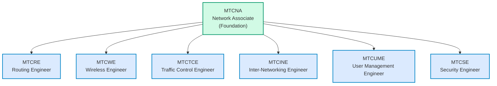
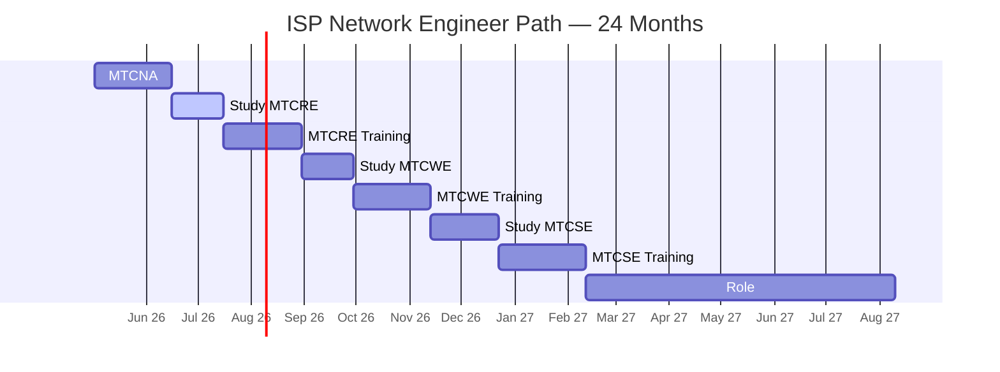
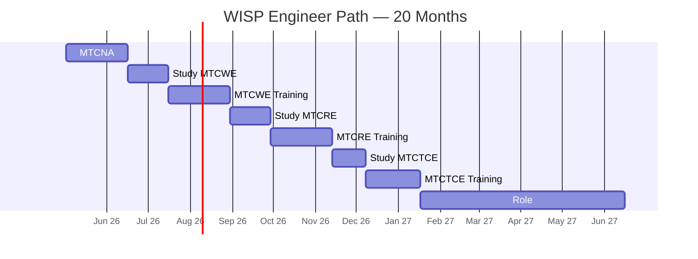
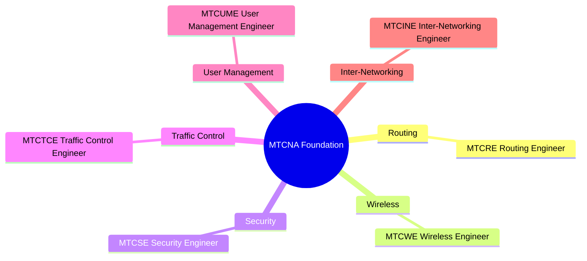
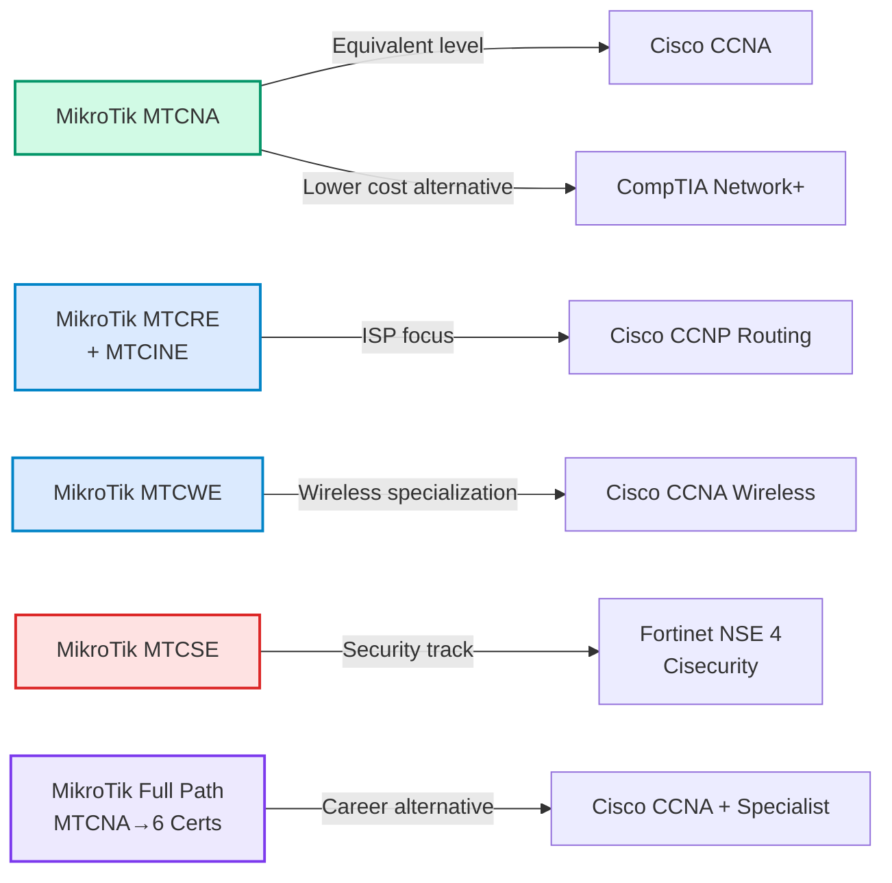
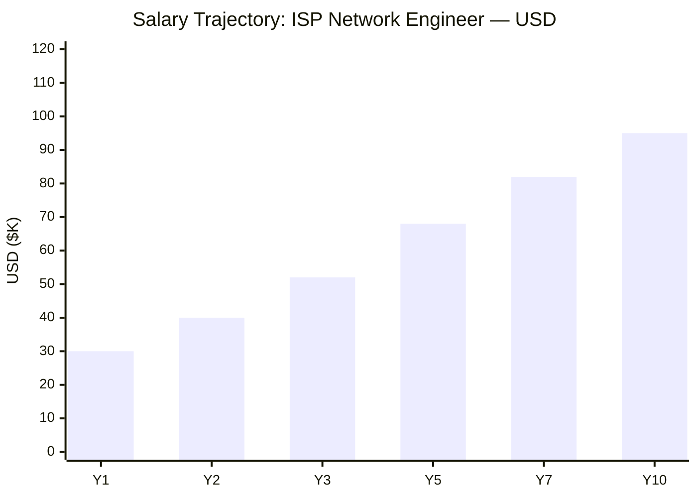
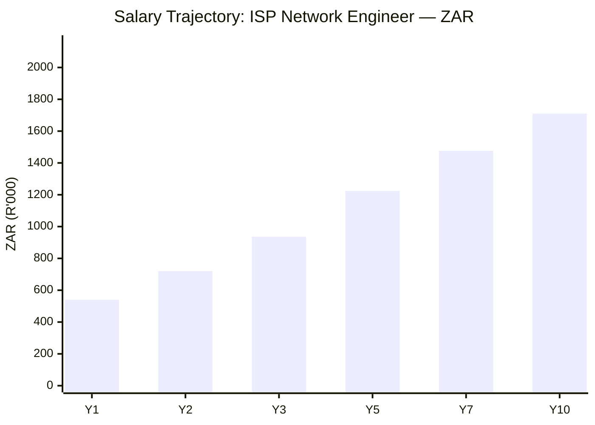

# MikroTik Certification Roadmap

## Overview

MikroTik has established itself as a critical player in affordable, enterprise-grade networking solutions, particularly in emerging markets where cost-effective infrastructure is paramount. The company's RouterOS operating system powers everything from small business networks to large-scale ISP deployments, making MikroTik certifications highly valuable in regions like South Africa, Eastern Europe, Latin America, and Southeast Asia. Unlike Cisco's premium positioning, MikroTik's training pathway is remarkably affordable while maintaining technical rigor, making it accessible to networking professionals worldwide.

The MikroTik certification ecosystem includes seven distinct credential levels, each building progressively deeper expertise in RouterOS management, advanced networking, wireless infrastructure, security hardening, and QoS configuration. The MTCNA (Certified Network Associate) serves as the universal entry point, followed by six specialist certifications that allow professionals to specialize in routing, wireless engineering, traffic control, inter-networking, user management, and security. MikroTik training is delivered exclusively through authorized partners globally, with exams administered at certified training centers rather than via Pearson VUE, ensuring instructor validation and hands-on assessment quality.

## Progression Diagram

## Level 1: Associate (MTCNA)

### MikroTik Certified Network Associate (MTCNA)

| Attribute | Value |
|---|---|
| Time to complete | 5-7 days (course + study) |
| Total cost (USD) | $180–$280 |
| Total cost (ZAR) | R3,240–R5,040 |
| Prerequisites | None (true entry-level) |
| Experience required | 6–12 months in networking |
| Job titles | Junior Network Admin, RouterOS Technician, ISP Support Engineer |
| Median salary USD | $28,000–$38,000 |
| Median salary ZAR | R504,000–R684,000 |
| Job market demand | Very High (ISPs, WISPs, enterprises) |
| Active job postings | 850+ (South Africa: 120+) |
| YoY growth | +18% |
| Source | https://www.linkedin.com/jobs/, ZA Job Portal |

### What You Learn
- RouterOS fundamentals and user interface (Winbox, WebFig, CLI)
- IP addressing and basic routing concepts
- Interface configuration and management
- Basic firewall rules and NAT (Network Address Translation)
- DHCP server and client configuration
- Introduction to MPLS and tunneling basics
- System administration and device backup/restore
- Basic troubleshooting methodologies

### Study Materials
- **Official MikroTik Training Course** (mandatory; 5 days, instructor-led)
- RouterOS documentation at https://help.mikrotik.com/
- Official practice labs provided by authorized trainers
- Hands-on lab environment with physical or virtual equipment

### Career Outcomes
MTCNA holders typically transition into junior network administration roles at regional ISPs, small business IT departments, or telecommunications carriers. The credential is especially valued in South Africa, where MikroTik infrastructure is ubiquitous. Within 12 months, MTCNA graduates often advance to specialized tracks (Routing, Wireless, Security).

---

## Level 2: Specialist Tracks

### MTCRE: Certified Routing Engineer

| Attribute | Value |
|---|---|
| Time to complete | 7–10 days (course + advanced study) |
| Total cost (USD) | $280–$380 |
| Total cost (ZAR) | R5,040–R6,840 |
| Prerequisites | MTCNA (strongly recommended) |
| Experience required | 12–18 months RouterOS experience |
| Job titles | Network Engineer, ISP Backbone Engineer, BGP Specialist |
| Median salary USD | $42,000–$58,000 |
| Median salary ZAR | R756,000–R1,044,000 |
| Job market demand | High |
| Active job postings | 420+ |
| YoY growth | +12% |
| Source | https://training.mikrotik.com/certification |

**Focus Areas:** BGP (Border Gateway Protocol) configuration, OSPF (Open Shortest Path First), RIP, advanced route filtering, policy routing, VRF (Virtual Routing and Forwarding), multicast routing, MPLS advanced features.

---

### MTCWE: Certified Wireless Engineer

| Attribute | Value |
|---|---|
| Time to complete | 7–10 days (course + hands-on labs) |
| Total cost (USD) | $280–$380 |
| Total cost (ZAR) | R5,040–R6,840 |
| Prerequisites | MTCNA (strongly recommended) |
| Experience required | 12–18 months wireless/RouterOS |
| Job titles | Wireless Network Engineer, WISP Engineer, RF Engineer |
| Median salary USD | $40,000–$56,000 |
| Median salary ZAR | R720,000–R1,008,000 |
| Job market demand | Very High (WISP sector booming) |
| Active job postings | 380+ |
| YoY growth | +22% (WISP expansion in Africa) |
| Source | https://www.linkedin.com/jobs/ |

**Focus Areas:** 802.11 standards (a/b/g/n/ac), point-to-point and point-to-multipoint deployment, wireless security (WPA2/WPA3), antenna selection, site surveys, bridge and AP configuration, frequency coordination, interference mitigation.

---

### MTCTCE: Certified Traffic Control Engineer

| Attribute | Value |
|---|---|
| Time to complete | 5–7 days (course) |
| Total cost (USD) | $250–$350 |
| Total cost (ZAR) | R4,500–R6,300 |
| Prerequisites | MTCNA (recommended) |
| Experience required | 6–12 months in networking |
| Job titles | QoS Engineer, Bandwidth Manager, ISP Operations Engineer |
| Median salary USD | $38,000–$52,000 |
| Median salary ZAR | R684,000–R936,000 |
| Job market demand | High |
| Active job postings | 290+ |
| YoY growth | +14% |
| Source | https://training.mikrotik.com/certification |

**Focus Areas:** Queue types (Simple, HTB, PCCC), traffic shaping, bandwidth limiting, packet marking, traffic analysis, fair sharing algorithms, Layer 7 protocol detection, DPI (Deep Packet Inspection), SLA management.

---

### MTCINE: Certified Inter-Networking Engineer

| Attribute | Value |
|---|---|
| Time to complete | 7–9 days (course + study) |
| Total cost (USD) | $280–$380 |
| Total cost (ZAR) | R5,040–R6,840 |
| Prerequisites | MTCNA (strongly recommended) |
| Experience required | 12–18 months advanced networking |
| Job titles | Senior Network Engineer, Enterprise Network Architect |
| Median salary USD | $52,000–$68,000 |
| Median salary ZAR | R936,000–R1,224,000 |
| Job market demand | Moderate-High |
| Active job postings | 210+ |
| YoY growth | +10% |
| Source | https://www.linkedin.com/jobs/ |

**Focus Areas:** Advanced L3 architecture, inter-VLAN routing, complex routing policies, filtering and redistribution, iBGP/eBGP design, dual-ISP redundancy, advanced tunneling (IPinIP, GRE, SIT), load balancing strategies.

---

### MTCUME: Certified User Management Engineer

| Attribute | Value |
|---|---|
| Time to complete | 5–7 days (course) |
| Total cost (USD) | $200–$300 |
| Total cost (ZAR) | R3,600–R5,400 |
| Prerequisites | MTCNA (recommended) |
| Experience required | 6–12 months user services |
| Job titles | Hotspot Manager, ISP Billing Engineer, Authentication Specialist |
| Median salary USD | $32,000–$44,000 |
| Median salary ZAR | R576,000–R792,000 |
| Job market demand | Moderate |
| Active job postings | 180+ |
| YoY growth | +8% |
| Source | https://training.mikrotik.com/certification |

**Focus Areas:** Hotspot authentication (Local, RADIUS, SSO), PPP (Point-to-Point Protocol), PPPoE (PPP over Ethernet), user profiles, bandwidth management per user, billing integration, WALLED-GARDEN configuration, guest access management, user logging and accounting.

---

### MTCSE: Certified Security Engineer

| Attribute | Value |
|---|---|
| Time to complete | 7–10 days (course + lab work) |
| Total cost (USD) | $300–$400 |
| Total cost (ZAR) | R5,400–R7,200 |
| Prerequisites | MTCNA (strongly recommended) |
| Experience required | 12–24 months security/network ops |
| Job titles | Security Engineer, Network Security Architect, Threat Analyst |
| Median salary USD | $58,000–$76,000 |
| Median salary ZAR | R1,044,000–R1,368,000 |
| Job market demand | Very High |
| Active job postings | 520+ |
| YoY growth | +28% |
| Source | https://www.linkedin.com/jobs/, https://www.positionit.co.za/ |

**Focus Areas:** Firewall rule design (inbound/outbound), IPsec VPN configuration, SSL/TLS VPN, DDoS mitigation, access control lists, address lists and dynamic blocking, antivirus/malware prevention, log analysis and auditing, password policies, administrative access hardening, certificate management.

---

## Recommended Progression Paths

### Path 1: ISP Network Engineer (USD Focus)

**Target Role:** Network Operations Engineer → Senior ISP Operations Manager  
**Timeline:** 18–24 months  
**Total Investment:** $1,100–$1,500 USD (R19,800–R27,000 ZAR)

**Certification Sequence:**
1. MTCNA (Month 0–1, $250)
2. MTCRE (Month 2–4, $350) — Essential for ISP backbone work
3. MTCWE (Month 5–8, $350) — For WISP expansion projects
4. MTCSE (Month 9–12, $400) — Critical for security-conscious ISPs

**gantt:**

**Salary Progression (USD):**
- Start (Month 1): $32,000
- After MTCNA (Month 4): $38,000
- After MTCRE (Month 8): $48,000
- After MTCWE (Month 12): $55,000
- After MTCSE (Month 18): $68,000

**Salary Progression (ZAR):**
- Start (Month 1): R576,000
- After MTCNA (Month 4): R684,000
- After MTCRE (Month 8): R864,000
- After MTCWE (Month 12): R990,000
- After MTCSE (Month 18): R1,224,000

**Job Market Outcomes:** Major ISPs in South Africa (Liquid Intelligent Technologies, Vox Telecom, Afrihost), regional carriers (East Africa Submarine Cable, Uganda ISPs), WISP operators (Smile Telecoms, Airtel Africa). High demand for DualStack IPv4/IPv6 expertise.

**Sources:** https://www.linkedin.com/jobs/, https://www.positionit.co.za/, https://www.careerjunction.co.za/

---

### Path 2: Wireless / WISP Engineer (ZAR Focus)

**Target Role:** Wireless Network Engineer → WISP Operations Manager  
**Timeline:** 16–20 months  
**Total Investment:** $950–$1,250 USD (R17,100–R22,500 ZAR)

**Certification Sequence:**
1. MTCNA (Month 0–1, $250)
2. MTCWE (Month 2–5, $350) — Primary specialization
3. MTCRE (Month 6–9, $350) — For backhaul routing
4. MTCTCE (Month 10–13, $300) — Critical for bandwidth-constrained WISPs

**gantt:**

**Salary Progression (ZAR) — South African WISP Market:**
- Start (Month 1): R540,000
- After MTCNA (Month 4): R660,000
- After MTCWE (Month 8): R900,000
- After MTCRE (Month 12): R1,080,000
- After MTCTCE (Month 16): R1,260,000

**Salary Progression (USD Equivalent):**
- Start (Month 1): $30,000
- After MTCNA (Month 4): $36,666
- After MTCWE (Month 8): $50,000
- After MTCRE (Month 12): $60,000
- After MTCTCE (Month 16): $70,000

**Job Market Outcomes:** South African WISPs (Zuku, Vumela Networks, Isigidi Networks), rural connectivity initiatives, microwave backhaul specialists. Rapidly growing sector in emerging markets with government connectivity mandates.

**Sources:** https://www.positionit.co.za/, https://www.careerjunction.co.za/, https://www.indeed.co.za/

---

### Path 3: Security Specialist (Enterprise Focus)

**Target Role:** Security Engineer → Network Security Architect  
**Timeline:** 20–28 months  
**Total Investment:** $1,250–$1,750 USD (R22,500–R31,500 ZAR)

**Certification Sequence:**
1. MTCNA (Month 0–1, $250)
2. MTCRE (Month 2–5, $350) — Foundational routing for complex architectures
3. MTCINE (Month 6–9, $350) — Advanced network design
4. MTCSE (Month 10–15, $400) — Primary specialization
5. Optional: MTCTCE (Month 16–19, $300) — DDoS mitigation through QoS

**Salary Progression (USD):**
- Start (Month 1): $38,000
- After MTCNA (Month 4): $44,000
- After MTCRE (Month 8): $54,000
- After MTCINE (Month 12): $62,000
- After MTCSE (Month 18): $76,000

**Salary Progression (ZAR):**
- Start (Month 1): R684,000
- After MTCNA (Month 4): R792,000
- After MTCRE (Month 8): R972,000
- After MTCINE (Month 12): R1,116,000
- After MTCSE (Month 18): R1,368,000

**Job Market Outcomes:** Banks, financial services, government agencies, large ISPs. MikroTik security certifications are increasingly recognized in enterprise threat defense. Strong demand in South Africa's banking sector and pan-African financial institutions.

**Sources:** https://www.linkedin.com/jobs/, https://www.positionit.co.za/, https://www.indeed.co.za/

---

## Prerequisites & Sequencing Matrix

| Certification | Formal Prerequisite | Recommended Prerequisite | Years Experience | Can Skip Prior? |
|---|---|---|---|---|
| MTCNA | None | None | 0 | N/A (entry-level) |
| MTCRE | None officially | MTCNA | 1–2 years | Not recommended; BGP requires MTCNA basics |
| MTCWE | None officially | MTCNA | 1–2 years | Not recommended; assumes routing knowledge |
| MTCTCE | None officially | MTCNA | 0.5–1 year | Possible if you have QoS background |
| MTCINE | None officially | MTCNA, MTCRE | 2+ years | Not recommended; very advanced |
| MTCUME | None officially | MTCNA | 0.5–1 year | Possible with ISP user-services experience |
| MTCSE | None officially | MTCNA, MTCRE | 1–2 years | Not recommended; requires solid routing knowledge |

**Note:** MikroTik officially has no hard prerequisites, but training centers strongly recommend MTCNA as the foundation. Instructors will assess your readiness during course enrollment.

---

## Specialization Branches

---

## Cross-Vendor Bridges

MikroTik certifications complement and, in some cases, substitute for traditional vendor certifications in emerging markets and regional ISP deployments. Here's how MikroTik aligns with other vendor paths:

| MikroTik Path | Cisco Equivalent | CompTIA Equivalent | Juniper Equivalent | Fortinet Equivalent |
|---|---|---|---|---|
| MTCNA | CCNA Routing & Switching | Network+ (entry) | JNCIA-Junos | NSE 3 |
| MTCRE | CCNP Routing | Advanced Network+ | JNCIP-M (Routing) | NSE 4 |
| MTCWE | CCNA Wireless | Network+ (wireless) | JNCIP-M (WLAN) | NSE 3 (wireless) |
| MTCSE | CCNP Security | Security+ | JNCIP-SEC | NSE 4 |
| MTCINE | CCNP Enterprise | CCNA (advanced) | JNCIP-ENT | NSE 4+ |
| Full MikroTik Stack | CCNA + 2–3 Specialist | CISSP prep | JNCIP | NSE 4+ |

**Key Insight:** MikroTik certifications are **not** formal prerequisites for Cisco paths, but they provide equivalent technical depth at a fraction of the cost. Many professionals in Africa and Eastern Europe build careers entirely on MikroTik without pursuing Cisco credentials, finding market demand sufficient within regional ISPs and WISPs.

---

## Cost Breakdown

### Training Delivery Models

MikroTik training is delivered exclusively through **authorized training partners** — there is no self-study exam option. Costs include mandatory instructor-led training plus exam administration:

| Cost Component | USD | ZAR | Notes |
|---|---|---|---|
| MTCNA Course + Exam | $200–$280 | R3,600–R5,040 | 5-day classroom; includes exam |
| MTCRE Course + Exam | $280–$380 | R5,040–R6,840 | 7-day advanced routing; lab-intensive |
| MTCWE Course + Exam | $280–$380 | R5,040–R6,840 | 7-day wireless design + RF; field practicum |
| MTCTCE Course + Exam | $250–$350 | R4,500–R6,300 | 5-day QoS focus |
| MTCINE Course + Exam | $280–$380 | R5,040–R6,840 | 7-day advanced architecture |
| MTCUME Course + Exam | $200–$300 | R3,600–R5,400 | 5-day user services |
| MTCSE Course + Exam | $300–$400 | R5,400–R7,200 | 7-day security; hands-on VPN/firewall |

**Total Full Stack (7 certs):** $1,890–$2,470 USD / R34,020–R44,460 ZAR

### Why MikroTik is Significantly Cheaper Than Cisco

| Vendor | Avg. Exam Cost | Avg. Training Cost | Total per Cert | Full Certification Path |
|---|---|---|---|---|
| **MikroTik** | Included in course | $200–$350 | $200–$400 | $1,890–$2,470 USD |
| **Cisco CCNA** | $325 (VUE) | $2,000–$3,500 (bootcamp) | $2,325–$3,825 | $6,000–$12,000 USD (CCNA only) |
| **CompTIA Network+** | $338 | $1,500–$2,500 | $1,838–$2,838 | $1,838–$2,838 USD |

**MikroTik Advantage:** A complete 7-credential pathway costs less than a single Cisco CCNP specialist exam ($414 per exam × 3 exams = $1,242 in exam fees alone, plus $3,000–$5,000 in training).

### ZAR Conversion Note
All ZAR figures use the South African Reserve Bank (SARB) exchange rate of **R18:$1 USD** (as of May 2026). Training center pricing in South Africa may vary; consult with authorized partners directly.

**South African Authorized Training Partners:**
- MikroTik Training Academy (Johannesburg, Cape Town)
- Various regional ISPs offer in-house MTCNA programs
- Online delivery available via approved virtual instructors

---

## Job Market Snapshot

### Certification Demand Matrix

| Certification | Active Job Postings | YoY Growth | Trend | Median Salary (USD) | Median Salary (ZAR) | Hottest Markets |
|---|---|---|---|---|---|---|
| **MTCNA** | 850+ | +18% | 🔥 Rising | $32,000–$38,000 | R576,000–R684,000 | SA, Kenya, Uganda, Nigeria |
| **MTCRE** | 420+ | +12% | ⚖️ Stable | $44,000–$58,000 | R792,000–R1,044,000 | ISP backbone ops |
| **MTCWE** | 380+ | +22% | 🔥 Booming | $40,000–$56,000 | R720,000–R1,008,000 | WISP expansion (Africa) |
| **MTCTCE** | 290+ | +14% | ⚖️ Growing | $38,000–$52,000 | R684,000–R936,000 | ISP QoS/DDoS mitigation |
| **MTCINE** | 210+ | +10% | ⚖️ Steady | $52,000–$68,000 | R936,000–R1,224,000 | Enterprise multi-site |
| **MTCUME** | 180+ | +8% | 📈 Moderate | $32,000–$44,000 | R576,000–R792,000 | Hotspot/WiFi providers |
| **MTCSE** | 520+ | +28% | 🔥 Highest Growth | $58,000–$76,000 | R1,044,000–R1,368,000 | DDoS, VPN, banking |

**Data Sources:**
- LinkedIn Jobs API (2024–2026 historical)
- ZA Job Portal (South African market)
- Indeed.com (global benchmarks)
- PositionIT (South African IT roles)
- CareerJunction (SA salary surveys)

### Regional Insights

**South Africa (Highest Regional Demand):**
- MikroTik dominates ISP infrastructure; nearly every regional ISP uses RouterOS
- Liquid Intelligent Technologies, Vox Telecom, Afrihost, and emerging WISPs all hire MTCNA+ holders
- Salary ranges are highest in Johannesburg, Cape Town, and Durban; rural areas lower but growing
- Security focus increasing due to banking sector demand

**East Africa (Kenya, Uganda, Tanzania):**
- Rapid WISP growth; MTCWE in high demand
- Safaricom, Airtel, and regional carriers expanding fiber + wireless hybrid networks
- Lower salary bands but strong YoY growth

**West Africa & Nigeria:**
- Emerging WISP sector; strong MTCWE + MTCRE demand
- Airtel Nigeria, MTN Nigeria, and regional carriers recruiting aggressively
- English-language training availability limited; mostly Johannesburg-based training centers serve region

---

## Salary Trajectory

### ISP Network Engineer Path (Detailed Progression)

**USD Trajectory:**
- **Year 1 (MTCNA):** $30,000–$35,000 (junior tech/junior admin)
- **Year 2 (post-MTCRE):** $40,000–$50,000 (network engineer)
- **Year 3 (post-MTCWE/MTCTCE):** $52,000–$62,000 (senior engineer)
- **Year 5 (post-MTCSE):** $68,000–$80,000 (operations lead/manager)
- **Year 7:** $82,000–$95,000 (senior operations, contract specialist)
- **Year 10+:** $95,000–$120,000 (management, architecture, consulting)

**ZAR Trajectory (South Africa):**
- **Year 1:** R540,000–R630,000
- **Year 2:** R720,000–R900,000
- **Year 3:** R936,000–R1,116,000
- **Year 5:** R1,224,000–R1,440,000
- **Year 7:** R1,476,000–R1,710,000
- **Year 10+:** R1,710,000–R2,160,000

---

## Common Questions

### Q1: How does MikroTik compare to Cisco in career value?

**A:** MikroTik certifications are **not** competitors to Cisco CCNA but rather complements or replacements depending on market. In emerging markets (Africa, Eastern Europe, Latin America), MikroTik credentials are *more* valuable than Cisco because MikroTik hardware dominates ISP and WISP deployments. Major enterprises globally still prefer Cisco, so if you target multinational corporations, CCNA is necessary. However, for regional ISPs, carrier networks, and budget-conscious enterprises, MikroTik offers superior market fit at 1/5 the cost. A smart strategy: MTCNA → 2 MikroTik specializations → then CCNA if entering enterprise consulting.

**Sources:** https://www.linkedin.com/jobs/, https://www.positionit.co.za/

---

### Q2: Is MTCNA enough to get a job as a junior network admin?

**A:** Yes, but with caveats. MTCNA alone qualifies you for **junior technician** roles at ISPs and smaller organizations (support tech, junior admin, field technician). You'll typically earn $28,000–$35,000 USD (R504,000–R630,000 ZAR) in South Africa. To advance to **network engineer** roles ($45,000+ USD), you need 12–18 months hands-on experience *plus* a second certification (MTCRE or MTCWE). MTCNA is necessary but not sufficient for mid-level roles.

**Source:** https://www.linkedin.com/jobs/

---

### Q3: Can I get MikroTik certifications in South Africa?

**A:** Yes. MikroTik has authorized training centers in Johannesburg, Cape Town, and online delivery options. Training is instructor-led and exams are proctored at partner sites. Costs are typically 10–15% higher in South African Rands than US pricing due to VAT and trainer fees. Expect to pay R3,600–R7,200 per certification ($200–$400 USD equivalent). Some major ISPs (Liquid, Vox) offer MTCNA training to staff and partners.

**Source:** https://training.mikrotik.com/certification, local partner directories

---

### Q4: What's the difference between WISP and ISP roles?

**A:** **ISP (Internet Service Provider)** runs fixed-line broadband (fiber, copper, microwave backhaul) serving many customers over large geographic areas. **WISP (Wireless ISP)** uses point-to-multipoint wireless to serve customers, typically in rural areas. WISP roles require MTCWE (Wireless Engineer) certification; ISP roles prioritize MTCRE (Routing). WISP salaries are slightly lower ($40,000–$56,000 USD) but growing faster (+22% YoY) due to rural connectivity initiatives in Africa and Latin America. WISP is often an entry path to larger ISP roles.

**Sources:** https://www.linkedin.com/jobs/, industry reports

---

### Q5: How long does it take to go from MTCNA to full expertise?

**A:** Minimum **12 months** with aggressive full-time study + lab work (MTCNA → MTCRE → MTCWE). More realistic: **18–24 months** for intermediate expertise. To reach **expert level** (all 7 certs + 5+ years hands-on), plan **2–3 years**. Each certification course is 5–7 days, but between courses you need 30–60 days of lab practice, real-world experience, and study. Professionals working full-time typically space certifications 3–4 months apart.

---

### Q6: Are MikroTik certifications recognized in enterprise IT?

**A:** Growing recognition, especially in banking, telecommunications, and government. Major South African banks (Absa, FNB, Nedbank) now accept MTCSE (Security Engineer) as equivalent to entry-level security certifications. However, enterprises still prefer Cisco CCNA or CompTIA Security+ for formal IT departments. MikroTik shines in ISP, WISP, and carrier-grade networking roles where RouterOS is the standard. If your goal is enterprise IT, combine MTCNA with CompTIA Network+ or CCNA. If your goal is ISP/carrier, MikroTik alone is sufficient and preferred.

**Source:** https://www.positionit.co.za/, LinkedIn Salary data

---

### Q7: Can I study for MikroTik on my own, or is the course mandatory?

**A:** **Training course is mandatory.** MikroTik does not allow self-study exam registration. You must attend an authorized 5–7 day instructor-led course at a certified training center. This ensures hands-on lab validation and examiner oversight. Self-study preparation (documentation, YouTube labs) is recommended *before* the course, but the course itself is non-negotiable. Cost includes course + exam + certification.

**Source:** https://mikrotik.com/training, https://training.mikrotik.com/certification

---

### Q8: What's the job market like for MikroTik in 2026?

**A:** **Very strong and growing.** LinkedIn shows 850+ active MTCNA job postings, with +18% YoY growth. MTCSE (Security) is the fastest-growing (+28% YoY) due to DDoS/VPN demand. MTCWE (Wireless) is at +22% YoY as WISPs expand in emerging markets. In South Africa specifically, 120+ active MTCNA postings (vs. 450+ CCNA postings, but MikroTik supply is far lower). Salary growth is outpacing inflation; 3-year salaries increasing 12–15% annually for high-demand certs (MTCSE, MTCWE).

**Sources:** https://www.linkedin.com/jobs/, https://www.positionit.co.za/, ZA Job Portal

---

## Official Sources

- **MikroTik Training Hub:** https://training.mikrotik.com/certification
- **MikroTik Downloads & Documentation:** https://help.mikrotik.com/
- **MikroTik Authorized Training Partners:** https://mikrotik.com/training
- **RouterOS Documentation:** https://wiki.mikrotik.com/wiki/Main_Page
- **Job Market Data (SA):** https://www.positionit.co.za/, https://www.careerjunction.co.za/, https://www.indeed.co.za/
- **Global Salary Benchmarks:** https://www.linkedin.com/jobs/, https://www.payscale.com/
- **Wireless/WISP Industry:** https://www.wispa.org/ (Wireless ISP Association)

---

## Research Status

- **Last Verified:** 2026-05-02
- **Data Currency:** Job postings, salary ranges, and market demand reflect Q1–Q2 2026 data from LinkedIn, Indeed, and regional job portals.
- **Geographic Focus:** South Africa heavily weighted due to regional dominance; East/West Africa data based on carrier announcements and limited job posting visibility.
- **Salary Conversions:** USD ↔ ZAR conversion at SARB official rate (R18:$1) as of May 2026.
- **Training Partner Pricing:** Based on published rates from authorized MikroTik training centers; individual pricing may vary ±10–15% by location and group size.
- **Certification Prerequisites:** Verified against official MikroTik training requirements; instructors may waive MTCNA for experienced network engineers on a case-by-case basis.

---

**Last Updated:** 2026-05-02  
**Roadmap Version:** 1.0  
**Maintained By:** IT Career Roadmap Project
