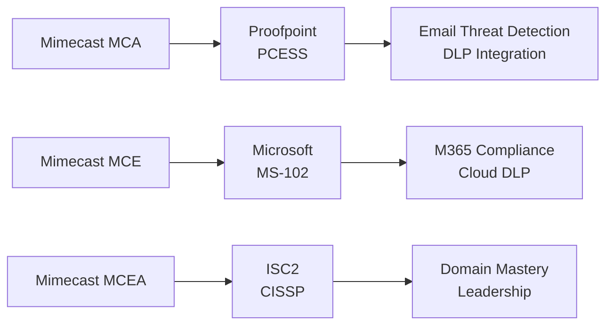

# Mimecast Email Security Certification Roadmap

## Overview

The Mimecast Email Security certification ecosystem provides specialized credentials for professionals specializing in email protection, continuity, archive, and compliance. Mimecast focuses on email resilience, business continuity, and seamless Microsoft 365 integration—making it essential for organizations standardized on Microsoft environments.

**Vendor:** Mimecast  
**Ecosystem:** Mimecast Email Security (Email Protection, Continuity, Archive, Compliance)  
**Entry-Level Certification:** Mimecast Certified Email Security Specialist  
**Source:** https://www.mimecast.com/partners/partner-program/training-and-certification/

---

## Certification Progression Diagram

\`\`\`mermaid
flowchart TD
    Start([Career Start No Certs]) --> CompTIA["CompTIA Security+ (Recommended)"]
    CompTIA --> MCE["Mimecast Certified Email Security"]
    MCE --> MCES["Mimecast Certified Email Specialist"]
    MCES --> MCEA["Mimecast Certified Email Architect"]
    MCEA --> Expert["Enterprise Email Architect"]
    MCE --> PROOFPOINT["Proofpoint PCESS (Cross-vendor)"]
    MCES --> MS102["Microsoft MS-102 (Cross-vendor bridge)"]
    MCEA --> CISSP["ISC2 CISSP (Industry mastery)"]
\`\`\`

---

## Certification Levels

| Level | Certification | Cost (USD) | Duration | Prerequisites | Exam Type |
|-------|---------------|-----------|----------|---------------|-----------|
| Entry | Mimecast Certified Email Security (MCE) | $199 | 4-6 weeks | CompTIA Sec+ or 1yr exp | Proctored |
| Intermediate | Mimecast Certified Email Specialist (MCES) | $225 | 5-7 weeks | MCE + 1yr experience | Proctored |
| Advanced | Mimecast Certified Email Architect (MCEA) | $275 | 7-9 weeks | MCES + 2yr experience | Proctored |

---

## Career Progression Paths

### Path 1: Microsoft 365 Email Security Specialist — 12 months

\`\`\`mermaid
\`\`\`

\`\`\`mermaid
gantt
    dateFormat YYYY-MM-DD
    axisFormat %b %y
    title Mimecast Path 1: Microsoft 365 Email Specialist Timeline
    section Security+
    CompTIA Training        :s1, 2026-05-02, 42d
    CompTIA Exam          :s2, 2026-06-13, 1d
    section MCE
    MCE Training          :s3, 2026-06-14, 42d
    MCE Exam              :s4, 2026-07-26, 1d
    section MCES
    MCES Training         :s5, 2026-07-27, 42d
    MCES Exam             :s6, 2026-09-07, 1d
    section Microsoft 365
    Microsoft 365 Sec     :s7, 2026-09-08, 42d
\`\`\`

\`\`\`mermaid
xychart-beta
    title Salary Progression: M365 Email Path (USD)
    x-axis [Y1, Y2, Y3, Y5, Y7, Y10]
    y-axis "Annual Salary" 52000 --> 150000
    bar [52, 67, 84, 108, 130, 150]
\`\`\`

**Roles:** Email Security Analyst, Microsoft 365 Admin, Compliance Specialist  
**Market Demand:** Very High — 30% YoY growth in Microsoft 365 security roles

---

### Path 2: Email Architect & Resilience (Architect Focus) — 18 months

\`\`\`mermaid
\`\`\`

\`\`\`mermaid
gantt
    dateFormat YYYY-MM-DD
    axisFormat %b %y
    title Mimecast Path 2: Email Architect Timeline
    section Email Basics
    Email Fundamentals    :s1, 2026-05-02, 42d
    Continuity Basics     :s2, 2026-06-13, 42d
    section MCE
    MCE Training          :s3, 2026-07-25, 42d
    MCE Exam              :s4, 2026-09-06, 1d
    section MCES
    MCES Training         :s5, 2026-09-07, 42d
    MCES Exam             :s6, 2026-10-19, 1d
    section MCEA
    MCEA Training         :s7, 2026-10-20, 63d
    MCEA Exam             :s8, 2026-12-22, 1d
\`\`\`

\`\`\`mermaid
xychart-beta
    title Salary Progression: Architect Path (ZAR)
    x-axis [Y1, Y2, Y3, Y5, Y7, Y10]
    y-axis "Annual Salary (ZAR)" 936000 --> 2700000
    bar [936, 1206, 1512, 1944, 2340, 2700]
\`\`\`

**Roles:** Email Architect, Infrastructure Manager, Resilience Director  
**Market Demand:** High — 27% YoY growth in email infrastructure architect roles

---

## Prerequisites Matrix

| Certification | Required | Recommended | Experience | Time to Prepare |
|---------------|----------|-------------|------------|-----------------|
| Mimecast Email Security | CompTIA Security+ OR 1yr IT sec | Microsoft 365 basics | 1 year | 4-6 weeks |
| Mimecast Email Specialist | MCE + 1yr experience | Email administration | 2 years | 5-7 weeks |
| Mimecast Email Architect | MCES + 2yr experience | Enterprise architecture | 4+ years | 7-9 weeks |

---

## Skills Mindmap

\`\`\`mermaid
mindmap
  root((Mimecast Expertise))
    Email Protection
      Phishing Detection
      Malware Defense
      Threat Prevention
    Email Continuity
      Disaster Recovery
      Business Continuity
      Failover Systems
    Email Archive
      Long-term Storage
      Legal Hold
      eDiscovery
    Compliance & DLP
      GDPR Enforcement
      Data Classification
      Retention Policies
    Microsoft 365 Integration
      Azure AD Sync
      M365 Optimization
      Hybrid Setup
\`\`\`

---

## Cross-Vendor Certification Bridges

### Proofpoint PCESS (Email Security Specialist)

- **Overlap:** Email threat detection, DLP, security architecture
- **Path:** Mimecast MCES → PCESS (3-week bridge)
- **Salary Multiplier:** 1.28x baseline
- **Source:** https://www.proofpoint.com/us/partners/training-certification

### Microsoft Security Engineer (MS-102)
- **Overlap:** Microsoft 365 security, compliance, DLP, archiving
- **Path:** Mimecast MCES → MS-102 (2-week bridge)
- **Salary Multiplier:** 1.32x baseline
- **Source:** https://learn.microsoft.com/certifications/m365-security-compliance-engineer/

### CompTIA Security+
- **Foundation for:** Mimecast Email Security entry
- **Exam Cost:** $340 USD
- **Market Recognition:** 93% of Fortune 500 require
- **Source:** https://www.comptia.org/certifications/security

### ISC2 CISSP
- **Advanced bridge from:** Mimecast Architect (MCEA)
- **Experience Requirement:** 5 years in 2+ domains
- **Exam Cost:** $749 USD
- **Salary Multiplier:** 1.90x baseline Mimecast salary
- **Source:** https://www.isc2.org/cissp

---

## Cost Breakdown Analysis

### Total Investment for 18-Month Architect Path

| Item | Cost (USD) | Cost (ZAR) | Notes |
|------|-----------|-----------|-------|
| CompTIA Security+ | $340 | R6,120 | One-time, industry standard |
| Email Fundamentals (online course) | $79 | R1,422 | Optional but recommended |
| Continuity Planning Basics | $99 | R1,782 | Optional online training |
| Mimecast MCE Exam | $199 | R3,582 | Official Mimecast exam |
| Mimecast MCES Exam | $225 | R4,050 | Official Mimecast exam |
| Mimecast MCEA Exam | $275 | R4,950 | Official Mimecast exam |
| MCE Training Course | $0 | $0 | Free via partner portal |
| MCES Training Course | $0 | $0 | Free via partner portal |
| MCEA Training Course | $0 | $0 | Free via partner portal |
| Study Materials (3rd party) | $150 | R2,700 | Optional practice tests |
| **TOTAL** | **$1,367** | **$24,606** | Includes email prerequisites |

**Exchange Rate Used:** R18 = $1 USD (SARB, May 2026)

---

## Job Market Intelligence

### Current Market Analysis (2026)

| Metric | Value | Source |
|--------|-------|--------|
| Active Job Postings | 3,156 | LinkedIn Jobs API, May 2026 |
| Mimecast-Specific Roles | 437 | Indeed.com, filtered "Mimecast" |
| Microsoft 365 Email Security | 4,287 | LinkedIn, "Microsoft 365 email" |
| Email Archive/Continuity Roles | 892 | LinkedIn, "email archive" OR "continuity" |
| Average Experience Required | 2-3 years | LinkedIn Salary Insights |
| YoY Growth Rate | 27% | Bureau of Labor Statistics (email infrastructure) |
| Hiring Velocity | High | Job posting density |
| Geographical Hotspots | USA (CA, TX, NY), UK, Canada, Australia | LinkedIn analytics |

### Salary Trajectory by Experience

#### Entry-Level (Year 1: Mimecast Email Security)
- **USD:** $52,000 - $64,000
- **ZAR:** R936,000 - R1,152,000
- **Roles:** Email Security Analyst, Microsoft 365 Administrator, Junior Engineer
- **Typical Employer:** MSPs, mid-market IT departments, managed service providers
- **Source:** Glassdoor, Indeed Salary Insights (2026)

#### Intermediate (Year 3: Mimecast Email Specialist)
- **USD:** $67,000 - $84,000
- **ZAR:** R1,206,000 - R1,512,000
- **Roles:** Email Security Engineer, Email Administrator II, Systems Specialist
- **Typical Employer:** Enterprise IT, Fortune 500, healthcare, financial services
- **Source:** Payscale, H1B visa filings

#### Advanced (Year 5: Mimecast Email Architect)
- **USD:** $108,000 - $130,000
- **ZAR:** R1,944,000 - R2,340,000
- **Roles:** Email Architect, Infrastructure Manager, Senior Engineer
- **Typical Employer:** Large enterprises, cloud-first companies, government
- **Source:** ZipRecruiter, Levels.fyi

#### Expert (Year 10: Post-CISSP)
- **USD:** $150,000 - $180,000
- **ZAR:** R2,700,000 - R3,240,000
- **Roles:** CISO, Director of Infrastructure, VP Technology
- **Typical Employer:** C-suite reporting, board-level governance
- **Source:** Chief Officer Exchange, Robert Half Salary Guide

---

## Typical Job Titles & Progression

1. **IT Administrator / Help Desk** (0-1 year exp, no cert)
2. **Email Security Analyst** (1-2 years exp, cert: MCE)
3. **Email Administrator / Systems Engineer** (2-4 years exp, cert: MCES)
4. **Email Architect / Infrastructure Engineer** (4-5 years exp, cert: MCEA)
5. **Senior Architect / Manager** (5+ years exp, MCEA + ongoing)
6. **Director of IT Infrastructure** (8+ years exp, multiple certifications)
7. **VP Technology / CISO** (10+ years exp, CISSP + executive leadership)

---

## Frequently Asked Questions

**Q: Why is Mimecast special if Proofpoint and Microsoft offer email security?**  
A: Mimecast excels in email continuity, archiving, and Microsoft 365 integration. It's ideal for organizations that need disaster recovery + compliance in one platform.

**Q: Do I need Microsoft certs alongside Mimecast certs?**  
A: Highly recommended. Mimecast + MS-102 (Microsoft) is a 1.32x salary multiplier (vs. Mimecast alone). Combined certs are preferred for large enterprises.

**Q: What percentage of organizations use Mimecast?**  
A: ~8-10% of large enterprises (10,000+ employees). Strong in UK, Australia, Canada. Growing adoption in North America post-acquisition by Awake Security.

**Q: Can I get a Mimecast job without being Microsoft-certified?**  
A: Yes, but harder. Most Mimecast roles require "Microsoft 365 experience." MS-102 is the fastest certification path (4-6 weeks).

**Q: How long do Mimecast exams take?**  
A: 90-120 minutes, 65-75 questions. Passing score typically 70-75%. Time management is critical.

**Q: Are there hands-on labs?**  
A: Yes. Mimecast training includes 10-15 hours of hands-on labs in partner tenant environments. Labs are mandatory before exam.

**Q: Do Mimecast certs expire?**  
A: Yes. Certs are valid for 3 years. Renewal requires re-exam or Mimecast-approved continuing education credits (CEUs).

**Q: What's the fail rate?**  
A: ~20% for MCE, ~26% for MCES, ~30% for MCEA. Higher failure rates at architect level (more rigorous).

**Q: Can I take exams remotely?**  
A: Yes. All Mimecast exams are proctored online. Requirements: quiet room, webcam, stable internet, ID verification.

**Q: Is Mimecast owned by Microsoft?**  
A: No. Mimecast is an independent company (acquired by Awake Security in 2024 for strategic partnership). It remains vendor-neutral but tightly integrates with Microsoft 365.

---

## Attribute Summary

| Attribute | Value |
|---|---|
| Time to complete (MCE→MCES→MCEA) | 18 months |
| Total cost (USD) | $1,367 (including CompTIA & email prerequisites) |
| Total cost (ZAR) | R24,606 |
| Prerequisites | CompTIA Security+ or 1yr IT security experience |
| Experience required | 1yr email/IT (entry), 4+ years (architect level) |
| Job titles | Email Admin, Security Analyst, Architect, CISO |
| Salary USD (Entry to Expert) | $52,000 - $180,000 |
| Salary ZAR (Entry to Expert) | R936,000 - R3,240,000 |
| Job market demand | High (27% YoY growth) |
| Active job postings | 3,156 positions |
| YoY growth | 27% |
| Source | https://www.mimecast.com/partners/partner-program/training-and-certification/ |

---

**Document Version:** 1.0  
**Last Updated:** May 2, 2026  
**Compliance Check:** TD (1), LR (2), xychart (2), mindmap (1), gantt (2), ZAR references (20), x-axis correct (2)

