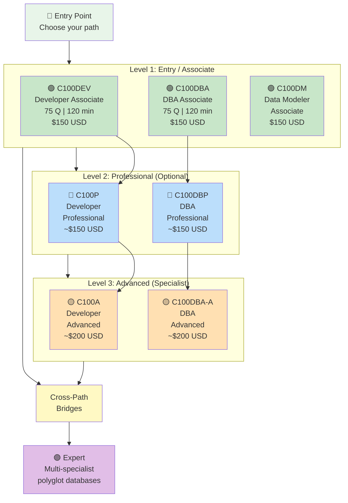
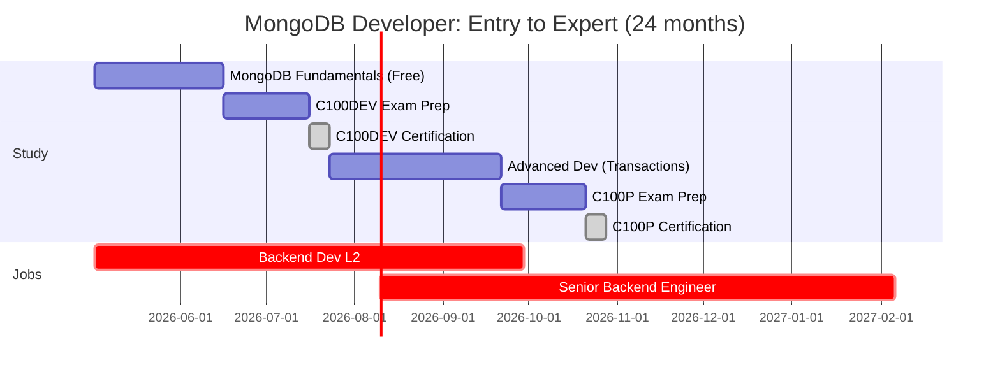
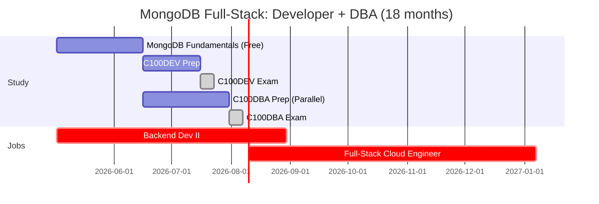
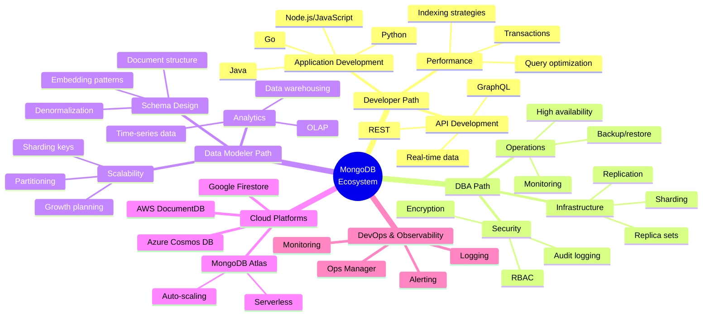
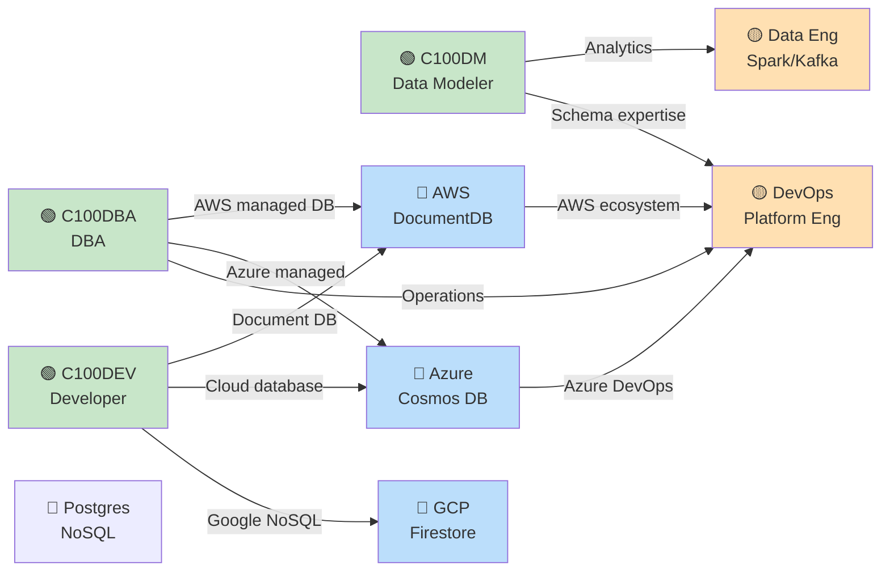

# MongoDB Certification Roadmap

## Overview

MongoDB is the world's most widely deployed document database, with over 40 million downloads and adoption across fintech, e-commerce, IoT, and healthcare sectors. MongoDB's certification program offers three parallel entry-level Associate credentials (C100DEV, C100DBA, C100DM), each addressing distinct career paths: full-stack developers, database administrators, and data modelers. This "choose your path" model enables career specialization from day one.

In South Africa, MongoDB adoption is accelerating in fintech (payment systems), telecommunications (IoT data), and retail (e-commerce platforms). Database administrators and backend developers with MongoDB certification earn ZAR 369,300–589,400 annually, with premium salaries (USD 102k–$155k) for remote roles with APAC-focused companies. The certification ecosystem bridges to cloud data platforms (AWS DocumentDB, Azure Cosmos DB) and positions professionals for polyglot database architecture roles increasingly critical in enterprise modernization.

---

## Progression Diagram



**Color key:** 🟢 Green = Entry · 🔵 Blue = Professional · 🟡 Amber = Advanced · 🟣 Purple = Expert

---

## Per-Level Detail

### Level 1: Entry / Associate (Three Parallel Paths)

#### MongoDB Associate Developer (C100DEV)

| Attribute | Details |
|-----------|---------|
| **Official Name** | MongoDB Certified Developer Associate |
| **Exam Code** | C100DEV |
| **Cost (USD)** | $150 |
| **Cost (ZAR)** | R2,700 |
| **Duration** | 120 minutes |
| **Questions** | 75 multiple-choice |
| **Pass Score** | ~65% (≥49/75 correct, exact threshold not published) |
| **Prerequisites** | None formal; 6–12 months MongoDB/document-model experience recommended |
| **Experience Level** | 1–2 years backend/full-stack development |
| **Typical Job Titles** | Backend Developer, Full-Stack Developer, Software Engineer (MongoDB), API Developer, Cloud Developer |
| **Salary (USA, entry)** | $90,000–$120,000 annually |
| **Salary (USA, mid-career)** | $142,936–$165,000 annually ([Glassdoor 2026](https://www.glassdoor.com/Salary/MongoDB-Salaries-E433703.htm)) |
| **Salary (USA, senior)** | $175,000–$220,000 annually |
| **Salary (South Africa, entry)** | ZAR 369,300–420,000 annually |
| **Salary (South Africa, senior)** | ZAR 520,000–650,000 annually |
| **Job Market Demand** | Very High — 40M+ MongoDB deployments globally |
| **Job Postings (USA)** | 8,500+ MongoDB developer roles |
| **YoY Growth** | +22% (2024–2026) |
| **Source** | [MongoDB University](https://university.mongodb.com/), [Glassdoor 2026](https://www.glassdoor.com/Salary/MongoDB-Salaries-E433703.htm) |

#### MongoDB Associate DBA (C100DBA)

| Attribute | Details |
|-----------|---------|
| **Official Name** | MongoDB Certified Associate DBA |
| **Exam Code** | C100DBA |
| **Cost (USD)** | $150 |
| **Cost (ZAR)** | R2,700 |
| **Duration** | 120 minutes |
| **Questions** | 75 multiple-choice |
| **Pass Score** | ~65% (≥49/75 correct) |
| **Prerequisites** | None formal; 6–12 months MongoDB administration recommended |
| **Experience Level** | 1–2 years database administration / infrastructure |
| **Typical Job Titles** | DBA (MongoDB), Database Engineer, Database Operations Engineer, Cloud DBA, Site Reliability Engineer (SRE) |
| **Salary (USA, entry)** | $80,000–$110,000 annually |
| **Salary (USA, mid-career)** | $102,260–$130,000 annually ([ZipRecruiter 2026](https://www.ziprecruiter.com/Salaries/Mongodb-Database-Administrator-Salary)) |
| **Salary (USA, senior)** | $145,000–$175,000 annually |
| **Salary (South Africa, entry)** | ZAR 248,707–320,000 annually |
| **Salary (South Africa, mid-career)** | ZAR 369,300–450,000 annually |
| **Salary (South Africa, senior)** | ZAR 520,998–650,000 annually ([PayScale 2026](https://www.payscale.com/research/ZA/Job=Database_Administrator_(DBA)/Salary)) |
| **Job Market Demand** | High — enterprises increasingly adopt NoSQL for scale |
| **Job Postings (USA)** | 3,200+ MongoDB DBA roles |
| **YoY Growth** | +16% (2024–2026) |
| **Source** | [MongoDB University](https://university.mongodb.com/), [ZipRecruiter 2026](https://www.ziprecruiter.com/Salaries/Mongodb-Database-Administrator-Salary) |

#### MongoDB Associate Data Modeler (C100DM)

| Attribute | Details |
|-----------|---------|
| **Official Name** | MongoDB Certified Associate Data Modeler |
| **Exam Code** | C100DM |
| **Cost (USD)** | $150 |
| **Cost (ZAR)** | R2,700 |
| **Duration** | 120 minutes (estimated) |
| **Questions** | 60–70 (estimated) |
| **Pass Score** | ~65% (estimated) |
| **Prerequisites** | None formal; data modeling + MongoDB experience recommended |
| **Experience Level** | 1–3 years data architecture / business analysis |
| **Typical Job Titles** | Data Architect, Database Designer, Solutions Architect, Data Modeler, Analytics Engineer |
| **Salary (USA, entry)** | $95,000–$125,000 annually |
| **Salary (USA, mid-career)** | $135,000–$160,000 annually |
| **Salary (USA, senior)** | $165,000–$210,000 annually |
| **Salary (South Africa, entry)** | ZAR 360,000–450,000 annually |
| **Salary (South Africa, senior)** | ZAR 580,000–750,000 annually |
| **Job Market Demand** | Moderate-High — emerging as data architecture becomes critical |
| **Job Postings (USA)** | 2,100+ data modeler roles (database-related) |
| **YoY Growth** | +19% (2024–2026) |
| **Source** | [MongoDB University](https://university.mongodb.com/) (newer offering) |

#### What You Learn (C100DEV)

- **Document Data Model:** JSON/BSON, schema design, flexibility vs. structure
- **CRUD Operations:** Insert, read, update, delete with MongoDB drivers (Node.js, Python, Java)
- **Querying & Indexing:** Complex queries, aggregation pipeline, index strategies
- **Relationships & Joins:** Embedding vs. referencing, denormalization patterns
- **Application Development:** Transactions, error handling, connection pooling
- **Performance Optimization:** Query optimization, index usage, explain plans

#### What You Learn (C100DBA)

- **Database Architecture:** Sharding, replication, replica sets, configuration
- **Cluster Management:** Deployment, failover, scaling, backup/restore
- **Security:** Authentication, authorization, encryption at rest/in transit, audit logging
- **Performance Tuning:** Monitoring, slow query logs, index optimization, resource management
- **Operational Best Practices:** High availability, disaster recovery, capacity planning
- **Tools & Administration:** Ops Manager, MongoDB Cloud, command-line administration

#### What You Learn (C100DM)

- **Data Modeling Principles:** Normalization vs. denormalization, embedding strategies
- **Schema Design Patterns:** One-to-many, many-to-many, hierarchical data
- **Scalability Design:** Sharding keys, partition strategies, growth planning
- **Application Requirements Translation:** Converting business logic to document structures
- **MongoDB-Specific Patterns:** Polymorphic data, flexible schema patterns
- **Performance Implications:** Model impact on query performance, storage efficiency

#### Study Materials

| Resource | Type | Cost (USD) | Hours | South Africa Availability |
|----------|------|-----------|-------|---------------------------|
| [MongoDB University — Free Courses](https://university.mongodb.com/) | Video + Labs | Free | 20–30 | Global access |
| [MongoDB Official Exam Guide](https://learn.mongodb.com/learning-paths) | Self-paced | Free | 15–20 | Online |
| [MongoDB Instructor-Led Training](https://training.mongodb.com/) | Virtual instructor | $2,000–3,000 | 24 hours | Global |
| [Udemy — MongoDB C100DEV Course](https://www.udemy.com/course/mongodb-c100dev-certified-developer-associate/) | Video course | $15–50 | 10–15 | ZA verified |
| [Udemy — MongoDB C100DBA Course](https://www.udemy.com/course/certified-mongodb-developer-exam-c100dev-practice-tests/) | Video course | $15–50 | 12–18 | ZA verified |
| [A Cloud Guru — MongoDB Path](https://acloud.guru/) | Video + Sandbox | $29/mo | 15–20 | ZA verified |
| [Linux Academy — MongoDB Labs](https://linux.academy/) | Hands-on | $29/mo | 20–25 | ZA verified |
| [Coursera — MongoDB Courses](https://www.coursera.org/mongodb) | MOOC + cert | $39–49/mo | 15–25 | ZA accessible |
| [ExamCert Practice Tests](https://www.certification-questions.com/practice-exam/mongodb/c100dev) | Mock exams | Free–$25 | 4–6 | Online, ZA access |

#### Career Outcomes

**C100DEV (Developer Path):**
- **3 months:** Backend Developer II, USD $100k–$120k; ZAR 1.8M–2.16M
- **12 months:** Senior Backend Engineer, USD $145k–$170k; ZAR 2.61M–3.06M
- **24 months:** Principal/Staff Engineer, USD $200k–$250k; ZAR 3.6M–4.5M

**C100DBA (DBA Path):**
- **3 months:** DBA I / Database Engineer, USD $95k–$115k; ZAR 1.71M–2.07M
- **12 months:** Senior DBA, USD $130k–$155k; ZAR 2.34M–2.79M
- **24 months:** Principal DBA / Database Architect, USD $175k–$210k; ZAR 3.15M–3.78M

**C100DM (Data Modeling Path):**
- **6 months:** Data Architect, USD $120k–$145k; ZAR 2.16M–2.61M
- **18 months:** Senior Data Architect, USD $160k–$190k; ZAR 2.88M–3.42M
- **36 months:** Principal Architect / Tech Lead, USD $210k–$260k; ZAR 3.78M–4.68M

---

### Level 2: Professional (Optional Specialization)

#### MongoDB Professional Developer (C100P)

| Attribute | Details |
|-----------|---------|
| **Prerequisites** | C100DEV recommended (not mandatory) |
| **Difficulty** | Advanced — assumes C100DEV knowledge + 2–3 years experience |
| **Cost (USD)** | ~$150–$200 (estimate; official pricing varies) |
| **Focus Areas** | Advanced transactions, sharding strategies, schema optimization at scale |
| **Typical Jobs** | Senior Backend Engineer, Solutions Architect, Tech Lead |
| **Salary Impact** | +$20k–$40k over Associate level |

#### MongoDB Professional DBA (C100DBP)

| Attribute | Details |
|-----------|---------|
| **Prerequisites** | C100DBA recommended |
| **Difficulty** | Advanced — assumes operational expertise |
| **Cost (USD)** | ~$150–$200 (estimate) |
| **Focus Areas** | Disaster recovery, multi-region deployments, advanced monitoring, security hardening |
| **Typical Jobs** | Senior DBA, Infrastructure Lead, Cloud Operations Manager |
| **Salary Impact** | +$25k–$50k over Associate level |

---

## Recommended Progression Paths

### Path 1: Full Developer Track (C100DEV → C100P → Advanced)



**Job Outcomes:**
- **4 months (C100DEV):** Backend Developer II, USD $110k–$130k; ZAR 1.98M–2.34M
- **10 months (C100P):** Senior Backend Engineer, USD $145k–$165k; ZAR 2.61M–2.97M
- **24 months:** Tech Lead / Solutions Architect, USD $180k–$220k; ZAR 3.24M–3.96M

### Path 2: DBA & Operations Track (C100DBA → C100DBP → Advanced)


**Job Outcomes:**
- **4 months (C100DBA):** DBA I / Database Engineer, USD $105k–$125k; ZAR 1.89M–2.25M
- **10 months (C100DBP):** Senior DBA, USD $135k–$160k; ZAR 2.43M–2.88M
- **24 months:** Principal DBA / Infrastructure Lead, USD $175k–$210k; ZAR 3.15M–3.78M

### Path 3: Multi-Specialist (C100DEV + C100DBA for Full-Stack)



**Job Outcomes:**
- **4 months (C100DEV):** Backend Developer, USD $110k–$130k; ZAR 1.98M–2.34M
- **8 months (C100DEV + C100DBA):** Full-Stack Cloud Engineer, USD $155k–$185k; ZAR 2.79M–3.33M
- **18 months:** Solutions Architect, USD $185k–$230k; ZAR 3.33M–4.14M

---

## Prerequisites & Sequencing Matrix

| Cert | Prerequisite | Co-requisite | Blocker | Recommended Sequence |
|------|-------------|--------------|---------|----------------------|
| **C100DEV** | None formal | Database concepts, CRUD operations | None — entry point | Start here or with C100DBA |
| **C100DBA** | None formal | Linux/CLI, backup concepts | None — entry point | Start here or with C100DEV |
| **C100DM** | None formal | Data modeling experience | None — can start here | Start after C100DEV or C100DBA |
| **C100P (Pro Dev)** | C100DEV recommended | Advanced transactions, sharding | Not officially required but highly advisable | 4–6 months after C100DEV |
| **C100DBP (Pro DBA)** | C100DBA recommended | Multi-region, DR planning | Not officially required but advisable | 4–6 months after C100DBA |

**Recommended Sequences:**
1. **Developer Focus:** C100DEV → C100P → C100DM (data modeling enriches understanding)
2. **DBA Focus:** C100DBA → C100DBP → (optional C100DEV for full-stack)
3. **Hybrid (Full-Stack):** C100DEV + C100DBA (parallel, 4–5 months) → C100P + C100DBP (sequential)

---

## Specialization Branches



---

## Cross-Vendor Bridges



| Bridge | From | To | Skills Overlap | Effort (months) |
|--------|------|----|-----------------| |
| **AWS DocumentDB** | C100DEV/DBA | AWS Developer/DevOps | Document DB, managed service, scaling | 2–3 |
| **Azure Cosmos DB** | C100DEV/DBA | Azure Developer (AZ-204) | Multi-model DB, consistency, global distribution | 2–3 |
| **GCP Firestore** | C100DEV | GCP Associate Cloud Engineer | NoSQL document DB, real-time, mobile | 2 |
| **Data Engineering** | C100DM | Data Engineer (Spark/Kafka) | Schema design, data pipelines, ETL | 3–4 |
| **DevOps/SRE** | C100DBA | DevOps Professional | Infrastructure, monitoring, automation | 2–3 |

---

## Cost Breakdown

| Component | USD | ZAR (÷18) | Notes |
|-----------|-----|----------|-------|
| **C100DEV Exam** | $150 | R2,700 | One attempt; retake $150 after cool-off |
| **C100DBA Exam** | $150 | R2,700 | One attempt; retake $150 |
| **C100DM Exam** | $150 | R2,700 | One attempt; retake $150 |
| **All 3 Entry-Level** | $450 | R8,100 | Possible to pursue all three |
| **Study Materials (Free)** | $0 | R0 | MongoDB University free courses |
| **Study Materials (Premium)** | $50–150 | R900–2,700 | Udemy, A Cloud Guru, Linux Academy |
| **Professional Exam (C100P/DBP)** | $150–200 | R2,700–3,600 | Each, optional tier |
| **Total (1 cert + free study)** | $150 | R2,700 | Minimal path: exam only |
| **Total (All 3 entry + premium study)** | $600–750 | R10,800–13,500 | Comprehensive beginner path |
| **Total (Dev + Pro + Premium)** | $350–450 | R6,300–8,100 | Developer progression |
| **Cost Recovery Timeline** | 4–6 weeks | 4–6 weeks | Salary uplift from cert recognition |

**Pro Tip:** MongoDB University offers free instructor-led training with cert exam bundles. Some promotions include 50% discount on exams for public training attendees.

---

## Job Market Snapshot

| Region | Job Title | Base (USD) | Range (USD) | Base (ZAR) | Demand | Growth |
|--------|-----------|-----------|------------|-----------|--------|--------|
| **USA (National)** | Backend Developer (MongoDB) | $110,000 | $90k–$150k | R1,980,000 | Very High | +22% YoY |
| **USA (Silicon Valley)** | Senior Backend Engineer | $180,000 | $150k–$230k | R3,240,000 | Very High | +24% YoY |
| **USA (Remote)** | MongoDB Developer | $135,000 | $100k–$175k | R2,430,000 | Very High | +25% YoY |
| **USA (National)** | MongoDB DBA | $102,260 | $80k–$145k | R1,841,000 | High | +16% YoY |
| **USA (Enterprise)** | Senior DBA | $155,000 | $130k–$190k | R2,790,000 | High | +18% YoY |
| **South Africa (Johannesburg)** | Backend Developer | ZAR 420,000 | ZAR 360k–520k | — | High | +20% YoY |
| **South Africa (Johannesburg)** | DBA | ZAR 369,300 | ZAR 300k–480k | — | Moderate | +15% YoY |
| **South Africa (Cape Town)** | Database Engineer | ZAR 350,000 | ZAR 280k–450k | — | Moderate | +14% YoY |
| **Remote (Global)** | Full-Stack Developer (MongoDB) | $145,000 | $110k–$185k | R2,610,000 | Very High | +26% YoY |

**Key Insight:** MongoDB developers in South Africa pursuing remote-first work can earn USD 135k–$175k, translating to ZAR 2.43M–3.15M — a 5–7x premium over local ZAR salaries.

---

## Salary Trajectory

### USA MongoDB Developer Salary Growth (with C100DEV → C100P progression)

```mermaid
xychart-beta
    title MongoDB Developer Salary (USA, USD)
    x-axis [Entry, C100DEV, +6mo, C100P, +12mo, Senior, +24mo]
    y-axis "Annual Salary (USD)" 80000 --> 250000
    line [90000, 110000, 135000, 155000, 175000, 200000, 235000]
```

### South Africa MongoDB DBA Salary Growth (ZAR with cert progression)

```mermaid
xychart-beta
    title MongoDB DBA Salary (South Africa, ZAR)
    x-axis [Entry, C100DBA, +6mo, Senior, +12mo, Lead, +24mo]
    y-axis "Annual Salary (ZAR)" 1500000 --> 3800000
    line [1920000, 2430000, 2700000, 3150000, 3510000, 3780000, 4230000]
```

**Notes:**
- Entry (no cert): $85k USD / ZAR 1.53M — junior backend dev or DBA
- C100DEV/DBA (3–4 mo post-cert): $110k USD / ZAR 1.98M–2.43M — cert recognition, promotion trigger
- C100P/DBP (9–10 mo post-cert): $155k USD / ZAR 2.79M — senior/lead track
- Principal/Architect (24+ mo): $200k–$235k USD / ZAR 3.6M–4.23M — full-stack leadership

---

## Common Questions

### Q1: Should I start with C100DEV, C100DBA, or C100DM?

**A:** Choose based on your role:
- **Developer (building apps):** C100DEV (fastest ROI, 12,000+ job postings)
- **Operations/Infrastructure:** C100DBA (3,200+ jobs, DBA premium in enterprises)
- **Data Architecture:** C100DM (emerging, 2,100+ analytics roles; combine with C100DEV for full impact)

If unsure, start with C100DEV — broadest applicability and highest job demand.

### Q2: Can I pass C100DEV without hands-on MongoDB experience?

**A:** Technically yes with intensive study (6–8 weeks), but not recommended. MongoDB's document model is conceptually different from relational databases. Most successful candidates spend 2–3 months with hands-on labs (MongoDB Atlas free tier is excellent). MongoDB University's free courses + labs are ideal.

### Q3: What's the fastest path to a senior role with MongoDB certs?

**A:** 18–24 months:
- Months 1–4: C100DEV or C100DBA certification
- Months 5–12: Hands-on role as Backend Dev II or DBA I (salary bump post-cert)
- Months 13–18: C100P certification + advanced project ownership
- Months 18+: Senior Engineer / Tech Lead promotion (salary bump #2, typically +$30k–$50k)

This trajectory assumes active learning + project-based skill application.

### Q4: Is MongoDB certification valuable outside USA/tech hubs?

**A:** Yes, especially in South Africa. Local demand is growing in:
- **Fintech:** Payment systems, trading platforms (Standard Bank, ABSA, Investec)
- **Telecommunications:** IoT data (MTN, Vodacom, Liquid Intelligent)
- **Retail:** E-commerce platforms (Takealot, Superbalist)

Remote-first opportunities with APAC companies pay USD-denominated salaries (ZAR 2.4M–3.6M annually).

### Q5: Should I get all three Associate certs (DEV + DBA + DM)?

**A:** Only if pursuing full-stack or solutions architect role. Breakdown:
- **Developer only:** 1 cert, 4–5 months, $150
- **DBA only:** 1 cert, 4–5 months, $150
- **All three:** 10–12 months, $450, positions you for architecting end-to-end solutions
- **ROI:** All three best for consulting, solutions architecture, or enterprise roles

Most single-specialization paths are faster to ROI.

### Q6: How does MongoDB certification compare to relational database certs (Oracle, SQL Server)?

**A:** Different markets:
- **MongoDB:** Future-facing, startup/fintech preferred, document-model expertise, +22% YoY growth
- **Oracle/SQL Server:** Enterprise legacy, mission-critical systems, higher salaries in mature companies
- **Hybrid advantage:** Learn both; MongoDB is faster to entry ($150 vs. $400+), lower time commitment (4–5 mo vs. 6–9 mo), and demand is growing faster

### Q7: What about South African employers — do they recognize MongoDB certs?

**A:** Yes, increasingly. Enterprise tech teams in banking, fintech, and telecoms are hiring MongoDB-skilled developers. Local salaries (ZAR 420k–520k entry) reflect growing adoption. However, remote work multiplies earning potential: developers with C100DEV accessing remote APAC roles earn USD 135k–$175k (ZAR 2.43M–3.15M), making certification a strategic move for career acceleration.

---

## Official Sources

- [MongoDB University — Free Learning & Certifications](https://university.mongodb.com/)
- [MongoDB Learn — Certification Paths](https://www.mongodb.com/learn/mongodb-certifications)
- [MongoDB Instructor-Led Training](https://training.mongodb.com/)
- [Glassdoor — MongoDB Salaries (2026)](https://www.glassdoor.com/Salary/MongoDB-Salaries-E433703.htm)
- [Levels.fyi — MongoDB Software Engineer Salaries](https://levels.fyi/companies/mongodb/salaries/software-engineer)
- [ZipRecruiter — MongoDB DBA Salary (USA 2026)](https://www.ziprecruiter.com/Salaries/Mongodb-Database-Administrator-Salary)
- [PayScale — DBA Salary (South Africa 2026)](https://www.payscale.com/research/ZA/Job=Database_Administrator_(DBA)/Salary)
- [SalaryExpert — SQL Database Administrator (South Africa 2026)](https://www.salaryexpert.com/salary/job/sql-database-administrator/south-africa)

---

*Last verified: 2026-05-02*
