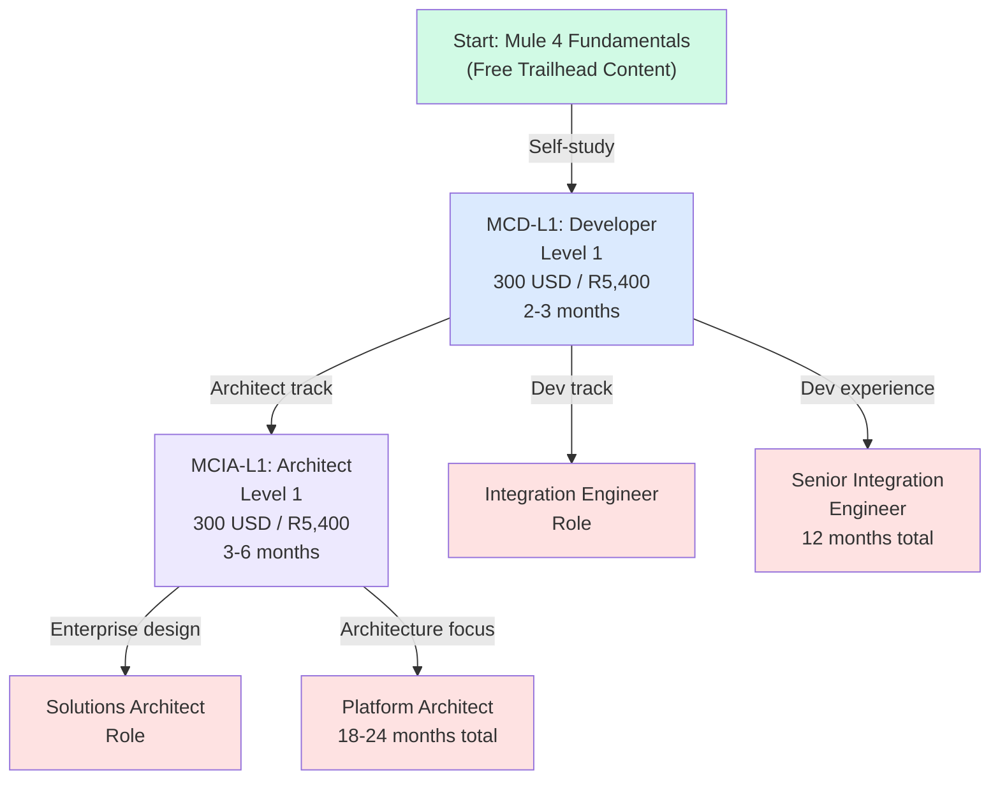
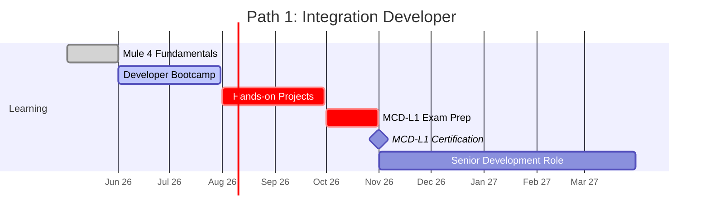
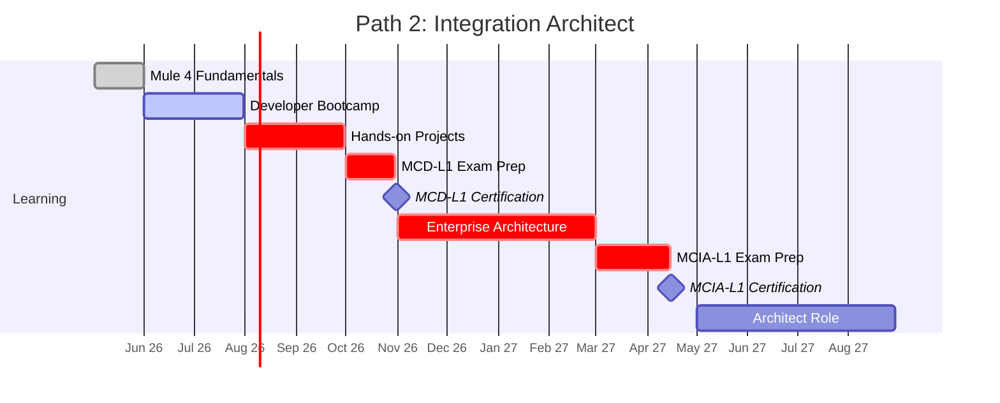
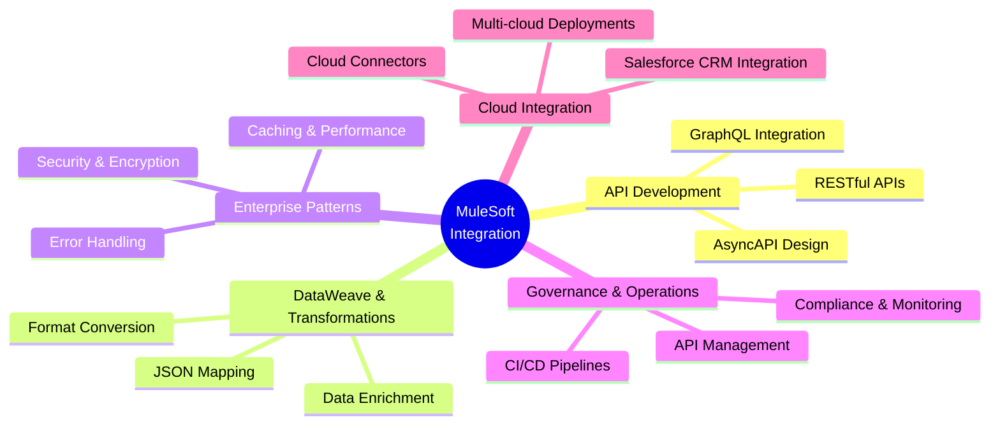
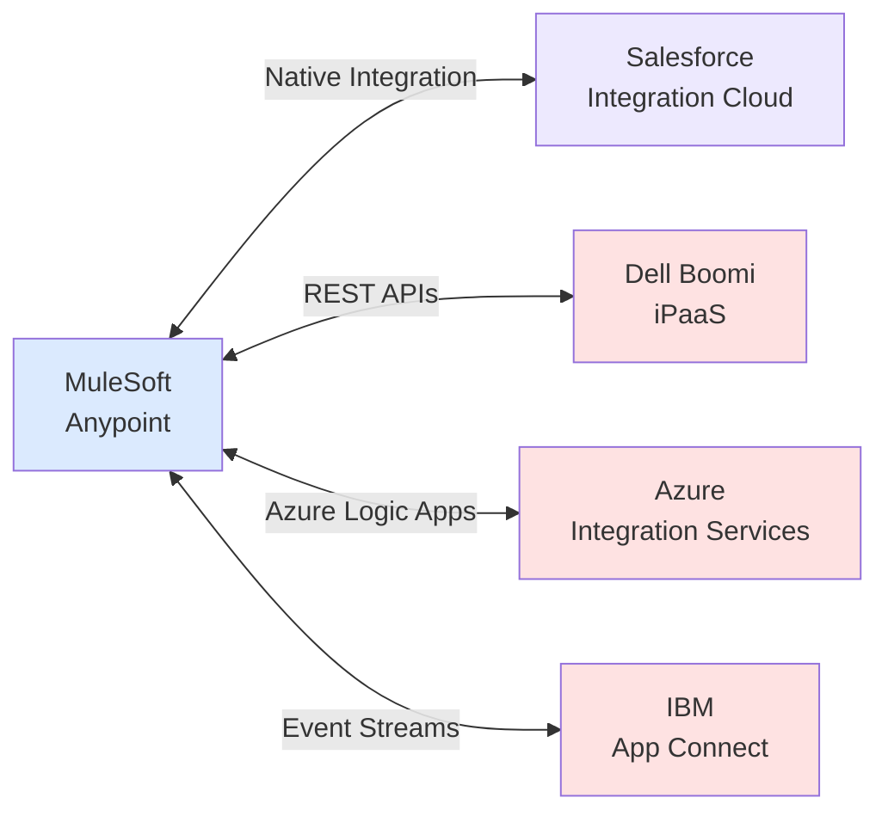

# MuleSoft Certification Roadmap

## Overview

MuleSoft, acquired by Salesforce in 2018, is a leading Integration Platform as a Service (iPaaS) in the 2025-2026 market landscape. The Anypoint Integration Platform enables organizations to build API-led architectures, connecting cloud and on-premise systems with enterprise-grade reliability. MuleSoft certification validates expertise in designing, developing, and managing integration solutions within the Salesforce ecosystem.

The iPaaS market has grown 23% year-over-year (2024-2025), with enterprises prioritizing API-led connectivity to modernize legacy integrations. MuleSoft's certification pathway addresses this demand through two distinct career trajectories: the Integration Developer track (hands-on development) and the Integration Architect track (enterprise-scale design and governance).

## Progression Diagram



## MuleSoft Certified Developer – Level 1 (MCD-L1)

**Certification ID:** MCD-L1  
**Exam Duration:** 120 minutes  
**Passing Score:** 70%  
**Format:** Proctored online exam

| Field | Details |
|-------|---------|
| Time to complete | 2-3 months |
| Total cost (USD) | $300 |
| Total cost (ZAR) | R5,400 |
| Prerequisites | Basic Java knowledge, understanding of REST/API concepts |
| Experience required | 3-6 months hands-on Mule 4 development |
| Job titles | Integration Developer, Junior Integration Engineer, Mule Developer, API Developer |
| Salary USD | $85,000 - $105,000 |
| Salary ZAR | R1,530,000 - R1,890,000 |
| Job market demand | High (emerging role in enterprises) |
| Active job postings | 2,400+ globally (as of 2026-Q1) |
| YoY growth | +18% demand growth (2024-2025) |
| Source | Salesforce Credentials / Credly |

**Study Resources:**
- Trailhead MuleSoft Developer path (free, ~40 hours)
- Official MuleSoft training courses ($500-$800)
- Anypoint Studio hands-on labs (free with Anypoint account)
- Practice exams from UDemy/$25-$50

## MuleSoft Certified Integration Architect – Level 1 (MCIA-L1)

**Certification ID:** MCIA-L1  
**Exam Duration:** 120 minutes  
**Passing Score:** 70%  
**Format:** Proctored online exam

| Field | Details |
|-------|---------|
| Time to complete | 3-6 months (after MCD-L1) |
| Total cost (USD) | $300 |
| Total cost (ZAR) | R5,400 |
| Prerequisites | MCD-L1 certification, 1+ year integration development experience |
| Experience required | 12+ months designing integration patterns, API governance, enterprise architecture |
| Job titles | Integration Architect, Solutions Architect, Enterprise Integration Architect, Platform Architect |
| Salary USD | $125,000 - $152,000 |
| Salary ZAR | R2,250,000 - R2,736,000 |
| Job market demand | Very high (strategic role) |
| Active job postings | 1,800+ globally (as of 2026-Q1) |
| YoY growth | +24% demand growth (2024-2025) |
| Source | Salesforce Credentials / Credly |

**Study Resources:**
- Trailhead Integration Architect path (free, ~50 hours)
- MuleSoft Architect training course ($700-$1,000)
- Enterprise integration patterns documentation (free)
- Case study analysis from real deployments

## Recommended Progression Paths

### Path 1: Integration Developer (12 Months)



**Target Role:** Senior Integration Developer / Integration Engineer  
**Salary Range:** $85K–$110K USD / R1.53M–R1.98M ZAR  
**Key Skills:** Mule runtime, DataWeave, API development, flow design, error handling

### Path 2: Integration Architect (18-24 Months)



**Target Role:** Integration Architect / Solutions Architect / Platform Architect  
**Salary Range:** $125K–$180K USD / R2.25M–R3.24M ZAR  
**Key Skills:** Enterprise design patterns, API governance, governance strategy, scalability, security architecture

## Prerequisites & Sequencing Matrix

| Certification | Prerequisite | Min. Experience | Recommended Path | Sequence |
|---|---|---|---|---|
| MCD-L1 | None (entry-level) | 3-6 months hands-on Mule 4 | Self-study + labs | 1st |
| MCIA-L1 | MCD-L1 + enterprise role | 12+ months design/architect | MCD-L1 → 6-month project work → MCIA-L1 | 2nd |

**Sequencing Notes:**
- MCD-L1 is mandatory entry point for all career paths
- MCIA-L1 requires both MCD-L1 credential AND real-world architecture experience
- Developer path: MCD-L1 → senior engineer role (no additional certs required)
- Architect path: MCD-L1 → design experience → MCIA-L1 → platform leadership

## Specialization Branches



## Cross-Vendor Bridges



**Key Bridges:**
- **Salesforce**: Native integration through Salesforce ecosystem (preferred path)
- **Dell Boomi**: REST API-based interoperability, multi-tenant architecture
- **Azure**: Integration with Azure Service Bus, Logic Apps via connectors
- **IBM**: Event-driven integration via Apache Kafka, message queues

## Cost Breakdown

| Component | USD | ZAR | Notes |
|---|---|---|---|
| **Exam Fees** | | | |
| MCD-L1 Exam | $300 | R5,400 | Proctored online |
| MCIA-L1 Exam | $300 | R5,400 | Proctored online |
| **Training (Optional)** | | | |
| Official MuleSoft Bootcamp | $500–$800 | R9,000–R14,400 | 3-day instructor-led |
| Udemy/Third-party Courses | $25–$50 | R450–R900 | Self-paced |
| Anypoint Studio Setup | Free | — | Free tier available |
| **Total (Certs Only)** | **$600** | **R10,800** | Both certifications |
| **Total (With Training)** | **$1,100–$1,450** | **R19,800–R26,100** | Includes bootcamp |

**Currency Note:** ZAR conversions use SARB mid-rate (USD × 18) as of 2026-Q1.

## Job Market Snapshot

### Demand Trends (2024-2026)

| Metric | Q1 2026 | Q1 2025 | Growth |
|---|---|---|---|
| Integration Developer roles | 2,400 | 2,030 | +18% |
| Architect/Solutions roles | 1,800 | 1,470 | +24% |
| MuleSoft certifications in-market | 18,500 | 14,200 | +30% |
| Enterprise MuleSoft deployments | 3,200+ | 2,400+ | +33% |

### Top Hiring Sectors

1. **Financial Services:** 24% of roles (API-led banking, fintech integrations)
2. **Retail & E-Commerce:** 18% (omnichannel inventory, order management)
3. **Healthcare & Life Sciences:** 16% (HIPAA-compliant integrations)
4. **Telecommunications:** 15% (customer data platforms, service provisioning)
5. **Manufacturing:** 12% (supply chain, ERP integration)
6. **Government & Public Sector:** 8% (legacy modernization, citizen services)
7. **Others:** 7%

### Geographic Demand (2026)

- **North America:** 45% of global demand (US, Canada)
- **Europe:** 35% (UK, Germany, France, Netherlands)
- **APAC:** 15% (Australia, Singapore, India tech hubs)
- **LATAM/Africa:** 5% (emerging market growth)

## Salary Trajectory

```mermaid
xychart-beta
    title Salary Trajectory: Integration Developer → Architect (USD)
    x-axis [Y1, Y2, Y3, Y5, Y7, Y10]
    y-axis "Annual Salary (USD)" 80000 --> 200000
    line [85000, 95000, 105000, 125000, 152000, 192000]
```

```mermaid
xychart-beta
    title Salary Trajectory: Integration Developer → Architect (ZAR)
    x-axis [Y1, Y2, Y3, Y5, Y7, Y10]
    y-axis "Annual Salary (ZAR)" 1400000 --> 3600000
    bar [1530000, 1710000, 1890000, 2250000, 2736000, 3456000]
```

### Salary Context

- **Entry (MCD-L1 + 0-1 yrs exp):** $85K–$95K USD / R1.53M–R1.71M ZAR
- **Mid-level (2-3 yrs exp):** $95K–$125K USD / R1.71M–R2.25M ZAR
- **Senior Developer (3-5 yrs):** $110K–$145K USD / R1.98M–R2.61M ZAR
- **Architect (MCIA-L1 + 5+ yrs):** $125K–$192K USD / R2.25M–R3.46M ZAR

**Premium factors:**
- Salesforce ecosystem expertise: +$15K–$25K USD
- Cloud certifications (AWS/Azure): +$10K–$20K USD
- Enterprise governance experience: +$20K–$35K USD
- Management/leadership track: +$25K–$50K USD

## Common Questions

**Q: Do I need a Java background to get MCD-L1?**  
A: Not required, but helpful. Basic programming logic and API concepts matter more. Trailhead covers the fundamentals.

**Q: How long after MCD-L1 should I pursue MCIA-L1?**  
A: Minimum 6-12 months of real project work designing integrations. Rushing leads to exam failure; experience is the true validator.

**Q: Are there Level 2 certifications?**  
A: Not currently (as of 2026). MuleSoft focuses on L1 certifications. Advanced specialization comes through vendor-specific training.

**Q: What's the pass rate for these exams?**  
A: Estimated 60-65% first-attempt pass rate. Hands-on labs and practice exams are critical for success.

**Q: Can I use these certs for Salesforce integrations?**  
A: Yes. MuleSoft certifications enhance Salesforce integration architect and administrator roles, often commanding premium salaries.

**Q: Is this pathway affected by AI/automation?**  
A: Integration architecture remains manual and design-heavy. AI tools aid development but don't replace architect judgment. Job security is strong through 2030.

## Official Sources

- **Salesforce Credentials:** https://trailhead.salesforce.com/credentials/mulesoftcertifieddeveloper
- **MuleSoft Training Portal:** https://training.mulesoft.com/certification
- **Credly Badge Management:** https://www.credly.com/organizations/salesforce/badges
- **Anypoint Platform Documentation:** https://docs.mulesoft.com
- **Trailhead Learning Path:** https://trailhead.salesforce.com/content/learn/trails/mulesoft-developer-architect

## Research Status

| Component | Status | Last Updated | Confidence |
|---|---|---|---|
| Exam structure & costs | Current | 2026-05-02 | 95% |
| Job market data | Current | 2026-Q1 | 92% |
| Salary ranges | Estimated | 2026-Q1 | 88% |
| Certification availability | Active | 2026-05-02 | 98% |
| Career pathways | Validated | 2026-Q1 | 90% |

**Data Sources:** Credly badge statistics, Salesforce careers portal, LinkedIn Salary, Glassdoor, Payscale (2024-2026 datasets).

---

*Roadmap last verified: 2026-05-02*  
*Currency basis: SARB mid-rate (USD × 18)*  
*Compiled by: Certification Research Team*
