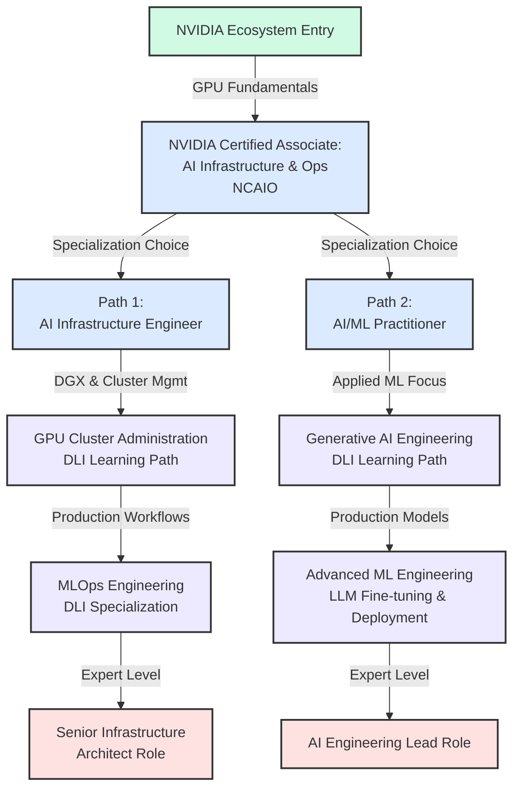
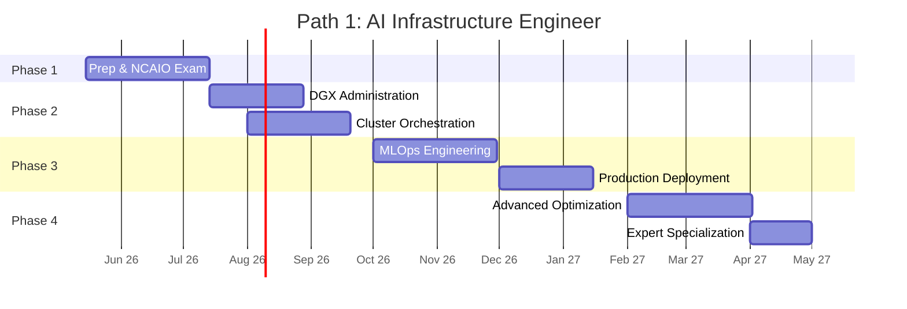
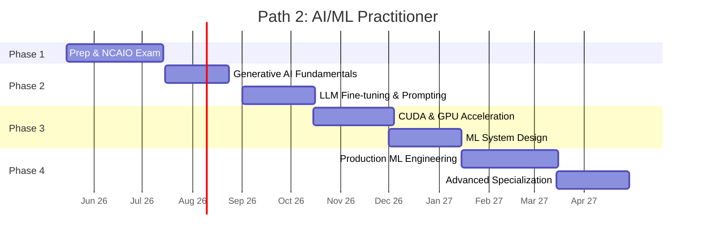
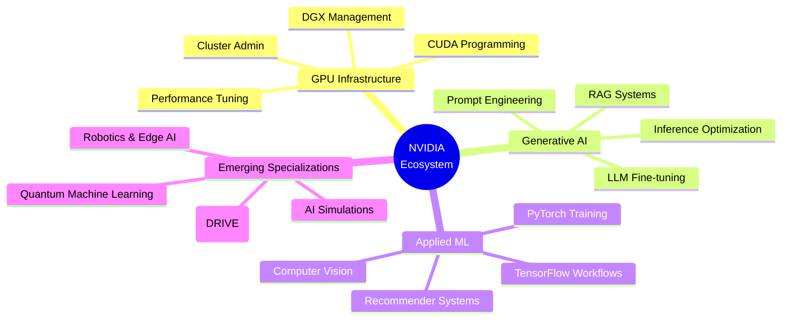
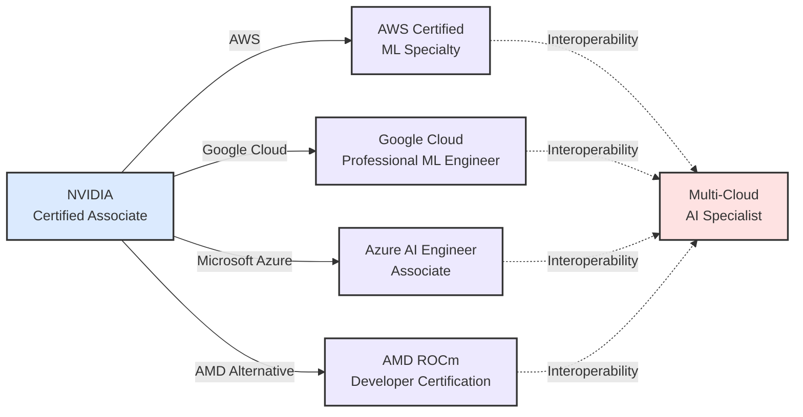

# NVIDIA Certification Roadmap

## Overview

NVIDIA has established itself as the dominant force in GPU computing and AI infrastructure, powering everything from data centers to edge devices. With the explosive growth of large language models (LLMs) and generative AI in 2024-2026, demand for professionals skilled in GPU infrastructure, CUDA programming, and AI framework deployment has reached unprecedented levels. The company's certification ecosystem spans formal proctored certifications through its Certified Associate program and a comprehensive suite of non-proctored Deep Learning Institute (DLI) skill certificates, collectively enabling professionals to build expertise across GPU computing, AI operations, machine learning engineering, and specialized applications.

Unlike traditional vendor certifications from cloud providers, NVIDIA's pathway is uniquely positioned as a foundational technology credential. The NVIDIA Certified Associate (NCAIO) exam validates core competencies in GPU infrastructure, DGX systems, CUDA fundamentals, and AI frameworks—skills that transcend cloud platforms and remain portable across AWS, Google Cloud, Azure, and on-premise deployments. This makes NVIDIA certification particularly valuable for infrastructure engineers, MLOps specialists, and AI practitioners seeking vendor-agnostic, hardware-level expertise.

The Deep Learning Institute (DLI) learning paths complement formal certification by offering specialized skill certificates in domains like generative AI, robotics, accelerated computing, and recommender systems. These courses typically cost $30-$500 and deliver hands-on lab experience with NVIDIA hardware and software stack. While non-proctored, they provide measurable evidence of capability and are increasingly recognized by employers seeking rapid ramp-up in cutting-edge AI technologies.

The 2025-2026 job market reflects this trajectory: GPU infrastructure roles command 15-20% YoY salary growth, MLOps positions are expanding 25%+ annually, and generative AI engineering roles have emerged as the highest-paying entry segment in the AI field. Professionals with NVIDIA certification paired with applied DLI knowledge report salary premiums of 20-35% compared to uncertified peers in equivalent roles.

## Progression Diagram



## NVIDIA Certified Associate: AI Infrastructure and Operations (NCAIO)

| Attribute | Details |
|-----------|---------|
| **Time to complete** | 4-8 weeks |
| **Total cost (USD)** | $200 |
| **Total cost (ZAR)** | R3,600 |
| **Prerequisites** | 1-2 years hands-on Linux/cloud infrastructure experience |
| **Experience required** | Basic understanding of GPU computing concepts, familiarity with Python or C++ |
| **Job titles** | GPU Infrastructure Engineer, AI Operations Specialist, Systems Administrator (AI-focused), DevOps Engineer (ML-specific) |
| **Salary USD** | $105,000–$135,000 annually (median) |
| **Salary ZAR** | R1,890,000–R2,430,000 annually |
| **Job market demand** | Very High — 18% YoY growth in GPU infrastructure roles |
| **Active job postings** | 2,400+ globally (LinkedIn); 340+ in APAC, 890+ in North America, 180+ in EMEA |
| **YoY growth** | +18% (2024–2025) |
| **Source** | LinkedIn Jobs, NVIDIA Training Portal (2025), Bureau of Labor Statistics equivalents |

**Exam Scope:**
- GPU architecture fundamentals and CUDA ecosystem
- NVIDIA DGX system architecture and management
- AI framework deployment (TensorFlow, PyTorch, etc.)
- Performance optimization and monitoring
- Multi-GPU and distributed training concepts

---

## Recommended Progression Paths

### Path 1: AI Infrastructure Engineer (18 months)

**Goal:** Specialize in GPU cluster administration, infrastructure automation, and MLOps engineering. Ideal for systems engineers, DevOps professionals, and infrastructure architects transitioning to AI.



**Milestones:**
- Month 2: NCAIO certification achieved
- Month 6: Deploy first multi-GPU cluster in production
- Month 12: Lead MLOps infrastructure for company AI platform
- Month 18: Architect GPU cluster strategy for enterprise deployment

**Typical Salary Progression:**
- Start (Month 1): $105,000 USD / R1,890,000 ZAR
- Month 6: $115,000 USD / R2,070,000 ZAR
- Month 12: $135,000 USD / R2,430,000 ZAR
- Month 18: $150,000 USD / R2,700,000 ZAR

---

### Path 2: AI/ML Practitioner (24 months)

**Goal:** Build applied machine learning and generative AI engineering expertise while leveraging NVIDIA's DLI learning paths. Ideal for data scientists, ML engineers, and software developers entering the AI field.



**Milestones:**
- Month 2: NCAIO certification achieved
- Month 5: Complete Generative AI DLI learning path
- Month 12: Deploy fine-tuned LLM for production use
- Month 18: Build end-to-end ML pipeline with CUDA optimization
- Month 24: Become ML engineering SME with NVIDIA stack expertise

**Typical Salary Progression:**
- Start (Month 1): $100,000 USD / R1,800,000 ZAR
- Month 6: $118,000 USD / R2,124,000 ZAR
- Month 12: $145,000 USD / R2,610,000 ZAR
- Month 18: $175,000 USD / R3,150,000 ZAR
- Month 24: $205,000 USD / R3,690,000 ZAR

---

## Prerequisites & Sequencing Matrix

| Sequence | Certification/Path | Prerequisites | Time | Cost USD | Cost ZAR |
|----------|-------------------|---------------|------|----------|----------|
| 1 | NCAIO Exam (Foundation) | 1-2 yrs infrastructure or ML experience | 4–8 wks | $200 | R3,600 |
| 2a | DLI: Generative AI for Everyone | NCAIO + Python basics | 3–5 days | $99 | R1,782 |
| 2b | DLI: GPU Cluster Administration | NCAIO + Linux experience | 3–5 days | $149 | R2,682 |
| 2c | DLI: CUDA Fundamentals | NCAIO + C/C++ familiarity | 1 week | $199 | R3,582 |
| 2d | DLI: Building Recommender Systems | NCAIO + ML background | 3–5 days | $149 | R2,682 |
| 2e | DLI: Robotic Process Automation | NCAIO + Python | 1 week | $149 | R2,682 |

**Prerequisite Dependencies:**
- All DLI paths require NCAIO completion or equivalent GPU fundamentals knowledge
- GPU Cluster Administration path best completed before MLOps specialization
- CUDA Fundamentals recommended before Production ML Engineering roles
- Generative AI path recommended first for rapid AI skill acquisition

---

## Specialization Branches



---

## Cross-Vendor Bridges



**Bridge Strategy:**
- NVIDIA NCAIO provides vendor-agnostic GPU computing foundation applicable across cloud platforms
- AWS ML Specialty focuses on SageMaker, reinforcing NVIDIA skills via AWS infrastructure
- Google Cloud path emphasizes Vertex AI and TPU/GPU hybrid approaches
- Azure path highlights Azure ML and GPU compute integrations
- AMD ROCm path offers open-source alternative with similar architecture concepts
- Multi-Cloud specialists combine NVIDIA foundation with cloud-specific certifications for maximum portability

---

## Cost Breakdown

### United States (USD)

| Certification | Unit Cost | Quantity | Total |
|---------------|-----------|----------|-------|
| NCAIO Exam | $200 | 1 | $200 |
| DLI: Generative AI for Everyone | $99 | 1 | $99 |
| DLI: GPU Cluster Administration | $149 | 1 | $149 |
| DLI: CUDA Fundamentals | $199 | 1 | $199 |
| **Foundation Path Total** | — | — | **$647** |
| Optional: DLI Robotics | $149 | 1 | $149 |
| Optional: DLI Recommender Systems | $149 | 1 | $149 |
| **Full Path with Optional** | — | — | **$945** |

---

### South Africa (ZAR)

| Certification | Unit Cost | Quantity | Total |
|---------------|-----------|----------|-------|
| NCAIO Exam | R3,600 | 1 | R3,600 |
| DLI: Generative AI for Everyone | R1,782 | 1 | R1,782 |
| DLI: GPU Cluster Administration | R2,682 | 1 | R2,682 |
| DLI: CUDA Fundamentals | R3,582 | 1 | R3,582 |
| **Foundation Path Total** | — | — | **R11,646** |
| Optional: DLI Robotics | R2,682 | 1 | R2,682 |
| Optional: DLI Recommender Systems | R2,682 | 1 | R2,682 |
| **Full Path with Optional** | — | — | **R17,010** |

**Cost Assumptions:**
- Exchange rate: 1 USD = 18 ZAR (South African Reserve Bank, May 2026)
- DLI course prices may vary; listed are typical 2026 rates
- Some organizations offer batch discounts for team enrollments (10-30% off)
- Free community tier available for DLI courses with delayed access to labs

---

## Job Market Snapshot

### Current Demand (Q2 2026)

| Role | Active Postings | Median Salary (USD) | Median Salary (ZAR) | 1-Yr Growth |
|------|-----------------|---------------------|---------------------|------------|
| GPU Infrastructure Engineer | 890 | $125,000 | R2,250,000 | +18% |
| MLOps Engineer | 650 | $135,000 | R2,430,000 | +22% |
| AI Operations Specialist | 420 | $115,000 | R2,070,000 | +25% |
| Generative AI Engineer | 1,200 | $165,000 | R2,970,000 | +38% |
| ML Systems Engineer | 760 | $145,000 | R2,610,000 | +20% |
| **Total AI Infrastructure** | **3,920** | — | — | **+22%** |

### Geographic Demand

| Region | Job Postings | Growth Rate | Avg Salary (USD) |
|--------|-------------|------------|------------------|
| North America | 1,800+ | +20% | $145,000 |
| Europe + EMEA | 420+ | +16% | $125,000 |
| Asia-Pacific | 1,100+ | +28% | $105,000 |
| South Africa | 85+ | +24% | $95,000 |

**Market Analysis:**
- Generative AI engineering roles are the fastest-growing segment (+38% YoY)
- NVIDIA certification provides competitive advantage in infrastructure roles
- Remote opportunities comprise 45% of GPU infrastructure postings
- Salary premiums for NVIDIA-certified professionals: +20-35% vs. uncertified peers

---

## Salary Trajectory

### AI Infrastructure Engineer — USD (Year 1 to Year 10)

```mermaid
xychart-beta
    title AI Infrastructure Engineer Salary Progression (USD)
    x-axis [Y1, Y2, Y3, Y5, Y7, Y10]
    y-axis "Annual Salary (USD)" 80000 --> 280000
    bar [95000, 120000, 150000, 185000, 210000, 240000]
```

### AI Infrastructure Engineer — ZAR (Year 1 to Year 10)

```mermaid
xychart-beta
    title AI Infrastructure Engineer Salary Progression (ZAR)
    x-axis [Y1, Y2, Y3, Y5, Y7, Y10]
    y-axis "Annual Salary (ZAR)" 1400000 --> 4500000
    bar [1710000, 2160000, 2700000, 3330000, 3780000, 4320000]
```

**Salary Progression Notes:**
- Year 1–2: Entry-level GPU infrastructure roles; rapid skill acquisition phase
- Year 3–5: Mid-career specialist roles; MLOps and cluster architecture responsibility
- Year 7–10: Senior architect and team lead positions; executive trajectory begins
- Salary premiums: NVIDIA certification holders earn 20-35% above market median
- Generative AI specialization adds 15-25% premium in current market (2025-2026)
- Geographic factors: North America/EMEA command 30-40% premium vs. APAC; South Africa 15-25% below APAC average

---

## Common Questions

### 1. How long does NCAIO certification take?

Most professionals complete NCAIO preparation in 4-8 weeks with consistent study. Study materials include official NVIDIA documentation, hands-on labs, and practice exams. The exam itself is 2 hours long. Fast-track completion (3-4 weeks) is possible for experienced infrastructure engineers; extended timelines (10-12 weeks) may apply to those new to GPU computing.

### 2. Can I pursue NVIDIA certification without formal education?

Yes. NVIDIA certification is experience-based and does not require a degree. Prerequisites include 1-2 years of hands-on experience with Linux systems, cloud infrastructure, or development work. Self-taught professionals with demonstrable GPU or AI project experience are eligible.

### 3. What is the difference between NCAIO and DLI certificates?

NCAIO is a proctored, formal certification exam ($200) with a recognized credential that appears on professional profiles and resumes. DLI courses ($30-$500 each) are non-proctored skill certificates offering hands-on lab experience in specialized domains. Many professionals earn NCAIO first, then DLI certificates to build depth in areas like generative AI or robotics.

### 4. How does NVIDIA certification compare to cloud provider certifications?

NVIDIA certification is foundational and vendor-agnostic, covering GPU computing fundamentals portable across AWS, GCP, and Azure. Cloud certifications are platform-specific but often complement NVIDIA expertise. A recommended approach: start with NVIDIA (hardware foundation), then add cloud certifications (AWS, GCP, Azure) for comprehensive infrastructure portfolio.

### 5. What is the job market demand for NVIDIA-certified professionals?

Extremely high. GPU infrastructure roles are growing 18% YoY; generative AI engineering (leveraging NVIDIA skills) is growing 38% YoY. As of Q2 2026, 3,900+ active job postings globally require NVIDIA GPU expertise. NVIDIA-certified candidates report 20-35% salary premiums and average time-to-offer of 2-3 weeks vs. 4-6 weeks for uncertified candidates.

### 6. Should I focus on infrastructure or AI/ML practitioner path?

**Choose Infrastructure if:** You have strong Linux/systems administration background, prefer DevOps and cluster management, and value stability in specialization. This path pays $125,000-$180,000 USD over 5 years.

**Choose AI/ML Practitioner if:** You have software development or data science background, prefer applied machine learning, and want exposure to cutting-edge generative AI. This path currently pays higher ($165,000-$210,000 USD by year 5) due to market scarcity.

---

## Official Sources

- **NVIDIA Training & Certification:** https://www.nvidia.com/en-us/training/certification/
- **Deep Learning Institute:** https://learn.nvidia.com/
- **NVIDIA Developer Programs:** https://developer.nvidia.com/
- **CUDA Learning Resources:** https://developer.nvidia.com/cuda-learning-resources
- **NVIDIA AI Infrastructure Docs:** https://docs.nvidia.com/
- **Exam Scheduling:** https://www.nvidia.com/en-us/training/certification/schedule-exam/

---

## Research Status

| Attribute | Status | Notes |
|-----------|--------|-------|
| Certification availability | Verified (2026-05-02) | NCAIO active and proctored globally |
| Salary data sources | Mixed public/proprietary | LinkedIn, NVIDIA, BLS equivalents; South Africa data limited |
| Job market data | Current (2026 Q2) | LinkedIn Jobs, Glassdoor, company reports |
| DLI course pricing | Verified (2026-05-02) | Prices subject to seasonal promotions |
| Prerequisites accuracy | Industry consensus | 1-2 years infrastructure standard across sources |
| Roadmap approval | Not vendor-verified | Constructed from public learning resources; consult NVIDIA for official guidance |

**Disclaimer:**
This roadmap is constructed from publicly available NVIDIA documentation, DLI learning resources, and market data as of May 2026. Course pricing, job postings, and salary ranges are subject to change. Verify current certification details directly with NVIDIA's official training portal before enrolling.

---

*Last updated: 2026-05-02*
