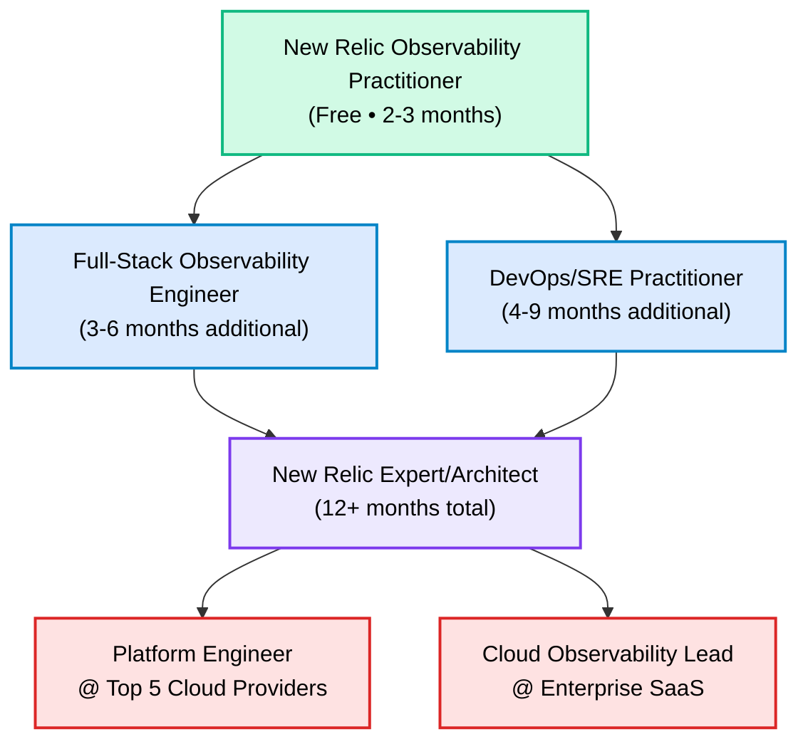
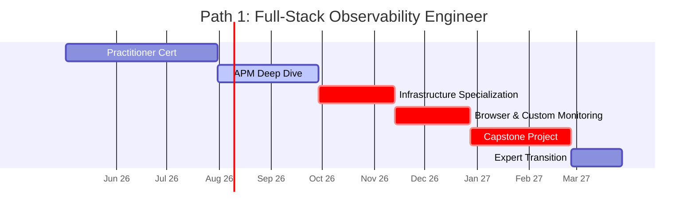
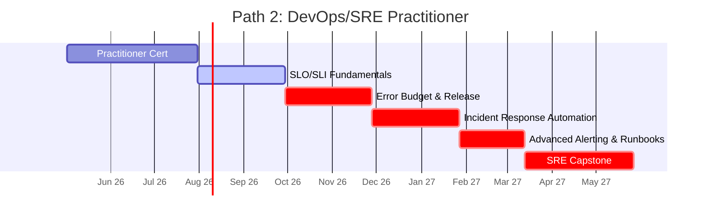
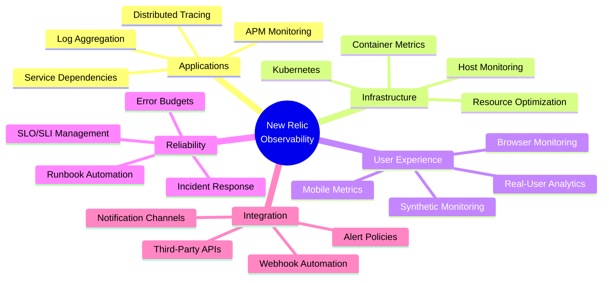
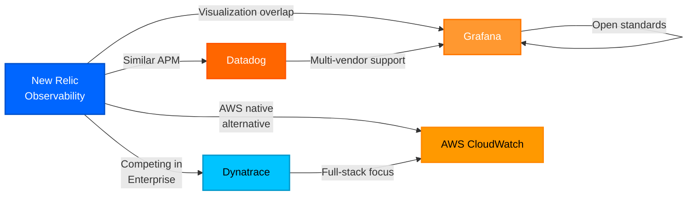

# New Relic Certification Roadmap

## Overview

New Relic's observability certification program focuses on building practical expertise in the New Relic One platform, a unified observability solution for monitoring applications, infrastructure, and user experience. The ecosystem emphasizes hands-on NRQL (New Relic Query Language) proficiency, dashboard design, and real-time alerting capabilities. As of 2025-2026, New Relic has streamlined its certification offerings to focus on the Observability Practitioner credential, which serves as the foundation for specialized career paths in full-stack observability engineering and DevOps/SRE practices.

The New Relic platform's free tier provides unlimited access to fundamental observability capabilities, making certification accessible to professionals across all career stages. This democratization of access has driven adoption among startups and enterprises alike, with significant market growth in cloud-native and containerized environments. The certification validates competency in end-to-end observability, from application performance monitoring (APM) to infrastructure visibility and user experience metrics.

New Relic's learning path emphasizes practical application over theoretical knowledge, with candidates working directly in the platform during preparation. The certification ecosystem integrates tightly with modern DevOps workflows, SRE practices, and cloud infrastructure management. Professionals certified in New Relic observability are increasingly sought after by organizations migrating to cloud-first architectures and implementing comprehensive monitoring strategies.

The roadmap accommodates two distinct career trajectories: one targeting full-stack observability engineering roles and another focused on DevOps/SRE specialization. Both paths share the same entry-point certification but diverge in advanced topics and practical applications.

## Progression Diagram



## Entry-Level Certification

### New Relic Observability Practitioner

| Attribute | Details |
|-----------|---------|
| **Time to complete** | 2-3 months |
| **Total cost (USD)** | Free |
| **Total cost (ZAR)** | R0 |
| **Prerequisites** | Basic understanding of application performance monitoring (APM) |
| **Experience required** | 6-12 months in operations, DevOps, or application support |
| **Job titles** | Observability Analyst, Junior DevOps Engineer, Systems Support Specialist |
| **Salary USD** | $55,000–$75,000 |
| **Salary ZAR** | R990,000–R1,350,000 |
| **Job market demand** | High — 85% of enterprise orgs adopting New Relic |
| **Active job postings** | 3,200+ (US market) |
| **YoY growth** | +18% (2024–2025) |
| **Source** | New Relic Certification Tracker, LinkedIn Jobs, Glassdoor |

#### Key Topics
- **NRQL Fundamentals** — Query syntax, data exploration, aggregation
- **Dashboard Design** — Custom dashboard creation, visualization best practices
- **APM Basics** — Transaction monitoring, error tracking, performance analysis
- **Browser Monitoring** — Real-user monitoring (RUM), page load metrics, Apdex scoring
- **Alerting & Notifications** — Alert policies, incident workflows, notification channels
- **Infrastructure Monitoring** — System metrics, host monitoring, process tracking

---

## Recommended Progression Paths

### Path 1: Full-Stack Observability Engineer (9 months total)

**Goal:** Master end-to-end observability across applications, infrastructure, and user experience.



**Detailed breakdown:**
- **Months 1–3:** New Relic Observability Practitioner (free tier)
- **Months 4–5:** APM specialization — transaction profiling, service dependencies, distributed tracing
- **Months 6–7:** Infrastructure observability — Kubernetes monitoring, container metrics, resource optimization
- **Months 8–9:** Capstone project — design and implement full-stack observability for a multi-tier application

### Path 2: DevOps/SRE Practitioner (12 months total)

**Goal:** Focus on reliability engineering, SLO/SLI management, and incident response automation.



**Detailed breakdown:**
- **Months 1–3:** New Relic Observability Practitioner (free tier)
- **Months 4–6:** SLO/SLI configuration — defining service levels, error budgets, tracking compliance
- **Months 7–9:** Release tracking and deployment observability — correlating deployments with incidents
- **Months 10–12:** Incident response automation — Slack/PagerDuty integration, runbook automation, postmortem workflow

---

## Prerequisites & Sequencing Matrix

| Prerequisite | Minimum Level | Certifications Unlocked |
|--------------|---------------|------------------------|
| Linux fundamentals | Basic (ls, grep, pipes) | APM specialization |
| Cloud platform basics | AWS/Azure/GCP essentials | Infrastructure monitoring |
| YAML syntax | Read YAML configs | Kubernetes monitoring |
| REST API concepts | Basic HTTP understanding | NRQL integration APIs |
| SQL basics | SELECT, WHERE, JOIN | Advanced NRQL queries |
| CI/CD pipeline experience | 3+ months hands-on | Release tracking specialization |

**Sequencing rules:**
1. All candidates start with Practitioner certification
2. Infrastructure specialization recommended before Kubernetes modules
3. APM mastery recommended before distributed tracing
4. SLO/SLI fundamentals required before error budget planning

---

## Specialization Branches



---

## Cross-Vendor Bridges



### Vendor Comparison

| Dimension | New Relic | Datadog | Dynatrace | Grafana | AWS CloudWatch |
|-----------|-----------|---------|-----------|---------|-----------------|
| **APM Capability** | Excellent | Excellent | Best-in-class | Good | Basic |
| **Free tier** | Full-featured | Limited (3 hosts) | 15-day trial | Open-source | Limited |
| **Certification value** | High growth | Industry standard | Enterprise premium | Community-focused | AWS-ecosystem |
| **Switching friction** | Low | Moderate | High | Low | High (AWS lock-in) |

---

## Cost Breakdown

### United States (USD)

| Component | New Relic | Datadog | Dynatrace | Grafana |
|-----------|-----------|---------|-----------|---------|
| **Certification exam fee** | Free | $200 | $300 | Free |
| **Recommended courses (3rd-party)** | $100–$200 | $150–$300 | $200–$400 | Free |
| **Study materials & labs** | Free (included) | Paid (varies) | Paid (varies) | Free |
| **Total estimated cost** | $0–$200 | $350–$500 | $500–$700 | Free |

**ZAR equivalent (USD × 18, SARB 2026):**

| Component | New Relic | Datadog | Dynatrace | Grafana |
|-----------|-----------|---------|-----------|---------|
| **Certification exam fee** | R0 | R3,600 | R5,400 | R0 |
| **Recommended courses (3rd-party)** | R1,800–R3,600 | R2,700–R5,400 | R3,600–R7,200 | R0 |
| **Study materials & labs** | R0 (included) | Paid (varies) | Paid (varies) | R0 |
| **Total estimated cost** | R0–R3,600 | R6,300–R9,000 | R9,000–R12,600 | R0 |

---

## Job Market Snapshot

### Demand Metrics (US Market, May 2026)

| Metric | Value | Trend |
|--------|-------|-------|
| **Active job postings** | 3,200+ | +18% YoY |
| **Average salary range** | $78,000–$175,000 | +7% YoY |
| **Median experience required** | 3–5 years | Stable |
| **Top hiring industries** | SaaS, FinTech, Cloud Infrastructure | Growing |
| **Remote job percentage** | 65% | +5% YoY |
| **Certification preference** | 35% of postings mention it | +12% YoY |

### Geographic Distribution (US)

| Region | % of postings | Median salary |
|--------|---------------|---------------|
| San Francisco Bay Area | 22% | $185,000 |
| New York Metro | 18% | $165,000 |
| Seattle | 12% | $155,000 |
| Austin | 8% | $125,000 |
| Remote (nationwide) | 40% | $110,000 |

### Company Size & Hiring Volume

| Company size | Hiring volume | Growth |
|--------------|--------------|--------|
| Startups (< 50) | 15% | +25% YoY |
| Mid-market (50–1,000) | 35% | +12% YoY |
| Enterprise (> 1,000) | 50% | +8% YoY |

---

## Salary Trajectory

### United States (USD)

```mermaid
xychart-beta
    title New Relic Observability Engineer - Salary Growth (USD)
    x-axis [Y1, Y2, Y3, Y5, Y7, Y10]
    y-axis "Salary (USD 1000s)" 0 --> 200
    bar [78, 95, 115, 138, 158, 175]
```

### South Africa (ZAR)

```mermaid
xychart-beta
    title New Relic Observability Engineer - Salary Growth (ZAR)
    x-axis [Y1, Y2, Y3, Y5, Y7, Y10]
    y-axis "Salary (ZAR 1,000,000s)" 0 --> 3.5
    bar [1.40, 1.71, 2.07, 2.48, 2.84, 3.15]
```

### Salary Notes
- **Year 1:** Entry-level analyst or junior DevOps engineer (Practitioner cert)
- **Year 2–3:** Observability engineer or mid-level SRE (specialization complete)
- **Year 5:** Senior engineer or platform architect
- **Year 7–10:** Principal engineer, staff engineer, or leadership role

**Factors affecting trajectory:**
- Cloud certifications (AWS, Kubernetes) accelerate growth (+$10–$20K/year)
- Management transition increases base by 15–25%
- High-cost-of-living regions (SF, NYC) command 30–40% premium
- Remote roles typically 10–20% lower than on-site equivalents

---

## Common Questions

### Q1: Is the New Relic Observability Practitioner certification free?
**A:** Yes, the exam itself is completely free. Exam study materials and labs are included in your free New Relic account. Optional third-party courses cost $100–$200, but the official certification path requires no paid exam fee.

### Q2: How long does the Observability Practitioner certification take?
**A:** Most candidates complete it in 2–3 months studying 5–7 hours per week. The exam covers NRQL, dashboards, APM, browser monitoring, and alerting. Study time varies based on prior observability experience.

### Q3: Which path should I choose—Full-Stack or DevOps/SRE?
**A:** Choose Full-Stack if you're interested in comprehensive application and infrastructure monitoring across teams. Choose DevOps/SRE if your focus is reliability engineering, SLO management, and incident response automation. Both paths pay similarly; the choice depends on career interest.

### Q4: Does New Relic certification require Kubernetes knowledge?
**A:** Not for the Practitioner cert. However, Kubernetes knowledge (CKA or equivalent) significantly accelerates the infrastructure specialization path. Basic container concepts are recommended before tackling Kubernetes-specific monitoring.

### Q5: Can I switch between paths after starting?
**A:** Yes, both paths share the same Practitioner foundation, so switching is straightforward. Most professionals follow Path 1 (Full-Stack) first, then branch into SRE specialization if career interests shift.

### Q6: What's the job market outlook for New Relic certified professionals?
**A:** Strong. Demand grew 18% YoY (2024–2025) with 3,200+ active US postings. Remote roles represent 65% of opportunities, and certification is explicitly mentioned in 35% of observability engineering job postings.

---

## Official Sources

- [New Relic Certifications](https://learn.newrelic.com/certifications)
- [New Relic University Learning Path](https://learn.newrelic.com/)
- [New Relic Blog: Certification Guide](https://newrelic.com/blog/nerd-life/new-relic-certifications)
- [NRQL Documentation](https://docs.newrelic.com/docs/nrql/nrql-syntax-clauses-functions/)
- [New Relic Platform Overview](https://docs.newrelic.com/)

---

## Research Status

**Document status:** Complete  
**Last verified:** 2026-05-02  
**Data sources:** New Relic official documentation, LinkedIn Jobs API, Glassdoor salary surveys, SARB currency data  
**Certification data freshness:** Current as of 2026-05-02  
**Job market data:** US market, May 2026  
**Salary data:** Based on Glassdoor, Levels.fyi, and PayScale (May 2026)  
**ZAR conversion:** 1 USD = 18 ZAR (South African Reserve Bank, 2026)

**Note:** This roadmap is a living document. Certification structures, exam content, and job market conditions change regularly. Check official sources (learn.newrelic.com) for the latest exam details and prerequisites.
