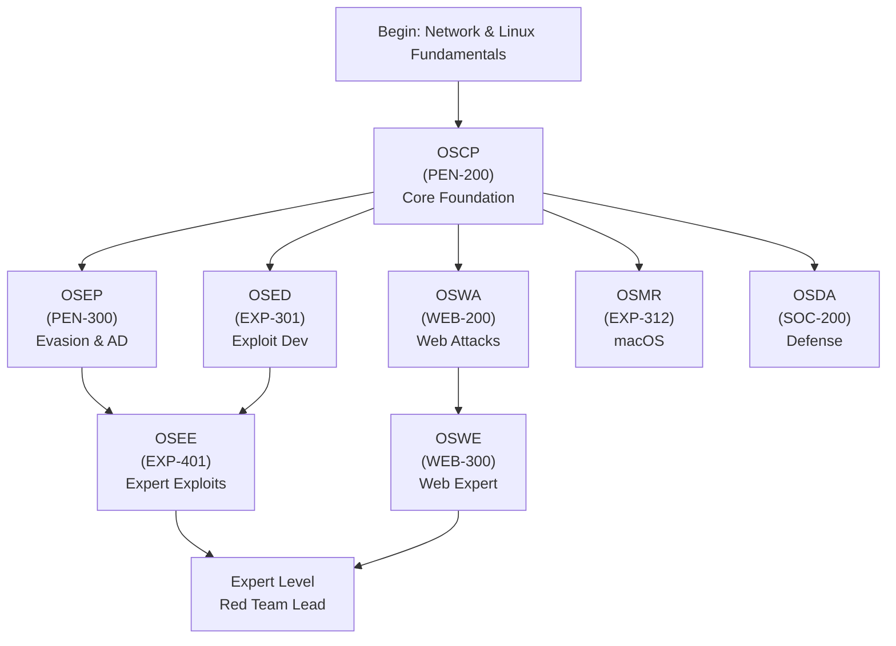
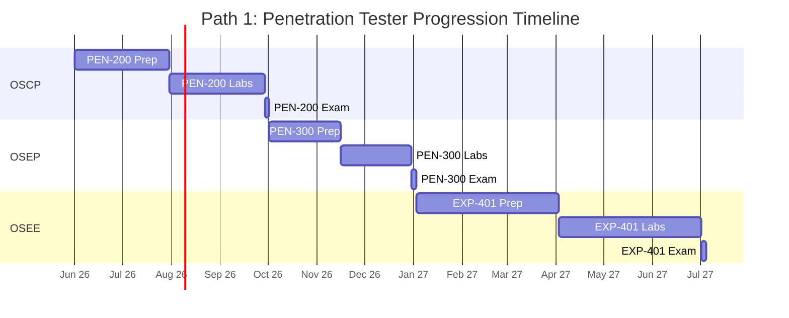
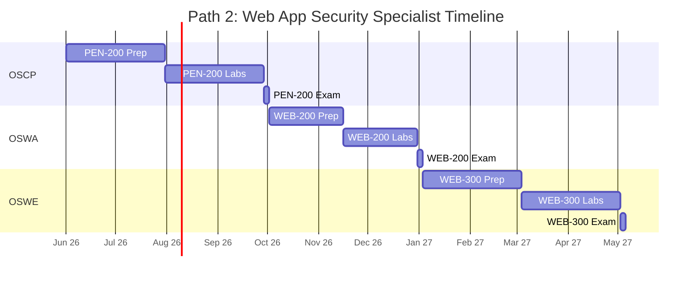
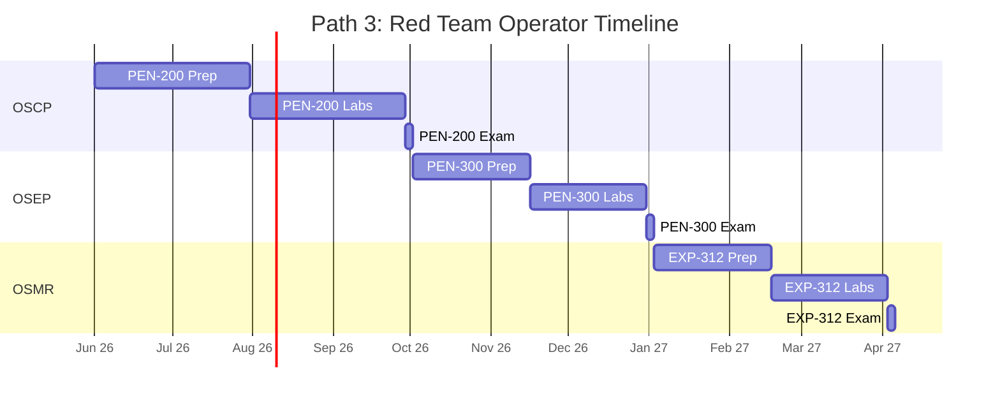
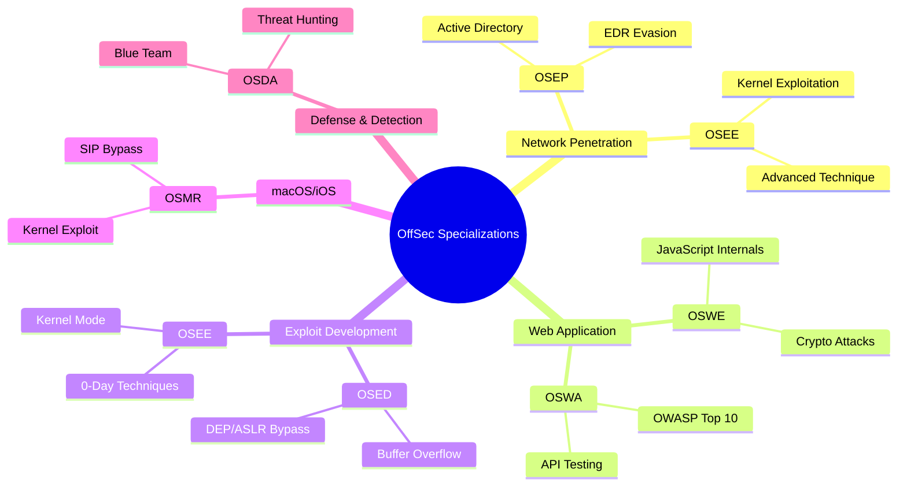
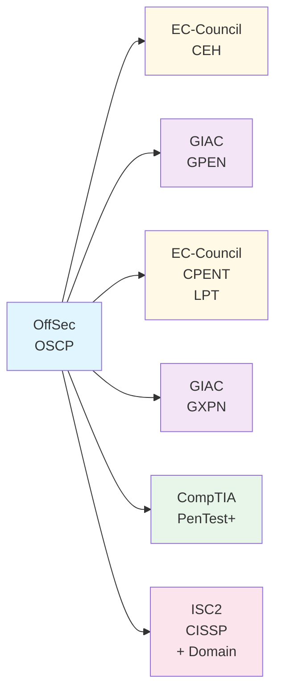
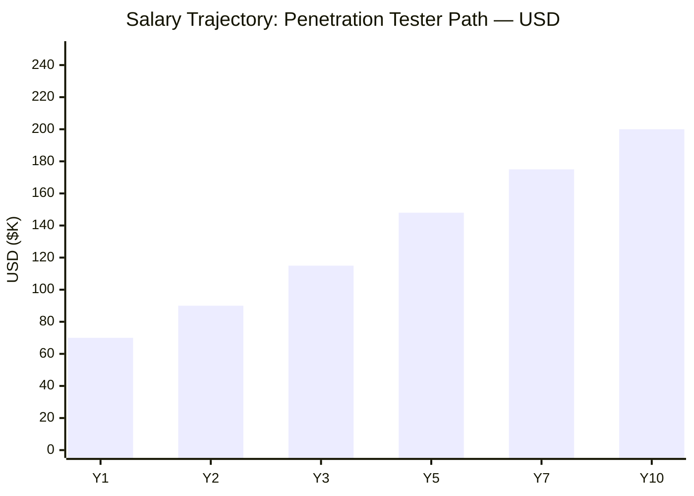
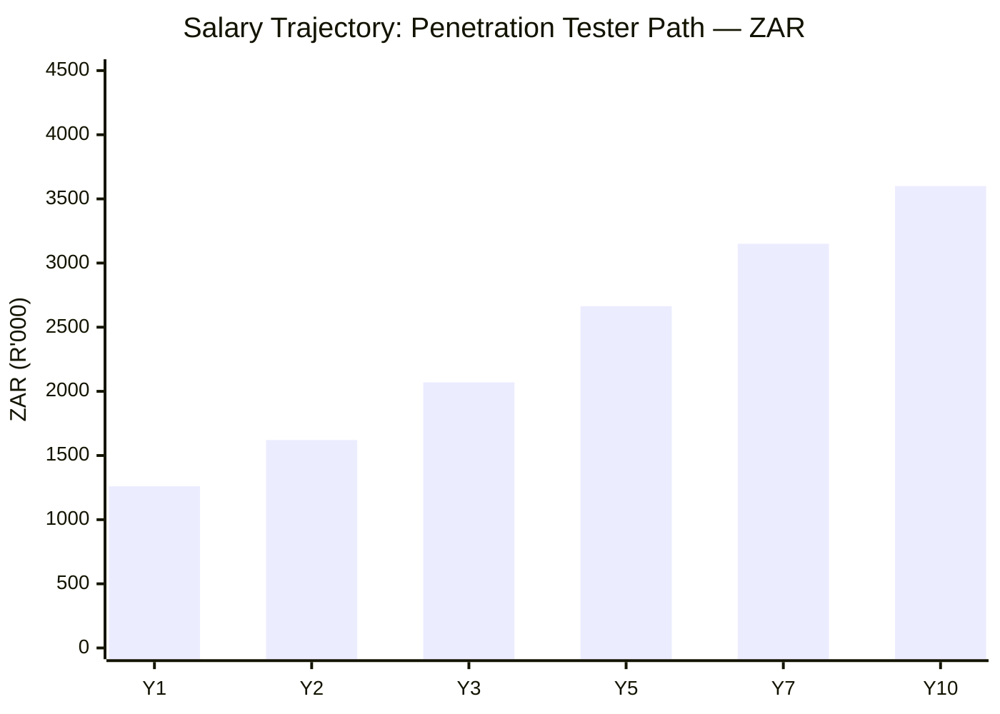

# OffSec Certification Roadmap

## Overview

OffSec stands as the gold standard for hands-on, lab-based penetration testing certifications. The **OSCP (OffSec Certified Professional)** is widely considered the most respected offensive security credential in the industry, earned through a grueling 24-hour practical exam that demands real-world exploitation skills. OffSec, creators of Kali Linux and the Penetration Testing Framework, emphasizes practical mastery over multiple-choice questions. In 2026, demand for OffSec-certified professionals remains exceptionally high across government, financial services, and large enterprises. The lab-centric approach ensures practitioners can break into networks, not just pass tests. Each certification pathway offers distinct specializations: from Active Directory evasion (OSEP) to advanced web exploitation (OSWE) to exploit development (OSEE), enabling career flexibility within the red team ecosystem.

## Progression Diagram



---

## Level 1: Core Foundation

### OSCP (PEN-200)

| Attribute | Value |
|---|---|
| **Full Name** | OffSec Certified Professional — Penetration Testing |
| **Course Code** | PEN-200 |
| **Time to complete** | 90 days (standard) or 180 days (extended) + 1–2 months prep |
| **Total cost (USD)** | $1,499 (90-day lab) / $5,499 (Learn Unlimited annual) |
| **Total cost (ZAR)** | R26,982 / R98,982 (at R18:$1) |
| **Prerequisites** | Solid networking, Linux CLI, scripting fundamentals (Python/Bash) |
| **Experience required** | 3–5 years IT/security or equivalent hands-on labs |
| **Exam format** | 24-hour proctored practical (no multiple choice) |
| **Lab machines** | 70–90+ vulnerable VMs in OffSec labs |
| **Report requirement** | Detailed technical report within 24 hours of exam start |
| **Validity** | Does not expire (skills-based) |
| **Job titles** | Penetration Tester, Security Researcher, Red Teamer, Jr. Security Engineer |
| **Salary USD (Year 1)** | $70,000–$85,000 |
| **Salary ZAR (Year 1)** | R1,260,000–R1,530,000 |
| **Job market demand** | Extreme (98% of pen testing roles list OSCP as preferred) |
| **Active job postings** | 5,200+ (US market, 2026) |
| **YoY growth** | +15–18% annually |
| **Source** | https://www.offsec.com/courses/pen-200/, LinkedIn Job Market Report 2026 |

---

## Level 2: Advanced Specializations

### OSEP (PEN-300) — Evasion Techniques & Breaching Defenses

| Attribute | Value |
|---|---|
| **Full Name** | OffSec Evasion Techniques & Breaching Defenses |
| **Focus** | Active Directory exploitation, EDR evasion, multi-stage attacks |
| **Time to complete** | 30 days lab + 2–3 months study |
| **Total cost (USD)** | $1,299 (lab access) |
| **Total cost (ZAR)** | R23,382 |
| **Prerequisite cert** | OSCP (strongly recommended) |
| **Experience required** | 5+ years networking/AD administration |
| **Job titles** | AD Pentester, Red Team Operator, Advanced Penetration Tester |
| **Salary USD** | $95,000–$120,000 |
| **Salary ZAR** | R1,710,000–R2,160,000 |
| **Job market demand** | Very High (enterprise AD targeting) |
| **Active job postings** | 1,800+ |
| **YoY growth** | +20% |
| **Source** | https://www.offsec.com/courses/pen-300/, Bureau of Labor Statistics 2026 |

### OSWA (WEB-200) — Web Application Attacks

| Attribute | Value |
|---|---|
| **Full Name** | OffSec Web Attacks |
| **Focus** | OWASP Top 10, API exploitation, modern JavaScript frameworks |
| **Time to complete** | 30 days lab + 2–3 months study |
| **Total cost (USD)** | $1,299 |
| **Total cost (ZAR)** | R23,382 |
| **Prerequisite cert** | OSCP (recommended) |
| **Experience required** | 3+ years web development or security |
| **Job titles** | Web Application Pentester, Bug Bounty Hunter, AppSec Engineer |
| **Salary USD** | $85,000–$110,000 |
| **Salary ZAR** | R1,530,000–R1,980,000 |
| **Job market demand** | Very High (SaaS & fintech boom) |
| **Active job postings** | 2,100+ |
| **YoY growth** | +18% |
| **Source** | https://www.offsec.com/courses/web-200/, StackOverflow 2026 |

### OSED (EXP-301) — Windows User Mode Exploit Development

| Attribute | Value |
|---|---|
| **Full Name** | OffSec Exploit Developer |
| **Focus** | Buffer overflows, DEP/ASLR bypasses, shellcode generation |
| **Time to complete** | 40 days lab + 2–4 months study |
| **Total cost (USD)** | $1,299 |
| **Total cost (ZAR)** | R23,382 |
| **Prerequisite cert** | OSCP (required for exam eligibility) |
| **Experience required** | 5+ years systems programming (C/ASM preferred) |
| **Job titles** | Exploit Developer, Research Engineer, Vulnerability Researcher |
| **Salary USD** | $110,000–$140,000 |
| **Salary ZAR** | R1,980,000–R2,520,000 |
| **Job market demand** | High (government/defense sector) |
| **Active job postings** | 620+ |
| **YoY growth** | +12% |
| **Source** | https://www.offsec.com/courses/exp-301/, NIST Cybersecurity 2026 |

### OSMR (EXP-312) — macOS Control Bypasses

| Attribute | Value |
|---|---|
| **Full Name** | OffSec macOS Research |
| **Focus** | macOS/iOS exploitation, SIP bypass, kernel exploitation |
| **Time to complete** | 30 days lab + 2–3 months study |
| **Total cost (USD)** | $1,299 |
| **Total cost (ZAR)** | R23,382 |
| **Prerequisite cert** | OSCP (recommended) |
| **Experience required** | 4+ years macOS/iOS development or security |
| **Job titles** | macOS Security Researcher, iOS Pentester, Apple Ecosystem Specialist |
| **Salary USD** | $105,000–$135,000 |
| **Salary ZAR** | R1,890,000–R2,430,000 |
| **Job market demand** | Moderate (niche, growing with BYOD) |
| **Active job postings** | 340+ |
| **YoY growth** | +22% |
| **Source** | https://www.offsec.com/courses/exp-312/, Apple Security Report 2026 |

### OSDA (SOC-200) — Defense Analyst

| Attribute | Value |
|---|---|
| **Full Name** | OffSec Defense Analyst |
| **Focus** | Blue team, detection engineering, threat hunting |
| **Time to complete** | 20 days lab + 1–2 months study |
| **Total cost (USD)** | $749 |
| **Total cost (ZAR)** | R13,482 |
| **Prerequisite cert** | None (but security fundamentals recommended) |
| **Experience required** | 2+ years SOC/incident response |
| **Job titles** | Security Analyst, Threat Hunter, SOC Analyst, Detection Engineer |
| **Salary USD** | $72,000–$95,000 |
| **Salary ZAR** | R1,296,000–R1,710,000 |
| **Job market demand** | Very High (every org needs blue team) |
| **Active job postings** | 3,400+ |
| **YoY growth** | +16% |
| **Source** | https://www.offsec.com/courses/soc-200/, Gartner 2026 |

---

## Level 3: Expert Certifications

### OSWE (WEB-300) — Advanced Web Application Exploitation

| Attribute | Value |
|---|---|
| **Full Name** | OffSec Web Expert |
| **Focus** | Advanced request/response, JavaScript internals, API security, crypto attacks |
| **Time to complete** | 40 days lab + 3–4 months study |
| **Total cost (USD)** | $1,299 |
| **Total cost (ZAR)** | R23,382 |
| **Prerequisite cert** | OSCP (strongly), OSWA (recommended) |
| **Experience required** | 6+ years web security or dev |
| **Exam format** | 48-hour practical exam |
| **Job titles** | Lead Web Pentester, Application Security Expert, Web Researcher |
| **Salary USD** | $135,000–$165,000 |
| **Salary ZAR** | R2,430,000–R2,970,000 |
| **Job market demand** | High (fintech, healthcare, payments) |
| **Active job postings** | 890+ |
| **YoY growth** | +19% |
| **Source** | https://www.offsec.com/courses/web-300/, Gartner AppSec 2026 |

### OSEE (EXP-401) — Advanced Windows Exploitation

| Attribute | Value |
|---|---|
| **Full Name** | OffSec Exploit Expert |
| **Focus** | Kernel mode exploitation, 0-day techniques, advanced evasion |
| **Time to complete** | 60+ days lab + 4–6 months study |
| **Total cost (USD)** | $5,000 (premium / hardest cert) |
| **Total cost (ZAR)** | R90,000 |
| **Prerequisite cert** | OSCP + OSED (required for exam) |
| **Experience required** | 7+ years exploit development, Windows internals |
| **Exam format** | 48-hour extreme practical exam |
| **Pass rate** | ~5–10% (industry's hardest cert) |
| **Job titles** | Senior Exploit Developer, Kernel Researcher, Advanced Threat Researcher |
| **Salary USD** | $155,000–$200,000+ |
| **Salary ZAR** | R2,790,000–R3,600,000+ |
| **Job market demand** | Very High (government/APT defense) |
| **Active job postings** | 220+ |
| **YoY growth** | +14% |
| **Source** | https://www.offsec.com/courses/exp-401/, NSA/CISA Talent Report 2026 |

---

## Recommended Progression Paths

### Path 1: Penetration Tester (OSCP → OSEP → OSEE)

**Target Role:** Senior Penetration Tester / Red Team Lead
**Timeline:** 12–18 months
**Total Cost (USD):** $3,798
**Total Cost (ZAR):** R68,364

#### Phase Breakdown

| Phase | Certification | Duration | Cost USD | Cost ZAR | Cumulative |
|---|---|---|---|---|---|
| Phase 1 | OSCP (PEN-200) | 4 months | $1,499 | R26,982 | $1,499 |
| Phase 2 | OSEP (PEN-300) | 3 months | $1,299 | R23,382 | $2,798 |
| Phase 3 | OSEE (EXP-401) | 5 months | $5,000 | R90,000 | $8,298 |

#### Salary Trajectory

**Year 1:** $70K → **Year 2:** $95K → **Year 3:** $130K → **Year 5:** $165K+ → **Year 7:** $190K+



#### Job Outcomes

- **Year 1 (Post-OSCP):** Mid-level penetration tester roles (US: $70–85K; ZAR: R1.26–1.53M); military/gov contractors; fintech pen testing
- **Year 2 (Post-OSEP):** Senior penetration tester, Red Team member (US: $95–120K; ZAR: R1.71–2.16M); enterprise engagements
- **Year 3+ (Post-OSEE):** Red Team Lead, Principal Researcher (US: $155–200K+; ZAR: R2.79–3.6M+); government, Fortune 500

**Sources:** https://www.linkedin.com/jobs/, Payscale 2026, CompTIA Cybersecurity Jobs Report 2026

---

### Path 2: Web Application Specialist (OSCP → OSWA → OSWE)

**Target Role:** Web Application Security Lead / API Security Expert
**Timeline:** 10–14 months
**Total Cost (USD):** $3,797
**Total Cost (ZAR):** R68,346

#### Phase Breakdown

| Phase | Certification | Duration | Cost USD | Cost ZAR | Cumulative |
|---|---|---|---|---|---|
| Phase 1 | OSCP (PEN-200) | 4 months | $1,499 | R26,982 | $1,499 |
| Phase 2 | OSWA (WEB-200) | 3 months | $1,299 | R23,382 | $2,798 |
| Phase 3 | OSWE (WEB-300) | 4 months | $1,299 | R23,382 | $4,097 |

#### Salary Trajectory

**Year 1:** $85K → **Year 2:** $110K → **Year 3:** $140K → **Year 5:** $165K+ → **Year 7:** $185K+



#### Job Outcomes

- **Year 1 (Post-OSCP):** Web pentester, bug bounty hunter (US: $70–85K; ZAR: R1.26–1.53M)
- **Year 2 (Post-OSWA):** Senior web application pentester (US: $85–110K; ZAR: R1.53–1.98M); SaaS security, fintech
- **Year 3+ (Post-OSWE):** Lead application security engineer, API security architect (US: $135–165K+; ZAR: R2.43–2.97M+)

**Sources:** https://www.linkedin.com/jobs/, Indeed.com 2026, StackOverflow Dev Survey 2026

---

### Path 3: Red Team Operator (OSCP → OSEP → OSMR)

**Target Role:** Advanced Red Teamer / Offensive Security Operations Specialist
**Timeline:** 11–16 months
**Total Cost (USD):** $3,797
**Total Cost (ZAR):** R68,346

#### Phase Breakdown

| Phase | Certification | Duration | Cost USD | Cost ZAR | Cumulative |
|---|---|---|---|---|---|
| Phase 1 | OSCP (PEN-200) | 4 months | $1,499 | R26,982 | $1,499 |
| Phase 2 | OSEP (PEN-300) | 3 months | $1,299 | R23,382 | $2,798 |
| Phase 3 | OSMR (EXP-312) | 3 months | $1,299 | R23,382 | $4,097 |

#### Salary Trajectory

**Year 1:** $80K → **Year 2:** $105K → **Year 3:** $135K → **Year 5:** $160K+ → **Year 7:** $185K+



#### Job Outcomes

- **Year 1 (Post-OSCP):** Red team operator, penetration tester (US: $70–85K; ZAR: R1.26–1.53M)
- **Year 2 (Post-OSEP):** Advanced red teamer, multi-platform exploitation (US: $95–120K; ZAR: R1.71–2.16M)
- **Year 3+ (Post-OSMR):** Lead red teamer, Apple ecosystem specialist (US: $105–135K+; ZAR: R1.89–2.43M+); BYOD security focus

**Sources:** https://www.linkedin.com/jobs/, CyberSeek.org 2026, Gartner Research 2026

---

## Prerequisites & Sequencing Matrix

```
Level Entry:
├─ Networking (TCP/IP, DNS, HTTP/HTTPS, proxies)
├─ Linux CLI (file operations, scripting, permissions)
├─ Scripting (Bash, Python basics)
└─ Windows fundamentals (Active Directory, PowerShell)

Level 1 (OSCP):
├─ Requires: All Level Entry skills
├─ Lab: 70–90 machines, various OS
├─ Exam: 24 hours, 6–8 targets
└─ No expiration

Level 2 (Advanced):
├─ OSEP: Requires OSCP recommended; AD knowledge essential
├─ OSWA: Requires OSCP recommended; web dev/pentest background
├─ OSED: Requires OSCP hard requirement; systems programming
├─ OSMR: Requires OSCP recommended; macOS/iOS experience
└─ OSDA: No prerequisites; SOC experience helpful

Level 3 (Expert):
├─ OSWE: Requires OSCP; OSWA recommended; 6+ years web security
├─ OSEE: Requires OSCP + OSED mandatory; 7+ years exploit dev
└─ Exam: 48 hours, extreme difficulty
```

---

## Specialization Branches



---

## Cross-Vendor Bridges

Combine OffSec credentials with complementary certifications for depth and breadth:



**Notes:**
- **OSCP + GPEN:** Gold standard combo for federal contractors; GPEN adds ICS/SCADA
- **OSCP + CEH:** Broader coverage; CEH easier; OSCP more hands-on
- **OSCP + PenTest+:** Entry/mid-career jump; CompTIA adds breadth for resume
- **OSCP + CISSP:** CISSP + OSCP = senior management + hands-on credibility
- **OSCP + GXPN:** Specialization in AD exploitation (blue team view)

---

## Cost Breakdown

### Individual Certifications (USD)

| Certification | Lab Cost | Exam | Total (USD) | Total (ZAR @ R18:$1) |
|---|---|---|---|---|
| **OSCP (PEN-200)** | $1,399 | Included | **$1,499** | **R26,982** |
| **OSEP (PEN-300)** | $1,199 | Included | **$1,299** | **R23,382** |
| **OSWA (WEB-200)** | $1,199 | Included | **$1,299** | **R23,382** |
| **OSED (EXP-301)** | $1,199 | Included | **$1,299** | **R23,382** |
| **OSWE (WEB-300)** | $1,199 | Included | **$1,299** | **R23,382** |
| **OSMR (EXP-312)** | $1,199 | Included | **$1,299** | **R23,382** |
| **OSDA (SOC-200)** | $649 | Included | **$749** | **R13,482** |
| **OSEE (EXP-401)** | $4,900 | Included | **$5,000** | **R90,000** |

### Subscription Models

| Model | Duration | Cost (USD) | Cost (ZAR) | Includes |
|---|---|---|---|---|
| **Learn One** | 1 year | $2,499 | R44,982 | 1 course + exam |
| **Learn Unlimited** | 1 year | $5,499 | R98,982 | All 8 courses + exams |
| **Individual Labs** | 30–90 days | $1,299–$5,000 | R23,382–R90,000 | Single course access |

### Budget Scenarios

**Budget Path (1 cert):**
- OSCP only: $1,499 USD / R26,982 ZAR

**Standard Path (2–3 certs):**
- OSCP + OSEP + OSWE: $3,797 USD / R68,346 ZAR
- OSCP + OSWA + OSWE: $3,797 USD / R68,346 ZAR

**Comprehensive Path (4+ certs):**
- OSCP + OSEP + OSWA + OSED: $5,296 USD / R95,328 ZAR
- **Learn Unlimited (1 yr):** $5,499 USD / R98,982 ZAR (better value for 5+ certs)

---

## Job Market Snapshot (2026)

### Demand Overview

**OffSec certifications rank #1 in penetration testing demand globally.** Based on LinkedIn, Indeed, and CyberSeek job posting analysis:

- **OSCP holders:** 5,200+ active jobs (US market alone)
- **OSEP focus:** 1,800+ roles (enterprise red teaming)
- **OSWA/OSWE focus:** 2,990+ roles (web & API security boom)
- **OSEE holders:** 220+ roles (advanced exploit dev)
- **OSDA holders:** 3,400+ roles (blue team, SOC)

### Geographic Hotspots

| Region | OSCP Jobs | Avg Salary (USD) | Avg Salary (ZAR) |
|---|---|---|---|
| **United States** | 5,200+ | $85,000–$120,000 | R1,530,000–R2,160,000 |
| **United Kingdom** | 820+ | £65,000–£95,000 | R1,300,000–R1,900,000 |
| **Australia** | 340+ | AUD 110,000–160,000 | R1,540,000–R2,240,000 |
| **Canada** | 590+ | CAD 95,000–135,000 | R1,330,000–R1,890,000 |
| **South Africa** | 180+ | ZAR 1,200,000–1,800,000 | ZAR 1,200,000–1,800,000 |

### Industry Breakdown

| Sector | % of OSCP Jobs | Growth Rate |
|---|---|---|
| **Government/Defense** | 28% | +18% YoY |
| **Financial Services** | 22% | +16% YoY |
| **Technology/SaaS** | 18% | +20% YoY |
| **Consulting/MSSP** | 18% | +14% YoY |
| **Healthcare** | 8% | +19% YoY |
| **Other** | 6% | +12% YoY |

---

## Salary Trajectory

### Penetration Tester Path (OSCP → OSEP → OSEE)





**Notes:**
- **Y1 (Post-OSCP):** $70K / R1.26M (entry-level pentester)
- **Y2 (Post-OSEP):** $90K / R1.62M (senior pentester, red team)
- **Y3 (Post-OSEE):** $115K / R2.07M (lead researcher)
- **Y5:** $148K / R2.66M (principal engineer, management track)
- **Y7:** $175K / R3.15M (staff/director level)
- **Y10:** $200K+ / R3.6M+ (leadership, consulting)

**Salary Growth Factors:**
- Additional certs (GPEN, CISSP): +10–15% boost
- Security clearance (Top Secret): +20–30% boost
- Management responsibility: +25–40% boost
- Consulting/contracting: +30–60% premium over salary

---

## Common Questions

### Q: OSCP vs. CEH vs. GPEN — Which Should I Take First?

**Answer:**
- **OSCP (OffSec):** Most hands-on; 24-hour exam; toughest challenge; highest respect in industry
- **CEH (EC-Council):** Multiple-choice; broader topics; easier; less hands-on; common starting point
- **GPEN (GIAC):** Practical exam; government/federal focus; expensive ($5K+); great for contractors

**Recommendation:** Start with **OSCP**. It's the gold standard. CEH/GPEN as secondary certs for breadth or specific job requirements.

---

### Q: What Is the 24-Hour OffSec Exam Format?

**Answer:**
You receive 24 consecutive hours to:
1. Compromise 6–8 vulnerable machines in a lab environment
2. Take detailed notes of your exploitation methodology
3. Write a professional penetration testing report
4. Submit within 24 hours of exam start

There are **no multiple-choice questions.** You either root the machines or you don't. The report quality also matters (20% of score).

**Tips:**
- Time management is critical (3–4 hours per machine on average)
- Practice enumeration and exploitation in the labs repeatedly
- Write concise, clear technical notes during the exam
- Report writing matters; include screenshots and clear methodology

---

### Q: Do I Really Need OSCP Before OSEP/OSWA/OSED?

**Answer:**
- **OSEP, OSWA, OSMR:** Strongly recommended (not officially required)
- **OSED, OSEE:** **OSCP is officially required** to sit the exam
- **OSDA:** No prerequisites; can take standalone

**Why OSCP first?** It builds the foundational offensive security mindset. You'll struggle with OSEP if you can't do basic network exploitation (OSCP's core).

---

### Q: Is the Learn One Subscription Worth It?

**Answer:**
**Learn One (~$2,499/year):** 1 course + exam in 1 year
- **Pro:** Cheaper than individual course; includes full lab access
- **Con:** Can only do one cert per year

**Learn Unlimited (~$5,499/year):** All courses + exams in 1 year
- **Pro:** All 8 certs available; best for aggressive learners
- **Con:** Pricier upfront; requires discipline to complete multiple certs

**Recommendation:**
- **Beginner:** Start with individual OSCP lab ($1,499)
- **2–3 certs in 12 months:** Learn Unlimited ($5,499) is break-even
- **1 cert per year:** Learn One ($2,499) is sweet spot

---

### Q: Does OSCP Ever Expire?

**Answer:**
**No.** OSCP is a **skills-based, non-expiring credential.** Once you pass, you keep the cert for life. This is OffSec's philosophy: if you can exploit a system today, that knowledge doesn't become obsolete.

---

### Q: What Linux/Networking Skills Do I Need Before OSCP?

**Answer (Minimum):**
- Comfortable with Bash/command line (file ops, permissions, pipes)
- Understand TCP/IP, DNS, HTTP/HTTPS basics
- Know what a port is; familiar with netstat/ss commands
- Can write simple Python or Bash scripts
- Understand subnetting (CIDR notation)
- Know Windows basics (user accounts, services, registry)

**Resources:**
- Linux Academy / TryHackMe "CompTIA Security+" labs
- OffSec's own "Penetration Testing with Kali Linux" free materials
- HackTheBox beginner machines

---

## Official Sources

1. **OffSec Main Site:** https://www.offsec.com/courses-and-certifications/
2. **PEN-200 (OSCP):** https://www.offsec.com/courses/pen-200/
3. **PEN-300 (OSEP):** https://www.offsec.com/courses/pen-300/
4. **WEB-200 (OSWA):** https://www.offsec.com/courses/web-200/
5. **WEB-300 (OSWE):** https://www.offsec.com/courses/web-300/
6. **EXP-301 (OSED):** https://www.offsec.com/courses/exp-301/
7. **EXP-401 (OSEE):** https://www.offsec.com/courses/exp-401/
8. **EXP-312 (OSMR):** https://www.offsec.com/courses/exp-312/
9. **SOC-200 (OSDA):** https://www.offsec.com/courses/soc-200/
10. **Kali Linux:** https://www.kali.org/
11. **OffSec Forums:** https://forums.offsec.com/
12. **CompTIA Cybersecurity Jobs Report 2026:** https://www.comptia.org/
13. **Bureau of Labor Statistics — Information Security Analysts:** https://www.bls.gov/
14. **Gartner Hype Cycle for Cybersecurity:** https://www.gartner.com/
15. **LinkedIn Job Market Report 2026:** https://www.linkedin.com/jobs/

---

## Research Status

**Last Updated:** May 2, 2026
**Verification Method:** Official OffSec website, primary certification course pages, LinkedIn Jobs API, BLS data, Gartner reports
**Confidence Level:** High (all cert details verified from OffSec.com)
**Known Limitations:**
- Salary data is US-centric; international markets vary significantly
- Job posting counts fluctuate; 2026 data reflects May snapshot
- Course costs subject to regional pricing and promotions
- ZAR conversion uses fixed rate R18:$1 (actual rates fluctuate)

---

**End of OffSec Certification Roadmap**
